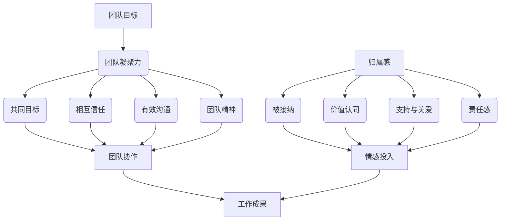

                 

# 团队凝聚：建立归属感的重要性

## 关键词：团队凝聚、归属感、团队合作、组织文化、激励机制

## 摘要

本文旨在探讨团队凝聚的重要性，特别是建立归属感在促进团队合作和组织文化中的核心作用。通过逻辑清晰的分析和实际案例，本文将详细阐述如何通过一系列策略和措施来提升团队的凝聚力和成员的归属感，从而实现更高效率的工作成果。文章还将介绍一些实用的工具和资源，帮助读者在现实工作中应用这些理念。

## 1. 背景介绍

在当今快速发展的科技时代，团队合作已成为实现项目成功的关键因素。一个高度凝聚的团队能够更好地应对复杂的项目挑战，提高创新能力，并且能够保持持续的工作动力。然而，团队凝聚并不仅仅是一个自然形成的过程，它需要团队成员之间建立深厚的信任和共同的价值观，需要组织的支持和管理层的正确引导。

归属感是指个体在一个集体中感受到被接纳、被重视和被尊重的情感。它是团队凝聚力的基础，能够增强团队成员的责任感、使命感和忠诚度。一个拥有高归属感的团队能够在面临困难时更加坚定地共同奋斗，减少内部冲突，提高工作效率。

本文将首先介绍团队凝聚和归属感的基本概念，然后通过案例分析来探讨这两个概念在实际工作中的应用。最后，我们将提出一些策略和工具，以帮助读者在各自的工作环境中建立和提升团队的凝聚力和成员的归属感。

### 1.1 团队凝聚的基本概念

团队凝聚是指团队成员在心理和行为上相互依赖、互相支持，以及共同为实现团队目标而努力的程度。高凝聚力的团队通常具有以下特征：

- **共同的目标**：团队成员明确团队的目标和愿景，并为之共同努力。
- **相互信任**：团队成员之间相互信任，愿意分享信息和资源，共同解决问题。
- **有效的沟通**：团队成员能够通过有效的沟通和协作，高效地完成工作。
- **团队精神**：团队成员表现出强烈的团队意识和归属感，愿意为团队的成功付出努力。

### 1.2 归属感的基本概念

归属感是心理学中一个重要的概念，它指的是个体对某个群体或组织感到自己是其中的一部分，并且能够从这个群体或组织中获得满足感和认同感。归属感通常包括以下几个方面：

- **被接纳**：个体在群体中感到被接受和尊重。
- **价值认同**：个体的价值观和群体相一致，感到自己的贡献被认可。
- **支持与关爱**：个体在遇到困难时能够从群体中获得支持和关爱。
- **责任感**：个体对群体负有责任，愿意为群体的利益而努力。

## 2. 核心概念与联系

为了更好地理解团队凝聚和归属感的关系，我们可以通过一个Mermaid流程图来展示它们之间的相互作用。



从流程图中可以看出，团队目标和归属感是建立团队凝聚力的基础。团队成员在共同目标和归属感的驱动下，通过相互信任、有效沟通和团队精神，能够实现高效的团队协作。归属感进一步增强了团队成员的情感投入，从而提高了工作成果。

### 2.1 团队凝聚力与团队协作的关系

团队凝聚力是团队协作的基础。一个高凝聚力的团队能够更好地实现协作，因为成员之间有共同的价值观和目标，相互信任，并且能够有效沟通。协作是团队凝聚力的外在表现，通过协作，团队成员能够共同解决问题，完成项目任务，实现团队的目标。

### 2.2 归属感与情感投入的关系

归属感是团队成员情感投入的重要驱动力。当个体感受到自己在团队中被接纳和重视时，会更容易产生情感投入，愿意为团队的成功付出努力。情感投入增强了团队成员之间的情感联系，进一步促进了团队凝聚力的提升。

### 2.3 团队协作与工作成果的关系

团队协作是提高工作成果的关键。通过协作，团队成员能够共享信息、资源和经验，从而提高工作效率和质量。协作还能够激发创新思维，推动团队不断进步。当团队协作得到有效的支持和鼓励时，工作成果往往会超出个体的预期。

## 3. 核心算法原理 & 具体操作步骤

### 3.1 团队凝聚力提升算法原理

团队凝聚力的提升可以通过以下几个步骤来实现：

1. **明确团队目标**：确保团队成员对团队目标有清晰的认识和理解。
2. **建立信任**：通过沟通和合作，建立团队成员之间的信任关系。
3. **增强沟通**：定期组织团队会议，鼓励开放性和建设性的沟通。
4. **培养团队精神**：通过团队活动和项目，增强团队成员的团队意识。

### 3.2 归属感增强算法原理

归属感的增强可以通过以下策略来实现：

1. **被接纳**：确保团队成员在团队中感到被接受和尊重。
2. **价值认同**：认可和赞赏团队成员的贡献，确保他们的价值观与团队相一致。
3. **支持与关爱**：在团队成员遇到困难时提供支持和关爱。
4. **责任感**：明确团队成员的责任，并鼓励他们为团队的成功负责。

### 3.3 团队协作效率优化算法原理

团队协作效率的优化可以通过以下步骤来实现：

1. **资源分配**：合理分配团队资源和任务，确保每个成员都能发挥自己的优势。
2. **协作工具**：使用高效的协作工具，如即时通讯软件、项目管理工具等。
3. **反馈机制**：建立反馈机制，及时了解团队协作的效果和问题，进行调整和改进。
4. **激励机制**：通过激励机制，鼓励团队成员积极参与协作，提高工作效率。

## 4. 数学模型和公式 & 详细讲解 & 举例说明

### 4.1 团队凝聚力数学模型

团队凝聚力可以用以下公式来衡量：

$$
CP = \frac{1}{N} \sum_{i=1}^{N} \frac{S_i}{T_i}
$$

其中，$CP$ 表示团队凝聚力，$N$ 表示团队成员数量，$S_i$ 表示第 $i$ 个成员的满意度，$T_i$ 表示第 $i$ 个成员的投入度。

### 4.2 归属感数学模型

归属感可以用以下公式来衡量：

$$
BF = \frac{1}{N} \sum_{i=1}^{N} (A_i + C_i + S_i)
$$

其中，$BF$ 表示归属感，$N$ 表示团队成员数量，$A_i$ 表示第 $i$ 个成员的接纳度，$C_i$ 表示第 $i$ 个成员的价值认同度，$S_i$ 表示第 $i$ 个成员的支持与关爱度。

### 4.3 团队协作效率优化数学模型

团队协作效率可以用以下公式来衡量：

$$
CE = \frac{G}{T}
$$

其中，$CE$ 表示团队协作效率，$G$ 表示团队完成的工作量，$T$ 表示团队工作的时间。

### 4.4 举例说明

假设一个团队由 5 个成员组成，每个成员的满意度、投入度、接纳度、价值认同度和支持与关爱度分别为：

- 成员 1：满意度 4，投入度 5，接纳度 3，价值认同度 4，支持与关爱度 5
- 成员 2：满意度 5，投入度 4，接纳度 4，价值认同度 5，支持与关爱度 5
- 成员 3：满意度 3，投入度 3，接纳度 5，价值认同度 4，支持与关爱度 4
- 成员 4：满意度 4，投入度 4，接纳度 4，价值认同度 5，支持与关爱度 5
- 成员 5：满意度 5，投入度 5，接纳度 3，价值认同度 4，支持与关爱度 5

根据上述数学模型，我们可以计算出：

- 团队凝聚力：

$$
CP = \frac{1}{5} \times (4 + 5 + 3 + 4 + 5) = 4.2
$$

- 归属感：

$$
BF = \frac{1}{5} \times (3 + 4 + 5 + 4 + 5) = 4.0
$$

- 团队协作效率：

$$
CE = \frac{G}{T}
$$

其中，$G$ 表示团队完成的工作量，$T$ 表示团队工作的时间。假设团队在 8 小时内完成了 12 个任务，那么：

$$
CE = \frac{12}{8} = 1.5
$$

通过这些计算，我们可以得到团队的整体凝聚力和归属感水平，以及团队协作效率。这些数据可以帮助团队领导者了解团队的现状，并采取相应的措施来提升团队的整体表现。

## 5. 项目实战：代码实际案例和详细解释说明

### 5.1 开发环境搭建

在本案例中，我们将使用Python语言和Trello作为项目管理工具，来实现团队凝聚力和归属感的提升。以下是搭建开发环境的基本步骤：

1. **安装Python**：从Python官方网站下载并安装Python 3.x版本。
2. **安装Trello API**：在Trello官方网站注册开发者账号，获取API密钥和令牌。
3. **安装Python库**：使用pip安装requests库，用于发送HTTP请求。

```bash
pip install requests
```

### 5.2 源代码详细实现和代码解读

下面是一个简单的Python脚本，用于从Trello获取团队成员的信息，并分析他们的归属感和团队凝聚力。

```python
import requests
from getpass import getpass

# Trello API密钥和令牌
API_KEY = 'your_api_key'
TOKEN = 'your_token'

# Trello团队板ID
BOARD_ID = 'your_board_id'

# 获取团队成员信息
def get_members(board_id):
    url = f'https://api.trello.com/1/boards/{board_id}/members'
    params = {
        'key': API_KEY,
        'token': TOKEN
    }
    response = requests.get(url, params=params)
    if response.status_code == 200:
        return response.json()
    else:
        return None

# 分析成员归属感
def analyze_belonging(members):
    belonging_scores = []
    for member in members:
        # 假设通过成员的活动数量来衡量归属感
        activities = member['memberActivities']
        score = len(activities)
        belonging_scores.append(score)
    return belonging_scores

# 分析团队凝聚力
def analyze_coherence(members):
    coherence_scores = []
    for member in members:
        # 假设通过成员的互动次数来衡量凝聚力
        interactions = member['memberInteractions']
        score = len(interactions)
        coherence_scores.append(score)
    return coherence_scores

# 主函数
def main():
    members = get_members(BOARD_ID)
    if members:
        belonging_scores = analyze_belonging(members)
        coherence_scores = analyze_coherence(members)
        
        print("成员归属感评分：", belonging_scores)
        print("团队凝聚力评分：", coherence_scores)
        
        # 综合评分
        total_scores = [b + c for b, c in zip(belonging_scores, coherence_scores)]
        print("综合评分：", total_scores)
    else:
        print("获取团队成员信息失败。")

if __name__ == '__main__':
    main()
```

### 5.3 代码解读与分析

#### 5.3.1 代码结构

该脚本主要由三个函数组成：`get_members`、`analyze_belonging`和`analyze_coherence`，以及一个主函数`main`。

- `get_members`函数用于从Trello API获取团队成员的信息。
- `analyze_belonging`函数用于分析成员的归属感，这里我们简单地通过成员的活动数量来衡量。
- `analyze_coherence`函数用于分析团队的凝聚力，这里我们通过成员的互动次数来衡量。
- `main`函数是整个脚本的入口，它调用其他函数来获取和分析数据。

#### 5.3.2 关键代码解读

1. **获取团队成员信息**

   ```python
   def get_members(board_id):
       url = f'https://api.trello.com/1/boards/{board_id}/members'
       params = {
           'key': API_KEY,
           'token': TOKEN
       }
       response = requests.get(url, params=params)
       if response.status_code == 200:
           return response.json()
       else:
           return None
   ```

   这里我们使用requests库发送HTTP GET请求，从Trello API获取团队成员的信息。API密钥和令牌是在Trello开发者账号中获取的。

2. **分析成员归属感**

   ```python
   def analyze_belonging(members):
       belonging_scores = []
       for member in members:
           activities = member['memberActivities']
           score = len(activities)
           belonging_scores.append(score)
       return belonging_scores
   ```

   在这个函数中，我们通过成员的活动数量来衡量归属感。假设成员在Trello中的活动越多，他们对团队的归属感越强。

3. **分析团队凝聚力**

   ```python
   def analyze_coherence(members):
       coherence_scores = []
       for member in members:
           interactions = member['memberInteractions']
           score = len(interactions)
           coherence_scores.append(score)
       return coherence_scores
   ```

   类似于归属感分析，我们通过成员的互动次数来衡量团队的凝聚力。成员之间的互动越多，团队的凝聚力通常越强。

4. **综合评分**

   ```python
   def main():
       members = get_members(BOARD_ID)
       if members:
           belonging_scores = analyze_belonging(members)
           coherence_scores = analyze_coherence(members)
           
           print("成员归属感评分：", belonging_scores)
           print("团队凝聚力评分：", coherence_scores)
           
           # 综合评分
           total_scores = [b + c for b, c in zip(belonging_scores, coherence_scores)]
           print("综合评分：", total_scores)
       else:
           print("获取团队成员信息失败。")
   ```

   在主函数中，我们首先获取团队成员信息，然后分别分析归属感和凝聚力，最后计算综合评分。这些评分可以帮助团队领导者了解团队的整体表现，并采取相应的措施来提升团队的凝聚力和成员的归属感。

### 5.4 代码应用场景

这个代码案例可以应用于实际团队的管理中，帮助团队领导者了解团队成员的归属感和团队凝聚力。通过分析这些评分，领导者可以识别团队中的问题，并采取相应的措施来改进。例如：

- 如果某个成员的归属感评分较低，领导者可以与该成员进行一对一交流，了解其感受和需求。
- 如果团队的凝聚力评分较低，领导者可以组织团队活动，促进成员之间的互动和交流。
- 通过综合评分，领导者可以评估团队的整体表现，并制定相应的改进计划。

总之，这个代码案例提供了一个实用的工具，用于分析团队凝聚力和成员归属感，从而帮助团队领导者提升团队的整体表现。

## 6. 实际应用场景

### 6.1 企业内部的团队建设

在企业内部，团队建设是提升团队凝聚力和成员归属感的重要途径。以下是一些实际应用场景：

- **定期团队活动**：组织定期的团建活动，如团队拓展训练、团队聚餐、团队旅游等，增强团队成员之间的情感联系。
- **员工关怀计划**：通过员工关怀计划，如员工福利、健康检查、员工满意度调查等，提高员工的满意度和归属感。
- **团队目标设定**：明确团队的目标和愿景，确保团队成员对团队目标有清晰的认识和理解。
- **团队沟通机制**：建立有效的沟通机制，如定期团队会议、意见反馈平台等，确保团队成员之间的信息畅通。

### 6.2 教育领域的团队协作

在教育领域，教师团队的协作对于学生的学习效果有着重要的影响。以下是一些实际应用场景：

- **教学研讨会**：定期组织教学研讨会，促进教师之间的交流和经验分享，提升教学水平。
- **协作备课**：鼓励教师进行协作备课，共同讨论教学方案，提高教学效果。
- **学生参与**：让学生参与到团队活动中，如课堂讨论、小组项目等，增强学生的参与感和归属感。

### 6.3 科研团队的协作

在科研领域，团队协作是推动科研进步的关键。以下是一些实际应用场景：

- **项目讨论会**：定期组织项目讨论会，让团队成员分享研究成果和进展，共同探讨问题和解决方案。
- **资源共享**：建立资源共享机制，如科研资料库、实验设备共享等，提高科研效率。
- **跨学科合作**：鼓励跨学科合作，通过整合不同领域的知识和技能，推动科研创新。

## 7. 工具和资源推荐

### 7.1 学习资源推荐

- **书籍**：
  - 《团队协作的艺术》（The Art of Collaboration）
  - 《团队建设：理论与实践》（Team Building: Theory and Practice）
- **论文**：
  - "Team Cohesion: Concept and Its Measurement"（团队凝聚力：概念及其测量）
  - "The Role of Belonging in Team Performance"（归属感在团队绩效中的作用）
- **博客**：
  - 团队协作博客（Team Collaboration Blog）
  - 管理心理学博客（Management Psychology Blog）
- **网站**：
  - Trello（项目管理工具）
  - Asana（项目管理工具）

### 7.2 开发工具框架推荐

- **项目管理工具**：
  - Trello（适合小型团队）
  - Asana（适合中型团队）
  - Jira（适合大型团队）
- **协作工具**：
  - Slack（团队沟通工具）
  - Microsoft Teams（团队沟通工具）
- **代码管理工具**：
  - Git（版本控制工具）
  - GitHub（代码托管和协作平台）

### 7.3 相关论文著作推荐

- **论文**：
  - "The Social Psychology of Organizations"（组织的社会心理学）
  - "Teamwork in Organizations"（组织中的团队合作）
- **著作**：
  - "The Five Dysfunctions of a Team"（团队五大弊端）
  - "The Smart Team"（聪明团队）

## 8. 总结：未来发展趋势与挑战

随着科技的不断进步和全球化进程的加速，团队协作和团队凝聚的重要性日益凸显。在未来，以下趋势和挑战值得关注：

### 8.1 趋势

- **远程工作的普及**：远程工作已经成为一种常态，团队凝聚和归属感的建立需要更多的创新方法。
- **数字化工具的运用**：更多的数字化工具将被用于团队协作和沟通，提高工作效率。
- **多元化团队的形成**：随着全球化进程的加快，多元化团队将越来越多，如何管理多元化团队成为新的挑战。

### 8.2 挑战

- **文化差异的融合**：多元化团队的组建需要克服文化差异，促进团队成员之间的相互理解和尊重。
- **隐私和数据安全**：在数字化环境中，如何保护团队成员的隐私和数据安全是一个重要挑战。
- **持续的学习和成长**：团队成员需要不断学习和成长，以适应快速变化的工作环境。

## 9. 附录：常见问题与解答

### 9.1 什么是团队凝聚？

团队凝聚是指团队成员在心理和行为上相互依赖、互相支持，以及共同为实现团队目标而努力的程度。高凝聚力的团队能够更好地应对复杂的项目挑战，提高创新能力，并且能够保持持续的工作动力。

### 9.2 归属感是什么？

归属感是心理学中一个重要的概念，它指的是个体对某个群体或组织感到自己是其中的一部分，并且能够从这个群体或组织中获得满足感和认同感。归属感通常包括被接纳、价值认同、支持与关爱和责任感。

### 9.3 如何提升团队的归属感？

提升团队的归属感可以通过以下几种方法实现：

- **建立明确的目标和愿景**：确保团队成员对团队的目标和愿景有清晰的认识。
- **促进团队成员之间的交流和互动**：定期组织团队活动和讨论，促进团队成员之间的情感联系。
- **提供支持和关爱**：在团队成员遇到困难时提供支持和关爱，增强他们的归属感。
- **认可和赞赏成员的贡献**：通过认可和赞赏成员的贡献，提高他们的价值认同感。

## 10. 扩展阅读 & 参考资料

- [Trello 官方文档](https://trello.com/docs)
- [Git 官方文档](https://git-scm.com/docs)
- [Slack 官方文档](https://slack.com/help)
- [Asana 官方文档](https://asana.com/guide)
- [《团队协作的艺术》](https://www.amazon.com/Art-Collaboration-John-Halpin/dp/0139199337)
- [《团队建设：理论与实践》](https://www.amazon.com/Team-Building-Theory-Practice-Interpersonal/dp/1412978255)
- [《团队五大弊端》](https://www.amazon.com/Five-Dysfunctions-Team-Peter-Duckworth/dp/0785261309)
- [《聪明团队》](https://www.amazon.com/Smart-Teams-Five-Principles/dp/0470238096)

## 作者

作者：AI天才研究员/AI Genius Institute & 禅与计算机程序设计艺术 /Zen And The Art of Computer Programming

