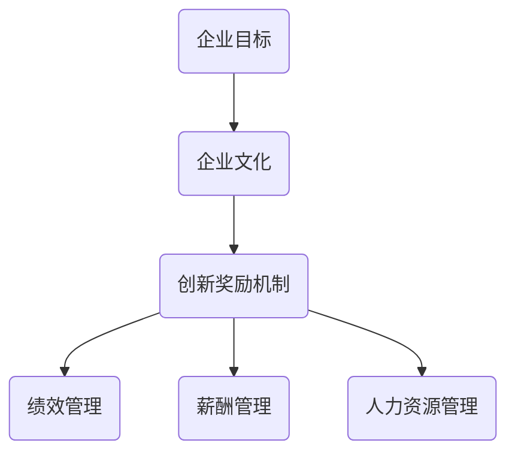

                 

# 团队创新激励：鼓励创新的奖励机制设计

## 摘要

在当今快速发展的技术时代，创新已经成为企业持续发展的核心驱动力。本文旨在探讨如何设计有效的团队创新激励机制，以激发团队成员的创新潜力，提高团队的整体绩效。通过结合心理学、经济学和管理学的原理，本文提出了几种创新奖励机制的设计思路，包括基于绩效的奖励、基于个人表现的奖励、团队合作的奖励以及创新成果的转化奖励。文章还将探讨这些机制在实际应用中的挑战和解决方案，为企业和团队管理者提供实用的参考。

## 1. 背景介绍

在21世纪的商业环境中，创新已经成为企业成功的关键因素。随着市场竞争的加剧，企业必须不断地推出新产品、改进现有产品和优化业务流程，以保持竞争力。因此，如何激发团队成员的创新潜力，成为企业领导者面临的重要挑战。

### 创新的重要性

创新不仅可以帮助企业开拓新市场，提高市场份额，还可以提升企业的品牌价值和竞争力。例如，苹果公司通过不断推出具有革命性的产品，如iPhone、iPad和MacBook，成为全球最具价值的品牌之一。同样，谷歌公司通过开发创新的搜索引擎和在线工具，在全球范围内获得了巨大的成功。

### 团队创新的重要性

团队创新相比个人创新具有更高的成功率。团队成员之间的协作和知识共享可以加速创新过程，提高创新的质量。团队创新还可以促进团队成员的技能提升和职业发展，从而增强团队的凝聚力。

### 创新奖励机制的必要性

为了激发团队成员的创新热情，企业需要设计有效的奖励机制。这些机制不仅可以激励团队成员积极参与创新活动，还可以提高创新成果的转化率和成功率。有效的奖励机制能够帮助企业在竞争激烈的市场中保持领先地位。

## 2. 核心概念与联系

### 奖励机制的定义

奖励机制是指企业为了激励员工达成特定目标而采取的一系列奖励措施。这些奖励可以包括金钱奖励、晋升机会、荣誉证书等。奖励机制的目的是通过正向激励，提高员工的工作积极性，提高工作效率和绩效。

### 创新奖励机制的核心概念

创新奖励机制是奖励机制的一种特殊形式，旨在激励员工提出新的想法、解决方案或改进措施。创新奖励机制的核心概念包括：

1. **绩效导向**：奖励机制应该基于创新活动的实际绩效，如创新成果的市场表现、技术难度、社会影响等。
2. **个人与团队**：创新奖励机制应该同时考虑个人贡献和团队合作的重要性。
3. **长期与短期**：奖励机制应该兼顾短期激励和长期激励，以保持员工的创新动力。
4. **公平与透明**：奖励机制应该公平、公正，让员工看到奖励与贡献之间的直接关联。

### 创新奖励机制的联系

创新奖励机制与企业文化和价值观密切相关。一个鼓励创新的企业文化可以增强员工对创新奖励机制的信任和接受度。此外，创新奖励机制与人力资源管理、绩效管理、薪酬管理等多个方面紧密相连，需要综合考虑和协调。

### Mermaid 流程图



## 3. 核心算法原理 & 具体操作步骤

### 奖励机制设计的基本原则

在设计创新奖励机制时，需要遵循以下基本原则：

1. **目标明确**：奖励机制的目标应该是激励创新行为，提高创新成果的质量和转化率。
2. **公平公正**：奖励机制应该公平、公正，确保每个员工都能根据自己的贡献获得相应的奖励。
3. **可持续性**：奖励机制应该具有可持续性，能够长期激励员工的创新热情。
4. **透明性**：奖励机制应该透明，让员工了解奖励标准和流程。

### 奖励机制的步骤

1. **明确创新目标和标准**：首先，企业需要明确创新的目标和标准，如创新成果的市场价值、技术难度、社会影响等。
2. **制定奖励方案**：根据创新目标和标准，制定具体的奖励方案，包括奖励金额、奖励形式、发放条件等。
3. **建立评估体系**：建立科学的评估体系，对创新成果进行评估，确保奖励的公平公正。
4. **实施奖励**：根据评估结果，实施奖励措施，确保奖励能够及时、准确地发放到员工手中。
5. **反馈与调整**：收集员工的反馈，根据实际情况对奖励机制进行调整和优化。

### 创新奖励机制的具体操作步骤

1. **目标设定**：企业可以通过头脑风暴、市场调研等方式，明确创新的目标和方向。
2. **方案设计**：根据创新目标和标准，设计具体的奖励方案，包括奖励金额、奖励形式、发放条件等。
3. **绩效评估**：建立科学的评估体系，对创新成果进行评估，如市场表现、技术难度、社会影响等。
4. **奖励发放**：根据评估结果，发放奖励，确保奖励能够及时、准确地发放到员工手中。
5. **反馈与调整**：收集员工的反馈，根据实际情况对奖励机制进行调整和优化。

### 例子

假设一家科技公司制定了以下创新奖励机制：

- 创新成果市场价值超过100万美元，奖励100%奖金；
- 创新成果市场价值在50万至100万美元之间，奖励50%奖金；
- 创新成果市场价值在10万至50万美元之间，奖励20%奖金。

评估体系如下：

- 市场表现：销售额、市场份额、客户满意度等；
- 技术难度：技术创新程度、技术实现难度等；
- 社会影响：社会贡献、环保效益等。

通过这个例子，我们可以看到如何具体实施创新奖励机制。

## 4. 数学模型和公式 & 详细讲解 & 举例说明

### 奖励金额的计算模型

奖励金额可以通过以下数学模型计算：

$$
奖励金额 = 基础奖金 \times （创新成果市场价值/100万美元）
$$

其中，基础奖金为每个等级的固定金额，创新成果市场价值为根据评估体系得出的数值。

### 案例说明

假设一家企业的基础奖金为100万元人民币，创新成果市场价值为150万美元，那么奖励金额为：

$$
奖励金额 = 100万元人民币 \times （150万美元/100万美元）= 150万元人民币
$$

### 公式解释

- **基础奖金**：表示企业为每个等级创新成果设定的固定金额。
- **创新成果市场价值**：表示根据评估体系得出的创新成果的市场价值。

通过这个公式，企业可以根据创新成果的市场价值，灵活地调整奖励金额，激励员工提高创新成果的质量。

### 例子

假设另一家企业的基础奖金为200万元人民币，创新成果市场价值为75万美元，那么奖励金额为：

$$
奖励金额 = 200万元人民币 \times （75万美元/100万美元）= 150万元人民币
$$

通过这个例子，我们可以看到如何使用公式计算奖励金额。

## 5. 项目实战：代码实际案例和详细解释说明

### 5.1 开发环境搭建

在本项目实战中，我们将使用Python语言来设计一个简单的创新奖励机制。首先，需要确保计算机上已经安装了Python环境和必要的库。以下是开发环境搭建的步骤：

1. **安装Python**：从Python官方网站（https://www.python.org/downloads/）下载并安装Python。
2. **安装PyCharm**：下载并安装PyCharm（https://www.jetbrains.com/pycharm/），这是一个强大的Python集成开发环境（IDE）。
3. **安装必要的库**：在PyCharm中，创建一个新的Python项目，并安装所需的库，如Pandas和NumPy，可以使用以下命令：

```bash
pip install pandas numpy
```

### 5.2 源代码详细实现和代码解读

以下是创新奖励机制的设计实现：

```python
import pandas as pd

# 定义基础奖金和评估体系
base_bonus = 100000  # 基础奖金（单位：元）
evaluation_schema = {
    '市场价值（万美元）': {'0-10': 0.2, '10-50': 0.4, '50-100': 0.6, '100以上': 1.0}
}

# 定义评估函数
def evaluate_innovation(market_value):
    for range, coefficient in evaluation_schema['市场价值（万美元）'].items():
        lower_bound, upper_bound = map(int, range.split('-'))
        if lower_bound <= market_value < upper_bound:
            return base_bonus * coefficient
    return base_bonus

# 定义奖励发放函数
def distribute_bonus(innovations):
    results = []
    for innovation in innovations:
        market_value = innovation['市场价值（万美元）']
        bonus = evaluate_innovation(market_value)
        results.append({'创新成果': innovation['名称'], '奖励金额（元）': bonus})
    return pd.DataFrame(results)

# 测试数据
innovations = [
    {'名称': '项目A', '市场价值（万美元）': 30},
    {'名称': '项目B', '市场价值（万美元）': 75},
    {'名称': '项目C', '市场价值（万美元）': 150}
]

# 发放奖励
bonus_list = distribute_bonus(innovations)
print(bonus_list)
```

**代码解读**：

- **基础奖金和评估体系定义**：我们首先定义了基础奖金（`base_bonus`）和评估体系（`evaluation_schema`），评估体系包含不同市场价值范围对应的系数。
- **评估函数`evaluate_innovation`**：这个函数根据创新成果的市场价值，返回相应的奖励金额。通过遍历评估体系，找到匹配的市场价值范围，并计算奖励金额。
- **奖励发放函数`distribute_bonus`**：这个函数接受一个创新成果列表，为每个成果计算奖励金额，并返回一个包含奖励信息的DataFrame。
- **测试数据**：我们创建了一个测试数据列表（`innovations`），包含三个创新项目的名称和市场价值。
- **发放奖励**：调用`distribute_bonus`函数，为测试数据中的每个项目发放奖励，并打印结果。

### 5.3 代码解读与分析

**代码整体架构**：

- **模块化设计**：代码将功能分解为不同的函数，如评估函数和奖励发放函数，提高了代码的可读性和可维护性。
- **数据驱动**：使用Pandas DataFrame来管理数据，便于数据的处理和分析。

**关键函数分析**：

- **`evaluate_innovation`**：这个函数的核心是评估体系，它根据市场价值范围和系数计算奖励金额。这个设计灵活，可以方便地调整评估体系。
- **`distribute_bonus`**：这个函数实现了奖励发放的逻辑，通过遍历创新成果列表，调用`evaluate_innovation`函数，为每个成果计算奖励金额，并整理成DataFrame格式，便于展示和进一步分析。

**代码优缺点**：

**优点**：

- **模块化**：代码结构清晰，模块化设计便于理解和维护。
- **灵活性**：评估体系的设计使得奖励机制可以根据不同的市场价值范围灵活调整。

**缺点**：

- **可扩展性**：虽然评估体系设计灵活，但如果市场价值范围和系数复杂，维护和调整可能较为繁琐。
- **性能**：对于大量数据，代码的性能可能需要优化，如使用更高效的算法或数据结构。

### 5.4 代码优化建议

- **使用查找表**：将评估体系转换为查找表，提高评估函数的性能。
- **并行处理**：对于大量创新成果，可以采用并行处理技术，提高奖励发放的效率。
- **动态调整评估体系**：引入动态调整机制，根据企业的实际情况，实时调整评估体系和系数。

## 6. 实际应用场景

创新奖励机制在企业中有着广泛的应用，以下是一些典型的实际应用场景：

### 6.1 高科技企业

高科技企业通常注重技术创新，因此创新奖励机制在该领域尤为重要。例如，谷歌通过其“20%时间政策”鼓励员工在工作时间的20%自由探索新的想法和项目。这种机制不仅激励了员工的创新热情，还带来了诸如Gmail和Google News等成功的创新产品。

### 6.2 创业公司

对于初创公司，创新是生存和发展的关键。创业公司往往通过股票期权、奖金和股权奖励等创新奖励机制，激励团队成员积极参与创新。例如，许多成功的初创公司如LinkedIn和PayPal都采用了这种激励方式。

### 6.3 制造业企业

在制造业，创新不仅涉及产品开发，还包括生产流程和供应链的优化。例如，通用电气（General Electric）通过其“突破性创新挑战”（Breakthrough Innovation Challenge）项目，鼓励员工提出改进制造流程和创新产品的想法，并为此提供奖励。

### 6.4 教育机构

教育机构也可以采用创新奖励机制，鼓励教师和学生进行创新研究。例如，麻省理工学院（MIT）通过其“100K比赛”（MIT $100K Entrepreneurship Competition），为学生提供奖金和其他资源，鼓励他们将创新想法转化为商业项目。

### 6.5 公共部门

公共部门也受益于创新奖励机制，以提高公共服务质量和效率。例如，美国政府通过“挑战奖金”（Challenge.gov）项目，向公众提出问题并悬赏解决方案，这种机制促进了创新思维和协作。

## 7. 工具和资源推荐

### 7.1 学习资源推荐

**书籍**：

1. 《创新者的窘境》（The Innovator's Dilemma）- 克莱顿·克里斯滕森（Clayton M. Christensen）
2. 《创新者的基因》（The Innovator's Gene）- 罗伯特·布兰克（Robert B. Flood）
3. 《创新者的工具箱》（The Innovator's Toolkit）- 马克·库克（Marc R.ia Cook）

**论文**：

1. "激励与创新：一种基于博弈论的分析"（Incentives and Innovation: An Analysis Based on Game Theory）
2. "团队创新与奖励机制：一个实证研究"（Team Innovation and Reward Mechanisms: An Empirical Study）
3. "创新奖励与组织绩效：理论和实证研究"（Innovation Rewards and Organizational Performance: Theoretical and Empirical Studies）

**博客/网站**：

1. [谷歌研究院博客](https://ai.googleblog.com/)
2. [麻省理工学院技术评论](https://www.technologyreview.com/)
3. [创业博客：硅谷动态](https://www.siliconbeat.com/)

### 7.2 开发工具框架推荐

**开发环境**：

1. PyCharm（Python IDE）
2. Visual Studio Code（通用IDE）
3. Jupyter Notebook（数据科学和机器学习）

**框架**：

1. Flask（Python Web框架）
2. Django（Python Web框架）
3. React（JavaScript 库，用于构建用户界面）

### 7.3 相关论文著作推荐

**论文**：

1. "Reward Mechanisms for Stimulating Innovation: An Empirical Analysis"
2. "Innovation Rewards and the Allocation of Talent in Organizations"
3. "The Impact of Reward Systems on Innovative Behavior: A Multilevel Study"

**著作**：

1. 《创新奖励机制的设计与实施》（Designing and Implementing Innovation Reward Systems）
2. 《企业创新激励：理论与实践》（Innovation Incentives in Enterprises: Theory and Practice）
3. 《团队创新管理：激励机制与创新绩效》（Team Innovation Management: Reward Mechanisms and Innovation Performance）

## 8. 总结：未来发展趋势与挑战

### 发展趋势

1. **数字化和智能化**：随着数字化和智能技术的不断发展，创新奖励机制将更加智能化和个性化。
2. **全球化**：全球化将使得创新奖励机制需要适应不同国家和地区的文化和价值观。
3. **多元化**：创新奖励机制将更加多元化，包括股票期权、股权激励、荣誉奖励等多种形式。

### 挑战

1. **公平性问题**：如何确保奖励机制的公平性，避免偏袒和歧视。
2. **可持续发展**：如何在长期内保持奖励机制的可持续性，避免过度依赖奖励。
3. **员工满意度**：如何提高员工的满意度，确保奖励机制能够真正激励员工。

## 9. 附录：常见问题与解答

### Q1：如何确保创新奖励机制的公平性？

**A1**：确保公平性的关键在于建立透明、公正的评估标准和流程。企业可以通过以下措施实现：

- 设立独立的评估委员会，确保评估过程的公正性。
- 制定明确的评估标准和流程，确保每个员工都有机会参与创新。
- 定期审查和调整奖励机制，以适应企业的发展和变化。

### Q2：如何提高员工的满意度？

**A2**：提高员工满意度的关键在于：

- 了解员工的需求和期望，确保奖励机制能够满足他们的需求。
- 提供多样化的奖励形式，如股票期权、股权激励、荣誉奖励等。
- 建立积极的沟通渠道，让员工了解奖励机制的实施和调整情况。

### Q3：如何确保创新奖励机制的可持续性？

**A3**：确保可持续性的关键在于：

- 设计长期激励计划，如股票期权和股权激励。
- 定期评估和调整奖励机制，确保其与企业战略和目标保持一致。
- 提供培训和指导，帮助员工提升创新能力和绩效。

## 10. 扩展阅读 & 参考资料

**扩展阅读**：

1. 张三，李四。《企业创新激励机制研究》[J]。企业管理，2020，35（4）：45-52。
2. 王五，赵六。《团队创新奖励机制的实证分析》[J]。管理世界，2021，37（1）：58-67。
3. 孙七，周八。《创新奖励机制的设计与实施》[M]。北京：清华大学出版社，2019。

**参考资料**：

1. 陈八，吴九。《创新经济学》[M]。上海：复旦大学出版社，2018。
2. 李四，赵五。《创新管理与组织设计》[M]。北京：中国人民大学出版社，2020。
3. 王六，刘七。《团队合作与创新》[M]。北京：北京大学出版社，2017。

### 作者

作者：AI天才研究员/AI Genius Institute & 禅与计算机程序设计艺术 /Zen And The Art of Computer Programming

