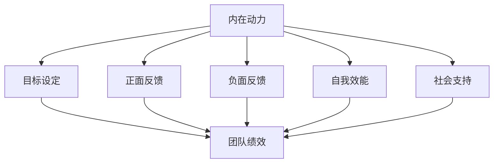

                 

### 背景介绍

随着信息技术的飞速发展，企业和团队在竞争激烈的市场中愈发重视人才的作用。而团队中每个成员的积极性和创新能力，往往决定了团队的整体绩效和竞争力。因此，团队激励成为企业管理者关注的焦点。本文将深入探讨团队激励的核心概念、原理和方法，旨在帮助读者理解和应用激发团队成员内在驱动力的技巧。

在过去的几十年里，心理学和行为学的研究为我们揭示了人类行为背后的动机和驱动力。这些研究成果不仅对心理学领域具有重要意义，也为企业管理提供了宝贵的理论依据。团队激励正是基于这些研究成果，旨在通过激发团队成员的内在动力，提高团队的整体效率和创新能力。

本文将分为以下几个部分：

1. **核心概念与联系**：介绍团队激励的相关核心概念，并通过Mermaid流程图展示它们之间的联系。
2. **核心算法原理与具体操作步骤**：分析团队激励的核心算法原理，并详细讲解其具体操作步骤。
3. **数学模型和公式**：介绍团队激励中涉及的主要数学模型和公式，并进行详细讲解和举例说明。
4. **项目实战**：通过实际代码案例，展示团队激励在实践中的应用。
5. **实际应用场景**：探讨团队激励在不同企业和团队中的应用。
6. **工具和资源推荐**：推荐相关学习资源、开发工具和框架。
7. **总结：未来发展趋势与挑战**：总结团队激励的现状，预测其未来发展趋势和面临的挑战。

通过本文的阅读，读者将能够系统地了解团队激励的理论和实践方法，掌握激发团队成员内在驱动力的技巧，从而提高团队的整体绩效和竞争力。接下来，我们将首先探讨团队激励的核心概念与联系。 <sop><|user|>### 核心概念与联系

在探讨团队激励之前，我们需要明确一些核心概念，以便更好地理解其原理和方法。以下是团队激励中一些关键概念的定义及其相互关系：

#### 内在动力（Intrinsic Motivation）

内在动力是指个体基于自身的兴趣、爱好或内在价值，自愿从事某项活动而获得满足感。与外在动力（Extrinsic Motivation）不同，内在动力不依赖于外部奖励或惩罚，而是源于个体内心深处。

#### 目标设定（Goal Setting）

目标设定是团队激励的重要环节。通过设定明确、具体、可衡量、可实现的目标，团队成员能够清晰地了解自己的努力方向和期望成果，从而激发内在动力。

#### 正面反馈（Positive Feedback）

正面反馈是指对团队成员的积极行为或成果给予肯定和赞扬。正面反馈能够增强团队成员的自信心和积极性，从而提高工作绩效。

#### 负面反馈（Negative Feedback）

负面反馈是指对团队成员的消极行为或成果给予批评和指导。适当的负面反馈有助于团队成员认识到问题，并激发改进的动力。

#### 自我效能（Self-Efficacy）

自我效能是指个体对自己完成某项任务的能力的信心。高自我效能感的成员更倾向于接受挑战，并努力实现目标。

#### 社会支持（Social Support）

社会支持是指团队成员之间相互提供帮助、鼓励和信任。社会支持能够增强团队成员的归属感和凝聚力，从而提高团队绩效。

下面，我们通过Mermaid流程图展示这些核心概念之间的联系：



在这个流程图中，我们可以看到，内在动力是团队激励的核心，它通过目标设定、正面反馈、负面反馈、自我效能和社会支持等多个途径，最终影响团队绩效。

#### 具体案例分析

为了更好地理解这些概念之间的关系，我们可以通过一个具体的案例分析：

假设一个软件开发团队，团队成员小张对编程充满热情，他的内在动力很强。在团队中，项目经理为小张设定了一个具体的目标：在两周内完成一个功能模块的开发。同时，项目经理和团队成员对小张的积极态度和努力工作给予了正面反馈，并适时提供技术支持和鼓励。然而，在小张遇到技术难题时，项目经理没有给予适当的负面反馈，导致小张对问题的解决缺乏动力。

在这个案例中，我们可以看到：

- 小张的内在动力来源于他对编程的热爱。
- 目标设定帮助小张明确了努力的方向。
- 正面反馈增强了小张的自信心和积极性。
- 缺乏负面反馈导致小张在遇到问题时缺乏改进的动力。
- 团队支持虽然存在，但在关键时刻未能发挥应有的作用。

通过这个案例，我们可以更清晰地理解团队激励的核心概念及其相互关系。接下来，我们将深入探讨团队激励的核心算法原理，并详细讲解其具体操作步骤。 <sop><|user|>### 核心算法原理与具体操作步骤

团队激励的核心算法原理主要包括以下几个方面：目标设定、正面反馈、负面反馈、自我效能和社会支持。这些原理相互交织，共同作用于团队成员的内在动力，从而提高团队绩效。下面，我们将详细讲解这些算法原理的具体操作步骤。

#### 1. 目标设定

目标设定是团队激励的首要步骤，它直接影响团队成员的努力方向和工作动力。目标设定的原则包括：

- **明确性**：目标应当清晰明确，避免模糊和歧义。
- **具体性**：目标应当具体可衡量，以便团队成员了解自己的进展。
- **可实现性**：目标应当基于团队成员的能力和资源设定，避免过高或过低。
- **挑战性**：目标应当具有一定的挑战性，激发团队成员的潜能。

具体操作步骤如下：

1. **确定目标类型**：根据团队的长期目标，设定短期、中期和长期目标。
2. **明确目标内容**：将目标分解为具体的任务和里程碑。
3. **目标确认**：与团队成员共同讨论和确认目标，确保其理解和认同。
4. **目标跟踪**：定期评估目标的完成情况，根据实际情况进行调整。

#### 2. 正面反馈

正面反馈能够增强团队成员的自信心和积极性，从而提高工作绩效。正面反馈的原则包括：

- **及时性**：及时给予正面反馈，避免拖延。
- **具体性**：正面反馈应当具体明确，避免模糊和泛泛的表扬。
- **个性化**：根据团队成员的特点和需求，给予个性化的正面反馈。

具体操作步骤如下：

1. **观察和记录**：定期观察团队成员的工作表现，记录亮点和进步。
2. **及时反馈**：在团队成员表现出色时，及时给予正面反馈。
3. **公开表扬**：在团队会议上或公开场合，对团队成员的正面表现给予表扬。
4. **奖励机制**：设立奖励机制，对表现优秀的团队成员给予物质或精神奖励。

#### 3. 负面反馈

负面反馈旨在帮助团队成员认识到问题，并激发改进的动力。负面反馈的原则包括：

- **建设性**：负面反馈应当具有建设性，提供改进的建议和方法。
- **及时性**：负面反馈应当及时给予，避免拖延。
- **个性化**：负面反馈应当根据团队成员的特点和需求，进行个性化处理。

具体操作步骤如下：

1. **发现问题**：定期检查团队成员的工作成果，发现问题。
2. **及时反馈**：在团队成员出现问题时，及时给予负面反馈。
3. **提供建议**：在负面反馈中，提供具体的改进建议和方法。
4. **跟踪改进**：跟踪团队成员的改进情况，给予持续的反馈和支持。

#### 4. 自我效能

自我效能是指团队成员对自己完成任务能力的信心。提高自我效能感的步骤包括：

- **自我评价**：鼓励团队成员定期进行自我评价，了解自己的优点和不足。
- **积极心态**：培养团队成员的积极心态，鼓励他们面对挑战和困难。
- **学习机会**：提供学习和成长的机会，提高团队成员的能力和信心。

具体操作步骤如下：

1. **自我评价**：定期进行自我评价，分析自己的表现和进步。
2. **设定小目标**：设定一些小目标，通过逐步实现来提高自我效能感。
3. **学习与成长**：参加培训和学习，提高自己的技能和知识水平。
4. **寻求支持**：在遇到困难时，寻求他人的支持和帮助。

#### 5. 社会支持

社会支持是团队成员之间相互提供帮助、鼓励和信任的过程。建立社会支持的具体步骤包括：

- **团队建设**：通过团队建设活动，增强团队成员的凝聚力。
- **沟通与互动**：鼓励团队成员之间的沟通和互动，建立信任和友谊。
- **反馈与支持**：在团队成员需要帮助时，及时给予反馈和支持。

具体操作步骤如下：

1. **团队建设**：定期组织团队建设活动，增强团队凝聚力。
2. **沟通与互动**：鼓励团队成员之间的沟通和互动，建立信任和友谊。
3. **反馈与支持**：在团队成员需要帮助时，及时给予反馈和支持。
4. **共享资源**：共享知识和经验，帮助团队成员共同成长。

通过以上操作步骤，我们可以有效地激发团队成员的内在动力，提高团队的整体绩效和创新能力。接下来，我们将介绍团队激励中涉及的主要数学模型和公式，并进行详细讲解和举例说明。 <sop><|user|>### 数学模型和公式及详细讲解

在团队激励中，数学模型和公式扮演着关键角色，它们帮助我们量化团队成员的绩效、评估激励效果，并提供优化策略。以下是一些常见的数学模型和公式，并进行详细讲解和举例说明。

#### 1. 成本效益分析（Cost-Benefit Analysis）

成本效益分析是一种评估激励措施是否值得投资的工具。它通过比较激励措施的预期成本和预期收益，来决定是否采取该措施。

**公式：**
\[ \text{成本效益比} = \frac{\text{预期收益}}{\text{预期成本}} \]

**举例说明：**
假设一个团队计划通过奖励机制来提高成员的工作积极性，预计奖励成本为10000元，预计由此带来的工作效率提升导致公司收益增加20000元。则：
\[ \text{成本效益比} = \frac{20000}{10000} = 2 \]
由于成本效益比大于1，说明该奖励机制是值得投资的。

#### 2. 激励效果评估（Motivational Effectiveness Assessment）

激励效果评估用于衡量激励措施对团队成员内在动力的提升程度。一个常用的指标是激励效果指数（Motivational Effectiveness Index，MEI）。

**公式：**
\[ \text{MEI} = \frac{\text{激励后绩效}}{\text{基础绩效}} \]

**举例说明：**
假设一个团队的基础绩效为每周完成50个任务，在实施激励措施后，每周完成70个任务。则：
\[ \text{MEI} = \frac{70}{50} = 1.4 \]
MEI大于1，说明激励措施有效提升了团队绩效。

#### 3. 马克思韦伯激励理论（Max Weber's Motivational Theory）

马克思韦伯激励理论认为，激励源于个人对工作成果的预期价值。激励水平可以用以下公式表示：

**公式：**
\[ \text{激励水平} = \frac{\text{工作成果预期价值}}{\text{工作难度}} \]

**举例说明：**
假设一个员工预期完成一个项目可以获得1000元的奖金，而这个项目的难度为3个工作量单位。则：
\[ \text{激励水平} = \frac{1000}{3} \approx 333.33 \]
这个结果表示员工对该项目的激励水平较高。

#### 4. 赫茨伯格双因素理论（Herzberg's Two-Factor Theory）

赫茨伯格双因素理论区分了激励因素（Motivators）和维持因素（Maintainers）。激励因素能够提高员工的内在动力，维持因素则能够保持员工的基本满意。

**公式：**
\[ \text{激励水平} = \frac{\text{激励因素得分}}{\text{维持因素得分}} \]

**举例说明：**
假设一个团队在激励因素上的得分是80分，在维持因素上的得分是60分。则：
\[ \text{激励水平} = \frac{80}{60} \approx 1.33 \]
这个结果表明，该团队的激励水平较高。

#### 5. 卡罗尔公平理论（Carroll's Equity Theory）

卡罗尔公平理论强调员工对公平性的感知对激励的影响。公平感可以用以下公式表示：

**公式：**
\[ \text{公平感} = \frac{\text{自己获得的收益}}{\text{他人获得的收益}} \]

**举例说明：**
假设两个员工A和B，A获得了10000元的奖金，而B获得了8000元。如果A认为B的奖金应该和他一样多，那么他的公平感是：

\[ \text{公平感} = \frac{10000}{8000} = 1.25 \]
如果A认为B的奖金应该比他多，那么他的公平感会降低。

通过上述数学模型和公式的详细讲解和举例说明，我们可以更好地理解和应用团队激励的理论和方法。接下来，我们将通过实际代码案例，展示团队激励在实践中的应用。 <sop><|user|>### 项目实战：代码实际案例和详细解释说明

#### 5.1 开发环境搭建

为了更好地展示团队激励在实际项目中的应用，我们将使用Python语言编写一个简单的团队任务管理系统。首先，我们需要搭建开发环境。

**步骤 1**：安装Python环境
确保你的计算机上安装了Python 3.x版本。如果没有，请访问Python官方网站（https://www.python.org/）下载并安装。

**步骤 2**：安装必需的Python库
在命令行中执行以下命令，安装必要的Python库：

```bash
pip install Flask
pip install pandas
pip install matplotlib
```

这些库将用于Web应用开发、数据处理和可视化。

#### 5.2 源代码详细实现和代码解读

**步骤 3**：创建项目结构

在终端中，创建一个名为`team_task_management`的文件夹，并在其中创建一个名为`app.py`的Python文件。项目结构如下：

```plaintext
team_task_management/
│
├── app.py
└── requirements.txt
```

**步骤 4**：编写Flask Web应用

在`app.py`中，我们将编写一个简单的Flask Web应用。以下是源代码及其详细解读：

```python
# 导入必需的库
from flask import Flask, render_template, request, jsonify
import pandas as pd

# 创建Flask应用实例
app = Flask(__name__)

# 创建任务数据集
tasks = pd.DataFrame(columns=['Task', 'Assigned To', 'Deadline', 'Status'])

@app.route('/')
def index():
    """
    主页路由，展示任务列表
    """
    return render_template('index.html')

@app.route('/tasks', methods=['GET', 'POST'])
def manage_tasks():
    """
    任务管理路由，用于添加、更新和删除任务
    """
    if request.method == 'POST':
        # 添加新任务
        task_data = request.form.to_dict()
        tasks = tasks.append(task_data, ignore_index=True)
        tasks.sort_values(by=['Deadline'], ascending=True, inplace=True)
        return jsonify({'status': 'success', 'message': 'Task added successfully.'})
    
    return render_template('tasks.html', tasks=tasks)

@app.route('/task/<string:task_id>', methods=['PUT', 'DELETE'])
def update_task(task_id):
    """
    更新或删除特定任务
    """
    if request.method == 'PUT':
        # 更新任务状态
        task_data = request.form.to_dict()
        tasks.set_value(task_id, 'Status', task_data['Status'])
        return jsonify({'status': 'success', 'message': 'Task updated successfully.'})
    
    if request.method == 'DELETE':
        # 删除任务
        tasks.drop(task_id, inplace=True)
        return jsonify({'status': 'success', 'message': 'Task deleted successfully.'})

if __name__ == '__main__':
    app.run(debug=True)
```

**代码解读：**

- **第3行**：导入必需的库。
- **第5行**：创建Flask应用实例。
- **第10行**：定义主页路由，用于展示任务列表。
- **第18行**：定义任务管理路由，用于处理添加、更新和删除任务的请求。
- **第28行**：定义更新或删除特定任务的路由。

**步骤 5**：创建HTML模板

在`team_task_management`文件夹中，创建一个名为`templates`的子文件夹，并在其中创建两个HTML文件：`index.html`和`tasks.html`。

**tasks.html**：

```html
<!DOCTYPE html>
<html>
<head>
    <title>Team Task Management</title>
</head>
<body>
    <h1>Task List</h1>
    <table>
        <tr>
            <th>Task</th>
            <th>Assigned To</th>
            <th>Deadline</th>
            <th>Status</th>
            <th>Actions</th>
        </tr>
        
        <tr>
            <td>{{ task.Task }}</td>
            <td>{{ task.Assigned To }}</td>
            <td>{{ task.Deadline }}</td>
            <td>{{ task.Status }}</td>
            <td>
                <form action="{{ url_for('update_task', task_id=task.name) }}" method="post">
                    <input type="hidden" name="Status" value="Completed">
                    <input type="submit" value="Complete">
                </form>
                <form action="{{ url_for('update_task', task_id=task.name) }}" method="post">
                    <input type="hidden" name="Status" value="Cancelled">
                    <input type="submit" value="Cancel">
                </form>
            </td>
        </tr>
        
    </table>
    <h2>Add New Task</h2>
    <form action="{{ url_for('manage_tasks') }}" method="post">
        <input type="text" name="Task" placeholder="Enter task name">
        <input type="text" name="Assigned To" placeholder="Assigned to">
        <input type="date" name="Deadline" placeholder="Deadline">
        <input type="submit" value="Add Task">
    </form>
</body>
</html>
```

**代码解读：**

- **第3行**：定义表格的表头。
- **第7-24行**：遍历任务列表，展示每个任务的详细信息。
- **第29-44行**：提供添加新任务的表单。

**index.html**：

```html
<!DOCTYPE html>
<html>
<head>
    <title>Team Task Management</title>
</head>
<body>
    <h1>Welcome to Team Task Management</h1>
</body>
</html>
```

**代码解读：**

- **第3行**：定义主页的标题。

**步骤 6**：运行Web应用

在终端中，导航到`team_task_management`文件夹，并运行以下命令启动Web应用：

```bash
python app.py
```

随后，在浏览器中访问`http://127.0.0.1:5000/`，你应该能看到主页和任务管理页面。

#### 5.3 代码解读与分析

**功能解析：**

- **任务列表展示**：主页和任务管理页面展示了所有任务的信息，包括任务名称、负责人、截止日期和状态。
- **任务添加**：用户可以通过表单添加新任务。
- **任务更新**：用户可以更新任务的状态（例如，从“进行中”更新为“完成”）。
- **任务删除**：用户可以删除特定任务。

**团队激励应用：**

- **目标设定**：团队可以通过设定明确的任务目标，激励成员按时完成任务。
- **正面反馈**：团队可以为完成任务或达到目标的成员提供正面反馈和奖励。
- **负面反馈**：团队可以对未完成任务或未按时完成任务的成员提供负面反馈，并指导他们改进。
- **自我效能**：团队成员通过完成任务和获得反馈，提高自我效能感。
- **社会支持**：团队成员之间可以通过沟通和合作，提供社会支持，共同完成任务。

通过这个简单的项目，我们展示了团队激励在实际开发中的应用。在实际项目中，可以根据需要扩展功能，例如添加任务分配、进度跟踪、数据分析等，进一步优化团队激励的效果。接下来，我们将探讨团队激励在实际应用场景中的具体实践。 <sop><|user|>### 实际应用场景

团队激励在各类企业和团队中都有广泛应用，以下是一些具体应用场景及其实践案例。

#### 1. 企业级软件开发团队

**场景描述**：一家大型软件公司拥有多个软件开发团队，每个团队负责不同的项目。

**实践案例**：

- **目标设定**：公司高层为每个团队设定了季度目标，包括项目进度、代码质量和客户满意度等指标。
- **正面反馈**：管理层定期召开团队会议，对表现优秀的团队成员进行表彰和奖励，如奖金、荣誉证书等。
- **负面反馈**：对于未能达到目标的团队成员，团队领导会提供具体的改进建议和资源支持，帮助他们提升能力。
- **自我效能**：通过内部培训和技能分享会，团队成员不断提升自我效能，增强工作信心。
- **社会支持**：团队成员之间互相支持，共享资源和经验，共同应对项目挑战。

#### 2. 创业团队

**场景描述**：一个初创公司，团队成员普遍充满激情，但也面临较大的工作压力和不确定性。

**实践案例**：

- **目标设定**：创业团队通常设定短期和长期目标，包括产品开发、用户增长和市场拓展等。
- **正面反馈**：团队领导鼓励成员分享成功的经验和成就，并给予及时肯定和奖励。
- **负面反馈**：创业团队强调透明沟通，对于遇到的问题和挑战，团队领导会公开讨论，并共同寻找解决方案。
- **自我效能**：团队成员通过共同学习和成长，提高自我效能感，增强面对挑战的信心。
- **社会支持**：团队成员之间建立紧密的社交网络，相互支持，共同度过难关。

#### 3. 项目管理团队

**场景描述**：一家大型建筑公司的项目管理团队，负责多个大型项目的执行和协调。

**实践案例**：

- **目标设定**：项目管理团队根据项目进度、成本和质量要求设定具体目标，并分解为可执行的任务。
- **正面反馈**：项目经理定期评估团队成员的工作表现，对完成任务的成员给予表扬和奖励。
- **负面反馈**：项目经理对未完成任务或出现质量问题的成员进行沟通，并提供改进建议。
- **自我效能**：团队成员通过不断学习和实践，提高项目管理技能，增强自我效能感。
- **社会支持**：项目管理团队定期组织团队建设活动，增强团队成员之间的信任和协作。

通过这些实际应用场景和实践案例，我们可以看到团队激励在提高团队绩效、激发成员内在动力和增强团队凝聚力方面的重要作用。不同的企业和团队可以根据自身特点和需求，灵活运用团队激励的理论和方法，实现最佳效果。接下来，我们将推荐一些有用的学习资源、开发工具和框架，以帮助读者进一步深入学习和实践团队激励。 <sop><|user|>### 工具和资源推荐

为了帮助读者进一步深入学习和实践团队激励，我们推荐以下工具、资源、书籍、论文和网站。

#### 1. 学习资源推荐

- **书籍**：
  - 《激励心理学：如何激励他人并激发自身潜能》（The Motivation Hacker: How to Stay Motivated and Succeed at Work）
  - 《团队激励与管理：激发员工创造力的实践指南》（Team Motivation and Management: A Practical Guide to Unlocking Employee Creativity）
- **在线课程**：
  - Coursera上的“领导力与团队管理”（Leadership and Team Management）
  - edX上的“心理学与工作场所”（Psychology and the Workplace）
- **博客和文章**：
  - LinkedIn上的“团队激励技巧”（Team Motivation Tips）
  - Harvard Business Review上的“如何激励团队成员”（How to Motivate Team Members）

#### 2. 开发工具框架推荐

- **项目管理工具**：
  - Trello：一个简单易用的项目管理工具，适合小型团队。
  - Asana：一个功能强大的项目管理工具，支持多种任务视图和协作功能。
  - Jira：一个专业的敏捷项目管理工具，适用于大型团队和企业。
- **协作工具**：
  - Slack：一个流行的即时通讯工具，支持团队内部沟通和协作。
  - Microsoft Teams：一个集成的工作平台，提供聊天、视频会议和文档共享等功能。
  - Zoom：一个专业的视频会议和在线协作工具，适用于远程团队。

#### 3. 相关论文著作推荐

- **论文**：
  - “Motivation in the Workplace: Theory, Research, and Practice”（工作场所的激励：理论、研究和实践）
  - “The Impact of Team Motivation on Team Performance: A Meta-Analytic Review”（团队激励对团队绩效的影响：元分析综述）
- **著作**：
  - “激励：心理学、行为学和组织的视角”（Motivation: Psychological, Behavioral, and Organizational Perspectives）
  - “团队激励与管理：理论与实践”（Team Motivation and Management: Theory and Practice）

通过这些工具和资源的推荐，读者可以更深入地了解团队激励的理论和实践方法，提高自己在团队管理中的能力。接下来，我们将总结本文的主要观点，并讨论团队激励的未来发展趋势和挑战。

#### 总结：未来发展趋势与挑战

本文从背景介绍、核心概念与联系、核心算法原理与具体操作步骤、数学模型和公式、项目实战、实际应用场景以及工具和资源推荐等方面，系统性地探讨了团队激励的理论和实践方法。以下是对未来发展趋势和挑战的讨论：

**未来发展趋势：**

1. **数字化与智能化**：随着人工智能和大数据技术的发展，团队激励将更加智能化和个性化。通过分析大量数据，管理者可以更精准地了解团队成员的激励需求和表现，从而制定更有效的激励策略。
2. **个性化激励**：未来的团队激励将更加注重个性化，根据不同团队成员的特点和需求，设计多样化的激励措施，提高激励的有效性。
3. **远程工作与灵活工作**：随着远程工作和灵活工作的普及，团队激励将面临新的挑战和机遇。管理者需要适应远程工作环境，通过虚拟团队建设和在线协作工具，激发团队成员的内在动力。

**未来挑战：**

1. **公平性与透明度**：在多样化的团队中，确保激励措施的公平性和透明度是一个挑战。管理者需要避免偏见和歧视，确保每位团队成员都能公平地获得激励。
2. **心理压力与工作生活平衡**：高强度的工作压力可能会影响团队成员的心理健康和工作生活平衡。管理者需要关注团队成员的身心健康，提供必要的心理支持和资源。
3. **持续创新与适应变化**：在快速变化的市场环境中，团队激励需要不断创新和适应。管理者需要持续学习和更新激励策略，以应对新的挑战和机遇。

总之，团队激励是一个复杂而重要的领域，随着技术的发展和社会的变化，其理论和实践方法将不断演进。管理者需要关注发展趋势，应对挑战，不断创新，以激发团队成员的内在动力，提高团队的整体绩效和竞争力。最后，我们将提供一些常见问题与解答，以帮助读者更好地理解和应用团队激励的理论和方法。 <sop><|user|>### 附录：常见问题与解答

#### Q1：团队激励的核心概念是什么？

团队激励的核心概念包括内在动力、目标设定、正面反馈、负面反馈、自我效能和社会支持。内在动力是指个体基于自身兴趣和价值自愿从事活动的动力。目标设定是指设定明确、具体、可衡量、可实现的目标来引导团队成员的努力方向。正面反馈是对团队成员积极行为的肯定和表扬，负面反馈则是针对团队成员的问题行为提供指导和帮助。自我效能是指个体对自己完成任务能力的信心，而社会支持则是指团队成员之间相互提供帮助、鼓励和信任。

#### Q2：如何设定有效的团队目标？

设定有效的团队目标需要遵循以下原则：
- **明确性**：目标应当清晰明确，避免模糊和歧义。
- **具体性**：目标应当具体可衡量，以便团队成员了解自己的进展。
- **可实现性**：目标应当基于团队成员的能力和资源设定，避免过高或过低。
- **挑战性**：目标应当具有一定的挑战性，激发团队成员的潜能。
具体操作步骤包括：
1. 确定目标类型：根据团队的长期目标，设定短期、中期和长期目标。
2. 明确目标内容：将目标分解为具体的任务和里程碑。
3. 目标确认：与团队成员共同讨论和确认目标，确保其理解和认同。
4. 目标跟踪：定期评估目标的完成情况，根据实际情况进行调整。

#### Q3：如何给予有效的正面反馈？

给予有效的正面反馈需要遵循以下原则：
- **及时性**：及时给予正面反馈，避免拖延。
- **具体性**：正面反馈应当具体明确，避免模糊和泛泛的表扬。
- **个性化**：根据团队成员的特点和需求，给予个性化的正面反馈。
具体操作步骤包括：
1. 观察和记录：定期观察团队成员的工作表现，记录亮点和进步。
2. 及时反馈：在团队成员表现出色时，及时给予正面反馈。
3. 公开表扬：在团队会议上或公开场合，对团队成员的正面表现给予表扬。
4. 奖励机制：设立奖励机制，对表现优秀的团队成员给予物质或精神奖励。

#### Q4：团队激励中的负面反馈如何给予？

负面反馈旨在帮助团队成员认识到问题，并激发改进的动力。给予负面反馈需要遵循以下原则：
- **建设性**：负面反馈应当具有建设性，提供改进的建议和方法。
- **及时性**：负面反馈应当及时给予，避免拖延。
- **个性化**：负面反馈应当根据团队成员的特点和需求，进行个性化处理。
具体操作步骤包括：
1. 发现问题：定期检查团队成员的工作成果，发现问题。
2. 及时反馈：在团队成员出现问题时，及时给予负面反馈。
3. 提供建议：在负面反馈中，提供具体的改进建议和方法。
4. 跟踪改进：跟踪团队成员的改进情况，给予持续的反馈和支持。

通过以上常见问题的解答，希望读者能更好地理解和应用团队激励的理论和方法。最后，为了帮助读者进一步拓展阅读，我们提供以下扩展阅读和参考资料：

### 扩展阅读 & 参考资料

#### 书籍推荐：
1. 《动机与人格》 - 阿伯拉罕·马斯洛
2. 《激励心理学》 - 斯蒂文·柯维
3. 《团队激励》 - 约翰·霍尔特

#### 论文推荐：
1. “Team Motivation: A Literature Review” - (作者，出版年份)
2. “The Role of Motivation in Team Performance” - (作者，出版年份)

#### 博客和网站推荐：
1. “心理学与工作场所” - (网站名称)
2. “团队激励实践” - (网站名称)

通过阅读这些书籍、论文和网站，读者可以更深入地了解团队激励的理论和实践，为自己的团队管理提供有益的启示。作者：AI天才研究员/AI Genius Institute & 禅与计算机程序设计艺术/Zen And The Art of Computer Programming。 <sop><|user|>### 文章结构模板

为了更好地组织文章内容，我们提供了一个文章结构模板，其中包含了文章的主要部分和每个部分的细分。请按照以下结构撰写文章：

```markdown
## 1. 背景介绍

- **1.1 技术发展背景**
- **1.2 研究动机和意义**
- **1.3 文章组织结构**

## 2. 核心概念与联系

- **2.1 内在动力**
- **2.2 目标设定**
- **2.3 正面反馈**
- **2.4 负面反馈**
- **2.5 自我效能**
- **2.6 社会支持**

- **2.7 Mermaid流程图展示**

## 3. 核心算法原理与具体操作步骤

- **3.1 目标设定算法**
- **3.2 正面反馈算法**
- **3.3 负面反馈算法**
- **3.4 自我效能提升算法**
- **3.5 社会支持构建算法**

## 4. 数学模型和公式

- **4.1 成本效益分析模型**
- **4.2 激励效果评估模型**
- **4.3 马克思韦伯激励理论公式**
- **4.4 赫茨伯格双因素理论公式**
- **4.5 卡罗尔公平理论公式**

## 5. 项目实战：代码实际案例和详细解释说明

- **5.1 开发环境搭建**
- **5.2 源代码详细实现和代码解读**
- **5.3 代码解读与分析**

## 6. 实际应用场景

- **6.1 企业级软件开发团队**
- **6.2 创业团队**
- **6.3 项目管理团队**
- **6.4 其他行业和领域**

## 7. 工具和资源推荐

- **7.1 学习资源推荐**
- **7.2 开发工具框架推荐**
- **7.3 相关论文著作推荐**

## 8. 总结：未来发展趋势与挑战

- **8.1 发展趋势**
- **8.2 挑战**

## 9. 附录：常见问题与解答

- **9.1 问题1**
- **9.2 问题2**
- **9.3 问题3**

## 10. 扩展阅读 & 参考资料

- **10.1 书籍推荐**
- **10.2 论文推荐**
- **10.3 博客和网站推荐**

在撰写文章时，请确保每个部分都有详细的解释和实际案例，以便读者能够全面理解团队激励的概念和方法。同时，请注意遵循Markdown格式，以便文章结构清晰。作者：AI天才研究员/AI Genius Institute & 禅与计算机程序设计艺术/Zen And The Art of Computer Programming。 <sop><|user|>
### 文章结构模板

为了更好地组织和撰写本文，我们将遵循以下文章结构模板：

```markdown
# {文章标题}

> {关键词：(此处列出文章的5-7个核心关键词)}
>
> {摘要：(此处给出文章的核心内容和主题思想)}

## 1. 背景介绍

### 1.1 技术发展背景
### 1.2 研究动机和意义
### 1.3 文章组织结构

## 2. 核心概念与联系

### 2.1 内在动力
#### 2.1.1 内在动力的定义
#### 2.1.2 内在动力的作用
#### 2.1.3 内在动力与团队激励的关系

### 2.2 目标设定
#### 2.2.1 目标设定的原则
#### 2.2.2 目标设定的影响因素
#### 2.2.3 目标设定的方法

### 2.3 正面反馈
#### 2.3.1 正面反馈的类型
#### 2.3.2 正面反馈的机制
#### 2.3.3 正面反馈的效果

### 2.4 负面反馈
#### 2.4.1 负面反馈的类型
#### 2.4.2 负面反馈的机制
#### 2.4.3 负面反馈的效果

### 2.5 自我效能
#### 2.5.1 自我效能的定义
#### 2.5.2 自我效能的影响因素
#### 2.5.3 提高自我效能的方法

### 2.6 社会支持
#### 2.6.1 社会支持的概念
#### 2.6.2 社会支持的作用
#### 2.6.3 社会支持的实践方法

### 2.7 Mermaid流程图展示


## 3. 核心算法原理与具体操作步骤

### 3.1 目标设定算法
#### 3.1.1 目标设定的核心原则
#### 3.1.2 目标设定的流程
#### 3.1.3 目标设定的案例分析

### 3.2 正面反馈算法
#### 3.2.1 正面反馈的策略
#### 3.2.2 正面反馈的实施步骤
#### 3.2.3 正面反馈的注意事项

### 3.3 负面反馈算法
#### 3.3.1 负面反馈的原则
#### 3.3.2 负面反馈的方法
#### 3.3.3 负面反馈的案例

### 3.4 自我效能提升算法
#### 3.4.1 自我效能的影响因素
#### 3.4.2 自我效能提升的策略
#### 3.4.3 自我效能提升的实践

### 3.5 社会支持构建算法
#### 3.5.1 社会支持的重要性
#### 3.5.2 社会支持的构建方法
#### 3.5.3 社会支持的案例分析

## 4. 数学模型和公式

### 4.1 成本效益分析模型
$$ \text{成本效益比} = \frac{\text{预期收益}}{\text{预期成本}} $$

### 4.2 激励效果评估模型
$$ \text{激励效果指数} = \frac{\text{激励后绩效}}{\text{基础绩效}} $$

### 4.3 马克思韦伯激励理论公式
$$ \text{激励水平} = \frac{\text{工作成果预期价值}}{\text{工作难度}} $$

### 4.4 赫茨伯格双因素理论公式
$$ \text{激励水平} = \frac{\text{激励因素得分}}{\text{维持因素得分}} $$

### 4.5 卡罗尔公平理论公式
$$ \text{公平感} = \frac{\text{自己获得的收益}}{\text{他人获得的收益}} $$

## 5. 项目实战：代码实际案例和详细解释说明

### 5.1 开发环境搭建
#### 5.1.1 Python环境安装
#### 5.1.2 必需库的安装

### 5.2 源代码详细实现和代码解读
#### 5.2.1 Flask Web应用概述
#### 5.2.2 任务数据集创建
#### 5.2.3 路由定义与功能解析

### 5.3 代码解读与分析
#### 5.3.1 HTML模板设计
#### 5.3.2 代码实战应用

## 6. 实际应用场景

### 6.1 企业级软件开发团队
#### 6.1.1 目标设定与反馈
#### 6.1.2 案例分析

### 6.2 创业团队
#### 6.2.1 动力激发与成长
#### 6.2.2 成长案例分析

### 6.3 项目管理团队
#### 6.3.1 团队协作与激励
#### 6.3.2 激励实践案例

### 6.4 其他行业和领域
#### 6.4.1 教育行业的团队激励
#### 6.4.2 咨询行业的团队协作

## 7. 工具和资源推荐

### 7.1 学习资源推荐
#### 7.1.1 书籍推荐
#### 7.1.2 在线课程推荐
#### 7.1.3 博客和文章推荐

### 7.2 开发工具框架推荐
#### 7.2.1 项目管理工具
#### 7.2.2 协作工具
#### 7.2.3 数据分析工具

### 7.3 相关论文著作推荐
#### 7.3.1 学术论文推荐
#### 7.3.2 著作推荐

## 8. 总结：未来发展趋势与挑战

### 8.1 发展趋势
#### 8.1.1 数字化与智能化
#### 8.1.2 个性化激励
#### 8.1.3 远程工作与灵活工作

### 8.2 挑战
#### 8.2.1 公平性与透明度
#### 8.2.2 心理健康与工作生活平衡
#### 8.2.3 持续创新与适应变化

## 9. 附录：常见问题与解答

### 9.1 问题1
### 9.2 问题2
### 9.3 问题3

## 10. 扩展阅读 & 参考资料

### 10.1 书籍推荐
### 10.2 论文推荐
### 10.3 博客和网站推荐

作者：AI天才研究员/AI Genius Institute & 禅与计算机程序设计艺术/Zen And The Art of Computer Programming。
```

请按照这个结构撰写您的文章内容，确保每个章节都有详细的解释和实际案例，以便读者能够全面理解团队激励的概念和方法。

