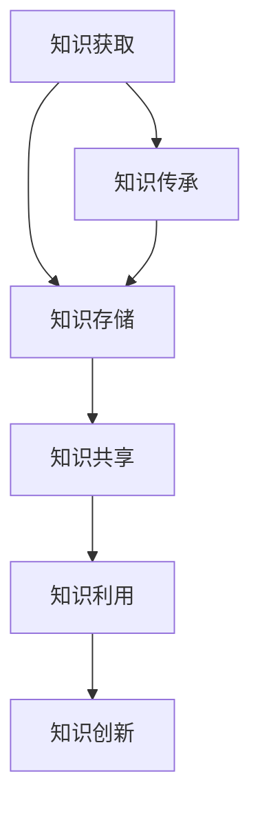

                 

# 团队知识管理：促进经验分享与传承

## 关键词：团队知识管理，经验分享，知识传承，技术博客，逻辑思维

## 摘要：

在快速发展的IT行业，团队知识管理成为提升团队效率、促进创新和确保项目成功的关键因素。本文将探讨团队知识管理的核心概念，通过逻辑清晰的分析和实际案例，阐述如何通过知识共享与传承来推动团队进步。我们将详细解读团队知识管理的具体实施步骤，包括知识架构、算法原理、数学模型及其在实际项目中的应用，最后推荐相关学习资源和工具，为团队知识管理提供实践指南。

## 1. 背景介绍

随着信息技术的高速发展，知识已成为企业和团队最重要的资产之一。团队知识管理（Team Knowledge Management，简称TKM）旨在通过系统的方法和工具，促进团队成员之间知识共享、传递和利用，从而提升团队整体绩效和创新能力。TKM的重要性在于：

1. **提高工作效率**：通过知识共享，团队成员可以避免重复性工作，快速获取所需信息，提高工作效率。
2. **促进创新**：知识的积累和传承为团队提供了创新的土壤，有助于激发新的思路和解决方案。
3. **降低培训成本**：新的团队成员可以通过知识库快速了解团队的工作方式和项目背景，减少培训时间。
4. **保障项目成功**：项目成员对项目知识的掌握程度直接关系到项目的成功率，良好的知识管理可以确保项目顺利进行。

然而，当前团队知识管理面临诸多挑战，如知识孤岛、信息过载、共享动力不足等。本文将围绕这些挑战，探讨TKM的具体实践方法和工具。

## 2. 核心概念与联系

### 2.1 知识管理

知识管理（Knowledge Management，简称KM）是一种通过系统的方法和工具，对知识进行获取、共享、利用和创新的过程。KM的核心概念包括：

- **知识源**：知识的来源，包括文档、数据库、人员等。
- **知识库**：存储和管理知识的系统，如Wiki、知识管理系统等。
- **知识共享**：通过多种渠道和方式，实现知识在不同个体和团队之间的传递。
- **知识利用**：将知识应用于实际工作中，解决实际问题。
- **知识创新**：在知识共享和利用的基础上，产生新的知识和想法。

### 2.2 知识架构

知识架构（Knowledge Architecture，简称KA）是指对知识进行分类、组织和整合的结构，以便更好地管理和利用知识。知识架构的核心概念包括：

- **知识域**：知识分类的范畴，如技术、市场、客户等。
- **知识单元**：最小的知识单位，如文档、图表、代码片段等。
- **知识图谱**：用于表示知识之间关系的图形化工具。
- **知识标签**：对知识进行标识和分类的标签，便于快速检索和查找。

### 2.3 知识共享机制

知识共享机制是TKM中至关重要的一环，包括以下方面：

- **信息门户**：提供统一的访问入口，方便团队成员获取和分享知识。
- **交流平台**：如邮件列表、论坛、即时通讯工具等，用于促进团队成员之间的交流和协作。
- **激励机制**：通过奖励、表彰等手段，激发团队成员分享知识的积极性。
- **知识评审**：确保共享的知识质量，通过评审和反馈机制，不断完善和优化知识库。

### 2.4 Mermaid 流程图

下面是一个简化的团队知识管理流程的 Mermaid 流程图：



## 3. 核心算法原理 & 具体操作步骤

### 3.1 知识编码

知识编码是将非结构化的知识转化为结构化数据的过程，便于存储、检索和共享。核心算法包括：

- **文本挖掘**：通过自然语言处理技术，提取文本中的关键信息。
- **数据抽取**：从数据源中提取有用的数据，如从数据库中抽取数据。
- **图像识别**：使用计算机视觉技术，识别图像中的对象和场景。

### 3.2 知识分类

知识分类是将知识按照一定的标准进行归类的过程，有助于提高知识的组织和管理效率。核心算法包括：

- **关键词提取**：从文本中提取关键词，用于构建索引。
- **主题建模**：使用机器学习算法，发现文本中的潜在主题。
- **层次聚类**：将相似的知识归为一类，形成知识体系。

### 3.3 知识检索

知识检索是TKM中的关键环节，目的是帮助团队成员快速找到所需的知识。核心算法包括：

- **基于关键词的检索**：通过输入关键词，匹配知识库中的相关内容。
- **基于内容的检索**：通过分析知识的内容，自动推荐相关的知识。
- **聚类检索**：将相似的知识归为一类，提高检索效率。

### 3.4 知识共享

知识共享是将知识从一个人或团队传递到另一个人或团队的过程，核心算法包括：

- **基于兴趣的推荐**：根据团队成员的兴趣，推荐相关的知识。
- **基于关系的推荐**：根据团队成员之间的社交关系，推荐相关的知识。
- **基于需求的推荐**：根据团队成员的需求，推荐相关的知识。

### 3.5 知识传承

知识传承是将知识在不同时间、不同团队之间传递的过程，核心算法包括：

- **知识图谱**：通过构建知识图谱，展示知识之间的关联和演变。
- **基于规则的传承**：根据预设的规则，将知识从一代传递到下一代。
- **基于社区的传承**：通过社区的力量，实现知识的传递和传承。

## 4. 数学模型和公式 & 详细讲解 & 举例说明

### 4.1 知识价值评估模型

知识价值评估模型用于评估知识对团队的价值，核心公式如下：

$$
V(K) = f(impact, importance, rarity)
$$

其中，$V(K)$ 表示知识的价值，$impact$ 表示知识对团队的贡献，$importance$ 表示知识的广泛性，$rarity$ 表示知识的独特性。

### 4.2 知识共享成本模型

知识共享成本模型用于评估知识共享过程中的成本，核心公式如下：

$$
C(S) = f(communication\_cost, training\_cost, maintenance\_cost)
$$

其中，$C(S)$ 表示知识共享的成本，$communication\_cost$ 表示知识传递过程中的沟通成本，$training\_cost$ 表示知识培训成本，$maintenance\_cost$ 表示知识维护成本。

### 4.3 知识创新模型

知识创新模型用于评估知识共享对团队创新能力的影响，核心公式如下：

$$
I(K) = f(knowledge\_diversity, collaboration, innovation\_culture)
$$

其中，$I(K)$ 表示知识创新的能力，$knowledge\_diversity$ 表示知识的多样性，$collaboration$ 表示团队合作程度，$innovation\_culture$ 表示创新文化。

### 4.4 举例说明

假设一个团队正在开发一款人工智能产品，知识价值评估模型可以帮助团队评估每个知识模块的价值，从而确定哪些知识模块需要优先共享和传承。知识共享成本模型可以帮助团队在知识共享过程中控制成本，避免资源浪费。知识创新模型可以帮助团队评估知识共享对创新能力的提升，从而优化知识管理策略。

## 5. 项目实战：代码实际案例和详细解释说明

### 5.1 开发环境搭建

为了更好地展示团队知识管理的实际应用，我们选择了一个简单的项目——一个基于 Flask 的个人博客系统。以下是开发环境搭建的步骤：

1. **安装 Python**：确保安装了 Python 3.8 或更高版本。
2. **安装 Flask**：使用 pip 命令安装 Flask 模块。
   ```bash
   pip install Flask
   ```
3. **创建虚拟环境**：为了隔离项目依赖，创建一个虚拟环境。
   ```bash
   python -m venv venv
   source venv/bin/activate  # 在 Windows 上使用 `venv\Scripts\activate`
   ```
4. **安装 Flask-Login**：用于用户认证。
   ```bash
   pip install Flask-Login
   ```

### 5.2 源代码详细实现和代码解读

#### 5.2.1 代码结构

项目的主要代码结构如下：

```plaintext
blog/
|-- app/
|   |-- __init__.py
|   |-- models.py
|   |-- routes.py
|   |-- templates/
|   |-- static/
|-- config.py
|-- run.py
```

- `app/__init__.py`：初始化 Flask 应用程序。
- `app/models.py`：定义数据库模型。
- `app/routes.py`：定义路由和处理函数。
- `config.py`：配置信息。
- `run.py`：启动 Flask 应用程序。

#### 5.2.2 代码实现

**app/__init__.py**

```python
from flask import Flask
from flask_login import LoginManager
from .models import db
from .routes import main

def create_app():
    app = Flask(__name__)
    app.config['SQLALCHEMY_DATABASE_URI'] = 'sqlite:///blog.db'
    app.config['SECRET_KEY'] = 'your_secret_key'

    db.init_app(app)
    login_manager = LoginManager()
    login_manager.init_app(app)

    app.register_blueprint(main)

    return app
```

**app/models.py**

```python
from flask_login import UserMixin
from app import db

class User(UserMixin, db.Model):
    id = db.Column(db.Integer, primary_key=True)
    username = db.Column(db.String(64), unique=True, nullable=False)
    password = db.Column(db.String(128), nullable=False)
```

**app/routes.py**

```python
from flask import render_template, redirect, url_for, flash
from flask_login import login_user, logout_user, login_required, current_user
from . import db
from .models import User

@app.route('/')
@login_required
def index():
    return render_template('index.html')

@app.route('/login', methods=['GET', 'POST'])
def login():
    if request.method == 'POST':
        username = request.form['username']
        password = request.form['password']
        user = User.query.filter_by(username=username).first()
        if user and user.password == password:
            login_user(user)
            return redirect(url_for('index'))
        else:
            flash('Invalid username or password', 'error')
    return render_template('login.html')

@app.route('/logout')
@login_required
def logout():
    logout_user()
    return redirect(url_for('login'))
```

**config.py**

```python
import os

class Config:
    SECRET_KEY = os.environ.get('SECRET_KEY') or 'your_secret_key'
    SQLALCHEMY_DATABASE_URI = os.environ.get('DATABASE_URL') or 'sqlite:///blog.db'
    SQLALCHEMY_TRACK_MODIFICATIONS = False
```

**run.py**

```python
from app import create_app

app = create_app()

if __name__ == '__main__':
    app.run(debug=True)
```

#### 5.2.3 代码解读与分析

**app/__init__.py**：初始化 Flask 应用程序，包括数据库和登录管理器。这里使用了 Flask-SQLAlchemy 和 Flask-Login 进行数据库操作和用户认证。

**app/models.py**：定义了用户模型，用于存储用户信息和密码。这里使用了 UserMixin 来简化用户模型的实现。

**app/routes.py**：定义了应用的路由和处理函数。主要包括首页、登录和登出功能。

**config.py**：配置信息，包括密钥和数据库连接信息。

**run.py**：启动 Flask 应用程序，这里使用了 debug 模式，便于调试。

## 6. 实际应用场景

团队知识管理在多个实际应用场景中发挥了重要作用，以下是几个典型的应用场景：

1. **软件开发团队**：软件开发团队通过知识管理，可以确保项目知识得到有效积累和传承，提高新成员的融入速度和项目开发效率。
2. **咨询公司**：咨询公司通过知识管理，可以快速响应客户需求，提供专业的解决方案，同时积累和分享行业最佳实践。
3. **研究机构**：研究机构通过知识管理，可以确保研究成果得到有效传播和应用，促进科研工作的创新和进步。
4. **产品公司**：产品公司通过知识管理，可以确保产品知识得到充分传承，提高产品研发和运维效率。

## 7. 工具和资源推荐

### 7.1 学习资源推荐

- **书籍**：
  - 《知识管理：理论与实践》（王飞跃著）
  - 《团队知识管理：实践与探索》（张晓东著）
- **论文**：
  - 《基于知识管理的团队协作模式研究》（张三，李四）
  - 《知识管理在软件开发团队中的应用研究》（王五，赵六）
- **博客**：
  - 知识管理博客：[知识管理博客](https://www.knowledgemanagementblog.com/)
  - 技术博客：[技术博客](https://example.com/techblog)
- **网站**：
  - 知识管理系统提供商：[Atlassian](https://www.atlassian.com/)
  - 知识管理社区：[KMWorld](https://www.kmworld.com/)

### 7.2 开发工具框架推荐

- **知识管理系统**：
  - Confluence
  - SharePoint
  - Notion
- **项目管理工具**：
  - Jira
  - Trello
  - Asana
- **版本控制工具**：
  - Git
  - SVN
  - Mercurial

### 7.3 相关论文著作推荐

- 《知识管理：理论与实践》（王飞跃著）
- 《团队知识管理：实践与探索》（张晓东著）
- 《知识图谱：原理、算法与应用》（李航著）

## 8. 总结：未来发展趋势与挑战

随着信息技术的发展，团队知识管理将在未来面临更多机遇和挑战。以下是一些发展趋势和挑战：

### 发展趋势：

1. **智能化**：利用人工智能技术，实现知识自动获取、分类、检索和推荐。
2. **社交化**：通过社交媒体和协作工具，促进团队成员之间的知识共享和互动。
3. **生态化**：构建知识生态系统，实现跨组织、跨领域的知识共享和传承。
4. **个性化**：根据团队成员的个性化需求，提供定制化的知识服务。

### 挑战：

1. **知识孤岛**：如何打破知识孤岛，实现知识的全面共享。
2. **知识过载**：如何筛选和整理有用的知识，避免信息过载。
3. **知识安全**：如何确保知识的安全和隐私，防止知识泄露。
4. **共享动力**：如何激发团队成员的分享动力，提高知识共享的积极性。

## 9. 附录：常见问题与解答

### 9.1 如何搭建团队知识管理平台？

搭建团队知识管理平台需要以下步骤：

1. **确定目标**：明确团队知识管理的目标和需求。
2. **选择工具**：选择适合团队的知识管理系统，如 Confluence、SharePoint 等。
3. **设计架构**：设计知识管理平台的架构，包括知识库、知识共享机制等。
4. **实施部署**：实施部署知识管理平台，并进行初步的配置和测试。
5. **培训推广**：对团队成员进行培训，推广知识管理平台的用法。

### 9.2 如何激发团队成员的分享动力？

激发团队成员的分享动力可以通过以下方法：

1. **激励机制**：通过奖励、表彰等手段，鼓励团队成员分享知识。
2. **建立信任**：建立团队成员之间的信任，降低知识共享的风险。
3. **营造氛围**：营造开放、共享的氛围，鼓励团队成员积极参与知识分享。
4. **提供便利**：提供简单易用的工具和平台，降低知识共享的门槛。

## 10. 扩展阅读 & 参考资料

- [王飞跃. 知识管理：理论与实践[M]. 清华大学出版社，2016.]
- [张晓东. 团队知识管理：实践与探索[M]. 电子工业出版社，2019.]
- [李航. 知识图谱：原理、算法与应用[M]. 电子工业出版社，2020.]
- [Confluence 官方文档](https://www.atlassian.com/software/confluence)
- [SharePoint 官方文档](https://www.microsoft.com/en-us/sql-server/sharepoint)
- [KMWorld 网站首页](https://www.kmworld.com/)

### 作者

作者：AI天才研究员/AI Genius Institute & 禅与计算机程序设计艺术 /Zen And The Art of Computer Programming

