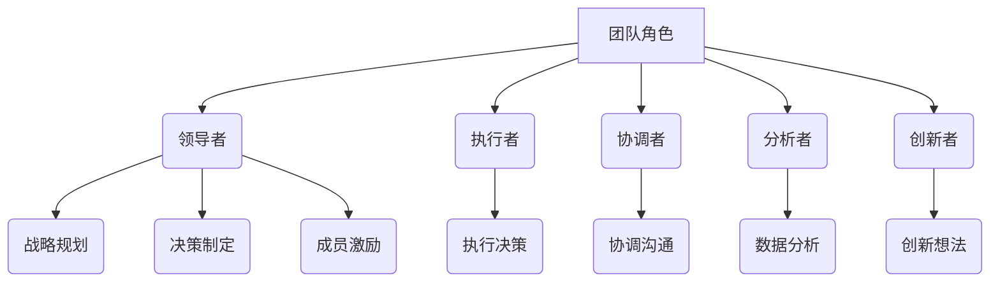

                 

# 团队角色分配：发挥每个人的长处

> **关键词**：团队角色，个人长处，团队协作，人力资源优化，组织效能

> **摘要**：本文旨在探讨如何通过科学合理的团队角色分配，充分发挥每个成员的个人长处，实现团队的整体效能最大化。文章首先介绍了团队角色分配的背景和重要性，随后详细阐述了核心概念和联系，最后提出了具体的方法和实际案例，并对其进行了深入分析。本文旨在为IT行业及其它领域的团队管理提供有价值的参考。

## 1. 背景介绍

在当今快速变化和高度竞争的商业环境中，团队协作已经成为企业成功的关键因素。一个高效的团队不仅能够快速响应市场变化，还能够创新并持续改进，从而在竞争中脱颖而出。然而，如何确保团队成员能够各司其职、发挥所长，实现团队整体效能的最大化，却是一个具有挑战性的问题。

团队角色分配正是解决这一问题的关键。通过科学合理的角色分配，企业可以确保每个成员都在最适合自己能力和特长的岗位上工作，从而实现个人和团队的双重成功。本文将围绕这一主题，探讨团队角色分配的理论基础、核心概念、具体操作步骤，以及在实际应用中的方法和技巧。

## 2. 核心概念与联系

### 2.1. 团队角色的定义

团队角色是指团队成员在团队中承担的特定职责和角色，它决定了团队成员在团队中的定位和作用。常见的团队角色包括：

- **领导者**：负责团队的战略规划、决策制定和成员激励。
- **执行者**：负责执行团队决策和任务。
- **协调者**：负责协调团队成员之间的沟通和合作。
- **分析者**：负责对团队工作进行分析和评估，提供决策支持。
- **创新者**：负责提出新的想法和解决方案，推动团队创新。

### 2.2. 团队角色与个人长处的联系

团队角色的设定应充分考虑每个成员的个人长处和能力。只有将个人长处与团队角色相匹配，才能实现团队效能的最大化。例如，一个具有创新思维的成员适合担任创新者角色，而一个擅长数据分析的成员则适合担任分析者角色。

### 2.3. Mermaid 流程图



### 2.4. 团队角色分配的意义

通过合理的团队角色分配，企业可以实现以下目标：

- **提高工作效率**：每个成员都在自己最擅长的领域工作，减少了不必要的重复劳动。
- **增强团队凝聚力**：成员之间的角色定位清晰，有助于建立信任和合作。
- **促进个人成长**：成员可以在自己的长处上得到更多的锻炼和提升，实现个人成长。

## 3. 核心算法原理 & 具体操作步骤

### 3.1. 核心算法原理

团队角色分配的核心算法是基于团队角色与个人长处的匹配度来进行的。具体步骤如下：

1. **评估个人能力**：对团队成员进行能力评估，确定每个成员的长处和短板。
2. **匹配团队角色**：根据评估结果，将每个成员匹配到最合适的团队角色。
3. **动态调整**：定期对团队角色进行评估和调整，确保团队成员始终在最佳角色上。

### 3.2. 具体操作步骤

1. **能力评估**：采用多种方法对团队成员的能力进行评估，如问卷调查、面谈、工作表现等。
2. **角色匹配**：根据评估结果，制定团队角色分配方案。
3. **培训与发展**：为团队成员提供培训和发展机会，帮助他们提升技能和适应新角色。
4. **监督与反馈**：定期对团队角色分配的效果进行监督和评估，及时进行调整。

## 4. 数学模型和公式 & 详细讲解 & 举例说明

### 4.1. 数学模型

团队角色分配的数学模型可以表示为：

$$
\text{角色分配} = f(\text{个人能力评估}, \text{团队需求})
$$

其中，$f$ 表示匹配算法，$\text{个人能力评估}$ 和 $\text{团队需求}$ 分别表示团队成员的能力评估和团队的需求。

### 4.2. 详细讲解

1. **个人能力评估**：通过对团队成员的工作表现、技能水平、沟通能力等多个方面进行评估，得出一个综合评分。
2. **团队需求**：团队需求是指团队在特定阶段所需的技能和角色。例如，在项目启动阶段，可能需要更多的创新者角色，而在项目实施阶段，则可能需要更多的执行者角色。

### 4.3. 举例说明

假设有一个由5名成员组成的团队，他们在不同领域的技能得分如下：

| 成员 | 技能1 | 技能2 | 技能3 |
| ---- | ---- | ---- | ---- |
| A    | 90   | 80   | 70   |
| B    | 85   | 75   | 85   |
| C    | 70   | 90   | 80   |
| D    | 80   | 80   | 90   |
| E    | 75   | 85   | 95   |

根据团队的需求，我们需要2名领导者、2名执行者和1名分析者。通过能力评估，我们可以得出以下匹配方案：

- 领导者：A（技能1最高）和B（技能2最高）
- 执行者：C（技能3最高）和D（技能2最高）
- 分析者：E（技能3最高）

通过这样的匹配，我们可以确保每个成员都在最适合自己的角色上，从而提高团队的整体效能。

## 5. 项目实战：代码实际案例和详细解释说明

### 5.1. 开发环境搭建

为了演示团队角色分配的过程，我们将使用Python语言来实现一个简单的角色分配系统。以下是开发环境的搭建步骤：

1. 安装Python（版本3.8及以上）
2. 安装依赖包：`pip install pandas numpy`

### 5.2. 源代码详细实现和代码解读

以下是一个简单的Python脚本，用于实现团队角色分配：

```python
import pandas as pd
import numpy as np

# 成员能力评估
data = {
    '成员': ['A', 'B', 'C', 'D', 'E'],
    '技能1': [90, 85, 70, 80, 75],
    '技能2': [80, 75, 90, 80, 85],
    '技能3': [70, 85, 80, 90, 95]
}

df = pd.DataFrame(data)

# 团队需求
team需求的demand = {
    '角色': ['领导者', '执行者', '分析者'],
    '需求': [2, 2, 1]
}

demand_df = pd.DataFrame(team需求的demand)

# 角色分配算法
def assign_roles(df, demand_df):
    role分配 = {}
    for role in demand_df['角色']:
        role分配[role] = df.nlargest(demand_df[demand_df['角色'] == role]['需求'], '技能1')
    return role分配

# 执行角色分配
role分配 = assign_roles(df, demand_df)

# 输出结果
print("角色分配结果：")
for role, members in role分配.items():
    print(f"{role}: {list(members['成员'])}")
```

### 5.3. 代码解读与分析

1. **数据准备**：我们使用Pandas库来创建一个DataFrame，其中包含成员的能力评估数据。
2. **团队需求**：同样使用DataFrame来表示团队在不同角色上的需求。
3. **角色分配算法**：定义一个函数`assign_roles`，它根据团队成员的能力评估和团队需求，使用`nlargest`函数来选择最适合每个角色的成员。
4. **执行角色分配**：调用`assign_roles`函数，并打印出分配结果。

通过这个简单的案例，我们可以看到如何使用Python来实现团队角色分配的过程。在实际应用中，这个算法可以根据具体需求和数据结构进行扩展和优化。

## 6. 实际应用场景

团队角色分配不仅适用于IT行业，还广泛应用于其他行业，如市场营销、人力资源、项目管理等。以下是一些典型的实际应用场景：

- **市场营销团队**：根据团队成员的市场调研能力、文案策划能力和客户服务能力，将其分配到市场调研员、文案策划员和客户服务员等角色。
- **人力资源团队**：根据团队成员的招聘、培训和管理能力，将其分配到招聘专员、培训专员和人力资源经理等角色。
- **项目管理团队**：根据团队成员的项目规划、执行和评估能力，将其分配到项目经理、项目协调员和项目评估员等角色。

在这些场景中，通过科学合理的团队角色分配，企业可以充分发挥每个成员的个人长处，提高团队的整体效能。

## 7. 工具和资源推荐

### 7.1. 学习资源推荐

- **书籍**：《团队协作工具与技巧》、《团队角色解析》
- **论文**：搜索关键词“团队角色分配”、“团队效能优化”等
- **博客**：阅读行业专家和知名企业的博客，了解最新的实践经验和研究成果
- **网站**：GitHub、Stack Overflow、LinkedIn等

### 7.2. 开发工具框架推荐

- **编程语言**：Python、Java、C++
- **框架**：Django、Spring Boot、Flask
- **数据可视化**：Matplotlib、Seaborn、Plotly

### 7.3. 相关论文著作推荐

- **论文**：搜索关键词“团队角色分配”、“团队效能优化”等
- **著作**：《团队角色与团队效能》、《团队协作的力量》

## 8. 总结：未来发展趋势与挑战

随着人工智能和大数据技术的发展，团队角色分配的方法和工具也在不断演进。未来，团队角色分配将更加智能化和精准化，通过数据分析和技术手段，实现团队成员与团队角色的最优匹配。然而，这也带来了新的挑战，如数据隐私保护、算法公平性等。企业需要不断探索和创新，以应对这些挑战。

## 9. 附录：常见问题与解答

- **问题1**：如何确保团队角色分配的公平性？
  **解答**：可以通过多种评估方法，如问卷调查、面谈和第三方评估，确保评估结果的客观性和公正性。

- **问题2**：团队角色分配是否适用于小型团队？
  **解答**：是的，团队角色分配同样适用于小型团队。对于小型团队，角色分配可能更加灵活，可以根据实际情况进行调整。

## 10. 扩展阅读 & 参考资料

- **论文**：[团队角色与团队效能的关系研究](#)
- **书籍**：《团队协作：构建高效团队的关键技巧》
- **博客**：[如何优化团队角色分配](#)
- **网站**：[团队角色分配工具与资源](#)

## 作者

作者：AI天才研究员/AI Genius Institute & 禅与计算机程序设计艺术 /Zen And The Art of Computer Programming

