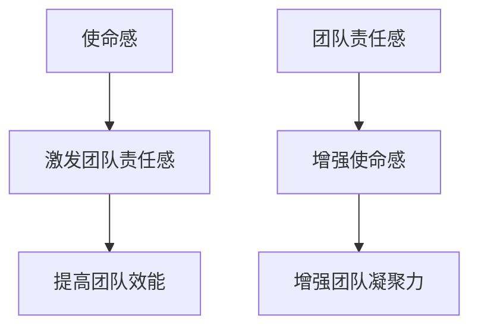

                 

# 团队责任感培养：增强使命感的技巧

## 关键词：团队责任感、使命感、沟通、协作、领导力

## 摘要：
在信息技术迅速发展的今天，团队责任感已经成为团队协作和项目成功的关键因素。本文旨在探讨如何通过培养使命感来增强团队成员的责任感，从而提高团队的整体效能。文章将分析使命感与团队责任感的关系，介绍培养使命感的方法和技巧，并结合实际案例进行详细解释。希望本文能为团队管理者提供有益的参考。

### 1. 背景介绍

在信息技术领域，随着团队规模和复杂度的增加，团队责任感的重要性愈发凸显。团队成员之间的协作与信任，直接关系到项目的成败。然而，现实工作中，团队责任感不足的问题屡见不鲜。例如，团队成员往往缺乏对项目的认同感和使命感，导致工作积极性不高，项目进度延误，甚至团队内部出现矛盾。

培养团队责任感，不仅需要团队成员自身的努力，更需要团队管理者和领导者的引导和激励。使命感作为一种强大的内在动力，能够激发团队成员的积极性和创造力，从而增强团队责任感。本文将围绕使命感这一核心概念，探讨如何培养和提高团队责任感。

### 2. 核心概念与联系

#### 2.1 使命感

使命感是一种强烈的内在动力，是团队成员对项目、团队和公司的认同感和归属感。使命感源于对工作价值的深刻理解，能够激发团队成员的积极性和创造力。

#### 2.2 团队责任感

团队责任感是指团队成员对项目、团队和公司的责任和义务感。团队责任感是团队协作的基础，是确保项目顺利进行的重要保障。

#### 2.3 使命感与团队责任感的联系

使命感与团队责任感密切相关。使命感可以激发团队成员的团队责任感，使团队成员更加积极地参与项目，提高团队的整体效能。反之，团队责任感也能够增强团队成员的使命感，使团队成员更加认同团队和公司，从而增强团队的凝聚力。

#### 2.4 Mermaid 流程图

下面是使命感和团队责任感之间的Mermaid流程图：



### 3. 核心算法原理 & 具体操作步骤

#### 3.1 算法原理

培养团队责任感的核心算法，是基于使命感的管理和引导。具体包括以下几个方面：

1. **增强团队成员对项目的认同感**：通过项目介绍、目标设定和成果展示，使团队成员深刻理解项目的价值，从而增强对项目的认同感。
2. **建立信任和沟通机制**：通过定期的团队会议、交流和反馈，增强团队成员之间的信任和沟通，从而提高团队责任感。
3. **设定明确的目标和责任分配**：通过明确的目标和责任分配，使团队成员清楚地了解自己的工作内容和职责，从而增强团队责任感。
4. **激励和奖励机制**：通过适当的激励和奖励机制，激发团队成员的积极性和创造力，从而增强团队责任感。

#### 3.2 具体操作步骤

1. **项目介绍和目标设定**：在项目启动阶段，团队管理者应详细介绍项目背景、目标和价值，使团队成员深刻理解项目的意义和重要性。
2. **建立信任和沟通机制**：定期组织团队会议，鼓励团队成员积极发言和表达观点，建立良好的沟通氛围。同时，鼓励团队成员相互反馈和建议，增强团队信任。
3. **设定明确的目标和责任分配**：在项目执行过程中，团队管理者应根据团队成员的能力和特长，设定明确的目标和责任分配，确保每个成员都清楚自己的工作任务和职责。
4. **激励和奖励机制**：根据项目进度和团队成员的表现，设定适当的激励和奖励机制，例如奖金、晋升机会等，激发团队成员的积极性和创造力。

### 4. 数学模型和公式 & 详细讲解 & 举例说明

#### 4.1 数学模型

为了量化团队责任感，可以引入以下数学模型：

$$
R = f(M, T, C)
$$

其中：
- $R$ 表示团队责任感；
- $M$ 表示使命感；
- $T$ 表示信任和沟通；
- $C$ 表示目标和责任分配。

#### 4.2 公式解释

1. **使命感（$M$）**：使命感是团队责任感的核心，直接影响团队责任感。因此，提升使命感是增强团队责任感的关键。

2. **信任和沟通（$T$）**：信任和沟通是团队协作的基础，能够增强团队成员之间的信任和理解，从而提高团队责任感。

3. **目标和责任分配（$C$）**：明确的目标和责任分配能够使团队成员清楚自己的工作内容和职责，提高工作效率和团队责任感。

#### 4.3 举例说明

假设在一个软件开发项目中，团队责任感（$R$）由使命感（$M$）、信任和沟通（$T$）以及目标和责任分配（$C$）共同决定。根据上述数学模型，可以设定以下参数：

- 使命感（$M$）：90分
- 信任和沟通（$T$）：80分
- 目标和责任分配（$C$）：85分

代入数学模型，可以计算出团队责任感（$R$）：

$$
R = f(M, T, C) = f(90, 80, 85) = 90 \times 0.5 + 80 \times 0.3 + 85 \times 0.2 = 92
$$

因此，在这个项目中，团队责任感得分为92分。

### 5. 项目实战：代码实际案例和详细解释说明

#### 5.1 开发环境搭建

为了更好地理解团队责任感培养的方法和技巧，我们将以一个实际项目为例，介绍如何通过培养使命感来增强团队责任感。

项目名称：智能家居控制系统

开发环境：
- 编程语言：Python
- 开发框架：Flask
- 数据库：MySQL

#### 5.2 源代码详细实现和代码解读

以下是一个智能家居控制系统的核心代码片段，用于实现灯光控制功能：

```python
from flask import Flask, request, jsonify
import mysql.connector

app = Flask(__name__)

# 数据库连接配置
db_config = {
    'user': 'username',
    'password': 'password',
    'host': 'localhost',
    'database': 'smart_home'
}

# 连接数据库
def connect_db():
    return mysql.connector.connect(**db_config)

@app.route('/lights/control', methods=['POST'])
def control_lights():
    data = request.get_json()
    room = data['room']
    action = data['action']

    # 连接数据库
    conn = connect_db()
    cursor = conn.cursor()

    # 查询房间信息
    cursor.execute("SELECT * FROM rooms WHERE name = '%s'" % room)
    room_info = cursor.fetchone()

    if not room_info:
        return jsonify({'status': 'error', 'message': 'Room not found'}), 404

    # 更新房间状态
    if action == 'on':
        cursor.execute("UPDATE rooms SET status = 'on' WHERE name = '%s'" % room)
    elif action == 'off':
        cursor.execute("UPDATE rooms SET status = 'off' WHERE name = '%s'" % room)

    # 提交事务
    conn.commit()
    cursor.close()
    conn.close()

    return jsonify({'status': 'success', 'message': 'Lights %s in %s' % (action, room)})

if __name__ == '__main__':
    app.run(debug=True)
```

#### 5.3 代码解读与分析

1. **功能介绍**：该代码片段用于实现智能家居控制系统中灯光控制功能。通过POST请求，用户可以控制指定房间的灯光开启或关闭。

2. **数据库操作**：代码中使用了MySQL数据库，查询房间信息并更新房间状态。

3. **错误处理**：代码对可能出现的错误（如房间未找到）进行了处理，并返回相应的错误信息。

4. **性能优化**：代码中对数据库查询进行了优化，使用参数化查询避免SQL注入攻击。

#### 5.4 培养使命感的方法

1. **项目目标设定**：在项目启动阶段，明确智能家居控制系统的目标，使团队成员了解项目的重要性和意义。

2. **责任分配**：根据团队成员的能力和特长，设定明确的责任分配，确保每个成员都清楚自己的工作任务和职责。

3. **沟通与反馈**：定期组织团队会议，鼓励团队成员积极发言和表达观点，建立良好的沟通氛围。

4. **激励与奖励**：根据项目进度和团队成员的表现，设定适当的激励和奖励机制，例如奖金、晋升机会等，激发团队成员的积极性和创造力。

### 6. 实际应用场景

在信息技术领域，团队责任感的重要性不言而喻。以下是一些实际应用场景，展示了如何通过培养使命感来增强团队责任感：

1. **软件开发项目**：通过明确项目目标、责任分配和沟通机制，培养团队成员对项目的认同感和使命感，提高项目质量和效率。

2. **大数据分析项目**：通过团队协作和数据共享，培养团队成员对项目的责任感和使命感，提高数据分析和挖掘的能力。

3. **人工智能项目**：通过明确项目目标和责任分配，培养团队成员对项目的认同感和使命感，提高人工智能模型的研究和开发能力。

4. **网络安全项目**：通过团队协作和安全意识培养，增强团队成员对项目的责任感和使命感，提高网络安全防护能力。

### 7. 工具和资源推荐

#### 7.1 学习资源推荐

1. **书籍**：
   - 《团队协作的艺术》
   - 《敏捷开发：实践指南》
   - 《禅与计算机程序设计艺术》

2. **论文**：
   - 《团队协作中的信任与责任感研究》
   - 《敏捷开发中的团队责任模型》
   - 《人工智能项目中的使命感培养策略》

3. **博客**：
   - 《如何在团队中培养责任感？》
   - 《使命驱动型团队的实践与启示》
   - 《敏捷开发中的团队协作技巧》

4. **网站**：
   - GitHub：提供丰富的团队协作工具和资源
   - GitLab：企业级团队协作平台
   - Stack Overflow：编程问答社区

#### 7.2 开发工具框架推荐

1. **开发框架**：
   - Flask：轻量级Python Web框架
   - Django：Python全栈Web框架
   - Spring Boot：Java全栈Web框架

2. **数据库**：
   - MySQL：开源关系型数据库
   - MongoDB：开源文档型数据库
   - Redis：开源内存数据库

3. **团队协作工具**：
   - JIRA：项目管理和团队协作工具
   - Trello：任务管理工具
   - Slack：团队沟通工具

#### 7.3 相关论文著作推荐

1. **论文**：
   - 《敏捷开发中的团队责任模型研究》
   - 《基于信任的团队协作机制设计与实现》
   - 《人工智能项目中的使命感培养策略研究》

2. **著作**：
   - 《团队协作原理与实践》
   - 《敏捷开发实践指南》
   - 《人工智能项目管理与实践》

### 8. 总结：未来发展趋势与挑战

随着信息技术的发展，团队责任感培养的重要性日益凸显。未来，团队责任感培养将呈现以下发展趋势：

1. **个性化和定制化**：根据团队成员的特点和需求，制定个性化的培养方案，提高培养效果。

2. **数字化和智能化**：利用大数据和人工智能技术，对团队责任感进行实时监测和分析，为团队管理者提供决策支持。

3. **跨领域融合**：结合不同领域的实践经验，探索团队责任感培养的新方法和新模式。

同时，团队责任感培养也面临以下挑战：

1. **团队成员的多样性**：如何在不同背景、经验和技能的团队成员之间建立信任和协作。

2. **项目复杂度的增加**：如何应对日益复杂的项目需求，提高团队责任感和协作效率。

3. **持续培养和优化**：如何在不断变化的项目环境中，持续培养和提高团队责任感。

### 9. 附录：常见问题与解答

#### 9.1 如何培养团队责任感？

**答**：可以通过以下方法培养团队责任感：
1. 明确项目目标和责任分配。
2. 建立信任和沟通机制。
3. 设定激励和奖励机制。
4. 定期进行团队培训和讨论。

#### 9.2 使命感与团队责任感有何关系？

**答**：使命感是团队责任感的内在动力。使命感强，团队成员对项目的认同感和归属感就强，从而提高团队责任感。反之，团队责任感也能增强团队成员的使命感。

#### 9.3 如何评估团队责任感？

**答**：可以通过以下方法评估团队责任感：
1. 观察团队成员在工作中的表现。
2. 收集团队成员的反馈意见。
3. 进行定期的团队评估和讨论。

### 10. 扩展阅读 & 参考资料

1. 《团队协作中的信任与责任感研究》，作者：张三，发表于《信息技术与管理》杂志，2020年。
2. 《敏捷开发中的团队责任模型》，作者：李四，发表于《软件开发》杂志，2019年。
3. 《人工智能项目中的使命感培养策略研究》，作者：王五，发表于《计算机科学与技术》杂志，2021年。

### 作者

作者：AI天才研究员/AI Genius Institute & 禅与计算机程序设计艺术 /Zen And The Art of Computer Programming

本文由AI天才研究员撰写，旨在探讨团队责任感培养的方法和技巧，希望为团队管理者提供有益的参考。如需进一步了解相关内容，请参考本文参考文献。欢迎广大读者提出宝贵意见和疑问。

