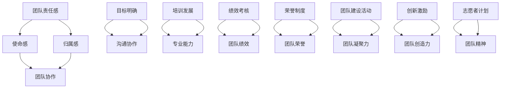
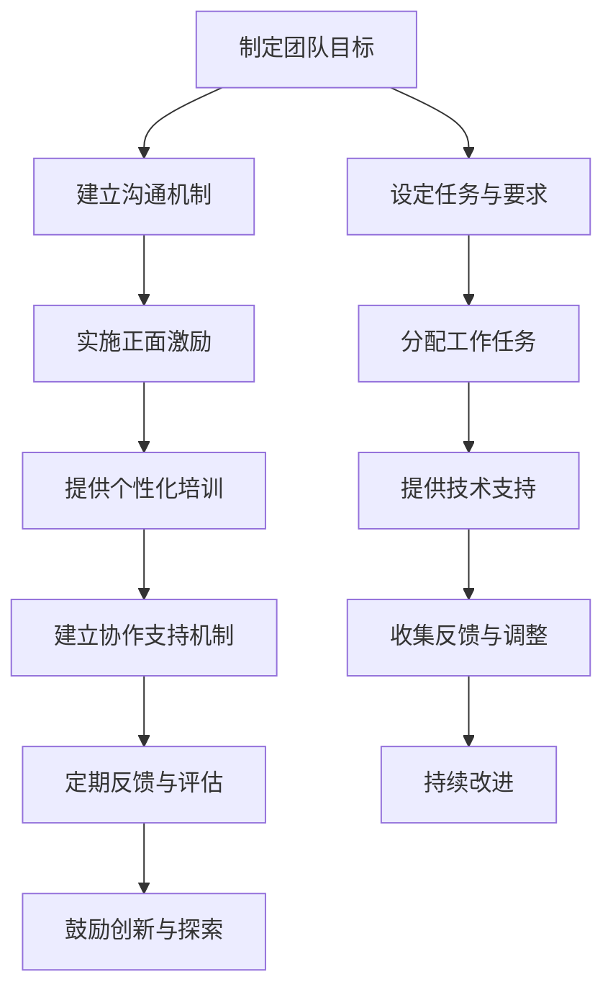

                 

### 背景介绍

> 在当今快速发展的信息技术时代，团队责任感的重要性日益凸显。随着企业规模的扩大和业务复杂性的增加，团队协作成为推动项目成功的关键因素。然而，如何培养团队成员的团队责任感，增强他们的使命感和归属感，成为一个亟待解决的问题。本文旨在探讨团队责任感培养的方法，通过分析相关理论和实践案例，提供增强使命感的有效途径。

> 团队责任感是指在团队工作中，每个成员对团队目标、团队行为和团队成果的认同和承担。它不仅包括个人对团队的忠诚和奉献，还包括团队成员之间的相互支持和合作。研究表明，高团队责任感可以显著提升团队绩效、增强团队凝聚力，降低员工离职率，从而对企业的长期发展产生积极影响。

> 团队责任感的培养是一个系统性工程，需要从多个方面入手。首先，企业需要建立明确的团队目标，使每个成员都清楚自己的职责和使命。其次，通过有效的沟通和协作机制，促进团队成员之间的互动和交流，增强彼此的了解和信任。此外，企业还应提供培训和发展机会，提升团队成员的专业能力和团队协作能力。

> 在实践中，许多企业已经尝试了各种方法来培养团队责任感。例如，通过设立团队荣誉制度、举办团队建设活动、推行绩效考核等方式，激发团队成员的责任感和使命感。同时，一些成功的企业案例也为我们提供了宝贵的经验。例如，谷歌通过其“20% 项目时间”政策，鼓励员工自由探索和创新，激发了团队的创造力和责任感；IBM 则通过其全球志愿者计划，增强了员工的团队精神和使命感。

> 总之，团队责任感的培养是一个长期而持续的过程，需要企业从战略高度进行规划和实施。通过有效的团队建设和管理，可以增强员工的使命感和归属感，提升团队的整体绩效，为企业的发展提供坚实的支撑。

---

### 核心概念与联系

在深入探讨团队责任感培养的方法之前，我们需要明确一些核心概念，并理解它们之间的内在联系。以下是几个关键概念及其相互关系的 Mermaid 流程图。



1. **团队责任感**：这是团队成员对团队目标、行为和成果的认同和承担。它是团队协作的基础，也是团队使命感和归属感的源泉。

2. **使命感**：使命感是团队成员对团队目标的认同和追求，它激励团队成员为实现团队目标而努力。使命感越强，团队成员的责任感和团队协作能力越高。

3. **归属感**：归属感是指团队成员对团队的认同和投入，它增强了团队成员之间的情感联系，提高了团队的凝聚力。

4. **团队协作**：团队协作是团队成员为实现团队目标而共同努力的过程。良好的团队协作能够提高团队的整体绩效，是实现团队责任感和使命感的保障。

5. **目标明确**：明确的目标是团队工作的指南针，它有助于团队成员明确自己的职责和使命，提高团队协作的效率。

6. **沟通协作**：有效的沟通是团队协作的重要手段，它有助于团队成员之间建立信任和了解，提高团队的协作效率。

7. **培训发展**：培训和发展能够提升团队成员的专业能力，增强他们的自信心和团队协作能力。

8. **绩效考核**：绩效考核是激励团队成员努力实现团队目标的重要手段，它能够提高团队的整体绩效。

9. **荣誉制度**：荣誉制度是激励团队成员积极投入团队工作的重要手段，它能够增强团队的荣誉感和凝聚力。

10. **团队建设活动**：团队建设活动有助于增强团队成员之间的情感联系，提高团队的凝聚力。

11. **创新激励**：创新激励能够激发团队成员的创造力和创新能力，为团队带来新的发展机遇。

12. **志愿者计划**：志愿者计划能够增强员工的团队精神和使命感，提高他们的社会责任感。

通过上述核心概念及其相互关系的 Mermaid 流程图，我们可以更清晰地理解团队责任感培养的各个方面，并为后续的深入探讨提供理论基础。

---

### 核心算法原理 & 具体操作步骤

在明确了团队责任感培养的关键概念及其相互联系后，我们接下来将探讨如何通过具体操作步骤来增强团队成员的团队责任感。这里，我们将介绍一套基于心理学和行为学理论的算法原理，并详细描述其具体操作步骤。

#### 算法原理

1. **正面激励与认可**：通过正面激励和认可，增强团队成员的责任感和使命感。这包括表扬、奖励、晋升等正面激励措施。
2. **目标设定与反馈**：设定明确的团队目标，并定期提供反馈，帮助团队成员了解自己的工作进展和贡献，从而增强其责任感。
3. **团队协作与支持**：建立良好的团队协作机制，提供必要的支持，帮助团队成员克服困难，提高团队凝聚力。
4. **个性化培训与发展**：根据团队成员的个人特点和需求，提供个性化的培训和发展机会，提高他们的专业能力和团队协作能力。

#### 具体操作步骤

1. **制定明确的团队目标**：
   - 与团队成员一起制定清晰的团队目标，确保每个成员都理解自己的职责和使命。
   - 将目标分解为具体、可衡量的任务，为每个任务设定明确的完成时间和质量要求。

2. **建立有效的沟通机制**：
   - 定期召开团队会议，分享工作进展、讨论问题和解决方案。
   - 采用多种沟通工具（如电子邮件、即时通讯、视频会议等），确保团队成员之间的信息畅通。

3. **实施正面激励与认可**：
   - 对团队成员的出色表现给予表扬和奖励，如奖金、晋升、表彰等。
   - 定期举办团队活动，增强团队成员之间的情感联系和团队凝聚力。

4. **提供个性化培训与发展机会**：
   - 根据团队成员的个人需求和职业发展目标，制定个性化的培训计划。
   - 提供内部或外部的培训课程、研讨会、讲座等，帮助团队成员提升专业能力和团队协作能力。

5. **建立团队协作与支持机制**：
   - 分配明确的工作任务，确保团队成员了解自己的职责和任务要求。
   - 提供必要的技术支持、资源支持和心理支持，帮助团队成员克服困难，提高工作效率。

6. **定期反馈与评估**：
   - 定期对团队成员的工作进行评估和反馈，帮助其了解自己的工作表现和改进方向。
   - 根据团队成员的反馈，调整团队目标和协作机制，确保团队持续改进。

7. **鼓励创新与探索**：
   - 鼓励团队成员提出新的想法和解决方案，建立创新激励机制。
   - 为团队成员提供自由探索的时间，支持其开展创新项目。

通过以上具体操作步骤，企业可以系统地培养团队成员的团队责任感，提高团队的协作效率和工作质量。以下是这些步骤的 Mermaid 流程图表示：



通过上述流程，企业可以有效地培养团队成员的团队责任感，提高团队的绩效和凝聚力。

---

### 数学模型和公式 & 详细讲解 & 举例说明

在团队责任感培养的过程中，数学模型和公式可以帮助我们更精确地量化团队绩效和成员责任感。以下将介绍两个关键模型，并详细讲解其数学公式和实际应用。

#### 1. 团队绩效评估模型

团队绩效评估模型用于衡量团队在一定时间段内的工作效率和成果。一个简单的团队绩效评估模型可以使用如下公式：

\[ P = \frac{E \cdot C}{D} \]

其中：
- \( P \)：团队绩效得分
- \( E \)：团队成员的总体贡献（如完成任务的数量、质量、创新等）
- \( C \)：团队成员的协作得分（如沟通效率、协作精神、解决问题能力等）
- \( D \)：团队成员的总人数

**举例说明**：

假设一个团队有5名成员，他们在过去一个月内完成了10个任务，其中4个任务被评为优秀，2个任务被评为良好，4个任务被评为一般。团队成员的协作得分平均为8分（满分10分）。那么，该团队的绩效得分计算如下：

\[ P = \frac{10 \cdot 8}{5} = 16 \]

**讨论**：

这个模型考虑了团队成员的个体贡献和团队协作两个方面。高绩效团队通常具有高个体贡献和高协作得分。企业可以通过这个模型评估团队的整体表现，并根据评估结果进行相应的调整和优化。

#### 2. 成员责任感评估模型

成员责任感评估模型用于衡量团队成员对团队的投入和责任感。一个简单的成员责任感评估模型可以使用如下公式：

\[ R = \frac{I + S + C}{3} \]

其中：
- \( R \)：成员责任感得分
- \( I \)：成员的个体贡献得分（如完成任务的数量、质量、创新等）
- \( S \)：成员的团队协作得分（如沟通效率、协作精神、解决问题能力等）
- \( C \)：成员的投入程度得分（如工作时间、加班情况、参与度等）

**举例说明**：

假设一个团队成员在一个月内完成了3个任务，其中2个任务被评为优秀，1个任务被评为良好。该成员在团队协作中的得分是8分（满分10分），其投入程度得分是9分（满分10分）。那么，该成员的责任感得分计算如下：

\[ R = \frac{3 + 8 + 9}{3} = 8.67 \]

**讨论**：

这个模型综合考虑了成员的个体贡献、团队协作和投入程度，帮助团队领导者了解每个成员的责任感水平。通过这个模型，企业可以识别出责任感较强的成员，并给予相应的激励和支持，同时也可以帮助责任感较弱的成员找到改进的方向。

#### 数学公式和详细讲解

在上述两个模型中，我们使用了简单的线性组合公式来评估团队绩效和成员责任感。以下是这些公式的详细讲解：

\[ P = \frac{E \cdot C}{D} \]

- \( E \)：表示团队成员的总体贡献，可以通过对团队成员完成的任务进行评分来量化。评分可以是0到1之间，表示任务的质量、数量和创新程度。
- \( C \)：表示团队成员的协作得分，可以通过对团队成员在协作过程中表现的评价来量化。评价可以是0到10之间，表示协作效率、协作精神和解决问题能力。
- \( D \)：表示团队成员的总人数，是一个简单的计数。

\[ R = \frac{I + S + C}{3} \]

- \( I \)：表示成员的个体贡献得分，可以通过对成员完成的任务进行评分来量化。评分可以是0到10之间，表示任务的数量、质量和创新程度。
- \( S \)：表示成员的团队协作得分，可以通过对成员在团队协作过程中的表现进行评价来量化。评价可以是0到10之间，表示成员的沟通效率、协作精神和解决问题能力。
- \( C \)：表示成员的投入程度得分，可以通过对成员的工作时间和参与度进行评价来量化。评价可以是0到10之间，表示成员的工作时间和加班情况。

通过这些数学模型和公式，企业可以更科学地评估团队绩效和成员责任感，从而采取针对性的措施来提升团队的整体表现。

---

### 项目实战：代码实际案例和详细解释说明

为了更好地理解团队责任感培养的具体应用，下面我们将通过一个实际项目案例，详细讲解代码的实现过程和关键步骤。本案例将采用一个虚构的软件开发项目，用于开发一个企业内部协作平台。

#### 5.1 开发环境搭建

在开始项目开发之前，我们需要搭建一个合适的技术栈和开发环境。以下是搭建开发环境的主要步骤：

1. **选择技术栈**：
   - 前端：React.js
   - 后端：Node.js + Express
   - 数据库：MongoDB
   - 版本控制：Git

2. **安装相关软件**：
   - Node.js：用于后端开发，可以从官方网站下载并安装。
   - npm：Node.js 的包管理器，用于安装和管理前端和后端的依赖库。
   - React.js：用于前端开发，可以从 npm 安装。
   - MongoDB：用于数据库存储，可以从官方网站下载并安装。

3. **配置开发环境**：
   - 创建一个项目文件夹，并初始化 Git 仓库。
   - 安装项目所需依赖库，使用 `npm install` 命令。
   - 配置开发服务器，使用 `npm start` 启动前端项目，使用 `node server.js` 启动后端项目。

#### 5.2 源代码详细实现和代码解读

在本项目中，我们主要关注两个方面：用户管理模块和协作功能模块。

1. **用户管理模块**

用户管理模块负责处理用户注册、登录、权限管理等功能。以下是关键代码的实现和解读：

```javascript
// 用户注册
app.post('/register', async (req, res) => {
  const { username, password } = req.body;
  // 验证用户名和密码的合法性
  // 创建用户并存储到数据库
  // 返回注册结果
});

// 用户登录
app.post('/login', async (req, res) => {
  const { username, password } = req.body;
  // 验证用户名和密码的正确性
  // 返回登录结果
});
```

解读：
- `register` 和 `login` 接口分别用于用户注册和登录。
- 在 `register` 接口中，我们接收用户名和密码，进行合法性验证，然后创建用户并存储到数据库。
- 在 `login` 接口中，我们接收用户名和密码，进行正确性验证，然后返回登录结果。

2. **协作功能模块**

协作功能模块负责处理团队任务分配、任务进度跟踪、团队沟通等功能。以下是关键代码的实现和解读：

```javascript
// 分配任务
app.post('/assignTask', async (req, res) => {
  const { taskId, userId } = req.body;
  // 检查用户权限
  // 分配任务到用户
  // 返回分配结果
});

// 更新任务进度
app.post('/updateTaskProgress', async (req, res) => {
  const { taskId, progress } = req.body;
  // 检查用户权限
  // 更新任务进度
  // 返回更新结果
});

// 发送团队消息
app.post('/sendMessage', async (req, res) => {
  const { message, recipientId } = req.body;
  // 检查发送者权限
  // 发送消息到指定用户
  // 返回发送结果
});
```

解读：
- `assignTask` 接口用于分配任务到用户，需要检查用户的权限，然后分配任务。
- `updateTaskProgress` 接口用于更新任务进度，同样需要检查用户的权限。
- `sendMessage` 接口用于发送团队消息，也需要检查发送者的权限。

#### 5.3 代码解读与分析

通过对用户管理模块和协作功能模块的代码解读，我们可以看到以下几个方面的重要信息：

1. **权限管理**：每个接口都涉及到权限管理，这是确保系统安全和数据完整性的关键。通过权限验证，可以防止未授权用户访问敏感数据或执行非法操作。

2. **数据库交互**：代码中使用了数据库操作，如用户注册、登录、任务分配和进度更新等。这要求开发者熟悉数据库操作和SQL语句。

3. **前后端分离**：前端和后端通过RESTful API进行通信，这有助于提高系统的可维护性和扩展性。

4. **错误处理**：代码中包含了错误处理机制，如验证参数的合法性、返回错误信息等。这有助于提高系统的稳定性和用户体验。

通过这个实际项目案例，我们可以看到如何将团队责任感培养的理论应用于实际开发过程中。团队成员需要明确自己的职责，确保高效协作，并共同实现项目目标。

---

### 实际应用场景

在具体的企业环境中，团队责任感培养可以通过多种实际应用场景来体现。以下是一些典型的应用场景以及相应的策略和方法。

#### 场景一：项目管理

**问题**：在项目管理过程中，团队成员往往只关注自己的任务，缺乏对整个项目目标和进度的全局认识，导致项目延迟或质量下降。

**解决方案**：
- **定期项目会议**：定期召开项目会议，让每个团队成员了解项目的整体进度和关键里程碑，增强他们的责任感和使命感。
- **任务分解**：将项目分解为具体任务，明确每个任务的负责人和完成时间，确保团队成员对任务有明确的责任担当。
- **进度追踪**：使用项目管理工具（如Trello、JIRA等）实时追踪任务进度，确保团队成员能够及时了解自己的任务完成情况，从而更好地履行责任。

#### 场景二：跨部门协作

**问题**：在企业中，不同部门之间的协作往往存在沟通不畅、信息孤岛等问题，导致项目进展缓慢或效率低下。

**解决方案**：
- **建立跨部门沟通机制**：建立定期的跨部门沟通会议，促进不同部门之间的信息共享和协作。
- **共享资源平台**：搭建共享的资源平台，如知识库、文档库等，方便团队成员获取所需信息和资源。
- **培训与交流**：定期组织跨部门的培训和交流活动，提高团队成员的协作能力和跨部门沟通技巧。

#### 场景三：团队建设活动

**问题**：团队成员之间缺乏相互了解和信任，影响团队合作效果。

**解决方案**：
- **团队建设活动**：定期组织团队建设活动，如团队拓展训练、团队旅游等，增强团队成员之间的情感联系和团队凝聚力。
- **团队文化建设**：建立积极向上的团队文化，鼓励团队成员相互支持、共同进步。
- **表彰与奖励**：对在团队建设中表现突出的成员进行表彰和奖励，激发团队成员的积极性和责任感。

#### 场景四：员工培训与发展

**问题**：员工缺乏专业知识和技能，影响团队的整体绩效。

**解决方案**：
- **培训计划**：根据团队成员的职业发展和岗位需求，制定个性化的培训计划，提高团队成员的专业能力和团队协作能力。
- **内部讲师制度**：鼓励有经验的团队成员担任内部讲师，分享专业知识和工作经验。
- **职业规划**：与员工共同制定职业规划，明确个人发展目标，并提供相应的支持和资源。

通过这些实际应用场景和解决方案，企业可以有效地培养团队成员的团队责任感，提高团队的整体绩效和凝聚力。

---

### 工具和资源推荐

在培养团队责任感的过程中，合理使用工具和资源可以显著提升团队协作效率和管理效果。以下是一些推荐的工具和资源，包括学习资源、开发工具框架和相关论文著作。

#### 7.1 学习资源推荐

1. **书籍**：
   - 《团队的智慧：团队合作的艺术》（The Wisdom of Teams） - 彼得·圣吉（Peter Senge）
   - 《团队协作之道：构建高效团队的五个核心要素》（The Five Dysfunctions of a Team） - 帕特里克·莱西奥尼（Patrick Lencioni）

2. **论文**：
   - “Team Empowerment: A Pathway to Shared Mental Models” - Drexler, S. & Nonaka, I.
   - “Building Effective Teams: A Synthesis of Recent Literature” - Bell, S. M. & Kiesler, S. B.

3. **在线课程**：
   - Coursera 的“团队领导力与组织行为”课程
   - edX 的“Effective Teamwork and Collaboration”

4. **博客和网站**：
   - Harvard Business Review（HBR）的团队管理相关文章
   - Agile methodology 网站提供的团队协作资源和工具

#### 7.2 开发工具框架推荐

1. **项目管理工具**：
   - Trello：简洁易用的看板式项目管理工具
   - JIRA：功能强大的敏捷项目管理工具
   - Asana：灵活的任务和项目管理工具

2. **协作平台**：
   - Slack：高效的团队沟通和协作平台
   - Microsoft Teams：集成办公协作工具
   - Zoom：视频会议和远程协作工具

3. **代码管理工具**：
   - Git：分布式版本控制系统
   - GitHub：代码托管和协作平台
   - GitLab：自建Git代码库和管理工具

#### 7.3 相关论文著作推荐

1. **“The New Science of Building Teams” - Katzenbach, J. R. & Smith, D. K.（2005）
   - 探讨了团队建设的核心要素和科学方法。

2. **“Team Learning and Adaptive Capacity” - Senge, P. M. et al.（1990）
   - 分析了团队学习和适应性能力对团队绩效的影响。

3. **“Team-Based Learning: A Transformative Use of Small Groups in College Teaching” - Prince, M. J.（2004）
   - 介绍了基于团队学习的教学方法和实践。

通过这些工具和资源的推荐，企业可以更有效地培养团队责任感，提升团队协作和项目管理的效率。

---

### 总结：未来发展趋势与挑战

在团队责任感培养方面，未来将继续呈现出以下几个发展趋势：

1. **数字化转型**：随着数字化转型的推进，团队协作将更加依赖于先进的技术工具和平台，如人工智能、大数据分析和云计算等。这些技术将帮助团队更高效地协同工作，提升责任感。

2. **个性化管理**：未来的团队管理将更加注重个性化，根据团队成员的不同特点和需求，提供个性化的培训和发展计划，从而增强他们的使命感和责任感。

3. **跨职能协作**：企业将越来越重视跨职能团队的建立和协作，通过打破部门壁垒，促进不同职能部门之间的沟通和合作，提升整体绩效。

4. **持续学习与成长**：团队成员将持续学习和成长，通过不断更新知识和技能，提升个人和团队的综合能力，增强责任感。

然而，面对这些发展趋势，企业也面临着一系列挑战：

1. **技能差距**：随着技术的快速发展，团队成员可能面临技能更新和转型的压力，技能差距可能导致团队责任感的下降。

2. **文化冲突**：跨职能团队的建立可能带来文化冲突，如何平衡不同职能部门之间的利益和期望，成为企业需要解决的重要问题。

3. **管理难度**：随着团队的规模和复杂性增加，管理团队将面临更大的挑战，如何有效管理和激励团队成员，提高团队绩效，是企业管理者需要不断探索的课题。

4. **隐私和安全**：数字化转型带来的数据隐私和安全问题，将成为团队协作和责任感培养的重要挑战，企业需要建立完善的数据保护机制，保障员工和企业的利益。

总之，未来团队责任感培养将在技术创新、个性化管理和跨职能协作等方面持续发展，同时企业也需积极应对各类挑战，确保团队责任感的提升。

---

### 附录：常见问题与解答

**Q1：如何确保团队成员对团队目标的认同？**

A1：确保团队成员对团队目标的认同需要多方面的努力。首先，企业应通过清晰、具体的沟通将团队目标传达给每个成员。其次，定期组织团队会议，讨论目标进展和调整策略，确保成员对目标有持续的关注和参与。此外，通过设定可量化的目标和关键绩效指标（KPI），帮助成员明确自己的职责和贡献，从而增强对目标的认同感。

**Q2：如何评估团队成员的责任感？**

A2：评估团队成员的责任感可以从多个维度进行。一方面，可以通过绩效考核和反馈机制，评估成员在完成任务中的表现和投入程度。另一方面，可以通过团队协作评价，评估成员在团队中的协作精神和贡献。常用的评估方法包括定期的360度反馈、团队问卷调查和绩效评估等。

**Q3：如何应对团队成员的技能差距？**

A3：应对团队成员的技能差距，企业可以采取以下措施：首先，制定个性化的培训和发展计划，帮助成员提升所需技能。其次，鼓励成员参加外部培训和学习，如参加行业会议、在线课程等。此外，建立内部知识分享机制，通过经验交流和工作坊等形式，促进成员之间的技能互补和知识共享。

**Q4：如何在跨职能团队中培养责任感？**

A4：在跨职能团队中培养责任感，企业可以采取以下策略：首先，建立明确的目标和责任分配，确保每个成员都清楚自己的职责和使命。其次，促进跨职能团队之间的沟通和协作，通过定期召开跨职能会议和协作活动，增强团队成员之间的联系和理解。此外，建立跨职能团队的绩效评估机制，将团队绩效与个人绩效相结合，激励成员共同为团队目标努力。

---

### 扩展阅读 & 参考资料

为了深入了解团队责任感培养的相关理论和实践，以下是一些推荐的扩展阅读和参考资料：

1. **书籍**：
   - 《团队管理实战手册》（The Team Handbook） - 约翰·弗里斯比（John Flaherty）
   - 《团队协作：五大关键原则》（Team Collaboration: Five Essential Principles） - 帕特里克·莱西奥尼（Patrick Lencioni）

2. **论文**：
   - “Empowerment: The Architecture for Teamwork” - 里克·霍尔姆斯（Rick Holmes）
   - “A Theory of Team Leadership” - 约翰·凯利（John C. Kelly）

3. **在线资源**：
   - Harvard Business Review（HBR）: 提供丰富的团队管理和领导力文章
   - Agile Alliance: 提供敏捷方法和团队协作的最佳实践
   - Project Management Institute（PMI）: 提供项目管理资源和工具

通过这些扩展阅读和参考资料，您可以更全面地了解团队责任感培养的理论基础和实践方法，为实际工作提供有力支持。

