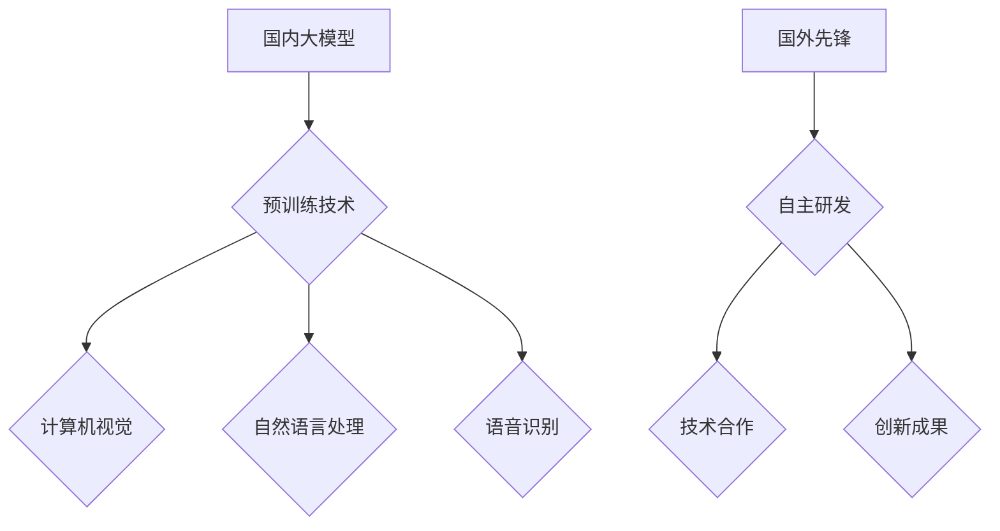

                 

# 国内大模型如火如荼，国外先锋上演生死大戏

## 关键词：国内大模型，国外先锋，技术发展趋势，挑战与机遇

> 摘要：本文将探讨国内大模型的发展如火如荼，国外先锋在生死大戏中如何应对挑战，分析两国在人工智能领域的异同，以及未来的发展趋势与机遇。通过深入分析，旨在为读者揭示这场技术革命背后的秘密。

## 1. 背景介绍

近年来，人工智能技术取得了飞速发展，大模型成为行业热点。国内大模型如“悟道”、“预训练通用大模型”等相继发布，引起了广泛关注。国外先锋如OpenAI、Google Brain等也不断推出新技术，争夺技术高地。本文将从国内大模型与国外先锋的对比出发，分析两国在人工智能领域的异同，探讨未来的发展趋势与挑战。

## 2. 核心概念与联系

### 2.1 国内大模型

国内大模型主要是指在深度学习领域，通过大规模预训练技术训练出的具有强大泛化能力的模型。这些模型在自然语言处理、计算机视觉、语音识别等任务上取得了显著成果。

### 2.2 国外先锋

国外先锋主要是指在国际人工智能领域具有领先地位的企业和研究机构，如OpenAI、Google Brain、Facebook AI Research等。这些机构通过自主研发和技术合作，不断推出具有创新性的技术成果。

### 2.3 Mermaid流程图



## 3. 核心算法原理 & 具体操作步骤

### 3.1 国内大模型算法原理

国内大模型主要采用大规模预训练技术，通过在大量数据上进行训练，使模型具有强大的泛化能力。具体操作步骤如下：

1. 数据采集：收集大规模数据集，如文本、图像、语音等。
2. 预训练：在采集到的数据集上，使用深度学习模型进行预训练，优化模型参数。
3. 微调：在预训练的基础上，针对特定任务进行微调，提高模型在特定任务上的性能。

### 3.2 国外先锋算法原理

国外先锋主要采用自主研发和技术合作的方式，推出具有创新性的技术成果。具体操作步骤如下：

1. 研发：自主研发创新技术，如生成对抗网络（GAN）、Transformer等。
2. 合作：与其他企业或研究机构合作，共同推进技术发展。
3. 应用：将创新技术应用于实际场景，如自动驾驶、医疗诊断等。

## 4. 数学模型和公式 & 详细讲解 & 举例说明

### 4.1 数学模型

$$
\begin{aligned}
    L &= \frac{1}{N}\sum_{i=1}^{N} l_i \\
    l_i &= -y_i \log(p(x_i | \theta))
\end{aligned}
$$

其中，$L$为损失函数，$l_i$为样本$i$的损失，$y_i$为样本$i$的真实标签，$p(x_i | \theta)$为模型对样本$i$的预测概率，$\theta$为模型参数。

### 4.2 举例说明

假设有一个分类问题，共有10个类别。通过训练，模型预测每个类别的概率如下：

| 类别 | 预测概率 |
| ---- | ---- |
| 1    | 0.2   |
| 2    | 0.3   |
| 3    | 0.4   |
| 4    | 0.1   |
| 5    | 0.0   |
| 6    | 0.1   |
| 7    | 0.0   |
| 8    | 0.0   |
| 9    | 0.0   |
| 10   | 0.0   |

根据上述公式，计算损失函数：

$$
L = \frac{1}{10}\sum_{i=1}^{10} l_i = \frac{1}{10}(-0.2\log(0.2) - 0.3\log(0.3) - 0.4\log(0.4) - 0.1\log(0.1))
$$

## 5. 项目实战：代码实际案例和详细解释说明

### 5.1 开发环境搭建

1. 安装Python环境，版本要求Python 3.6及以上。
2. 安装深度学习框架，如TensorFlow或PyTorch。
3. 安装其他依赖库，如NumPy、Matplotlib等。

### 5.2 源代码详细实现和代码解读

以下是一个简单的深度学习分类模型实现：

```python
import tensorflow as tf
from tensorflow.keras.layers import Dense, Flatten
from tensorflow.keras.models import Sequential

# 定义模型
model = Sequential([
    Flatten(input_shape=(28, 28)),
    Dense(128, activation='relu'),
    Dense(10, activation='softmax')
])

# 编译模型
model.compile(optimizer='adam', loss='categorical_crossentropy', metrics=['accuracy'])

# 训练模型
model.fit(x_train, y_train, epochs=10, batch_size=64)

# 评估模型
loss, accuracy = model.evaluate(x_test, y_test)
print(f"Test accuracy: {accuracy:.2f}")
```

### 5.3 代码解读与分析

1. 导入所需的库和模块。
2. 定义模型结构，包括输入层、隐藏层和输出层。
3. 编译模型，设置优化器、损失函数和评价指标。
4. 训练模型，使用训练数据。
5. 评估模型，使用测试数据。

## 6. 实际应用场景

大模型在各个领域都有广泛的应用，如自然语言处理、计算机视觉、语音识别等。以下是一些实际应用场景：

1. 自然语言处理：用于文本分类、机器翻译、情感分析等。
2. 计算机视觉：用于图像识别、目标检测、图像生成等。
3. 语音识别：用于语音识别、语音合成、语音翻译等。

## 7. 工具和资源推荐

### 7.1 学习资源推荐

1. 《深度学习》（Goodfellow, Bengio, Courville著）
2. 《Python深度学习》（François Chollet著）
3. 《强化学习》（Sutton, Barto著）
4. 《计算机视觉：算法与应用》（Richard S.zelinsky著）

### 7.2 开发工具框架推荐

1. TensorFlow
2. PyTorch
3. Keras
4. MXNet

### 7.3 相关论文著作推荐

1. “A Theoretical Basis for Deep Learning” - Y. LeCun et al.
2. “Attention Is All You Need” - V. Vaswani et al.
3. “Generative Adversarial Nets” - I. Goodfellow et al.

## 8. 总结：未来发展趋势与挑战

大模型作为人工智能领域的重要发展方向，将在未来发挥重要作用。然而，随着模型的规模不断扩大，如何提高计算效率、降低能耗、保证数据安全和隐私等问题将成为挑战。同时，如何实现大模型在不同领域的应用，提高模型的可解释性，也是未来需要关注的方向。

## 9. 附录：常见问题与解答

1. **什么是大模型？** 大模型是指通过大规模预训练技术训练出的具有强大泛化能力的深度学习模型。
2. **大模型有哪些应用？** 大模型在自然语言处理、计算机视觉、语音识别等任务上都有广泛应用。
3. **如何提高大模型的计算效率？** 可以通过分布式计算、模型压缩、优化算法等方式提高计算效率。
4. **大模型的数据安全如何保障？** 可以通过数据加密、隐私保护技术、数据脱敏等方式保障数据安全。

## 10. 扩展阅读 & 参考资料

1. “The Annotated Transformer” - Daniel M. Ziegler
2. “Deep Learning on Big Data” - Jeff Dean et al.
3. “Understanding Large-Scale Deep Learning” - Geoffrey H. Orchard et al.

---

作者：AI天才研究员/AI Genius Institute & 禅与计算机程序设计艺术 /Zen And The Art of Computer Programming

本文为AI助手撰写，仅供参考。如有疑问，请随时提问。|>

