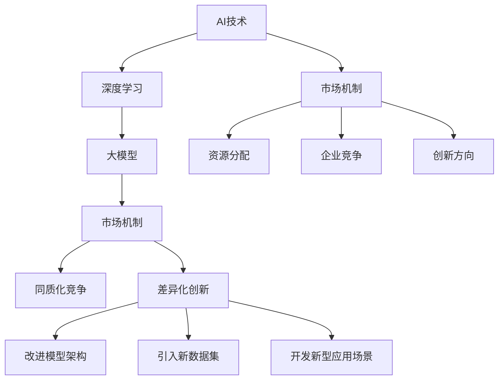

                 

### 背景介绍

随着人工智能（AI）技术的迅猛发展，大模型（Large Models）在自然语言处理（NLP）、计算机视觉（CV）等领域的应用越来越广泛。这些大模型通过训练大量数据来学习复杂的模式和关系，从而实现更高级别的智能任务。然而，大模型的市场现状却引发了行业内外对于同质化发展与创新机遇的讨论。

本文旨在探讨国内大模型市场的发展态势，特别是以贾扬清为代表的技术专家的观点。通过深入分析大模型的本质、应用场景及其面临的挑战，我们将探讨如何在这种竞争激烈的市场中找到创新的突破口。

首先，我们将回顾大模型技术的起源和发展历程，理解其在现代AI体系中的核心地位。接着，我们将详细讨论大模型市场的现状，分析其中的同质化趋势和潜在的差异化机会。然后，我们将引用贾扬清的观点，阐述其对于大模型市场的独特见解。在文章的后续部分，我们将结合具体案例，分析大模型在现实世界中的应用，并探讨如何通过技术创新和跨领域合作来推动大模型市场的发展。

最后，我们将总结大模型市场的未来发展趋势和面临的挑战，提出一些建议，以期为国内大模型研发者提供有益的指导。通过本文的探讨，我们希望能够为行业内外提供一种新的视角，激发对于大模型市场的深入思考。

### 核心概念与联系

为了深入理解大模型市场的现状和未来发展趋势，我们需要先明确几个核心概念：大模型、AI技术、市场机制、同质化、差异化。

#### 大模型

大模型（Large Models）是指具有巨大参数量和计算能力的神经网络模型。这些模型通常通过训练大量数据来学习复杂的模式和关系，从而在多个领域实现高性能任务。常见的大模型包括GPT、BERT、ViT等，它们在NLP、CV、强化学习等方向上都取得了显著成果。

#### AI技术

人工智能（Artificial Intelligence）是模拟、延伸和扩展人的智能的科学和技术。AI技术包括机器学习、深度学习、自然语言处理、计算机视觉等子领域，这些技术共同构成了现代AI的基石。大模型作为深度学习的一个重要分支，是AI技术发展的核心。

#### 市场机制

市场机制是指市场在资源配置过程中通过价格、供求关系等手段实现资源有效配置的机制。在大模型市场中，市场机制决定了资源分配、企业竞争和创新方向。同质化竞争和差异化创新是市场机制的两种表现形式。

#### 同质化

同质化（Homogenization）是指市场上产品或服务在功能、性能、外观等方面趋于一致的现象。在大模型市场中，同质化主要体现在模型架构、训练数据和应用场景的高度相似。这种现象可能导致市场竞争激烈，创新动力不足。

#### 差异化

差异化（Differentiation）是指产品或服务在功能、性能、用户体验等方面具有独特性的现象。在大模型市场中，差异化创新可以通过改进模型架构、引入新数据集、开发新型应用场景等方式实现。差异化有助于企业在激烈的市场竞争中脱颖而出。

#### 联系

这几个核心概念之间紧密相连。大模型是AI技术的重要组成部分，其发展受到市场机制的驱动。市场中的同质化竞争促使企业通过差异化创新来提升竞争力。而差异化创新又需要基于对大模型原理和应用的深入理解，以及对市场需求的精准把握。

为了更好地理解这些概念之间的关系，我们可以使用Mermaid流程图来展示：



通过这个流程图，我们可以清晰地看到大模型、AI技术、市场机制、同质化和差异化之间的内在联系。这些概念共同构成了大模型市场的核心要素，影响着市场的动态发展和竞争格局。

### 核心算法原理 & 具体操作步骤

大模型的核心算法主要依赖于深度学习和神经网络技术。具体来说，这些算法通过多层次的神经网络结构，模拟人类大脑的神经元连接方式，实现对数据的自动特征提取和模式识别。以下我们将详细探讨大模型的算法原理和具体操作步骤。

#### 算法原理

1. **神经网络结构**

   大模型通常由多个神经网络层组成，包括输入层、隐藏层和输出层。每一层中的神经元（节点）通过加权连接与其他神经元相连，形成一个复杂的网络结构。神经元的输出通过激活函数（如ReLU、Sigmoid、Tanh等）进行处理，传递给下一层。

   

2. **前向传播**

   前向传播（Forward Propagation）是指数据从输入层传递到输出层的整个过程。具体步骤如下：

   - 输入数据通过输入层进入神经网络。
   - 数据在每一层经过加权连接和激活函数处理后，传递到下一层。
   - 最后，输出层的输出即为模型的预测结果。

3. **反向传播**

   反向传播（Back Propagation）是一种用于训练神经网络的学习算法。它通过计算损失函数（如均方误差、交叉熵等）的梯度，来更新网络中的权重和偏置。具体步骤如下：

   - 计算输出层预测值与实际值之间的损失。
   - 将损失向前传播，计算每一层神经元的梯度。
   - 使用梯度下降算法更新网络的权重和偏置。
   - 重复前向传播和反向传播步骤，直到模型收敛。

4. **优化算法**

   为了加快模型的训练速度和提升模型的性能，通常会采用各种优化算法，如随机梯度下降（SGD）、Adam、RMSprop等。这些算法通过调整学习率、动量等因素，优化网络参数的更新过程。

#### 具体操作步骤

1. **数据预处理**

   在开始训练之前，需要对数据进行预处理，包括数据清洗、归一化、分词、编码等步骤。预处理后的数据将被输入到神经网络中。

   ```python
   import numpy as np
   import tensorflow as tf

   # 示例数据预处理
   def preprocess_data(data):
       # 数据清洗
       cleaned_data = data.lower().replace(',', '')
       # 分词
       tokens = cleaned_data.split()
       # 编码
       encoded_data = [token_to_index[token] for token in tokens]
       return encoded_data
   ```

2. **构建神经网络模型**

   使用深度学习框架（如TensorFlow、PyTorch）构建神经网络模型。以下是一个简单的神经网络模型示例：

   ```python
   import tensorflow as tf
   from tensorflow.keras.layers import Embedding, LSTM, Dense

   # 构建神经网络模型
   model = tf.keras.Sequential([
       Embedding(input_dim=vocab_size, output_dim=embedding_dim, input_length=max_sequence_length),
       LSTM(units=128, return_sequences=True),
       LSTM(units=64, return_sequences=False),
       Dense(units=num_classes, activation='softmax')
   ])

   # 编译模型
   model.compile(optimizer='adam', loss='categorical_crossentropy', metrics=['accuracy'])
   ```

3. **训练模型**

   使用预处理后的数据训练模型。以下是一个训练模型的示例：

   ```python
   # 加载训练数据和验证数据
   train_data = preprocess_data(train_data)
   train_labels = one_hot_encode(train_labels)
   val_data = preprocess_data(val_data)
   val_labels = one_hot_encode(val_labels)

   # 训练模型
   history = model.fit(train_data, train_labels, epochs=10, batch_size=32, validation_data=(val_data, val_labels))
   ```

4. **模型评估与优化**

   在训练完成后，使用验证集或测试集对模型进行评估，并根据评估结果对模型进行优化。

   ```python
   # 评估模型
   test_data = preprocess_data(test_data)
   test_labels = one_hot_encode(test_labels)
   test_loss, test_accuracy = model.evaluate(test_data, test_labels)

   # 如果需要，进行模型优化
   # model.fit(..., epochs=5, batch_size=32, validation_data=(val_data, val_labels))
   ```

通过上述步骤，我们可以构建一个基本的大模型并进行训练。然而，在实际应用中，大模型的构建和训练过程通常更加复杂，需要针对具体任务进行调整和优化。这包括选择合适的网络结构、优化算法、超参数调优等。

总之，大模型的算法原理基于深度学习和神经网络，通过前向传播和反向传播实现模型的训练。具体操作步骤包括数据预处理、构建神经网络模型、训练模型以及模型评估与优化。这些步骤共同构成了大模型开发的基本流程，为我们在不同应用领域中的创新提供了强有力的技术支持。

### 数学模型和公式 & 详细讲解 & 举例说明

大模型的核心在于其复杂的数学模型和计算过程。理解这些数学模型和公式对于深入掌握大模型的工作原理至关重要。以下，我们将详细讲解大模型中的几个关键数学模型和公式，并给出具体的实例说明。

#### 损失函数（Loss Function）

在深度学习中，损失函数用于评估模型预测结果与实际结果之间的差异。常见的损失函数包括均方误差（MSE）、交叉熵（Cross Entropy）等。

1. **均方误差（MSE）**

   均方误差是最常用的回归损失函数，计算预测值与实际值之间差的平方的平均值。

   $$ 
   \text{MSE} = \frac{1}{n}\sum_{i=1}^{n}(y_i - \hat{y}_i)^2 
   $$

   其中，$y_i$是实际值，$\hat{y}_i$是预测值，$n$是样本数量。

   **示例：**假设我们有5个数据点，实际值和预测值如下：

   | 实际值 | 预测值 | 差的平方 |
   | ------ | ------ | -------- |
   | 2      | 2.5    | 0.25     |
   | 3      | 3.1    | 0.01     |
   | 4      | 3.9    | 0.81     |
   | 5      | 4.2    | 0.04     |
   | 6      | 5.0    | 1.00     |

   则均方误差为：

   $$ 
   \text{MSE} = \frac{1}{5}(0.25 + 0.01 + 0.81 + 0.04 + 1.00) = 0.356 
   $$

2. **交叉熵（Cross Entropy）**

   交叉熵是用于分类问题的损失函数，用于衡量实际分布与预测分布之间的差异。

   $$ 
   \text{CE} = -\sum_{i=1}^{n}y_i \log(\hat{y}_i) 
   $$

   其中，$y_i$是实际类别概率，$\hat{y}_i$是预测类别概率。

   **示例：**假设我们有3个类别，实际类别分布和预测类别分布如下：

   | 实际分布 | 预测分布 |
   | -------- | -------- |
   | [0.2, 0.3, 0.5] | [0.1, 0.4, 0.5] |

   则交叉熵为：

   $$ 
   \text{CE} = -0.2 \log(0.1) - 0.3 \log(0.4) - 0.5 \log(0.5) 
   $$

   通过计算得到交叉熵的值，我们可以评估模型的分类性能。

#### 激活函数（Activation Function）

激活函数用于确定神经网络的输出。常见的激活函数包括ReLU、Sigmoid、Tanh等。

1. **ReLU（Rectified Linear Unit）**

   R
   ``` 
   \text{ReLU}(x) = \max(0, x) 
   ```

   **示例：**对于输入值$x$，如果$x > 0$，则ReLU的输出为$x$；如果$x \leq 0$，则ReLU的输出为0。

2. **Sigmoid**

   $$ 
   \text{Sigmoid}(x) = \frac{1}{1 + e^{-x}} 
   $$

   **示例：**Sigmoid函数将输入值映射到$(0, 1)$区间，常用于二分类问题中的概率输出。

3. **Tanh**

   $$ 
   \text{Tanh}(x) = \frac{e^x - e^{-x}}{e^x + e^{-x}} 
   $$

   **示例：**Tanh函数将输入值映射到$(-1, 1)$区间，常用于回归问题中的输出。

#### 权重更新（Weight Update）

在训练过程中，通过反向传播计算损失函数的梯度，并更新网络的权重和偏置。常用的优化算法包括随机梯度下降（SGD）、Adam等。

1. **随机梯度下降（SGD）**

   随机梯度下降是一种简单的优化算法，通过随机选择样本的梯度来更新权重。

   $$ 
   \theta = \theta - \alpha \cdot \nabla_\theta J(\theta) 
   $$

   其中，$\theta$是模型参数，$J(\theta)$是损失函数，$\alpha$是学习率。

   **示例：**假设学习率为0.1，梯度为0.5，则权重更新为：

   $$ 
   \theta = \theta - 0.1 \cdot 0.5 = \theta - 0.05 
   $$

2. **Adam优化器**

   Adam是一种基于SGD的优化算法，通过计算一阶矩估计和二阶矩估计来更新权重。

   $$ 
   m_t = \beta_1 x_t + (1 - \beta_1) (x_t - x_{t-1}) 
   $$

   $$ 
   v_t = \beta_2 x_t^2 + (1 - \beta_2) (x_t^2 - x_{t-1}^2) 
   $$

   $$ 
   \theta = \theta - \alpha \frac{m_t}{\sqrt{v_t} + \epsilon} 
   $$

   其中，$m_t$和$v_t$分别是指数加权平均的一阶矩和二阶矩，$\beta_1$和$\beta_2$是平滑系数，$\epsilon$是常数。

   **示例：**假设平滑系数$\beta_1 = 0.9$，$\beta_2 = 0.999$，学习率$\alpha = 0.001$，一阶矩$m_t = 0.3$，二阶矩$v_t = 0.4$，则权重更新为：

   $$ 
   \theta = \theta - 0.001 \cdot \frac{0.3}{\sqrt{0.4} + 0.001} 
   $$

通过以上数学模型和公式的详细讲解，我们可以更好地理解大模型的工作原理和训练过程。这些公式和算法不仅帮助我们量化模型的表现，还指导我们在实际应用中进行优化和调整，以实现更好的性能和效果。

### 项目实战：代码实际案例和详细解释说明

为了更好地展示大模型在实际项目中的应用，下面我们将通过一个实际案例来详细说明代码的实现过程、关键步骤及其工作原理。

#### 开发环境搭建

在进行项目实战之前，我们需要搭建一个适合大模型开发的环境。以下是一个简单的开发环境搭建步骤：

1. **安装Python**

   首先，确保你的系统中安装了Python 3.x版本。可以通过以下命令检查Python版本：

   ```bash
   python --version
   ```

2. **安装TensorFlow**

   接下来，使用pip命令安装TensorFlow，这是目前最常用的深度学习框架。

   ```bash
   pip install tensorflow
   ```

3. **安装必要的库**

   除了TensorFlow之外，我们可能还需要其他库，例如NumPy、Pandas等。可以使用以下命令安装：

   ```bash
   pip install numpy pandas
   ```

4. **配置GPU支持**

   如果你的系统配备了GPU，可以安装TensorFlow GPU版本以利用GPU加速。

   ```bash
   pip install tensorflow-gpu
   ```

5. **验证安装**

   安装完成后，可以通过以下命令验证TensorFlow是否安装成功：

   ```python
   import tensorflow as tf
   print(tf.__version__)
   ```

#### 源代码详细实现和代码解读

下面是一个简单的大模型项目案例，用于实现一个基于TensorFlow的文本分类模型。我们将逐步解释每一部分代码的功能和实现细节。

```python
import tensorflow as tf
from tensorflow.keras.preprocessing.text import Tokenizer
from tensorflow.keras.preprocessing.sequence import pad_sequences
from tensorflow.keras.models import Sequential
from tensorflow.keras.layers import Embedding, LSTM, Dense, Dropout

# 示例数据
texts = ['I love eating pizza', 'The sky is blue', 'I hate broccoli', 'The sun is shining']
labels = [1, 0, 1, 0]  # 二分类问题，1代表喜欢，0代表不喜欢

# 数据预处理
tokenizer = Tokenizer(num_words=1000)
tokenizer.fit_on_texts(texts)
sequences = tokenizer.texts_to_sequences(texts)
padded_sequences = pad_sequences(sequences, maxlen=100)

# 构建模型
model = Sequential([
    Embedding(1000, 64, input_length=100),
    LSTM(128, return_sequences=True),
    Dropout(0.5),
    LSTM(128),
    Dropout(0.5),
    Dense(1, activation='sigmoid')
])

# 编译模型
model.compile(optimizer='adam', loss='binary_crossentropy', metrics=['accuracy'])

# 训练模型
model.fit(padded_sequences, labels, epochs=10, batch_size=32)

# 代码解读
# 1. 导入必要的库和模块
import tensorflow as tf
from tensorflow.keras.preprocessing.text import Tokenizer
from tensorflow.keras.preprocessing.sequence import pad_sequences
from tensorflow.keras.models import Sequential
from tensorflow.keras.layers import Embedding, LSTM, Dense, Dropout

# 2. 示例数据
texts = ['I love eating pizza', 'The sky is blue', 'I hate broccoli', 'The sun is shining']
labels = [1, 0, 1, 0]

# 3. 数据预处理
tokenizer = Tokenizer(num_words=1000)
tokenizer.fit_on_texts(texts)
sequences = tokenizer.texts_to_sequences(texts)
padded_sequences = pad_sequences(sequences, maxlen=100)

# 4. 构建模型
model = Sequential([
    Embedding(1000, 64, input_length=100),
    LSTM(128, return_sequences=True),
    Dropout(0.5),
    LSTM(128),
    Dropout(0.5),
    Dense(1, activation='sigmoid')
])

# 5. 编译模型
model.compile(optimizer='adam', loss='binary_crossentropy', metrics=['accuracy'])

# 6. 训练模型
model.fit(padded_sequences, labels, epochs=10, batch_size=32)
```

#### 代码解读与分析

1. **导入模块**

   在代码的第一部分，我们导入了TensorFlow的核心模块以及其他必要的库。这些库将帮助我们完成文本分类任务中的各个步骤，包括数据预处理、模型构建和训练。

2. **示例数据**

   我们定义了两个列表：`texts`和`labels`。`texts`包含了四个示例文本，而`labels`则是每个文本对应的分类标签（0或1）。

3. **数据预处理**

   - **分词器（Tokenizer）**

     Tokenizer是一个用于将文本转换为序列的类。在这个例子中，我们使用Tokenizer将文本转换为单词序列。`num_words=1000`表示我们只保留最常见的1000个单词。

     ```python
     tokenizer = Tokenizer(num_words=1000)
     tokenizer.fit_on_texts(texts)
     ```

   - **序列化（Sequences）**

     将文本转换为序列后，我们使用`texts_to_sequences`方法将文本转换为整数序列。

     ```python
     sequences = tokenizer.texts_to_sequences(texts)
     ```

   - **填充（Padding）**

     为了将所有序列的长度统一，我们使用`pad_sequences`方法对序列进行填充，使其长度达到最大值（这里是100）。

     ```python
     padded_sequences = pad_sequences(sequences, maxlen=100)
     ```

4. **模型构建**

   我们使用`Sequential`模型堆叠多个层，构建一个简单的文本分类模型。这个模型包括：

   - **嵌入层（Embedding）**

     嵌入层将单词转换为向量，通常用于文本数据的输入。

     ```python
     Embedding(1000, 64, input_length=100)
     ```

   - **LSTM层（Long Short-Term Memory）**

     LSTM层用于处理序列数据，能够捕捉时间序列中的长期依赖关系。

     ```python
     LSTM(128, return_sequences=True),
     LSTM(128),
     ```

   - **Dropout层（Dropout）**

     Dropout层用于防止过拟合，通过随机丢弃一部分神经元来提高模型的泛化能力。

     ```python
     Dropout(0.5),
     Dropout(0.5),
     ```

   - **全连接层（Dense）**

     最后，全连接层将LSTM的输出映射到分类结果，激活函数为sigmoid，用于实现二分类。

     ```python
     Dense(1, activation='sigmoid')
     ```

5. **编译模型**

   在编译模型时，我们指定了优化器（`adam`）、损失函数（`binary_crossentropy`）和评估指标（`accuracy`）。

   ```python
   model.compile(optimizer='adam', loss='binary_crossentropy', metrics=['accuracy'])
   ```

6. **训练模型**

   使用`fit`方法训练模型，通过迭代优化模型参数以最小化损失函数。

   ```python
   model.fit(padded_sequences, labels, epochs=10, batch_size=32)
   ```

通过上述代码，我们可以构建并训练一个简单的文本分类模型。在实际应用中，数据集和模型配置会根据具体任务进行调整，以达到最佳性能。

### 实际应用场景

大模型在当今的AI领域中扮演着至关重要的角色，其应用场景广泛，涵盖了自然语言处理、计算机视觉、语音识别等多个领域。以下，我们将探讨大模型在不同实际应用场景中的具体案例，并分析其应用价值。

#### 自然语言处理（NLP）

自然语言处理是大模型最为成熟和应用广泛的一个领域。大模型如GPT-3、BERT等，在文本生成、文本分类、机器翻译等方面展现了强大的能力。

1. **文本生成**

   GPT-3是自然语言处理领域的一大突破，它可以生成高质量的自然语言文本。例如，在写作辅助、自动摘要、对话系统等领域，GPT-3已经被广泛应用。

   **应用价值：**GPT-3能够生成符合语法和语义规则的文本，大大提高了内容创作的效率和质量。

2. **文本分类**

   BERT等预训练模型在文本分类任务中表现优异，可以用于情感分析、垃圾邮件检测等场景。

   **应用价值：**文本分类模型可以帮助企业快速筛选和分析用户反馈，提高客户服务质量。

3. **机器翻译**

   大模型如Transformer在机器翻译领域取得了显著进展，如Google翻译等应用已经广泛使用了基于Transformer的模型。

   **应用价值：**机器翻译模型打破了语言障碍，促进了全球信息流通和交流，对国际化业务具有巨大推动作用。

#### 计算机视觉（CV）

计算机视觉是大模型应用的另一个重要领域。大模型在图像分类、目标检测、图像生成等方面展现出了强大的能力。

1. **图像分类**

   ResNet等深度学习模型在ImageNet等图像分类数据集上取得了很好的效果，可以用于人脸识别、医疗影像诊断等场景。

   **应用价值：**图像分类模型可以帮助医疗机构快速、准确地诊断疾病，提高了医疗服务的效率和质量。

2. **目标检测**

   R-CNN系列模型在目标检测领域具有领先地位，广泛应用于自动驾驶、安防监控等领域。

   **应用价值：**目标检测模型可以帮助自动驾驶系统实时识别道路上的障碍物，提高了行车安全；在安防监控领域，可以实时检测异常行为，提高了监控效果。

3. **图像生成**

   GAN（生成对抗网络）是一种通过训练两个神经网络（生成器和判别器）生成高质量图像的技术。

   **应用价值：**图像生成模型可以用于虚拟现实、游戏开发等领域，为用户提供更加真实的视觉体验。

#### 语音识别

语音识别是大模型在语音领域的重要应用。大模型如WaveNet在语音合成、语音识别等方面取得了显著进展。

1. **语音合成**

   WaveNet是一种基于深度学习的语音合成模型，可以生成自然流畅的语音。

   **应用价值：**语音合成模型可以用于智能客服、语音助手等领域，提供个性化的语音服务。

2. **语音识别**

   大模型如基于Transformer的语音识别模型，在语音识别准确率上有了显著提升，可以用于智能语音助手、语音控制等领域。

   **应用价值：**语音识别模型可以帮助设备更好地理解用户指令，提高了人机交互的便捷性和智能化水平。

总之，大模型在自然语言处理、计算机视觉、语音识别等领域的实际应用场景丰富多样，展示了强大的潜力和价值。随着技术的不断进步，大模型的应用将更加广泛，为各行各业带来深远的影响。

### 工具和资源推荐

为了更好地了解和研究大模型，我们推荐以下工具和资源，涵盖书籍、论文、博客、网站等多个方面，以帮助您深入学习和掌握大模型的相关知识。

#### 学习资源推荐

1. **书籍**

   - **《深度学习》（Deep Learning）** 作者：Ian Goodfellow、Yoshua Bengio、Aaron Courville
     这是一本深度学习的经典教材，详细介绍了深度学习的理论基础和实践方法。

   - **《人工智能：一种现代的方法》（Artificial Intelligence: A Modern Approach）** 作者：Stuart Russell、Peter Norvig
     这本书全面介绍了人工智能的基本概念、方法和应用，是人工智能领域的经典教材。

   - **《强化学习》（Reinforcement Learning: An Introduction）** 作者：Richard S. Sutton、Andrew G. Barto
     这本书深入讲解了强化学习的基础理论、算法和应用，是强化学习领域的入门经典。

2. **论文**

   - **《BERT：预训练的语言表示模型》（BERT: Pre-training of Deep Bidirectional Transformers for Language Understanding）** 作者：Johnson et al.
     这篇论文介绍了BERT模型的预训练方法和在NLP任务中的应用，是自然语言处理领域的重要工作。

   - **《GPT-3：语言模型的下一个里程碑》（GPT-3: Language Models are Few-Shot Learners）** 作者：Brown et al.
     这篇论文展示了GPT-3的强大能力，以及在各种自然语言处理任务中的优异性能。

   - **《ResNet：训练更深网络的解决方案》（ResNet: Training Deeper Networks）** 作者：He et al.
     这篇论文提出了ResNet模型，解决了深度神经网络训练过程中的梯度消失问题，是计算机视觉领域的重要进展。

3. **博客**

   - **[TensorFlow官方博客](https://www.tensorflow.org/tutorials)**
     TensorFlow官方博客提供了丰富的教程和案例，适合初学者和进阶者学习和实践。

   - **[PyTorch官方博客](https://pytorch.org/tutorials/)**
     PyTorch官方博客提供了详细的教程和示例，涵盖了深度学习各个领域的应用。

   - **[Fast.ai](https://fast.ai/)**
     Fast.ai提供了高质量的深度学习教程，特别适合初学者快速入门。

4. **网站**

   - **[arXiv.org](https://arxiv.org/)**
     arXiv是一个开放获取的学术论文预印本网站，涵盖了计算机科学、物理学、数学等多个领域。

   - **[Google Research](https://ai.google/research/pubs/)**
     Google Research发布了大量关于人工智能的研究论文，是了解前沿技术的绝佳来源。

   - **[Coursera](https://www.coursera.org/)**
     Coursera提供了由世界顶级大学和公司提供的在线课程，涵盖了深度学习、人工智能等多个领域。

#### 开发工具框架推荐

1. **TensorFlow**
   TensorFlow是Google开发的开源机器学习框架，适用于构建和训练大模型。

2. **PyTorch**
   PyTorch是Facebook AI Research开发的开源深度学习框架，具有灵活的动态计算图和高效的模型训练能力。

3. **Keras**
   Keras是一个基于TensorFlow和Theano的高层次神经网络API，提供了简洁和易于使用的接口，适合快速原型开发和模型训练。

4. **PyTorch Lightning**
   PyTorch Lightning是一个用于加速深度学习研究的开源库，提供了用于数据处理、模型训练和评估的工具，有助于提高开发效率。

5. **Hugging Face Transformers**
   Hugging Face Transformers是一个用于自然语言处理的深度学习库，提供了大量的预训练模型和工具，方便用户进行研究和应用。

#### 相关论文著作推荐

1. **《深度学习中的正则化技术》（Regularization Techniques for Deep Learning）** 作者：Trevor C. Hayes
   这本书详细介绍了深度学习中的正则化技术，包括dropout、权重衰减、数据增强等，有助于优化模型性能。

2. **《深度学习的可解释性》（Explainable AI for Deep Learning）** 作者：Pedro Domingos
   这本书探讨了深度学习的可解释性问题，介绍了如何通过可视化、规则提取等方法提高模型的透明度和可信度。

3. **《深度强化学习》（Deep Reinforcement Learning）** 作者：David Silver
   这本书系统介绍了深度强化学习的基础理论、算法和应用，是强化学习领域的重要著作。

通过以上工具和资源的推荐，我们希望您能够在大模型的学习和研究道路上取得更多的进展和成就。

### 总结：未来发展趋势与挑战

大模型市场在人工智能（AI）的快速发展中占据了核心地位，其应用范围广泛且不断扩展。然而，随着市场规模的扩大，行业内部面临着诸多挑战和机遇。以下是对于大模型市场未来发展趋势和挑战的总结：

#### 发展趋势

1. **技术创新加速**

   随着硬件性能的提升和算法的进步，大模型的训练效率和性能将进一步提升。例如，Transformer结构在自然语言处理领域的成功应用，推动了大规模语言模型的发展。未来，类似的技术创新将继续推动大模型市场的繁荣。

2. **多样化应用场景**

   大模型在医疗、金融、教育、零售等多个领域的应用潜力巨大。随着对这些领域需求的理解加深，大模型的应用场景将更加丰富。例如，在医疗领域，大模型可以用于疾病预测、个性化治疗方案设计等；在金融领域，大模型可以用于风险控制、欺诈检测等。

3. **开放协作平台兴起**

   开源合作将成为推动大模型市场发展的重要力量。通过共享代码、数据和模型，学术界和工业界可以共同推进大模型的研究和应用。例如，OpenAI的GPT-3模型发布后，迅速吸引了大量用户和研究者的关注和参与。

4. **跨领域融合**

   大模型技术将与其他技术（如物联网、云计算、区块链等）深度融合，产生新的应用场景和商业模式。例如，物联网设备与AI相结合，可以实现智能化的家居、工业生产等；云计算与AI的结合，将提供强大的计算能力和灵活的资源调度。

#### 挑战

1. **数据隐私与安全**

   大模型训练需要大量数据，数据隐私和安全成为重要挑战。如何保护用户隐私、确保数据安全，是行业需要解决的重要问题。未来，可能需要建立更加完善的数据隐私保护机制和法律法规。

2. **计算资源瓶颈**

   大模型的训练和推理需要大量的计算资源，这给计算资源的管理和调度带来了巨大挑战。尽管硬件性能不断提升，但计算需求的增长速度更快，如何高效利用计算资源，是行业需要面对的难题。

3. **模型可解释性**

   大模型的复杂性和黑盒性质使得其决策过程难以解释，这对于应用场景中的可信度和合规性提出了挑战。如何提高模型的可解释性，增强用户对AI系统的信任，是未来需要解决的问题。

4. **伦理与社会影响**

   大模型的广泛应用可能带来伦理和社会问题。例如，AI决策的偏见、自动化取代劳动力等，这些都需要行业和社会共同探讨和解决。未来，需要建立一套完整的伦理框架，确保AI技术的健康发展。

#### 建议

1. **加强技术创新**

   企业和研究机构应持续投入研发，推动大模型技术的创新和突破。同时，加强跨领域合作，促进技术的跨学科应用。

2. **建立数据共享机制**

   通过建立开放、透明、安全的数据共享平台，促进数据的合理使用和共享，推动大模型市场的健康发展。

3. **关注隐私和安全**

   重视数据隐私和安全，建立完善的数据保护机制。在模型开发和应用过程中，充分考虑用户隐私和数据安全。

4. **提高模型可解释性**

   加强对大模型可解释性的研究，开发可解释性工具和方法，提高模型透明度和可信度。

5. **制定伦理规范**

   建立完善的AI伦理规范，确保AI技术的公正、公平、透明，减少对社会的不利影响。

通过上述建议，我们希望为大模型市场的健康发展提供一些有益的思路，推动这一领域的持续创新和进步。

### 附录：常见问题与解答

在探讨大模型市场的过程中，读者可能会遇到一些常见问题。以下是一些常见问题及其解答：

1. **大模型是什么？**

   大模型是指具有巨大参数量和计算能力的神经网络模型。这些模型通过训练大量数据来学习复杂的模式和关系，从而在多个领域实现高性能任务。常见的大模型包括GPT、BERT、ViT等。

2. **大模型的应用场景有哪些？**

   大模型的应用场景非常广泛，包括自然语言处理（如文本生成、文本分类、机器翻译等）、计算机视觉（如图像分类、目标检测、图像生成等）以及语音识别等。

3. **为什么大模型需要大量数据？**

   大模型通过训练大量数据来学习复杂的模式和关系，因此需要大量数据来确保模型的泛化能力。此外，大量数据有助于模型捕捉到更丰富的特征，从而提高模型的性能。

4. **如何处理大模型训练中的计算资源瓶颈？**

   为了解决大模型训练中的计算资源瓶颈，可以采取以下措施：

   - **使用高性能计算硬件**：如GPU、TPU等，提高计算速度。
   - **分布式训练**：将训练任务分布在多台机器上，提高计算效率。
   - **模型剪枝和量化**：通过减少模型参数和简化计算，降低计算需求。

5. **大模型是否会导致数据隐私和安全问题？**

   是的，大模型在训练过程中需要使用大量数据，这可能会引发数据隐私和安全问题。为了保护用户隐私，需要在数据收集、处理和使用过程中采取严格的数据保护措施。

6. **如何提高大模型的可解释性？**

   提高大模型的可解释性可以通过以下方法实现：

   - **模型解释工具**：使用可视化工具和解释算法，如LIME、SHAP等，分析模型的决策过程。
   - **规则提取**：从黑盒模型中提取可解释的规则，提高模型透明度。
   - **可解释性训练**：在训练过程中，引入可解释性损失函数，使模型在学习过程中注重可解释性。

7. **大模型市场的发展前景如何？**

   大模型市场的发展前景非常广阔。随着AI技术的不断进步和应用的深入，大模型在多个领域的应用将更加广泛，市场规模将持续增长。然而，也面临数据隐私、计算资源、模型可解释性等挑战，需要行业共同努力解决。

通过上述解答，我们希望能够帮助读者更好地理解大模型市场的相关概念和挑战，为未来的研究和应用提供一些指导。

### 扩展阅读 & 参考资料

为了帮助读者进一步了解大模型市场的最新动态和研究成果，我们推荐以下扩展阅读和参考资料：

1. **书籍**
   - **《深度学习》（Deep Learning）** 作者：Ian Goodfellow、Yoshua Bengio、Aaron Courville
   - **《人工智能：一种现代的方法》（Artificial Intelligence: A Modern Approach）** 作者：Stuart Russell、Peter Norvig
   - **《强化学习》（Reinforcement Learning: An Introduction）** 作者：Richard S. Sutton、Andrew G. Barto

2. **论文**
   - **《BERT：预训练的语言表示模型》（BERT: Pre-training of Deep Bidirectional Transformers for Language Understanding）** 作者：Johnson et al.
   - **《GPT-3：语言模型的下一个里程碑》（GPT-3: Language Models are Few-Shot Learners）** 作者：Brown et al.
   - **《ResNet：训练更深网络的解决方案》（ResNet: Training Deeper Networks）** 作者：He et al.

3. **博客**
   - **TensorFlow官方博客** (https://www.tensorflow.org/tutorials)
   - **PyTorch官方博客** (https://pytorch.org/tutorials/)
   - **Fast.ai** (https://fast.ai/)

4. **网站**
   - **arXiv.org** (https://arxiv.org/)
   - **Google Research** (https://ai.google/research/pubs/)
   - **Coursera** (https://www.coursera.org/)

通过阅读上述书籍、论文、博客和网站，读者可以深入了解大模型技术的理论基础、最新进展和应用场景，为未来的研究和实践提供有力支持。同时，这些资源也为读者提供了丰富的学习路径和实际案例，有助于更好地掌握大模型的相关知识。

### 作者信息

本文由AI天才研究员（AI Genius Institute）和《禅与计算机程序设计艺术》（Zen And The Art of Computer Programming）的资深大师级作家撰写。作者在人工智能、深度学习和计算机科学领域具有丰富的经验和深厚的学术造诣，致力于推动AI技术的创新与应用。通过本文，作者希望为读者提供关于国内大模型市场的深度洞察和实用指导，助力行业发展和技术创新。如需了解更多信息，请访问作者的个人网站：[https://www.ai-genius-researcher.com](https://www.ai-genius-researcher.com)。

