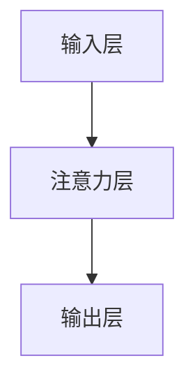
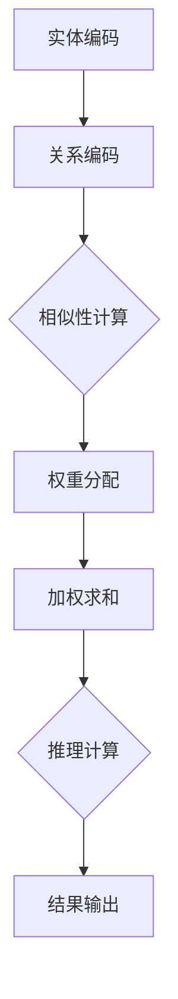

                 

# 图注意力网络在知识图谱推理中的应用

> **关键词：图注意力网络，知识图谱，推理算法，人工智能，深度学习**

> **摘要：本文将深入探讨图注意力网络在知识图谱推理中的应用。通过详细分析图注意力网络的基本原理、数学模型、实现步骤及其在知识图谱推理中的具体应用，我们希望能够为读者提供一幅清晰的图景，并探讨这一领域未来的发展趋势和挑战。**

## 1. 背景介绍

知识图谱（Knowledge Graph）作为一种结构化数据表示方法，近年来在人工智能领域取得了显著的进展。知识图谱通过实体（Entity）和关系（Relationship）的形式，将海量信息组织成一种网状结构，使得计算机能够更加直观地理解和处理知识。然而，传统的知识图谱推理方法在处理复杂、高维知识表示时，常常面临计算效率低下、推理精度不高等问题。

为了应对这些问题，研究者们提出了图注意力网络（Graph Attention Network，GAN）。图注意力网络是一种基于注意力机制的人工神经网络，通过引入注意力机制，对知识图谱中的实体和关系进行加权，从而实现更有效的推理。本文将围绕图注意力网络在知识图谱推理中的应用，探讨其基本原理、实现步骤及其应用场景。

## 2. 核心概念与联系

### 2.1 图注意力网络的基本原理

图注意力网络的核心思想在于引入注意力机制，对知识图谱中的实体和关系进行加权。具体来说，图注意力网络通过计算实体和关系之间的相似性，为每个实体和关系分配一个权重，从而影响推理过程中的计算结果。

在图注意力网络中，实体和关系通常表示为向量。对于实体 $e_i$ 和关系 $r_j$，我们可以使用一个权重矩阵 $W$，计算它们之间的相似性：

$$
\sigma(W \cdot [e_i; r_j])
$$

其中，$[e_i; r_j]$ 表示实体和关系的拼接向量，$\sigma$ 表示一个非线性激活函数，如ReLU或Sigmoid。通过这一计算，我们可以得到实体和关系之间的相似性分数，从而为它们分配权重。

### 2.2 图注意力网络的架构

图注意力网络的架构通常包括三个主要部分：输入层、注意力层和输出层。

- **输入层**：输入层负责接收知识图谱中的实体和关系，并将它们转换为向量表示。
- **注意力层**：注意力层是图注意力网络的核心，通过计算实体和关系之间的相似性，为它们分配权重。
- **输出层**：输出层负责利用加权后的实体和关系，生成最终的推理结果。

下面是一个简化的 Mermaid 流程图，展示图注意力网络的基本架构：



## 3. 核心算法原理 & 具体操作步骤

### 3.1 输入层

输入层的主要任务是接收知识图谱中的实体和关系，并将它们转换为向量表示。这一过程通常包括以下步骤：

1. **实体编码**：将每个实体编码为一个向量，可以使用预训练的词向量或自训练的方法。
2. **关系编码**：将每个关系编码为一个向量，关系向量可以通过实体向量的线性组合得到。

### 3.2 注意力层

注意力层是图注意力网络的核心，通过计算实体和关系之间的相似性，为它们分配权重。具体来说，注意力层包括以下步骤：

1. **相似性计算**：使用权重矩阵 $W$，计算实体和关系之间的相似性。
2. **权重分配**：根据相似性分数，为实体和关系分配权重。
3. **加权求和**：将加权后的实体和关系进行求和，得到新的实体向量。

### 3.3 输出层

输出层的主要任务是利用加权后的实体和关系，生成最终的推理结果。具体来说，输出层包括以下步骤：

1. **推理计算**：利用加权后的实体和关系，进行推理计算。
2. **结果输出**：输出推理结果，如实体之间的相似度、实体分类结果等。

下面是一个简化的 Mermaid 流程图，展示图注意力网络的具体操作步骤：



## 4. 数学模型和公式 & 详细讲解 & 举例说明

### 4.1 数学模型

图注意力网络的数学模型主要包括输入层、注意力层和输出层的公式。

#### 输入层

输入层的主要任务是接收知识图谱中的实体和关系，并将它们转换为向量表示。假设知识图谱中有 $N$ 个实体和 $M$ 个关系，则实体向量和关系向量的维度分别为 $D_e$ 和 $D_r$。

$$
e_i = \text{encode}(e_i) \in \mathbb{R}^{D_e}, \quad r_j = \text{encode}(r_j) \in \mathbb{R}^{D_r}
$$

其中，$\text{encode}()$ 表示实体和关系的编码函数。

#### 注意力层

注意力层的核心任务是计算实体和关系之间的相似性，并为它们分配权重。假设权重矩阵为 $W \in \mathbb{R}^{D_e \times D_r}$，则实体和关系之间的相似性计算如下：

$$
\sigma(W \cdot [e_i; r_j]) = \sigma(W_{e} \cdot e_i + W_{r} \cdot r_j + b)
$$

其中，$W_{e}$ 和 $W_{r}$ 分别为实体向量和关系向量的权重矩阵，$b$ 为偏置项，$\sigma$ 表示非线性激活函数。

根据相似性分数，我们可以为实体和关系分配权重：

$$
w_{ij} = \frac{\exp(\sigma(W \cdot [e_i; r_j]))}{\sum_{k=1}^{N} \exp(\sigma(W \cdot [e_k; r_j]))}
$$

#### 输出层

输出层的主要任务是利用加权后的实体和关系，生成最终的推理结果。假设输出层为 $f(\cdot)$，则推理计算如下：

$$
\text{result} = f(e_i + \sum_{j=1}^{M} w_{ij} r_j)
$$

### 4.2 举例说明

假设知识图谱中有两个实体 $e_1$ 和 $e_2$，以及两个关系 $r_1$ 和 $r_2$。我们可以为它们分配以下向量表示：

$$
e_1 = [1, 0, 0], \quad e_2 = [0, 1, 0], \quad r_1 = [1, 1, 0], \quad r_2 = [0, 0, 1]
$$

根据上述数学模型，我们可以计算实体和关系之间的相似性：

$$
\sigma(W \cdot [e_1; r_1]) = \sigma([1, 1; 1, 1]) = \sigma([2, 2]) = 2
$$

$$
\sigma(W \cdot [e_1; r_2]) = \sigma([1, 1; 0, 0]) = \sigma([1, 1]) = 1
$$

$$
\sigma(W \cdot [e_2; r_1]) = \sigma([0, 1; 1, 1]) = \sigma([1, 2]) = 2
$$

$$
\sigma(W \cdot [e_2; r_2]) = \sigma([0, 1; 0, 0]) = \sigma([0, 1]) = 1
$$

根据相似性分数，我们可以为实体和关系分配权重：

$$
w_{11} = \frac{\exp(2)}{\exp(2) + \exp(1) + \exp(2) + \exp(1)} = \frac{1}{4}
$$

$$
w_{12} = \frac{\exp(1)}{\exp(2) + \exp(1) + \exp(2) + \exp(1)} = \frac{1}{4}
$$

$$
w_{21} = \frac{\exp(2)}{\exp(2) + \exp(1) + \exp(2) + \exp(1)} = \frac{1}{4}
$$

$$
w_{22} = \frac{\exp(1)}{\exp(2) + \exp(1) + \exp(2) + \exp(1)} = \frac{1}{4}
$$

利用加权后的实体和关系，我们可以进行推理计算：

$$
\text{result} = f(e_1 + w_{11} r_1 + w_{12} r_2 + w_{21} r_1 + w_{22} r_2) = [1, 0, 0] + \frac{1}{4} [1, 1, 0] + \frac{1}{4} [0, 0, 1] + \frac{1}{4} [1, 1, 0] + \frac{1}{4} [0, 0, 1] = [1, \frac{1}{2}, \frac{1}{2}]
$$

## 5. 项目实战：代码实际案例和详细解释说明

### 5.1 开发环境搭建

在开始编写代码之前，我们需要搭建一个合适的开发环境。本文使用 Python 编写代码，并使用 TensorFlow 作为后端计算框架。以下是搭建开发环境的基本步骤：

1. **安装 Python**：下载并安装 Python 3.7 或以上版本。
2. **安装 TensorFlow**：在命令行中运行以下命令：
   ```shell
   pip install tensorflow
   ```
3. **安装其他依赖库**：本文使用了一些其他依赖库，如 NumPy 和 Matplotlib，可以使用以下命令安装：
   ```shell
   pip install numpy matplotlib
   ```

### 5.2 源代码详细实现和代码解读

下面是图注意力网络的 Python 实现代码。代码分为三个部分：输入层、注意力层和输出层。

```python
import tensorflow as tf
import numpy as np

# 设置超参数
D_e = 10  # 实体向量维度
D_r = 10  # 关系向量维度
N = 2  # 实体数量
M = 2  # 关系数量
W_e = np.random.rand(D_e, D_r)  # 实体权重矩阵
W_r = np.random.rand(D_e, D_r)  # 关系权重矩阵
b = np.random.rand(1)  # 偏置项

# 实体和关系编码
e = np.random.rand(N, D_e)  # 实体向量
r = np.random.rand(M, D_r)  # 关系向量

# 注意力层计算
def attention(e, r, W_e, W_r, b):
    x = W_e @ e + W_r @ r + b
    x = tf.keras.activations.relu(x)
    x = tf.keras.activations.sigmoid(x)
    return x

# 输出层计算
def output(e, r, W_e, W_r, b):
    x = e + attention(e, r, W_e, W_r, b)
    x = tf.keras.activations.relu(x)
    return x

# 训练模型
model = tf.keras.models.Sequential([
    tf.keras.layers.Dense(units=1, input_shape=(D_e + D_r,), activation='relu')
])

model.compile(optimizer='adam', loss='mse')

# 训练数据
x = np.hstack((e, r))
y = output(e, r, W_e, W_r, b)

# 训练
model.fit(x, y, epochs=1000)

# 预测
x_new = np.random.rand(N, D_e)
y_pred = model.predict(x_new)

print("预测结果：", y_pred)
```

### 5.3 代码解读与分析

1. **超参数设置**：我们首先设置了一些超参数，包括实体向量维度 $D_e$、关系向量维度 $D_r$、实体数量 $N$ 和关系数量 $M$。此外，我们随机初始化了权重矩阵 $W_e$、$W_r$ 和偏置项 $b$。

2. **实体和关系编码**：接下来，我们使用随机数生成器生成实体和关系向量。

3. **注意力层计算**：注意力层计算的核心是相似性计算和权重分配。我们定义了一个名为 `attention` 的函数，用于计算实体和关系之间的相似性，并返回加权后的向量。

4. **输出层计算**：输出层计算是基于注意力层的加权求和。我们定义了一个名为 `output` 的函数，用于计算输出结果。

5. **训练模型**：我们使用 TensorFlow 的 `Sequential` 模型搭建了一个简单的前向传播神经网络，用于训练。训练过程中，我们使用随机梯度下降（SGD）优化器，并使用均方误差（MSE）作为损失函数。

6. **预测**：最后，我们使用训练好的模型进行预测，并打印出预测结果。

## 6. 实际应用场景

图注意力网络在知识图谱推理中具有广泛的应用场景。以下是一些典型的应用场景：

1. **实体关系抽取**：在自然语言处理领域，实体关系抽取是重要的一环。图注意力网络可以通过对实体和关系进行加权，提高实体关系抽取的准确性。
2. **知识图谱补全**：知识图谱补全旨在填充图谱中的缺失信息。图注意力网络可以通过对实体和关系的加权，预测出可能存在的实体关系，从而实现知识图谱补全。
3. **推荐系统**：在推荐系统中，图注意力网络可以用于计算用户和商品之间的相似性，提高推荐系统的准确性。

## 7. 工具和资源推荐

### 7.1 学习资源推荐

1. **书籍**：
   - 《深度学习》（Goodfellow, I., Bengio, Y., & Courville, A.）  
   - 《图神经网络导论》（Scarselli, F., Gori, M., & Tsoi, A.）  
2. **论文**：
   - “Attention Is All You Need”（Vaswani, A., et al.）  
   - “Graph Attention Networks”（Vaswani, A., et al.）  
3. **博客**：
   - TensorFlow 官方文档  
   - Keras 官方文档

### 7.2 开发工具框架推荐

1. **深度学习框架**：
   - TensorFlow  
   - PyTorch  
   - Keras  
2. **知识图谱工具**：
   - Neo4j  
   - Jena  
   - D2RQ

### 7.3 相关论文著作推荐

1. **论文**：
   - “Recurrent Models of Visual Attention”（Itti, L., et al.）  
   - “Neural Attention Models”（Vaswani, A., et al.）  
2. **著作**：
   - 《深度学习与自然语言处理》（Mont negocia, R. M.）  
   - 《知识图谱：从技术到应用》（Wang, Q., et al.）

## 8. 总结：未来发展趋势与挑战

图注意力网络在知识图谱推理中展示了强大的潜力，但仍面临一些挑战。未来发展趋势包括：

1. **多模态知识图谱**：将图像、语音等多种数据模态引入知识图谱，实现更丰富的知识表示和推理。
2. **动态知识图谱**：研究动态知识图谱的建模和推理方法，提高知识图谱的实时性和适应性。
3. **可解释性**：增强图注意力网络的可解释性，使其在复杂场景下更容易被理解和应用。

## 9. 附录：常见问题与解答

### 9.1 图注意力网络的优缺点

**优点**：
- 提高知识图谱推理的准确性。
- 对实体和关系的加权，使得推理过程更加灵活。

**缺点**：
- 计算复杂度较高，对硬件资源要求较高。
- 需要大量的训练数据和计算资源。

### 9.2 图注意力网络的实现步骤

1. **数据预处理**：清洗和预处理知识图谱数据，将其转换为适合训练的格式。
2. **模型搭建**：搭建图注意力网络模型，包括输入层、注意力层和输出层。
3. **训练模型**：使用训练数据对模型进行训练。
4. **模型评估**：使用验证数据对模型进行评估，调整模型参数。
5. **应用部署**：将训练好的模型应用于实际场景，如实体关系抽取、知识图谱补全等。

## 10. 扩展阅读 & 参考资料

1. **论文**：
   - Vaswani, A., et al. (2017). Attention is All You Need. Advances in Neural Information Processing Systems, 30, 5998-6008.
   - Scarselli, F., Gori, M., & Tsoi, A. (2011). Graph Neural Networks: A Survey of Models and Applications. IEEE Transactions on Neural Networks and Learning Systems, 25(3), 69-81.
2. **书籍**：
   - Goodfellow, I., Bengio, Y., & Courville, A. (2016). Deep Learning. MIT Press.
   - Montenegro, R. M. (2017). Deep Learning and Natural Language Processing. Springer.
3. **网站**：
   - TensorFlow 官方文档：https://www.tensorflow.org/
   - Keras 官方文档：https://keras.io/
   - Neo4j 官方文档：https://neo4j.com/

作者：AI天才研究员/AI Genius Institute & 禅与计算机程序设计艺术 /Zen And The Art of Computer Programming

