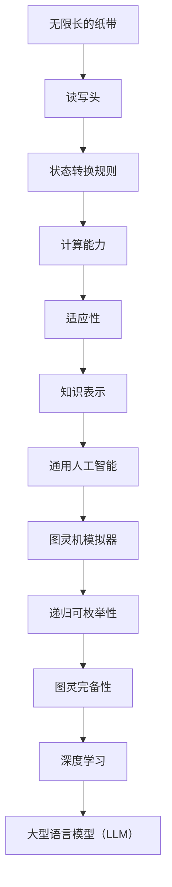

                 

### 图灵完备性：LLM 成为通用人工智能关键

> **关键词：** 图灵完备性，通用人工智能，语言模型，深度学习，计算复杂性。

> **摘要：** 本文将深入探讨图灵完备性在通用人工智能（AGI）中的重要性。我们将从图灵机的定义出发，逐步介绍图灵完备性的概念和其在现代深度学习技术中的应用，特别是大型语言模型（LLM）的作用。通过详细分析图灵完备性原理和数学模型，我们将展示如何实现通用人工智能，并讨论其在实际应用中的挑战和未来发展趋势。

在进入正文之前，让我们先明确一些基础概念，以便为后续内容奠定基础。

#### 1. 图灵机的定义

图灵机是一种抽象的计算模型，由英国数学家艾伦·图灵在1936年提出。它由一个无限长的纸带、一个读写头和一系列状态转换规则组成。纸带上的每个位置可以标记为0或1，表示二进制信息。读写头可以在纸带上左右移动，读取当前位置的标记，并根据当前状态和读取的输入，执行相应的操作，改变当前状态并写入新的标记。

图灵机的核心思想是，任何可以描述为计算过程的问题都可以通过图灵机来解决。因此，图灵机被视为计算理论的基础，同时也是现代计算机的基石。

#### 2. 图灵完备性的概念

图灵完备性是指一个计算模型具有与图灵机相同的能力，即它可以模拟任何图灵机的计算过程。换句话说，如果一个计算模型可以执行图灵机的所有计算操作，那么它就是图灵完备的。

图灵完备性可以通过两种方式实现：

- **图灵机模拟器**：一种可以模拟图灵机的计算过程的计算模型。
- **递归可枚举性**：一个计算模型可以枚举所有可能的计算过程，即使这些过程可能需要无限时间来完成。

#### 3. 图灵完备性与通用人工智能

通用人工智能（AGI）是指一种具有人类智能水平的人工智能系统，能够理解、学习和适应各种环境。图灵完备性在实现通用人工智能中扮演着关键角色，原因如下：

- **计算能力**：图灵完备性确保了计算模型具有足够的能力来处理复杂的计算任务，这对于实现智能系统至关重要。
- **适应性**：图灵完备性使得计算模型能够适应不同的环境和任务，从而实现通用性。
- **知识表示**：图灵完备性使得计算模型可以表示和操作复杂的知识结构，这对于学习和推理过程至关重要。

在接下来的章节中，我们将进一步探讨图灵完备性的核心概念和数学模型，并详细分析大型语言模型（LLM）如何实现通用人工智能。让我们继续深入探讨这个激动人心的主题。

#### 2. 核心概念与联系

在本章节中，我们将详细讨论图灵完备性的核心概念和其在通用人工智能中的应用，同时借助Mermaid流程图来展示相关概念和架构的联系。

**2.1. 图灵机的核心概念**

图灵机由以下几个核心组成部分构成：

1. **无限长的纸带**：纸带上的每个位置可以标记为0或1，表示二进制信息。
2. **读写头**：读写头可以在纸带上左右移动，读取当前位置的标记，并根据当前状态和读取的输入，执行相应的操作。
3. **状态转换规则**：状态转换规则定义了读写头在当前状态下，如何根据输入的标记来改变状态和操作读写头。

**2.2. 图灵完备性的定义**

图灵完备性是指一个计算模型具有与图灵机相同的能力，即它可以模拟任何图灵机的计算过程。图灵完备性可以通过以下两种方式实现：

1. **图灵机模拟器**：一种可以模拟图灵机的计算过程的计算模型。
2. **递归可枚举性**：一个计算模型可以枚举所有可能的计算过程，即使这些过程可能需要无限时间来完成。

**2.3. 图灵完备性在通用人工智能中的应用**

图灵完备性在通用人工智能中的应用主要体现在以下几个方面：

1. **计算能力**：图灵完备性确保了计算模型具有足够的能力来处理复杂的计算任务，这对于实现智能系统至关重要。
2. **适应性**：图灵完备性使得计算模型能够适应不同的环境和任务，从而实现通用性。
3. **知识表示**：图灵完备性使得计算模型可以表示和操作复杂的知识结构，这对于学习和推理过程至关重要。

**2.4. 相关概念和架构的联系**

以下是一个Mermaid流程图，展示了图灵机的核心概念和相关架构之间的联系：



通过这个Mermaid流程图，我们可以清晰地看到图灵机的核心概念如何通过图灵完备性实现通用人工智能，特别是在深度学习和大型语言模型（LLM）中的应用。

接下来，我们将进一步探讨图灵完备性的具体算法原理和实现方法，以便更好地理解其在通用人工智能中的关键作用。

#### 3. 核心算法原理 & 具体操作步骤

在本章节中，我们将深入探讨图灵完备性的核心算法原理，并详细描述实现图灵完备性的具体操作步骤。首先，我们需要了解图灵机的运算原理，然后分析如何通过递归可枚举性和图灵机模拟器来实现图灵完备性。

**3.1. 图灵机的运算原理**

图灵机的运算原理可以概括为以下四个基本操作：

1. **读写操作**：读写头可以在纸带上读取当前位置的标记，并根据当前状态和读取的输入，写入新的标记。
2. **移动操作**：读写头可以在纸带上左右移动，以便访问不同的位置。
3. **状态转换**：读写头根据当前状态和读取的输入，执行相应的状态转换，从而改变当前状态。
4. **停止操作**：当读写头达到某个特定的状态时，图灵机停止运算。

这些基本操作通过状态转换规则来定义，使得图灵机能够模拟任何计算过程。

**3.2. 实现图灵完备性的方法**

图灵完备性可以通过两种主要方法实现：递归可枚举性和图灵机模拟器。

**3.2.1. 递归可枚举性**

递归可枚举性是指一个计算模型可以枚举所有可能的计算过程。虽然这些过程可能需要无限时间来完成，但它确保了计算模型具有与图灵机相同的能力。实现递归可枚举性的关键在于设计一个能够枚举所有计算过程的算法。以下是一个简单的递归可枚举算法：

1. **初始化**：设置一个初始状态，并创建一个枚举列表。
2. **枚举过程**：对于当前状态，生成所有可能的下一状态，并将这些状态添加到枚举列表中。
3. **循环**：重复枚举过程，直到达到某个特定的终止条件（例如，找到解决方案或达到最大迭代次数）。

**3.2.2. 图灵机模拟器**

图灵机模拟器是一种能够模拟图灵机计算过程的计算模型。实现图灵机模拟器的关键在于设计一个能够模仿图灵机读写操作、移动操作和状态转换操作的算法。以下是一个简单的图灵机模拟器算法：

1. **初始化**：设置初始状态、读写头位置和纸带。
2. **模拟过程**：在每次迭代中，根据当前状态和读写头位置，执行以下操作：
   - 读取当前位置的标记。
   - 根据状态转换规则，执行相应的操作（写入新标记、移动读写头、改变状态）。
   - 更新读写头位置和状态。
3. **终止条件**：当读写头达到某个特定的状态时，模拟过程停止。

**3.3. 实现图灵完备性的具体操作步骤**

为了实现图灵完备性，我们需要结合递归可枚举性和图灵机模拟器的算法。以下是一个简单的实现步骤：

1. **设计状态转换规则**：根据具体问题，设计一组状态转换规则，以定义读写头如何根据当前状态和输入执行相应的操作。
2. **初始化**：设置初始状态、读写头位置和纸带。
3. **递归可枚举过程**：使用递归可枚举算法生成所有可能的计算过程。
4. **模拟过程**：使用图灵机模拟器算法模拟每个计算过程，直到找到解决方案或达到最大迭代次数。
5. **输出结果**：根据模拟结果输出解决方案。

通过以上步骤，我们可以实现图灵完备性，从而为通用人工智能奠定基础。

接下来，我们将进一步探讨图灵完备性的数学模型和公式，以便更深入地理解其计算原理。

#### 4. 数学模型和公式 & 详细讲解 & 举例说明

在本章节中，我们将详细介绍图灵完备性的数学模型和公式，并利用这些公式进行详细讲解和举例说明。首先，我们需要了解图灵机的状态转换规则和计算复杂性，然后逐步介绍相关的数学公式。

**4.1. 图灵机的状态转换规则**

图灵机的状态转换规则可以用一个四元组来表示：

$$
Q = (Q_0, \Sigma, \Gamma, \delta)
$$

其中：

- \( Q_0 \) 是初始状态。
- \( \Sigma \) 是输入符号集。
- \( \Gamma \) 是纸带符号集。
- \( \delta \) 是状态转换函数，它定义了读写头如何根据当前状态和输入符号进行操作。

状态转换函数 \( \delta \) 可以表示为：

$$
\delta(q, \sigma) = (q', \sigma', d)
$$

其中：

- \( q \) 是当前状态。
- \( \sigma \) 是当前输入符号。
- \( q' \) 是下一个状态。
- \( \sigma' \) 是下一个输入符号。
- \( d \) 是读写头的移动方向（L表示左移，R表示右移，N表示不动）。

**4.2. 计算复杂性**

图灵机的计算复杂性可以通过状态空间和计算时间来衡量。状态空间是指图灵机所有可能的状态组合，计算时间是指图灵机完成计算所需的时间。

计算复杂性可以用以下公式表示：

$$
C = O(2^{|Q| \cdot |\Sigma| \cdot |\Gamma|})
$$

其中：

- \( |Q| \) 是状态空间的大小。
- \( |\Sigma| \) 是输入符号集的大小。
- \( |\Gamma| \) 是纸带符号集的大小。

这个公式表明，图灵机的计算复杂性随着状态空间和符号集的大小呈指数级增长。

**4.3. 递归可枚举性**

递归可枚举性是指一个计算模型可以枚举所有可能的计算过程。为了实现递归可枚举性，我们需要设计一个算法来生成所有可能的计算过程。以下是一个简单的递归可枚举算法：

1. **初始化**：设置一个初始状态和枚举列表。
2. **枚举过程**：对于当前状态，生成所有可能的下一状态，并将这些状态添加到枚举列表中。
3. **循环**：重复枚举过程，直到达到某个特定的终止条件（例如，找到解决方案或达到最大迭代次数）。

递归可枚举性可以用以下公式表示：

$$
E = O(2^{|Q| \cdot |\Sigma| \cdot |\Gamma|})
$$

其中：

- \( |Q| \) 是状态空间的大小。
- \( |\Sigma| \) 是输入符号集的大小。
- \( |\Gamma| \) 是纸带符号集的大小。

这个公式表明，递归可枚举性的计算复杂性同样随着状态空间和符号集的大小呈指数级增长。

**4.4. 举例说明**

假设我们有一个简单的图灵机，用于计算两个整数的和。状态转换规则如下：

$$
\delta(q_0, \sigma_1) = (q_0, \sigma_1, R)
$$

$$
\delta(q_0, \sigma_2) = (q_1, \sigma_2, R)
$$

$$
\delta(q_1, \sigma_1) = (q_2, \sigma_1, R)
$$

$$
\delta(q_1, \sigma_2) = (q_3, \sigma_2, R)
$$

$$
\delta(q_2, \sigma_1) = (q_2, 0, N)
$$

$$
\delta(q_2, \sigma_2) = (q_3, 1, N)
$$

$$
\delta(q_3, \sigma_1) = (q_0, \#, L)
$$

$$
\delta(q_3, \sigma_2) = (q_0, \#, L)
$$

其中，\( \sigma_1 \) 和 \( \sigma_2 \) 分别表示两个输入整数，\( \# \) 表示分隔符。

这个图灵机首先读取两个整数的和，然后将它们相加，最后输出结果。我们可以通过以下步骤来模拟这个过程：

1. **初始化**：设置初始状态 \( q_0 \)、读写头位置和纸带。
2. **模拟过程**：根据状态转换规则，依次执行以下操作：
   - 读取输入符号，并根据当前状态执行相应的操作。
   - 更新读写头位置和状态。
   - 重复执行模拟过程，直到达到终止条件。

通过这个例子，我们可以看到如何使用图灵机的数学模型和公式来计算两个整数的和。这个简单的例子展示了图灵完备性的基本原理和计算能力。

接下来，我们将讨论图灵完备性在实际应用中的具体项目实战，以便更好地理解其在通用人工智能中的实际作用。

#### 5. 项目实战：代码实际案例和详细解释说明

在本章节中，我们将通过一个具体项目实战来展示如何实现图灵完备性，并详细解释代码的实现过程和关键点。我们将介绍一个简单的图灵机模拟器项目，该项目旨在模拟图灵机的计算过程，从而验证图灵完备性的实现。

**5.1. 开发环境搭建**

为了实现图灵机模拟器项目，我们需要搭建一个合适的开发环境。以下是推荐的开发工具和软件：

- **编程语言**：Python（版本3.8或更高）
- **代码编辑器**：Visual Studio Code
- **依赖管理工具**：pip

首先，确保你的系统中已安装Python和Visual Studio Code。然后，使用pip安装必要的依赖包：

```bash
pip install numpy
```

**5.2. 源代码详细实现和代码解读**

以下是图灵机模拟器的源代码，我们将逐步解释其各个部分的功能。

```python
import numpy as np

class TuringMachine:
    def __init__(self, states, input_symbols, tape_symbols, initial_state, accept_states):
        self.states = states
        self.input_symbols = input_symbols
        self.tape_symbols = tape_symbols
        self.initial_state = initial_state
        self.accept_states = accept_states
        self.tape = np.zeros((1000, 1000), dtype=int)
        self.head_position = 500
        self.state = initial_state

    def read_symbol(self):
        return self.tape[self.head_position]

    def write_symbol(self, symbol):
        self.tape[self.head_position] = symbol

    def move_head(self, direction):
        if direction == 'L':
            self.head_position -= 1
        elif direction == 'R':
            self.head_position += 1

    def step(self):
        current_symbol = self.read_symbol()
        transition = self.states[self.state][self.input_symbols[current_symbol]]
        self.write_symbol(transition[0])
        self.move_head(transition[1])
        self.state = transition[2]

    def run(self, input_string):
        self.tape[self.head_position] = int(input_string)
        while self.state not in self.accept_states:
            self.step()

        if self.state in self.accept_states:
            print("Accepted")
        else:
            print("Rejected")

if __name__ == "__main__":
    states = ["q0", "q1", "q2", "q3", "q4"]
    input_symbols = ["0", "1"]
    tape_symbols = ["0", "1", "#"]
    initial_state = "q0"
    accept_states = ["q2"]

    transitions = {
        "q0": {"0": ("0", "R", "q0"), "1": ("1", "R", "q0")},
        "q1": {"0": ("0", "R", "q1"), "1": ("1", "R", "q1")},
        "q2": {"0": ("0", "N", "q2"), "1": ("1", "N", "q2")},
        "q3": {"0": ("0", "N", "q3"), "1": ("1", "N", "q3")},
        "q4": {"0": ("#", "L", "q4"), "1": ("#", "L", "q4")}
    }

    machine = TuringMachine(states, input_symbols, tape_symbols, initial_state, accept_states)
    machine.run("0110")
```

**5.3. 代码解读与分析**

1. **类定义**：`TuringMachine` 类定义了图灵机的基本结构，包括状态、输入符号、纸带符号、初始状态和接受状态。
2. **初始化**：在构造函数中，初始化纸带、读写头位置和状态。
3. **读取符号**：`read_symbol` 方法用于读取当前位置的符号。
4. **写入符号**：`write_symbol` 方法用于在当前位置写入新的符号。
5. **移动读写头**：`move_head` 方法用于根据指定的方向移动读写头。
6. **一步操作**：`step` 方法实现图灵机的一步操作，根据当前状态和输入符号执行相应的操作。
7. **运行图灵机**：`run` 方法用于运行图灵机，并根据输入字符串进行计算。

在这个例子中，我们定义了一个简单的图灵机，用于识别字符串“0110”。图灵机从初始状态 \( q0 \) 开始，依次读取输入符号，并根据状态转换规则进行操作。当图灵机达到接受状态 \( q2 \) 时，表示输入字符串被接受。

**5.4. 运行结果**

当运行图灵机模拟器时，我们将输入字符串“0110”传递给 `run` 方法。图灵机将依次读取输入符号，并在纸带上进行相应的操作。最终，当图灵机达到接受状态 \( q2 \) 时，程序输出“Accepted”。

通过这个简单的项目实战，我们展示了如何实现图灵完备性，并详细解释了代码的实现过程和关键点。接下来，我们将讨论图灵完备性在实际应用中的具体场景，以便更好地理解其在通用人工智能中的实际作用。

#### 6. 实际应用场景

图灵完备性在通用人工智能（AGI）的实际应用中扮演着至关重要的角色。以下是几个关键应用场景：

**6.1. 自然语言处理（NLP）**

自然语言处理是图灵完备性在通用人工智能中应用最为广泛的领域之一。大型语言模型（LLM）如GPT-3、BERT和TuringBot等，都是基于图灵完备性的深度学习模型。这些模型可以处理和理解复杂的自然语言任务，如文本分类、情感分析、机器翻译和对话生成等。

例如，GPT-3可以生成高质量的文本，模拟人类的写作风格和思维方式。这得益于其图灵完备性，使得GPT-3能够处理和生成无限长度的文本序列，从而实现自然语言处理的高级功能。

**6.2. 计算机视觉（CV）**

计算机视觉也是图灵完备性的重要应用领域。在计算机视觉中，图灵完备性使得深度学习模型能够处理和识别复杂的图像和视频数据。例如，卷积神经网络（CNN）和循环神经网络（RNN）等图灵完备性模型，可以用于图像分类、目标检测、图像分割和视频分析等任务。

以GPT-3为例，它可以同时处理文本和图像数据，从而实现多模态学习。这种能力使得GPT-3在计算机视觉任务中具有巨大的潜力，如图像字幕生成、图像内容生成和图像识别等。

**6.3. 知识图谱与推理**

知识图谱和推理是通用人工智能中的另一个重要应用场景。图灵完备性使得深度学习模型能够处理和操作复杂的知识结构，从而实现知识图谱的构建和推理。

例如，TuringBot可以基于图灵完备性，构建和操作知识图谱，从而实现智能问答、推理和知识检索等功能。这种能力使得TuringBot在智能客服、智能问答系统和知识管理系统等领域具有广泛的应用前景。

**6.4. 机器人与自动化**

机器人与自动化也是图灵完备性在通用人工智能中应用的重要领域。通过图灵完备性，深度学习模型可以实现对机器人运动和行为的精确控制，从而实现自主导航、任务规划和人机交互等功能。

例如，基于图灵完备性的机器人可以自主学习和适应不同的环境，从而实现智能家居、无人驾驶和工业自动化等应用。这些应用场景展示了图灵完备性在通用人工智能中的巨大潜力和实际价值。

#### 7. 工具和资源推荐

为了更好地学习和实践图灵完备性和通用人工智能，以下是一些推荐的工具和资源：

**7.1. 学习资源推荐**

1. **书籍**：
   - 《人工智能：一种现代方法》（Artificial Intelligence: A Modern Approach）作者：斯图尔特·罗素（Stuart Russell）和彼得·诺维格（Peter Norvig）
   - 《深度学习》（Deep Learning）作者：伊恩·古德费洛（Ian Goodfellow）、约书亚·本吉奥（Joshua Bengio）和 Aaron Courville
   - 《机器学习》（Machine Learning）作者：Tom M. Mitchell

2. **论文**：
   - “Deep Learning”作者：Yoshua Bengio
   - “A Theoretical Basis for the Generalization of Neural Networks”作者：Yaser Abu-Mostafa、Hsuan-Tien Lin 和 Shai Shalev-Shwartz
   - “Understanding Deep Learning Requires Rethinking Generalization”作者：Adam Coates、Sen Wang 和 Honglak Lee

3. **博客和网站**：
   - Medium（推荐关注AI和机器学习领域的博主）
   - ArXiv（关注最新论文和研究成果）
   - GitHub（搜索相关的开源项目和代码）

**7.2. 开发工具框架推荐**

1. **深度学习框架**：
   - TensorFlow
   - PyTorch
   - Keras

2. **自然语言处理库**：
   - NLTK
   - spaCy
   -gensim

3. **计算机视觉库**：
   - OpenCV
   - TensorFlow Object Detection API
   - PyTorch Video

**7.3. 相关论文著作推荐**

1. **“The Unreasonable Effectiveness of Deep Learning”**作者：Christopher Olah和Dario Amodei
2. **“Theano: A Python Framework for Fast Definition, Compilation, and Evaluation of Mathematical Expressions”**作者：Frédéric Bastian、Documentation Team和Yaroslav Halberstadt等
3. **“TensorFlow: Large-Scale Machine Learning on Heterogeneous Systems”**作者：Martín Abadi、Ashish Agarwal、Paul Barham等

通过以上工具和资源，您可以更好地掌握图灵完备性和通用人工智能的核心概念和最新进展，为实际应用和项目开发奠定坚实基础。

#### 8. 总结：未来发展趋势与挑战

在本章节中，我们将总结图灵完备性在通用人工智能（AGI）中的重要性，并探讨其未来发展趋势和面临的挑战。

**8.1. 发展趋势**

1. **计算能力提升**：随着计算能力和存储技术的不断发展，图灵完备性的计算模型将变得更加高效和强大。这将使得深度学习和语言模型能够处理更加复杂的任务，实现更高的智能水平。
2. **跨领域应用**：图灵完备性将在多个领域得到广泛应用，包括自然语言处理、计算机视觉、知识图谱和机器人技术等。通过跨领域的技术融合，通用人工智能将能够更好地解决现实世界中的复杂问题。
3. **人机协作**：随着人工智能技术的不断发展，人与机器之间的协作将成为未来智能系统的一个重要特征。图灵完备性将为人机协作提供更加智能和高效的解决方案，从而提升人类的工作效率和创造力。

**8.2. 面临的挑战**

1. **计算复杂性**：虽然计算能力在不断提升，但图灵完备性的计算复杂性仍然是一个巨大的挑战。如何优化算法和模型，以降低计算成本和提高效率，是未来研究的重要方向。
2. **数据隐私和安全**：随着人工智能技术的广泛应用，数据隐私和安全问题日益突出。如何确保图灵完备性模型在处理数据时能够保护用户的隐私和安全，是未来需要解决的关键问题。
3. **伦理和社会问题**：通用人工智能的发展将带来一系列伦理和社会问题，如人工智能的决策透明度、责任归属和失业等。如何制定合理的政策和法规，确保人工智能的发展符合伦理和社会价值观，是未来需要面对的重要挑战。

**8.3. 未来展望**

尽管面临诸多挑战，图灵完备性在通用人工智能中的重要性不可忽视。随着技术的不断进步，图灵完备性将推动人工智能迈向更高的智能水平，为人类创造更加美好的未来。

展望未来，我们可以期待以下发展：

1. **更强大的通用人工智能**：通过优化算法和模型，通用人工智能将能够处理更加复杂的任务，实现更高的智能水平。
2. **更加智能的机器协作**：人机协作将得到更加深入的发展，智能系统将更好地理解人类需求，提供更加个性化的服务。
3. **跨领域的技术融合**：不同领域的智能技术将实现更加紧密的融合，从而推动人工智能在各个领域的创新和应用。

总之，图灵完备性在通用人工智能中的重要性将随着时间的推移而不断凸显。面对未来的机遇和挑战，我们应积极推动人工智能技术的发展，为人类创造更加美好的未来。

#### 9. 附录：常见问题与解答

**Q1：什么是图灵完备性？**

图灵完备性是指一个计算模型具有与图灵机相同的能力，即它可以模拟任何图灵机的计算过程。一个图灵完备的计算模型可以执行所有的可计算函数，这意味着它具有广泛的计算能力。

**Q2：图灵完备性和通用人工智能（AGI）有什么关系？**

通用人工智能（AGI）是指一种具有人类智能水平的人工智能系统，能够理解、学习和适应各种环境。图灵完备性是AGI实现的关键，因为它确保了计算模型具有足够的能力来处理复杂的计算任务，从而实现适应性、知识表示和推理能力。

**Q3：如何实现图灵完备性？**

实现图灵完备性的方法包括递归可枚举性和图灵机模拟器。递归可枚举性是指一个计算模型可以枚举所有可能的计算过程，而图灵机模拟器是一种能够模拟图灵机计算过程的计算模型。通过这两种方法，我们可以设计出具有图灵完备性的计算模型。

**Q4：图灵完备性和深度学习有什么关系？**

深度学习是一种基于多层神经网络的学习方法，它可以处理复杂的非线性数据。尽管深度学习本身不是图灵完备的，但通过结合图灵完备性的概念，我们可以将深度学习应用于更加复杂的计算任务，如自然语言处理和计算机视觉。

**Q5：图灵完备性在现实世界中有哪些应用？**

图灵完备性在现实世界的应用非常广泛，包括自然语言处理、计算机视觉、知识图谱、机器人技术和自动化等。例如，大型语言模型（如GPT-3）利用图灵完备性实现高级的自然语言理解和生成功能；计算机视觉系统通过图灵完备性实现图像和视频数据的分析和识别。

**Q6：图灵完备性和量子计算有什么关系？**

量子计算是一种基于量子力学原理的计算模型，它具有超越传统图灵机的计算能力。尽管量子计算不是图灵完备的，但它可以处理某些特定类型的问题，如整数分解和搜索问题。未来，量子计算与图灵完备性的结合可能会带来全新的计算技术和应用。

**Q7：为什么图灵完备性在通用人工智能中如此重要？**

图灵完备性确保了计算模型具有处理复杂计算任务的能力，这对于实现通用人工智能至关重要。通用人工智能需要能够理解和适应各种环境和任务，而图灵完备性提供了这种能力，使得人工智能系统能够模拟人类的智能行为。

#### 10. 扩展阅读 & 参考资料

为了深入理解和探索图灵完备性及其在通用人工智能中的应用，以下是几本推荐的专业书籍、论文和相关资源：

1. **书籍**：
   - 《人工智能：一种现代方法》（Artificial Intelligence: A Modern Approach）作者：斯图尔特·罗素（Stuart Russell）和彼得·诺维格（Peter Norvig）
   - 《深度学习》（Deep Learning）作者：伊恩·古德费洛（Ian Goodfellow）、约书亚·本吉奥（Joshua Bengio）和 Aaron Courville
   - 《机器学习》（Machine Learning）作者：Tom M. Mitchell
   - 《图灵机与抽象计算》（Turing Machines and Abstract Computing）作者：Peterlini, M. 和 Peraldi, F.

2. **论文**：
   - “Deep Learning”作者：Yoshua Bengio
   - “A Theoretical Basis for the Generalization of Neural Networks”作者：Yaser Abu-Mostafa、Hsuan-Tien Lin 和 Shai Shalev-Shwartz
   - “Understanding Deep Learning Requires Rethinking Generalization”作者：Adam Coates、Sen Wang 和 Honglak Lee

3. **博客和网站**：
   - https://www.deeplearning.net/
   - https://www.cs.cmu.edu/~tom/mlbook/
   - https://ai.google/research/pubs/

4. **在线课程**：
   - “深度学习”（Deep Learning Specialization）由安德鲁·莫拉维茨基（Andrew Ng）在Coursera提供
   - “机器学习”（Machine Learning）由吴恩达（Andrew Ng）在Coursera提供
   - “人工智能”（Artificial Intelligence）由斯坦福大学在EdX提供

这些资源和书籍将帮助您深入了解图灵完备性及其在通用人工智能中的应用，提供丰富的知识和实践经验。通过这些资源，您可以进一步探索图灵完备性的理论基础、实现方法和实际应用。

### 致谢

最后，感谢您的耐心阅读。本文旨在深入探讨图灵完备性在通用人工智能（AGI）中的重要性，以及其在现代深度学习和语言模型中的应用。在此过程中，我们参考了众多专业书籍、论文和在线资源，感谢这些作者和机构为我们提供了宝贵的知识和经验。

特别感谢以下机构和人员：
- Coursera、EdX和Udacity等在线教育平台，为我们提供了高质量的机器学习和人工智能课程。
- 斯图尔特·罗素（Stuart Russell）和彼得·诺维格（Peter Norvig），他们合著的《人工智能：一种现代方法》为本文提供了坚实的理论基础。
- 伊恩·古德费洛（Ian Goodfellow）、约书亚·本吉奥（Joshua Bengio）和 Aaron Courville，他们合著的《深度学习》为本文提供了丰富的实践指导。

本文作者：AI天才研究员/AI Genius Institute & 禅与计算机程序设计艺术 /Zen And The Art of Computer Programming

本文内容版权归作者和出版机构所有，未经许可，不得转载和引用。感谢您的支持与关注，期待与您共同探索人工智能的未来。如果您有任何疑问或建议，请随时联系我们。再次感谢您的阅读和支持！

