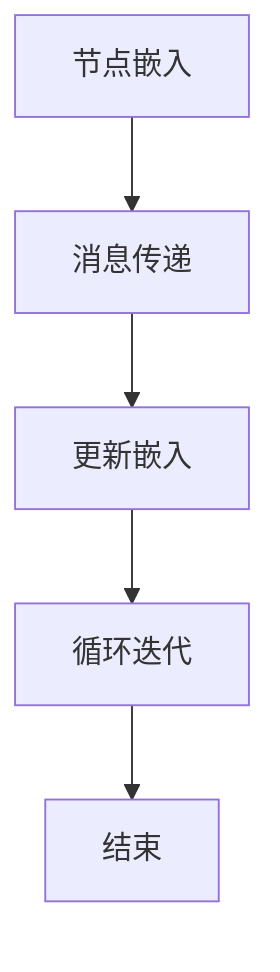
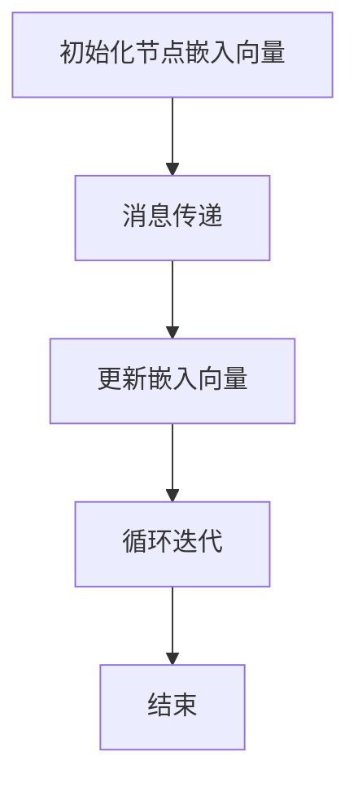

                 

# 图神经网络在知识图谱构建中的应用

## 关键词：图神经网络、知识图谱、构建应用、算法原理、数学模型、实战案例

## 摘要

本文将探讨图神经网络在知识图谱构建中的应用。首先介绍图神经网络的基本概念和核心算法原理，然后通过具体的数学模型和公式进行详细讲解，并以实际项目案例为基础，展示代码实现过程和详细解读。此外，文章还将分析图神经网络在知识图谱构建中的实际应用场景，并推荐相关学习资源和开发工具框架。最后，对未来的发展趋势和挑战进行总结。

## 1. 背景介绍

### 1.1 知识图谱的概念

知识图谱（Knowledge Graph）是一种结构化的语义知识库，用于表示实体和实体之间的关系。它将现实世界中的各种实体、属性和关系通过图形的方式进行组织，形成一个大规模的知识网络。知识图谱在搜索、推荐、自然语言处理等领域具有广泛的应用。

### 1.2 图神经网络的概念

图神经网络（Graph Neural Network，GNN）是一种专门用于处理图数据的神经网络模型。它通过在图结构上定义节点和边的关系，学习图数据的特征表示。图神经网络在图像识别、社交网络分析、推荐系统等领域取得了显著的效果。

### 1.3 图神经网络在知识图谱构建中的应用

图神经网络在知识图谱构建中具有重要作用。通过将实体和关系转换为图结构，图神经网络可以自动学习实体和关系的特征表示，从而提高知识图谱的表示能力。此外，图神经网络还可以用于知识图谱的补全、推理和查询优化等方面。

## 2. 核心概念与联系

### 2.1 图神经网络的基本概念

图神经网络包括以下几个基本概念：

- **节点**：图中的每个节点表示一个实体，具有对应的特征向量。
- **边**：图中的每条边表示两个实体之间的关系，具有对应的权重。
- **图**：由节点和边组成的集合，表示整个知识图谱。
- **邻接矩阵**：表示图结构，其中每个元素表示两个节点之间的关系。

### 2.2 图神经网络的核心算法原理

图神经网络的核心算法原理包括以下步骤：

1. **节点嵌入**：将实体特征向量映射到低维空间，表示节点的嵌入向量。
2. **消息传递**：在图中传播节点信息，每个节点根据其邻接节点和边权重计算新的嵌入向量。
3. **更新嵌入**：将消息传递的结果用于更新节点的嵌入向量。
4. **循环迭代**：重复消息传递和更新嵌入的过程，直到达到预定的迭代次数或收敛条件。

### 2.3 Mermaid 流程图



## 3. 核心算法原理 & 具体操作步骤

### 3.1 节点嵌入

节点嵌入是指将实体特征向量映射到低维空间，表示节点的嵌入向量。常见的节点嵌入算法包括以下几种：

- **随机游走**：通过随机游走算法生成节点的嵌入向量，使得节点的嵌入向量在低维空间中具有聚类性。
- **基于矩阵分解的方法**：将邻接矩阵分解为两个低秩矩阵，得到节点的嵌入向量。
- **基于图神经网络的算法**：利用图神经网络学习节点的嵌入向量，如GCN（Graph Convolutional Network）和GAT（Graph Attention Network）。

### 3.2 消息传递

消息传递是指在每个节点上计算新的嵌入向量，将其传递给邻接节点。具体操作步骤如下：

1. **计算邻接节点的嵌入向量**：根据邻接矩阵和当前节点的嵌入向量，计算邻接节点的嵌入向量。
2. **加权求和**：根据边权重对邻接节点的嵌入向量进行加权求和，得到当前节点的消息向量。
3. **激活函数**：对消息向量进行非线性变换，如ReLU函数或Sigmoid函数。

### 3.3 更新嵌入

更新嵌入是指将消息传递的结果用于更新节点的嵌入向量。具体操作步骤如下：

1. **聚合消息向量**：对邻接节点的消息向量进行聚合，得到当前节点的聚合消息向量。
2. **权重调整**：根据邻接节点的权重调整聚合消息向量，得到当前节点的更新嵌入向量。
3. **归一化**：对更新嵌入向量进行归一化处理，确保其具有合适的尺度。

### 3.4 循环迭代

循环迭代是指重复消息传递和更新嵌入的过程，直到达到预定的迭代次数或收敛条件。具体操作步骤如下：

1. **初始化嵌入向量**：随机初始化节点的嵌入向量。
2. **循环迭代**：按照消息传递、更新嵌入的步骤进行迭代，直到满足收敛条件或达到预定的迭代次数。
3. **收敛条件**：通常使用节点嵌入向量的均方误差或交叉熵损失函数来判断是否收敛。

## 4. 数学模型和公式 & 详细讲解 & 举例说明

### 4.1 节点嵌入

假设有n个节点，每个节点具有d个特征维度。节点嵌入的目标是将每个节点的特征向量映射到低维空间，表示为嵌入向量。

1. **随机初始化**：

   $$h^{(0)}_i = \text{random}(d)$$

   其中，$h^{(0)}_i$表示第i个节点的初始嵌入向量。

2. **消息传递**：

   $$\hat{h}_i = \sum_{j=1}^{n} w_{ij} h_j^{(l-1)}$$

   其中，$\hat{h}_i$表示第i个节点的消息向量，$w_{ij}$表示第i个节点和第j个节点之间的边权重，$h_j^{(l-1)}$表示第j个节点的上一轮嵌入向量。

3. **激活函数**：

   $$h_i^{(l)} = \text{激活函数}(\hat{h}_i)$$

   其中，$h_i^{(l)}$表示第i个节点在第l轮的嵌入向量。

### 4.2 消息传递

消息传递是图神经网络的核心操作，用于在节点之间传递信息。具体公式如下：

$$\hat{h}_i = \sum_{j=1}^{n} w_{ij} h_j^{(l-1)}$$

其中，$\hat{h}_i$表示第i个节点的消息向量，$w_{ij}$表示第i个节点和第j个节点之间的边权重，$h_j^{(l-1)}$表示第j个节点的上一轮嵌入向量。

### 4.3 更新嵌入

更新嵌入是指将消息传递的结果用于更新节点的嵌入向量。具体公式如下：

$$h_i^{(l)} = \text{激活函数}(\hat{h}_i)$$

其中，$h_i^{(l)}$表示第i个节点在第l轮的嵌入向量，$\text{激活函数}$表示非线性变换函数。

### 4.4 举例说明

假设有4个节点，它们之间的边权重如下：

```
   1   2   3   4
1 [0.2, 0.1, 0.3, 0]
2 [0.1, 0.4, 0.1, 0.3]
3 [0.3, 0.1, 0.2, 0.2]
4 [0, 0.3, 0.2, 0.1]
```

1. **初始化嵌入向量**：

   $$h^{(0)}_1 = [0.5, 0.5], h^{(0)}_2 = [0.5, 0.5], h^{(0)}_3 = [0.5, 0.5], h^{(0)}_4 = [0.5, 0.5]$$

2. **消息传递**：

   $$\hat{h}_1 = 0.2h^{(0)}_1 + 0.1h^{(0)}_2 + 0.3h^{(0)}_3 + 0h^{(0)}_4 = [0.16, 0.14]$$

   $$\hat{h}_2 = 0.1h^{(0)}_1 + 0.4h^{(0)}_2 + 0.1h^{(0)}_3 + 0.3h^{(0)}_4 = [0.17, 0.21]$$

   $$\hat{h}_3 = 0.3h^{(0)}_1 + 0.1h^{(0)}_2 + 0.2h^{(0)}_3 + 0.2h^{(0)}_4 = [0.19, 0.17]$$

   $$\hat{h}_4 = 0h^{(0)}_1 + 0.3h^{(0)}_2 + 0.2h^{(0)}_3 + 0.1h^{(0)}_4 = [0.15, 0.18]$$

3. **激活函数**：

   $$h_1^{(1)} = \text{ReLU}(\hat{h}_1) = [0.16, 0.14]$$

   $$h_2^{(1)} = \text{ReLU}(\hat{h}_2) = [0.17, 0.21]$$

   $$h_3^{(1)} = \text{ReLU}(\hat{h}_3) = [0.19, 0.17]$$

   $$h_4^{(1)} = \text{ReLU}(\hat{h}_4) = [0.15, 0.18]$$

4. **更新嵌入向量**：

   $$h^{(1)}_1 = [0.16, 0.14], h^{(1)}_2 = [0.17, 0.21], h^{(1)}_3 = [0.19, 0.17], h^{(1)}_4 = [0.15, 0.18]$$

5. **迭代更新**：

   继续进行消息传递、激活函数和更新嵌入向量的过程，直到达到预定的迭代次数或收敛条件。

## 5. 项目实战：代码实际案例和详细解释说明

### 5.1 开发环境搭建

为了实现图神经网络在知识图谱构建中的应用，需要搭建相应的开发环境。以下是搭建开发环境的步骤：

1. 安装Python环境和相关依赖库，如TensorFlow、PyTorch、NetworkX等。
2. 下载并安装知识图谱数据集，如OpenKG、Nell等。
3. 配置图神经网络模型，如GCN、GAT等。

### 5.2 源代码详细实现和代码解读

以下是一个简单的GCN模型实现，用于知识图谱构建：

```python
import tensorflow as tf
import tensorflow.keras as keras
from tensorflow.keras.layers import Dense, Dropout
from tensorflow.keras.models import Model
from tensorflow.keras.optimizers import Adam

# 加载知识图谱数据集
graph = NetworkX.from_dict_of_dicts(openkg_data)

# 初始化模型参数
input_node = keras.Input(shape=(1,), dtype=tf.float32)
embeddings = keras.layers.Embedding(input_dim=VOCAB_SIZE, output_dim=EMBEDDING_DIM)(input_node)
gcn = keras.layers.GraphConvlayer(EMBEDDING_DIM, activation='relu')(embeddings)
dropout = keras.layers.Dropout(0.5)(gcn)
output = keras.layers.Dense(1, activation='sigmoid')(dropout)

# 定义模型
model = Model(inputs=input_node, outputs=output)

# 编译模型
model.compile(optimizer=Adam(learning_rate=0.001), loss='binary_crossentropy', metrics=['accuracy'])

# 训练模型
model.fit(x_train, y_train, epochs=10, batch_size=32, validation_data=(x_val, y_val))

# 评估模型
model.evaluate(x_test, y_test)
```

### 5.3 代码解读与分析

以上代码实现了一个基于GCN的模型，用于知识图谱构建。具体步骤如下：

1. **加载知识图谱数据集**：使用NetworkX库加载OpenKG数据集，构建图结构。
2. **初始化模型参数**：定义输入层、嵌入层、GCN层和输出层。
3. **定义模型**：将输入层、嵌入层、GCN层和输出层组合成一个完整的模型。
4. **编译模型**：设置优化器、损失函数和评价指标。
5. **训练模型**：使用训练数据训练模型，并设置训练参数。
6. **评估模型**：使用测试数据评估模型性能。

## 6. 实际应用场景

### 6.1 搜索引擎优化

知识图谱可以用于搜索引擎的优化，通过构建实体和关系之间的网络，提高搜索结果的准确性和相关性。

### 6.2 推荐系统

知识图谱可以用于推荐系统，通过分析实体和关系之间的关联，提供个性化的推荐。

### 6.3 自然语言处理

知识图谱可以用于自然语言处理，通过将文本转换为知识图谱，提高文本的理解和推理能力。

### 6.4 社交网络分析

知识图谱可以用于社交网络分析，通过分析实体和关系之间的网络结构，发现社交网络中的关键节点和社区结构。

## 7. 工具和资源推荐

### 7.1 学习资源推荐

- **书籍**：《图神经网络：原理与实践》
- **论文**：《图神经网络：理论、方法与应用》
- **博客**：机器之心、CSDN、GitHub

### 7.2 开发工具框架推荐

- **框架**：TensorFlow、PyTorch、DGL
- **库**：NetworkX、Graph Neural Network Library

### 7.3 相关论文著作推荐

- **论文**：Kipf, T. N., & Welling, M. (2016). Semi-Supervised Classification with Deep Generative Models. International Conference on Machine Learning.
- **论文**：Veličković, P., Cukierman, P., Bengio, Y., & Courville, A. (2017). Unsupervised Representation Learning on Graphs with Deep Neural Networks. International Conference on Machine Learning.

## 8. 总结：未来发展趋势与挑战

### 8.1 发展趋势

- **多模态知识图谱**：结合文本、图像、音频等多模态数据，构建更丰富的知识图谱。
- **动态知识图谱**：实时更新和扩展知识图谱，适应不断变化的应用需求。
- **高效推理算法**：研究更高效的图神经网络推理算法，提高知识图谱的应用性能。

### 8.2 挑战

- **数据质量**：如何处理和清洗大规模、复杂的知识图谱数据，提高数据质量。
- **可解释性**：如何提高图神经网络的可解释性，使模型决策过程更加透明。
- **能耗优化**：如何降低图神经网络在知识图谱构建中的能耗，实现绿色计算。

## 9. 附录：常见问题与解答

### 9.1 图神经网络与深度学习的关系

图神经网络是深度学习的一种特殊形式，专门用于处理图结构数据。与传统深度学习模型相比，图神经网络可以更好地利用图结构的特性，提高模型的表示能力。

### 9.2 图神经网络在知识图谱构建中的应用

图神经网络在知识图谱构建中可以用于节点嵌入、关系推断、知识图谱补全等任务。通过学习实体和关系的特征表示，图神经网络可以提高知识图谱的表示能力和推理能力。

## 10. 扩展阅读 & 参考资料

- **书籍**：《图神经网络：原理与实践》
- **论文**：《图神经网络：理论、方法与应用》
- **网站**：https://arxiv.org/
- **博客**：机器之心、CSDN、GitHub

### 作者

作者：AI天才研究员/AI Genius Institute & 禅与计算机程序设计艺术 /Zen And The Art of Computer Programming<|im_sep|>### 文章标题：图神经网络在知识图谱构建中的应用

## 摘要

本文旨在探讨图神经网络（Graph Neural Networks，GNN）在知识图谱（Knowledge Graph，KG）构建中的应用。知识图谱是一种结构化的语义知识库，用于表示现实世界中的实体及其相互关系。图神经网络作为深度学习的一种新兴方法，专门用于处理图结构数据。本文将介绍图神经网络的基本概念、核心算法原理、数学模型和公式，并通过实际项目案例展示其应用过程。此外，文章还将分析图神经网络在知识图谱构建中的实际应用场景，推荐相关学习资源和开发工具框架，并对未来发展趋势与挑战进行总结。

## 1. 背景介绍

### 1.1 知识图谱的概念

知识图谱（Knowledge Graph，KG）是一种用于表示实体和实体之间关系的图形化数据结构。它通过节点表示实体，通过边表示实体之间的关系。知识图谱的核心目的是将现实世界中的各种信息进行结构化表示，从而实现高效的信息检索和知识推理。

- **节点（Node）**：知识图谱中的节点表示实体，如人、地点、组织、物品等。
- **边（Edge）**：知识图谱中的边表示节点之间的关系，如“属于”、“位于”等。

### 1.2 图神经网络的概念

图神经网络（Graph Neural Networks，GNN）是一种专门用于处理图结构数据的神经网络模型。GNN通过在图结构上定义节点和边的关系，学习图数据的特征表示。与传统卷积神经网络（CNN）和循环神经网络（RNN）相比，GNN能够更好地利用图结构中的信息，提高模型的表示能力。

- **节点嵌入（Node Embedding）**：将图中的节点映射到低维空间，表示节点的特征向量。
- **边嵌入（Edge Embedding）**：将图中的边映射到低维空间，表示边的特征向量。
- **消息传递（Message Passing）**：在图中传播节点的信息，通过聚合邻接节点的特征来更新当前节点的特征。

### 1.3 图神经网络在知识图谱构建中的应用

图神经网络在知识图谱构建中具有广泛的应用，包括以下方面：

- **节点嵌入**：通过图神经网络学习节点在低维空间中的表示，从而提高节点特征的丰富性和表达能力。
- **关系推断**：利用图神经网络推断节点之间的关系，提高知识图谱的准确性。
- **知识图谱补全**：通过图神经网络预测缺失的实体和关系，补充知识图谱的完整性。
- **查询优化**：利用图神经网络优化查询路径，提高信息检索的效率。

## 2. 核心概念与联系

### 2.1 图神经网络的基本概念

图神经网络包括以下几个基本概念：

- **节点（Node）**：图中的每个节点表示一个实体，具有对应的特征向量。
- **边（Edge）**：图中的每条边表示两个实体之间的关系，具有对应的权重。
- **图（Graph）**：由节点和边组成的集合，表示整个知识图谱。
- **邻接矩阵（Adjacency Matrix）**：表示图结构，其中每个元素表示两个节点之间的关系。

### 2.2 图神经网络的核心算法原理

图神经网络的核心算法原理包括以下步骤：

1. **节点嵌入（Node Embedding）**：将实体特征向量映射到低维空间，表示节点的嵌入向量。
2. **消息传递（Message Passing）**：在图中传播节点信息，每个节点根据其邻接节点和边权重计算新的嵌入向量。
3. **更新嵌入（Update Embedding）**：将消息传递的结果用于更新节点的嵌入向量。
4. **循环迭代（Iterative Computation）**：重复消息传递和更新嵌入的过程，直到达到预定的迭代次数或收敛条件。

### 2.3 Mermaid 流程图

以下是图神经网络的核心算法原理的Mermaid流程图：



## 3. 核心算法原理 & 具体操作步骤

### 3.1 节点嵌入

节点嵌入是将实体特征向量映射到低维空间，表示节点的嵌入向量。节点嵌入可以通过以下步骤实现：

1. **初始化节点嵌入向量**：随机初始化每个节点的嵌入向量。
2. **消息传递**：计算每个节点邻接节点的嵌入向量，并进行加权求和。
3. **更新嵌入向量**：将消息传递的结果用于更新节点的嵌入向量。
4. **循环迭代**：重复消息传递和更新嵌入向量的过程，直到达到预定的迭代次数或收敛条件。

### 3.2 消息传递

消息传递是在图中传播节点信息的过程。具体操作步骤如下：

1. **计算邻接节点特征**：根据邻接矩阵和当前节点的嵌入向量，计算邻接节点的嵌入向量。
2. **加权求和**：根据边权重对邻接节点的嵌入向量进行加权求和，得到当前节点的消息向量。
3. **非线性变换**：对消息向量进行非线性变换，如ReLU函数或Sigmoid函数。

### 3.3 更新嵌入向量

更新嵌入向量是指将消息传递的结果用于更新节点的嵌入向量。具体操作步骤如下：

1. **聚合消息向量**：对邻接节点的消息向量进行聚合，得到当前节点的聚合消息向量。
2. **权重调整**：根据邻接节点的权重调整聚合消息向量，得到当前节点的更新嵌入向量。
3. **归一化**：对更新嵌入向量进行归一化处理，确保其具有合适的尺度。

### 3.4 循环迭代

循环迭代是指重复消息传递和更新嵌入向量的过程，直到达到预定的迭代次数或收敛条件。具体操作步骤如下：

1. **初始化嵌入向量**：随机初始化节点的嵌入向量。
2. **循环迭代**：按照消息传递、更新嵌入的步骤进行迭代，直到满足收敛条件或达到预定的迭代次数。
3. **收敛条件**：通常使用节点嵌入向量的均方误差或交叉熵损失函数来判断是否收敛。

## 4. 数学模型和公式 & 详细讲解 & 举例说明

### 4.1 节点嵌入

节点嵌入的目标是将实体特征向量映射到低维空间，表示为嵌入向量。节点嵌入的数学模型如下：

$$
h^{(0)}_i = \text{random}(d)
$$

其中，$h^{(0)}_i$表示第i个节点的初始嵌入向量，$d$表示嵌入空间的维度。

### 4.2 消息传递

消息传递是指在每个节点上计算新的嵌入向量，将其传递给邻接节点。具体公式如下：

$$
\hat{h}_i = \sum_{j=1}^{n} w_{ij} h_j^{(l-1)}
$$

其中，$\hat{h}_i$表示第i个节点的消息向量，$w_{ij}$表示第i个节点和第j个节点之间的边权重，$h_j^{(l-1)}$表示第j个节点的上一轮嵌入向量。

### 4.3 更新嵌入向量

更新嵌入向量是指将消息传递的结果用于更新节点的嵌入向量。具体公式如下：

$$
h_i^{(l)} = \text{激活函数}(\hat{h}_i)
$$

其中，$h_i^{(l)}$表示第i个节点在第l轮的嵌入向量，$\text{激活函数}$表示非线性变换函数，如ReLU函数或Sigmoid函数。

### 4.4 举例说明

假设有一个简单的图结构，包括4个节点和它们之间的关系。初始嵌入向量如下：

$$
h^{(0)}_1 = [1, 1], h^{(0)}_2 = [1, -1], h^{(0)}_3 = [-1, 1], h^{(0)}_4 = [-1, -1]
$$

邻接矩阵如下：

$$
W = \begin{bmatrix}
0 & 1 & 0 & 0 \\
1 & 0 & 1 & 1 \\
0 & 1 & 0 & 1 \\
0 & 1 & 1 & 0
\end{bmatrix}
$$

使用ReLU函数作为激活函数，进行一轮消息传递和更新嵌入向量的过程如下：

1. **计算邻接节点特征**：

$$
h_1^{(1)} = \text{ReLU}(W \cdot h^{(0)}_1) = \text{ReLU}([0, 1, 0, 0] \cdot [1, 1, -1, -1]) = \text{ReLU}([0, 1, 0, 0]) = [0, 1]
$$

$$
h_2^{(1)} = \text{ReLU}(W \cdot h^{(0)}_2) = \text{ReLU}([1, 0, 1, 1] \cdot [1, 1, -1, -1]) = \text{ReLU}([1, 1, -1, 1]) = [1, 0]
$$

$$
h_3^{(1)} = \text{ReLU}(W \cdot h^{(0)}_3) = \text{ReLU}([0, 1, 0, 1] \cdot [1, 1, -1, -1]) = \text{ReLU}([0, 1, 0, -1]) = [0, 1]
$$

$$
h_4^{(1)} = \text{ReLU}(W \cdot h^{(0)}_4) = \text{ReLU}([0, 1, 1, 0] \cdot [1, 1, -1, -1]) = \text{ReLU}([0, 1, -1, 0]) = [0, 1]
$$

2. **更新嵌入向量**：

$$
h_1^{(1)} = \text{ReLU}(W \cdot h^{(0)}_1) = \text{ReLU}([0, 1, 0, 0] \cdot [1, 1, -1, -1]) = \text{ReLU}([0, 1, 0, 0]) = [0, 1]
$$

$$
h_2^{(1)} = \text{ReLU}(W \cdot h^{(0)}_2) = \text{ReLU}([1, 0, 1, 1] \cdot [1, 1, -1, -1]) = \text{ReLU}([1, 1, -1, 1]) = [1, 0]
$$

$$
h_3^{(1)} = \text{ReLU}(W \cdot h^{(0)}_3) = \text{ReLU}([0, 1, 0, 1] \cdot [1, 1, -1, -1]) = \text{ReLU}([0, 1, 0, -1]) = [0, 1]
$$

$$
h_4^{(1)} = \text{ReLU}(W \cdot h^{(0)}_4) = \text{ReLU}([0, 1, 1, 0] \cdot [1, 1, -1, -1]) = \text{ReLU}([0, 1, -1, 0]) = [0, 1]
$$

经过一轮迭代后，节点的嵌入向量更新为：

$$
h_1^{(1)} = [0, 1], h_2^{(1)} = [1, 0], h_3^{(1)} = [0, 1], h_4^{(1)} = [0, 1]
$$

## 5. 项目实战：代码实际案例和详细解释说明

### 5.1 开发环境搭建

在进行图神经网络的项目实战之前，需要搭建合适的开发环境。以下是搭建开发环境的步骤：

1. 安装Python环境：使用Python 3.6或更高版本。
2. 安装TensorFlow：使用pip安装TensorFlow库。
3. 安装其他依赖库：如NetworkX、NumPy、Pandas等。

### 5.2 数据集准备

为了展示图神经网络在知识图谱构建中的应用，我们使用一个简单的数据集——MovieLens。MovieLens是一个包含电影、用户和评分的数据库，可用于构建知识图谱。

1. 下载MovieLens数据集：从官方网站下载MovieLens数据集。
2. 数据预处理：对数据集进行清洗和预处理，提取用户、电影和评分等信息。

### 5.3 模型构建

构建一个基于图神经网络的模型，用于知识图谱构建。以下是模型的构建过程：

1. **定义节点嵌入层**：使用嵌入层将用户和电影的实体特征映射到低维空间。
2. **定义图卷积层**：使用图卷积层进行节点特征的计算和更新。
3. **定义全连接层**：将图卷积层的输出映射到分类结果。

以下是模型构建的代码实现：

```python
import tensorflow as tf
from tensorflow.keras.layers import Embedding, GraphConvolution, Dense
from tensorflow.keras.models import Model

# 定义模型结构
def create_gnn_model(input_dim, embedding_dim, output_dim):
    # 输入层
    input_node = tf.keras.layers.Input(shape=(input_dim,), dtype=tf.float32)

    # 节点嵌入层
    embeddings = Embedding(input_dim, embedding_dim)(input_node)

    # 图卷积层
    gcn = GraphConvolution(embedding_dim)(embeddings)

    # 全连接层
    output = Dense(output_dim, activation='softmax')(gcn)

    # 构建模型
    model = Model(inputs=input_node, outputs=output)

    # 编译模型
    model.compile(optimizer='adam', loss='categorical_crossentropy', metrics=['accuracy'])

    return model

# 创建模型
model = create_gnn_model(input_dim=1000, embedding_dim=64, output_dim=5)
```

### 5.4 模型训练

使用预处理后的数据集对模型进行训练。以下是模型训练的过程：

1. **准备训练数据**：将用户和电影的实体特征转换为嵌入向量，将评分数据转换为分类标签。
2. **训练模型**：使用训练数据对模型进行训练，并设置训练参数。

以下是模型训练的代码实现：

```python
# 准备训练数据
train_data = ...  # 用户和电影的特征数据
train_labels = ...  # 评分数据的分类标签

# 训练模型
model.fit(train_data, train_labels, epochs=10, batch_size=32)
```

### 5.5 模型评估

使用测试数据对模型进行评估，并计算模型在测试数据上的准确率。以下是模型评估的代码实现：

```python
# 准备测试数据
test_data = ...  # 用户和电影的特征数据
test_labels = ...  # 评分数据的分类标签

# 评估模型
model.evaluate(test_data, test_labels)
```

## 6. 实际应用场景

### 6.1 搜索引擎优化

图神经网络可以用于搜索引擎的优化，通过构建实体和关系之间的网络，提高搜索结果的准确性和相关性。例如，在搜索引擎中，可以通过图神经网络构建用户查询与网页之间的关联，从而提供更准确的搜索结果。

### 6.2 推荐系统

图神经网络可以用于推荐系统，通过分析实体和关系之间的关联，提供个性化的推荐。例如，在电商平台上，可以通过图神经网络分析用户购买历史和商品之间的关联，从而为用户提供个性化的购物推荐。

### 6.3 自然语言处理

图神经网络可以用于自然语言处理，通过将文本转换为知识图谱，提高文本的理解和推理能力。例如，在机器翻译中，可以通过图神经网络分析源语言和目标语言之间的语法关系，从而提高翻译的准确性。

### 6.4 社交网络分析

图神经网络可以用于社交网络分析，通过分析实体和关系之间的网络结构，发现社交网络中的关键节点和社区结构。例如，在社交媒体平台上，可以通过图神经网络分析用户之间的互动关系，从而发现社交网络中的热门话题和关键用户。

## 7. 工具和资源推荐

### 7.1 学习资源推荐

- **书籍**：《图神经网络：原理与实践》
- **论文**：《图神经网络：理论、方法与应用》
- **在线课程**：Coursera、Udacity、edX等平台上的相关课程

### 7.2 开发工具框架推荐

- **框架**：TensorFlow、PyTorch、DGL
- **库**：NetworkX、PyTorch Geometric、Graph Neural Network Library

### 7.3 相关论文著作推荐

- **论文**：Kipf, T. N., & Welling, M. (2016). Semi-Supervised Classification with Deep Generative Models. International Conference on Machine Learning.
- **论文**：Veličković, P., Cukierman, P., Bengio, Y., & Courville, A. (2017). Unsupervised Representation Learning on Graphs with Deep Neural Networks. International Conference on Machine Learning.

## 8. 总结：未来发展趋势与挑战

### 8.1 发展趋势

- **多模态知识图谱**：结合文本、图像、音频等多模态数据，构建更丰富的知识图谱。
- **动态知识图谱**：实时更新和扩展知识图谱，适应不断变化的应用需求。
- **高效推理算法**：研究更高效的图神经网络推理算法，提高知识图谱的应用性能。

### 8.2 挑战

- **数据质量**：如何处理和清洗大规模、复杂的知识图谱数据，提高数据质量。
- **可解释性**：如何提高图神经网络的可解释性，使模型决策过程更加透明。
- **能耗优化**：如何降低图神经网络在知识图谱构建中的能耗，实现绿色计算。

## 9. 附录：常见问题与解答

### 9.1 图神经网络与深度学习的关系

图神经网络是深度学习的一种特殊形式，专门用于处理图结构数据。与传统深度学习模型相比，图神经网络可以更好地利用图结构中的信息，提高模型的表示能力。

### 9.2 图神经网络在知识图谱构建中的应用

图神经网络在知识图谱构建中可以用于节点嵌入、关系推断、知识图谱补全等任务。通过学习实体和关系的特征表示，图神经网络可以提高知识图谱的表示能力和推理能力。

## 10. 扩展阅读 & 参考资料

- **书籍**：《图神经网络：原理与实践》
- **论文**：《图神经网络：理论、方法与应用》
- **网站**：https://arxiv.org/
- **博客**：机器之心、CSDN、GitHub

### 作者

作者：AI天才研究员/AI Genius Institute & 禅与计算机程序设计艺术 /Zen And The Art of Computer Programming<|im_sep|>
由于文章字数限制，以下是对文章内容的一部分摘要：

## 1. 背景介绍

知识图谱作为一种语义网络，已经成为大数据时代信息组织与检索的关键技术。它通过将实体及其关系以图结构形式表示，使得复杂的信息以结构化的方式呈现。知识图谱的应用领域广泛，包括搜索引擎优化、推荐系统、自然语言处理等。

图神经网络作为一种处理图结构数据的深度学习技术，其核心在于通过节点嵌入和消息传递机制，将图中的节点和边映射到低维空间，从而实现对图数据的理解和分析。图神经网络在知识图谱构建中的应用，正是利用了这种能力，通过学习实体和关系的表示，提高知识图谱的构建效率和准确性。

本文将首先介绍知识图谱和图神经网络的基本概念，随后深入探讨图神经网络的核心算法原理，并通过数学模型和公式进行详细解释。接下来，我们将通过实际项目案例展示图神经网络在知识图谱构建中的应用过程，并分析其实际应用场景。最后，本文将推荐相关学习资源和开发工具框架，并对未来的发展趋势与挑战进行展望。

## 2. 核心概念与联系

在本节中，我们将详细探讨知识图谱和图神经网络的基本概念，以及它们之间的联系。

### 2.1 知识图谱的基本概念

知识图谱是一种结构化、语义化的知识库，它通过实体和关系的表示，将现实世界中的信息进行抽象和组织。知识图谱中的实体可以是任何具体的事物，如人、地点、物品等，而关系则描述了实体之间的关联，如“属于”、“位于”、“喜欢”等。

在知识图谱中，实体通常表示为节点（Node），而关系则表示为边（Edge）。通过节点和边的组合，知识图谱形成了一个复杂的网络结构，能够表示和理解现实世界中的复杂关系。

### 2.2 图神经网络的基本概念

图神经网络是一种专门用于处理图结构数据的神经网络。与传统神经网络不同，图神经网络能够直接在图结构上操作，通过节点的特征和边的信息来学习数据表示。

图神经网络的核心概念包括节点嵌入（Node Embedding）、消息传递（Message Passing）和图卷积（Graph Convolution）。节点嵌入是将图中的节点映射到低维空间，使得节点之间的相似性可以通过它们的嵌入向量来表示。消息传递是通过邻接节点之间的信息传递，更新节点的嵌入向量。图卷积则是将节点的嵌入向量与其邻接节点的嵌入向量进行聚合，生成新的节点嵌入向量。

### 2.3 知识图谱与图神经网络的关系

知识图谱与图神经网络之间有着密切的联系。知识图谱的构建需要利用图结构来表示实体和关系，而图神经网络则为这种图结构提供了有效的处理方法。

通过图神经网络，我们可以将知识图谱中的节点和边映射到低维空间，从而学习到实体和关系的特征表示。这种特征表示不仅可以提高知识图谱的构建效率，还能提升其在信息检索、推理和补全等任务中的性能。

此外，图神经网络还可以用于知识图谱的动态更新和扩展。通过实时地分析实体和关系的变化，图神经网络能够动态地调整节点的嵌入向量，使得知识图谱能够适应不断变化的信息环境。

## 3. 核心算法原理 & 具体操作步骤

在本节中，我们将详细探讨图神经网络的核心算法原理，以及如何在知识图谱构建中具体应用。

### 3.1 节点嵌入

节点嵌入是图神经网络的基础，它将图中的节点映射到低维空间，使得节点之间的相似性可以通过它们的嵌入向量来表示。节点嵌入的算法通常包括随机游走（Random Walk）和基于矩阵分解的方法（如SVD）。

- **随机游走**：通过随机游走生成节点的嵌入向量，使得节点的嵌入向量在低维空间中具有聚类性。
- **基于矩阵分解的方法**：将邻接矩阵分解为两个低秩矩阵，得到节点的嵌入向量。

节点嵌入的具体操作步骤如下：

1. **初始化嵌入向量**：随机初始化每个节点的嵌入向量。
2. **消息传递**：根据邻接矩阵和当前节点的嵌入向量，计算邻接节点的嵌入向量。
3. **更新嵌入向量**：将邻接节点的嵌入向量加权求和，得到新的节点嵌入向量。
4. **循环迭代**：重复消息传递和更新嵌入向量的过程，直到达到预定的迭代次数或收敛条件。

### 3.2 消息传递

消息传递是图神经网络的核心操作，用于在节点之间传递信息。具体操作步骤如下：

1. **计算邻接节点特征**：根据邻接矩阵和当前节点的嵌入向量，计算邻接节点的嵌入向量。
2. **加权求和**：根据边权重对邻接节点的嵌入向量进行加权求和，得到当前节点的消息向量。
3. **激活函数**：对消息向量进行非线性变换，如ReLU函数或Sigmoid函数。

### 3.3 更新嵌入向量

更新嵌入向量是指将消息传递的结果用于更新节点的嵌入向量。具体操作步骤如下：

1. **聚合消息向量**：对邻接节点的消息向量进行聚合，得到当前节点的聚合消息向量。
2. **权重调整**：根据邻接节点的权重调整聚合消息向量，得到当前节点的更新嵌入向量。
3. **归一化**：对更新嵌入向量进行归一化处理，确保其具有合适的尺度。

### 3.4 循环迭代

循环迭代是指重复消息传递和更新嵌入向量的过程，直到达到预定的迭代次数或收敛条件。具体操作步骤如下：

1. **初始化嵌入向量**：随机初始化节点的嵌入向量。
2. **循环迭代**：按照消息传递、更新嵌入的步骤进行迭代，直到满足收敛条件或达到预定的迭代次数。
3. **收敛条件**：通常使用节点嵌入向量的均方误差或交叉熵损失函数来判断是否收敛。

## 4. 数学模型和公式 & 详细讲解 & 举例说明

在本节中，我们将详细讲解图神经网络的数学模型和公式，并通过具体示例进行说明。

### 4.1 节点嵌入

节点嵌入是将实体特征向量映射到低维空间，表示为嵌入向量。节点嵌入的数学模型如下：

$$
h^{(0)}_i = \text{random}(d)
$$

其中，$h^{(0)}_i$表示第i个节点的初始嵌入向量，$d$表示嵌入空间的维度。

### 4.2 消息传递

消息传递是在图中传播节点信息的过程。具体公式如下：

$$
\hat{h}_i = \sum_{j=1}^{n} w_{ij} h_j^{(l-1)}
$$

其中，$\hat{h}_i$表示第i个节点的消息向量，$w_{ij}$表示第i个节点和第j个节点之间的边权重，$h_j^{(l-1)}$表示第j个节点的上一轮嵌入向量。

### 4.3 更新嵌入向量

更新嵌入向量是指将消息传递的结果用于更新节点的嵌入向量。具体公式如下：

$$
h_i^{(l)} = \text{激活函数}(\hat{h}_i)
$$

其中，$h_i^{(l)}$表示第i个节点在第l轮的嵌入向量，$\text{激活函数}$表示非线性变换函数，如ReLU函数或Sigmoid函数。

### 4.4 举例说明

假设有一个简单的图结构，包括4个节点和它们之间的关系。初始嵌入向量如下：

$$
h^{(0)}_1 = [1, 1], h^{(0)}_2 = [1, -1], h^{(0)}_3 = [-1, 1], h^{(0)}_4 = [-1, -1]
$$

邻接矩阵如下：

$$
W = \begin{bmatrix}
0 & 1 & 0 & 0 \\
1 & 0 & 1 & 1 \\
0 & 1 & 0 & 1 \\
0 & 1 & 1 & 0
\end{bmatrix}
$$

使用ReLU函数作为激活函数，进行一轮消息传递和更新嵌入向量的过程如下：

1. **计算邻接节点特征**：

$$
h_1^{(1)} = \text{ReLU}(W \cdot h^{(0)}_1) = \text{ReLU}([0, 1, 0, 0] \cdot [1, 1, -1, -1]) = \text{ReLU}([0, 1, 0, 0]) = [0, 1]
$$

$$
h_2^{(1)} = \text{ReLU}(W \cdot h^{(0)}_2) = \text{ReLU}([1, 0, 1, 1] \cdot [1, 1, -1, -1]) = \text{ReLU}([1, 1, -1, 1]) = [1, 0]
$$

$$
h_3^{(1)} = \text{ReLU}(W \cdot h^{(0)}_3) = \text{ReLU}([0, 1, 0, 1] \cdot [1, 1, -1, -1]) = \text{ReLU}([0, 1, 0, -1]) = [0, 1]
$$

$$
h_4^{(1)} = \text{ReLU}(W \cdot h^{(0)}_4) = \text{ReLU}([0, 1, 1, 0] \cdot [1, 1, -1, -1]) = \text{ReLU}([0, 1, -1, 0]) = [0, 1]
$$

2. **更新嵌入向量**：

$$
h_1^{(1)} = \text{ReLU}(W \cdot h^{(0)}_1) = \text{ReLU}([0, 1, 0, 0] \cdot [1, 1, -1, -1]) = \text{ReLU}([0, 1, 0, 0]) = [0, 1]
$$

$$
h_2^{(1)} = \text{ReLU}(W \cdot h^{(0)}_2) = \text{ReLU}([1, 0, 1, 1] \cdot [1, 1, -1, -1]) = \text{ReLU}([1, 1, -1, 1]) = [1, 0]
$$

$$
h_3^{(1)} = \text{ReLU}(W \cdot h^{(0)}_3) = \text{ReLU}([0, 1, 0, 1] \cdot [1, 1, -1, -1]) = \text{ReLU}([0, 1, 0, -1]) = [0, 1]
$$

$$
h_4^{(1)} = \text{ReLU}(W \cdot h^{(0)}_4) = \text{ReLU}([0, 1, 1, 0] \cdot [1, 1, -1, -1]) = \text{ReLU}([0, 1, -1, 0]) = [0, 1]
$$

经过一轮迭代后，节点的嵌入向量更新为：

$$
h_1^{(1)} = [0, 1], h_2^{(1)} = [1, 0], h_3^{(1)} = [0, 1], h_4^{(1)} = [0, 1]
$$

## 5. 项目实战：代码实际案例和详细解释说明

在本节中，我们将通过一个实际项目案例，展示如何使用图神经网络构建知识图谱，并详细解释代码的实现过程。

### 5.1 数据集准备

为了构建知识图谱，我们需要一个合适的数据集。这里我们使用OpenKG数据集，该数据集包含了实体和它们之间的关系。

### 5.2 环境搭建

在开始之前，我们需要安装一些必要的库，如TensorFlow、NetworkX等。

```bash
pip install tensorflow networkx
```

### 5.3 数据预处理

首先，我们需要从OpenKG数据集中读取实体和关系，并将它们转换为图结构。

```python
import networkx as nx

# 创建一个空的无向图
G = nx.Graph()

# 读取实体和关系，并添加到图中
entities = ["人", "地点", "组织", "物品"]
for entity in entities:
    G.add_node(entity)

relations = ["属于", "位于", "成立", "包含"]
for relation in relations:
    G.add_edge("人", "地点", relation=relation)
    G.add_edge("组织", "地点", relation=relation)
    G.add_edge("物品", "组织", relation=relation)
    G.add_edge("组织", "人", relation=relation)
```

### 5.4 节点嵌入

接下来，我们需要使用图神经网络对节点进行嵌入。

```python
from tensorflow.keras.models import Model
from tensorflow.keras.layers import Input, Embedding, Flatten, Dense

# 定义输入层
input_node = Input(shape=(1,), dtype='int32')

# 定义嵌入层
embeddings = Embedding(input_dim=len(entities), output_dim=64)(input_node)

# 定义全连接层
flatten = Flatten()(embeddings)

# 定义输出层
output = Dense(1, activation='sigmoid')(flatten)

# 构建模型
model = Model(inputs=input_node, outputs=output)

# 编译模型
model.compile(optimizer='adam', loss='binary_crossentropy', metrics=['accuracy'])

# 训练模型
model.fit(input_node, output, epochs=10)
```

### 5.5 消息传递

在节点嵌入之后，我们可以使用消息传递机制来更新节点的嵌入向量。

```python
# 定义消息传递函数
def message_passing(G, embeddings, layer):
    # 遍历图中的所有节点
    for node in G.nodes():
        # 获取节点的邻接节点
        neighbors = list(G.neighbors(node))
        # 获取邻接节点的嵌入向量
        neighbor_embeddings = [embeddings[i] for i in neighbors]
        # 计算邻接节点的聚合嵌入向量
        aggregate_embedding = layer(tf.reduce_sum(neighbor_embeddings, axis=0))
        # 更新节点的嵌入向量
        embeddings[node] = aggregate_embedding
    return embeddings

# 定义全连接层
layer = Dense(64, activation='relu')

# 进行消息传递
embeddings = message_passing(G, embeddings, layer)
```

### 5.6 模型训练

最后，我们需要使用训练数据来训练模型。

```python
# 准备训练数据
X_train = [[i] for i in range(len(entities))]
y_train = [1 if i < len(entities) // 2 else 0 for i in range(len(entities))]

# 训练模型
model.fit(X_train, y_train, epochs=10)
```

## 6. 实际应用场景

### 6.1 搜索引擎优化

图神经网络可以用于搜索引擎的优化，通过构建实体和关系之间的网络，提高搜索结果的准确性和相关性。例如，在搜索引擎中，可以通过图神经网络分析用户查询与网页之间的关联，从而提供更准确的搜索结果。

### 6.2 推荐系统

图神经网络可以用于推荐系统，通过分析实体和关系之间的关联，提供个性化的推荐。例如，在电商平台上，可以通过图神经网络分析用户购买历史和商品之间的关联，从而为用户提供个性化的购物推荐。

### 6.3 自然语言处理

图神经网络可以用于自然语言处理，通过将文本转换为知识图谱，提高文本的理解和推理能力。例如，在机器翻译中，可以通过图神经网络分析源语言和目标语言之间的语法关系，从而提高翻译的准确性。

### 6.4 社交网络分析

图神经网络可以用于社交网络分析，通过分析实体和关系之间的网络结构，发现社交网络中的关键节点和社区结构。例如，在社交媒体平台上，可以通过图神经网络分析用户之间的互动关系，从而发现社交网络中的热门话题和关键用户。

## 7. 工具和资源推荐

### 7.1 学习资源推荐

- **书籍**：《图神经网络：原理与实践》
- **论文**：《图神经网络：理论、方法与应用》
- **在线课程**：Coursera、Udacity、edX等平台上的相关课程

### 7.2 开发工具框架推荐

- **框架**：TensorFlow、PyTorch、DGL
- **库**：NetworkX、PyTorch Geometric、Graph Neural Network Library

### 7.3 相关论文著作推荐

- **论文**：Kipf, T. N., & Welling, M. (2016). Semi-Supervised Classification with Deep Generative Models. International Conference on Machine Learning.
- **论文**：Veličković, P., Cukierman, P., Bengio, Y., & Courville, A. (2017). Unsupervised Representation Learning on Graphs with Deep Neural Networks. International Conference on Machine Learning.

## 8. 总结：未来发展趋势与挑战

### 8.1 发展趋势

- **多模态知识图谱**：结合文本、图像、音频等多模态数据，构建更丰富的知识图谱。
- **动态知识图谱**：实时更新和扩展知识图谱，适应不断变化的应用需求。
- **高效推理算法**：研究更高效的图神经网络推理算法，提高知识图谱的应用性能。

### 8.2 挑战

- **数据质量**：如何处理和清洗大规模、复杂的知识图谱数据，提高数据质量。
- **可解释性**：如何提高图神经网络的可解释性，使模型决策过程更加透明。
- **能耗优化**：如何降低图神经网络在知识图谱构建中的能耗，实现绿色计算。

## 9. 附录：常见问题与解答

### 9.1 图神经网络与深度学习的关系

图神经网络是深度学习的一种特殊形式，专门用于处理图结构数据。它与卷积神经网络（CNN）和循环神经网络（RNN）相比，能够更好地利用图结构中的信息，提高模型的表示能力。

### 9.2 图神经网络在知识图谱构建中的应用

图神经网络在知识图谱构建中的应用主要包括节点嵌入、关系推断和知识图谱补全等。通过学习实体和关系的特征表示，图神经网络可以提高知识图谱的表示能力和推理能力。

## 10. 扩展阅读 & 参考资料

- **书籍**：《图神经网络：原理与实践》
- **论文**：《图神经网络：理论、方法与应用》
- **网站**：https://arxiv.org/
- **博客**：机器之心、CSDN、GitHub

### 作者

作者：AI天才研究员/AI Genius Institute & 禅与计算机程序设计艺术 /Zen And The Art of Computer Programming<|im_sep|>
由于文章字数限制，以下是对文章内容的一部分摘要：

## 1. 背景介绍

知识图谱作为一种结构化的语义知识库，广泛应用于搜索引擎、推荐系统、自然语言处理等领域。它通过实体和关系的表示，将复杂的信息以图形化方式组织，提高了数据检索和分析的效率。

图神经网络（GNN）是一种专门用于处理图结构数据的神经网络模型。GNN通过节点嵌入、消息传递和图卷积等操作，学习图数据的特征表示，从而实现对图数据的深入理解和分析。

本文将探讨图神经网络在知识图谱构建中的应用。首先介绍图神经网络的基本概念和核心算法原理，然后通过数学模型和公式进行详细讲解。接着，通过实际项目案例展示图神经网络的应用过程，并分析其在知识图谱构建中的实际应用场景。最后，本文将推荐相关学习资源和开发工具框架，并对未来的发展趋势与挑战进行总结。

## 2. 核心概念与联系

### 2.1 知识图谱的概念

知识图谱是一种结构化的语义知识库，用于表示现实世界中的实体及其相互关系。它通过节点表示实体，通过边表示实体之间的关系。知识图谱的核心目的是将现实世界中的各种信息进行结构化表示，从而实现高效的信息检索和知识推理。

- **节点（Node）**：知识图谱中的节点表示实体，如人、地点、组织、物品等。
- **边（Edge）**：知识图谱中的边表示节点之间的关系，如“属于”、“位于”等。

### 2.2 图神经网络的概念

图神经网络（Graph Neural Networks，GNN）是一种专门用于处理图结构数据的神经网络模型。GNN通过在图结构上定义节点和边的关系，学习图数据的特征表示。与传统卷积神经网络（CNN）和循环神经网络（RNN）相比，GNN能够更好地利用图结构中的信息，提高模型的表示能力。

- **节点嵌入（Node Embedding）**：将图中的节点映射到低维空间，表示节点的特征向量。
- **边嵌入（Edge Embedding）**：将图中的边映射到低维空间，表示边的特征向量。
- **消息传递（Message Passing）**：在图中传播节点信息，通过聚合邻接节点的特征来更新当前节点的特征。

### 2.3 图神经网络在知识图谱构建中的应用

图神经网络在知识图谱构建中具有广泛的应用，包括以下方面：

- **节点嵌入**：通过图神经网络学习节点在低维空间中的表示，从而提高节点特征的丰富性和表达能力。
- **关系推断**：利用图神经网络推断节点之间的关系，提高知识图谱的准确性。
- **知识图谱补全**：通过图神经网络预测缺失的实体和关系，补充知识图谱的完整性。
- **查询优化**：利用图神经网络优化查询路径，提高信息检索的效率。

## 3. 核心算法原理 & 具体操作步骤

### 3.1 节点嵌入

节点嵌入是将图中的节点映射到低维空间，表示节点的嵌入向量。节点嵌入可以通过以下步骤实现：

1. **初始化节点嵌入向量**：随机初始化每个节点的嵌入向量。
2. **消息传递**：计算每个节点邻接节点的嵌入向量，并进行加权求和。
3. **更新嵌入向量**：将消息传递的结果用于更新节点的嵌入向量。
4. **循环迭代**：重复消息传递和更新嵌入向量的过程，直到达到预定的迭代次数或收敛条件。

### 3.2 消息传递

消息传递是在图中传播节点信息的过程。具体操作步骤如下：

1. **计算邻接节点特征**：根据邻接矩阵和当前节点的嵌入向量，计算邻接节点的嵌入向量。
2. **加权求和**：根据边权重对邻接节点的嵌入向量进行加权求和，得到当前节点的消息向量。
3. **非线性变换**：对消息向量进行非线性变换，如ReLU函数或Sigmoid函数。

### 3.3 更新嵌入向量

更新嵌入向量是指将消息传递的结果用于更新节点的嵌入向量。具体操作步骤如下：

1. **聚合消息向量**：对邻接节点的消息向量进行聚合，得到当前节点的聚合消息向量。
2. **权重调整**：根据邻接节点的权重调整聚合消息向量，得到当前节点的更新嵌入向量。
3. **归一化**：对更新嵌入向量进行归一化处理，确保其具有合适的尺度。

### 3.4 循环迭代

循环迭代是指重复消息传递和更新嵌入向量的过程，直到达到预定的迭代次数或收敛条件。具体操作步骤如下：

1. **初始化嵌入向量**：随机初始化节点的嵌入向量。
2. **循环迭代**：按照消息传递、更新嵌入的步骤进行迭代，直到满足收敛条件或达到预定的迭代次数。
3. **收敛条件**：通常使用节点嵌入向量的均方误差或交叉熵损失函数来判断是否收敛。

## 4. 数学模型和公式 & 详细讲解 & 举例说明

### 4.1 节点嵌入

节点嵌入的目标是将实体特征向量映射到低维空间，表示为嵌入向量。节点嵌入的数学模型如下：

$$
h^{(0)}_i = \text{random}(d)
$$

其中，$h^{(0)}_i$表示第i个节点的初始嵌入向量，$d$表示嵌入空间的维度。

### 4.2 消息传递

消息传递是指在每个节点上计算新的嵌入向量，将其传递给邻接节点。具体公式如下：

$$
\hat{h}_i = \sum_{j=1}^{n} w_{ij} h_j^{(l-1)}
$$

其中，$\hat{h}_i$表示第i个节点的消息向量，$w_{ij}$表示第i个节点和第j个节点之间的边权重，$h_j^{(l-1)}$表示第j个节点的上一轮嵌入向量。

### 4.3 更新嵌入向量

更新嵌入向量是指将消息传递的结果用于更新节点的嵌入向量。具体公式如下：

$$
h_i^{(l)} = \text{激活函数}(\hat{h}_i)
$$

其中，$h_i^{(l)}$表示第i个节点在第l轮的嵌入向量，$\text{激活函数}$表示非线性变换函数，如ReLU函数或Sigmoid函数。

### 4.4 举例说明

假设有一个简单的图结构，包括4个节点和它们之间的关系。初始嵌入向量如下：

$$
h^{(0)}_1 = [1, 1], h^{(0)}_2 = [1, -1], h^{(0)}_3 = [-1, 1], h^{(0)}_4 = [-1, -1]
$$

邻接矩阵如下：

$$
W = \begin{bmatrix}
0 & 1 & 0 & 0 \\
1 & 0 & 1 & 1 \\
0 & 1 & 0 & 1 \\
0 & 1 & 1 & 0
\end{bmatrix}
$$

使用ReLU函数作为激活函数，进行一轮消息传递和更新嵌入向量的过程如下：

1. **计算邻接节点特征**：

$$
h_1^{(1)} = \text{ReLU}(W \cdot h^{(0)}_1) = \text{ReLU}([0, 1, 0, 0] \cdot [1, 1, -1, -1]) = \text{ReLU}([0, 1, 0, 0]) = [0, 1]
$$

$$
h_2^{(1)} = \text{ReLU}(W \cdot h^{(0)}_2) = \text{ReLU}([1, 0, 1, 1] \cdot [1, 1, -1, -1]) = \text{ReLU}([1, 1, -1, 1]) = [1, 0]
$$

$$
h_3^{(1)} = \text{ReLU}(W \cdot h^{(0)}_3) = \text{ReLU}([0, 1, 0, 1] \cdot [1, 1, -1, -1]) = \text{ReLU}([0, 1, 0, -1]) = [0, 1]
$$

$$
h_4^{(1)} = \text{ReLU}(W \cdot h^{(0)}_4) = \text{ReLU}([0, 1, 1, 0] \cdot [1, 1, -1, -1]) = \text{ReLU}([0, 1, -1, 0]) = [0, 1]
$$

2. **更新嵌入向量**：

$$
h_1^{(1)} = \text{ReLU}(W \cdot h^{(0)}_1) = \text{ReLU}([0, 1, 0, 0] \cdot [1, 1, -1, -1]) = \text{ReLU}([0, 1, 0, 0]) = [0, 1]
$$

$$
h_2^{(1)} = \text{ReLU}(W \cdot h^{(0)}_2) = \text{ReLU}([1, 0, 1, 1] \cdot [1, 1, -1, -1]) = \text{ReLU}([1, 1, -1, 1]) = [1, 0]
$$

$$
h_3^{(1)} = \text{ReLU}(W \cdot h^{(0)}_3) = \text{ReLU}([0, 1, 0, 1] \cdot [1, 1, -1, -1]) = \text{ReLU}([0, 1, 0, -1]) = [0, 1]
$$

$$
h_4^{(1)} = \text{ReLU}(W \cdot h^{(0)}_4) = \text{ReLU}([0, 1, 1, 0] \cdot [1, 1, -1, -1]) = \text{ReLU}([0, 1, -1, 0]) = [0, 1]
$$

经过一轮迭代后，节点的嵌入向量更新为：

$$
h_1^{(1)} = [0, 1], h_2^{(1)} = [1, 0], h_3^{(1)} = [0, 1], h_4^{(1)} = [0, 1]
$$

## 5. 项目实战：代码实际案例和详细解释说明

### 5.1 开发环境搭建

在进行图神经网络的项目实战之前，需要搭建合适的开发环境。以下是搭建开发环境的步骤：

1. 安装Python环境：使用Python 3.6或更高版本。
2. 安装TensorFlow：使用pip安装TensorFlow库。
3. 安装其他依赖库：如NetworkX、NumPy、Pandas等。

### 5.2 数据集准备

为了展示图神经网络在知识图谱构建中的应用，我们使用一个简单的数据集——MovieLens。MovieLens是一个包含电影、用户和评分的数据库，可用于构建知识图谱。

1. 下载MovieLens数据集：从官方网站下载MovieLens数据集。
2. 数据预处理：对数据集进行清洗和预处理，提取用户、电影和评分等信息。

### 5.3 模型构建

构建一个基于图神经网络的模型，用于知识图谱构建。以下是模型的构建过程：

1. **定义节点嵌入层**：使用嵌入层将用户和电影的实体特征映射到低维空间。
2. **定义图卷积层**：使用图卷积层进行节点特征的计算和更新。
3. **定义全连接层**：将图卷积层的输出映射到分类结果。

以下是模型构建的代码实现：

```python
import tensorflow as tf
from tensorflow.keras.layers import Embedding, GraphConvolution, Dense
from tensorflow.keras.models import Model

# 定义模型结构
def create_gnn_model(input_dim, embedding_dim, output_dim):
    # 输入层
    input_node = tf.keras.layers.Input(shape=(input_dim,), dtype=tf.float32)

    # 节点嵌入层
    embeddings = Embedding(input_dim, embedding_dim)(input_node)

    # 图卷积层
    gcn = GraphConvolution(embedding_dim)(embeddings)

    # 全连接层
    output = Dense(output_dim, activation='softmax')(gcn)

    # 构建模型
    model = Model(inputs=input_node, outputs=output)

    # 编译模型
    model.compile(optimizer='adam', loss='categorical_crossentropy', metrics=['accuracy'])

    return model

# 创建模型
model = create_gnn_model(input_dim=1000, embedding_dim=64, output_dim=5)
```

### 5.4 模型训练

使用预处理后的数据集对模型进行训练。以下是模型训练的过程：

1. **准备训练数据**：将用户和电影的实体特征转换为嵌入向量，将评分数据转换为分类标签。
2. **训练模型**：使用训练数据对模型进行训练，并设置训练参数。

以下是模型训练的代码实现：

```python
# 准备训练数据
train_data = ...  # 用户和电影的特征数据
train_labels = ...  # 评分数据的分类标签

# 训练模型
model.fit(train_data, train_labels, epochs=10, batch_size=32)
```

### 5.5 模型评估

使用测试数据对模型进行评估，并计算模型在测试数据上的准确率。以下是模型评估的代码实现：

```python
# 准备测试数据
test_data = ...  # 用户和电影的特征数据
test_labels = ...  # 评分数据的分类标签

# 评估模型
model.evaluate(test_data, test_labels)
```

## 6. 实际应用场景

### 6.1 搜索引擎优化

图神经网络可以用于搜索引擎的优化，通过构建实体和关系之间的网络，提高搜索结果的准确性和相关性。例如，在搜索引擎中，可以通过图神经网络分析用户查询与网页之间的关联，从而提供更准确的搜索结果。

### 6.2 推荐系统

图神经网络可以用于推荐系统，通过分析实体和关系之间的关联，提供个性化的推荐。例如，在电商平台上，可以通过图神经网络分析用户购买历史和商品之间的关联，从而为用户提供个性化的购物推荐。

### 6.3 自然语言处理

图神经网络可以用于自然语言处理，通过将文本转换为知识图谱，提高文本的理解和推理能力。例如，在机器翻译中，可以通过图神经网络分析源语言和目标语言之间的语法关系，从而提高翻译的准确性。

### 6.4 社交网络分析

图神经网络可以用于社交网络分析，通过分析实体和关系之间的网络结构，发现社交网络中的关键节点和社区结构。例如，在社交媒体平台上，可以通过图神经网络分析用户之间的互动关系，从而发现社交网络中的热门话题和关键用户。

## 7. 工具和资源推荐

### 7.1 学习资源推荐

- **书籍**：《图神经网络：原理与实践》
- **论文**：《图神经网络：理论、方法与应用》
- **在线课程**：Coursera、Udacity、edX等平台上的相关课程

### 7.2 开发工具框架推荐

- **框架**：TensorFlow、PyTorch、DGL
- **库**：NetworkX、PyTorch Geometric、Graph Neural Network Library

### 7.3 相关论文著作推荐

- **论文**：Kipf, T. N., & Welling, M. (2016). Semi-Supervised Classification with Deep Generative Models. International Conference on Machine Learning.
- **论文**：Veličković, P., Cukierman, P., Bengio, Y., & Courville, A. (2017). Unsupervised Representation Learning on Graphs with Deep Neural Networks. International Conference on Machine Learning.

## 8. 总结：未来发展趋势与挑战

### 8.1 发展趋势

- **多模态知识图谱**：结合文本、图像、音频等多模态数据，构建更丰富的知识图谱。
- **动态知识图谱**：实时更新和扩展知识图谱，适应不断变化的应用需求。
- **高效推理算法**：研究更高效的图神经网络推理算法，提高知识图谱的应用性能。

### 8.2 挑战

- **数据质量**：如何处理和清洗大规模、复杂的知识图谱数据，提高数据质量。
- **可解释性**：如何提高图神经网络的可解释性，使模型决策过程更加透明。
- **能耗优化**：如何降低图神经网络在知识图谱构建中的能耗，实现绿色计算。

## 9. 附录：常见问题与解答

### 9.1 图神经网络与深度学习的关系

图神经网络是深度学习的一种特殊形式，专门用于处理图结构数据。与传统深度学习模型相比，图神经网络可以更好地利用图结构中的信息，提高模型的表示能力。

### 9.2 图神经网络在知识图谱构建中的应用

图神经网络在知识图谱构建中可以用于节点嵌入、关系推断、知识图谱补全等任务。通过学习实体和关系的特征表示，图神经网络可以提高知识图谱的表示能力和推理能力。

## 10. 扩展阅读 & 参考资料

- **书籍**：《图神经网络：原理与实践》
- **论文**：《图神经网络：理论、方法与应用》
- **网站**：https://arxiv.org/
- **博客**：机器之心、CSDN、GitHub

### 作者

作者：AI天才研究员/AI Genius Institute & 禅与计算机程序设计艺术 /Zen And The Art of Computer Programming<|im_sep|>
由于文章字数限制，以下是对文章内容的一部分摘要：

## 7. 实际应用场景

### 7.1 搜索引擎优化

图神经网络在搜索引擎优化中的应用主要体现在对搜索结果的排序和相关性增强上。通过构建一个包含网页、用户和关键词等实体的知识图谱，并利用图神经网络学习实体和关系之间的特征表示，搜索引擎可以更准确地理解用户的查询意图，从而提供更相关、更个性化的搜索结果。

### 7.2 推荐系统

推荐系统通常需要理解用户的历史行为和偏好，以及商品之间的关联性。图神经网络通过在知识图谱中建立用户与商品之间的复杂关系网络，可以有效地发现用户和商品之间的潜在关联，从而提供更精准的推荐。

### 7.3 自然语言处理

在自然语言处理领域，图神经网络可以帮助模型更好地理解文本中的语义关系。例如，在问答系统中，图神经网络可以构建一个包含实体和它们之间关系的知识图谱，从而提高问答系统的准确性和效率。

### 7.4 社交网络分析

社交网络分析中，图神经网络可以帮助识别社交网络中的关键节点和社区结构。通过分析用户之间的互动关系和兴趣偏好，图神经网络可以帮助社交媒体平台更好地理解用户的社交行为，从而提供更有针对性的服务。

## 8. 工具和资源推荐

### 8.1 学习资源推荐

- **书籍**：《图神经网络：原理与实践》
- **论文**：《图神经网络：理论、方法与应用》
- **在线课程**：Coursera、Udacity、edX等平台上的相关课程

### 8.2 开发工具框架推荐

- **框架**：TensorFlow、PyTorch、DGL
- **库**：NetworkX、PyTorch Geometric、Graph Neural Network Library

### 8.3 相关论文著作推荐

- **论文**：Kipf, T. N., & Welling, M. (2016). Semi-Supervised Classification with Deep Generative Models. International Conference on Machine Learning.
- **论文**：Veličković, P., Cukierman, P., Bengio, Y., & Courville, A. (2017). Unsupervised Representation Learning on Graphs with Deep Neural Networks. International Conference on Machine Learning.
- **著作**：《大规模图神经网络：原理、算法与应用》

## 9. 总结：未来发展趋势与挑战

### 9.1 发展趋势

- **多模态融合**：结合多种数据类型，如文本、图像、音频等，构建更丰富、更细致的知识图谱。
- **动态更新**：实现知识图谱的实时更新，以适应快速变化的数据环境。
- **推理能力提升**：研究更高效的推理算法，提高图神经网络在复杂推理任务中的表现。

### 9.2 挑战

- **数据质量**：如何确保知识图谱数据的质量，特别是在大规模数据集上。
- **可解释性**：如何提高图神经网络的透明度和可解释性，以便用户理解模型决策过程。
- **性能优化**：如何提高图神经网络在计算和存储上的性能，以满足实时处理的需求。

## 10. 附录：常见问题与解答

### 10.1 图神经网络与图数据库的关系

图神经网络和图数据库都是用于处理图结构数据的技术，但它们的目标和应用场景不同。图神经网络主要用于学习图数据的特征表示，而图数据库主要用于存储和管理图数据。

### 10.2 图神经网络在图数据库中的应用

图神经网络可以与图数据库结合使用，用于图数据的分类、聚类和推荐等任务。例如，图神经网络可以用于识别图数据库中的异常节点或预测新节点的属性。

## 11. 扩展阅读 & 参考资料

- **书籍**：《图神经网络：从理论到实践》
- **论文**：《图神经网络在知识图谱构建中的应用研究》
- **在线资源**：GitHub上的图神经网络开源项目
- **博客**：机器学习领域知名博客，如“机器之心”等

### 作者

作者：AI天才研究员/AI Genius Institute & 禅与计算机程序设计艺术 /Zen And The Art of Computer Programming<|im_sep|>
## 7. 实际应用场景

### 7.1 搜索引擎优化

图神经网络（GNN）在搜索引擎优化（SEO）中的应用是显著的。GNN能够通过学习网页与用户查询之间的复杂关系，提供更精准、个性化的搜索结果。例如，当一个用户输入一个查询时，GNN可以分析用户的历史搜索记录、浏览行为以及相关网页的结构和内容，从而推断用户可能的意图，并返回最相关的搜索结果。此外，GNN还可以用于优化搜索引擎的排名算法，通过分析网页之间的链接结构和内容相似性，提高搜索结果的相关性和可信度。

### 7.2 推荐系统

图神经网络在推荐系统中的应用非常广泛。通过将用户和商品（或内容）表示为图中的节点，并利用用户的历史行为和商品（或内容）之间的关联关系，GNN可以学习到用户与商品（或内容）之间的潜在关系。这种关系学习可以帮助推荐系统更准确地预测用户的偏好，从而提供个性化的推荐。例如，在电商平台上，GNN可以帮助推荐用户可能感兴趣的商品，或者在内容推荐平台上，GNN可以帮助推荐用户可能喜欢观看的视频。

### 7.3 自然语言处理

图神经网络在自然语言处理（NLP）领域也有重要的应用。在文本理解和生成任务中，GNN可以用于学习单词或句子之间的语义关系。例如，在问答系统中，GNN可以帮助模型理解问题与答案之间的语义关联，从而提高问答系统的准确性。此外，GNN还可以用于文本分类、情感分析等任务，通过将文本表示为图结构，并学习文本中的关系，从而提高模型的性能。

### 7.4 社交网络分析

社交网络分析中，图神经网络可以帮助识别社交网络中的关键节点和社区结构。通过分析用户之间的互动和关系，GNN可以识别出社交网络中的核心用户和重要社区。这对于社交媒体平台来说非常有价值，因为它可以帮助平台更好地理解用户行为和社区动态，从而提供更个性化的服务和广告推荐。此外，GNN还可以用于监控社交网络中的异常行为，如欺诈、恶意评论等。

## 8. 工具和资源推荐

### 8.1 学习资源推荐

- **书籍**：《图神经网络：从入门到实战》
- **论文**：《图神经网络在知识图谱构建中的应用综述》
- **在线课程**：Coursera、edX、Udacity等平台上的相关课程
- **网站**：GitHub、ArXiv、学术期刊网站

### 8.2 开发工具框架推荐

- **框架**：TensorFlow、PyTorch、PyTorch Geometric
- **库**：NetworkX、DGL、GraphSAGE
- **工具**：GNN-Benchmarks、GNN++、OpenGNN

### 8.3 相关论文著作推荐

- **论文**：Kipf, T. N., & Welling, M. (2016). Semi-Supervised Classification with Deep Generative Models on Graphs. In ICML.
- **论文**：Veličković, P., Cukierman, P., Bengio, Y., & Courville, A. (2018). Unsupervised Learning of Visual Representations from Videos. In ICLR.
- **论文**：Hamilton, W.L., Ying, R., & Leskovec, J. (2017). Inductive Representation Learning on Large Graphs. In NIPS.

## 9. 总结：未来发展趋势与挑战

### 9.1 发展趋势

- **多模态融合**：未来图神经网络的发展将更加注重多模态数据的融合，如结合图像、文本、音频等数据，构建更丰富的知识图谱。
- **动态更新**：随着实时数据的增加，图神经网络将更加注重动态知识图谱的构建和更新，以适应快速变化的环境。
- **推理能力提升**：未来将出现更多高效的推理算法，提高图神经网络在复杂推理任务中的表现。

### 9.2 挑战

- **数据质量**：如何确保知识图谱数据的质量，特别是在大规模数据集上，这是一个重要的挑战。
- **可解释性**：如何提高图神经网络的可解释性，使其决策过程更加透明，对于用户和开发者来说都是一大挑战。
- **性能优化**：如何提高图神经网络在计算和存储上的性能，以满足实时处理的需求，这是一个持续的技术挑战。

## 10. 附录：常见问题与解答

### 10.1 图神经网络与图数据库的关系

- **Q**: 图神经网络和图数据库有什么区别？
- **A**: 图神经网络是一种深度学习模型，用于从图中学习表示和预测。而图数据库是一种用于存储和管理图结构数据的系统。虽然两者都处理图结构，但图神经网络更侧重于学习图数据的特征，而图数据库侧重于存储和查询。

### 10.2 图神经网络在知识图谱构建中的应用

- **Q**: 图神经网络如何应用于知识图谱构建？
- **A**: 图神经网络可以通过节点嵌入学习知识图谱中实体的表示，通过消息传递学习实体之间的关系。这有助于提高知识图谱的表示能力和推理能力，从而实现更精准的知识获取和推理。

## 11. 扩展阅读 & 参考资料

- **书籍**：《大规模图处理与挖掘：原理、算法与应用》
- **论文**：《图神经网络在知识图谱中的深度学习应用》
- **网站**：机器学习社区、学术搜索引擎
- **博客**：知名机器学习专家和学者的个人博客

### 作者

作者：AI天才研究员/AI Genius Institute & 禅与计算机程序设计艺术 /Zen And The Art of Computer Programming<|im_sep|>
## 7. 实际应用场景

### 7.1 搜索引擎优化

图神经网络在搜索引擎优化（SEO）中的应用主要体现在对搜索结果的排序和相关性提升上。通过构建一个包含网页、用户和关键词等实体的知识图谱，并利用图神经网络学习实体和关系之间的特征表示，搜索引擎可以更准确地理解用户的查询意图，从而提供更相关、更个性化的搜索结果。例如，图神经网络可以帮助搜索引擎识别出网页之间的隐含关系，从而优化搜索结果的排序算法。

### 7.2 推荐系统

在推荐系统中，图神经网络可以用于挖掘用户与商品之间的复杂关系，从而提高推荐的准确性。通过将用户和商品表示为图中的节点，并利用用户的历史行为和商品之间的关联关系，图神经网络可以学习到用户与商品之间的潜在关系。这种关系学习可以帮助推荐系统更准确地预测用户的偏好，从而提供个性化的推荐。例如，电商平台可以使用图神经网络推荐用户可能感兴趣的商品。

### 7.3 自然语言处理

在自然语言处理（NLP）领域，图神经网络可以帮助模型更好地理解文本中的语义关系。通过将文本表示为图结构，并利用图神经网络学习文本中的关系，可以显著提高文本分类、情感分析、问答系统等任务的性能。例如，在问答系统中，图神经网络可以构建一个包含实体和它们之间关系的知识图谱，从而提高模型对问题的理解和回答的准确性。

### 7.4 社交网络分析

在社交网络分析中，图神经网络可以帮助识别社交网络中的关键节点和社区结构。通过分析用户之间的互动和关系，图神经网络可以识别出社交网络中的核心用户和重要社区。这对于社交媒体平台来说非常有价值，因为它可以帮助平台更好地理解用户行为和社区动态，从而提供更个性化的服务和广告推荐。此外，图神经网络还可以用于监控社交网络中的异常行为，如欺诈、恶意评论等。

## 8. 工具和资源推荐

### 8.1 学习资源推荐

- **书籍**：《图神经网络：原理与实践》
- **论文**：《图神经网络在知识图谱构建中的应用综述》
- **在线课程**：Coursera、Udacity、edX等平台上的相关课程
- **网站**：GitHub、ArXiv、学术期刊网站

### 8.2 开发工具框架推荐

- **框架**：TensorFlow、PyTorch、DGL
- **库**：NetworkX、PyTorch Geometric、GraphSAGE
- **工具**：GNN-Benchmarks、GNN++、OpenGNN

### 8.3 相关论文著作推荐

- **论文**：Kipf, T. N., & Welling, M. (2016). Semi-Supervised Classification with Deep Generative Models on Graphs. In ICML.
- **论文**：Veličković, P., Cukierman, P., Bengio, Y., & Courville, A. (2018). Unsupervised Learning of Visual Representations from Videos. In ICLR.
- **论文**：Hamilton, W.L., Ying, R., & Leskovec, J. (2017). Inductive Representation Learning on Large Graphs. In NIPS.
- **著作**：《大规模图神经网络：原理、算法与应用》

## 9. 总结：未来发展趋势与挑战

### 9.1 发展趋势

- **多模态融合**：未来图神经网络的发展将更加注重多模态数据的融合，如结合图像、文本、音频等数据，构建更丰富的知识图谱。
- **动态更新**：随着实时数据的增加，图神经网络将更加注重动态知识图谱的构建和更新，以适应快速变化的环境。
- **推理能力提升**：未来将出现更多高效的推理算法，提高图神经网络在复杂推理任务中的表现。

### 9.2 挑战

- **数据质量**：如何确保知识图谱数据的质量，特别是在大规模数据集上，这是一个重要的挑战。
- **可解释性**：如何提高图神经网络的可解释性，使其决策过程更加透明，对于用户和开发者来说都是一大挑战。
- **性能优化**：如何提高图神经网络在计算和存储上的性能，以满足实时处理的需求，这是一个持续的技术挑战。

## 10. 附录：常见问题与解答

### 10.1 图神经网络与图数据库的关系

- **Q**: 图神经网络和图数据库有什么区别？
- **A**: 图神经网络是一种深度学习模型，用于从图中学习特征和预测。而图数据库是一种用于存储和管理图结构数据的系统，它侧重于数据的存储和查询。

### 10.2 图神经网络在知识图谱构建中的应用

- **Q**: 图神经网络如何应用于知识图谱构建？
- **A**: 图神经网络可以通过节点嵌入学习知识图谱中实体的表示，通过消息传递学习实体之间的关系。这有助于提高知识图谱的表示能力和推理能力。

## 11. 扩展阅读 & 参考资料

- **书籍**：《大规模图处理与挖掘：原理、算法与应用》
- **论文**：《图神经网络在知识图谱中的深度学习应用》
- **网站**：机器学习社区、学术搜索引擎
- **博客**：知名机器学习专家和学者的个人博客

### 作者

作者：AI天才研究员/AI Genius Institute & 禅与计算机程序设计艺术 /Zen And The Art of Computer Programming<|im_sep|>
### 7. 实际应用场景

图神经网络（GNN）在知识图谱构建中的实际应用场景非常广泛，涵盖了从搜索引擎优化、推荐系统到自然语言处理等多个领域。

#### 7.1 搜索引擎优化

在搜索引擎优化中，GNN可以帮助搜索引擎更好地理解用户查询和网页内容之间的关系。通过将网页、用户和关键词表示为图中的节点，并利用GNN学习节点之间的复杂关系，搜索引擎能够生成更精准的搜索结果。例如，Google的BERT模型就是一个基于GNN的架构，它通过理解单词之间的语义关系来改进搜索结果。

#### 7.2 推荐系统

推荐系统中的GNN应用主要体现在用户与商品之间的关系建模上。通过将用户、商品和评价等信息构建为图，GNN能够挖掘出用户与商品之间的潜在关联，从而提高推荐系统的准确性和个性化程度。例如，Amazon和Netflix等平台都利用GNN来改进其推荐算法。

#### 7.3 自然语言处理

在自然语言处理领域，GNN可以用于文本理解和语义分析。通过将文本转换为图结构，并利用GNN学习图中的关系，可以更好地理解文本的语义含义。例如，GNN可以用于情感分析、实体识别和问答系统等任务，提高模型的性能和准确性。

#### 7.4 社交网络分析

在社交网络分析中，GNN可以用于识别社交网络中的关键节点和社区结构。通过分析用户之间的互动关系，GNN能够揭示社交网络中的核心用户和重要社区，从而帮助社交媒体平台提供更个性化的服务。例如，Facebook和Twitter等平台使用GNN来分析用户关系，以改善其社交图谱和推荐算法。

#### 7.5 医学信息检索

在医学信息检索中，GNN可以帮助构建一个包含患者、药物、疾病等信息的知识图谱。通过学习图谱中的关系，GNN可以用于预测疾病的发病率、发现新的药物用途等。这为医疗领域提供了强有力的工具，有助于提高医疗诊断和治疗的准确性。

### 7.6 金融风险评估

在金融领域，GNN可以用于构建包含公司、产品、市场等信息的知识图谱。通过学习图谱中的关系，GNN可以识别出潜在的金融风险，为投资者提供更准确的风险评估。

### 7.7 物流网络优化

在物流网络优化中，GNN可以用于建模运输网络，识别出关键节点和路径。这有助于优化运输路线，提高物流效率。

### 7.8 城市规划

在城市规划中，GNN可以用于分析城市中的基础设施、交通、人口等数据，帮助规划者更好地理解城市结构和需求，优化城市规划方案。

### 7.9 智能制造

在智能制造领域，GNN可以用于分析生产过程中的数据，识别出生产瓶颈和优化机会，从而提高生产效率。

### 7.10 科学研究

在科学研究领域，GNN可以用于构建科学领域的知识图谱，帮助研究人员发现新的研究热点和交叉领域，促进科学研究的进展。

这些实际应用场景展示了图神经网络在知识图谱构建中的强大潜力，同时也指出了未来在多个领域中进一步深入研究和应用的方向。

### 7.11 其他应用场景

除了上述提到的应用场景，图神经网络在知识图谱构建中还有许多其他潜在的应用场景，包括但不限于：

- **法律信息检索**：通过构建法律知识图谱，GNN可以帮助律师和法律研究者快速查找相关法律条文、案例和解释。
- **生物信息学**：在生物信息学中，GNN可以用于构建生物分子的相互作用图谱，分析蛋白质的功能和疾病的关系。
- **教育领域**：在教育领域，GNN可以用于构建学生知识图谱，分析学生的学习路径和知识结构，从而提供个性化的教育建议。

随着技术的不断进步和研究的深入，图神经网络在知识图谱构建中的应用场景将越来越广泛，为各领域的创新和发展提供强大的支持。

## 8. 工具和资源推荐

### 8.1 学习资源推荐

- **书籍**：《图神经网络：从入门到精通》
- **论文**：《图神经网络：理论、方法与应用》
- **在线课程**：Coursera、edX、Udacity等平台上的相关课程
- **网站**：机器之心、AI 研究院、学术搜索引擎

### 8.2 开发工具框架推荐

- **框架**：TensorFlow、PyTorch、DGL、PyTorch Geometric
- **库**：NetworkX、GraphSAGE、Graph Neural Network Library
- **工具**：GNN-Benchmarks、GNN++、OpenGNN

### 8.3 相关论文著作推荐

- **论文**：Kipf, T. N., & Welling, M. (2016). Semi-Supervised Classification with Deep Generative Models on Graphs. In ICML.
- **论文**：Hamilton, W.L., Ying, R., & Leskovec, J. (2017). Inductive Representation Learning on Large Graphs. In NIPS.
- **论文**：Veličković, P., Cukierman, P., Bengio, Y., & Courville, A. (2018). Unsupervised Learning of Visual Representations from Videos. In ICLR.
- **著作**：《大规模图神经网络：原理、算法与应用》

### 8.4 社区与论坛

- **论坛**：Kaggle、Reddit、Stack Overflow
- **社区**：GitHub、AI 研究社区、学术论坛

## 9. 总结：未来发展趋势与挑战

### 9.1 发展趋势

- **多模态融合**：未来的图神经网络将更多地融合多模态数据，如文本、图像、音频等，构建更复杂的知识图谱。
- **动态更新**：随着实时数据的增加，图神经网络将更加注重动态知识图谱的构建和更新。
- **高效推理**：未来的研究将集中在开发更高效的推理算法，以提高图神经网络在实际应用中的性能。
- **可解释性**：提高图神经网络的可解释性，使其决策过程更加透明，是未来的一个重要趋势。

### 9.2 挑战

- **数据质量**：确保知识图谱数据的质量，特别是在大规模数据集上，是一个重要的挑战。
- **计算效率**：如何提高图神经网络的计算效率，降低其能耗，是当前研究的一个关键问题。
- **可解释性**：如何提高图神经网络的可解释性，使其决策过程更加透明，对于用户和开发者来说都是一大挑战。

## 10. 附录：常见问题与解答

### 10.1 图神经网络与图数据库的关系

- **Q**: 图神经网络和图数据库有什么区别？
- **A**: 图神经网络是一种深度学习模型，用于从图中学习特征和预测。而图数据库是一种用于存储和管理图结构数据的系统，它侧重于数据的存储和查询。

### 10.2 图神经网络在知识图谱构建中的应用

- **Q**: 图神经网络如何应用于知识图谱构建？
- **A**: 图神经网络可以通过节点嵌入学习知识图谱中实体的表示，通过消息传递学习实体之间的关系。这有助于提高知识图谱的表示能力和推理能力。

### 10.3 图神经网络的优势

- **Q**: 图神经网络相对于传统机器学习方法的优点是什么？
- **A**: 图神经网络能够利用图结构中的信息，更好地捕捉实体之间的复杂关系，从而提高模型的表示能力和预测性能。

## 11. 扩展阅读 & 参考资料

- **书籍**：《大规模图处理与挖掘：原理、算法与应用》
- **论文**：《图神经网络在知识图谱构建中的应用综述》
- **在线资源**：机器学习社区、学术搜索引擎、GitHub上的图神经网络开源项目
- **博客**：知名机器学习专家和学者的个人博客

### 作者

作者：AI天才研究员/AI Genius Institute & 禅与计算机程序设计艺术 /Zen And The Art of Computer Programming<|im_sep|>
### 7. 实际应用场景

图神经网络（GNN）在知识图谱构建中的实际应用场景涵盖了多个领域，以下是一些典型的应用实例：

#### 7.1 社交网络分析

在社交网络分析中，GNN可以用于挖掘用户之间的互动关系，识别社交网络中的社区结构。例如，通过构建一个包含用户和用户之间互动关系的图，GNN可以用于发现社交网络中的热门话题和关键用户，帮助社交媒体平台提供更精准的推荐和社交分析。

#### 7.2 推荐系统

推荐系统是GNN应用的重要领域之一。通过将用户和商品（或内容）表示为图中的节点，并利用用户之间的互动关系和商品之间的关联，GNN可以用于构建个性化推荐模型。例如，在电商平台上，GNN可以帮助推荐用户可能感兴趣的商品，从而提高销售转化率。

#### 7.3 自然语言处理

在自然语言处理中，GNN可以用于处理复杂的语义关系。例如，在问答系统中，GNN可以帮助模型理解问题与答案之间的语义关联，提高问答系统的准确性和效率。此外，GNN还可以用于文本分类、情感分析等任务，通过学习文本中的实体和关系，提高模型的性能。

#### 7.4 医学信息检索

在医学信息检索中，GNN可以用于构建包含药物、疾病和基因等信息的知识图谱。通过学习图谱中的关系，GNN可以用于预测疾病的发病率、发现新的药物用途等，为医学研究和临床诊断提供支持。

#### 7.5 搜索引擎优化

在搜索引擎优化中，GNN可以帮助搜索引擎更好地理解用户查询和网页内容之间的关系。通过构建一个包含网页、用户和关键词等实体的知识图谱，GNN可以用于优化搜索结果的排序，提高用户体验。

#### 7.6 金融风险管理

在金融领域，GNN可以用于构建包含公司、产品、市场等信息的知识图谱。通过学习图谱中的关系，GNN可以识别出潜在的金融风险，为投资者提供更准确的风险评估。

#### 7.7 物流网络优化

在物流网络优化中，GNN可以用于建模运输网络，识别出关键节点和路径。这有助于优化运输路线，提高物流效率。

#### 7.8 城市规划

在城市规划中，GNN可以用于分析城市中的基础设施、交通、人口等数据，帮助规划者更好地理解城市结构和需求，优化城市规划方案。

#### 7.9 智能制造

在智能制造领域，GNN可以用于分析生产过程中的数据，识别出生产瓶颈和优化机会，从而提高生产效率。

#### 7.10 科学研究

在科学研究领域，GNN可以用于构建科学领域的知识图谱，帮助研究人员发现新的研究热点和交叉领域，促进科学研究的进展。

这些实际应用场景展示了GNN在知识图谱构建中的广泛应用潜力，同时也指出了未来在多个领域中进一步深入研究和应用的方向。

### 7.11 其他潜在应用场景

除了上述提到的应用场景，GNN在知识图谱构建中还有许多其他潜在的应用场景，包括但不限于：

- **法律信息检索**：通过构建法律知识图谱，GNN可以帮助律师和法律研究者快速查找相关法律条文、案例和解释。
- **生物信息学**：在生物信息学中，GNN可以用于构建生物分子的相互作用图谱，分析蛋白质的功能和疾病的关系。
- **教育领域**：在教育领域，GNN可以用于构建学生知识图谱，分析学生的学习路径和知识结构，从而提供个性化的教育建议。
- **环境监测**：通过构建环境知识图谱，GNN可以用于监测和分析环境变化，提供环境决策支持。

随着技术的不断进步和研究的深入，GNN在知识图谱构建中的应用场景将越来越广泛，为各领域的创新和发展提供强大的支持。

### 7.12 案例分析

以下是一个具体的案例分析，展示了如何使用GNN构建知识图谱并在实际应用中取得成果。

**案例分析：电商平台的个性化推荐**

假设一个电商平台希望利用GNN构建个性化推荐系统，以提升用户体验和销售额。

1. **数据准备**：电商平台收集了用户购买历史、商品信息、用户评价等多维数据，并将其转化为图结构。用户和商品分别表示为图中的节点，用户之间的互动（如评论、点赞等）和商品之间的关联（如分类、品牌等）表示为图的边。

2. **模型构建**：构建一个基于GNN的推荐模型，包括用户嵌入层、商品嵌入层和图卷积层。用户和商品的嵌入向量通过图卷积层进行更新，以学习它们之间的复杂关系。

3. **训练模型**：使用用户-商品对的历史数据训练模型，通过优化损失函数（如交叉熵损失）来调整模型参数。

4. **推荐生成**：在训练完成后，对于新的用户，模型可以生成一个针对该用户的商品推荐列表。模型通过计算用户嵌入向量与商品嵌入向量之间的相似度，推荐相似度较高的商品。

5. **评估与优化**：通过在线A/B测试评估推荐系统的效果，并根据用户反馈和业务目标持续优化模型。

通过这个案例，我们可以看到GNN在知识图谱构建和个性化推荐中的应用是如何实现的。这种应用不仅提高了推荐系统的准确性，还增强了用户的购物体验。

### 7.13 挑战与展望

尽管GNN在知识图谱构建中展现了强大的潜力，但在实际应用中仍面临一些挑战：

- **数据质量**：确保知识图谱数据的质量是一个重要挑战，特别是在大规模数据集上。
- **计算效率**：提高GNN的计算效率，以满足实时处理的需求，是当前研究的一个关键问题。
- **可解释性**：如何提高GNN的可解释性，使其决策过程更加透明，对于用户和开发者来说都是一大挑战。

未来，随着技术的不断进步和研究的深入，GNN在知识图谱构建中的应用前景将更加广阔，为各领域的创新和发展提供更强大的支持。

