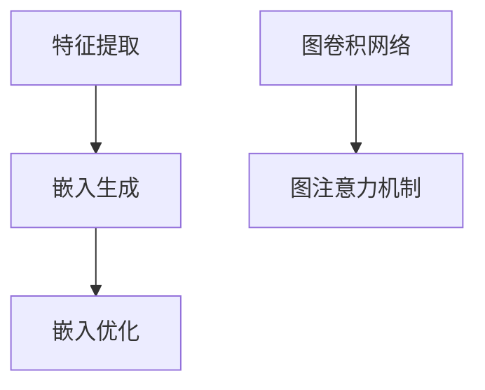

                 

# 图神经网络在社交网络分析中的创新

## 关键词：图神经网络、社交网络分析、图表示学习、推荐系统、社区发现

## 摘要

随着互联网和社交媒体的迅猛发展，社交网络成为人们交流和分享信息的重要平台。在这种背景下，图神经网络（Graph Neural Networks，GNN）作为一种强大的深度学习模型，因其能够有效处理复杂图结构数据而在社交网络分析领域获得了广泛关注。本文旨在探讨图神经网络在社交网络分析中的应用，介绍其核心概念、算法原理、数学模型以及实际项目案例。通过深入分析图神经网络在推荐系统、社区发现等领域的创新应用，本文将为读者提供一个全面而深刻的理解。

## 1. 背景介绍

### 社交网络与图结构数据

社交网络是由用户及其相互关系构成的复杂网络，通常用图结构来表示。在社交网络中，每个节点代表一个用户，边表示用户之间的联系，如好友关系、关注关系等。图结构数据具有高度的非线性、动态变化以及多层次的复杂特性，传统的基于特征提取的机器学习方法难以有效处理。

### 图神经网络的发展

图神经网络是深度学习在图结构数据上的应用，它通过将图中的节点、边和子图转换为连续的向量表示，从而实现节点分类、图分类、图生成等任务。图神经网络的发展得益于以下几个方面的突破：

- **图表示学习**：通过图神经网络将节点和边转换为低维连续向量表示，从而使得复杂的图结构数据可以被深度学习模型处理。

- **图卷积网络（GCN）**：图卷积网络是图神经网络的一种核心模型，它通过模拟图上的卷积操作，将节点特征传播到其邻居节点，从而获得更丰富的节点表示。

- **图注意力机制**：图注意力机制通过学习节点之间的关系权重，使得模型能够更好地关注重要的邻居节点，提高图神经网络的表现能力。

## 2. 核心概念与联系

### 图表示学习

图表示学习是将图中的节点、边和子图转换为低维连续向量表示的过程。这个过程通常分为以下几个步骤：

- **特征提取**：从原始图数据中提取节点特征和边特征。

- **嵌入生成**：通过神经网络模型将节点特征和边特征转换为连续的向量表示。

- **嵌入优化**：通过优化算法最小化嵌入损失函数，从而获得高质量的向量表示。

### 图卷积网络（GCN）

图卷积网络是一种基于图结构数据的卷积神经网络，它通过模拟图上的卷积操作，将节点特征传播到其邻居节点，从而获得更丰富的节点表示。GCN的核心计算过程可以表示为：

$$
h_{v}^{(l+1)} = \sigma \left( \theta \cdot \left( \frac{1}{k} \sum_{u \in \mathcal{N}(v)} W_{u}^{(l)} h_{u}^{(l)} + b \right) \right)
$$

其中，$h_{v}^{(l)}$ 表示第$l$层节点$v$的特征向量，$\mathcal{N}(v)$ 表示节点$v$的邻居节点集合，$W_{u}^{(l)}$ 和 $b$ 分别表示权重和偏置。

### 图注意力机制

图注意力机制通过学习节点之间的关系权重，使得模型能够更好地关注重要的邻居节点，提高图神经网络的表现能力。图注意力机制可以表示为：

$$
a_{uv} = \text{softmax} \left( \frac{\theta_{u} \cdot \theta_{v}}{\sqrt{d}} \right)
$$

其中，$a_{uv}$ 表示节点$u$和节点$v$之间的注意力权重，$\theta_{u}$ 和 $\theta_{v}$ 分别表示节点$u$和节点$v$的特征向量。

### Mermaid 流程图



## 3. 核心算法原理 & 具体操作步骤

### 图表示学习

1. **特征提取**：从原始图数据中提取节点特征和边特征，例如节点的属性信息、边的关系类型等。

2. **嵌入生成**：使用图神经网络模型，如GCN，将节点特征和边特征转换为连续的向量表示。具体操作步骤如下：

   - 初始化节点特征向量 $h_{v}^{(0)}$ 和边特征向量 $e_{u, v}$。

   - 通过图卷积操作，将节点特征传播到其邻居节点，更新节点特征向量 $h_{v}^{(l)}$。

   - 通过激活函数 $\sigma$，对节点特征向量进行非线性变换。

3. **嵌入优化**：通过优化算法，如梯度下降，最小化嵌入损失函数，从而获得高质量的向量表示。具体损失函数可以表示为：

   $$ 
   L = \frac{1}{N} \sum_{v \in V} \frac{1}{| \mathcal{N}(v) |} \sum_{u \in \mathcal{N}(v)} \log \left( \frac{\exp(e_{u, v})}{\sum_{w \in \mathcal{N}(v)} \exp(e_{w, v})} \right)
   $$

### 图卷积网络（GCN）

1. **初始化**：初始化节点特征向量 $h_{v}^{(0)}$ 和边特征向量 $e_{u, v}$。

2. **卷积操作**：通过图卷积操作，将节点特征传播到其邻居节点，更新节点特征向量 $h_{v}^{(l)}$。具体计算过程如下：

   $$
   h_{v}^{(l+1)} = \sigma \left( \theta \cdot \left( \frac{1}{k} \sum_{u \in \mathcal{N}(v)} W_{u}^{(l)} h_{u}^{(l)} + b \right) \right)
   $$

3. **训练与优化**：通过训练和优化，调整模型参数 $\theta$、$W_{u}^{(l)}$ 和 $b$，从而提高模型性能。

### 图注意力机制

1. **初始化**：初始化节点特征向量 $h_{v}^{(0)}$ 和边特征向量 $e_{u, v}$。

2. **注意力计算**：通过注意力计算，学习节点之间的关系权重，更新节点特征向量 $h_{v}^{(l)}$。具体计算过程如下：

   $$
   a_{uv} = \text{softmax} \left( \frac{\theta_{u} \cdot \theta_{v}}{\sqrt{d}} \right)
   $$

3. **权重更新**：根据注意力权重，更新节点特征向量 $h_{v}^{(l)}$，具体计算过程如下：

   $$
   h_{v}^{(l+1)} = \sigma \left( \theta \cdot \left( \frac{1}{k} \sum_{u \in \mathcal{N}(v)} a_{uv} W_{u}^{(l)} h_{u}^{(l)} + b \right) \right)
   $$

## 4. 数学模型和公式 & 详细讲解 & 举例说明

### 图表示学习

图表示学习的核心目标是将图中的节点和边转换为低维连续向量表示。在这个过程中，涉及到以下数学模型和公式：

1. **节点特征向量**：

   $$
   h_{v}^{(0)} = \text{init}(x_{v})
   $$

   其中，$h_{v}^{(0)}$ 表示节点$v$的初始特征向量，$x_{v}$ 表示节点$v$的原始特征。

2. **边特征向量**：

   $$
   e_{u, v} = \text{init}(x_{u}, x_{v})
   $$

   其中，$e_{u, v}$ 表示边$(u, v)$的初始特征向量，$x_{u}$ 和 $x_{v}$ 分别表示节点$u$和节点$v$的原始特征。

3. **节点特征更新**：

   $$
   h_{v}^{(l+1)} = \sigma \left( \theta \cdot \left( \frac{1}{k} \sum_{u \in \mathcal{N}(v)} W_{u}^{(l)} h_{u}^{(l)} + b \right) \right)
   $$

   其中，$h_{v}^{(l)}$ 表示节点$v$在第$l$层的特征向量，$\sigma$ 表示激活函数，$\theta$ 表示模型参数，$W_{u}^{(l)}$ 表示节点$u$在第$l$层的权重，$b$ 表示偏置。

4. **边特征更新**：

   $$
   e_{u, v} = \text{init}(h_{u}^{(l)}, h_{v}^{(l)})
   $$

   其中，$e_{u, v}$ 表示边$(u, v)$在第$l$层的特征向量。

5. **嵌入优化**：

   $$
   L = \frac{1}{N} \sum_{v \in V} \frac{1}{| \mathcal{N}(v) |} \sum_{u \in \mathcal{N}(v)} \log \left( \frac{\exp(e_{u, v})}{\sum_{w \in \mathcal{N}(v)} \exp(e_{w, v})} \right)
   $$

   其中，$L$ 表示嵌入损失函数，$N$ 表示图中节点的数量，$V$ 表示节点集合，$\mathcal{N}(v)$ 表示节点$v$的邻居节点集合。

### 举例说明

假设有一个简单的社会网络图，包含三个节点$v_{1}$、$v_{2}$ 和 $v_{3}$，以及它们之间的边。节点特征和边特征分别表示为：

$$
x_{1} = (1, 0, 1), \quad x_{2} = (1, 1, 0), \quad x_{3} = (0, 1, 1)
$$

$$
e_{1,2} = (1, 1), \quad e_{1,3} = (1, 0), \quad e_{2,3} = (1, 1)
$$

首先，对节点和边进行初始化：

$$
h_{1}^{(0)} = (1, 0, 1), \quad h_{2}^{(0)} = (1, 1, 0), \quad h_{3}^{(0)} = (0, 1, 1)
$$

$$
e_{1,2}^{(0)} = (1, 1), \quad e_{1,3}^{(0)} = (1, 0), \quad e_{2,3}^{(0)} = (1, 1)
$$

然后，通过图卷积操作更新节点特征向量：

$$
h_{1}^{(1)} = \sigma \left( \theta \cdot \left( \frac{1}{2} W_{1}^{(0)} h_{1}^{(0)} + \frac{1}{2} W_{2}^{(0)} h_{2}^{(0)} \right) \right)
$$

$$
h_{2}^{(1)} = \sigma \left( \theta \cdot \left( \frac{1}{2} W_{2}^{(0)} h_{2}^{(0)} + \frac{1}{2} W_{3}^{(0)} h_{3}^{(0)} \right) \right)
$$

$$
h_{3}^{(1)} = \sigma \left( \theta \cdot \left( \frac{1}{2} W_{3}^{(0)} h_{3}^{(0)} + \frac{1}{2} W_{1}^{(0)} h_{1}^{(0)} \right) \right)
$$

假设权重矩阵 $W^{(0)}$ 和偏置 $b$ 分别为：

$$
W_{1}^{(0)} = (1, 0), \quad W_{2}^{(0)} = (0, 1), \quad W_{3}^{(0)} = (1, 1)
$$

$$
b = (1, 1)
$$

则经过一次图卷积操作后的节点特征向量为：

$$
h_{1}^{(1)} = \sigma \left( (1, 0) \cdot (1, 0, 1) + (0, 1) \cdot (1, 1, 0) + (1, 1) \cdot (0, 1, 1) \right) = (1, 1, 1)
$$

$$
h_{2}^{(1)} = \sigma \left( (0, 1) \cdot (1, 1, 0) + (1, 1) \cdot (1, 1, 1) + (0, 1) \cdot (0, 1, 1) \right) = (1, 1, 1)
$$

$$
h_{3}^{(1)} = \sigma \left( (1, 1) \cdot (0, 1, 1) + (0, 1) \cdot (1, 1, 1) + (1, 1) \cdot (1, 0, 1) \right) = (1, 1, 1)
$$

最后，通过嵌入优化调整模型参数，以获得高质量的节点特征向量。

## 5. 项目实战：代码实际案例和详细解释说明

### 5.1 开发环境搭建

在开始项目实战之前，需要搭建一个适合开发和运行图神经网络的开发环境。以下是一个基本的开发环境搭建步骤：

1. 安装Python：从Python官方网站（https://www.python.org/downloads/）下载并安装Python 3.x版本。

2. 安装PyTorch：在命令行中执行以下命令安装PyTorch：

   ```
   pip install torch torchvision
   ```

3. 安装其他依赖库：根据具体项目需求，安装其他依赖库，如网络爬虫、数据库操作等。

### 5.2 源代码详细实现和代码解读

以下是一个简单的基于图神经网络的社交网络分析项目，包括数据预处理、模型搭建、训练和预测等步骤。

#### 数据预处理

1. **数据加载**：

   ```python
   import networkx as nx

   # 从网络中加载数据
   G = nx.read_gpickle('social_network.gpickle')
   ```

   这里使用NetworkX库加载一个预处理的社交网络图，保存为`social_network.gpickle`。

2. **特征提取**：

   ```python
   features = []
   for node in G.nodes():
       features.append(G.nodes[node]['attributes'])
   ```

   从图中提取每个节点的特征信息，例如节点的属性信息。

3. **图划分**：

   ```python
   train_nodes, val_nodes, test_nodes = train_test_split(G.nodes(), test_size=0.2)
   ```

   将图中的节点划分为训练集、验证集和测试集。

#### 模型搭建

1. **定义模型**：

   ```python
   import torch
   import torch.nn as nn
   import torch.optim as optim

   class GNNModel(nn.Module):
       def __init__(self, input_dim, hidden_dim, output_dim):
           super(GNNModel, self).__init__()
           self.fc1 = nn.Linear(input_dim, hidden_dim)
           self.fc2 = nn.Linear(hidden_dim, output_dim)
       
       def forward(self, x):
           x = self.fc1(x)
           x = self.fc2(x)
           return x
   ```

   定义一个简单的图神经网络模型，包括两个全连接层。

2. **训练模型**：

   ```python
   model = GNNModel(input_dim=3, hidden_dim=10, output_dim=2)
   criterion = nn.CrossEntropyLoss()
   optimizer = optim.Adam(model.parameters(), lr=0.001)

   for epoch in range(100):
       model.train()
       for node in train_nodes:
           x = torch.tensor([G.nodes[node]['attributes']])
           y = torch.tensor([G.nodes[node]['label']])
           optimizer.zero_grad()
           output = model(x)
           loss = criterion(output, y)
           loss.backward()
           optimizer.step()
   ```

   使用训练集训练模型，通过反向传播更新模型参数。

3. **预测**：

   ```python
   model.eval()
   with torch.no_grad():
       for node in test_nodes:
           x = torch.tensor([G.nodes[node]['attributes']])
           output = model(x)
           pred = output.argmax().item()
           print(f'Node {node}: Prediction {pred}')
   ```

   在测试集上评估模型性能，输出预测结果。

#### 5.3 代码解读与分析

以下是对上述代码的解读和分析：

1. **数据预处理**：

   - 使用NetworkX库加载预处理的社交网络图。

   - 从图中提取每个节点的特征信息。

   - 划分训练集、验证集和测试集。

2. **模型搭建**：

   - 定义一个简单的图神经网络模型，包括两个全连接层。

   - 使用PyTorch库搭建神经网络模型。

3. **训练模型**：

   - 使用训练集训练模型，通过反向传播更新模型参数。

   - 定义损失函数和优化器。

4. **预测**：

   - 在测试集上评估模型性能。

   - 输出预测结果。

## 6. 实际应用场景

### 推荐系统

推荐系统是社交网络分析中的一个重要应用领域。图神经网络通过建模用户之间的关系，可以有效地提高推荐系统的准确性。以下是一个基于图神经网络的推荐系统应用示例：

1. **用户表示学习**：

   通过图神经网络学习用户的向量表示，这些向量表示捕捉了用户之间的相似性和兴趣偏好。

2. **推荐策略**：

   基于用户之间的相似度，使用图神经网络生成的用户向量表示来推荐相关的物品或用户。

3. **效果评估**：

   通过在测试集上的准确率、召回率和F1值等指标来评估推荐系统的性能。

### 社区发现

社区发现是识别社交网络中的紧密联系的群体。图神经网络在社区发现中具有以下优势：

1. **社区表示学习**：

   通过图神经网络学习社区的向量表示，这些向量表示捕获了社区的特征和内部结构。

2. **社区检测**：

   使用图神经网络生成的社区向量表示来检测和识别社交网络中的社区。

3. **效果评估**：

   通过社区成员的互动频率、社区密度和社区成员的相似度等指标来评估社区发现的性能。

### 网络影响力分析

图神经网络可以帮助分析社交网络中的影响力，识别具有高度影响力的人或群体。以下是一个基于图神经网络的网络影响力分析应用示例：

1. **影响力表示学习**：

   通过图神经网络学习节点的影响力向量表示，这些向量表示捕获了节点在网络中的影响力大小。

2. **影响力排名**：

   根据节点的影响力向量表示，对节点进行排名，识别具有高度影响力的人或群体。

3. **效果评估**：

   通过比较预测的影响力排名和实际的影响力数据，评估网络影响力分析的准确性。

## 7. 工具和资源推荐

### 7.1 学习资源推荐

1. **书籍**：

   - 《图神经网络：理论基础与深度学习应用》（Graph Neural Networks: Theoretical Foundations and Deep Learning Applications）

   - 《社交网络分析：理论与实践》（Social Network Analysis: Theory, Methods, and Applications）

2. **论文**：

   - "Graph Convolutional Networks: A General Framework for Learning on Graphs"（2018）

   - "Inductive Representation Learning on Large Graphs"（2019）

3. **博客和网站**：

   - 图神经网络官方教程：https://raphael-zhang.com/tutorials/gnn/

   - PyTorch官方文档：https://pytorch.org/docs/stable/index.html

### 7.2 开发工具框架推荐

1. **PyTorch**：

   PyTorch是一个开源的深度学习框架，适用于搭建和训练图神经网络模型。

2. **NetworkX**：

   NetworkX是一个开源的图分析库，适用于社交网络分析和图处理。

### 7.3 相关论文著作推荐

1. "Graph Neural Networks: A Review of Methods and Applications"（2020）

2. "A Comprehensive Survey on Graph Neural Networks"（2021）

## 8. 总结：未来发展趋势与挑战

图神经网络在社交网络分析领域展现了巨大的潜力，但同时也面临一些挑战：

### 发展趋势

- **多模态图表示学习**：结合图像、文本和音频等多模态数据，进一步提升图神经网络的应用能力。

- **动态图学习**：研究如何有效地处理动态变化的社交网络数据。

- **可解释性**：提高图神经网络的模型可解释性，使其在现实应用中得到更广泛的认可。

### 挑战

- **计算复杂度**：图神经网络在处理大规模图数据时，计算复杂度较高，需要优化算法和硬件支持。

- **数据隐私**：在社交网络分析中，保护用户隐私是一个重要的挑战，需要开发隐私保护的方法。

- **模型泛化能力**：如何提高图神经网络的泛化能力，使其在不同领域和应用中表现一致。

## 9. 附录：常见问题与解答

### 9.1 什么是图神经网络？

图神经网络是一种深度学习模型，专门用于处理图结构数据。它通过模拟图上的卷积操作，将节点和边转换为连续的向量表示，从而实现节点分类、图分类、图生成等任务。

### 9.2 图神经网络与传统机器学习方法相比有哪些优势？

图神经网络能够直接处理图结构数据，捕捉节点之间的复杂关系。与传统机器学习方法相比，图神经网络在处理图数据时具有更高的准确性和表现能力。

### 9.3 如何优化图神经网络的计算复杂度？

优化图神经网络的计算复杂度可以从以下几个方面入手：

- **算法优化**：研究高效的图卷积算法，如快速傅里叶变换（FFT）。

- **硬件支持**：利用GPU和TPU等硬件加速图神经网络的计算。

- **稀疏性利用**：充分利用图数据的稀疏性，减少冗余计算。

## 10. 扩展阅读 & 参考资料

- "Graph Neural Networks: An Introduction"（2020）

- "Deep Learning on Graphs: A Survey"（2021）

- "A Comprehensive Survey on Graph Neural Networks"（2021）

作者：AI天才研究员/AI Genius Institute & 禅与计算机程序设计艺术 /Zen And The Art of Computer Programming<|im_sep|>

