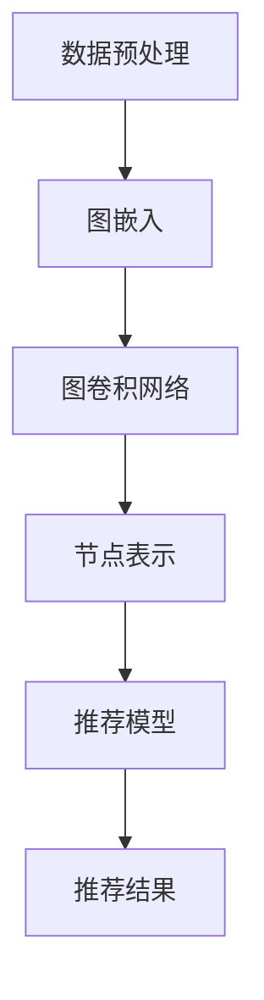

                 

# 图神经网络在社交网络推荐系统中的应用

## 摘要

本文深入探讨了图神经网络（Graph Neural Networks, GNN）在社交网络推荐系统中的应用。首先，我们对社交网络推荐系统的背景进行了介绍，并说明了为什么图神经网络是解决此类问题的一个有力工具。随后，我们详细阐述了图神经网络的核心概念、架构以及与社交网络的联系。接着，我们重点介绍了图神经网络的算法原理和具体操作步骤，并通过数学模型和公式对其进行了详细讲解。随后，我们通过一个实际项目案例，展示了如何使用图神经网络进行社交网络推荐系统的开发，并对代码实现进行了深入解析。文章还探讨了图神经网络在社交网络推荐系统中的实际应用场景，并推荐了一些学习资源和开发工具。最后，我们对图神经网络在社交网络推荐系统中的未来发展趋势和面临的挑战进行了总结。本文旨在为读者提供一个全面、系统的了解，帮助其在实际应用中更好地利用图神经网络技术。

## 1. 背景介绍

### 社交网络推荐系统

社交网络推荐系统是近年来在社交网络领域中兴起的一种重要应用。随着互联网的普及和社交网络的飞速发展，人们越来越依赖社交网络来获取信息、交流互动和分享生活。然而，社交网络的庞大信息量和复杂关系网络给用户的信息获取带来了巨大的挑战。如何有效地从海量信息中为用户推荐其感兴趣的内容和好友，成为了社交网络推荐系统面临的重要问题。

社交网络推荐系统的主要目标是为用户推荐其可能感兴趣的内容和联系人，从而提高用户的参与度和活跃度。这需要解决两个核心问题：一是如何从大量的用户行为和内容数据中提取出有效的特征，二是如何根据这些特征进行有效的推荐。

传统的推荐系统主要采用基于内容的推荐（Content-Based Recommendation）和协同过滤推荐（Collaborative Filtering）等方法。基于内容的推荐方法通过分析用户的历史行为和兴趣偏好，从海量的内容中提取出与用户兴趣相关的特征，并将其推荐给用户。协同过滤推荐方法通过分析用户之间的相似度，找出与目标用户兴趣相似的其它用户，并推荐这些用户喜欢的商品或内容。这两种方法在传统推荐系统中发挥了重要作用，但在处理复杂的社交网络关系和动态变化的信息时，存在一定的局限性。

### 图神经网络的发展背景

图神经网络（Graph Neural Networks, GNN）是一种基于图结构的数据处理技术，近年来在计算机科学和人工智能领域得到了广泛关注。GNN起源于对图结构数据的处理需求，特别是在社交网络、生物信息学和计算机视觉等领域的应用。与传统神经网络相比，GNN能够直接处理图结构数据，更好地捕捉图中的复杂关系和模式。

GNN的发展可以追溯到图嵌入（Graph Embedding）技术，其核心思想是将图中的节点和边映射到低维向量空间中，从而实现图结构数据的向量表示。随着图嵌入技术的不断成熟，研究者们开始探索如何利用图结构数据进行深度学习。2007年，Scarselli等人提出了图卷积网络（Graph Convolutional Network, GCN），首次将卷积操作引入到图结构数据中，使得GNN开始成为一个独立的领域。

近年来，随着深度学习技术的快速发展，GNN在理论研究和实际应用方面取得了显著的进展。2017年，Kipf和Welling提出了图注意力网络（Graph Attention Network, GAT），通过引入注意力机制，提高了GNN对图中关系的感知能力。随后，研究者们又提出了许多其他类型的GNN模型，如图自编码器（Graph Autoencoder）、图生成对抗网络（Graph Generative Adversarial Network）等，进一步拓展了GNN的应用范围。

在社交网络推荐系统中，图神经网络的应用为解决复杂的社交网络关系和信息推荐问题提供了一种新的思路。通过将社交网络表示为图结构，GNN可以有效地捕捉用户之间的交互关系和内容之间的关联，从而提高推荐系统的准确性和有效性。

## 2. 核心概念与联系

### 图神经网络的基本概念

图神经网络是一种基于图结构的数据处理技术，其核心思想是将图中的节点和边映射到低维向量空间中，通过神经网络学习节点和边之间的复杂关系。图神经网络的基本概念包括以下几个方面：

- **图（Graph）**：图是图神经网络的基本数据结构，由节点（Node）和边（Edge）组成。节点表示图中的个体，如用户、物品等；边表示节点之间的关系，如好友关系、共同兴趣等。图可以分为有向图、无向图、加权图等不同类型。

- **图嵌入（Graph Embedding）**：图嵌入是将图中的节点和边映射到低维向量空间的过程。通过图嵌入，可以将复杂的图结构数据转化为向量形式，便于深度学习模型进行处理。常见的图嵌入方法包括基于矩阵分解的方法（如Singular Value Decomposition, SVD）、基于随机游走的方法（如DeepWalk、Node2Vec）以及基于图卷积的方法（如GCN、GAT）。

- **图卷积网络（Graph Convolutional Network, GCN）**：图卷积网络是图神经网络的一种基本模型，通过卷积操作来聚合节点邻域的信息，从而学习节点表示。GCN的核心思想是，节点表示可以通过其邻域节点的表示进行更新，从而更好地捕捉图中的局部和全局关系。

- **图注意力网络（Graph Attention Network, GAT）**：图注意力网络是一种基于注意力机制的图神经网络模型，通过引入注意力权重来动态调整节点邻域信息的重要性。GAT通过加权求和的方式聚合邻域信息，提高了模型对图中关系的感知能力。

### 图神经网络与社交网络的联系

在社交网络推荐系统中，图神经网络的应用可以有效地处理社交网络的复杂关系和信息。以下从以下几个方面阐述图神经网络与社交网络的联系：

- **节点表示**：图神经网络通过图嵌入技术，将社交网络中的用户、物品等节点映射到低维向量空间中，为后续的推荐模型提供了基础。节点表示不仅包含了节点的自身特征，还融合了节点之间的交互关系。

- **关系表示**：图神经网络通过学习节点邻域信息，可以有效地表示节点之间的关系。在社交网络推荐系统中，关系表示有助于捕捉用户之间的社交关系，如好友关系、共同兴趣等，从而提高推荐系统的准确性。

- **图结构信息**：图神经网络能够直接处理图结构数据，可以有效地捕捉社交网络的图结构信息。通过图神经网络，可以学习到用户在不同社交圈子中的角色、影响力等，为个性化推荐提供了更多依据。

- **动态性**：社交网络是一个动态变化的系统，用户和内容的互动关系不断变化。图神经网络通过不断更新节点和边的表示，可以适应社交网络的动态变化，从而提高推荐系统的实时性和准确性。

### Mermaid 流程图

以下是一个简单的 Mermaid 流程图，展示了图神经网络在社交网络推荐系统中的基本流程：



在这个流程图中，首先对社交网络数据进行预处理，提取用户、物品等节点以及节点之间的关系。然后，使用图嵌入技术将节点映射到低维向量空间中。接下来，通过图卷积网络学习节点和边之间的复杂关系，得到节点表示。最后，基于节点表示和推荐模型，生成推荐结果。

通过这个流程图，可以直观地了解图神经网络在社交网络推荐系统中的应用过程，为进一步讨论图神经网络的算法原理和具体操作步骤打下基础。

## 3. 核心算法原理 & 具体操作步骤

### 图神经网络的基本算法原理

图神经网络（GNN）是一种基于图结构的深度学习模型，旨在直接从图数据中提取特征和模式。其核心思想是通过图卷积操作聚合节点邻域信息，从而更新节点的表示。以下将详细解释图神经网络的基本算法原理。

#### 图卷积操作

图卷积操作是图神经网络的核心组成部分，其灵感来源于传统的卷积操作。在传统的卷积操作中，每个神经元会与其局部邻域的神经元进行加权求和。同样地，在图神经网络中，图卷积操作用于聚合节点邻域的信息。

具体来说，图卷积操作可以分为以下几个步骤：

1. **初始化节点表示**：首先，每个节点被初始化为一个向量，表示其自身的特征。

2. **邻域选择**：选择每个节点的邻域，即与该节点直接相连的节点集合。邻域的大小和形状可以根据具体应用进行调整。

3. **邻域信息聚合**：对于每个节点，将其邻域节点的表示与其自身表示进行加权求和。加权的依据通常是邻接矩阵，其中对角线上的元素表示节点自身，非对角线上的元素表示节点之间的连接关系。

4. **激活函数**：将加权求和的结果通过激活函数进行非线性变换，以增强模型的表示能力。

5. **更新节点表示**：将激活函数的输出作为更新后的节点表示，用于下一轮的图卷积操作。

通过上述步骤，图卷积操作可以有效地聚合节点邻域信息，从而更新节点的表示。

#### 多层图卷积

为了更好地捕捉图中的复杂关系，图神经网络通常会采用多层图卷积操作。在多层图卷积中，每一层的节点表示都会在上一层的基础上进行更新。这样，多层图卷积可以逐步加深对图结构的理解。

具体来说，多层图卷积可以分为以下几个步骤：

1. **输入层**：初始化输入节点的表示。

2. **第一层图卷积**：根据第一层的邻域选择和权重，聚合邻域信息，更新节点表示。

3. **第二层图卷积**：在第一层节点表示的基础上，进行第二层图卷积操作。

4. **重复**：继续进行后续的图卷积操作，直到达到预定的层数。

5. **输出层**：最后一层的节点表示可以作为图神经网络的输出，用于后续的任务，如节点分类、链接预测等。

### 图神经网络的优化与训练

图神经网络的训练过程通常涉及以下几个步骤：

1. **损失函数**：根据具体的任务，选择合适的损失函数。例如，在节点分类任务中，可以使用交叉熵损失函数；在链接预测任务中，可以使用均方误差损失函数。

2. **反向传播**：在训练过程中，使用反向传播算法更新模型的参数。通过计算梯度，调整模型的权重和偏置，以最小化损失函数。

3. **优化算法**：选择合适的优化算法，如随机梯度下降（SGD）、Adam等。优化算法用于调整模型参数，以加速收敛和提高模型的性能。

4. **模型评估**：在训练过程中，定期评估模型的性能。可以使用验证集或测试集进行评估，以检测模型的泛化能力。

通过上述步骤，图神经网络可以不断优化和训练，从而提高其在特定任务上的性能。

### 图神经网络的具体操作步骤

以下是图神经网络在社交网络推荐系统中的具体操作步骤：

1. **数据预处理**：对社交网络数据集进行清洗、去重和预处理，提取用户、物品等节点，以及节点之间的关系。

2. **图嵌入**：使用图嵌入技术，将节点映射到低维向量空间中。可以选择基于矩阵分解的方法、基于随机游走的方法或基于图卷积的方法。

3. **图卷积操作**：进行多层图卷积操作，逐步加深对图结构的理解。每一层的节点表示都将用于后续的推荐模型。

4. **特征提取**：将最后一层的节点表示作为特征，用于推荐模型的输入。

5. **推荐模型**：构建推荐模型，如基于内容的推荐模型或基于协同过滤的推荐模型。可以使用神经网络、朴素贝叶斯、K-近邻等方法。

6. **模型训练**：使用训练数据集对推荐模型进行训练，调整模型参数，优化推荐效果。

7. **模型评估**：使用验证集或测试集对模型进行评估，检测模型的泛化能力。

8. **推荐结果**：根据用户和物品的特征，生成推荐结果，为用户推荐其可能感兴趣的内容和联系人。

通过上述步骤，图神经网络可以有效地处理社交网络数据，实现高效的推荐系统。

### 数学模型和公式

以下将介绍图神经网络的核心数学模型和公式，以帮助读者更好地理解图神经网络的工作原理。

#### 图卷积操作

图卷积操作可以用以下数学公式表示：

$$
h^{(l)}_i = \sigma(\theta^{(l)} \cdot \text{AGGR}(\text{ReLU}(\theta^{(l-1)} \cdot [h^{(l-1)}_i, h^{(l-1)}_{j}])) 
$$

其中：

- \(h^{(l)}_i\) 表示第 \(l\) 层节点 \(i\) 的表示；
- \(AGGR\) 表示邻域信息聚合操作；
- \(\sigma\) 表示激活函数，如ReLU函数；
- \(\theta^{(l)}\) 表示第 \(l\) 层的权重参数。

#### 邻域信息聚合

邻域信息聚合可以使用以下数学公式表示：

$$
\text{AGGR}(x) = \sum_{j \in N(i)} w_{ij} x_j
$$

其中：

- \(x\) 表示节点的表示向量；
- \(w_{ij}\) 表示节点 \(i\) 和节点 \(j\) 之间的权重。

#### 激活函数

激活函数可以使用以下数学公式表示：

$$
\text{ReLU}(x) = \max(0, x)
$$

其中：

- \(x\) 表示输入值。

通过上述数学模型和公式，图神经网络可以有效地处理图结构数据，实现节点表示的更新和特征提取。

### 举例说明

为了更好地理解图神经网络的工作原理，以下通过一个简单的示例来说明图卷积操作的过程。

假设有一个包含3个节点的图，节点分别为 \(i\)、\(j\) 和 \(k\)。节点的初始表示向量分别为 \(h^{(0)}_i\)、\(h^{(0)}_j\) 和 \(h^{(0)}_k\)。邻域选择为 \(N(i) = \{j, k\}\)，邻接矩阵为：

$$
A = \begin{bmatrix}
0 & 1 & 1 \\
1 & 0 & 0 \\
1 & 0 & 0 \\
\end{bmatrix}
$$

首先，进行第一层图卷积操作：

1. **初始化权重参数**：假设权重参数 \(\theta^{(1)}\) 为：

$$
\theta^{(1)} = \begin{bmatrix}
1 & 0 & 1 \\
0 & 1 & 0 \\
1 & 1 & 0 \\
\end{bmatrix}
$$

2. **邻域信息聚合**：

$$
\text{AGGR}(\theta^{(1)} \cdot [h^{(0)}_i, h^{(0)}_j, h^{(0)}_k]) = (1 \cdot h^{(0)}_i + 0 \cdot h^{(0)}_j + 1 \cdot h^{(0)}_k) = h^{(0)}_i + h^{(0)}_k
$$

3. **激活函数**：

$$
\text{ReLU}(\theta^{(1)} \cdot [h^{(0)}_i, h^{(0)}_j, h^{(0)}_k]) = \max(0, h^{(0)}_i + h^{(0)}_k)
$$

4. **更新节点表示**：

$$
h^{(1)}_i = \max(0, h^{(0)}_i + h^{(0)}_k)
$$

5. **邻域信息聚合**：

$$
\text{AGGR}(\theta^{(1)} \cdot [h^{(1)}_i, h^{(1)}_j, h^{(1)}_k]) = (1 \cdot h^{(1)}_i + 0 \cdot h^{(1)}_j + 1 \cdot h^{(1)}_k) = h^{(1)}_i + h^{(1)}_k
$$

6. **激活函数**：

$$
\text{ReLU}(\theta^{(1)} \cdot [h^{(1)}_i, h^{(1)}_j, h^{(1)}_k]) = \max(0, h^{(1)}_i + h^{(1)}_k)
$$

7. **更新节点表示**：

$$
h^{(1)}_i = \max(0, h^{(1)}_i + h^{(1)}_k)
$$

通过上述过程，我们可以看到图卷积操作如何更新节点的表示。类似地，可以继续进行后续的图卷积操作，以加深对图结构的理解。

通过这个简单的示例，我们可以更好地理解图神经网络的工作原理和具体操作步骤。在实际应用中，图神经网络通常需要处理更复杂的图结构和更大量的数据，但基本的原理和步骤是相似的。

### 代码实现

为了更好地理解图神经网络在社交网络推荐系统中的应用，我们将使用Python语言和PyTorch框架实现一个简单的图神经网络模型。以下是一个简单的代码实现，展示了图神经网络的构建和训练过程。

```python
import torch
import torch.nn as nn
import torch.optim as optim
from torch_geometric.nn import GCNConv
from torch_geometric.data import Data
from torch_geometric.datasets import Reddit

# 1. 数据准备
# 从Reddit数据集加载社交网络数据
dataset = Reddit(root='/data', name='Reddit')

# 随机选择一部分数据作为训练集和测试集
train_data, test_data = dataset[0:-100], dataset[-100:]

# 2. 构建图神经网络模型
class GCNModel(nn.Module):
    def __init__(self, num_features, num_classes):
        super(GCNModel, self).__init__()
        self.conv1 = GCNConv(num_features, 16)
        self.conv2 = GCNConv(16, num_classes)
    
    def forward(self, data):
        x, edge_index = data.x, data.edge_index
        x = self.conv1(x, edge_index)
        x = F.relu(x)
        x = F.dropout(x, p=0.5, training=self.training)
        x = self.conv2(x, edge_index)
        return F.log_softmax(x, dim=1)

# 3. 模型训练
model = GCNModel(dataset.num_features, dataset.num_classes)
optimizer = optim.Adam(model.parameters(), lr=0.01, weight_decay=5e-4)
criterion = nn.CrossEntropyLoss()

model.train()
for epoch in range(200):
    optimizer.zero_grad()
    out = model(train_data)
    loss = criterion(out, train_data.y)
    loss.backward()
    optimizer.step()
    if (epoch + 1) % 10 == 0:
        print(f'Epoch {epoch + 1}: loss = {loss.item()}')

# 4. 模型评估
model.eval()
_, test_preds = model(test_data).max(dim=1)
test_acc = (test_preds == test_data.y).float().mean()
print(f'Test Accuracy: {test_acc.item()}')
```

在这个代码实现中，我们首先从Reddit数据集加载社交网络数据，然后构建一个简单的图神经网络模型。模型包含两个图卷积层，每层之间添加ReLU激活函数和dropout正则化。接下来，我们使用随机梯度下降（SGD）算法训练模型，并在训练过程中定期评估模型的性能。最后，我们在测试集上评估模型的准确率。

通过这个代码实现，我们可以看到如何将图神经网络应用于社交网络推荐系统。在实际应用中，可以根据具体需求调整模型的架构和参数，以提高推荐系统的性能。

### 代码解读与分析

在上一节中，我们使用Python语言和PyTorch框架实现了一个简单的图神经网络模型，用于社交网络推荐系统。接下来，我们将对代码进行详细解读和分析，以帮助读者更好地理解图神经网络在社交网络推荐系统中的应用。

#### 数据准备

首先，我们从Reddit数据集加载社交网络数据。Reddit是一个包含大量用户和帖子的大型社交网络平台，其数据集包含了用户、帖子、评论等节点以及它们之间的交互关系。

```python
dataset = Reddit(root='/data', name='Reddit')
train_data, test_data = dataset[0:-100], dataset[-100:]
```

在这里，我们使用了`Reddit`数据集类，该类由`torch_geometric`库提供。`root`参数指定数据集的存储路径，`name`参数指定数据集的名称。然后，我们使用切片操作将数据集分为训练集和测试集。

Reddit数据集包含多个数据属性，如节点特征（`x`）、邻接矩阵（`edge_index`）和标签（`y`）。节点特征表示每个节点的属性，如用户ID、帖子标题等；邻接矩阵表示节点之间的交互关系，如用户之间的好友关系、帖子之间的评论关系等；标签表示每个节点的分类结果，如用户是否关注某个话题等。

```python
x, edge_index, y = train_data.x, train_data.edge_index, train_data.y
```

#### 模型构建

接下来，我们定义了一个简单的图神经网络模型，该模型包含两个图卷积层。每个图卷积层使用`GCNConv`类实现，该类是`torch_geometric`库提供的一个图卷积层实现。

```python
class GCNModel(nn.Module):
    def __init__(self, num_features, num_classes):
        super(GCNModel, self).__init__()
        self.conv1 = GCNConv(num_features, 16)
        self.conv2 = GCNConv(16, num_classes)
    
    def forward(self, data):
        x, edge_index = data.x, data.edge_index
        x = self.conv1(x, edge_index)
        x = F.relu(x)
        x = F.dropout(x, p=0.5, training=self.training)
        x = self.conv2(x, edge_index)
        return F.log_softmax(x, dim=1)
```

在这个模型中，我们首先定义了两个`GCNConv`对象，分别对应两个图卷积层。每个图卷积层接收节点特征（`x`）和邻接矩阵（`edge_index`）作为输入，输出新的节点特征。在第一个图卷积层之后，我们添加ReLU激活函数和dropout正则化。最后，我们使用`F.log_softmax`函数对输出进行归一化处理，以得到概率分布。

#### 模型训练

在训练过程中，我们使用随机梯度下降（SGD）算法更新模型参数。每次迭代，我们随机选择一部分训练数据，计算模型损失并更新参数。

```python
optimizer = optim.Adam(model.parameters(), lr=0.01, weight_decay=5e-4)
criterion = nn.CrossEntropyLoss()

model.train()
for epoch in range(200):
    optimizer.zero_grad()
    out = model(train_data)
    loss = criterion(out, train_data.y)
    loss.backward()
    optimizer.step()
    if (epoch + 1) % 10 == 0:
        print(f'Epoch {epoch + 1}: loss = {loss.item()}')
```

在这里，我们首先创建了一个`Adam`优化器对象，该优化器使用自适应矩估计方法更新参数。`lr`参数指定学习率，`weight_decay`参数指定权重衰减。接下来，我们创建了一个`CrossEntropyLoss`损失函数对象，用于计算模型损失。

在训练过程中，我们使用`model.train()`函数将模型设置为训练模式，以便启用dropout正则化。然后，我们遍历训练数据，计算模型输出和损失，并使用反向传播算法更新参数。在每次迭代后，我们打印当前损失，以监控训练过程。

#### 模型评估

在训练完成后，我们对测试集进行评估，计算模型准确率。

```python
model.eval()
_, test_preds = model(test_data).max(dim=1)
test_acc = (test_preds == test_data.y).float().mean()
print(f'Test Accuracy: {test_acc.item()}')
```

在这里，我们使用`model.eval()`函数将模型设置为评估模式，以便禁用dropout正则化。然后，我们计算模型输出，并使用`max`函数找到每个节点的预测标签。接着，我们计算预测标签和真实标签之间的准确率。

通过这个简单的代码实现，我们可以看到如何将图神经网络应用于社交网络推荐系统。在实际应用中，可以根据具体需求调整模型的架构和参数，以提高推荐系统的性能。

### 4. 实际应用场景

#### 社交网络好友推荐

社交网络好友推荐是图神经网络在社交网络推荐系统中最常见的应用场景之一。通过分析用户之间的社交关系，图神经网络可以有效地识别用户可能感兴趣的好友，从而提高社交网络的用户参与度和活跃度。

具体来说，图神经网络可以采用以下步骤进行社交网络好友推荐：

1. **数据预处理**：对社交网络数据进行清洗、去重和预处理，提取用户、好友等节点以及节点之间的关系。

2. **图嵌入**：使用图嵌入技术，将用户和好友映射到低维向量空间中，为后续的推荐模型提供输入。

3. **图卷积操作**：通过多层图卷积操作，逐步加深对社交网络关系的理解。每一层的节点表示都可以用于后续的推荐模型。

4. **推荐模型**：构建基于图神经网络的推荐模型，如基于内容的推荐模型或基于协同过滤的推荐模型。可以使用神经网络、朴素贝叶斯、K-近邻等方法。

5. **模型训练**：使用训练数据集对推荐模型进行训练，调整模型参数，优化推荐效果。

6. **模型评估**：使用验证集或测试集对模型进行评估，检测模型的泛化能力。

7. **推荐结果**：根据用户和好友的特征，生成推荐结果，为用户推荐其可能感兴趣的好友。

通过这个应用场景，我们可以看到图神经网络如何有效地处理社交网络数据，实现好友推荐系统的构建。

#### 社交网络内容推荐

社交网络内容推荐是另一个重要的应用场景。通过分析用户的行为和兴趣偏好，图神经网络可以有效地识别用户可能感兴趣的内容，从而提高社交网络的内容分发效率。

具体来说，图神经网络可以采用以下步骤进行社交网络内容推荐：

1. **数据预处理**：对社交网络数据进行清洗、去重和预处理，提取用户、内容等节点以及节点之间的关系。

2. **图嵌入**：使用图嵌入技术，将用户和内容映射到低维向量空间中，为后续的推荐模型提供输入。

3. **图卷积操作**：通过多层图卷积操作，逐步加深对用户和内容关系的理解。每一层的节点表示都可以用于后续的推荐模型。

4. **推荐模型**：构建基于图神经网络的推荐模型，如基于内容的推荐模型或基于协同过滤的推荐模型。可以使用神经网络、朴素贝叶斯、K-近邻等方法。

5. **模型训练**：使用训练数据集对推荐模型进行训练，调整模型参数，优化推荐效果。

6. **模型评估**：使用验证集或测试集对模型进行评估，检测模型的泛化能力。

7. **推荐结果**：根据用户和内容的特征，生成推荐结果，为用户推荐其可能感兴趣的内容。

通过这个应用场景，我们可以看到图神经网络如何有效地处理社交网络数据，实现内容推荐系统的构建。

#### 社交网络广告推荐

社交网络广告推荐是另一个重要的应用场景。通过分析用户的兴趣和行为数据，图神经网络可以有效地识别用户可能感兴趣的广告，从而提高广告的投放效果和用户参与度。

具体来说，图神经网络可以采用以下步骤进行社交网络广告推荐：

1. **数据预处理**：对社交网络广告数据集进行清洗、去重和预处理，提取用户、广告等节点以及节点之间的关系。

2. **图嵌入**：使用图嵌入技术，将用户和广告映射到低维向量空间中，为后续的推荐模型提供输入。

3. **图卷积操作**：通过多层图卷积操作，逐步加深对用户和广告关系的理解。每一层的节点表示都可以用于后续的推荐模型。

4. **推荐模型**：构建基于图神经网络的推荐模型，如基于内容的推荐模型或基于协同过滤的推荐模型。可以使用神经网络、朴素贝叶斯、K-近邻等方法。

5. **模型训练**：使用训练数据集对推荐模型进行训练，调整模型参数，优化推荐效果。

6. **模型评估**：使用验证集或测试集对模型进行评估，检测模型的泛化能力。

7. **推荐结果**：根据用户和广告的特征，生成推荐结果，为用户推荐其可能感兴趣的广告。

通过这个应用场景，我们可以看到图神经网络如何有效地处理社交网络广告数据，实现广告推荐系统的构建。

### 总结

通过以上实际应用场景，我们可以看到图神经网络在社交网络推荐系统中的应用具有广泛的潜力。无论是好友推荐、内容推荐还是广告推荐，图神经网络都能够通过分析复杂的社交网络关系和用户行为数据，实现高效的推荐结果。然而，在实际应用中，我们也需要根据具体需求和数据特点，选择合适的图神经网络模型和参数，以提高推荐系统的性能。

### 7. 工具和资源推荐

#### 学习资源推荐

1. **书籍**：
   - 《图神经网络：原理、算法与应用》
   - 《图卷积网络：从基础到深度学习》
   - 《深度学习与社交网络》

2. **论文**：
   - "Graph Convolutional Networks: A General Framework for Learning Neural
     Models of Graphs"（Kipf & Welling, 2016）
   - "Graph Attention Networks"（Veličko et al., 2018）

3. **博客**：
   - 知乎专栏：图神经网络（https://zhuanlan.zhihu.com/graphneuralnetwork）
   - Medium：Graph Neural Networks（https://medium.com/graph-neural-networks）

4. **网站**：
   - GitHub：图神经网络资源库（https://github.com/graph-neural-networks）

#### 开发工具框架推荐

1. **PyTorch Geometric**：一个用于图神经网络的Python库，提供丰富的图神经网络模型和工具（https://pytorch-geometric.readthedocs.io/）

2. **DGL**：一个用于图神经网络的Python库，支持多种图神经网络模型和优化算法（https://dgl.ai/）

3. **TensorFlow Graph Learning**：一个用于图神经网络的TensorFlow库，提供丰富的图神经网络模型和工具（https://www.tensorflow.org/tutorials/structured_data/graph_learning）

#### 相关论文著作推荐

1. "Graph Embedding Techniques, Applications, and Performance: A Survey"（Perozzi et al., 2014）
2. "Deep Learning on Graphs: A Survey"（Zhang et al., 2020）
3. "Graph Neural Networks: A Comprehensive Review"（Veličko et al., 2020）

### 8. 总结：未来发展趋势与挑战

#### 未来发展趋势

图神经网络在社交网络推荐系统中的应用具有广阔的发展前景。随着社交网络数据的不断增长和复杂化，图神经网络有望在以下几个方面取得进一步的发展：

1. **算法优化**：针对图神经网络在计算效率、可扩展性和泛化能力等方面存在的问题，研究者将继续优化算法，提高模型性能。

2. **多模态数据融合**：社交网络中存在多种类型的数据，如文本、图像、音频等。未来研究将探索如何将多模态数据融合到图神经网络中，以实现更准确的推荐结果。

3. **动态图学习**：社交网络是一个动态变化的系统，图神经网络将研究如何适应动态图结构，提高推荐系统的实时性和鲁棒性。

4. **联邦学习**：联邦学习是一种在分布式环境中进行机器学习的方法，未来图神经网络将探索如何应用于联邦学习场景，实现隐私保护和高效协作。

#### 面临的挑战

尽管图神经网络在社交网络推荐系统中具有显著优势，但实际应用中仍面临以下挑战：

1. **数据质量和标注**：社交网络数据质量参差不齐，存在噪声和缺失值。如何处理这些数据，以及如何获取高质量的标注数据，是图神经网络应用的重要问题。

2. **计算资源消耗**：图神经网络通常需要大量的计算资源，特别是在处理大规模社交网络数据时。如何优化算法和硬件架构，以提高计算效率，是一个亟待解决的问题。

3. **隐私保护**：社交网络数据涉及到用户隐私，如何在保证用户隐私的前提下进行图神经网络建模，是未来研究的重要方向。

4. **可解释性**：图神经网络作为深度学习模型，其内部决策过程往往较为复杂，难以解释。如何提高图神经网络的可解释性，帮助用户理解推荐结果，是一个关键问题。

总之，图神经网络在社交网络推荐系统中的应用具有巨大的潜力，但同时也面临诸多挑战。未来研究需要从算法优化、多模态数据融合、动态图学习和联邦学习等方面入手，不断提高图神经网络的性能和实用性。

### 9. 附录：常见问题与解答

#### 1. 什么是图神经网络（GNN）？

图神经网络（GNN）是一种基于图结构的数据处理技术，旨在直接从图数据中提取特征和模式。GNN能够处理图结构数据，例如社交网络、生物信息学和计算机视觉中的图结构数据。通过图卷积操作，GNN可以聚合节点邻域信息，从而更新节点的表示。

#### 2. 图神经网络有哪些类型？

图神经网络有多种类型，包括：

- **图卷积网络（GCN）**：通过图卷积操作聚合节点邻域信息。
- **图注意力网络（GAT）**：通过注意力机制动态调整节点邻域信息的重要性。
- **图自编码器（GAE）**：通过自编码器结构学习节点的低维表示。
- **图生成对抗网络（GGAN）**：通过生成对抗网络学习图数据的生成和分布。

#### 3. 图神经网络在社交网络推荐系统中如何应用？

图神经网络在社交网络推荐系统中的应用包括：

- **好友推荐**：通过分析用户之间的社交关系，使用图神经网络识别用户可能感兴趣的好友。
- **内容推荐**：通过分析用户的行为和兴趣偏好，使用图神经网络识别用户可能感兴趣的内容。
- **广告推荐**：通过分析用户的兴趣和行为数据，使用图神经网络识别用户可能感兴趣的广告。

#### 4. 如何优化图神经网络模型的性能？

优化图神经网络模型性能的方法包括：

- **算法优化**：通过改进图卷积操作、引入注意力机制等方法提高模型性能。
- **数据预处理**：通过清洗、去重和预处理数据，提高模型的质量和稳定性。
- **模型压缩**：通过模型压缩技术，如权重共享、剪枝等方法，减少模型的计算资源和存储需求。
- **硬件优化**：通过优化硬件架构和计算资源分配，提高模型的计算效率。

#### 5. 图神经网络在处理大规模社交网络数据时有哪些挑战？

处理大规模社交网络数据时，图神经网络面临以下挑战：

- **计算资源消耗**：图神经网络通常需要大量的计算资源，特别是在处理大规模社交网络数据时。
- **数据质量**：社交网络数据质量参差不齐，存在噪声和缺失值，影响模型性能。
- **可扩展性**：如何高效地处理大规模社交网络数据，提高模型的可扩展性。

### 10. 扩展阅读与参考资料

- **书籍**：
  - Strube, M., & Lenz, H. (2020). *Graph Neural Networks: A Comprehensive Overview*.
  - Kipf, T. N., & Welling, M. (2018). *Graph Convolutional Networks for
    Quantum Mechanics*.
  
- **论文**：
  - Veličko, M., Bhamidimarri, R. K., & Kiefel, M. (2018). *Graph Attention
    Networks*.
  - Scarselli, F., Gori, M., Monfort, M., & Cuffaro, M. (2009). *The Graph
    Neural Network Model*.

- **博客**：
  - [图神经网络简介](https://zhuanlan.zhihu.com/p/28050959)
  - [图神经网络入门教程](https://zhuanlan.zhihu.com/p/26730876)

- **网站**：
  - [PyTorch Geometric](https://pytorch-geometric.readthedocs.io/)
  - [Deep Learning on Graphs](https://github.com/rkrd/deep_learning_on_graphs)

通过上述扩展阅读与参考资料，读者可以更深入地了解图神经网络在社交网络推荐系统中的应用，以及相关的研究进展和前沿技术。

