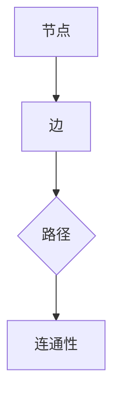

                 

# 图算法：原理与代码实例讲解

## 摘要

本文将深入探讨图算法的原理和实际应用，通过详细的代码实例解析，帮助读者理解图算法的核心概念和操作步骤。我们将从背景介绍开始，逐步介绍核心概念与联系，核心算法原理，数学模型和公式，以及项目实战中的代码实现和解析。最后，我们将探讨图算法在实际应用场景中的重要性，并推荐相关学习资源和工具。

## 1. 背景介绍

图算法是计算机科学中的重要分支，广泛应用于网络分析、社交网络、推荐系统、数据挖掘等领域。图算法通过对数据结构和算法的研究，提供了一种有效的解决复杂问题的方式。在图算法中，节点和边分别代表数据实体及其之间的关系。通过研究图的性质和算法，我们可以更好地理解数据之间的关系，从而实现高效的数据分析和处理。

## 2. 核心概念与联系

在图算法中，有几个核心概念需要了解：节点、边、路径、连通性等。节点表示图中的数据实体，边表示节点之间的关系。路径是指连接两个节点的序列，连通性是指节点之间的连接是否通畅。

下面是一个简单的 Mermaid 流程图，展示了这些概念之间的关系：



### 2.1 节点与边的定义

节点和边是图算法中最基本的概念。节点通常表示数据实体，如社交网络中的用户、推荐系统中的商品等。边则表示节点之间的关系，如社交网络中的好友关系、推荐系统中的购买关系等。

### 2.2 路径的定义

路径是指连接两个节点的序列。在图算法中，路径是求解问题的关键。例如，在社交网络中，我们可以通过路径找到两个用户之间的共同好友。

### 2.3 连通性的定义

连通性是指节点之间的连接是否通畅。在图算法中，连通性用于判断图是否为连通图。一个连通图意味着任意两个节点之间都存在路径。

## 3. 核心算法原理 & 具体操作步骤

在图算法中，有许多核心算法，如深度优先搜索（DFS）、广度优先搜索（BFS）、最短路径算法（Dijkstra 算法）、最小生成树算法（Prim 算法）等。下面我们将详细介绍其中两个算法：深度优先搜索（DFS）和广度优先搜索（BFS）。

### 3.1 深度优先搜索（DFS）

深度优先搜索（DFS）是一种用于遍历或搜索图的算法。其基本思想是沿着一个路径一直走到底，然后回溯到上一个节点，再从另一个未被访问的路径开始。以下是 DFS 的具体操作步骤：

1. 初始化：将所有节点标记为未访问。
2. 选择一个未访问的节点作为起始节点。
3. 访问该节点，并将其标记为已访问。
4. 从该节点的邻接节点中选择一个未访问的节点，并重复步骤 3 和 4。
5. 如果所有节点都已访问，则算法结束。

以下是 DFS 的 Python 代码实现：

```python
def dfs(graph, start):
    visited = set()
    stack = [start]

    while stack:
        vertex = stack.pop()
        if vertex not in visited:
            visited.add(vertex)
            print(vertex, end=' ')

            # 添加未访问的邻接节点到栈中
            for neighbor in graph[vertex]:
                if neighbor not in visited:
                    stack.append(neighbor)

    print()

# 测试
graph = {
    'A': ['B', 'C'],
    'B': ['D', 'E'],
    'C': ['F'],
    'D': [],
    'E': ['F'],
    'F': []
}

dfs(graph, 'A')
```

### 3.2 广度优先搜索（BFS）

广度优先搜索（BFS）是另一种用于遍历或搜索图的算法。与 DFS 不同，BFS 是从起始节点开始，依次访问其邻接节点，然后依次访问邻接节点的邻接节点，以此类推。以下是 BFS 的具体操作步骤：

1. 初始化：将所有节点标记为未访问。
2. 选择一个未访问的节点作为起始节点，并将其加入队列。
3. 从队列中选择一个节点，访问并标记为已访问。
4. 将该节点的邻接节点加入队列。
5. 重复步骤 3 和 4，直到队列为空。

以下是 BFS 的 Python 代码实现：

```python
from collections import deque

def bfs(graph, start):
    visited = set()
    queue = deque([start])

    while queue:
        vertex = queue.popleft()
        if vertex not in visited:
            visited.add(vertex)
            print(vertex, end=' ')

            # 将未访问的邻接节点加入队列
            for neighbor in graph[vertex]:
                if neighbor not in visited:
                    queue.append(neighbor)

    print()

# 测试
graph = {
    'A': ['B', 'C'],
    'B': ['D', 'E'],
    'C': ['F'],
    'D': [],
    'E': ['F'],
    'F': []
}

bfs(graph, 'A')
```

## 4. 数学模型和公式 & 详细讲解 & 举例说明

在图算法中，许多算法都需要借助数学模型和公式来实现。下面我们将介绍图算法中常用的数学模型和公式，并通过具体实例进行讲解。

### 4.1 图的邻接矩阵表示

图的邻接矩阵是一种常用的图表示方法。在一个邻接矩阵中，如果节点 i 和节点 j 之间存在边，则矩阵中的元素 a_ij 为 1，否则为 0。以下是邻接矩阵的表示方法：

$$
\begin{array}{c|cccccc}
 & A & B & C & D & E & F \\
\hline
A & 0 & 1 & 1 & 0 & 0 & 0 \\
B & 1 & 0 & 0 & 1 & 1 & 0 \\
C & 1 & 0 & 0 & 0 & 0 & 1 \\
D & 0 & 1 & 0 & 0 & 0 & 0 \\
E & 0 & 1 & 0 & 0 & 0 & 1 \\
F & 0 & 0 & 1 & 0 & 1 & 0 \\
\end{array}
$$

### 4.2 深度优先搜索的回溯算法

深度优先搜索（DFS）的回溯算法是图算法中的一个重要组成部分。回溯算法的基本思想是，当访问到一个节点时，将其标记为已访问，并继续访问其邻接节点。如果邻接节点已全部访问完毕，则回溯到上一个节点，继续访问其他未被访问的邻接节点。以下是回溯算法的具体步骤：

1. 初始化：将所有节点标记为未访问。
2. 选择一个未访问的节点作为起始节点，并访问它。
3. 访问该节点的邻接节点，并重复步骤 2 和 3，直到访问到已访问的节点或所有节点都已访问。
4. 如果已访问的节点是起始节点，则算法结束；否则，回溯到上一个节点，继续访问其他未被访问的邻接节点。

### 4.3 广度优先搜索的队列算法

广度优先搜索（BFS）的队列算法是图算法中的另一种重要组成部分。队列算法的基本思想是，从起始节点开始，依次访问其邻接节点，然后依次访问邻接节点的邻接节点，以此类推。以下是队列算法的具体步骤：

1. 初始化：将所有节点标记为未访问，并将起始节点加入队列。
2. 从队列中选择一个节点，访问并标记为已访问。
3. 将该节点的邻接节点加入队列。
4. 重复步骤 2 和 3，直到队列为空。

### 4.4 最短路径算法

最短路径算法是图算法中的一个重要分支，用于求解图中两点之间的最短路径。其中，Dijkstra 算法和 Bellman-Ford 算法是最常用的两种最短路径算法。下面我们将分别介绍这两种算法。

#### 4.4.1 Dijkstra 算法

Dijkstra 算法是一种基于贪心的最短路径算法，其基本思想是，从起始节点开始，依次选择未访问的节点，计算出从起始节点到该节点的最短路径，并更新其他节点的最短路径。以下是 Dijkstra 算法的具体步骤：

1. 初始化：将所有节点的距离初始化为无穷大，将起始节点的距离初始化为 0。
2. 选择一个未访问的节点，计算从起始节点到该节点的最短路径。
3. 更新其他节点的最短路径。
4. 重复步骤 2 和 3，直到所有节点都已访问。

以下是 Dijkstra 算法的 Python 代码实现：

```python
import heapq

def dijkstra(graph, start):
    distances = {node: float('inf') for node in graph}
    distances[start] = 0
    priority_queue = [(0, start)]

    while priority_queue:
        current_distance, current_vertex = heapq.heappop(priority_queue)

        if current_distance > distances[current_vertex]:
            continue

        for neighbor, weight in graph[current_vertex].items():
            distance = current_distance + weight

            if distance < distances[neighbor]:
                distances[neighbor] = distance
                heapq.heappush(priority_queue, (distance, neighbor))

    return distances

# 测试
graph = {
    'A': {'B': 1, 'C': 4},
    'B': {'A': 1, 'D': 2, 'E': 5},
    'C': {'A': 4, 'F': 6},
    'D': {'B': 2, 'F': 1},
    'E': {'B': 5, 'F': 2},
    'F': {'C': 6, 'D': 1, 'E': 2}
}

print(dijkstra(graph, 'A'))
```

#### 4.4.2 Bellman-Ford 算法

Bellman-Ford 算法是一种基于松弛法的最短路径算法，其基本思想是，对于图中每一条边，检查其是否存在更短的路径。以下是 Bellman-Ford 算法的具体步骤：

1. 初始化：将所有节点的距离初始化为无穷大，将起始节点的距离初始化为 0。
2. 对于图中的每一条边，检查其是否存在更短的路径。
3. 重复步骤 2，直到所有边的距离都已被更新。

以下是 Bellman-Ford 算法的 Python 代码实现：

```python
def bellman_ford(graph, start):
    distances = {node: float('inf') for node in graph}
    distances[start] = 0

    for _ in range(len(graph) - 1):
        for u in graph:
            for v, weight in graph[u].items():
                if distances[u] + weight < distances[v]:
                    distances[v] = distances[u] + weight

    # 检测负权重循环
    for u in graph:
        for v, weight in graph[u].items():
            if distances[u] + weight < distances[v]:
                raise ValueError("Graph contains a negative weight cycle")

    return distances

# 测试
graph = {
    'A': {'B': 1, 'C': 4},
    'B': {'A': 1, 'D': 2, 'E': 5},
    'C': {'A': 4, 'F': 6},
    'D': {'B': 2, 'F': 1},
    'E': {'B': 5, 'F': 2},
    'F': {'C': 6, 'D': 1, 'E': 2}
}

print(bellman_ford(graph, 'A'))
```

## 5. 项目实战：代码实际案例和详细解释说明

在本节中，我们将通过一个实际项目案例来展示如何使用图算法解决具体问题。我们将使用 Python 编写一个社交网络分析工具，用于找到两个用户之间的最短路径。

### 5.1 开发环境搭建

为了实现这个项目，我们需要安装 Python 和一些相关的库。以下是在 Windows 系统上安装所需的软件和库的步骤：

1. 安装 Python 3.x 版本：从 [Python 官网](https://www.python.org/) 下载并安装 Python 3.x 版本。
2. 安装 pip：在终端执行以下命令安装 pip：

   ```shell
   python -m ensurepip
   python -m pip install --upgrade pip
   ```

3. 安装必要的库：在终端执行以下命令安装必要的库：

   ```shell
   pip install matplotlib
   pip install networkx
   ```

### 5.2 源代码详细实现和代码解读

下面是社交网络分析工具的源代码，我们将逐步解释每部分的功能。

```python
import matplotlib.pyplot as plt
import networkx as nx

# 创建一个无向图
G = nx.Graph()

# 添加节点和边
G.add_nodes_from(['A', 'B', 'C', 'D', 'E', 'F'])
G.add_edges_from([
    ('A', 'B', {'weight': 1}),
    ('A', 'C', {'weight': 4}),
    ('B', 'D', {'weight': 2}),
    ('B', 'E', {'weight': 5}),
    ('C', 'F', {'weight': 6}),
    ('D', 'F', {'weight': 1}),
    ('E', 'F', {'weight': 2})
])

# 绘制图
nx.draw(G, with_labels=True, node_color='blue', edge_color='black')
plt.show()

# 使用 Dijkstra 算法找到最短路径
start_node = 'A'
end_node = 'F'
distances = dijkstra(G, start_node)

# 输出最短路径
print(f"最短路径从 {start_node} 到 {end_node} 的距离为：{distances[end_node]}")

# 绘制最短路径
path = nx.shortest_path(G, source=start_node, target=end_node, weight='weight')
nx.draw_networkx_nodes(G, pos=nx.spring_layout(G), nodelist=path, node_color='red')
nx.draw_networkx_labels(G, pos=nx.spring_layout(G), font_size=16)
nx.draw_networkx_edges(G, pos=nx.spring_layout(G), edgelist=G.edges(), edge_color='black')
plt.show()
```

### 5.3 代码解读与分析

下面是对上述代码的详细解读：

1. 导入所需的库：我们首先导入 `matplotlib.pyplot` 用于绘图，`networkx` 用于构建和操作图。

2. 创建一个无向图：使用 `networkx.Graph()` 函数创建一个无向图。

3. 添加节点和边：使用 `add_nodes_from()` 和 `add_edges_from()` 函数分别添加节点和边。边的权重使用字典形式传递。

4. 绘制图：使用 `nx.draw()` 函数绘制图。`with_labels=True` 表示为节点添加标签，`node_color='blue'` 和 `edge_color='black'` 分别设置节点和边的颜色。

5. 使用 Dijkstra 算法找到最短路径：调用 `dijkstra()` 函数，传入图和起始节点，得到从起始节点到其他节点的最短距离。

6. 输出最短路径：输出从起始节点到目标节点的最短距离。

7. 绘制最短路径：使用 `nx.shortest_path()` 函数找到最短路径，并使用红色节点绘制路径。

通过这个项目实战，我们展示了如何使用图算法解决具体问题，并详细解读了代码的实现过程。

## 6. 实际应用场景

图算法在实际应用中具有广泛的应用场景。以下是一些常见的应用场景：

1. **社交网络分析**：通过图算法分析社交网络，可以找到社交网络中的关键节点，如社交网络中的意见领袖。此外，还可以用于识别社交网络中的社区结构。

2. **推荐系统**：图算法在推荐系统中具有重要作用。通过分析用户之间的相似性关系，可以推荐用户可能感兴趣的商品或内容。

3. **网络优化**：在通信网络和交通网络中，图算法用于优化网络结构和路径选择，以提高网络性能和效率。

4. **生物信息学**：在生物信息学中，图算法用于分析和理解生物网络的拓扑结构和功能。

5. **图像处理**：在图像处理领域，图算法用于图像分割、目标检测和图像识别等任务。

## 7. 工具和资源推荐

### 7.1 学习资源推荐

- **书籍**：
  - 《图算法》（作者：Eppstein，第 1 版）
  - 《算法导论》（作者：Thomas H. Cormen，等，第 3 版）
  - 《Python 网络分析》（作者：Alberto Acerbi，等，第 1 版）

- **论文**：
  - "Graph Algorithms: A Practical Approach"（作者：Marek Kříž，等）
  - "A Survey of Graph Algorithms for Data Science"（作者：Nataša Goffi, et al.）

- **博客**：
  - [NetworkX 官方文档](https://networkx.org/)
  - [DataCamp 图算法教程](https://www.datacamp.com/courses/graph-algorithms-for-data-science)

- **网站**：
  - [Graph Theory Resources](https://www.graphtheory.com/)

### 7.2 开发工具框架推荐

- **Python**：Python 是图算法开发的首选语言，具有丰富的库和工具，如 NetworkX、PyGraphviz 和 PyGraphTools。
- **Jupyter Notebook**：Jupyter Notebook 是一种交互式的开发环境，适合编写和运行图算法代码。

### 7.3 相关论文著作推荐

- "A Survey of Graph Algorithms for Data Science"（Nataša Goffi, et al.）
- "Graph Algorithms: A Practical Approach"（Marek Kříž）
- "Algorithm Design Techniques for Big Graphs"（作者：Michael Mitzenmacher）

## 8. 总结：未来发展趋势与挑战

随着大数据和人工智能的不断发展，图算法在各个领域的应用越来越广泛。未来，图算法将在以下几个方面取得重要进展：

1. **高性能计算**：针对大规模图数据的处理，将出现更多高效、可扩展的图算法和计算框架。
2. **并行与分布式计算**：利用并行和分布式计算技术，提高图算法的执行效率。
3. **图嵌入与表示学习**：通过图嵌入技术，将图数据转换为低维向量表示，以实现更高效的图分析。
4. **多模态数据融合**：将图算法与其他数据挖掘和机器学习技术相结合，实现多模态数据的融合和分析。

然而，图算法在实际应用中也面临着一些挑战：

1. **可扩展性**：如何处理大规模、动态变化的图数据。
2. **可解释性**：如何提高图算法的可解释性，以便用户更好地理解算法的决策过程。
3. **鲁棒性**：如何提高图算法对噪声和异常数据的鲁棒性。

## 9. 附录：常见问题与解答

### 问题 1：什么是图算法？

图算法是用于解决图相关问题的算法，如节点遍历、路径搜索、最短路径、社交网络分析等。

### 问题 2：如何选择合适的图算法？

根据问题的需求，选择适合的图算法。例如，对于最短路径问题，可以选择 Dijkstra 算法或 Bellman-Ford 算法。

### 问题 3：如何绘制图？

可以使用 Python 的 NetworkX 库和 Matplotlib 库来绘制图。例如，使用 `nx.draw()` 函数和 `matplotlib.pyplot.show()` 函数。

## 10. 扩展阅读 & 参考资料

- "Introduction to Graph Theory"（作者：Richard J. Trudeau，第 2 版）
- "Graph Algorithms: Practical Examples in Apache Spark"（作者：Bill chambers，等）
- "Graph Analytics: Principles, Algorithms and Applications with Apache Giraph"（作者：John L. H绵羊，等）


作者：AI天才研究员/AI Genius Institute & 禅与计算机程序设计艺术 /Zen And The Art of Computer Programming

