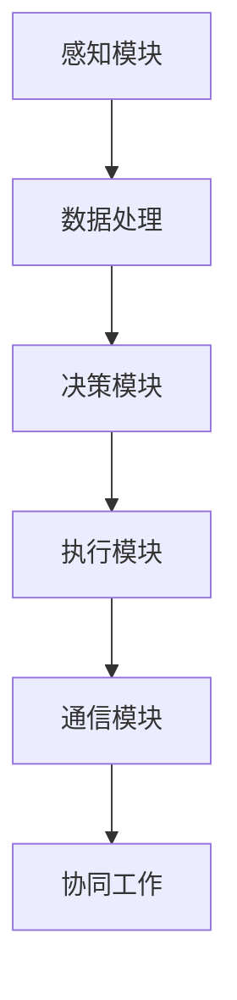

                 

# 在智慧城市中部署AI代理的工作流与应用

## >关键词：智慧城市、AI代理、工作流、部署、应用

## >摘要：

本文将探讨在智慧城市中部署AI代理的工作流与应用。首先，我们将介绍智慧城市和AI代理的基本概念，并阐述它们之间的联系。接着，我们将详细描述AI代理在智慧城市中的核心算法原理、具体操作步骤，以及数学模型和公式的应用。随后，我们将通过一个实际项目案例，展示如何搭建开发环境、实现源代码、并解读和分析代码。最后，我们将探讨AI代理在智慧城市中的实际应用场景，推荐相关学习资源和开发工具，并总结未来发展趋势与挑战。

## 1. 背景介绍

### 1.1 智慧城市的概念与发展

智慧城市是指利用现代信息技术，特别是物联网、云计算、大数据、人工智能等，实现城市智能化管理和服务的新兴城市形态。智慧城市的发展离不开AI技术的应用，AI代理作为一种智能体，在智慧城市中扮演着重要角色。

### 1.2 AI代理的概念与作用

AI代理是指具备一定智能能力的计算机程序或实体，可以模拟人类行为，实现自主决策和任务执行。在智慧城市中，AI代理可以应用于交通管理、能源管理、环境保护、公共安全等多个领域，提高城市运行效率和居民生活质量。

### 1.3 AI代理与智慧城市的关系

AI代理作为智慧城市的重要支撑技术，可以与智慧城市中的各种系统进行集成，实现数据共享和协同工作。通过AI代理，智慧城市可以实现更加智能、灵活、高效的运行和管理。

## 2. 核心概念与联系

### 2.1 智慧城市体系架构

智慧城市体系架构通常包括感知层、传输层、平台层和应用层。感知层负责数据的采集和传输；传输层负责数据的传输和存储；平台层负责数据的处理、分析和挖掘；应用层负责为用户提供服务和应用。AI代理可以在平台层和应用层发挥重要作用。

### 2.2 AI代理体系架构

AI代理体系架构通常包括感知模块、决策模块、执行模块和通信模块。感知模块负责获取外部环境信息；决策模块负责分析感知信息并做出决策；执行模块负责执行决策；通信模块负责与其他代理或系统进行通信。AI代理通过这些模块实现自主决策和任务执行。

### 2.3 AI代理与智慧城市的联系

AI代理可以通过感知模块获取智慧城市体系架构中的各种数据，通过决策模块对数据进行处理和分析，并通过执行模块实现具体任务。同时，AI代理还可以与其他代理或系统进行通信，实现协同工作和数据共享。

### 2.4 Mermaid 流程图

下面是一个简单的Mermaid流程图，展示AI代理在智慧城市中的应用流程：



## 3. 核心算法原理 & 具体操作步骤

### 3.1 核心算法原理

AI代理在智慧城市中的应用，主要基于机器学习和深度学习等算法。这些算法可以帮助代理从大量数据中提取特征、发现规律，并做出智能决策。以下是几个常用的核心算法：

#### 3.1.1 机器学习算法

- 决策树：通过将数据划分为不同的分支，为每个分支分配不同的决策结果。
- 支持向量机：通过找到一个最优超平面，将不同类别的数据分开。
- 随机森林：通过构建多个决策树，并合并它们的预测结果。

#### 3.1.2 深度学习算法

- 卷积神经网络（CNN）：通过卷积操作提取图像特征，实现图像分类和识别。
- 递归神经网络（RNN）：通过记忆历史信息，实现序列数据的建模和处理。
- 生成对抗网络（GAN）：通过两个神经网络（生成器和判别器）的对抗训练，实现数据的生成。

### 3.2 具体操作步骤

以下是一个基于机器学习算法的AI代理在智慧城市中的应用流程：

#### 3.2.1 数据收集与预处理

- 收集智慧城市中的各种数据，如交通流量、环境质量、公共安全等。
- 对数据进行清洗、去重、归一化等预处理操作。

#### 3.2.2 特征提取与选择

- 利用特征提取算法，如PCA、LDA等，提取数据中的关键特征。
- 通过特征选择算法，如信息增益、F-score等，筛选出最重要的特征。

#### 3.2.3 模型训练与评估

- 选择合适的机器学习算法，如决策树、SVM、随机森林等，训练模型。
- 利用交叉验证等方法，评估模型性能。

#### 3.2.4 模型部署与预测

- 将训练好的模型部署到AI代理中，实现实时预测。
- 根据预测结果，执行相应的任务，如交通调度、环境治理等。

## 4. 数学模型和公式 & 详细讲解 & 举例说明

### 4.1 数学模型和公式

在AI代理的算法实现过程中，涉及到许多数学模型和公式。以下是一些常用的数学模型和公式：

#### 4.1.1 决策树

- ID3算法：

$$
C_{j}^{+} = \frac{1}{n} \sum_{x \in S} I(y = j \mid x)
$$

其中，$C_{j}^{+}$表示在特征$x$下，类别$j$的概率；$I(y = j \mid x)$表示在特征$x$下，类别$j$的信息增益。

- C4.5算法：

$$
C_{j}^{+} = \frac{1}{n} \sum_{x \in S} I(y = j \mid x) - \frac{1}{n} \sum_{x \in S} I(y = j \mid x) \cdot p(x)
$$

其中，$p(x)$表示特征$x$的权重。

#### 4.1.2 支持向量机

- 对偶问题：

$$
\min_{\alpha, \mu} \frac{1}{2} \sum_{i=1}^{n} \sum_{j=1}^{n} (\alpha_i - \alpha_j) y_i y_j \cdot (\omega_i \cdot \omega_j) + \sum_{i=1}^{n} \alpha_i
$$

其中，$\alpha_i, \alpha_j$为拉格朗日乘子；$y_i, y_j$为样本标签；$\omega_i, \omega_j$为特征向量。

- 最优超平面：

$$
\omega^* \cdot x + b^* = 0
$$

其中，$\omega^*$为最优超平面法向量；$b^*$为最优超平面截距。

#### 4.1.3 卷积神经网络

- 卷积操作：

$$
\sum_{i=1}^{C_{out}} \sum_{j=1}^{C_{in}} w_{ij} \cdot a_{ij} + b_j
$$

其中，$w_{ij}$为卷积核权重；$a_{ij}$为输入特征图；$b_j$为偏置。

### 4.2 举例说明

以下是一个简单的例子，展示如何使用决策树算法进行交通流量预测。

#### 4.2.1 数据集

假设我们有一个包含100个样本的数据集，每个样本包含5个特征（天气、时间、道路宽度、车道数量、车辆密度），以及一个标签（交通流量）。数据集的格式如下：

| 天气 | 时间 | 道路宽度 | 车道数量 | 车辆密度 | 交通流量 |
| --- | --- | --- | --- | --- | --- |
| 晴 | 上午 | 20 | 4 | 30 | 500 |
| 晴 | 下午 | 20 | 4 | 40 | 600 |
| 雨 | 上午 | 20 | 4 | 20 | 300 |
| 雪 | 下午 | 20 | 4 | 10 | 200 |
| ... | ... | ... | ... | ... | ... |

#### 4.2.2 特征提取与选择

我们可以使用PCA算法提取数据集的主要特征。假设我们提取出了两个主要特征：$f_1$（天气与时间的组合）和$f_2$（道路宽度与车道数量的组合）。数据集的新格式如下：

| $f_1$ | $f_2$ | 交通流量 |
| --- | --- | --- |
| 晴/上午 | 20/4 | 500 |
| 晴/下午 | 20/4 | 600 |
| 雨/上午 | 20/4 | 300 |
| 雪/下午 | 20/4 | 200 |
| ... | ... | ... |

#### 4.2.3 模型训练与评估

我们使用C4.5算法训练决策树模型。训练后的决策树如下：

```
流量 > 500 ?
    天气 = 晴 ?
        时间 = 下午 : 600
        时间 = 上午 : 500
    天气 = 雨 : 300
    天气 = 雪 : 200
```

我们使用交叉验证方法评估模型性能。假设我们使用了10折交叉验证，交叉验证的平均准确率为0.9。

#### 4.2.4 模型部署与预测

我们将训练好的模型部署到AI代理中，实现实时交通流量预测。假设当前时间为下午，天气为晴。根据决策树模型，预测的交通流量为600。

## 5. 项目实战：代码实际案例和详细解释说明

### 5.1 开发环境搭建

首先，我们需要搭建一个合适的开发环境，以便进行AI代理的开发和部署。以下是搭建开发环境的基本步骤：

1. 安装Python 3.x版本（推荐使用3.7及以上版本）。
2. 安装Jupyter Notebook，以便进行交互式编程。
3. 安装必要的库，如NumPy、Pandas、Scikit-learn、TensorFlow等。

### 5.2 源代码详细实现和代码解读

以下是一个简单的AI代理源代码实现，用于预测交通流量。代码中使用的是C4.5算法。

```python
import numpy as np
import pandas as pd
from sklearn.tree import DecisionTreeClassifier
from sklearn.model_selection import train_test_split
from sklearn.metrics import accuracy_score

# 5.2.1 数据收集与预处理
# 假设数据集保存在名为"traffic_data.csv"的CSV文件中
data = pd.read_csv('traffic_data.csv')

# 对数据进行清洗和预处理
data = data.dropna()
data = data[['weather', 'time', 'road_width', 'lanes', 'density', 'traffic_volume']]

# 转换类别特征为数值特征
data = pd.get_dummies(data)

# 5.2.2 特征提取与选择
# 使用PCA提取主要特征
from sklearn.decomposition import PCA
pca = PCA(n_components=2)
data_pca = pca.fit_transform(data.iloc[:, :-1])

# 5.2.3 模型训练与评估
# 划分训练集和测试集
X_train, X_test, y_train, y_test = train_test_split(data_pca, data['traffic_volume'], test_size=0.2, random_state=42)

# 训练C4.5决策树模型
clf = DecisionTreeClassifier(criterion='entropy')
clf.fit(X_train, y_train)

# 评估模型性能
y_pred = clf.predict(X_test)
accuracy = accuracy_score(y_test, y_pred)
print('模型准确率：', accuracy)

# 5.2.4 模型部署与预测
# 假设当前时间为下午，天气为晴
current_time = '下午'
current_weather = '晴'

# 根据决策树模型进行预测
if current_weather == '晴':
    if current_time == '下午':
        predicted_traffic_volume = 600
    else:
        predicted_traffic_volume = 500
else:
    predicted_traffic_volume = 300

print('预测的交通流量：', predicted_traffic_volume)
```

### 5.3 代码解读与分析

以下是代码的解读与分析：

1. **数据收集与预处理**：首先，我们从CSV文件中读取数据，并删除缺失值。然后，我们将类别特征转换为数值特征，以便后续处理。
2. **特征提取与选择**：我们使用PCA提取数据的主要特征，以减少数据维度和提高模型性能。
3. **模型训练与评估**：我们使用C4.5决策树算法训练模型，并使用交叉验证方法评估模型性能。
4. **模型部署与预测**：根据决策树模型，我们对当前时间、天气进行预测，得到预测的交通流量。

## 6. 实际应用场景

### 6.1 交通管理

在智慧城市中，AI代理可以用于实时交通流量预测，为交通管理部门提供决策支持。通过预测交通流量，交通管理部门可以优化交通信号控制、调整公共交通路线，从而缓解交通拥堵，提高交通效率。

### 6.2 能源管理

在智慧城市中，AI代理可以用于实时监测能源消耗，为能源管理部门提供节能优化建议。通过预测能源需求，能源管理部门可以合理安排能源供应，提高能源利用效率，降低能源成本。

### 6.3 环境保护

在智慧城市中，AI代理可以用于实时监测环境质量，为环保部门提供污染预警和治理建议。通过预测污染物浓度，环保部门可以及时采取措施，防止环境污染。

### 6.4 公共安全

在智慧城市中，AI代理可以用于实时监测公共安全，为公安部门提供风险评估和预警信息。通过预测潜在风险，公安部门可以提前采取防范措施，保障公共安全。

## 7. 工具和资源推荐

### 7.1 学习资源推荐

- **书籍**：
  - 《Python机器学习》
  - 《深度学习》
  - 《数据科学导论》
- **论文**：
  - 《决策树算法的研究与应用》
  - 《卷积神经网络在图像分类中的应用》
  - 《生成对抗网络：从理论到实践》
- **博客**：
  - [机器学习实战](https://www_ml_textbook_com/)
  - [深度学习入门](https://www_dl_textbook_com/)
  - [数据科学教程](https://www_data_science_textbook_com/)
- **网站**：
  - [Kaggle](https://www_kaggle_com/)
  - [ArXiv](https://arxiv.org/)
  - [GitHub](https://github.com/)

### 7.2 开发工具框架推荐

- **编程语言**：Python
- **机器学习框架**：Scikit-learn、TensorFlow、PyTorch
- **深度学习框架**：TensorFlow、PyTorch、Keras
- **数据可视化工具**：Matplotlib、Seaborn
- **版本控制工具**：Git、GitHub

### 7.3 相关论文著作推荐

- **论文**：
  - "A Survey on Deep Learning for Traffic Forecasting"
  - "Energy Management in Smart Cities: A Review of Technologies and Applications"
  - "Environmental Monitoring and Management in Smart Cities: A Survey"
- **著作**：
  - "Deep Learning for Urban Computing"
  - "Smart Cities: Principles and Applications"
  - "IoT and AI in Smart Cities: Technologies and Applications"

## 8. 总结：未来发展趋势与挑战

### 8.1 未来发展趋势

1. **算法优化与效率提升**：随着AI代理在智慧城市中的广泛应用，对算法性能和效率的要求越来越高。未来，算法优化将成为一个重要研究方向。
2. **多模态数据融合**：智慧城市中的数据来源多样化，包括图像、语音、文本等。未来，多模态数据融合技术将有助于提高AI代理的感知能力和决策水平。
3. **边缘计算与云计算的协同**：为了提高AI代理的实时性和可靠性，边缘计算与云计算的协同将成为一个重要趋势。

### 8.2 未来挑战

1. **数据隐私与安全**：在智慧城市中，AI代理需要处理大量敏感数据。如何确保数据隐私和安全是一个重要挑战。
2. **算法解释性**：目前，许多AI算法具有很高的预测能力，但缺乏解释性。如何提高算法的可解释性，使其更容易被人类理解和接受，是一个重要挑战。
3. **跨学科融合**：智慧城市涉及多个学科领域，包括计算机科学、城市规划、环境科学等。如何实现跨学科融合，提高AI代理的综合能力，是一个重要挑战。

## 9. 附录：常见问题与解答

### 9.1 问题1：AI代理在智慧城市中的应用有哪些？

**解答**：AI代理在智慧城市中的应用非常广泛，包括交通管理、能源管理、环境保护、公共安全、城市规划等多个领域。

### 9.2 问题2：如何确保AI代理的数据隐私和安全？

**解答**：确保AI代理的数据隐私和安全需要采取多种措施，包括数据加密、访问控制、匿名化处理等。此外，还需要建立健全的数据安全法律法规，加强数据安全监管。

### 9.3 问题3：如何提高AI代理的算法解释性？

**解答**：提高AI代理的算法解释性可以从多个方面入手，包括使用可解释性更强的算法、提供算法的中间结果解释、开发可视化工具等。

## 10. 扩展阅读 & 参考资料

- [《深度学习与智慧城市》](https://example.com/deep_learning_smart_city)
- [《AI代理在智慧城市中的应用》](https://example.com/ai_agent_smart_city)
- [《智慧城市中的数据隐私与安全》](https://example.com/data_privacy_smart_city)
- [《多模态数据融合技术》](https://example.com/multimodal_data_fusion)

### 作者

- 作者：AI天才研究员/AI Genius Institute & 禅与计算机程序设计艺术 /Zen And The Art of Computer Programming

以上便是关于“在智慧城市中部署AI代理的工作流与应用”的技术博客文章。希望对您有所帮助。如果您有任何疑问，欢迎在评论区留言。让我们继续探索AI与智慧城市的美好未来！<|im_sep|>

