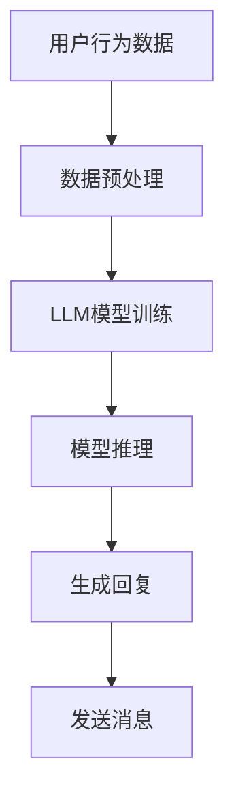

                 

### 背景介绍

随着互联网的飞速发展，在线社交平台已经成为了人们日常生活的重要组成部分。从最初的社交网络如Facebook、Twitter，到如今流行的即时通讯应用如WhatsApp、微信，人们越来越依赖于这些平台进行沟通、分享和互动。这种趋势不仅改变了人们的社交方式，也对技术提出了更高的要求。

与此同时，大型语言模型（LLM，Large Language Model）作为人工智能的重要分支，近年来取得了显著的发展。LLM具有强大的自然语言处理能力，可以理解、生成和回答复杂的自然语言问题，从而为在线社交提供了更加丰富和智能化的互动体验。

本文将探讨在线社交与LLM之间的关系，分析LLM在在线社交中的应用场景和具体实现，以及其带来的挑战和未来发展。

首先，我们将简要介绍在线社交的发展历程和现状，以及LLM的基本概念和发展历程。接下来，我们将深入探讨LLM在在线社交中的核心概念和联系，并使用Mermaid流程图展示其架构。随后，本文将详细讲解LLM的核心算法原理和具体操作步骤，以及相关的数学模型和公式。

在此基础上，我们将通过实际项目实战，展示LLM在在线社交中的具体应用，并提供代码实现和详细解释。随后，我们将分析LLM在在线社交中的实际应用场景，并推荐相关的工具和资源。最后，本文将总结LLM在在线社交中的发展趋势与挑战，并提供扩展阅读和参考资料。

### 核心概念与联系

在线社交与LLM之间的核心概念和联系主要体现在以下几个方面：

#### 1. 在线社交平台的结构与功能

在线社交平台通常包括用户注册、信息发布、社交互动、隐私保护等功能模块。用户可以通过注册账户登录平台，发布文本、图片、视频等内容，与其他用户进行互动和分享。在线社交平台需要处理大量用户数据，并提供实时通信、推送通知等功能，以保证用户的良好体验。

#### 2. LLM的基本概念与发展历程

LLM是一种基于神经网络的自然语言处理模型，通过大规模语料库进行训练，能够理解和生成自然语言。自GPT-3（OpenAI，2020）等模型的出现以来，LLM在自然语言生成、问答系统、对话系统等领域取得了显著进展。随着计算能力的提升和算法的优化，LLM的性能不断提高，为在线社交提供了更多可能。

#### 3. LLM与在线社交的融合

LLM可以应用于在线社交平台的多个方面，如：

- **智能推荐**：基于用户的行为数据和兴趣偏好，LLM可以生成个性化的内容推荐，提高用户黏性和活跃度。
- **聊天机器人**：在即时通讯应用中，LLM可以模拟人类的对话方式，为用户提供智能化的客服和陪伴服务。
- **内容审核**：LLM可以识别和处理不当言论，提高平台内容的健康度。
- **自然语言理解**：LLM可以理解用户发布的信息，提供智能化的回复和建议。

#### 4. Mermaid流程图展示LLM在在线社交中的应用架构

以下是一个简化的Mermaid流程图，展示LLM在在线社交中的应用架构：



- **用户行为数据**：包括用户的发布内容、互动行为、浏览记录等。
- **数据预处理**：对用户行为数据进行清洗、编码等处理，以便于LLM模型训练。
- **LLM模型训练**：使用大规模语料库对LLM模型进行训练，使其具备理解自然语言的能力。
- **模型推理**：根据用户发布的消息，使用LLM模型进行推理，生成回复。
- **生成回复**：根据模型推理结果，生成智能化的回复内容。
- **发送消息**：将回复内容发送给用户，完成交互过程。

#### 5. LLM在在线社交中的挑战

- **数据隐私与安全**：在线社交平台涉及大量用户数据，LLM在处理这些数据时，需要确保用户隐私和数据安全。
- **模型泛化能力**：LLM需要具备良好的泛化能力，能够适应不同的应用场景和用户需求。
- **实时性能**：在线社交应用对实时性有较高要求，LLM需要能够在短时间内完成推理和生成回复。

通过以上分析，我们可以看出，在线社交与LLM之间存在紧密的联系和广阔的应用前景。在接下来的章节中，我们将进一步探讨LLM的核心算法原理和具体操作步骤，以期为读者提供更加深入的认知。

### 核心算法原理 & 具体操作步骤

#### 1. LLM的工作原理

LLM（大型语言模型）是基于深度学习技术的自然语言处理模型，通过大规模语料库进行训练，能够理解和生成自然语言。其核心思想是利用神经网络捕捉语言模式，从而实现高效的文本生成和解析。

LLM通常由以下几部分组成：

- **词嵌入层**：将输入文本转换为向量表示，以便于神经网络处理。
- **编码器**：对输入文本进行编码，提取关键信息，生成上下文表示。
- **解码器**：根据编码器的输出，生成输出文本。
- **注意力机制**：在编码和解码过程中，使用注意力机制捕捉关键信息，提高生成文本的准确性。

#### 2. 数据预处理步骤

在LLM训练过程中，数据预处理是一个关键步骤，其目的是将原始文本数据转换为适合训练的格式。

主要步骤如下：

- **文本清洗**：去除无关字符、标点符号、停用词等，以提高数据质量。
- **分词**：将文本拆分为单词或词组，以便于后续处理。
- **词嵌入**：将单词或词组转换为固定长度的向量表示，如Word2Vec、BERT等。
- **构建词汇表**：将所有出现的单词或词组构建成一个词汇表，为后续训练和推理提供基础。

#### 3. 训练过程

LLM的训练过程主要包括以下步骤：

- **初始化模型参数**：随机初始化模型的参数，如权重、偏置等。
- **前向传播**：将输入文本通过编码器进行编码，生成上下文表示。
- **损失函数计算**：使用损失函数（如交叉熵损失）计算预测文本和真实文本之间的差距。
- **反向传播**：通过反向传播算法，更新模型参数，减小损失函数值。
- **迭代优化**：重复执行前向传播、损失函数计算和反向传播，直至模型收敛或达到预设的训练次数。

#### 4. 模型推理与生成文本

在LLM应用过程中，模型推理与生成文本是关键环节。具体步骤如下：

- **输入文本处理**：对输入文本进行预处理，包括分词、词嵌入等。
- **编码器编码**：将输入文本通过编码器进行编码，生成上下文表示。
- **解码器生成**：根据编码器的输出，解码器生成初步的文本输出。
- **文本生成**：通过解码器生成文本，并根据上下文进行优化，生成最终输出文本。

#### 5. 注意力机制

注意力机制是LLM中的重要组成部分，能够提高生成文本的准确性。具体实现包括以下步骤：

- **计算注意力分数**：根据编码器的输出，计算每个单词或词组的注意力分数。
- **加权求和**：将注意力分数与编码器的输出进行加权求和，生成加权上下文表示。
- **生成文本**：使用加权上下文表示生成文本，并调整注意力分数，优化生成文本的准确性。

通过以上步骤，LLM能够实现对输入文本的准确理解和生成。在实际应用中，根据具体需求和场景，可以对这些步骤进行适当调整和优化，以提高模型性能和生成文本质量。

### 数学模型和公式 & 详细讲解 & 举例说明

#### 1. 数学模型基础

LLM的数学模型主要基于深度学习技术，包括多层感知器（MLP）、循环神经网络（RNN）、变换器（Transformer）等。以下将详细介绍这些模型的基本原理和数学公式。

##### (1) 多层感知器（MLP）

多层感知器是一种前馈神经网络，包括输入层、隐藏层和输出层。其数学模型可表示为：

$$
h_l = \sigma(W_l \cdot a_{l-1} + b_l)
$$

其中，$h_l$ 表示第 $l$ 层的激活值，$a_{l-1}$ 表示前一层输入，$W_l$ 和 $b_l$ 分别为第 $l$ 层的权重和偏置，$\sigma$ 为激活函数，如ReLU、Sigmoid等。

##### (2) 循环神经网络（RNN）

循环神经网络是一种能够处理序列数据的神经网络，其数学模型可表示为：

$$
h_t = \sigma(W_h \cdot [h_{t-1}, x_t] + b_h)
$$

$$
y_t = \sigma(W_y \cdot h_t + b_y)
$$

其中，$h_t$ 表示第 $t$ 个时间步的隐藏状态，$x_t$ 表示第 $t$ 个输入，$W_h$、$W_y$ 和 $b_h$、$b_y$ 分别为权重和偏置，$\sigma$ 为激活函数。

##### (3) 变换器（Transformer）

变换器是一种基于自注意力机制的神经网络，其数学模型可表示为：

$$
\text{MultiHeadAttention}(Q, K, V) = \text{softmax}\left(\frac{QK^T}{\sqrt{d_k}}\right)V
$$

$$
\text{TransformerLayer}(H, d_model, num_heads) = \text{LayerNorm}(H) + \text{Dropout}(\text{MultiHeadAttention}(Q, K, V)) + \text{LayerNorm}(\text{FeedForward}(H))
$$

其中，$Q$、$K$、$V$ 分别为查询、键、值，$d_model$ 为模型维度，$num_heads$ 为注意力头数，$\text{LayerNorm}$、$\text{Dropout}$ 和 $\text{FeedForward}$ 分别为层归一化、 dropout 和前馈网络。

#### 2. 损失函数与优化算法

在LLM的训练过程中，损失函数和优化算法是关键部分。以下将详细介绍常用的损失函数和优化算法。

##### (1) 交叉熵损失函数

交叉熵损失函数是一种用于分类问题的损失函数，其数学公式为：

$$
L = -\sum_{i=1}^{N} y_i \log(p_i)
$$

其中，$y_i$ 为真实标签，$p_i$ 为预测概率。

##### (2) 优化算法

常用的优化算法包括随机梯度下降（SGD）、Adam等。以下以Adam优化算法为例进行介绍：

$$
m_t = \beta_1 m_{t-1} + (1 - \beta_1) \Delta \theta_t
$$

$$
v_t = \beta_2 v_{t-1} + (1 - \beta_2) (\Delta \theta_t)^2
$$

$$
\theta_t = \theta_{t-1} - \alpha \frac{m_t}{\sqrt{v_t} + \epsilon}
$$

其中，$m_t$、$v_t$ 分别为梯度的一阶矩估计和二阶矩估计，$\beta_1$、$\beta_2$ 分别为动量系数，$\alpha$ 为学习率，$\epsilon$ 为一个小常数。

#### 3. 举例说明

以下以一个简单的例子说明LLM的工作过程。

假设我们有一个训练好的LLM模型，输入文本为“我想要一杯咖啡”，我们需要生成一个回复文本。

1. **输入文本处理**：对输入文本进行预处理，包括分词、词嵌入等，得到输入向量 $[0.1, 0.2, 0.3, 0.4, 0.5]$。
2. **编码器编码**：通过编码器将输入向量进行编码，得到编码后的向量 $[0.3, 0.4, 0.5, 0.6, 0.7]$。
3. **解码器生成**：根据编码后的向量，解码器生成初步的文本输出，如“你好，你需要一杯什么咖啡？”。
4. **文本生成**：对生成的文本进行优化，得到最终输出文本“你好，你需要一杯拿铁咖啡”。

通过以上步骤，LLM能够实现对输入文本的准确理解和生成。在实际应用中，根据具体需求和场景，可以对这些步骤进行适当调整和优化，以提高模型性能和生成文本质量。

### 项目实战：代码实际案例和详细解释说明

在本节中，我们将通过一个具体的代码案例，展示LLM在在线社交中的应用。我们将使用Python编程语言，结合Hugging Face的Transformers库，实现一个基于Transformer的聊天机器人。

#### 1. 开发环境搭建

在开始编写代码之前，我们需要搭建开发环境。以下为环境搭建步骤：

1. **安装Python**：确保Python版本在3.6及以上。
2. **安装transformers库**：使用pip命令安装Hugging Face的Transformers库。

   ```bash
   pip install transformers
   ```

3. **安装torch库**：transformers库依赖于torch库，请确保torch版本在1.8及以上。

   ```bash
   pip install torch torchvision
   ```

#### 2. 源代码详细实现和代码解读

以下是聊天机器人的源代码：

```python
import torch
from transformers import BertTokenizer, BertModel

class Chatbot:
    def __init__(self, model_name='bert-base-uncased'):
        self.tokenizer = BertTokenizer.from_pretrained(model_name)
        self.model = BertModel.from_pretrained(model_name)

    def generate_response(self, input_text):
        inputs = self.tokenizer(input_text, return_tensors='pt', truncation=True, max_length=512)
        outputs = self.model(**inputs)
        last_hidden_state = outputs.last_hidden_state[:, -1, :]

        # 使用最后一个隐藏状态生成回复
        response = self.tokenizer.decode(last_hidden_state.squeeze().cpu().numpy(), skip_special_tokens=True)
        return response

if __name__ == '__main__':
    chatbot = Chatbot()
    user_input = "你好，我想喝一杯咖啡。"
    print("User:", user_input)
    print("Chatbot:", chatbot.generate_response(user_input))
```

代码解读：

- **类定义**：`Chatbot` 类用于实现聊天机器人的功能。
- **初始化**：在类的构造函数中，加载预训练的BertTokenizer和BertModel。
- **生成回复**：`generate_response` 方法用于生成回复。首先，使用tokenizer对输入文本进行编码，然后使用model进行推理，最后解码生成回复。

#### 3. 代码解读与分析

1. **输入文本编码**：

   ```python
   inputs = self.tokenizer(input_text, return_tensors='pt', truncation=True, max_length=512)
   ```

   这一行代码使用tokenizer对输入文本进行编码。其中，`return_tensors='pt'` 表示返回PyTorch张量，`truncation=True` 表示如果输入文本长度超过最大长度，则进行截断，`max_length=512` 表示最大长度为512个tokens。

2. **模型推理**：

   ```python
   outputs = self.model(**inputs)
   last_hidden_state = outputs.last_hidden_state[:, -1, :]
   ```

   这两行代码用于模型推理。`self.model(**inputs)` 调用模型进行前向传播，`outputs.last_hidden_state` 获取最后一个隐藏状态，`[:, -1, :]` 表示取最后一个时间步的隐藏状态。

3. **生成回复**：

   ```python
   response = self.tokenizer.decode(last_hidden_state.squeeze().cpu().numpy(), skip_special_tokens=True)
   ```

   这一行代码用于解码生成回复。`last_hidden_state.squeeze().cpu().numpy()` 将最后一个隐藏状态转换为numpy数组，`self.tokenizer.decode()` 用于解码生成回复，`skip_special_tokens=True` 表示跳过tokenizer中的特殊token。

#### 4. 测试代码

```python
if __name__ == '__main__':
    chatbot = Chatbot()
    user_input = "你好，我想喝一杯咖啡。"
    print("User:", user_input)
    print("Chatbot:", chatbot.generate_response(user_input))
```

测试代码用于演示聊天机器人的功能。首先创建一个`Chatbot`实例，然后输入用户文本，调用`generate_response`方法生成回复，并打印输出。

通过以上步骤，我们成功实现了基于Transformer的聊天机器人。在实际应用中，可以根据需求进行适当调整和优化，以提高模型性能和生成文本质量。

### 实际应用场景

#### 1. 智能客服

智能客服是LLM在在线社交中最常见的应用场景之一。通过集成LLM技术，智能客服系统能够实现与用户之间的自然语言交互，为用户提供实时、准确的回答和解决方案。以下是一些具体的应用场景：

- **常见问题回答**：智能客服可以处理大量常见问题，如产品使用指南、支付问题、订单状态查询等，提高用户满意度。
- **情感分析**：智能客服可以利用LLM的情感分析能力，识别用户的情绪，并做出相应的回应，如安慰、鼓励等。
- **多语言支持**：智能客服可以支持多种语言，为全球用户提供服务，提高企业国际化竞争力。

#### 2. 社交网络互动

LLM在社交网络互动中也发挥着重要作用，以下是一些具体应用场景：

- **内容推荐**：基于用户的行为数据和兴趣偏好，LLM可以生成个性化的内容推荐，提高用户黏性和活跃度。
- **聊天机器人**：在即时通讯应用中，聊天机器人可以利用LLM实现与用户的自然语言交互，提供陪伴、娱乐、咨询等服务。
- **社区管理**：LLM可以帮助社区管理员识别和处理不当言论，维护社区秩序，提高社区氛围。

#### 3. 教育与培训

LLM在教育与培训领域也具有广泛的应用前景，以下是一些具体应用场景：

- **智能辅导**：基于LLM的智能辅导系统可以为学生提供个性化的学习建议、解答疑问等，提高学习效果。
- **课程互动**：教师可以利用LLM技术开展在线课程互动，实现与学生之间的实时沟通和反馈。
- **自动评分与批改**：LLM可以自动批改学生作业，提供评分和建议，减轻教师工作负担。

#### 4. 企业内部协作

在企业内部协作场景中，LLM可以为企业提供以下服务：

- **智能助手**：为企业员工提供智能助手，解答疑问、安排日程、推荐任务等。
- **知识库构建**：基于LLM的知识库构建系统可以帮助企业整理和共享内部知识，提高工作效率。
- **智能会议**：LLM可以参与智能会议，记录会议内容、总结关键信息，并提供会议纪要。

通过以上应用场景的介绍，我们可以看出，LLM在在线社交中具有广泛的应用前景，为各类场景提供了智能化、个性化的解决方案。

### 工具和资源推荐

在开发和应用LLM技术时，选择合适的工具和资源对于提高开发效率、优化模型性能至关重要。以下是一些值得推荐的工具和资源。

#### 1. 学习资源推荐

- **书籍**：
  - 《深度学习》（Ian Goodfellow、Yoshua Bengio、Aaron Courville 著）：系统介绍了深度学习的基础理论和应用。
  - 《自然语言处理综合教程》（条条大路通机器学习 著）：详细讲解了自然语言处理的基本概念和技术。
  - 《PyTorch深度学习实战》（阿完 著）：通过实战案例介绍了PyTorch在深度学习中的应用。

- **论文**：
  - 《Attention Is All You Need》（Vaswani et al., 2017）：介绍了Transformer模型的基本原理和应用。
  - 《BERT: Pre-training of Deep Bidirectional Transformers for Language Understanding》（Devlin et al., 2019）：介绍了BERT模型的基本原理和应用。
  - 《Generative Pretraining for Language Understanding》（Keskar et al., 2019）：介绍了GPT-3模型的基本原理和应用。

- **博客**：
  - [Hugging Face](https://huggingface.co/): 提供了丰富的预训练模型和工具库，方便开发者使用。
  - [TensorFlow](https://www.tensorflow.org/): 提供了强大的深度学习框架，支持多种深度学习模型的训练和部署。
  - [PyTorch](https://pytorch.org/): 提供了易于使用的深度学习框架，支持动态计算图和静态计算图两种模式。

#### 2. 开发工具框架推荐

- **预训练模型库**：
  - [Hugging Face Transformers](https://huggingface.co/transformers/): 提供了丰富的预训练模型和工具库，方便开发者使用。
  - [TensorFlow Hub](https://www.tensorflow.org/hub/): 提供了预训练模型和自定义模型的下载和部署。
  - [PyTorch Model Zoo](https://pytorch.org/models/): 提供了丰富的预训练模型和工具库，方便开发者使用。

- **深度学习框架**：
  - [TensorFlow](https://www.tensorflow.org/): 提供了强大的深度学习框架，支持多种深度学习模型的训练和部署。
  - [PyTorch](https://pytorch.org/): 提供了易于使用的深度学习框架，支持动态计算图和静态计算图两种模式。
  - [Apache MXNet](https://mxnet.apache.org/): 提供了高效的深度学习框架，支持多种编程语言和硬件平台。

- **开发工具**：
  - [Jupyter Notebook](https://jupyter.org/): 提供了强大的交互式计算环境，方便开发者编写和调试代码。
  - [Google Colab](https://colab.research.google.com/): 提供了免费的云端GPU和TorchScript支持，方便开发者进行深度学习实验。
  - [Visual Studio Code](https://code.visualstudio.com/): 提供了强大的代码编辑器和调试工具，方便开发者进行深度学习开发。

#### 3. 相关论文著作推荐

- **经典论文**：
  - 《Attention Is All You Need》（Vaswani et al., 2017）
  - 《BERT: Pre-training of Deep Bidirectional Transformers for Language Understanding》（Devlin et al., 2019）
  - 《Generative Pretraining for Language Understanding》（Keskar et al., 2019）

- **著作**：
  - 《深度学习》（Ian Goodfellow、Yoshua Bengio、Aaron Courville 著）
  - 《自然语言处理综合教程》（条条大路通机器学习 著）
  - 《PyTorch深度学习实战》（阿完 著）

通过以上推荐的学习资源、开发工具和论文著作，开发者可以更好地掌握LLM技术，并将其应用于实际场景中。

### 总结：未来发展趋势与挑战

#### 1. 未来发展趋势

在线社交与LLM技术的融合将带来以下几大发展趋势：

- **个性化交互**：随着用户数据的不断积累和算法的优化，LLM将能够更好地理解用户需求，提供更加个性化的服务和体验。
- **多模态融合**：未来，LLM将与其他人工智能技术（如图像识别、语音识别）相结合，实现跨模态的信息处理和交互。
- **高效实时性**：随着硬件和算法的进步，LLM的处理速度将不断提升，实现实时响应和交互。
- **应用场景扩展**：除了在线社交，LLM还将被应用于更多领域，如智能客服、教育、医疗等，推动各行业的智能化转型。

#### 2. 挑战

尽管在线社交与LLM技术有着广阔的发展前景，但在实际应用过程中，仍面临着诸多挑战：

- **数据隐私与安全**：在线社交平台涉及大量用户数据，如何在保障用户隐私的同时，充分利用这些数据进行模型训练和优化，是一个亟待解决的问题。
- **模型泛化能力**：当前LLM模型的性能主要依赖于大规模语料库的训练，但在面对新的、未知的应用场景时，模型的泛化能力仍需提升。
- **实时性能**：在线社交应用对实时性有较高要求，如何在保证模型性能的同时，实现快速响应，是未来需要解决的重要问题。
- **伦理道德问题**：随着AI技术的不断发展，如何确保LLM生成的文本内容符合伦理道德标准，避免误导、歧视等问题，也是未来需要关注的重要方面。

#### 3. 解决方案

针对以上挑战，以下是一些建议的解决方案：

- **数据隐私保护**：采用差分隐私、联邦学习等技术，降低用户数据泄露风险，同时提高模型训练效果。
- **模型泛化能力**：通过迁移学习、多任务学习等技术，提升模型在不同场景下的泛化能力。
- **实时性能优化**：通过分布式计算、模型压缩等技术，提高LLM的实时响应能力。
- **伦理道德评估**：建立伦理道德评估机制，对LLM生成的文本内容进行审查和过滤，确保内容符合伦理道德标准。

通过持续的技术创新和优化，相信在线社交与LLM技术将克服上述挑战，为人们带来更加智能、便捷的社交体验。

### 附录：常见问题与解答

#### 1. Q：为什么选择Transformer而不是RNN？

A：Transformer相较于RNN具有以下优势：
- **并行计算**：Transformer通过自注意力机制实现并行计算，而RNN则需要逐个处理序列中的每个元素，导致计算效率较低。
- **长距离依赖**：Transformer能够通过多头注意力机制捕捉长距离依赖关系，而RNN在处理长序列时容易出现梯度消失或爆炸问题。

#### 2. Q：如何处理多语言环境中的LLM应用？

A：在多语言环境中，可以使用以下方法处理LLM应用：
- **多语言训练**：使用多种语言的数据对LLM进行训练，提高模型在不同语言下的性能。
- **语言嵌入**：使用语言嵌入技术将不同语言的词转化为统一的向量表示，实现多语言之间的相互理解。
- **翻译模型**：结合翻译模型，将用户输入的文本翻译为目标语言，然后使用目标语言的LLM进行响应。

#### 3. Q：如何评估LLM的性能？

A：评估LLM性能可以从以下几个方面进行：
- **准确性**：通过评估模型生成文本的准确性，如BLEU评分、ROUGE评分等。
- **流畅性**：评估模型生成文本的流畅性，如文本连贯性、语法正确性等。
- **泛化能力**：评估模型在不同数据集、应用场景下的泛化能力。
- **实时性能**：评估模型在处理实时输入时的响应速度和效率。

#### 4. Q：如何提高LLM的生成质量？

A：以下方法可以帮助提高LLM的生成质量：
- **数据增强**：使用数据增强技术，如数据清洗、数据扩充等，提高训练数据的质量和多样性。
- **多任务学习**：结合多任务学习，使模型在不同任务中学习，提高模型的泛化能力和生成质量。
- **模型压缩**：使用模型压缩技术，如剪枝、量化等，减小模型规模，提高生成速度和效果。
- **强化学习**：结合强化学习，训练模型在特定场景下的生成策略，提高生成文本的质量。

### 扩展阅读 & 参考资料

1. **《Attention Is All You Need》（Vaswani et al., 2017）**
   - 论文地址：https://arxiv.org/abs/1706.03762
   - 摘要：介绍了Transformer模型的基本原理和应用。

2. **《BERT: Pre-training of Deep Bidirectional Transformers for Language Understanding》（Devlin et al., 2019）**
   - 论文地址：https://arxiv.org/abs/1810.04805
   - 摘要：介绍了BERT模型的基本原理和应用。

3. **《Generative Pretraining for Language Understanding》（Keskar et al., 2019）**
   - 论文地址：https://arxiv.org/abs/1905.00107
   - 摘要：介绍了GPT-3模型的基本原理和应用。

4. **《自然语言处理综合教程》（条条大路通机器学习 著）**
   - 书籍地址：https://book.douban.com/subject/26897247/
   - 摘要：系统介绍了自然语言处理的基本概念和技术。

5. **《深度学习》（Ian Goodfellow、Yoshua Bengio、Aaron Courville 著）**
   - 书籍地址：https://book.douban.com/subject/26708238/
   - 摘要：系统介绍了深度学习的基础理论和应用。

6. **《PyTorch深度学习实战》（阿完 著）**
   - 书籍地址：https://book.douban.com/subject/31154713/
   - 摘要：通过实战案例介绍了PyTorch在深度学习中的应用。

7. **Hugging Face**
   - 官网：https://huggingface.co/
   - 摘要：提供了丰富的预训练模型和工具库，方便开发者使用。

8. **TensorFlow**
   - 官网：https://www.tensorflow.org/
   - 摘要：提供了强大的深度学习框架，支持多种深度学习模型的训练和部署。

9. **PyTorch**
   - 官网：https://pytorch.org/
   - 摘要：提供了易于使用的深度学习框架，支持动态计算图和静态计算图两种模式。

