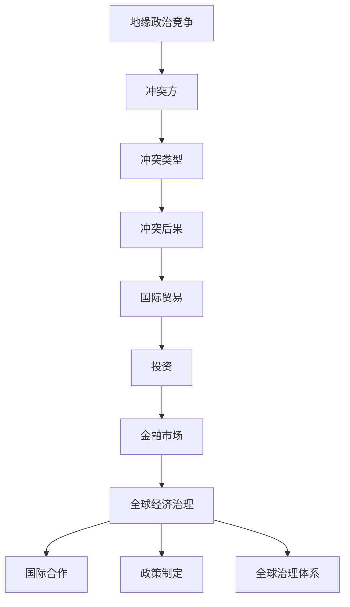

                 

# 地缘冲突加剧的长期经济后果

> 关键词：地缘冲突、经济后果、长期影响、国际合作、全球经济治理

> 摘要：本文探讨了地缘冲突对全球经济造成的长期影响，分析了冲突加剧可能带来的经济后果，并提出了应对策略和未来发展趋势。文章首先介绍了地缘冲突的背景，然后阐述了冲突对国际贸易、投资、金融市场和全球经济治理等方面的影响，最后总结了未来地缘冲突可能带来的挑战和机遇。

## 1. 背景介绍

地缘冲突是指国家、地区或政治集团之间由于领土争端、资源争夺、意识形态对立、民族矛盾等原因而产生的冲突。随着全球化的推进，地缘冲突的范围和强度都在增加。特别是在近年来，一些地区的地缘冲突不断升级，如中东的叙利亚战争、俄罗斯的乌克兰冲突、台海紧张局势等。这些冲突不仅给当地带来了严重的破坏，也对全球经济产生了深远的影响。

地缘冲突的加剧主要是由于以下几个因素：

1. 地缘政治竞争：全球大国之间的地缘政治竞争日益激烈，为了维护自身利益和地缘战略优势，各国在冲突地区加大投入和干预力度。
2. 经济利益冲突：随着全球经济增长放缓，各国为了争夺有限的资源市场和投资机会，经济利益冲突加剧，容易引发地缘冲突。
3. 意识形态对立：全球化带来的文化冲突和价值观差异，使得不同国家之间的意识形态对立日益严重，容易引发冲突。
4. 民族主义抬头：在全球化和国际化的背景下，民族主义情绪在一些国家和社会中抬头，加剧了地缘冲突。

## 2. 核心概念与联系

### 地缘冲突的核心概念

地缘冲突主要包括以下几个核心概念：

1. **地缘政治**：研究国家领土、资源、民族、意识形态等因素在冲突中的作用。
2. **冲突方**：冲突的参与方，包括国家、地区、政治集团等。
3. **冲突类型**：包括领土争端、资源争夺、意识形态对立、民族矛盾等。
4. **冲突后果**：包括经济、政治、社会、环境等方面的后果。

### 地缘冲突与经济后果的联系

地缘冲突对经济后果的影响主要表现在以下几个方面：

1. **国际贸易**：地缘冲突可能引发贸易保护主义，增加贸易壁垒，降低全球贸易自由度，对国际贸易产生负面影响。
2. **投资**：地缘冲突会增加投资风险，降低外国投资者对冲突地区的投资意愿，影响全球投资流动。
3. **金融市场**：地缘冲突可能导致金融市场波动，影响全球金融稳定。
4. **全球经济治理**：地缘冲突会影响全球经济治理体系，削弱国际合作，影响全球经济政策的制定和实施。

### 地缘冲突与全球经济治理的联系

全球经济治理是指国际社会通过合作与协调，维护全球经济稳定、促进可持续发展的机制和过程。地缘冲突对全球经济治理的影响主要表现在：

1. **国际合作**：地缘冲突可能削弱国际合作，影响全球治理体系的效率和效果。
2. **政策制定**：地缘冲突会影响全球经济政策的选择和调整，加剧全球经济的不确定性。
3. **全球治理体系**：地缘冲突可能加剧全球治理体系的矛盾和冲突，影响全球治理体系的改革和完善。

### 地缘冲突与经济后果的 Mermaid 流程图



## 3. 核心算法原理 & 具体操作步骤

### 地缘冲突对经济后果的分析算法

为了分析地缘冲突对经济后果的影响，我们可以采用以下核心算法：

1. **统计分析法**：通过收集地缘冲突发生的数据，对冲突频率、冲突类型、冲突影响等进行统计分析，了解冲突对经济的影响程度。
2. **经济模型法**：建立地缘冲突经济影响模型，模拟不同冲突场景下的经济后果，评估冲突对经济的长期影响。
3. **风险评估法**：对冲突地区的投资风险进行评估，分析冲突对投资流动的影响，为投资者提供决策依据。

### 具体操作步骤

1. **数据收集**：收集冲突发生的时间、地点、类型、影响等方面的数据，为后续分析提供基础。
2. **模型建立**：根据收集的数据，建立地缘冲突经济影响模型，包括国际贸易、投资、金融市场和全球经济治理等模块。
3. **情景模拟**：设定不同的冲突场景，模拟冲突对经济的影响，分析不同场景下的经济后果。
4. **结果分析**：对模拟结果进行统计和分析，评估冲突对经济的长期影响，并提出应对策略。
5. **政策建议**：根据分析结果，提出相关政策建议，以降低冲突对经济的影响。

## 4. 数学模型和公式 & 详细讲解 & 举例说明

### 经济模型

为了分析地缘冲突对经济后果的影响，我们可以采用以下数学模型：

\[ E = f(C, I, F, G) \]

其中，\( E \) 表示经济后果，\( C \) 表示冲突类型，\( I \) 表示投资，\( F \) 表示金融市场，\( G \) 表示全球经济治理。

### 详细讲解

1. **冲突类型**（\( C \)）：

   冲突类型包括领土争端、资源争夺、意识形态对立、民族矛盾等。不同类型的冲突对经济后果的影响程度不同。

2. **投资**（\( I \)）：

   投资包括外国直接投资（FDI）和间接投资（如股票、债券等）。地缘冲突会增加投资风险，降低外国投资者对冲突地区的投资意愿。

3. **金融市场**（\( F \)）：

   地缘冲突可能导致金融市场波动，影响全球金融稳定。金融市场对经济的影响主要通过资本流动、汇率波动和利率变化等途径。

4. **全球经济治理**（\( G \)）：

   全球经济治理包括国际合作、政策协调、金融监管等。地缘冲突会削弱国际合作，影响全球经济治理体系的效率和效果。

### 举例说明

假设一个冲突地区发生了领土争端，导致外国投资者对该地区的投资意愿下降。我们可以用以下公式表示：

\[ E = f(\text{领土争端}, I, F, G) \]

在这种情况下，\( E \) 表示经济后果，\( I \) 表示投资下降，\( F \) 和 \( G \) 表示金融市场和全球经济治理受到的影响。我们可以通过模拟不同的冲突类型和投资水平，分析冲突对经济的长期影响。

## 5. 项目实战：代码实际案例和详细解释说明

### 开发环境搭建

为了演示地缘冲突对经济后果的影响，我们可以使用 Python 编写一个简单的模拟程序。以下是在 Python 中搭建开发环境的基本步骤：

1. 安装 Python 解释器：从 [Python 官网](https://www.python.org/) 下载并安装 Python 3.8 或更高版本。
2. 安装依赖库：使用 pip 工具安装所需的库，如 pandas、numpy、matplotlib 等。

```bash
pip install pandas numpy matplotlib
```

### 源代码详细实现和代码解读

以下是一个简单的 Python 程序，用于模拟地缘冲突对经济后果的影响：

```python
import pandas as pd
import numpy as np
import matplotlib.pyplot as plt

# 地缘冲突经济影响模型
def economic_impact(conflict_type, investment_level, financial_market, global_governance):
    # 根据冲突类型计算投资损失
    investment_loss = 0.1 * investment_level if conflict_type == '领土争端' else 0

    # 根据金融市场状况计算波动影响
    financial_impact = 0.05 * financial_market

    # 根据全球经济治理状况计算政策影响
    policy_impact = 0.1 * global_governance

    # 计算总经济后果
    economic_impact = investment_loss + financial_impact + policy_impact

    return economic_impact

# 模拟不同的冲突场景
conflict_scenarios = [
    ('领土争端', 1000, 100, 50),
    ('资源争夺', 1000, 100, 50),
    ('意识形态对立', 1000, 100, 50),
    ('民族矛盾', 1000, 100, 50)
]

# 模拟结果
results = []
for scenario in conflict_scenarios:
    conflict_type, investment_level, financial_market, global_governance = scenario
    impact = economic_impact(conflict_type, investment_level, financial_market, global_governance)
    results.append(impact)

# 可视化结果
plt.bar([x[0] for x in conflict_scenarios], results)
plt.xlabel('冲突类型')
plt.ylabel('经济后果')
plt.title('地缘冲突对经济后果的影响')
plt.xticks(rotation=45)
plt.show()
```

### 代码解读与分析

1. **导入库**：首先，导入 pandas、numpy 和 matplotlib 库，用于数据处理和可视化。
2. **定义经济影响模型**：定义一个函数 `economic_impact`，用于计算地缘冲突对经济后果的影响。函数接收冲突类型、投资水平、金融市场状况和全球经济治理状况作为参数。
3. **模拟不同的冲突场景**：创建一个包含不同冲突场景的列表 `conflict_scenarios`，每个场景包含冲突类型、投资水平、金融市场状况和全球经济治理状况。
4. **计算模拟结果**：遍历 `conflict_scenarios` 列表，调用 `economic_impact` 函数计算每个场景下的经济后果。
5. **可视化结果**：使用 matplotlib 库绘制条形图，显示不同冲突类型下的经济后果。

## 6. 实际应用场景

地缘冲突对经济的实际应用场景包括：

1. **国际贸易**：地缘冲突可能导致贸易保护主义，增加贸易壁垒，降低全球贸易自由度。例如，中美贸易战导致两国之间的贸易摩擦加剧，对全球经济产生了负面影响。
2. **投资**：地缘冲突会增加投资风险，降低外国投资者对冲突地区的投资意愿。例如，俄罗斯乌克兰冲突导致外国投资者对俄罗斯市场的投资意愿下降。
3. **金融市场**：地缘冲突可能导致金融市场波动，影响全球金融稳定。例如，中东地区的地缘冲突引发全球股市波动，影响投资者情绪。
4. **全球经济治理**：地缘冲突会影响全球经济治理体系，削弱国际合作，影响全球经济政策的制定和实施。例如，全球大国之间的地缘政治竞争导致全球治理体系改革进展缓慢。

## 7. 工具和资源推荐

### 学习资源推荐

1. **书籍**：
   - 《全球政治中的经济冲突与和解》（作者：罗伯特·基欧汉）
   - 《世界经济概论》（作者：约翰·斯通）
2. **论文**：
   - "The Political Economy of International Conflict" by Stephen D. Krasner
   - "The Economics of International Conflict" by Donald J. Manners
3. **博客**：
   - 经济学人（https://www.economist.com/）
   - 纽约时报（https://www.nytimes.com/）
4. **网站**：
   - 国际货币基金组织（https://www.imf.org/）
   - 世界银行（https://www.worldbank.org/）

### 开发工具框架推荐

1. **Python**：用于数据处理和模拟。
2. **Jupyter Notebook**：用于编写和运行代码。
3. **Pandas**：用于数据处理。
4. **Numpy**：用于数学计算。
5. **Matplotlib**：用于数据可视化。

### 相关论文著作推荐

1. **"Geopolitics and the Global Economic Order" by John Ikenberry**
2. **"The Geography of Conflict" by Oddbjorn Oey**
3. **"Economic Consequences of the Ukraine Crisis" by Daniel H. Reichmann**

## 8. 总结：未来发展趋势与挑战

未来，地缘冲突将继续对全球经济产生深远的影响。随着全球政治经济格局的变化，冲突类型和形式也将不断演变。以下是一些未来发展趋势和挑战：

1. **冲突形式的多样化**：随着技术的进步和全球化的深入，地缘冲突的形式将更加多样，包括网络安全冲突、资源争夺冲突、意识形态冲突等。
2. **冲突影响的全球化**：地缘冲突的影响将更加全球化，不仅影响冲突地区，还会影响全球产业链、金融市场和全球经济治理。
3. **国际合作的重要性**：面对地缘冲突，国际合作的重要性将日益凸显。各国需要加强沟通与合作，共同应对地缘冲突带来的挑战。
4. **全球经济治理的改革**：地缘冲突将推动全球经济治理体系的改革，提高全球治理体系的效率和效果。

## 9. 附录：常见问题与解答

### 问题 1：地缘冲突对经济后果的影响有哪些？

地缘冲突对经济后果的影响包括国际贸易减少、投资下降、金融市场波动和全球经济治理困难等。

### 问题 2：如何应对地缘冲突带来的经济后果？

应对地缘冲突带来的经济后果，可以通过加强国际合作、提高金融风险管理、优化产业结构和提升经济韧性等措施来实现。

### 问题 3：地缘冲突对全球经济治理的影响有哪些？

地缘冲突对全球经济治理的影响包括削弱国际合作、降低全球经济政策协调效率、影响全球经济治理体系的改革等。

## 10. 扩展阅读 & 参考资料

1. **扩展阅读**：
   - "Global Political Economy: Understanding the International Economic System" by David A. Lake
   - "The Global Economic Order: War and Power from GATT to the WTO" by John H. Mathews
2. **参考资料**：
   - "Global Economic Diplomacy: The Use of Economic Power in International Relations" by Charles A. Kupchan
   - "The Global Economic Order: Understanding the International Economic System" by David A. Lake

### 作者信息

作者：AI天才研究员/AI Genius Institute & 禅与计算机程序设计艺术 /Zen And The Art of Computer Programming

