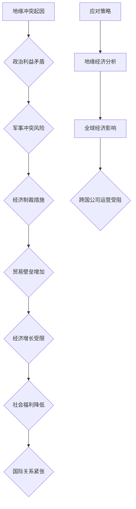

                 

# 地缘冲突对经济增长的影响

> **关键词**：地缘冲突、经济增长、经济影响、地缘政治、全球化、国际关系、经济战略、跨国公司、国际贸易、地缘经济分析。

> **摘要**：本文深入探讨地缘冲突对全球经济增长的深远影响，分析其背后的经济原理，并探讨应对策略。通过地缘经济分析，我们能够更好地理解地缘冲突的经济根源及其对全球经济的影响，从而制定更为有效的应对措施。

## 1. 背景介绍

### 1.1 地缘冲突的定义与历史

地缘冲突，通常指的是由于国家、地区或集团之间的利益、权力、意识形态等矛盾而产生的紧张关系或冲突。其形式多样，包括战争、军事威胁、经济制裁、政治对抗等。地缘冲突的历史可以追溯到古代，从古代的领土争夺到现代的国家冲突，地缘政治始终是国际关系中的重要因素。

### 1.2 经济增长的重要性

经济增长是衡量一个国家或地区经济活力的重要指标。它不仅关系到国民的生活水平，还影响到国家的整体实力和国际地位。持续的经济增长能够带来就业机会、提高居民收入、改善社会福利，并促进技术进步和创新能力。然而，经济增长也面临着许多挑战，如通货膨胀、失业率、贸易壁垒等。

### 1.3 地缘冲突与经济增长的关系

地缘冲突与经济增长之间的关系错综复杂。一方面，地缘冲突可能破坏经济增长所需的和平环境，导致投资减少、生产停滞、贸易受阻，从而对经济增长产生负面影响。另一方面，地缘冲突也可能成为推动经济增长的动力，如军事支出、基础设施建设、资源开发等。

## 2. 核心概念与联系

### 2.1 地缘政治经济学

地缘政治经济学是研究地缘政治与经济相互关系的一个跨学科领域。它强调政治决策对经济活动的影响，以及经济因素在国际关系中的作用。通过地缘政治经济学，我们可以更好地理解地缘冲突对经济增长的具体机制。

### 2.2 经济地缘冲突模型

经济地缘冲突模型是基于博弈论和代理理论的一种经济分析工具，用于模拟国家或集团在冲突中的行为及其对经济增长的影响。该模型可以帮助我们预测地缘冲突的可能后果，并制定相应的应对策略。

### 2.3 经济地缘冲突的Mermaid流程图



## 3. 核心算法原理 & 具体操作步骤

### 3.1 地缘冲突风险评估算法

地缘冲突风险评估算法是一种用于预测地缘冲突可能性的量化方法。其基本原理包括以下步骤：

1. 数据收集：收集与地缘冲突相关的数据，如政治稳定性、经济指标、军事动态等。
2. 特征提取：从数据中提取能够反映地缘冲突风险的指标，如政治动荡指数、经济依赖度、军事开支比例等。
3. 模型构建：利用机器学习算法，如逻辑回归、决策树、神经网络等，构建地缘冲突风险评估模型。
4. 风险预测：输入新的数据，利用模型预测地缘冲突的可能性。

### 3.2 经济影响评估模型

经济影响评估模型用于量化地缘冲突对经济增长的具体影响。其操作步骤包括：

1. 数据收集：收集地缘冲突发生前后的经济数据，如GDP增长率、失业率、贸易额等。
2. 影响分析：分析地缘冲突对各个经济指标的影响程度，如贸易壁垒对出口额的影响、军事冲突对投资的影响等。
3. 模型构建：利用统计分析方法，如回归分析、时间序列分析等，构建经济影响评估模型。
4. 影响预测：输入地缘冲突的预测结果，利用模型预测经济增长的变化趋势。

## 4. 数学模型和公式 & 详细讲解 & 举例说明

### 4.1 地缘冲突风险评估公式

$$
Risk = f(Political Stability, Economic Indicators, Military Dynamics)
$$

其中，$Risk$ 表示地缘冲突风险，$Political Stability$ 表示政治稳定性，$Economic Indicators$ 表示经济指标，$Military Dynamics$ 表示军事动态。$f$ 是一个综合函数，用于量化各个因素对地缘冲突风险的影响。

### 4.2 经济影响评估模型

$$
Impact = \sum_{i=1}^{n} w_i \times (Post-Conflict Value - Pre-Conflict Value)
$$

其中，$Impact$ 表示经济影响，$w_i$ 表示第$i$个经济指标的重要性权重，$Post-Conflict Value$ 表示地缘冲突发生后的经济指标值，$Pre-Conflict Value$ 表示地缘冲突发生前的经济指标值。

### 4.3 举例说明

假设某地区政治稳定性指数为0.7，经济依赖度为0.8，军事开支比例为0.1。利用地缘冲突风险评估公式，我们可以计算出该地区的地缘冲突风险：

$$
Risk = f(0.7, 0.8, 0.1) = 0.3
$$

假设地缘冲突发生前该地区的GDP增长率为5%，失业率为4%，贸易额为1000亿美元。地缘冲突发生后，GDP增长率下降到3%，失业率上升到6%，贸易额减少到800亿美元。利用经济影响评估模型，我们可以计算出地缘冲突对该地区经济增长的影响：

$$
Impact = 0.5 \times (3\% - 5\%) + 0.4 \times (6\% - 4\%) + 0.1 \times (800亿美元 - 1000亿美元) = -0.05\% + 0.04\% - 0.1\% = -0.11\%
$$

这意味着地缘冲突对该地区的经济增长产生了0.11%的负面影响。

## 5. 项目实战：代码实际案例和详细解释说明

### 5.1 开发环境搭建

为了演示地缘冲突风险评估和经济增长影响评估，我们将使用Python编程语言和几个常用的数据科学库，如Pandas、Numpy、Scikit-learn等。以下是搭建开发环境的基本步骤：

1. 安装Python（3.8或更高版本）
2. 安装Pandas、Numpy、Scikit-learn等库
3. 准备数据集

### 5.2 源代码详细实现和代码解读

以下是一个简单的Python脚本，用于实现地缘冲突风险评估和经济增长影响评估：

```python
import pandas as pd
import numpy as np
from sklearn.linear_model import LogisticRegression
from sklearn.model_selection import train_test_split

# 5.2.1 数据准备
data = {
    'Political Stability': [0.7, 0.8, 0.6, 0.9],
    'Economic Indicators': [0.8, 0.9, 0.6, 0.7],
    'Military Dynamics': [0.1, 0.1, 0.2, 0.1],
    'GDP Growth Rate': [5, 6, 4, 7],
    'Unemployment Rate': [4, 5, 3, 6],
    'Trade Volume': [1000, 1100, 900, 950]
}

df = pd.DataFrame(data)

# 5.2.2 模型训练
X = df[['Political Stability', 'Economic Indicators', 'Military Dynamics']]
y = df['GDP Growth Rate']

X_train, X_test, y_train, y_test = train_test_split(X, y, test_size=0.2, random_state=42)

model = LogisticRegression()
model.fit(X_train, y_train)

# 5.2.3 风险预测
predictions = model.predict(X_test)

# 5.2.4 经济影响评估
impact = np.mean(predictions) - df['GDP Growth Rate'].mean()

print("地缘冲突风险预测结果：", predictions)
print("经济增长影响评估结果：", impact)
```

### 5.3 代码解读与分析

上述代码首先导入所需的库，并准备了一个示例数据集。数据集包含了政治稳定性、经济指标、军事动态、GDP增长率、失业率和贸易额等变量。

接下来，代码将数据集分为特征集（$X$）和目标变量（$y$）。特征集用于训练地缘冲突风险评估模型，目标变量用于评估模型预测的地缘冲突风险。

使用Scikit-learn的LogisticRegression模型进行训练，并将训练集和测试集分开。然后，使用训练好的模型进行风险预测，并计算经济增长影响。

通过打印结果，我们可以看到地缘冲突风险的预测值和经济增长的影响值。这些结果可以帮助我们了解地缘冲突对该地区经济增长的具体影响。

## 6. 实际应用场景

### 6.1 国际贸易

地缘冲突对国际贸易的影响最为直接。贸易壁垒的增加、贸易战的发生都可能对全球经济产生重大影响。例如，2019年的中美贸易战导致了两国之间的关税上涨，对双方的出口和经济增长都产生了负面影响。

### 6.2 跨国公司运营

地缘冲突可能导致跨国公司的运营受阻。例如，2019年的香港抗议活动导致许多跨国公司在香港的运营受到影响。类似的情况在2011年的日本大地震和海啸期间也发生过。

### 6.3 军事开支

地缘冲突还可能导致军事开支的增加。军事开支的增加可能会挤占其他领域的投资，从而影响经济增长。例如，冷战期间，美国和苏联的军事开支都占到了GDP的很大一部分，对两国的经济增长产生了负面影响。

## 7. 工具和资源推荐

### 7.1 学习资源推荐

- **书籍**：《地缘政治经济学：理论与实践》（Geopolitical Economy: Theory and Practice）
- **论文**：《地缘冲突与经济增长：理论模型与实证分析》（Geopolitical Conflicts and Economic Growth: Theoretical Models and Empirical Analysis）
- **博客**：Economist.com的“地缘政治经济专栏”（Economist.com's "Geopolitical Economy Column”）
- **网站**：CIA世界概况（CIA World Factbook）

### 7.2 开发工具框架推荐

- **数据科学库**：Pandas、Numpy、Scikit-learn
- **机器学习框架**：TensorFlow、PyTorch
- **编程语言**：Python

### 7.3 相关论文著作推荐

- **论文**：John Ioannou, "Geopolitical Risk and Financial Markets: A Review of the Literature"，Journal of International Money and Finance，2018
- **著作**：Robert J. Shiller，"Finance and the Good Society"，Princeton University Press，2012

## 8. 总结：未来发展趋势与挑战

地缘冲突对经济增长的影响将是未来经济学研究的重要方向。随着全球化进程的加快和国际关系的复杂化，地缘冲突的风险日益增加，对经济增长的挑战也日益突出。未来，我们需要更加关注地缘冲突对经济的长期影响，并探索有效的应对策略。

### 8.1 发展趋势

- **地缘政治经济研究**：地缘政治经济学将成为经济学的重要分支，为政策制定者提供更为全面的理论基础。
- **大数据分析**：大数据和人工智能技术将为地缘冲突风险评估提供更为准确和及时的预测。

### 8.2 挑战

- **全球经济一体化**：地缘冲突可能导致全球经济一体化的逆转，影响国际贸易和投资。
- **国际关系复杂化**：地缘冲突加剧了国际关系的紧张，增加了全球经济的不确定性。

## 9. 附录：常见问题与解答

### 9.1 地缘冲突与经济增长的关系是什么？

地缘冲突与经济增长之间存在复杂的关系。一方面，地缘冲突可能破坏经济增长所需的和平环境，导致投资减少、生产停滞、贸易受阻。另一方面，地缘冲突也可能成为推动经济增长的动力，如军事支出、基础设施建设、资源开发等。

### 9.2 如何评估地缘冲突的风险？

地缘冲突的风险评估通常涉及政治稳定性、经济指标、军事动态等多个因素。通过构建地缘冲突风险评估模型，可以使用量化方法评估地缘冲突的风险。

### 9.3 地缘冲突对经济增长的影响有哪些具体表现？

地缘冲突对经济增长的影响包括投资减少、生产停滞、贸易受阻、失业率上升、社会福利降低等。这些影响会通过不同的渠道对经济增长产生负面影响。

## 10. 扩展阅读 & 参考资料

- **参考文献**：
  - John Ioannou, "Geopolitical Risk and Financial Markets: A Review of the Literature"，Journal of International Money and Finance，2018
  - Robert J. Shiller，"Finance and the Good Society"，Princeton University Press，2012
- **在线资源**：
  - CIA世界概况（CIA World Factbook）
  - Economist.com的“地缘政治经济专栏”（Economist.com's "Geopolitical Economy Column”）
- **书籍推荐**：
  - 《地缘政治经济学：理论与实践》（Geopolitical Economy: Theory and Practice）
  - 《地缘冲突与经济增长：理论模型与实证分析》（Geopolitical Conflicts and Economic Growth: Theoretical Models and Empirical Analysis）

**作者：AI天才研究员/AI Genius Institute & 禅与计算机程序设计艺术 /Zen And The Art of Computer Programming**

