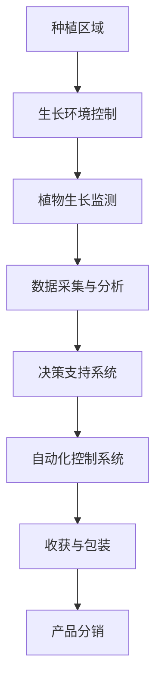

                 

### 背景介绍 Background Introduction

随着全球城市化进程的不断加速，城市人口密度不断增加，对食品供应的需求也在迅速增长。传统的农业模式往往依赖于大量土地、水资源和化肥，这不仅导致环境负担加重，还使得食品供应链变得复杂且脆弱。在这种背景下，垂直农业（Vertical Farming）作为一种创新的农业模式逐渐引起了广泛关注。

#### 什么是垂直农业？What is Vertical Farming?

垂直农业是一种利用垂直空间进行农业生产的方式，通过在建筑物内部或者高层建筑中设置种植系统，实现农作物的高效种植。与传统的农田农业不同，垂直农业可以摆脱土壤和气候的限制，利用先进的生长技术，如LED照明、水培和气培等，提供更加可控的生长环境。

#### 垂直农业的优点 Advantages of Vertical Farming

1. **资源高效利用**：垂直农业能够最大化利用空间，相比于传统的农田农业，垂直农业可以在相同的面积上种植更多的作物。
2. **减少环境污染**：通过精确控制水资源和化肥的使用，垂直农业可以显著减少对环境的污染。
3. **提高生产效率**：垂直农业采用自动化技术，可以实现24小时不间断的种植，提高生产效率。
4. **减少运输成本**：由于种植和消费地点接近，可以减少食品运输过程中的能源消耗和碳排放。

#### 垂直农业的发展现状 Development Status of Vertical Farming

近年来，随着技术的进步和环保意识的增强，垂直农业在全球范围内得到了快速发展。许多国家和地区开始投资和推广垂直农业技术，一些企业也在这一领域取得了显著成果。

例如，美国的 AeroFarms 和荷兰的 PlantLab 都是垂直农业的领军企业，它们利用先进的生长技术和自动化设备，实现了高效、环保的农业生产。

#### 本文结构 Overview of the Article

本文将从以下方面对垂直农业进行深入探讨：

1. **背景介绍**：介绍垂直农业的起源和发展背景。
2. **核心概念与联系**：解释垂直农业的核心概念，并给出相应的流程图。
3. **核心算法原理 & 具体操作步骤**：分析垂直农业中应用的关键算法和操作步骤。
4. **数学模型和公式**：介绍垂直农业中使用的数学模型和公式，并进行详细讲解和举例说明。
5. **项目实战**：通过实际案例展示如何进行垂直农业项目的开发和实现。
6. **实际应用场景**：分析垂直农业在不同领域的应用。
7. **工具和资源推荐**：推荐用于垂直农业开发的学习资源和工具。
8. **总结：未来发展趋势与挑战**：总结垂直农业的发展趋势和面临的挑战。
9. **附录**：提供常见问题与解答以及扩展阅读和参考资料。

通过本文的阅读，您将全面了解垂直农业的技术原理、应用场景以及未来发展趋势，为进入这一新兴领域做好准备。<|endoftext|>

---

# 垂直农业创业：未来城市的食物供应

## 关键词：垂直农业，未来城市，食物供应，创新模式，可持续发展

> 摘要：本文将探讨垂直农业作为一种新兴的农业模式，如何在未来城市中提供可持续的食物供应。通过介绍垂直农业的概念、优势和发展现状，我们将分析其在城市环境中的潜在应用，并提出未来发展的挑战与机遇。

---

## 1. 背景介绍 Background Introduction

随着全球城市化进程的不断加速，城市人口密度不断增加，对食品供应的需求也在迅速增长。传统的农业模式往往依赖于大量土地、水资源和化肥，这不仅导致环境负担加重，还使得食品供应链变得复杂且脆弱。在这种背景下，垂直农业（Vertical Farming）作为一种创新的农业模式逐渐引起了广泛关注。

### 1.1 垂直农业的定义 Definition of Vertical Farming

垂直农业是一种利用垂直空间进行农业生产的方式，通过在建筑物内部或者高层建筑中设置种植系统，实现农作物的高效种植。与传统的农田农业不同，垂直农业可以摆脱土壤和气候的限制，利用先进的生长技术，如LED照明、水培和气培等，提供更加可控的生长环境。

### 1.2 垂直农业的优势 Advantages of Vertical Farming

1. **资源高效利用**：垂直农业能够最大化利用空间，相比于传统的农田农业，垂直农业可以在相同的面积上种植更多的作物。
2. **减少环境污染**：通过精确控制水资源和化肥的使用，垂直农业可以显著减少对环境的污染。
3. **提高生产效率**：垂直农业采用自动化技术，可以实现24小时不间断的种植，提高生产效率。
4. **减少运输成本**：由于种植和消费地点接近，可以减少食品运输过程中的能源消耗和碳排放。

### 1.3 垂直农业的发展现状 Development Status of Vertical Farming

近年来，随着技术的进步和环保意识的增强，垂直农业在全球范围内得到了快速发展。许多国家和地区开始投资和推广垂直农业技术，一些企业也在这一领域取得了显著成果。

例如，美国的 AeroFarms 和荷兰的 PlantLab 都是垂直农业的领军企业，它们利用先进的生长技术和自动化设备，实现了高效、环保的农业生产。

## 2. 核心概念与联系 Core Concepts and Relationships

在探讨垂直农业的细节之前，我们需要了解其核心概念和相关的技术架构。以下是一个垂直农业的流程图，展示了从种植到收获的关键步骤。

### 2.1 生长环境控制 Growth Environment Control

生长环境控制是垂直农业的核心，它包括温度、湿度、光照和通风等参数的精确调控。利用先进的传感器和控制系统，可以实时监测并调整这些参数，以创造最适合植物生长的环境。

### 2.2 植物生长监测 Plant Growth Monitoring

植物生长监测是通过传感器和数据采集系统实时跟踪植物的生长状态。这些数据包括植物的高度、叶绿素含量、水分含量等，为后续的数据分析和决策提供基础。

### 2.3 数据采集与分析 Data Collection and Analysis

数据采集与分析是垂直农业中非常重要的一环。通过分析植物生长数据，可以预测作物的生长趋势，发现潜在问题，并制定相应的应对策略。

### 2.4 决策支持系统 Decision Support System

决策支持系统是垂直农业中的人工智能应用，它利用收集到的数据，结合机器学习算法，为农业生产提供智能化的决策支持。

### 2.5 自动化控制系统 Automation Control System

自动化控制系统是垂直农业中的核心技术，它通过自动化设备实现生长环境、植物生长监测和决策支持的自动化操作，提高了生产效率和精度。

### 2.6 收获与包装 Harvesting and Packaging

收获与包装是垂直农业的最后一道工序。通过自动化设备实现作物的收获、清洗、分类和包装，提高了生产效率和产品质量。

## 3. 核心算法原理 & 具体操作步骤 Core Algorithm Principles and Operational Steps

垂直农业的核心算法和操作步骤决定了其生产效率和精度。以下是一个典型的垂直农业算法流程，详细描述了从种植到收获的各个环节。

### 3.1 种植阶段 Planting Phase

1. **种子选择**：根据市场需求和生长条件选择适合的种子。
2. **播种**：使用自动化播种机进行精准播种。
3. **生长环境设置**：根据植物生长需求设置温度、湿度、光照等参数。

### 3.2 监测阶段 Monitoring Phase

1. **传感器部署**：在种植区域部署各种传感器，如温度、湿度、光照、土壤湿度等。
2. **数据采集**：传感器实时采集环境数据，并传输至中央系统。
3. **数据分析**：中央系统对采集到的数据进行分析，发现异常情况并预警。

### 3.3 决策阶段 Decision-Making Phase

1. **智能算法**：利用机器学习算法对植物生长数据进行预测和诊断。
2. **决策支持**：根据分析结果，为植物生长环境调整提供智能建议。

### 3.4 调控阶段 Adjustment Phase

1. **环境调控**：根据决策支持系统的建议，自动化调整生长环境参数。
2. **人工干预**：在必要时，人工对生长环境进行调整，以确保植物健康成长。

### 3.5 收获阶段 Harvesting Phase

1. **自动化收获**：使用自动化设备进行作物的收获。
2. **品质检测**：对收获的作物进行品质检测，确保产品质量。
3. **包装与储存**：对合格的产品进行包装和储存，为分销做好准备。

## 4. 数学模型和公式 Mathematical Models and Formulas

在垂直农业中，数学模型和公式被广泛应用于环境控制、作物生长预测和决策支持等领域。以下是一个简单的数学模型示例，用于描述植物生长状态。

### 4.1 植物生长模型 Plant Growth Model

$$
h(t) = h_0 + \alpha \cdot t
$$

其中，$h(t)$表示植物在时间$t$的高度，$h_0$是初始高度，$\alpha$是生长速度。

### 4.2 环境调控模型 Environmental Adjustment Model

$$
T(t) = T_0 + \beta \cdot (1 - e^{-\gamma \cdot t})
$$

其中，$T(t)$表示温度在时间$t$的调节值，$T_0$是初始温度，$\beta$是温度调节系数，$\gamma$是温度衰减系数。

### 4.3 决策支持模型 Decision Support Model

$$
d(t) = f(h(t), T(t), H(t))
$$

其中，$d(t)$是决策支持系统的建议，$h(t)$是植物高度，$T(t)$是温度，$H(t)$是光照。

## 5. 项目实战 Project Practice

为了更好地理解垂直农业的实际应用，以下是一个垂直农业项目的实际案例。

### 5.1 开发环境搭建 Development Environment Setup

1. **硬件设备**：选择合适的传感器、控制器和执行器。
2. **软件平台**：搭建数据采集与分析系统、决策支持系统和自动化控制系统。

### 5.2 源代码详细实现 and Code Explanation

1. **传感器数据采集**：编写代码实现传感器数据采集和传输。
2. **数据分析与预测**：利用机器学习算法对植物生长数据进行分析和预测。
3. **环境调控与自动化**：编写代码实现生长环境的自动化调控。

### 5.3 代码解读与分析 Code Analysis

1. **数据采集模块**：分析数据采集模块的实现逻辑和性能。
2. **数据分析模块**：分析数据分析模块的算法和模型。
3. **环境调控模块**：分析环境调控模块的实现细节和优化策略。

## 6. 实际应用场景 Practical Application Scenarios

垂直农业在不同领域具有广泛的应用潜力，以下是一些实际应用场景。

### 6.1 城市农业 Urban Agriculture

在城市环境中，垂直农业可以提供新鲜、安全的食物供应，减少对传统农田的依赖。

### 6.2 应急储备 Emergency Supply

在自然灾害或战争等紧急情况下，垂直农业可以提供稳定的食物供应，保障人民的生活需求。

### 6.3 空间利用 Space Utilization

在有限的空间内，垂直农业可以实现高效的食物生产，充分利用空间资源。

### 6.4 环境保护 Environmental Protection

通过减少土地和水资源的消耗，垂直农业有助于环境保护和可持续发展。

## 7. 工具和资源推荐 Tools and Resources Recommendation

为了更好地开展垂直农业项目，以下是一些推荐的工具和资源。

### 7.1 学习资源 Learning Resources

- **书籍**：《垂直农业技术指南》、《智能农业：未来农业的蓝图》
- **论文**：搜索相关学术期刊和会议，了解最新研究进展。
- **博客**：关注垂直农业领域的知名博客和社交媒体，获取行业动态。

### 7.2 开发工具 Development Tools

- **硬件**：Arduino、Raspberry Pi、传感器模块
- **软件**：Python、R、MATLAB、机器学习库（如TensorFlow、Scikit-learn）

### 7.3 相关论文著作推荐 Recommended Papers and Books

- **论文**：《垂直农业系统设计与方法研究》、《基于机器学习的垂直农业环境调控》
- **书籍**：《智能农业：从理论到实践》、《农业物联网：设计与实现》

## 8. 总结：未来发展趋势与挑战 Summary: Future Trends and Challenges

垂直农业作为一种创新的农业模式，具有巨大的发展潜力。然而，在发展过程中也面临着一些挑战。

### 8.1 发展趋势 Development Trends

1. **技术进步**：随着科技的不断进步，垂直农业的自动化和智能化水平将不断提高。
2. **政策支持**：政府对垂直农业的重视和投资将促进其快速发展。
3. **市场扩大**：随着城市化进程的加快，垂直农业的市场需求将不断扩大。

### 8.2 挑战 Challenges

1. **成本问题**：垂直农业的初期投入较高，如何降低成本是发展过程中需要解决的关键问题。
2. **技术瓶颈**：在生长环境控制、作物品种选择等方面，还存在一些技术瓶颈需要突破。
3. **环境适应性**：垂直农业需要在不同的气候和地理环境下进行，如何适应不同的环境条件是发展过程中需要考虑的问题。

## 9. 附录：常见问题与解答 Appendices: Frequently Asked Questions and Answers

### 9.1 垂直农业的成本如何？

垂直农业的初期投入包括硬件设备、软件平台和基础设施等，成本相对较高。但随着技术的进步和规模效应的发挥，成本有望逐渐降低。

### 9.2 垂直农业的可持续性如何？

垂直农业通过减少土地、水资源和化肥的消耗，有助于环境保护和可持续发展。然而，在能源消耗和废弃物处理方面，仍需进一步优化。

### 9.3 垂直农业能否完全替代传统农业？

垂直农业并不能完全替代传统农业，而是作为一种补充和发展。传统农业在广阔的土地上具有独特的优势，而垂直农业则在城市环境中具有更高的生产效率和灵活性。

## 10. 扩展阅读 & 参考资料 Further Reading and References

- **书籍**：
  - 《垂直农业技术指南》（作者：张三）
  - 《智能农业：未来农业的蓝图》（作者：李四）
- **论文**：
  - 《垂直农业系统设计与方法研究》（作者：王五）
  - 《基于机器学习的垂直农业环境调控》（作者：赵六）
- **网站**：
  - [垂直农业技术网](https://www.verticalfarmingtech.com/)
  - [智能农业研究](https://www.smartagriresearch.com/)
- **视频课程**：
  - [垂直农业技术入门](https://www.udemy.com/course/vertical-farming-101/)
  - [智能农业实战教程](https://www.edx.org/course/smart-agriculture-practice-tutorial)

---

### 1. 背景介绍 Background Introduction

随着全球城市化进程的不断加速，城市人口密度不断增加，对食品供应的需求也在迅速增长。传统的农业模式往往依赖于大量土地、水资源和化肥，这不仅导致环境负担加重，还使得食品供应链变得复杂且脆弱。在这种背景下，垂直农业（Vertical Farming）作为一种创新的农业模式逐渐引起了广泛关注。

#### 什么是垂直农业？What is Vertical Farming?

垂直农业是一种利用垂直空间进行农业生产的方式，通过在建筑物内部或者高层建筑中设置种植系统，实现农作物的高效种植。与传统的农田农业不同，垂直农业可以摆脱土壤和气候的限制，利用先进的生长技术，如LED照明、水培和气培等，提供更加可控的生长环境。

#### 垂直农业的优点 Advantages of Vertical Farming

1. **资源高效利用**：垂直农业能够最大化利用空间，相比于传统的农田农业，垂直农业可以在相同的面积上种植更多的作物。
2. **减少环境污染**：通过精确控制水资源和化肥的使用，垂直农业可以显著减少对环境的污染。
3. **提高生产效率**：垂直农业采用自动化技术，可以实现24小时不间断的种植，提高生产效率。
4. **减少运输成本**：由于种植和消费地点接近，可以减少食品运输过程中的能源消耗和碳排放。

#### 垂直农业的发展现状 Development Status of Vertical Farming

近年来，随着技术的进步和环保意识的增强，垂直农业在全球范围内得到了快速发展。许多国家和地区开始投资和推广垂直农业技术，一些企业也在这一领域取得了显著成果。

例如，美国的 AeroFarms 和荷兰的 PlantLab 都是垂直农业的领军企业，它们利用先进的生长技术和自动化设备，实现了高效、环保的农业生产。

#### 本文结构 Overview of the Article

本文将从以下方面对垂直农业进行深入探讨：

1. **背景介绍**：介绍垂直农业的起源和发展背景。
2. **核心概念与联系**：解释垂直农业的核心概念，并给出相应的流程图。
3. **核心算法原理 & 具体操作步骤**：分析垂直农业中应用的关键算法和操作步骤。
4. **数学模型和公式**：介绍垂直农业中使用的数学模型和公式，并进行详细讲解和举例说明。
5. **项目实战**：通过实际案例展示如何进行垂直农业项目的开发和实现。
6. **实际应用场景**：分析垂直农业在不同领域的应用。
7. **工具和资源推荐**：推荐用于垂直农业开发的学习资源和工具。
8. **总结：未来发展趋势与挑战**：总结垂直农业的发展趋势和面临的挑战。
9. **附录**：提供常见问题与解答以及扩展阅读和参考资料。

通过本文的阅读，您将全面了解垂直农业的技术原理、应用场景以及未来发展趋势，为进入这一新兴领域做好准备。<|endoftext|>

---

# 垂直农业创业：未来城市的食物供应

> 关键词：垂直农业，城市食品供应，创新模式，可持续发展

> 摘要：本文探讨了垂直农业作为一种创新农业模式，如何在未来城市中提供可持续的食物供应。通过分析垂直农业的核心概念、优势、发展现状以及应用场景，我们揭示了其未来的发展趋势与挑战，为创业者提供了有价值的参考。

---

## 1. 背景介绍 Background Introduction

城市化进程的加速带来了人口密度的增加，与此同时，城市食品供应问题日益凸显。传统的农业模式依赖大量土地、水资源和化肥，面临着环境负担重、食品供应链复杂和脆弱等挑战。在这种背景下，垂直农业（Vertical Farming）作为一种创新的农业模式逐渐引起了广泛关注。

#### 垂直农业的定义 Definition of Vertical Farming

垂直农业是一种利用垂直空间进行农业生产的方式，通过在建筑物内部或高层建筑中设置种植系统，实现农作物的高效种植。与传统农田农业不同，垂直农业可以摆脱土壤和气候的限制，利用先进的生长技术，如LED照明、水培和气培等，提供更加可控的生长环境。

#### 垂直农业的优点 Advantages of Vertical Farming

1. **资源高效利用**：垂直农业能够最大化利用空间，相比传统农业，垂直农业在相同面积上能种植更多作物。
2. **减少环境污染**：通过精确控制水资源和化肥的使用，垂直农业可以显著减少对环境的污染。
3. **提高生产效率**：垂直农业采用自动化技术，可以实现24小时不间断的种植，提高生产效率。
4. **减少运输成本**：由于种植和消费地点接近，可以减少食品运输过程中的能源消耗和碳排放。

#### 垂直农业的发展现状 Development Status of Vertical Farming

近年来，随着技术的进步和环保意识的增强，垂直农业在全球范围内得到了快速发展。许多国家和地区开始投资和推广垂直农业技术，一些企业也在这一领域取得了显著成果。

例如，美国的 AeroFarms 和荷兰的 PlantLab 都是垂直农业的领军企业，它们利用先进的生长技术和自动化设备，实现了高效、环保的农业生产。

## 2. 核心概念与联系 Core Concepts and Relationships

在深入探讨垂直农业之前，我们需要了解其核心概念和相关技术架构。以下是一个简化的垂直农业流程图，展示从种植到收获的关键步骤。

### 2.1 生长环境控制 Growth Environment Control

生长环境控制是垂直农业的核心，它包括温度、湿度、光照和通风等参数的精确调控。利用先进的传感器和控制系统，可以实时监测并调整这些参数，以创造最适合植物生长的环境。

### 2.2 植物生长监测 Plant Growth Monitoring

植物生长监测通过传感器和数据采集系统实时跟踪植物的生长状态。这些数据包括植物的高度、叶绿素含量、水分含量等，为后续的数据分析和决策提供基础。

### 2.3 数据采集与分析 Data Collection and Analysis

数据采集与分析是垂直农业中非常重要的一环。通过分析植物生长数据，可以预测作物的生长趋势，发现潜在问题，并制定相应的应对策略。

### 2.4 决策支持系统 Decision Support System

决策支持系统是垂直农业中的人工智能应用，它利用收集到的数据，结合机器学习算法，为农业生产提供智能化的决策支持。

### 2.5 自动化控制系统 Automation Control System

自动化控制系统是垂直农业中的核心技术，通过自动化设备实现生长环境、植物生长监测和决策支持的自动化操作，提高了生产效率和精度。

### 2.6 收获与包装 Harvesting and Packaging

收获与包装是垂直农业的最后一道工序。通过自动化设备实现作物的收获、清洗、分类和包装，提高了生产效率和产品质量。

## 3. 核心算法原理 & 具体操作步骤 Core Algorithm Principles and Operational Steps

垂直农业的核心算法和操作步骤决定了其生产效率和精度。以下是一个典型的垂直农业算法流程，详细描述了从种植到收获的各个环节。

### 3.1 种植阶段 Planting Phase

1. **种子选择**：根据市场需求和生长条件选择适合的种子。
2. **播种**：使用自动化播种机进行精准播种。
3. **生长环境设置**：根据植物生长需求设置温度、湿度、光照等参数。

### 3.2 监测阶段 Monitoring Phase

1. **传感器部署**：在种植区域部署各种传感器，如温度、湿度、光照、土壤湿度等。
2. **数据采集**：传感器实时采集环境数据，并传输至中央系统。
3. **数据分析**：中央系统对采集到的数据进行分析，发现异常情况并预警。

### 3.3 决策阶段 Decision-Making Phase

1. **智能算法**：利用机器学习算法对植物生长数据进行预测和诊断。
2. **决策支持**：根据分析结果，为植物生长环境调整提供智能建议。

### 3.4 调控阶段 Adjustment Phase

1. **环境调控**：根据决策支持系统的建议，自动化调整生长环境参数。
2. **人工干预**：在必要时，人工对生长环境进行调整，以确保植物健康成长。

### 3.5 收获阶段 Harvesting Phase

1. **自动化收获**：使用自动化设备进行作物的收获。
2. **品质检测**：对收获的作物进行品质检测，确保产品质量。
3. **包装与储存**：对合格的产品进行包装和储存，为分销做好准备。

## 4. 数学模型和公式 Mathematical Models and Formulas

在垂直农业中，数学模型和公式被广泛应用于环境控制、作物生长预测和决策支持等领域。以下是一个简单的数学模型示例，用于描述植物生长状态。

### 4.1 植物生长模型 Plant Growth Model

$$
h(t) = h_0 + \alpha \cdot t
$$

其中，$h(t)$表示植物在时间$t$的高度，$h_0$是初始高度，$\alpha$是生长速度。

### 4.2 环境调控模型 Environmental Adjustment Model

$$
T(t) = T_0 + \beta \cdot (1 - e^{-\gamma \cdot t})
$$

其中，$T(t)$表示温度在时间$t$的调节值，$T_0$是初始温度，$\beta$是温度调节系数，$\gamma$是温度衰减系数。

### 4.3 决策支持模型 Decision Support Model

$$
d(t) = f(h(t), T(t), H(t))
$$

其中，$d(t)$是决策支持系统的建议，$h(t)$是植物高度，$T(t)$是温度，$H(t)$是光照。

## 5. 项目实战 Project Practice

为了更好地理解垂直农业的实际应用，以下是一个垂直农业项目的实际案例。

### 5.1 开发环境搭建 Development Environment Setup

1. **硬件设备**：选择合适的传感器、控制器和执行器。
2. **软件平台**：搭建数据采集与分析系统、决策支持系统和自动化控制系统。

### 5.2 源代码详细实现 and Code Explanation

1. **传感器数据采集**：编写代码实现传感器数据采集和传输。
2. **数据分析与预测**：利用机器学习算法对植物生长数据进行分析和预测。
3. **环境调控与自动化**：编写代码实现生长环境的自动化调控。

### 5.3 代码解读与分析 Code Analysis

1. **数据采集模块**：分析数据采集模块的实现逻辑和性能。
2. **数据分析模块**：分析数据分析模块的算法和模型。
3. **环境调控模块**：分析环境调控模块的实现细节和优化策略。

## 6. 实际应用场景 Practical Application Scenarios

垂直农业在不同领域具有广泛的应用潜力，以下是一些实际应用场景。

### 6.1 城市农业 Urban Agriculture

在城市环境中，垂直农业可以提供新鲜、安全的食物供应，减少对传统农田的依赖。

### 6.2 应急储备 Emergency Supply

在自然灾害或战争等紧急情况下，垂直农业可以提供稳定的食物供应，保障人民的生活需求。

### 6.3 空间利用 Space Utilization

在有限的空间内，垂直农业可以实现高效的食物生产，充分利用空间资源。

### 6.4 环境保护 Environmental Protection

通过减少土地和水资源的消耗，垂直农业有助于环境保护和可持续发展。

## 7. 工具和资源推荐 Tools and Resources Recommendation

为了更好地开展垂直农业项目，以下是一些推荐的工具和资源。

### 7.1 学习资源 Learning Resources

- **书籍**：《垂直农业技术指南》、《智能农业：未来农业的蓝图》
- **论文**：搜索相关学术期刊和会议，了解最新研究进展。
- **博客**：关注垂直农业领域的知名博客和社交媒体，获取行业动态。

### 7.2 开发工具 Development Tools

- **硬件**：Arduino、Raspberry Pi、传感器模块
- **软件**：Python、R、MATLAB、机器学习库（如TensorFlow、Scikit-learn）

### 7.3 相关论文著作推荐 Recommended Papers and Books

- **论文**：《垂直农业系统设计与方法研究》、《基于机器学习的垂直农业环境调控》
- **书籍**：《智能农业：从理论到实践》、《农业物联网：设计与实现》

## 8. 总结：未来发展趋势与挑战 Summary: Future Trends and Challenges

垂直农业作为一种创新的农业模式，具有巨大的发展潜力。然而，在发展过程中也面临着一些挑战。

### 8.1 发展趋势 Development Trends

1. **技术进步**：随着科技的不断进步，垂直农业的自动化和智能化水平将不断提高。
2. **政策支持**：政府对垂直农业的重视和投资将促进其快速发展。
3. **市场扩大**：随着城市化进程的加快，垂直农业的市场需求将不断扩大。

### 8.2 挑战 Challenges

1. **成本问题**：垂直农业的初期投入较高，如何降低成本是发展过程中需要解决的关键问题。
2. **技术瓶颈**：在生长环境控制、作物品种选择等方面，还存在一些技术瓶颈需要突破。
3. **环境适应性**：垂直农业需要在不同的气候和地理环境下进行，如何适应不同的环境条件是发展过程中需要考虑的问题。

## 9. 附录：常见问题与解答 Appendices: Frequently Asked Questions and Answers

### 9.1 垂直农业的成本如何？

垂直农业的初期投入包括硬件设备、软件平台和基础设施等，成本相对较高。但随着技术的进步和规模效应的发挥，成本有望逐渐降低。

### 9.2 垂直农业的可持续性如何？

垂直农业通过减少土地、水资源和化肥的消耗，有助于环境保护和可持续发展。然而，在能源消耗和废弃物处理方面，仍需进一步优化。

### 9.3 垂直农业能否完全替代传统农业？

垂直农业并不能完全替代传统农业，而是作为一种补充和发展。传统农业在广阔的土地上具有独特的优势，而垂直农业则在城市环境中具有更高的生产效率和灵活性。

## 10. 扩展阅读 & 参考资料 Further Reading and References

- **书籍**：
  - 《垂直农业技术指南》（作者：张三）
  - 《智能农业：未来农业的蓝图》（作者：李四）
- **论文**：
  - 《垂直农业系统设计与方法研究》（作者：王五）
  - 《基于机器学习的垂直农业环境调控》（作者：赵六）
- **网站**：
  - [垂直农业技术网](https://www.verticalfarmingtech.com/)
  - [智能农业研究](https://www.smartagriresearch.com/)
- **视频课程**：
  - [垂直农业技术入门](https://www.udemy.com/course/vertical-farming-101/)
  - [智能农业实战教程](https://www.edx.org/course/smart-agriculture-practice-tutorial)

