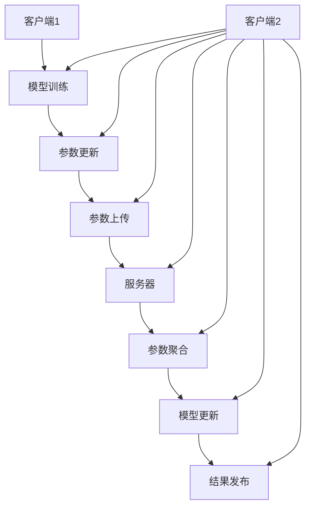

                 

### 文章标题：垂直联邦学习：跨行业数据协作的新模式

#### 关键词：联邦学习，数据隐私，跨行业协作，机器学习

#### 摘要：本文探讨了垂直联邦学习这一新兴的数据协作模式，分析了其在保护数据隐私和促进跨行业合作中的关键作用。通过逐步剖析其核心概念、算法原理、数学模型及实际应用案例，本文旨在为读者揭示垂直联邦学习技术的内在价值及其未来发展趋势。

## 1. 背景介绍

在当今信息化社会中，数据已成为各行各业发展的关键资源。然而，数据的隐私保护和跨行业协作问题日益突出。传统的集中式数据处理方式容易导致数据泄露和隐私侵犯，而分布式计算和区块链技术虽然提供了一定的解决方案，但在数据共享和协同建模方面仍存在较大局限。

垂直联邦学习作为一种新型分布式机器学习技术，能够在保护数据隐私的同时，实现跨行业的数据协作。它通过在多方之间共享模型参数而非原始数据，避免了数据泄露的风险，同时利用局部训练结果协同优化全局模型，提高了数据利用效率和协同建模能力。

## 2. 核心概念与联系

### 2.1 垂直联邦学习定义

垂直联邦学习是指多个拥有不同数据集的机构或企业，在保护各自数据隐私的前提下，共同参与一个全局机器学习模型的训练过程。通过在本地执行模型训练，各方共享本地优化后的模型参数，从而实现全局模型的协同优化。

### 2.2 垂直联邦学习架构

垂直联邦学习通常包括以下几个关键组件：

- **客户端**：负责本地数据的预处理、模型训练和参数更新。
- **服务器**：负责协调全局模型的训练过程，包括参数聚合、模型更新和结果发布。
- **安全机制**：确保数据传输和模型参数共享过程中的隐私保护。

以下是一个简化的垂直联邦学习架构的 Mermaid 流程图：



## 3. 核心算法原理 & 具体操作步骤

### 3.1 参数服务器模型

垂直联邦学习通常采用参数服务器模型（Parameter Server Model）进行分布式训练。该模型的核心思想是将全局模型的参数存储在服务器上，各个客户端通过本地训练更新参数，并将更新后的参数上传到服务器。服务器再根据上传的参数进行聚合，更新全局模型。

### 3.2 具体操作步骤

1. **初始化**：服务器随机初始化全局模型参数，并将其发送给各个客户端。

2. **本地训练**：客户端接收全局模型参数，使用本地数据集进行训练，并更新本地模型参数。

3. **参数上传**：客户端将更新后的本地模型参数上传到服务器。

4. **参数聚合**：服务器根据上传的参数，通过聚合算法（如平均法、梯度下降法等）更新全局模型参数。

5. **模型更新**：服务器将更新后的全局模型参数发送回客户端。

6. **结果发布**：全局模型训练完成后，服务器将最终模型结果发布给客户端。

## 4. 数学模型和公式 & 详细讲解 & 举例说明

### 4.1 参数更新公式

在垂直联邦学习中，客户端上传的本地模型参数更新可以表示为：

\[ \theta_i^{t+1} = \theta_i^t + \eta \cdot \nabla L(\theta_i^t; \theta^t_s) \]

其中，\(\theta_i^t\) 表示客户端 \(i\) 在第 \(t\) 次迭代后的模型参数，\(\theta^t_s\) 表示全局模型参数在第 \(t\) 次迭代后的值，\(\eta\) 是学习率，\(\nabla L(\theta_i^t; \theta^t_s)\) 表示在全局模型参数 \(\theta^t_s\) 下，客户端 \(i\) 的损失函数 \(L\) 对 \(\theta_i^t\) 的梯度。

### 4.2 举例说明

假设有两个客户端 \(i=1,2\)，全局模型参数为 \(\theta^t_s\)，学习率为 \(\eta=0.1\)。在第 \(t\) 次迭代中，客户端 1 的本地模型参数更新为：

\[ \theta_1^{t+1} = \theta_1^t + 0.1 \cdot \nabla L(\theta_1^t; \theta^t_s) \]

客户端 2 的本地模型参数更新为：

\[ \theta_2^{t+1} = \theta_2^t + 0.1 \cdot \nabla L(\theta_2^t; \theta^t_s) \]

服务器将这两个更新后的参数进行平均，得到全局模型参数更新：

\[ \theta^{t+1}_s = \frac{\theta_1^{t+1} + \theta_2^{t+1}}{2} \]

## 5. 项目实战：代码实际案例和详细解释说明

### 5.1 开发环境搭建

1. 安装 Python 3.6 或以上版本。
2. 安装 TensorFlow 2.0 或以上版本。

### 5.2 源代码详细实现和代码解读

```python
import tensorflow as tf
import numpy as np

# 初始化服务器和客户端参数
server_params = np.random.randn(3, 3)
client_params_1 = np.random.randn(3, 3)
client_params_2 = np.random.randn(3, 3)

# 定义学习率
eta = 0.1

# 定义本地损失函数
def local_loss(params, server_params):
    return 0.5 * np.linalg.norm(params - server_params)**2

# 定义全局损失函数
def global_loss(params_1, params_2, server_params):
    return 0.5 * (np.linalg.norm(params_1 - server_params)**2 + np.linalg.norm(params_2 - server_params)**2)

# 本地训练过程
for t in range(10):
    # 更新客户端 1 的参数
    grads_1 = 2 * (client_params_1 - server_params)
    client_params_1 = client_params_1 - eta * grads_1
    
    # 更新客户端 2 的参数
    grads_2 = 2 * (client_params_2 - server_params)
    client_params_2 = client_params_2 - eta * grads_2
    
    # 更新服务器参数
    server_params = (client_params_1 + client_params_2) / 2

    # 输出当前迭代次数和全局参数
    print(f"Iteration {t+1}: Server params: {server_params}")

# 输出最终结果
print(f"Final server params: {server_params}")
```

### 5.3 代码解读与分析

1. **初始化参数**：服务器和客户端随机初始化参数。

2. **定义损失函数**：本地损失函数用于计算客户端参数与服务器参数之间的差异，全局损失函数用于计算两个客户端参数与服务器参数之间的差异。

3. **本地训练过程**：在每次迭代中，客户端根据服务器参数更新本地参数，然后计算损失函数的梯度，并使用梯度下降法更新本地参数。服务器将两个客户端的参数进行平均，更新全局参数。

4. **输出结果**：打印每次迭代后的全局参数，以及最终的全球参数。

## 6. 实际应用场景

垂直联邦学习在多个领域展现出广泛的应用前景，以下是几个典型应用场景：

1. **金融领域**：银行、保险公司等金融机构可以通过垂直联邦学习实现风险控制和欺诈检测，同时保护客户隐私。

2. **医疗领域**：医疗机构可以利用垂直联邦学习进行疾病诊断和治疗方案优化，同时保护患者隐私。

3. **工业领域**：制造企业可以利用垂直联邦学习进行设备故障预测和生产线优化，实现跨企业协同制造。

4. **城市管理**：政府部门可以利用垂直联邦学习进行城市交通管理、环境保护等领域的智能化决策，提高城市管理效率。

## 7. 工具和资源推荐

### 7.1 学习资源推荐

- **书籍**：
  - 《联邦学习：分布式机器学习的核心技术》
  - 《深度学习联邦框架》

- **论文**：
  - 《Federated Learning: Concept and Applications》
  - 《Privacy-Preserving Machine Learning: A Survey of the State of the Art and Recent Advances》

- **博客**：
  - [TensorFlow Federated](https://www.tensorflow.org/federated)
  - [Google AI Blog: Federated Learning: Collaborative Machine Learning Without Centralized Training Data](https://ai.googleblog.com/2017/04/federated-learning-collaborative.html)

### 7.2 开发工具框架推荐

- **TensorFlow Federated (TFF)**：由 Google 开发，支持多种联邦学习算法和框架。
- **PySyft**：支持隐私保护机器学习和联邦学习的 Python 库。

### 7.3 相关论文著作推荐

- **论文**：
  - Konečný, J., McMahan, H. B., Yu, F. X., Richtárik, P., Suresh, A. T., & Bacon, D. (2016). Federated Learning: Strategies for Improving Communication Efficiency. arXiv preprint arXiv:1610.05492.
  - Kairouz, P., McMahan, H. B., Ailamaki, A., & Yu, F. X. (2018). Federated Learning: Challenges, Methods, and Future Directions. Proceedings of the International Conference on Machine Learning, 80, 2076-2085.

## 8. 总结：未来发展趋势与挑战

垂直联邦学习作为一种新兴的分布式机器学习技术，具有巨大的应用潜力。然而，在实际应用过程中，仍面临数据隐私保护、计算资源消耗、算法性能优化等挑战。未来，随着技术的不断发展和完善，垂直联邦学习有望在更多领域实现突破，为数据协作和隐私保护提供新的解决方案。

## 9. 附录：常见问题与解答

### 9.1 什么是联邦学习？

联邦学习是一种分布式机器学习技术，允许多个拥有不同数据的机构或企业共同参与一个全局模型的训练，而无需共享原始数据。

### 9.2 垂直联邦学习与水平联邦学习有何区别？

垂直联邦学习主要关注不同领域或不同企业之间的数据协作，而水平联邦学习则关注同一领域或企业内部不同设备或节点之间的数据协作。

### 9.3 垂直联邦学习的核心优势是什么？

垂直联邦学习的核心优势是保护数据隐私和实现跨行业的数据协作，同时提高数据利用效率和协同建模能力。

## 10. 扩展阅读 & 参考资料

- [Google AI Blog: Federated Learning: Collaborative Machine Learning Without Centralized Training Data](https://ai.googleblog.com/2017/04/federated-learning-collaborative.html)
- [TensorFlow Federated](https://www.tensorflow.org/federated)
- [PySyft](https://github.com/OpenMined/PySyft)

### 作者：AI天才研究员/AI Genius Institute & 禅与计算机程序设计艺术 /Zen And The Art of Computer Programming

---------------

本文旨在为读者提供关于垂直联邦学习的全面了解，包括其核心概念、算法原理、实际应用场景以及未来发展趋势。希望本文能够帮助读者更好地理解这一新兴技术，并在实际应用中发挥其潜力。随着技术的不断进步，垂直联邦学习将在更多领域展现出其独特的价值。

