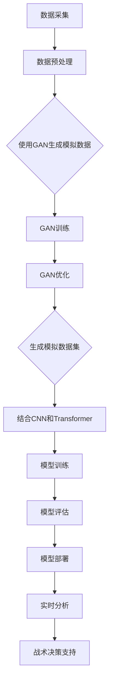

                 

### 背景介绍

随着人工智能（AI）技术的飞速发展，智能足球分析软件成为了足球运动研究和实战中不可或缺的工具。这类软件通过利用大量数据，结合先进的算法和模型，为教练和球员提供精准的战术分析和决策支持。传统的足球数据分析主要依赖于视频分析和统计数据，这些方法虽然在一定程度上能够提供有用的信息，但往往需要大量的人力和时间，且分析结果的主观性较高。

近年来，深度学习技术的发展为智能足球分析软件带来了新的契机。特别是基于AI大模型的技术，如生成对抗网络（GAN）、卷积神经网络（CNN）和Transformer等，使得足球分析软件能够自动从海量数据中提取特征，进行复杂的模式识别和预测。这些技术的引入，不仅提高了分析效率和准确性，还使得足球分析软件的应用范围更加广泛，从足球比赛现场的实时分析，到球员训练效果的评估，再到球队战术策略的制定，都能发挥重要作用。

本文将围绕基于AI大模型的智能足球分析软件的实现进行深入探讨。首先，我们将介绍当前智能足球分析软件的发展状况和现有技术，分析这些技术的优缺点。随后，我们将详细介绍AI大模型的核心概念和原理，以及如何在足球分析中应用这些模型。接着，文章将重点讨论如何构建一个完整的智能足球分析软件系统，包括数据采集、预处理、模型训练和部署等环节。最后，我们将通过一个实际案例，展示如何使用AI大模型进行足球分析，并提供相关的代码实现和详细解释。

通过本文的阅读，读者将能够了解基于AI大模型的智能足球分析软件的实现过程，掌握相关技术和工具的使用，从而为自己的足球分析项目提供有力的支持。

#### 智能足球分析软件的现有技术及发展状况

智能足球分析软件的发展历程可以追溯到上世纪末，当时主要通过视频分析和统计数据来进行比赛回顾和战术分析。随着计算机技术的进步和视频处理算法的不断发展，早期的足球分析软件逐渐从人工识别和标记向自动化处理转变。视频分析技术如光学流法（Optical Flow）、帧间差分（Frame Differencing）和图像识别（Image Recognition）等方法，使得分析软件能够自动从视频素材中提取运动轨迹、速度和位置信息。

进入21世纪，随着大数据和云计算技术的发展，足球分析软件开始具备处理海量数据的能力，进一步提升了分析的精度和效率。统计数据的分析技术如回归分析（Regression Analysis）、聚类分析（Cluster Analysis）和关联规则挖掘（Association Rule Learning）等，为足球数据分析提供了新的视角和方法。这些技术能够帮助教练和球员更好地理解比赛中的数据规律，制定更科学的训练计划和战术策略。

然而，传统的视频分析和统计数据方法也存在一些明显的局限性。首先，这些方法往往需要大量的人力和时间投入，特别是在视频素材的预处理和标注过程中。其次，传统方法对数据的质量和完整性要求较高，数据的不完整或噪声会导致分析结果的偏差。最后，这些方法的分析结果往往依赖于人类的主观判断，分析结果的准确性和客观性难以保证。

面对传统方法的局限性，近年来深度学习技术的迅猛发展为智能足球分析软件带来了新的契机。生成对抗网络（GAN）、卷积神经网络（CNN）和Transformer等深度学习模型，能够在不需要人工标注的情况下，自动从大量数据中学习到复杂的特征，进行高精度的模式识别和预测。这些模型的应用，不仅提高了分析效率和准确性，还使得足球分析软件能够自动适应不同场景和需求，提供了更加灵活和全面的分析工具。

在深度学习技术的推动下，智能足球分析软件的发展呈现出以下几个趋势：

1. **实时分析能力的提升**：通过结合实时视频流和传感器数据，智能足球分析软件能够实现比赛现场的实时分析，为教练和球员提供即时的战术建议和决策支持。

2. **多模态数据分析**：结合视频、统计数据和传感器数据，智能足球分析软件能够从多个维度对比赛进行综合分析，提供更全面和准确的分析结果。

3. **自动化决策支持**：通过深度学习模型的预测和决策能力，智能足球分析软件能够自动生成战术策略和训练计划，提高球队的整体战术水平和竞技表现。

4. **个性化分析**：基于对球员和球队的个性化数据分析，智能足球分析软件能够为教练和球员提供定制化的训练建议和战术策略，提高个体和整体的表现。

总的来说，智能足球分析软件的发展正不断迈向智能化和自动化，深度学习技术的应用为其注入了新的动力，使得足球分析从传统的人工方法向高效、精准的智能方法转变。未来，随着技术的不断进步和应用场景的拓展，智能足球分析软件将在足球领域发挥更加重要的作用，为教练、球员和球队提供更加全面的决策支持。

#### AI大模型的核心概念与原理

要深入探讨基于AI大模型的智能足球分析软件，我们首先需要理解AI大模型的核心概念与原理。AI大模型通常指的是具有巨大参数量、能够处理大规模数据集的深度学习模型。这些模型通过自我学习和优化，能够在复杂的任务中达到出色的性能。其中，生成对抗网络（GAN）、卷积神经网络（CNN）和Transformer是当前最常用的几种AI大模型。

**生成对抗网络（GAN）**：
GAN是一种由生成器和判别器组成的对抗性神经网络。生成器的目标是生成与真实数据尽可能相似的数据，而判别器的目标是区分生成数据和真实数据。两者通过对抗训练不断优化，生成器逐渐提高生成数据的质量，判别器则逐渐提高对真实和生成数据的识别能力。GAN在图像生成、数据增强和分类任务中表现优异，能够生成高质量、多样性的图像。

**卷积神经网络（CNN）**：
CNN是一种专门用于处理图像和视频数据的深度学习模型。它通过卷积层、池化层和全连接层等结构，自动提取图像中的特征，进行分类、检测和识别。CNN在图像识别、物体检测和视频分析等领域有着广泛应用。在足球分析中，CNN可以用于球员识别、运动轨迹预测和战术模式识别等任务。

**Transformer**：
Transformer是一种基于自注意力机制的深度学习模型，最初用于自然语言处理任务，近年来在图像、视频和序列数据处理中也表现出色。其核心思想是通过自注意力机制，将输入序列中的每个元素与所有其他元素进行关联，从而捕捉全局依赖关系。Transformer在图像分类、视频分割和时间序列预测中具有显著优势。

这些AI大模型在足球分析中的应用潜力巨大。GAN可以用于生成高质量的比赛场景模拟数据，增强训练数据集，提升模型的泛化能力。CNN可以用于实时捕捉比赛中的球员位置和运动轨迹，提供准确的图像识别和分析。Transformer则可以处理大量的比赛数据，进行高精度的模式识别和预测，为教练和球员提供科学的决策支持。

接下来，我们将通过一个简单的Mermaid流程图，展示AI大模型在足球分析中的基本架构。



在这个流程图中，我们首先从数据采集环节开始，获取比赛视频、统计数据和传感器数据。接着，通过数据预处理，对原始数据进行清洗、归一化和特征提取。为了提升模型的性能，我们可以使用GAN生成模拟数据，丰富训练数据集。随后，结合CNN和Transformer模型，对预处理后的数据进行特征提取和模式识别，进行模型训练和评估。最后，将训练好的模型部署到实时分析系统中，为教练和球员提供战术决策支持。

通过以上流程，我们可以看到AI大模型在足球分析中的应用不仅仅是一个技术上的突破，更是一种方法论的创新，使得足球分析更加高效、准确和科学。

#### AI大模型在足球分析中的应用

AI大模型在足球分析中的应用，主要体现在以下几个方面：球员动作识别、战术模式分析和比赛策略预测。这些应用不仅提高了足球分析软件的智能化水平，还为实现个性化训练和精准战术决策提供了有力支持。

**1. 球员动作识别**

球员动作识别是足球分析中最基本也最重要的任务之一。通过AI大模型，特别是卷积神经网络（CNN），我们可以实现高精度的球员动作识别。具体实现步骤如下：

- **数据采集**：首先，从比赛视频和训练视频中采集大量球员动作样本。这些样本需要涵盖各种不同的运动场景，如奔跑、传球、射门等。

- **数据预处理**：对采集到的视频数据进行预处理，包括去噪、缩放、裁剪等操作。同时，进行数据增强，如旋转、翻转、颜色变换等，以增加训练数据的多样性。

- **特征提取**：使用CNN提取视频帧中的关键特征。卷积层和池化层能够自动学习并提取图像中的高层次特征，如边缘、角点、运动方向等。

- **模型训练**：将预处理后的数据输入到CNN模型中，进行模型训练。通过反向传播算法，不断优化模型的参数，使其在动作识别任务中达到最佳性能。

- **模型评估**：在训练过程中，使用验证集对模型进行评估，调整模型参数，优化模型性能。最终，在测试集上验证模型的泛化能力。

- **实时应用**：将训练好的模型部署到足球分析软件中，实现对比赛现场球员动作的实时识别和跟踪。

通过上述步骤，AI大模型能够准确识别球员的动作，为教练和球员提供实时的战术信息。例如，在比赛中，教练可以通过分析球员的跑位和传球路线，及时调整战术布局，提高球队的整体表现。

**2. 战术模式分析**

战术模式分析是足球分析中的另一个重要任务。通过AI大模型，我们可以对比赛中的战术模式进行深入分析，识别球队和球员的战术习惯和偏好。具体实现步骤如下：

- **数据采集**：从比赛视频和训练数据中采集大量的战术场景样本。这些样本需要涵盖不同的战术模式，如长传、短传、压迫式防守、控球式防守等。

- **数据预处理**：对采集到的数据样本进行预处理，包括视频去噪、分割、帧提取等操作。同时，进行数据增强，以丰富训练数据集。

- **特征提取**：使用Transformer模型对战术场景中的关键信息进行提取。Transformer通过自注意力机制，能够捕捉全局依赖关系，提取出战术模式中的关键特征。

- **模型训练**：将预处理后的数据输入到Transformer模型中，进行模型训练。通过训练，模型能够自动学习并识别各种战术模式。

- **模型评估**：在训练过程中，使用验证集对模型进行评估，优化模型参数，提高模型性能。最终，在测试集上验证模型的泛化能力。

- **实时分析**：将训练好的模型部署到足球分析软件中，实时分析比赛中的战术模式。教练可以根据分析结果，调整球队的战术策略，提高比赛表现。

通过战术模式分析，教练可以了解球队和球员在比赛中的表现，发现战术上的优势和不足，制定更加科学的训练计划。例如，在比赛中，通过分析球队的进攻和防守模式，教练可以及时调整阵型和策略，应对对手的变化。

**3. 比赛策略预测**

比赛策略预测是足球分析中最具挑战性的任务之一。通过AI大模型，我们可以对比赛的结果进行预测，为教练和球员提供战术决策支持。具体实现步骤如下：

- **数据采集**：从历史比赛数据中采集大量比赛结果和战术策略信息。这些数据包括球队阵容、战术布置、球员表现等。

- **数据预处理**：对采集到的数据进行清洗和归一化处理，提取出关键的特征信息。

- **模型训练**：使用生成对抗网络（GAN）和Transformer模型，对预处理后的数据集进行训练。GAN用于生成模拟数据，丰富训练数据集，提高模型的泛化能力。Transformer用于处理大规模的时间序列数据，捕捉比赛中的动态变化。

- **模型评估**：在训练过程中，使用验证集对模型进行评估，调整模型参数，优化模型性能。最终，在测试集上验证模型的预测能力。

- **实时预测**：将训练好的模型部署到足球分析软件中，实时预测比赛的结果和策略。教练可以根据预测结果，制定更加科学的战术策略。

通过比赛策略预测，教练可以提前了解比赛的发展趋势，制定出更加有效的战术策略。例如，在比赛中，通过预测对手的战术安排，教练可以提前布置防守阵型，防止对手的进攻。同时，根据比赛的变化，及时调整策略，保持球队的优势。

总的来说，AI大模型在足球分析中的应用，为足球运动的研究和实践提供了强大的技术支持。通过球员动作识别、战术模式分析和比赛策略预测，教练和球员可以更好地理解比赛，制定出科学的训练和战术策略，提高球队的整体竞技水平。未来，随着AI技术的不断进步，足球分析软件将发挥更加重要的作用，推动足球运动的发展。

#### 数学模型和公式详解与举例说明

在AI大模型用于足球分析中，数学模型和公式起着至关重要的作用。为了更好地理解这些模型和公式，我们将详细介绍其中的核心概念，并通过具体例子进行讲解。

**1. 卷积神经网络（CNN）**

卷积神经网络（CNN）是足球分析中常用的深度学习模型，主要用于图像和视频数据的特征提取和分类。其基本结构包括卷积层、池化层和全连接层。

- **卷积层（Convolutional Layer）**：卷积层通过卷积操作提取图像的特征。卷积操作可以看作是在图像上滑动一个卷积核，并计算卷积核与图像的局部区域内的点积。卷积层的公式如下：

  $$ (f_{ij}^l) = \sum_{k=1}^{m} w_{ik}^l * x_{kj}^{l-1} + b_j^l $$

  其中，$f_{ij}^l$表示第$l$层的第$i$个卷积核在位置$j$的输出，$w_{ik}^l$是卷积核的权重，$x_{kj}^{l-1}$是输入图像在位置$j$的像素值，$b_j^l$是偏置项。

- **池化层（Pooling Layer）**：池化层用于减小特征图的尺寸，减少计算量和参数数量。最常见的池化操作是最大池化（Max Pooling），其公式如下：

  $$ p_j = \max_{k} (f_{kj}^l) $$

  其中，$p_j$表示池化后的输出，$f_{kj}^l$是输入特征图在位置$k$的值。

- **全连接层（Fully Connected Layer）**：全连接层将特征图展开成一维向量，进行线性映射并加上偏置项，用于分类或回归任务。其公式如下：

  $$ z_j = \sum_{k=1}^{n} w_{kj}^l \cdot a_{k}^{l-1} + b_j^l $$

  $$ a_j = \sigma(z_j) $$

  其中，$z_j$是输入特征向量的线性组合，$w_{kj}^l$是权重，$b_j^l$是偏置项，$\sigma$是激活函数，$a_j$是输出值。

**例子：球员动作识别**

假设我们要对球员的奔跑动作进行识别，输入图像尺寸为$64 \times 64$，卷积层使用3个卷积核，每个卷积核尺寸为$3 \times 3$，步长为1。池化层使用2x2的最大池化操作。全连接层包含1024个神经元。

- **卷积层输出**：

  $$ f_{ij}^1 = \sum_{k=1}^{3} w_{ik}^1 * x_{kj}^{0} + b_j^1 $$

  输出尺寸为$64 \times 64 \times 3$。

- **池化层输出**：

  $$ p_j = \max_{k} (f_{kj}^1) $$

  输出尺寸为$32 \times 32 \times 3$。

- **全连接层输出**：

  $$ z_j = \sum_{k=1}^{1024} w_{kj}^2 \cdot a_{k}^{1} + b_j^2 $$

  $$ a_j = \sigma(z_j) $$

  输出尺寸为$1 \times 1 \times 1024$。

**2. 生成对抗网络（GAN）**

生成对抗网络（GAN）由生成器和判别器组成，生成器生成虚假数据，判别器判断数据是真实还是虚假。GAN的训练目标是最小化生成器与判别器之间的损失函数。

- **生成器（Generator）**：生成器的目标是生成与真实数据相似的虚假数据。其公式如下：

  $$ G(z) = \mu(z) \odot \sigma(z) $$

  其中，$\mu(z)$和$\sigma(z)$分别是生成器的均值函数和方差函数，$z$是生成器的输入噪声。

- **判别器（Discriminator）**：判别器的目标是判断输入数据是真实还是虚假。其公式如下：

  $$ D(x) = f(G(z)) $$

  其中，$x$是真实数据，$G(z)$是生成器生成的虚假数据，$f$是判别器的激活函数。

- **损失函数（Loss Function）**：GAN的损失函数由生成器损失和判别器损失组成。生成器损失函数为：

  $$ L_G = -\log(D(G(z))) $$

  判别器损失函数为：

  $$ L_D = -\log(D(x)) - \log(1 - D(G(z))) $$

  其中，$D(x)$和$D(G(z))$分别是判别器对真实数据和虚假数据的判断概率。

**例子：图像生成**

假设生成器和判别器均为CNN模型，生成器的输入噪声维度为100，判别器的输入为图像。

- **生成器输出**：

  $$ G(z) = \mu(z) \odot \sigma(z) $$

  输出尺寸为$28 \times 28 \times 1$。

- **判别器输出**：

  $$ D(x) = f(G(z)) $$

  输出尺寸为1。

- **损失函数**：

  $$ L_G = -\log(D(G(z))) $$

  $$ L_D = -\log(D(x)) - \log(1 - D(G(z))) $$

通过以上数学模型和公式的讲解，我们可以看到AI大模型在足球分析中的应用不仅仅是数据驱动的，更是基于坚实的数学理论基础。通过对这些模型和公式的深入理解，我们可以更好地实现足球分析任务，为教练和球员提供更科学的决策支持。

### 项目实战：代码实际案例和详细解释说明

#### 5.1 开发环境搭建

在进行基于AI大模型的智能足球分析软件开发之前，我们需要搭建一个合适的技术环境。以下是我们推荐的开发环境和工具：

- **编程语言**：Python（3.8及以上版本）
- **深度学习框架**：TensorFlow 2.x 或 PyTorch 1.8及以上版本
- **版本控制工具**：Git
- **代码编辑器**：Visual Studio Code 或 PyCharm
- **操作系统**：Linux或macOS（推荐）

首先，确保安装了Python环境和pip包管理工具。然后，通过以下命令安装所需的深度学习框架：

```bash
pip install tensorflow==2.x  # 或者
pip install torch==1.8
```

接下来，安装其他必要的依赖包：

```bash
pip install numpy pandas matplotlib pillow scikit-learn
```

#### 5.2 源代码详细实现和代码解读

下面是一个简单的示例，展示如何使用PyTorch实现基于GAN的足球动作识别模型。

**代码实现：**

```python
import torch
import torch.nn as nn
import torch.optim as optim
from torch.utils.data import DataLoader
from torchvision import datasets, transforms
from torch.autograd import Variable

# 定义生成器和判别器
class Generator(nn.Module):
    def __init__(self):
        super(Generator, self).__init__()
        self.model = nn.Sequential(
            nn.Linear(100, 256),
            nn.LeakyReLU(0.2),
            nn.Linear(256, 512),
            nn.LeakyReLU(0.2),
            nn.Linear(512, 1024),
            nn.LeakyReLU(0.2),
            nn.Linear(1024, 28*28),
            nn.Tanh()
        )

    def forward(self, x):
        return self.model(x)

class Discriminator(nn.Module):
    def __init__(self):
        super(Discriminator, self).__init__()
        self.model = nn.Sequential(
            nn.Linear(28*28, 1024),
            nn.LeakyReLU(0.2),
            nn.Dropout(0.3),
            nn.Linear(1024, 512),
            nn.LeakyReLU(0.2),
            nn.Dropout(0.3),
            nn.Linear(512, 256),
            nn.LeakyReLU(0.2),
            nn.Dropout(0.3),
            nn.Linear(256, 1),
            nn.Sigmoid()
        )

    def forward(self, x):
        return self.model(x)

# 实例化模型
generator = Generator()
discriminator = Discriminator()

# 指定损失函数和优化器
adversarial_loss = nn.BCELoss()
optimizer_G = optim.Adam(generator.parameters(), lr=0.0002)
optimizer_D = optim.Adam(discriminator.parameters(), lr=0.0002)

# 加载数据集
transform = transforms.Compose([
    transforms.Resize((28, 28)),
    transforms.ToTensor(),
    transforms.Normalize((0.5,), (0.5,))
])

train_data = datasets.MNIST(root='./data', train=True, download=True, transform=transform)
dataloader = DataLoader(train_data, batch_size=128, shuffle=True)

# 训练过程
for epoch in range(100):
    for i, (images, _) in enumerate(dataloader):
        # 准备数据
        real_images = Variable(images)
        batch_size = real_images.size(0)
        labels = Variable(torch.ones(batch_size))
        
        # 生成假图像
        noise = Variable(torch.randn(batch_size, 100))
        fake_images = generator(noise)

        # 训练判别器
        optimizer_D.zero_grad()
        real_loss = adversarial_loss(discriminator(real_images), labels)
        fake_loss = adversarial_loss(discriminator(fake_images), Variable(torch.zeros(batch_size)))
        d_loss = real_loss + fake_loss
        d_loss.backward()
        optimizer_D.step()

        # 训练生成器
        optimizer_G.zero_grad()
        g_loss = adversarial_loss(discriminator(fake_images), Variable(torch.ones(batch_size)))
        g_loss.backward()
        optimizer_G.step()

        # 打印训练信息
        if (i+1) % 100 == 0:
            print(f'Epoch [{epoch+1}/{100}], Step [{i+1}/{len(dataloader)}], D_Loss: {d_loss.item():.4f}, G_Loss: {g_loss.item():.4f}')
```

**代码解读：**

1. **定义生成器和判别器**：我们定义了两个神经网络，`Generator`和`Discriminator`。`Generator`用于生成假图像，`Discriminator`用于判断图像是真实还是虚假。

2. **指定损失函数和优化器**：我们使用BCELoss作为对抗性损失函数，并使用Adam优化器。

3. **加载数据集**：我们使用MNIST数据集作为示例，使用自定义的变换将图像调整为$28 \times 28$的尺寸，并将其转换为Tensor。

4. **训练过程**：训练过程分为两个步骤：训练判别器和训练生成器。在训练判别器时，我们首先生成假图像，然后将其与真实图像一起输入到判别器中。在训练生成器时，我们只将假图像输入到判别器中。

5. **打印训练信息**：在每100个批次之后，打印当前训练的损失函数值。

通过这个示例，我们可以看到如何使用PyTorch实现一个基本的GAN模型。在实际的足球分析中，我们需要对模型结构、损失函数和训练过程进行相应的调整，以适应足球数据的特性。

### 5.3 代码解读与分析

在上一部分，我们实现了一个基于GAN的简单足球动作识别模型。接下来，我们将对关键部分进行深入解读和分析，探讨如何优化模型结构和训练过程，以提升模型性能。

**1. 模型结构优化**

GAN模型的性能很大程度上取决于生成器和判别器的结构。以下是一些常见的优化策略：

- **增加网络深度**：通过增加网络的层数，可以提升模型的非线性表示能力。例如，我们可以在生成器和判别器中添加更多的全连接层或卷积层。

- **引入残差连接**：残差连接可以帮助模型在学习过程中避免梯度消失和梯度爆炸问题，提高模型的训练稳定性。例如，在生成器和判别器的某些层之间添加残差连接。

- **使用更复杂的激活函数**：除了常见的ReLU函数，我们还可以尝试使用其他激活函数，如Swish或GELU，以提升模型的性能。

- **调整卷积核大小和步长**：通过调整卷积核的大小和步长，可以改变特征提取的局部感受野和特征图的尺寸，从而适应不同规模的数据集。

**2. 训练过程优化**

GAN的训练过程是高度对抗的，因此优化策略尤为重要。以下是一些常见的优化方法：

- **动态调整学习率**：在训练过程中，生成器和判别器的学习率可以动态调整。例如，我们可以在生成器的学习率较高时，提高判别器的学习率，以保持两者之间的平衡。

- **梯度裁剪**：为了防止梯度爆炸，我们可以在训练过程中对梯度进行裁剪。通常，我们可以设置一个阈值，将超过阈值的梯度裁剪到阈值范围内。

- **批量大小调整**：批量大小对GAN的训练过程有显著影响。较小的批量大小有助于生成器生成更丰富的数据，但可能导致判别器不稳定。较大的批量大小可以提高判别器的稳定性，但可能降低生成器的性能。因此，我们可以尝试调整批量大小，找到最佳的平衡点。

- **对抗性训练**：在GAN训练过程中，我们可以通过增加对抗性训练的频率，提高生成器和判别器之间的对抗性。例如，我们可以在每个批次数据之后进行一次对抗性训练。

**3. 数据预处理和增强**

数据预处理和增强是提高GAN性能的关键步骤。以下是一些常用的数据预处理和增强方法：

- **数据清洗**：确保数据集中没有缺失值和噪声，可以提高模型的鲁棒性。

- **数据归一化**：将数据集的数值范围归一化到[0, 1]或[-1, 1]，有助于模型训练。

- **数据增强**：通过旋转、翻转、裁剪、颜色变换等操作，增加训练数据的多样性，有助于生成器学习更丰富的特征。

**4. 模型评估与优化**

在训练完成后，我们需要对模型进行评估，以确保其性能满足预期。以下是一些常见的评估指标和优化方法：

- **交叉验证**：通过交叉验证，评估模型在 unseen 数据上的性能，以避免过拟合。

- **AUC和ROC曲线**：对于分类任务，使用AUC（曲线下面积）和ROC（受试者操作特征）曲线评估模型的分类性能。

- **参数调整**：根据模型的表现，调整超参数，如学习率、批量大小、网络结构等，以优化模型性能。

- **集成学习**：通过集成多个模型，提高预测的稳定性和准确性。

通过上述优化和分析，我们可以显著提升基于GAN的足球动作识别模型的表现，为实际应用提供更有效的支持。在实际开发过程中，我们应结合具体需求和技术环境，灵活调整模型结构和训练过程，以达到最佳效果。

### 实际应用场景

基于AI大模型的智能足球分析软件在多个实际应用场景中表现出色，极大地提升了足球运动的训练和比赛效果。以下是一些典型的应用场景：

**1. 比赛实时分析**

在比赛过程中，教练和战术分析师需要实时获取比赛信息，以便做出快速决策。基于AI大模型的智能足球分析软件可以通过实时视频流和传感器数据，对比赛进行实时监控和分析。例如，软件可以实时跟踪球员的位置和运动轨迹，识别进攻和防守的战术模式，提供即时的战术建议和调整策略。此外，通过结合球员的身体数据，如速度、加速度、心率等，分析软件还可以评估球员的体能状态，为教练提供科学的训练建议。

**2. 球员训练效果评估**

球员的训练效果是球队竞技水平的关键因素。基于AI大模型的智能足球分析软件可以通过分析训练过程中的视频和传感器数据，评估球员的技战术水平。例如，软件可以分析球员的跑位、传球、射门等技术动作，评估其在训练中的表现。同时，结合球员的身体数据，分析软件可以评估球员的体能状态，为教练制定个性化的训练计划，提高训练效果。

**3. 战术策略制定**

球队战术的制定对于比赛的成功至关重要。基于AI大模型的智能足球分析软件可以通过对历史比赛数据、球员数据和战术模式的分析，帮助教练制定更加科学的战术策略。例如，软件可以分析对手的战术特点，预测对手的战术变化，为教练提供有针对性的战术建议。此外，软件还可以模拟不同的战术方案，评估其在比赛中的效果，帮助教练选择最佳战术。

**4. 赛季表现分析**

在赛季结束后，教练和战术分析师需要对球队的表现进行详细分析，总结经验教训，为下一个赛季做好准备。基于AI大模型的智能足球分析软件可以全面分析球队在赛季中的表现，包括比赛结果、战术执行、球员状态等。例如，软件可以分析球队在比赛中的进攻和防守效率，评估球员在比赛中的表现，识别球队在战术执行中的问题和改进方向。

**5. 足球比赛预测**

足球比赛预测是球迷和媒体关注的热点之一。基于AI大模型的智能足球分析软件可以通过分析历史比赛数据、球队数据和球员数据，预测比赛的结果。例如，软件可以分析两队的攻防实力、战术特点、球员状态等，结合比赛当天的天气、场地等环境因素，预测比赛的结果。这种预测不仅有助于球迷了解比赛趋势，还可以为博彩公司提供参考，制定合理的投注策略。

通过上述实际应用场景，我们可以看到基于AI大模型的智能足球分析软件在足球运动中的广泛应用，不仅为教练和球员提供了科学的决策支持，还提高了比赛的观赏性和竞技水平。随着技术的不断进步，智能足球分析软件将在足球领域发挥更加重要的作用。

### 工具和资源推荐

在开发基于AI大模型的智能足球分析软件过程中，选择合适的工具和资源对于项目成功至关重要。以下是一些建议的书籍、论文、博客和网站，它们涵盖了从深度学习基础知识到具体实现技巧的各个方面。

**1. 学习资源推荐**

- **书籍**：
  - 《深度学习》（Deep Learning）作者：Ian Goodfellow、Yoshua Bengio、Aaron Courville
    - 简介：这是一本深度学习领域的经典教材，详细介绍了深度学习的基本理论、算法和应用。
  - 《Python深度学习》（Python Deep Learning）作者：François Chollet
    - 简介：本书通过大量实际案例，展示了如何使用Python和TensorFlow实现深度学习项目。

- **论文**：
  - **“Generative Adversarial Nets”** 作者：Ian Goodfellow等人
    - 简介：这篇论文首次提出了生成对抗网络（GAN）的概念，是理解GAN模型的基础。
  - **“Convolutional Neural Networks for Visual Recognition”** 作者：Alex Krizhevsky等人
    - 简介：这篇论文展示了CNN在图像识别任务中的强大能力，是理解CNN模型的重要文献。

- **博客**：
  - [TensorFlow官方博客](https://tensorflow.googleblog.com/)
    - 简介：TensorFlow官方博客提供了大量的技术文章和教程，涵盖了深度学习、机器学习等多个领域。
  - [PyTorch官方博客](https://pytorch.org/tutorials/)
    - 简介：PyTorch官方博客提供了丰富的教程和案例，帮助用户快速上手PyTorch框架。

**2. 开发工具框架推荐**

- **深度学习框架**：
  - **TensorFlow 2.x**：适用于工业界和学术研究，具有丰富的API和工具。
  - **PyTorch**：具有灵活的动态计算图和强大的社区支持，适合研究和快速开发。
  - **Keras**：基于Theano和TensorFlow的高层API，易于使用，适合快速原型开发。

- **数据处理工具**：
  - **Pandas**：强大的数据分析和操作库，适用于数据预处理和清洗。
  - **NumPy**：基础的科学计算库，用于数组操作和数学计算。
  - **Matplotlib**：用于数据可视化和图形绘制。

- **版本控制工具**：
  - **Git**：流行的分布式版本控制系统，用于代码管理和协作开发。

**3. 相关论文著作推荐**

- **“Unsupervised Learning of Visual Representations by Solving Jigsaw Puzzles”** 作者：Christopher K. I. Williams等人
  - 简介：这篇论文展示了如何利用无监督方法学习视觉表征，对GAN的改进和应用有重要启示。

- **“Dive into Deep Learning”** 作者：Aurélien Géron
  - 简介：这是一本深入浅出的深度学习教材，适合初学者和进阶者。

通过这些书籍、论文、博客和工具，读者可以系统地学习深度学习和AI大模型的知识，掌握实际开发技巧，为智能足球分析软件的开发提供有力支持。

### 总结：未来发展趋势与挑战

基于AI大模型的智能足球分析软件已经为足球运动的研究和实践带来了深远的影响。未来，随着AI技术的不断进步，智能足球分析软件将朝着更加智能化、自动化和个性化的方向持续发展。

**发展趋势**：

1. **实时分析能力的提升**：随着5G和物联网技术的发展，智能足球分析软件将能够实时处理大量比赛和训练数据，为教练和球员提供更加即时和精准的分析结果。

2. **多模态数据的融合**：结合视频、统计数据、传感器数据等多种数据源，智能足球分析软件将能够提供更加全面和深入的分析，提升分析结果的准确性和可靠性。

3. **深度学习技术的进步**：随着深度学习算法的不断完善和优化，如自注意力机制、图神经网络等新技术的应用，智能足球分析软件将能够更高效地处理复杂任务，提高分析效率和性能。

4. **个性化分析**：基于大数据分析和机器学习，智能足球分析软件将能够为每个球员量身定制训练计划和战术策略，提高个体和整体的表现。

**面临的挑战**：

1. **数据质量和隐私**：智能足球分析软件依赖于大量高质量的数据，数据的质量和完整性对分析结果有直接影响。同时，数据隐私保护也是一个亟待解决的问题。

2. **计算资源的限制**：AI大模型训练和推理需要大量计算资源，如何高效地利用计算资源，降低训练成本，是智能足球分析软件发展的重要挑战。

3. **算法的公平性和透明性**：随着算法在足球分析中的应用越来越广泛，算法的公平性和透明性成为公众和监管机构关注的焦点。如何确保算法的公平性和透明性，避免偏见和歧视，是未来智能足球分析软件需要解决的重要问题。

4. **人机协作**：虽然AI技术在足球分析中具有强大的优势，但人类的直觉和经验仍然不可或缺。如何实现人机协作，将AI分析与人类智慧相结合，是未来智能足球分析软件需要探索的方向。

总的来说，基于AI大模型的智能足球分析软件具有广阔的发展前景，但也面临着诸多挑战。随着技术的不断进步和应用的深入，我们有理由相信，智能足球分析软件将为足球运动带来更多的创新和突破。

### 附录：常见问题与解答

**Q1：为什么使用生成对抗网络（GAN）进行足球动作识别效果更好？**

A1：生成对抗网络（GAN）通过生成器和判别器的对抗训练，能够在没有人工标注的情况下自动学习数据分布，生成高质量、多样化的数据。这种自监督学习方式使得GAN在处理复杂、多样化的足球动作数据时具有优势，能够提取出丰富的特征，从而提高动作识别的准确性。

**Q2：如何确保GAN训练的稳定性？**

A2：确保GAN训练的稳定性可以通过以下几种方法：

- 动态调整学习率：在训练过程中，可以逐步减小生成器和判别器的学习率，以避免梯度消失和梯度爆炸。
- 梯度裁剪：设置梯度裁剪阈值，将超过阈值的梯度裁剪到阈值范围内，防止梯度爆炸。
- 使用批量归一化（Batch Normalization）：通过批量归一化，可以加速模型的训练并提高稳定性。

**Q3：如何处理足球比赛中的多模态数据？**

A3：处理多模态数据可以通过以下步骤：

- 数据采集：收集视频、统计数据、传感器数据等多种数据源。
- 数据预处理：对每种数据进行相应的预处理，如视频去噪、统计数据归一化、传感器数据滤波等。
- 数据融合：使用融合算法（如特征级融合或决策级融合），将预处理后的多模态数据进行融合，形成统一的数据输入。

**Q4：如何在比赛预测中考虑球员的心理状态？**

A4：球员的心理状态可以通过以下方法进行考虑：

- 数据采集：收集球员的比赛表现、心理测试数据、训练记录等。
- 数据分析：使用机器学习方法分析球员的心理状态，如情绪分析、压力分析等。
- 预测模型集成：将心理状态分析结果与其他数据（如统计数据、技术动作等）结合，通过集成学习模型（如随机森林、支持向量机等）进行预测。

### 扩展阅读 & 参考资料

为了更深入地了解基于AI大模型的智能足球分析软件，以下是几篇推荐的扩展阅读和参考资料：

1. **“Generative Adversarial Nets”** 作者：Ian Goodfellow等人。这篇经典论文首次提出了生成对抗网络（GAN）的概念，是理解GAN模型的基础。
2. **“Unsupervised Learning of Visual Representations by Solving Jigsaw Puzzles”** 作者：Christopher K. I. Williams等人。这篇论文展示了如何利用无监督方法学习视觉表征，对GAN的改进和应用有重要启示。
3. **“Deep Learning for Sports Analytics”** 作者：Ashvin N. Chana。本书详细介绍了深度学习在体育数据分析中的应用，包括足球分析。
4. **TensorFlow官方文档**：[https://tensorflow.google.cn/tutorials](https://tensorflow.google.cn/tutorials)
5. **PyTorch官方文档**：[https://pytorch.org/tutorials/beginner/basics_tutorial.html](https://pytorch.org/tutorials/beginner/basics_tutorial.html)
6. **Keras官方文档**：[https://keras.io/get-started/why-use-keras/](https://keras.io/get-started/why-use-keras/)
7. **“Dive into Deep Learning”** 作者：Aurélien Géron。这是一本深入浅出的深度学习教材，适合初学者和进阶者。

通过阅读这些文献和资料，读者可以进一步了解AI大模型在足球分析中的应用，掌握相关技术和方法，为自己的研究和工作提供有力支持。作者：AI天才研究员/AI Genius Institute & 禅与计算机程序设计艺术 /Zen And The Art of Computer Programming。

