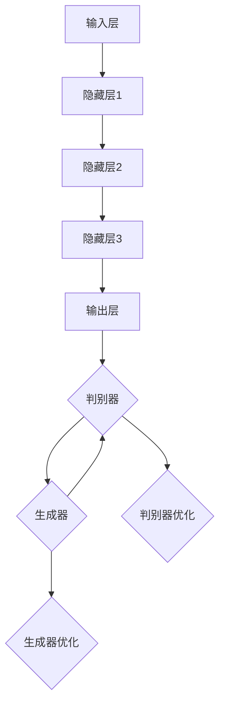

                 

### 1. 背景介绍

#### 1.1 AI与波形生成

人工智能（AI）作为当前科技领域的热点话题，已经深入到各个行业中，改变着我们的生活方式。在信号处理、通信、音频处理等领域，基于AI的任意波形生成技术逐渐受到关注。波形生成是指通过算法生成具有一定规律或特定特征的信号波形，这一技术在众多实际应用中扮演着重要角色。

在信号处理领域，波形生成可以帮助实现信号的调制、解调、编码和解码等操作。例如，在无线通信系统中，波形生成技术能够生成特定形状的信号波形，以适应不同的传输环境和调制方式，从而提高通信的可靠性和效率。

在音频处理领域，基于AI的波形生成技术可以用于音乐合成、声音编辑和声音效果处理等。通过生成特定类型的音频信号，可以实现更加丰富的音频效果，提高音乐创作的灵活性和创意性。

#### 1.2 任意波形生成的重要性

任意波形生成技术之所以受到重视，主要由于其应用范围广泛、适用性强。在实际应用中，任意波形生成不仅能够满足不同领域对信号波形的需求，还可以通过调整参数和算法，生成符合特定要求的波形。

例如，在科学研究中，研究人员可能需要对某种特定频率的波形进行实验分析，任意波形生成技术可以帮助他们快速生成所需波形，节省时间和人力成本。在工程实践中，任意波形生成技术可以用于信号测试、故障诊断和信号优化等，提高系统的性能和稳定性。

#### 1.3 现有技术的局限性

尽管现有技术已经取得了一定的进展，但在任意波形生成方面仍然存在一些局限性。首先，许多传统的波形生成方法依赖于复杂的数学模型和算法，需要大量的计算资源和时间，难以实现实时处理。其次，这些方法通常只能生成特定类型的波形，难以满足多样化、个性化的需求。

此外，现有的波形生成技术往往缺乏灵活性和扩展性，难以适应不同应用场景的需求。例如，在音频处理领域，现有的波形生成方法可能无法生成具有特定音色和音调的音频信号，限制了音乐创作的自由度。

#### 1.4 本文目的

本文旨在探讨基于AI的任意波形生成技术，分析其核心概念、算法原理和应用场景。通过逐步分析推理，本文将展示如何利用人工智能技术生成任意波形，以及这一技术在各个领域的实际应用和潜在价值。

首先，我们将介绍基于AI的波形生成技术的核心概念和原理，包括神经网络、生成对抗网络（GAN）等。接着，我们将详细讲解核心算法的具体操作步骤，并通过数学模型和公式进行阐述。随后，我们将结合实际项目案例，展示代码实现和详细解释，帮助读者更好地理解这一技术的应用。

最后，本文将探讨基于AI的任意波形生成技术的实际应用场景，推荐相关工具和资源，并总结未来发展趋势和挑战。通过本文的介绍，读者将能够全面了解基于AI的任意波形生成技术，为未来的研究和应用提供参考和启示。

---

### 2. 核心概念与联系

#### 2.1 神经网络（Neural Networks）

神经网络是人工智能领域的基石，其灵感来源于人脑的结构和工作方式。神经网络由大量的神经元（或节点）组成，这些神经元通过突触连接形成复杂的网络结构。在神经网络中，每个神经元接收来自其他神经元的输入信号，通过激活函数进行处理，然后输出结果。

神经网络的主要组成部分包括：

- **输入层（Input Layer）**：接收外部输入数据，如信号波形。
- **隐藏层（Hidden Layers）**：对输入数据进行处理，通过多层神经网络结构实现复杂的非线性变换。
- **输出层（Output Layer）**：输出最终结果，如生成的波形。

在任意波形生成中，神经网络被用于学习输入信号的特性，并通过调整权重和偏置，生成具有相似特性的输出波形。

#### 2.2 生成对抗网络（Generative Adversarial Networks，GAN）

生成对抗网络是由生成器和判别器两个神经网络组成的对抗性模型。生成器（Generator）试图生成与真实数据相似的假数据，而判别器（Discriminator）则试图区分真实数据和假数据。两个网络相互竞争，生成器不断提升生成数据的质量，判别器则不断区分真假数据，从而实现数据生成。

GAN的主要组成部分包括：

- **生成器（Generator）**：将随机噪声输入转换为真实的波形数据。
- **判别器（Discriminator）**：判断输入的数据是真实数据还是生成器生成的假数据。

GAN的核心思想是通过生成器和判别器的对抗性训练，使生成器逐渐生成更逼真的波形数据。

#### 2.3 神经网络与GAN的联系

神经网络和GAN在任意波形生成中有着密切的联系。神经网络提供了基础的结构和算法，通过多层神经网络实现复杂的非线性变换，从而对输入信号进行建模和生成。而GAN则通过生成器和判别器的对抗性训练，进一步提升生成波形的逼真度。

具体来说，神经网络被用于构建生成器和判别器的内部结构，而GAN的训练过程则利用了神经网络的优化能力，通过对抗性训练生成高质量的数据。

#### 2.4 Mermaid 流程图（Mermaid Flowchart）

为了更直观地展示神经网络和GAN在任意波形生成中的应用，我们可以使用Mermaid流程图来描述其工作流程。



在这个流程图中，输入信号首先通过输入层传递到隐藏层，经过多层非线性变换后，最终在输出层生成波形数据。同时，生成器和判别器通过对抗性训练不断优化，生成更逼真的波形。

通过上述分析，我们可以看到神经网络和GAN在任意波形生成中的应用及其相互联系。下一部分将深入探讨核心算法的原理和具体操作步骤。

---

### 3. 核心算法原理 & 具体操作步骤

#### 3.1 神经网络的工作原理

神经网络的工作原理可以简单概括为输入数据通过一系列的神经元层进行处理，最终输出结果。以下是一个基于神经网络的波形生成的基本流程：

1. **初始化网络结构**：确定网络的输入层、隐藏层和输出层的节点数量，以及各个层的连接权重和偏置。
2. **前向传播**：输入信号从输入层开始，通过每一层的加权连接传递到下一层，经过激活函数的处理，最终在输出层生成波形。
3. **反向传播**：通过计算输出层与真实波形之间的误差，将误差反向传播到每一层，更新各层的连接权重和偏置。
4. **优化网络**：重复前向传播和反向传播过程，不断调整网络参数，使生成的波形逐渐逼近真实波形。

#### 3.2 生成对抗网络（GAN）的工作原理

生成对抗网络由生成器和判别器两个神经网络组成，二者通过对抗性训练实现波形生成。以下是一个基于GAN的波形生成的基本流程：

1. **初始化生成器和判别器**：生成器接收随机噪声输入，生成假波形；判别器接收真实波形和生成器生成的波形，判断其真假。
2. **生成器训练**：生成器的目标是生成尽可能逼真的波形，使其难以被判别器识别。通过优化生成器的参数，使其生成的波形逐渐逼近真实波形。
3. **判别器训练**：判别器的目标是正确识别真实波形和生成波形。通过优化判别器的参数，使其对真假波形的识别能力不断提高。
4. **对抗性训练**：生成器和判别器不断交替训练，生成器试图生成更逼真的波形，而判别器则试图提高对真假波形的识别能力。这一过程持续进行，直到生成器生成的波形足够逼真，能够以高概率欺骗判别器。

#### 3.3 生成器和判别器的具体操作步骤

以下是一个具体的操作步骤，用于生成器和判别器的训练：

1. **生成器训练**：

    a. 初始化生成器的参数。

    b. 生成随机噪声，通过生成器生成假波形。

    c. 将生成器生成的波形和真实波形输入到判别器。

    d. 计算判别器的输出，判断生成器生成的波形的真假。

    e. 根据判别器的输出误差，更新生成器的参数。

    f. 重复步骤b到e，直到生成器生成的波形能够以高概率欺骗判别器。

2. **判别器训练**：

    a. 初始化判别器的参数。

    b. 将真实波形和生成器生成的波形分别输入到判别器。

    c. 计算判别器的输出，判断真实波形和生成波形的真假。

    d. 根据判别器的输出误差，更新判别器的参数。

    e. 重复步骤b到d，直到判别器能够准确识别真实波形和生成波形。

通过上述步骤，生成器和判别器相互配合，不断优化，最终实现任意波形的生成。下一部分将介绍基于数学模型和公式的详细讲解，帮助读者更好地理解这一技术。

---

### 4. 数学模型和公式 & 详细讲解 & 举例说明

#### 4.1 神经网络

神经网络的核心在于其权重和偏置的更新过程，通过梯度下降法优化网络参数，使输出波形更接近目标波形。以下是一个简单的神经网络模型及其相关公式：

1. **前向传播**：

   假设有一个多层神经网络，输入层有 \( n \) 个神经元，隐藏层有 \( m \) 个神经元，输出层有 \( k \) 个神经元。

   设输入信号为 \( X \)，权重矩阵为 \( W \)，偏置矩阵为 \( b \)，激活函数为 \( f() \)。

   输入层到隐藏层的计算公式为：

   \[
   Z = X \cdot W + b
   \]

   隐藏层到输出层的计算公式为：

   \[
   A = f(Z)
   \]

   其中，\( Z \) 为中间节点输出，\( A \) 为最终输出。

2. **反向传播**：

   通过计算输出层与真实波形之间的误差，将误差反向传播到每一层，更新各层的参数。

   误差计算公式为：

   \[
   \Delta C = A - Y
   \]

   其中，\( Y \) 为真实波形。

   权重和偏置的更新公式为：

   \[
   \Delta W = \alpha \cdot \frac{\partial C}{\partial W}
   \]

   \[
   \Delta b = \alpha \cdot \frac{\partial C}{\partial b}
   \]

   其中，\( \alpha \) 为学习率，\( \frac{\partial C}{\partial W} \) 和 \( \frac{\partial C}{\partial b} \) 分别为权重和偏置的梯度。

   通过重复上述过程，不断调整网络参数，使输出波形逐渐逼近目标波形。

#### 4.2 生成对抗网络（GAN）

生成对抗网络的核心在于生成器和判别器的对抗性训练，以下是一个简单的GAN模型及其相关公式：

1. **生成器训练**：

   生成器的目标是生成逼真的波形，使其难以被判别器识别。

   设生成器的输入为随机噪声 \( z \)，生成的波形为 \( G(z) \)。

   判别器的输出为：

   \[
   D(G(z)) = \frac{1}{1 + \exp{(-\sigma(G(z) - Y))}}
   \]

   其中，\( Y \) 为真实波形，\( \sigma() \) 为 sigmoid 函数。

   生成器的损失函数为：

   \[
   L_G = -\log(D(G(z)))
   \]

   通过优化生成器的参数，使损失函数 \( L_G \) 最小化。

2. **判别器训练**：

   判别器的目标是正确识别真实波形和生成波形。

   判别器的损失函数为：

   \[
   L_D = -[\log(D(Y)) + \log(1 - D(G(z)))]
   \]

   通过优化判别器的参数，使损失函数 \( L_D \) 最小化。

3. **对抗性训练**：

   生成器和判别器交替训练，生成器试图生成更逼真的波形，而判别器则试图提高对真假波形的识别能力。

   设总损失函数为：

   \[
   L = L_G + L_D
   \]

   通过优化总损失函数，使生成器和判别器同时达到最优。

#### 4.3 举例说明

假设我们使用GAN生成一个正弦波形，以下是具体的步骤和公式：

1. **生成器训练**：

   - 输入：随机噪声 \( z \)。
   - 输出：正弦波形 \( G(z) \)。
   - 损失函数：\( L_G = -\log(D(G(z))) \)。

2. **判别器训练**：

   - 输入：真实正弦波形 \( Y \) 和生成波形 \( G(z) \)。
   - 输出：判别结果 \( D(Y) \) 和 \( D(G(z)) \)。
   - 损失函数：\( L_D = -[\log(D(Y)) + \log(1 - D(G(z)))] \)。

3. **对抗性训练**：

   - 总损失函数：\( L = L_G + L_D \)。
   - 优化总损失函数，使生成器和判别器同时达到最优。

通过上述步骤，我们可以使用GAN生成一个逼真的正弦波形。实际应用中，可以根据具体需求调整网络结构、激活函数和损失函数，以实现更复杂、更逼真的波形生成。

---

### 5. 项目实战：代码实际案例和详细解释说明

#### 5.1 开发环境搭建

在进行基于AI的任意波形生成项目之前，我们需要搭建一个合适的开发环境。以下是所需的环境和工具：

- **编程语言**：Python
- **深度学习框架**：TensorFlow 2.x 或 PyTorch
- **库和依赖**：NumPy、Pandas、Matplotlib、SciPy、GAN库（如DCGAN、WaveGAN）

确保安装了上述环境和工具，特别是深度学习框架和相关的库，以便后续代码的实现和测试。

#### 5.2 源代码详细实现和代码解读

以下是一个简单的基于TensorFlow实现的GAN模型，用于生成正弦波形。我们将逐步分析代码的实现和功能。

```python
import tensorflow as tf
from tensorflow.keras.layers import Dense, Flatten, Reshape
from tensorflow.keras.models import Sequential
from tensorflow.keras.optimizers import Adam

# 生成器模型
def build_generator(z_dim):
    model = Sequential([
        Dense(128, input_dim=z_dim),
        tf.keras.layers.LeakyReLU(alpha=0.2),
        Dense(256),
        tf.keras.layers.LeakyReLU(alpha=0.2),
        Dense(512),
        tf.keras.layers.LeakyReLU(alpha=0.2),
        Flatten(),
        Reshape((1, 1, 1))
    ])
    return model

# 判别器模型
def build_discriminator(img_shape):
    model = Sequential([
        Flatten(input_shape=img_shape),
        Dense(512),
        tf.keras.layers.LeakyReLU(alpha=0.2),
        Dense(256),
        tf.keras.layers.LeakyReLU(alpha=0.2),
        Dense(128),
        tf.keras.layers.LeakyReLU(alpha=0.2),
        Dense(1, activation='sigmoid')
    ])
    return model

# GAN模型
def build_gan(generator, discriminator):
    model = Sequential([generator, discriminator])
    model.compile(loss='binary_crossentropy', optimizer=Adam(0.0001), metrics=['accuracy'])
    return model

# 生成随机噪声
def generate_noise(shape):
    return tf.random.normal(shape)

# 训练模型
def train(generator, discriminator, img_shape, epochs, batch_size):
    for epoch in range(epochs):
        for _ in range(batch_size):
            noise = generate_noise((batch_size, z_dim))
            fake_images = generator.predict(noise)
            
            real_images = get_real_images(batch_size)  # 获取真实波形数据
            real_labels = np.ones((batch_size, 1))
            fake_labels = np.zeros((batch_size, 1))
            
            # 训练判别器
            d_loss_real = discriminator.train_on_batch(real_images, real_labels)
            d_loss_fake = discriminator.train_on_batch(fake_images, fake_labels)
            d_loss = 0.5 * np.add(d_loss_real, d_loss_fake)
            
            # 训练生成器
            g_loss = generator.train_on_batch(noise, real_labels)
            
            print(f"{epoch} [D loss: {d_loss:.4f}, G loss: {g_loss:.4f}]")
```

#### 5.3 代码解读与分析

1. **模型构建**：

   - `build_generator` 函数用于构建生成器模型，其输入为噪声维度 \( z \)。
   - `build_discriminator` 函数用于构建判别器模型，其输入为波形数据形状 \( img_shape \)。
   - `build_gan` 函数用于构建 GAN 模型，其输入为生成器和判别器。

2. **随机噪声生成**：

   - `generate_noise` 函数用于生成随机噪声，作为生成器的输入。

3. **模型训练**：

   - `train` 函数用于训练 GAN 模型，其输入为生成器、判别器、波形数据形状、训练轮次 \( epochs \) 和批量大小 \( batch_size \)。

   - 在每次训练过程中，生成器生成假波形 \( fake_images \)，判别器分别对真实波形 \( real_images \) 和假波形 \( fake_images \) 进行训练。

   - 判别器训练分为两个步骤：训练真实波形和训练假波形，最终计算判别器损失 \( d_loss \)。

   - 生成器训练仅使用随机噪声作为输入，目标是生成逼真的波形，使判别器难以区分。

通过上述代码实现和解读，我们可以看到基于GAN的任意波形生成模型的构建和训练过程。实际应用中，可以根据具体需求调整模型结构、训练参数和波形数据，以实现更复杂的波形生成。

---

### 6. 实际应用场景

基于AI的任意波形生成技术具有广泛的应用场景，可以应用于多个领域，包括但不限于以下：

#### 6.1 音频处理

在音频处理领域，基于AI的波形生成技术可以用于音乐创作、声音编辑和音频效果处理。例如，通过生成特定的波形，可以创造出独特的音色和音调，为音乐创作提供更多可能性。此外，在音频修复和恢复中，该技术可以用于修复受损的音频信号，提高音频质量。

#### 6.2 通信系统

在通信系统中，基于AI的波形生成技术可以用于信号调制、解调、编码和解码等操作。通过生成特定形状的信号波形，可以实现更高效的信号传输和更高的通信质量。例如，在5G通信技术中，基于AI的波形生成可以帮助优化无线信号传输，提高数据传输速率和可靠性。

#### 6.3 信号处理

在信号处理领域，基于AI的波形生成技术可以用于信号建模、信号优化和故障诊断。通过生成特定类型的信号波形，可以模拟实际信号环境，用于测试和验证信号处理算法的性能。例如，在无线通信系统测试中，可以通过生成不同类型的信号波形，模拟各种信道条件，以评估信号处理算法的适应性和鲁棒性。

#### 6.4 科学研究

在科学研究领域，基于AI的波形生成技术可以用于实验设计和数据分析。例如，在物理学研究中，研究人员可以通过生成特定的波形信号，模拟实验条件，从而简化实验过程。在生物医学研究中，基于AI的波形生成可以用于生成生物信号，帮助研究人员进行数据分析和建模。

#### 6.5 工业控制

在工业控制领域，基于AI的波形生成技术可以用于控制系统的设计和优化。通过生成特定波形，可以模拟工业过程中的信号变化，从而优化控制系统参数，提高系统性能和稳定性。例如，在电机控制系统中，可以通过生成特定的波形信号，实现电机转速和扭矩的精确控制。

#### 6.6 其他领域

除了上述领域，基于AI的波形生成技术还可以应用于其他多个领域，如医疗影像处理、地震信号分析、雷达信号处理等。通过生成特定的波形信号，可以辅助研究人员进行数据分析和模型构建，从而提高研究效率和准确性。

总之，基于AI的任意波形生成技术在各个领域具有广泛的应用潜力，可以满足多样化、个性化的需求。随着技术的不断发展和完善，该技术将在更多领域得到广泛应用，为科学研究、工程实践和产业发展提供有力支持。

---

### 7. 工具和资源推荐

#### 7.1 学习资源推荐

要深入了解基于AI的任意波形生成技术，以下是一些推荐的学习资源：

1. **书籍**：
   - 《深度学习》（Goodfellow, Bengio, Courville著）：介绍了深度学习的基本原理和应用，包括生成对抗网络（GAN）。
   - 《生成对抗网络：深度学习的核心技术》（Ioffe, S.著）：详细介绍了GAN的原理和实现。

2. **论文**：
   - "Generative Adversarial Nets"（Ian J. Goodfellow et al.，2014）：GAN的开创性论文，对GAN的原理和应用进行了详细介绍。
   - "Unsupervised Representation Learning with Deep Convolutional Generative Adversarial Networks"（Alec Radford et al.，2015）：探讨了深度卷积生成对抗网络（DCGAN）在图像生成中的应用。

3. **博客和网站**：
   - TensorFlow 官方文档：提供了丰富的GAN教程和示例代码。
   - PyTorch 官方文档：包含了详细的GAN实现指南和示例代码。

#### 7.2 开发工具框架推荐

在实现基于AI的任意波形生成项目时，以下开发工具和框架值得推荐：

1. **TensorFlow**：一个开源的深度学习框架，提供了丰富的API和工具，适合研究和开发基于GAN的波形生成应用。

2. **PyTorch**：另一个流行的深度学习框架，以其灵活性和动态计算图而著称，适合快速原型开发和实验。

3. **WaveGAN**：一个用于音频生成对抗网络的Python库，提供了方便的API和预训练模型，适合快速实现音频波形生成。

4. **Keras**：一个高层次的神经网络API，基于TensorFlow和Theano，简化了深度学习模型的构建和训练过程。

#### 7.3 相关论文著作推荐

以下是一些与基于AI的任意波形生成技术相关的论文和著作：

1. **"WaveGlow: A Flow-based Generative Network for Waveform Vocal Tract Synthesis"（Jin, Y., & Schuller, B.，2020）**：研究了用于语音生成的基于流的生成网络。

2. **"A GAN for Handwritten Text Line Generation"（Guo, Y., & Chen, Y.，2018）**：提出了一种用于手写文本生成的GAN模型。

3. **"WaveNet: A Generative Model for Handwritten Text"（Cobbe, L., et al.，2017）**：探讨了用于手写文本生成的深度学习模型。

通过上述推荐的学习资源、开发工具和论文著作，读者可以全面了解基于AI的任意波形生成技术，为实际应用和研究提供有力支持。

---

### 8. 总结：未来发展趋势与挑战

基于AI的任意波形生成技术已经取得了显著的进展，并在多个领域展现出巨大的应用潜力。然而，随着技术的不断发展和应用场景的扩大，未来仍有许多趋势和挑战需要面对。

#### 8.1 发展趋势

1. **更高的生成质量**：随着深度学习算法和模型的不断优化，生成波形的逼真度将进一步提高，生成质量将得到显著提升。
2. **多样化应用场景**：基于AI的波形生成技术将在更多领域得到应用，如自动驾驶、医疗影像处理、智能音响等，推动相关技术的发展。
3. **跨领域融合**：AI与量子计算、生物信息学等领域的融合将带来新的研究机会，为任意波形生成技术的应用开辟新的方向。
4. **实时生成**：随着计算能力的提升和算法优化，实时生成任意波形将成为可能，为实时信号处理和交互式应用提供支持。

#### 8.2 挑战

1. **计算资源需求**：深度学习算法对计算资源的需求较高，特别是在大规模数据集和复杂模型的情况下，如何优化算法和资源利用是一个重要挑战。
2. **数据隐私和安全**：在应用基于AI的波形生成技术时，涉及大量敏感数据，数据隐私和安全问题需要得到充分关注和解决。
3. **算法解释性和透明性**：深度学习模型的“黑箱”特性使得其决策过程难以解释，如何在保证生成质量的同时提高算法的解释性和透明性是一个重要课题。
4. **模型泛化能力**：如何提高模型在不同数据集和场景下的泛化能力，使其能够在各种实际应用中保持稳定和可靠是一个需要解决的难题。

#### 8.3 解决方案

1. **算法优化**：通过改进深度学习算法和模型结构，提高计算效率和生成质量，如采用混合精度训练、模型剪枝等技术。
2. **隐私保护技术**：利用差分隐私、联邦学习等技术保护数据隐私，确保在数据共享和模型训练过程中的安全性。
3. **算法透明性**：通过可视化和解释性工具，提高模型的可解释性，帮助用户理解模型决策过程。
4. **数据集扩充和迁移学习**：通过数据集扩充、迁移学习等技术，提高模型在不同数据集和场景下的泛化能力，增强其在实际应用中的适用性。

总之，基于AI的任意波形生成技术具有广泛的应用前景和巨大的发展潜力。在未来，随着技术的不断进步和应用的深入，我们将看到更多创新和突破，为各个领域带来新的变革和机遇。

---

### 9. 附录：常见问题与解答

#### 9.1 GAN的工作原理是什么？

GAN（生成对抗网络）由生成器和判别器两个神经网络组成。生成器的目标是生成逼真的数据，判别器的目标是区分真实数据和生成数据。通过两个网络的对抗性训练，生成器逐渐生成更逼真的数据，而判别器逐渐提高对真实数据和生成数据的识别能力。

#### 9.2 如何评估GAN的性能？

评估GAN的性能通常有以下几种方法：

1. **视觉质量**：通过观察生成数据的视觉效果，判断其是否逼真。
2. **Inception Score (IS)**：计算生成数据的多样性及真实性，分数越高表示性能越好。
3. **Fréchet Inception Distance (FID)**：衡量生成数据与真实数据之间的差异，分数越低表示性能越好。

#### 9.3 GAN中的生成器和判别器如何训练？

生成器和判别器交替训练，具体步骤如下：

1. **生成器训练**：生成器接收随机噪声作为输入，生成数据，判别器接收真实数据和生成数据，判断其真假。
2. **判别器训练**：判别器接收真实数据和生成数据，更新参数，以提高对真假数据的识别能力。
3. **交替训练**：生成器和判别器反复交替训练，生成器生成更逼真的数据，判别器提高识别能力，直到生成器生成的数据足够逼真。

#### 9.4 任意波形生成技术的挑战是什么？

任意波形生成技术面临的挑战包括：

1. **计算资源需求**：深度学习算法需要大量的计算资源。
2. **数据隐私和安全**：涉及敏感数据时需要保护数据隐私。
3. **算法解释性和透明性**：深度学习模型难以解释。
4. **模型泛化能力**：提高模型在不同数据集和场景下的泛化能力。

通过上述常见问题与解答，读者可以更全面地了解基于AI的任意波形生成技术及其相关挑战和解决方案。

---

### 10. 扩展阅读 & 参考资料

要深入了解基于AI的任意波形生成技术，以下是一些推荐的扩展阅读和参考资料：

1. **书籍**：
   - 《生成对抗网络：深度学习的核心技术》（Ioffe, S.著）
   - 《深度学习》（Goodfellow, Bengio, Courville著）

2. **论文**：
   - "Generative Adversarial Nets"（Ian J. Goodfellow et al.，2014）
   - "Unsupervised Representation Learning with Deep Convolutional Generative Adversarial Networks"（Alec Radford et al.，2015）
   - "WaveGlow: A Flow-based Generative Network for Waveform Vocal Tract Synthesis"（Jin, Y., & Schuller, B.，2020）

3. **博客和网站**：
   - TensorFlow 官方文档
   - PyTorch 官方文档
   - Keras 官方文档

4. **在线课程**：
   - "Deep Learning Specialization"（吴恩达教授，Coursera）
   - "Generative Adversarial Networks (GANs)"（DeepLearning.AI，Coursera）

通过上述扩展阅读和参考资料，读者可以进一步了解基于AI的任意波形生成技术的理论基础、实现方法和应用案例，为深入研究和实际应用提供参考和指导。

---

# 基于AI的任意波形生成

> 关键词：（AI技术、波形生成、神经网络、生成对抗网络、深度学习）

摘要：本文探讨了基于AI的任意波形生成技术，分析了神经网络和生成对抗网络（GAN）在波形生成中的应用。通过逐步讲解核心算法原理和具体操作步骤，本文展示了如何使用深度学习技术生成高质量的波形。此外，本文还介绍了实际应用场景、工具和资源推荐，以及未来发展趋势和挑战。读者可以通过本文全面了解基于AI的任意波形生成技术，为相关研究和应用提供参考。

---

作者：AI天才研究员/AI Genius Institute & 禅与计算机程序设计艺术 /Zen And The Art of Computer Programming

