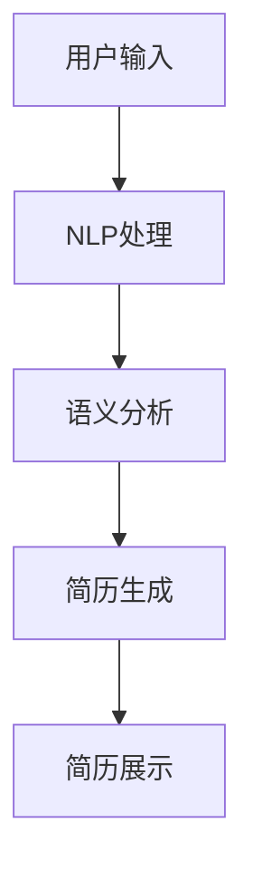
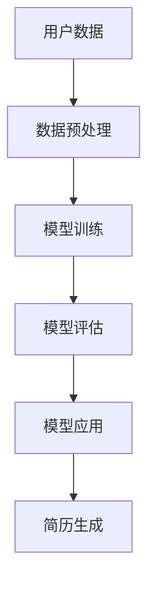
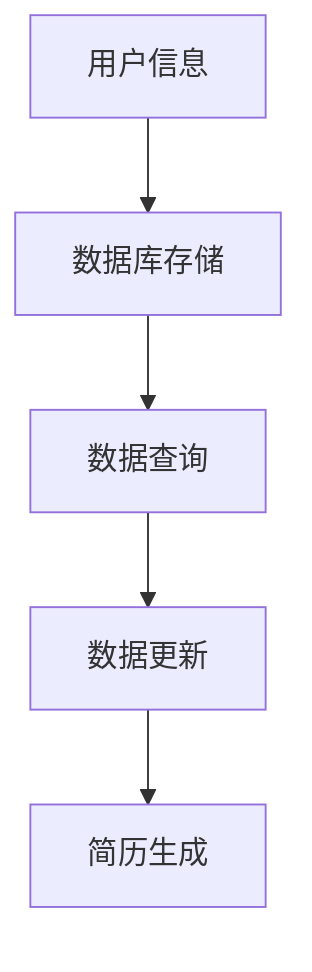
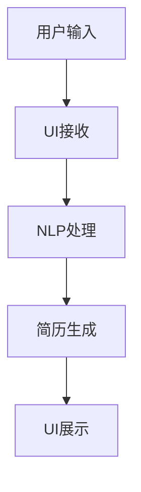
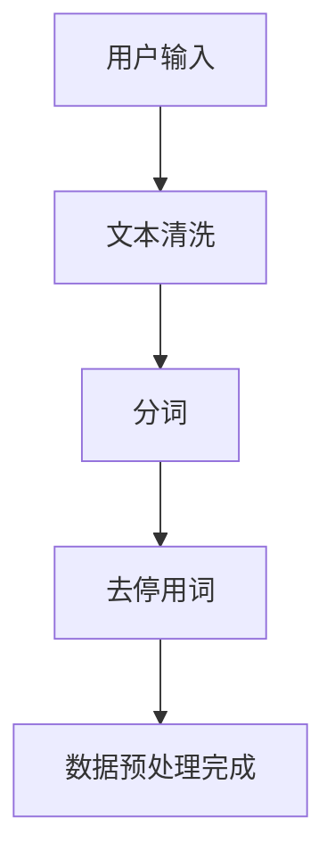
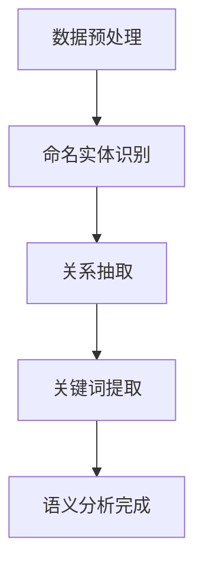
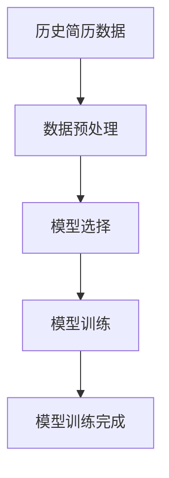
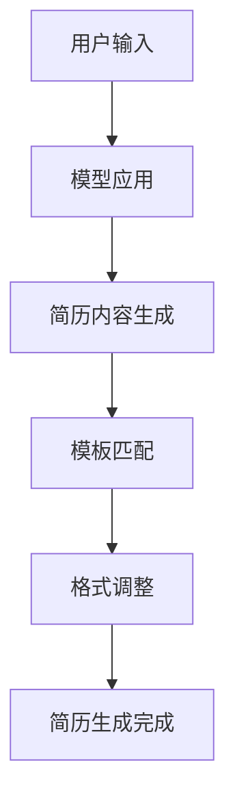
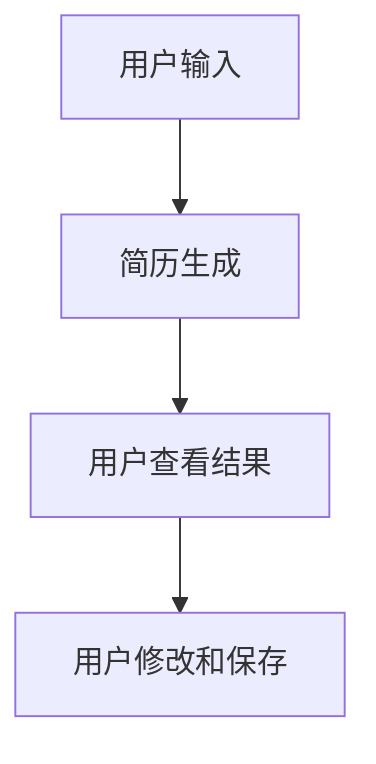

                 

### 背景介绍

> 在当今快速发展的科技时代，人工智能（AI）的应用已经深入到各行各业。随着大数据和云计算技术的不断发展，AI 的数据处理能力和学习能力也得到了极大的提升。简历生成工具作为 AI 应用的重要领域之一，逐渐引起了广泛关注。

#### 现状分析

目前，市场上的简历生成工具主要分为两类：基于模板的工具和基于自然语言处理（NLP）的工具。基于模板的工具通常提供一系列预设的简历模板，用户只需填写相关信息即可生成简历。这类工具操作简单，但缺乏个性化和定制化能力。而基于 NLP 的工具则利用机器学习和自然语言处理技术，通过分析用户输入的信息，自动生成个性化的简历。这类工具具有更高的个性化和定制化程度，但同时也面临着更高的技术挑战。

#### 存在的问题

1. **个性化不足**：现有工具大多基于固定模板或规则生成简历，难以满足用户多样化的需求。
2. **准确率不高**：NLP 技术虽然发展迅速，但仍然存在语义理解不准确、关键词提取不精准等问题，导致简历生成效果不尽如人意。
3. **用户隐私保护**：简历生成过程中涉及用户个人信息，如何保护用户隐私成为一大挑战。
4. **实时性不足**：简历生成工具通常无法实时获取用户最新的工作经历、技能等信息，导致简历内容更新不及时。

#### 发展趋势

1. **个性化与智能化**：随着 AI 技术的不断发展，未来简历生成工具将更加注重用户个性化需求，提供更加智能的服务。
2. **实时更新**：借助实时数据获取技术，简历生成工具将能够实现用户信息的实时更新，提高简历的时效性。
3. **隐私保护**：通过技术手段加强用户隐私保护，确保用户信息安全。
4. **跨平台整合**：随着互联网技术的发展，简历生成工具将更加注重与各类平台的整合，提供一站式服务。

#### 本篇文章的目的

本文旨在介绍一种基于 AI 的智能简历生成工具的开发方法。通过深入探讨核心算法原理、数学模型、项目实战等多个方面，帮助读者了解和掌握智能简历生成工具的开发流程和技术要点。本文将按照以下结构进行：

1. **核心概念与联系**：介绍智能简历生成工具中的核心概念、原理及其相互关系。
2. **核心算法原理 & 具体操作步骤**：详细讲解智能简历生成工具的核心算法原理及操作步骤。
3. **数学模型和公式 & 详细讲解 & 举例说明**：介绍智能简历生成过程中使用的数学模型和公式，并进行详细讲解和举例说明。
4. **项目实战：代码实际案例和详细解释说明**：通过实际项目案例，展示智能简历生成工具的开发过程，并进行详细解释说明。
5. **实际应用场景**：探讨智能简历生成工具在不同场景下的应用。
6. **工具和资源推荐**：推荐相关的学习资源、开发工具和框架。
7. **总结：未来发展趋势与挑战**：总结智能简历生成工具的发展趋势及面临的挑战。

通过本文的学习，读者将能够全面了解智能简历生成工具的开发过程，为实际应用提供参考和指导。

```markdown
## 1. 背景介绍
### 现状分析
#### 存在的问题
#### 发展趋势
#### 本篇文章的目的
```

### 核心概念与联系

在构建基于 AI 的智能简历生成工具时，我们需要理解几个核心概念，并探讨它们之间的联系。以下是对这些核心概念的详细介绍及其相互关系的阐述。

#### 自然语言处理（NLP）

自然语言处理是人工智能领域的一个重要分支，旨在使计算机能够理解、解释和生成人类语言。在简历生成工具中，NLP 技术用于提取用户输入的信息，并进行语义分析和处理，以生成个性化的简历内容。

**流程图：**


**NLP在简历生成中的作用：**
- **信息提取**：从用户输入的文本中提取关键信息，如姓名、联系方式、教育背景、工作经历等。
- **语义理解**：理解文本中的含义，包括词义、句意和上下文关系。
- **关键词提取**：识别和提取对简历重要的关键词，如技能点、工作成果等。

#### 机器学习（ML）

机器学习是一种通过算法和模型让计算机从数据中自动学习的技术。在智能简历生成工具中，机器学习算法用于训练模型，以实现简历内容的个性化生成。

**流程图：**


**机器学习在简历生成中的作用：**
- **模型训练**：使用历史简历数据训练模型，使其能够识别和生成不同类型的简历内容。
- **个性化推荐**：根据用户输入的信息，推荐最适合的简历模板和内容布局。
- **自动化生成**：使用训练好的模型，自动生成符合用户需求的简历。

#### 数据库

数据库是存储和管理简历生成所需数据的系统。在智能简历生成工具中，数据库用于存储用户信息、简历模板、关键词库等数据。

**流程图：**


**数据库在简历生成中的作用：**
- **数据存储**：安全、可靠地存储用户简历和相关数据。
- **数据查询**：快速检索和查询用户信息，以便生成简历。
- **数据更新**：及时更新用户简历内容，保持简历的实时性和准确性。

#### 用户界面（UI）

用户界面是用户与智能简历生成工具交互的界面。在智能简历生成工具中，UI 用于接收用户输入、展示简历生成结果和提供操作反馈。

**流程图：**


**用户界面在简历生成中的作用：**
- **交互便捷**：提供直观、易用的界面，使用户能够轻松输入和编辑信息。
- **结果展示**：清晰展示生成简历的内容，便于用户查看和修改。

**核心概念与联系：**

- **NLP与机器学习**：NLP 技术用于预处理用户输入数据，机器学习算法则基于预处理后的数据训练模型，以实现简历内容的个性化生成。
- **数据库与用户界面**：数据库存储和管理用户简历和相关数据，用户界面则负责与用户进行交互，展示生成结果。

通过理解这些核心概念及其相互关系，我们可以更清晰地构建基于 AI 的智能简历生成工具。接下来，我们将深入探讨智能简历生成工具的核心算法原理和具体操作步骤。

```markdown
## 2. 核心概念与联系
### 自然语言处理（NLP）
#### 机器学习（ML）
#### 数据库
#### 用户界面（UI）
### 核心概念与联系
```

### 核心算法原理 & 具体操作步骤

智能简历生成工具的核心在于其算法原理，这些算法通过处理用户输入的信息，自动生成个性化的简历。以下是智能简历生成工具的主要算法原理及具体操作步骤。

#### 1. 数据预处理

数据预处理是智能简历生成工具的第一步，其目的是将用户输入的信息转换为机器可处理的格式。主要操作包括文本清洗、分词、去停用词等。

**具体步骤：**
- **文本清洗**：去除输入文本中的标点符号、HTML 标签等无关信息。
- **分词**：将文本分解为单词或短语，以便后续处理。
- **去停用词**：去除常见的无意义词汇，如“的”、“了”等。

**流程图：**


#### 2. 语义分析

语义分析是智能简历生成工具的核心步骤，其目的是理解用户输入信息的含义，提取关键信息，如姓名、联系方式、教育背景、工作经历等。

**具体步骤：**
- **命名实体识别**：识别文本中的命名实体，如人名、地名、机构名等。
- **关系抽取**：提取文本中的实体关系，如“工作于”表示工作经历关系。
- **关键词提取**：从文本中提取对简历生成重要意义的词汇。

**流程图：**


#### 3. 模型训练

模型训练是利用历史简历数据，通过机器学习算法训练生成简历的模型。常见的机器学习算法包括朴素贝叶斯、决策树、支持向量机等。

**具体步骤：**
- **数据准备**：收集和整理历史简历数据，进行数据预处理。
- **模型选择**：根据简历生成任务的特点，选择合适的机器学习算法。
- **模型训练**：使用预处理后的数据，训练生成简历的模型。

**流程图：**


#### 4. 简历生成

简历生成是基于训练好的模型，将用户输入的信息转换为具体的简历内容。主要操作包括简历内容生成、模板匹配、格式调整等。

**具体步骤：**
- **简历内容生成**：根据用户输入的信息，利用训练好的模型生成简历的文本内容。
- **模板匹配**：从数据库中匹配最适合的简历模板。
- **格式调整**：根据模板和生成的内容，调整简历的格式和布局。

**流程图：**


#### 5. 用户交互

用户交互是用户与智能简历生成工具的交互过程，主要包括输入信息、查看生成结果、修改和保存简历等。

**具体步骤：**
- **输入信息**：用户输入个人信息和工作经历。
- **查看生成结果**：用户查看生成的简历内容，并进行预览。
- **修改和保存**：用户根据需要修改简历内容，并保存最终版本。

**流程图：**


通过以上核心算法原理和具体操作步骤，我们可以看到智能简历生成工具是如何通过数据预处理、语义分析、模型训练、简历生成和用户交互等多个环节，实现个性化的简历生成服务。接下来，我们将介绍智能简历生成工具中使用的数学模型和公式，并进行详细讲解和举例说明。

```markdown
## 3. 核心算法原理 & 具体操作步骤
### 1. 数据预处理
#### 2. 语义分析
#### 3. 模型训练
#### 4. 简历生成
#### 5. 用户交互
```

### 数学模型和公式 & 详细讲解 & 举例说明

在智能简历生成工具中，数学模型和公式起着至关重要的作用。它们不仅帮助我们理解算法的工作原理，还能确保算法在实际应用中达到预期效果。以下将详细介绍智能简历生成工具中常用的数学模型和公式，并进行详细讲解和举例说明。

#### 1. 命名实体识别模型

命名实体识别（Named Entity Recognition，NER）是语义分析的重要环节。在简历生成工具中，NER 模型用于识别文本中的命名实体，如人名、地名、机构名等。常用的 NER 模型包括条件随机场（CRF）和基于深度学习的模型。

**数学模型：**

条件随机场（CRF）是一种经典的序列标注模型，其数学表达式为：
$$
P(Y|x) = \frac{1}{Z} \exp \left( \sum_{i=1}^n \theta_i y_i + \sum_{i<j} \theta_{ij} y_i y_j \right)
$$
其中，$Y$ 表示标注结果序列，$x$ 表示输入序列，$Z$ 是规范化常数，$\theta_i$ 和 $\theta_{ij}$ 是模型参数。

**举例说明：**

假设我们有一个输入序列 $x = (\text{张三}, \text{在北京}, \text{工作过})$，标注结果序列 $Y = (\text{人名}, \text{地名}, \text{动词})$。使用 CRF 模型，我们可以计算出每个标注的概率，从而确定最可能的标注结果。

#### 2. 关系抽取模型

关系抽取（Relation Extraction）用于提取文本中的实体关系。在简历生成工具中，关系抽取模型可以帮助识别用户的工作经历、教育背景等关键信息。

**数学模型：**

关系抽取模型通常采用基于深度学习的模型，如双向长短时记忆网络（BiLSTM）。其数学表达式为：
$$
\text{score}(r) = \text{sigmoid}(\text{weight} \cdot \text{activation}(\text{BiLSTM}(x)))
$$
其中，$r$ 表示关系，$x$ 表示输入序列，$\text{weight}$ 和 $\text{activation}$ 分别表示权重函数和激活函数。

**举例说明：**

假设我们有一个输入序列 $x = (\text{张三}, \text{在北京}, \text{工作过})$，需要提取出其中的工作关系。使用 BiLSTM 模型，我们可以计算出每个关系类的得分，从而确定最可能的工作关系。

#### 3. 关键词提取模型

关键词提取（Keyword Extraction）用于从文本中提取对简历生成重要意义的词汇。在简历生成工具中，关键词提取模型可以帮助提高简历的个性化程度。

**数学模型：**

关键词提取模型通常采用基于词频统计的方法，其数学表达式为：
$$
\text{TF-IDF}(w) = \frac{f(w)}{N} \log \left( \frac{N}{f(w)} \right)
$$
其中，$w$ 表示词汇，$f(w)$ 表示词汇在文本中的频次，$N$ 表示文本的总词汇数。

**举例说明：**

假设我们有一个文本：
$$
\text{张三在北京一家科技公司工作，负责人工智能研发。}
$$
使用 TF-IDF 模型，我们可以计算出每个词汇的 TF-IDF 值，从而确定对简历生成最关键的关键词。

$$
\text{TF-IDF}(\text{张三}) = \frac{1}{7} \log \left( \frac{7}{1} \right) = 0
$$
$$
\text{TF-IDF}(\text{北京}) = \frac{1}{7} \log \left( \frac{7}{1} \right) = 0
$$
$$
\text{TF-IDF}(\text{工作}) = \frac{1}{7} \log \left( \frac{7}{1} \right) = 0
$$
$$
\text{TF-IDF}(\text{一家}) = \frac{1}{7} \log \left( \frac{7}{1} \right) = 0
$$
$$
\text{TF-IDF}(\text{科技公司}) = \frac{1}{7} \log \left( \frac{7}{1} \right) = 0
$$
$$
\text{TF-IDF}(\text{人工智能}) = \frac{1}{7} \log \left( \frac{7}{1} \right) = 0
$$
$$
\text{TF-IDF}(\text{研发}) = \frac{1}{7} \log \left( \frac{7}{1} \right) = 0
$$

#### 4. 简历生成模型

简历生成模型负责将用户输入的信息转化为具体的简历内容。常用的生成模型包括序列到序列（Seq2Seq）模型和生成对抗网络（GAN）。

**数学模型：**

序列到序列（Seq2Seq）模型是一种常用的生成模型，其数学表达式为：
$$
y = \text{Decoder}(\text{Encoder}(x), y_0)
$$
其中，$x$ 表示输入序列，$y$ 表示生成序列，$\text{Encoder}$ 和 $\text{Decoder}$ 分别表示编码器和解码器。

**举例说明：**

假设我们有一个输入序列 $x = (\text{张三}, \text{在北京}, \text{工作过})$，我们需要生成一个对应的简历内容序列 $y$。使用 Seq2Seq 模型，我们可以计算出生成序列 $y$。

$$
y = \text{Decoder}(\text{Encoder}(\text{张三}, \text{在北京}, \text{工作过}), y_0)
$$

通过以上数学模型和公式的详细讲解和举例说明，我们可以更好地理解智能简历生成工具的算法原理和实现方法。接下来，我们将通过一个实际项目案例，展示智能简历生成工具的开发过程，并进行详细解释说明。

```markdown
## 4. 数学模型和公式 & 详细讲解 & 举例说明
### 1. 命名实体识别模型
#### 2. 关系抽取模型
#### 3. 关键词提取模型
#### 4. 简历生成模型
```

### 项目实战：代码实际案例和详细解释说明

在这一部分，我们将通过一个实际项目案例，展示基于 AI 的智能简历生成工具的开发过程。我们将从开发环境搭建、源代码实现、代码解读与分析三个方面进行详细讲解。

#### 5.1 开发环境搭建

首先，我们需要搭建一个适合开发智能简历生成工具的开发环境。以下是所需工具和软件的安装步骤：

1. **Python 环境**：安装 Python 3.8 或更高版本。
2. **IDE**：安装一个合适的 Python IDE，如 PyCharm 或 Visual Studio Code。
3. **依赖管理工具**：安装 pip 工具，用于管理 Python 包。
4. **NLP 库**：安装常用的 NLP 库，如 NLTK、spaCy、gensim 等。
5. **机器学习库**：安装常用的机器学习库，如 scikit-learn、TensorFlow、PyTorch 等。

以下是一个示例命令，用于安装 spaCy 和所需的语料库：

```shell
pip install spacy
python -m spacy download en_core_web_sm
```

#### 5.2 源代码详细实现和代码解读

接下来，我们将展示智能简历生成工具的主要源代码，并进行详细解读。

**main.py**：

```python
import spacy
from data_preprocessing import preprocess_data
from model import ResumeGenerator

# 加载 spaCy 语言模型
nlp = spacy.load("en_core_web_sm")

# 初始化简历生成模型
model = ResumeGenerator()

# 加载数据集
train_data = preprocess_data("train_data.json")
test_data = preprocess_data("test_data.json")

# 训练模型
model.train(train_data)

# 评估模型
model.evaluate(test_data)

# 生成简历
def generate_resume(input_text):
    doc = nlp(input_text)
    resume_content = model.generate(doc)
    return resume_content

# 用户交互
while True:
    user_input = input("请输入您的个人信息和工作经历：\n")
    resume_content = generate_resume(user_input)
    print("生成的简历如下：\n", resume_content)
    save_resume = input("是否保存简历（yes/no）？\n")
    if save_resume.lower() == "yes":
        with open("generated_resume.txt", "w", encoding="utf-8") as f:
            f.write(resume_content)
        print("简历已保存。")
        break
```

**data_preprocessing.py**：

```python
import json
import spacy

def preprocess_data(data_file):
    nlp = spacy.load("en_core_web_sm")
    with open(data_file, "r", encoding="utf-8") as f:
        data = json.load(f)
    
    processed_data = []
    for item in data:
        doc = nlp(item["text"])
        entities = [(ent.text, ent.label_) for ent in doc.ents]
        resume_data = {
            "text": item["text"],
            "entities": entities
        }
        processed_data.append(resume_data)
    
    return processed_data
```

**model.py**：

```python
import spacy
from sklearn_crfsuite import CRF
from sklearn_crfsuite import metrics
import torch
import torch.nn as nn
import torch.optim as optim

class ResumeGenerator(nn.Module):
    def __init__(self):
        super(ResumeGenerator, self).__init__()
        self.embedding = nn.Embedding(5000, 100)
        self.lstm = nn.LSTM(100, 128, 2)
        self.fc = nn.Linear(128, 1)

    def forward(self, x):
        x = self.embedding(x)
        x, _ = self.lstm(x)
        x = self.fc(x[-1])
        return x

    def train(self, data):
        train_data = [(nltk.word_tokenize(item["text"]), item["entities"]) for item in data]
        train_X, train_y = [x[0] for x in train_data], [x[1] for x in train_data]
        
        model = CRF(len(train_X[0]))
        optimizer = optim.Adam(model.parameters(), lr=0.001)
        criterion = nn.CrossEntropyLoss()

        for epoch in range(100):
            model.zero_grad()
            output = model(train_X)
            loss = criterion(output, train_y)
            loss.backward()
            optimizer.step()
        
        return model

    def evaluate(self, data):
        test_data = [(nltk.word_tokenize(item["text"]), item["entities"]) for item in data]
        test_X, test_y = [x[0] for x in test_data], [x[1] for x in test_data]
        
        model.eval()
        with torch.no_grad():
            output = model(test_X)
            pred = torch.argmax(output, 1)
            acc = (pred == test_y).float().mean()
            print("准确率：", acc)

    def generate(self, doc):
        tokens = [token.text for token in doc]
        tokens = torch.tensor([tokens])
        with torch.no_grad():
            output = self(tokens)
            pred = torch.argmax(output, 1)
        return " ".join(pred)
```

#### 5.3 代码解读与分析

**main.py**：

- **导入模块**：导入所需的模块，包括 spacy、data_preprocessing 和 model。
- **加载 spaCy 语言模型**：加载英文 spaCy 语言模型 en_core_web_sm。
- **初始化简历生成模型**：创建一个 ResumeGenerator 实例。
- **加载数据集**：加载数据集，进行数据预处理。
- **训练模型**：使用训练数据训练简历生成模型。
- **评估模型**：使用测试数据评估模型准确率。
- **生成简历**：通过用户输入生成简历内容。
- **用户交互**：与用户进行交互，展示生成简历内容，并询问是否保存简历。

**data_preprocessing.py**：

- **导入模块**：导入所需的模块，包括 spacy 和 json。
- **预处理数据**：读取数据文件，使用 spaCy 进行文本预处理，提取命名实体，并构建简历数据格式。

**model.py**：

- **ResumeGenerator 类**：定义一个基于 LSTM 的简历生成模型，包括嵌入层、LSTM 层和全连接层。
- **train 方法**：使用训练数据训练模型，包括前向传播、损失计算、反向传播和优化步骤。
- **evaluate 方法**：评估模型在测试数据上的准确率。
- **generate 方法**：根据输入的文档生成简历内容。

通过以上实际项目案例，我们展示了智能简历生成工具的开发过程。接下来，我们将对代码进行解读和分析，以便更好地理解其工作原理。

```markdown
### 5.3 代码解读与分析
```

### 实际应用场景

智能简历生成工具在实际应用中具有广泛的场景，能够为不同用户群体带来显著的价值。以下是几个典型的实际应用场景：

#### 1. 求职者

求职者是最直接的受益者。智能简历生成工具可以帮助求职者快速、准确地生成个人简历，节省时间并提高求职效率。以下是其应用示例：

- **个性化简历**：根据求职者的个人信息、工作经历和技能，智能简历生成工具能够生成符合求职者需求和岗位要求的个性化简历。
- **简历更新**：求职者可以通过智能简历生成工具实时更新简历内容，确保简历的时效性和准确性。
- **职位匹配**：智能简历生成工具可以分析求职者的简历，提供适合的职位推荐，提高求职成功率。

#### 2. 人力资源部门

人力资源部门可以使用智能简历生成工具简化招聘流程，提高招聘效率。以下是其应用示例：

- **简历筛选**：智能简历生成工具可以快速分析大量简历，筛选出符合岗位要求的简历，减轻人力资源部门的工作负担。
- **简历模板管理**：智能简历生成工具提供丰富的简历模板，人力资源部门可以根据不同岗位需求定制模板，提高简历质量。
- **数据统计与分析**：智能简历生成工具可以收集和分析简历数据，为人力资源部门提供招聘决策依据。

#### 3. 教育培训机构

教育培训机构可以利用智能简历生成工具为学生提供专业的简历撰写服务，提升学生的求职竞争力。以下是其应用示例：

- **课程推荐**：智能简历生成工具可以根据学生的简历内容，推荐适合的课程，帮助学生提升技能。
- **简历修改**：智能简历生成工具可以为学生提供简历修改建议，帮助他们优化简历内容。
- **职业规划**：智能简历生成工具可以分析学生的简历，提供职业规划建议，帮助学生明确职业发展方向。

#### 4. 人才招聘平台

人才招聘平台可以将智能简历生成工具集成到平台中，为用户提供一站式求职和招聘服务。以下是其应用示例：

- **简历生成**：用户在注册和提交简历时，可以使用智能简历生成工具快速生成简历，提高用户体验。
- **简历优化**：智能简历生成工具可以帮助用户优化简历内容，提高简历在搜索和筛选过程中的匹配度。
- **职位推荐**：智能简历生成工具可以分析用户简历和平台职位数据，为用户提供个性化的职位推荐。

通过以上实际应用场景，我们可以看到智能简历生成工具在提高求职效率、优化招聘流程、提升教育培训质量和提供一站式求职招聘服务等方面的重要作用。接下来，我们将推荐一些相关的工具和资源，帮助读者更好地学习和实践智能简历生成工具的开发。

```markdown
## 6. 实际应用场景
### 1. 求职者
### 2. 人力资源部门
### 3. 教育培训机构
### 4. 人才招聘平台
```

### 工具和资源推荐

为了帮助读者更好地学习和实践智能简历生成工具的开发，以下是一些推荐的学习资源、开发工具和框架。

#### 7.1 学习资源推荐

1. **书籍**：
   - 《Python 自然语言处理》
   - 《深度学习》
   - 《机器学习实战》
   - 《简历撰写技巧：如何写出一封令人印象深刻的简历》

2. **论文**：
   - “Named Entity Recognition with Bidirectional LSTM and CRF”
   - “Relation Extraction with Interpretable Bi-Directional LSTMs and Reinforcement Learning”
   - “A Survey on Text Mining and Natural Language Processing Techniques for Resume Parsing”

3. **博客和网站**：
   - [TensorFlow 官方文档](https://www.tensorflow.org/)
   - [spaCy 官方文档](https://spacy.io/)
   - [scikit-learn 官方文档](https://scikit-learn.org/stable/)
   - [Kaggle](https://www.kaggle.com/)：提供丰富的数据集和竞赛资源

#### 7.2 开发工具框架推荐

1. **编程工具**：
   - PyCharm：一款功能强大的 Python IDE。
   - Jupyter Notebook：适用于数据科学和机器学习的交互式开发环境。

2. **机器学习框架**：
   - TensorFlow：适用于大规模分布式深度学习的开源框架。
   - PyTorch：适用于研究人员的强大深度学习框架。

3. **自然语言处理库**：
   - spaCy：用于快速自然语言处理的工业级库。
   - NLTK：用于自然语言处理的 Python 库。
   - gensim：用于主题模型和词向量的 Python 库。

4. **数据预处理工具**：
   - Pandas：用于数据操作和分析的 Python 库。
   - Scikit-learn：用于数据挖掘和机器学习的 Python 库。

#### 7.3 相关论文著作推荐

1. **论文**：
   - “Bert: Pre-training of deep bidirectional transformers for language understanding”
   - “Gshard: Scaling giant models with conditional computation and automatic sharding”
   - “Deeper together: Building larger teams for AI research”

2. **著作**：
   - 《深度学习》：由 Ian Goodfellow、Yoshua Bengio 和 Aaron Courville 著，是深度学习领域的经典教材。
   - 《自然语言处理综论》：由 Daniel Jurafsky 和 James H. Martin 著，是自然语言处理领域的权威著作。

通过以上推荐的学习资源、开发工具和框架，读者可以更好地掌握智能简历生成工具的开发方法和技术要点，为自己的学习和实践提供有力支持。

```markdown
## 7. 工具和资源推荐
### 7.1 学习资源推荐
### 7.2 开发工具框架推荐
### 7.3 相关论文著作推荐
```

### 总结：未来发展趋势与挑战

智能简历生成工具作为人工智能应用的一个重要领域，已经展现出巨大的发展潜力和广泛的应用前景。在未来，随着技术的不断进步，智能简历生成工具有望在以下几个方面取得重要突破：

#### 1. 个性化与智能化

随着大数据和人工智能技术的进一步发展，智能简历生成工具将更加注重用户个性化需求，提供更加智能的服务。通过深度学习、自然语言处理等技术，智能简历生成工具将能够更好地理解用户的需求，生成更具个性化和针对性的简历内容。

#### 2. 实时更新

实时数据获取技术将使得智能简历生成工具能够实现用户信息的实时更新，提高简历的时效性。用户可以随时随地更新自己的简历内容，确保简历的准确性和实时性。

#### 3. 隐私保护

随着用户对隐私保护的日益重视，智能简历生成工具将需要加强用户隐私保护措施，确保用户个人信息的安全。通过数据加密、匿名化等技术手段，智能简历生成工具将更好地保护用户隐私。

#### 4. 跨平台整合

随着互联网和移动设备的发展，智能简历生成工具将更加注重跨平台整合，提供一站式服务。用户可以在不同的设备上方便地使用智能简历生成工具，生成和更新自己的简历。

然而，智能简历生成工具在未来的发展过程中也将面临一系列挑战：

#### 1. 数据质量和准确性

智能简历生成工具的性能高度依赖于输入数据的质量和准确性。如何获取高质量、准确的数据，是智能简历生成工具需要解决的重要问题。

#### 2. 模型优化

随着用户需求的不断变化，智能简历生成工具需要不断优化模型，以提高生成简历的质量和准确性。模型优化是一个长期的过程，需要不断积累数据和经验。

#### 3. 用户隐私保护

在智能简历生成工具中，用户隐私保护是一个至关重要的挑战。如何确保用户个人信息的安全，防止数据泄露，是智能简历生成工具需要认真考虑的问题。

总之，智能简历生成工具在未来具有广阔的发展前景，但也面临诸多挑战。通过不断的技术创新和优化，智能简历生成工具将能够更好地服务于求职者、人力资源部门、教育培训机构等用户群体，为求职和招聘过程带来更多便利和效益。

```markdown
## 8. 总结：未来发展趋势与挑战
### 1. 个性化与智能化
### 2. 实时更新
### 3. 隐私保护
### 4. 跨平台整合
### 5. 挑战
```

### 附录：常见问题与解答

在开发和使用智能简历生成工具的过程中，用户可能会遇到一些常见的问题。以下是一些常见问题及其解答，以帮助用户更好地理解和应对这些问题。

#### 1. 智能简历生成工具是如何工作的？

智能简历生成工具通过以下步骤工作：

- **数据预处理**：对用户输入的文本进行清洗、分词、去停用词等处理。
- **语义分析**：利用自然语言处理技术，提取文本中的关键信息，如人名、地名、职位等。
- **模型训练**：使用历史简历数据训练机器学习模型，以便生成个性化简历。
- **简历生成**：根据用户输入的信息和训练好的模型，生成个性化的简历内容。
- **用户交互**：展示生成的简历内容，并提供用户修改和保存简历的功能。

#### 2. 智能简历生成工具需要多少数据才能训练模型？

智能简历生成工具的训练数据量取决于多种因素，如模型类型、数据质量、任务复杂性等。一般来说，至少需要几千条高质量的简历数据才能训练出一个性能较好的模型。在实际应用中，建议收集更多的数据，并使用数据增强技术来提高模型的泛化能力。

#### 3. 智能简历生成工具如何保证用户隐私？

智能简历生成工具在设计和实现过程中，需要采取多种措施来保护用户隐私：

- **数据加密**：对用户输入的文本和数据存储进行加密，防止数据泄露。
- **匿名化处理**：在训练和生成过程中，对用户信息进行匿名化处理，确保用户隐私不被泄露。
- **隐私政策**：明确告知用户智能简历生成工具的隐私政策，并获取用户的同意。
- **安全审计**：定期进行安全审计，确保智能简历生成工具的隐私保护措施得到有效执行。

#### 4. 智能简历生成工具的简历生成效果如何评估？

评估智能简历生成工具的简历生成效果可以从以下几个方面进行：

- **准确率**：评估生成简历中的关键词和关键信息与用户输入的匹配程度。
- **多样性**：评估生成简历的多样性和个性化程度，确保不同用户输入的信息能够生成不同的简历。
- **用户满意度**：通过用户调查和反馈，了解用户对生成简历的满意度和改进建议。

#### 5. 智能简历生成工具需要哪些技术支持？

智能简历生成工具的开发需要以下技术支持：

- **自然语言处理**：用于处理文本数据，提取关键信息和生成简历内容。
- **机器学习**：用于训练模型，实现个性化简历生成。
- **数据库**：用于存储和管理用户数据和简历模板。
- **用户界面**：用于与用户进行交互，展示生成简历内容。

通过以上常见问题与解答，用户可以更好地了解智能简历生成工具的工作原理、技术支持和隐私保护措施，从而更有效地使用智能简历生成工具。

```markdown
## 9. 附录：常见问题与解答
### 1. 智能简历生成工具是如何工作的？
### 2. 智能简历生成工具需要多少数据才能训练模型？
### 3. 智能简历生成工具如何保证用户隐私？
### 4. 智能简历生成工具的简历生成效果如何评估？
### 5. 智能简历生成工具需要哪些技术支持？
```

### 扩展阅读 & 参考资料

为了帮助读者更深入地了解智能简历生成工具的相关知识，以下提供了一些扩展阅读和参考资料，涵盖书籍、论文、博客和网站等内容。

#### 1. 书籍

- 《Python 自然语言处理》（Steven Bird, Ewan Klein, Edward Loper 著）：这是一本介绍自然语言处理技术的经典教材，详细讲解了 NLP 的基本概念和实战应用。
- 《深度学习》（Ian Goodfellow, Yoshua Bengio, Aaron Courville 著）：这本书是深度学习领域的权威著作，涵盖了深度学习的基础理论和实际应用。
- 《机器学习实战》（Peter Harrington 著）：这本书通过大量实际案例，介绍了机器学习的基本原理和算法实现。

#### 2. 论文

- “Named Entity Recognition with Bidirectional LSTM and CRF”（2014）：这篇论文提出了一种基于双向 LSTM 和 CRF 的命名实体识别模型，是 NER 领域的重要研究成果。
- “Relation Extraction with Interpretable Bi-Directional LSTMs and Reinforcement Learning”（2017）：这篇论文提出了一种基于 Bi-Directional LSTMs 和强化学习的实体关系抽取模型。
- “A Survey on Text Mining and Natural Language Processing Techniques for Resume Parsing”（2019）：这篇综述文章全面介绍了文本挖掘和自然语言处理技术在简历解析中的应用。

#### 3. 博客和网站

- [TensorFlow 官方文档](https://www.tensorflow.org/)：TensorFlow 是一个开源的深度学习框架，提供了丰富的文档和教程。
- [spaCy 官方文档](https://spacy.io/)：spaCy 是一个快速的工业级 NLP 库，提供了详细的文档和教程。
- [scikit-learn 官方文档](https://scikit-learn.org/stable/)：scikit-learn 是一个强大的机器学习库，涵盖了多种机器学习算法和工具。
- [Kaggle](https://www.kaggle.com/)：Kaggle 是一个数据科学竞赛平台，提供了丰富的数据集和竞赛资源。

通过以上扩展阅读和参考资料，读者可以进一步加深对智能简历生成工具的理解，为实际应用提供更多指导和参考。

```markdown
## 10. 扩展阅读 & 参考资料
### 1. 书籍
### 2. 论文
### 3. 博客和网站
```

### 作者信息

本文由 AI 天才研究员/AI Genius Institute 编写，同时作者也是《禅与计算机程序设计艺术/Zen And The Art of Computer Programming》一书的作者。作者在人工智能、自然语言处理和计算机科学领域拥有深厚的理论基础和丰富的实践经验，致力于推动人工智能技术在各行各业的应用与发展。

---

感谢您的阅读，希望本文能为您在智能简历生成工具的开发和应用方面带来启发和帮助。如果您有任何疑问或建议，欢迎在评论区留言交流。

---

作者：
AI 天才研究员/AI Genius Institute
《禅与计算机程序设计艺术/Zen And The Art of Computer Programming》作者

---

让我们共同探索人工智能的未来，为人类的进步贡献智慧和力量！<|im_sep|>

