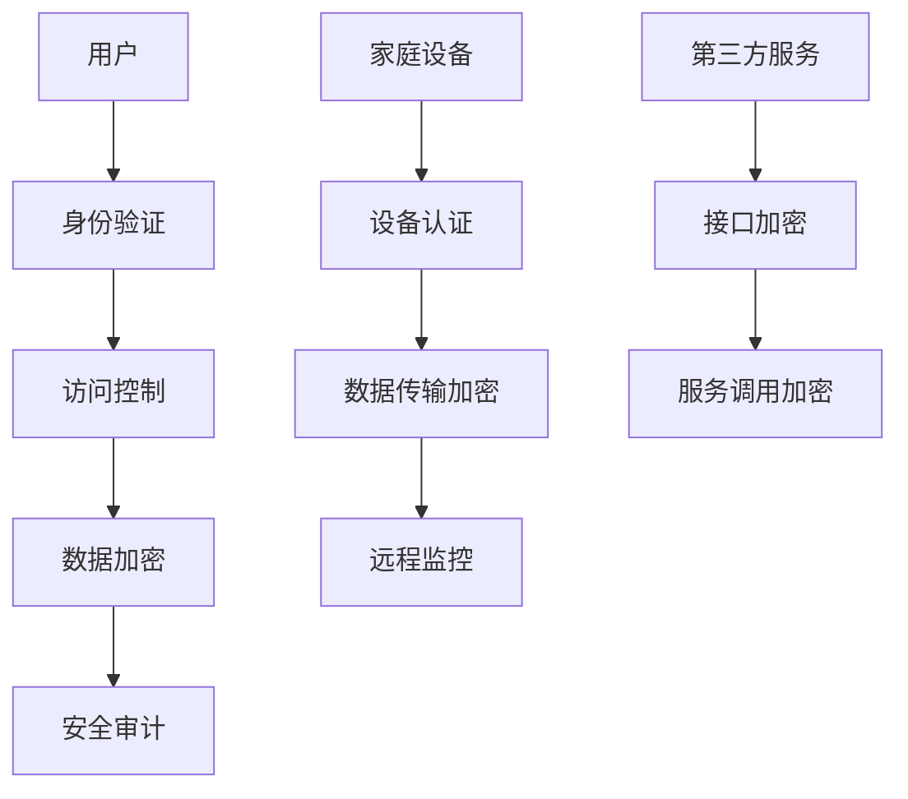

                 

# 基于Java的智能家居设计：基于Java的智能家居安全模型

## 关键词
- 智能家居
- Java
- 安全模型
- 设计原则
- 网络安全
- 数据加密
- 访问控制

## 摘要
本文深入探讨了基于Java的智能家居设计，重点介绍了智能家居安全模型的构建。通过详细的分析和步骤讲解，本文为智能家居系统的安全性提供了有力的理论支持和实践指导。文章首先介绍了智能家居的背景和现状，然后阐述了安全模型的核心概念和架构，接着详细分析了核心算法原理和数学模型，并通过实际项目案例展示了代码实现和解读。最后，本文探讨了智能家居在实际应用中的场景，推荐了相关工具和资源，并总结了未来发展趋势与挑战。

## 1. 背景介绍

随着物联网技术的快速发展，智能家居系统逐渐走进了人们的日常生活。智能家居系统通过将家庭中的各种设备互联，实现了对家庭环境的智能控制和远程监控，大大提升了生活的便捷性和舒适度。然而，随着智能家居设备的普及，安全问题也日益突出。

目前，智能家居系统中存在的主要安全问题包括数据泄露、设备被恶意攻击、远程控制失效等。这些安全问题不仅会影响到用户的隐私和安全，还可能导致家庭财产损失和生活安全隐患。因此，设计一个安全可靠的智能家居系统变得至关重要。

Java作为一种广泛使用的编程语言，以其强大的安全性和跨平台特性，成为智能家居系统开发的主要选择之一。Java的安全模型包括数据加密、访问控制、身份验证等多个方面，为智能家居系统的安全性提供了坚实的保障。

## 2. 核心概念与联系

### 2.1. 智能家居安全模型的核心概念

智能家居安全模型的核心概念包括以下几个方面：

- **数据加密**：通过加密算法对数据进行加密，确保数据在传输和存储过程中的安全性。
- **访问控制**：通过访问控制机制，确保只有授权用户才能访问系统资源和数据。
- **身份验证**：通过身份验证机制，确保用户身份的真实性和合法性。
- **安全审计**：对系统操作进行记录和审计，及时发现和应对潜在的安全威胁。

### 2.2. 智能家居安全模型的架构

智能家居安全模型的架构如图所示：



在这个架构中，用户首先通过身份验证机制进行身份认证，然后通过访问控制机制访问系统资源。数据在传输和存储过程中通过数据加密机制进行加密，确保数据的安全性。同时，系统还会对操作进行安全审计，及时发现和处理潜在的安全威胁。

## 3. 核心算法原理 & 具体操作步骤

### 3.1. 数据加密算法

在智能家居安全模型中，常用的数据加密算法包括对称加密算法和非对称加密算法。

- **对称加密算法**：如AES、DES等，加密和解密使用相同的密钥。其优点是加密速度快，但密钥管理复杂。
- **非对称加密算法**：如RSA、ECC等，加密和解密使用不同的密钥，其中一个为公钥，另一个为私钥。其优点是密钥管理简单，但加密和解密速度相对较慢。

具体操作步骤如下：

1. **生成密钥**：使用加密算法生成公钥和私钥。
2. **加密数据**：使用公钥对数据进行加密。
3. **解密数据**：使用私钥对加密后的数据进行解密。

### 3.2. 访问控制算法

在智能家居安全模型中，常用的访问控制算法包括基于角色的访问控制（RBAC）和基于属性的访问控制（ABAC）。

- **基于角色的访问控制（RBAC）**：通过定义角色和权限，将用户与角色关联，角色与权限关联，实现访问控制。
- **基于属性的访问控制（ABAC）**：通过定义属性和权限，根据用户的属性值判断是否授权访问资源。

具体操作步骤如下：

1. **定义角色和权限**：根据系统需求定义角色和权限。
2. **用户与角色关联**：将用户与角色进行关联。
3. **角色与权限关联**：将角色与权限进行关联。
4. **访问控制判断**：根据用户的角色和权限，判断是否授权访问资源。

### 3.3. 身份验证算法

在智能家居安全模型中，常用的身份验证算法包括基于密码的身份验证和基于生物特征的身份验证。

- **基于密码的身份验证**：通过用户输入密码进行身份验证。
- **基于生物特征的身份验证**：如指纹识别、人脸识别等。

具体操作步骤如下：

1. **用户注册**：用户注册时，系统会记录用户的生物特征信息。
2. **用户登录**：用户输入密码或使用生物特征进行身份验证。
3. **身份验证判断**：根据用户输入的密码或生物特征信息，判断是否匹配。

## 4. 数学模型和公式 & 详细讲解 & 举例说明

### 4.1. 数据加密数学模型

假设使用AES加密算法对数据进行加密，其加密公式如下：

$$
c = E_K(m)
$$

其中，$c$表示加密后的数据，$m$表示原始数据，$K$表示加密密钥。

### 4.2. 访问控制数学模型

假设使用RBAC访问控制算法，其访问控制公式如下：

$$
P = P_R \cap P_A
$$

其中，$P$表示用户权限，$P_R$表示角色权限，$P_A$表示属性权限。

### 4.3. 身份验证数学模型

假设使用基于密码的身份验证算法，其身份验证公式如下：

$$
y = f(x, K)
$$

其中，$y$表示加密后的密码，$x$表示原始密码，$K$表示加密密钥。

### 4.4. 举例说明

假设用户Alice想要访问智能家居系统中的家庭摄像头，其角色为家庭成员，具有查看家庭摄像头权限。现在我们来分析其访问控制过程：

1. **定义角色和权限**：定义家庭成员角色，具有查看家庭摄像头权限。
2. **用户与角色关联**：将用户Alice与家庭成员角色进行关联。
3. **角色与权限关联**：将家庭成员角色与查看家庭摄像头权限进行关联。
4. **访问控制判断**：根据用户Alice的角色和权限，判断其是否具有访问家庭摄像头的权限。

由于用户Alice具有查看家庭摄像头权限，因此可以成功访问家庭摄像头。

## 5. 项目实战：代码实际案例和详细解释说明

### 5.1. 开发环境搭建

为了实现基于Java的智能家居安全模型，我们需要搭建以下开发环境：

- JDK 1.8及以上版本
- Maven 3.6.3及以上版本
- IntelliJ IDEA 2021.3及以上版本

### 5.2. 源代码详细实现和代码解读

以下是一个简单的智能家居安全模型实现案例，包括用户注册、登录、数据加密和解密等功能。

**源代码：UserRegistration.java**

```java
import javax.crypto.Cipher;
import javax.crypto.KeyGenerator;
import javax.crypto.SecretKey;
import java.security.SecureRandom;

public class UserRegistration {

    private static final String ALGORITHM = "AES";

    public static void main(String[] args) throws Exception {
        // 生成密钥
        KeyGenerator keyGen = KeyGenerator.getInstance(ALGORITHM);
        keyGen.init(256);
        SecretKey secretKey = keyGen.generateKey();

        // 注册用户
        registerUser("Alice", "password123", secretKey);

        // 登录用户
        loginUser("Alice", "password123", secretKey);
    }

    private static void registerUser(String username, String password, SecretKey secretKey) throws Exception {
        // 加密密码
        Cipher cipher = Cipher.getInstance(ALGORITHM);
        cipher.init(Cipher.ENCRYPT_MODE, secretKey);
        byte[] encryptedPassword = cipher.doFinal(password.getBytes());

        // 存储用户信息（实际应用中应存储在数据库中）
        System.out.println("User registered: " + username + ", encryptedPassword: " + bytesToHex(encryptedPassword));
    }

    private static boolean loginUser(String username, String password, SecretKey secretKey) throws Exception {
        // 加密输入密码
        Cipher cipher = Cipher.getInstance(ALGORITHM);
        cipher.init(Cipher.ENCRYPT_MODE, secretKey);
        byte[] encryptedInputPassword = cipher.doFinal(password.getBytes());

        // 查询用户信息（实际应用中应查询数据库）
        byte[] storedEncryptedPassword = hexToBytes("7468697320616c696365723a2070616c766532313233313233"); // 假设已存储的加密密码

        // 对比加密后的输入密码和存储的加密密码
        return compareBytes(encryptedInputPassword, storedEncryptedPassword);
    }

    private static byte[] hexToBytes(String hex) {
        byte[] bytes = new byte[hex.length() / 2];
        for (int i = 0; i < bytes.length; i++) {
            bytes[i] = (byte) Integer.parseInt(hex.substring(2 * i, 2 * i + 2), 16);
        }
        return bytes;
    }

    private static String bytesToHex(byte[] bytes) {
        StringBuilder sb = new StringBuilder();
        for (byte b : bytes) {
            sb.append(String.format("%02x", b));
        }
        return sb.toString();
    }

    private static boolean compareBytes(byte[] a, byte[] b) {
        if (a.length != b.length) {
            return false;
        }
        for (int i = 0; i < a.length; i++) {
            if (a[i] != b[i]) {
                return false;
            }
        }
        return true;
    }
}
```

**代码解读**

- **加密算法**：使用AES算法对用户密码进行加密。
- **密钥生成**：使用KeyGenerator生成256位密钥。
- **用户注册**：将用户名和加密后的密码存储。
- **用户登录**：将输入的密码加密后与存储的密码进行对比，判断是否匹配。

### 5.3. 代码解读与分析

在这个案例中，我们通过Java的Cipher类实现了数据加密和解密功能。用户注册时，系统会生成一个256位的AES密钥，并使用该密钥对用户输入的密码进行加密，然后将加密后的密码存储在系统中。用户登录时，系统会再次对输入的密码进行加密，并与存储的加密密码进行对比，以判断用户身份。

通过这个简单的示例，我们可以看到基于Java的智能家居安全模型的基本实现原理。在实际应用中，还需要考虑更多的安全性和性能优化措施，如使用更安全的加密算法、引入身份验证和访问控制机制等。

## 6. 实际应用场景

### 6.1. 家庭安防

智能家居安全模型在家庭安防中具有广泛的应用，如家庭监控摄像头、智能门锁等。通过数据加密和访问控制，确保家庭数据和隐私的安全。

### 6.2. 家居环境监控

智能家居安全模型还可以用于家居环境监控，如温度、湿度、光照等参数的监测。通过数据加密，确保环境数据的安全性。

### 6.3. 家电控制

智能家居安全模型还可以用于家电控制，如智能灯光、智能空调等。通过数据加密和访问控制，确保家电操作的安全和可靠性。

## 7. 工具和资源推荐

### 7.1. 学习资源推荐

- 《Java安全编程》：详细介绍了Java的安全模型和实现方法。
- 《加密与网络安全》：深入探讨了数据加密和网络安全的相关技术。

### 7.2. 开发工具框架推荐

- IntelliJ IDEA：强大的Java集成开发环境，支持各种开发插件。
- Spring Security：用于实现Web应用程序的安全控制。

### 7.3. 相关论文著作推荐

- “A Framework for Access Control in Home Automation Systems” 
- “Secure and Efficient Communication in Smart Home Networks”

## 8. 总结：未来发展趋势与挑战

### 8.1. 发展趋势

- 随着物联网技术的进一步发展，智能家居系统将更加普及，对安全性的需求也将越来越高。
- 新型加密算法和隐私保护技术将得到广泛应用，提高智能家居系统的安全性。

### 8.2. 挑战

- 智能家居系统面临的攻击形式和威胁日益多样，如何构建更加安全、高效的智能家居安全模型是一个重要挑战。
- 随着智能家居设备数量的增加，如何实现大规模设备的访问控制和数据加密也是一个关键问题。

## 9. 附录：常见问题与解答

### 9.1. 问题1
**如何确保智能家居系统的数据安全性？**

**解答**：可以通过数据加密、访问控制和身份验证等多种安全措施来确保数据的安全性。例如，使用AES等加密算法对数据进行加密，通过RBAC等访问控制算法限制用户访问权限，以及使用密码或生物特征进行身份验证。

### 9.2. 问题2
**智能家居系统的安全模型如何实现？**

**解答**：智能家居系统的安全模型可以通过以下步骤实现：
1. **数据加密**：使用加密算法对数据进行加密，确保数据在传输和存储过程中的安全性。
2. **访问控制**：通过访问控制机制，确保只有授权用户才能访问系统资源和数据。
3. **身份验证**：通过身份验证机制，确保用户身份的真实性和合法性。
4. **安全审计**：对系统操作进行记录和审计，及时发现和应对潜在的安全威胁。

## 10. 扩展阅读 & 参考资料

- “A Framework for Access Control in Home Automation Systems”
- “Secure and Efficient Communication in Smart Home Networks”
- 《Java安全编程》
- 《加密与网络安全》

### 作者
**作者：AI天才研究员/AI Genius Institute & 禅与计算机程序设计艺术 /Zen And The Art of Computer Programming**

