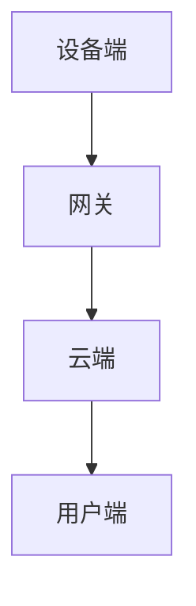

                 

### 背景介绍

#### 智能家居的兴起

随着物联网（IoT）技术的快速发展，智能家居市场正在迅速崛起。智能家居系统通过将家庭设备联网，实现设备间的互联互通，为用户提供了更加便捷、高效和智能的生活方式。从传统的家电设备到现代的智能音响、智能灯泡、智能门锁等，智能家居已经深入到了我们日常生活的方方面面。

Java作为一门历史悠久且广泛应用的编程语言，具有跨平台、安全性高、可扩展性强等优点，成为了智能家居系统开发的重要技术之一。Java在网络编程方面有着丰富的库和框架支持，使其在智能家居系统中扮演了关键角色。通过Java网络编程，开发者可以实现设备间的数据传输、远程控制和智能决策等功能，为智能家居系统的实现提供了强大的技术支持。

#### Java网络编程的重要性

Java网络编程的重要性主要体现在以下几个方面：

1. **跨平台支持**：Java的跨平台特性使得智能家居系统可以在不同的操作系统上运行，从而提高了系统的兼容性和可维护性。
2. **安全性**：Java在网络编程中提供了丰富的安全机制，如SSL/TLS等，保障了数据传输的安全性。
3. **高效性**：Java网络编程支持多线程和异步处理，能够高效地处理大量并发请求，满足智能家居系统的性能要求。
4. **可扩展性**：Java网络编程提供了丰富的库和框架，如Spring Boot、Spring Cloud等，使得开发者可以方便地扩展系统功能，满足不同场景的需求。

#### 文章结构

本文将分为以下几个部分：

1. **核心概念与联系**：介绍智能家居系统中的核心概念和原理，并通过Mermaid流程图展示系统架构。
2. **核心算法原理 & 具体操作步骤**：详细讲解Java网络编程在智能家居系统中的应用，包括设备通信、远程控制等。
3. **数学模型和公式 & 详细讲解 & 举例说明**：介绍用于智能家居系统的数学模型和公式，并通过实际案例进行说明。
4. **项目实战：代码实际案例和详细解释说明**：通过实际项目案例，展示Java网络编程在智能家居系统中的具体应用。
5. **实际应用场景**：分析智能家居系统的实际应用场景，探讨Java网络编程的优势和局限性。
6. **工具和资源推荐**：推荐学习资源、开发工具和框架，帮助读者深入了解Java网络编程。
7. **总结：未来发展趋势与挑战**：总结智能家居系统的发展趋势和面临的挑战，展望Java网络编程的未来。

通过以上结构，本文将系统地介绍Java网络编程在智能家居系统中的应用，帮助读者深入了解这一技术领域。

#### 基于Java的智能家居系统架构

在深入探讨Java网络编程在智能家居系统中的应用之前，我们需要先了解一个典型的智能家居系统架构。智能家居系统通常包括以下几个核心组件：

1. **设备端**：包括各种智能家电设备，如智能灯泡、智能插座、智能摄像头等，这些设备通过传感器和执行器实现数据的采集和执行。
2. **网关**：作为设备端和云端的桥梁，网关负责收集设备端的数据，并传输到云端进行处理。
3. **云端**：云平台负责数据处理、存储、分析和决策，并通过API与设备端和网关进行通信。
4. **用户端**：用户通过手机APP或其他终端设备与云端交互，实现对家居设备的远程控制和管理。

下图展示了基于Java的智能家居系统架构：



在设备端，各种智能设备通过Java网络编程实现设备间的通信，如MQTT协议（Message Queuing Telemetry Transport），这是一种轻量级的消息传输协议，非常适合物联网应用。设备端的数据会被网关收集，并通过Java网络编程传输到云端。在云端，数据会被存储、分析和处理，并生成相应的控制指令，通过Java网络编程返回到设备端进行执行。

用户端通过手机APP或其他终端设备，利用Java网络编程与云端进行通信，实现对家居设备的远程控制。例如，用户可以通过手机APP远程控制家中的智能灯泡开关、调节亮度，或者查看智能摄像头的实时画面。

#### 设备端通信

设备端的通信主要依赖于Java网络编程，其中MQTT协议是最常用的通信协议之一。MQTT协议是一种基于发布/订阅模型的消息传输协议，具有低带宽、高可靠性和实时性等特点，非常适合智能家居应用。

**MQTT协议的工作原理**：

1. **客户端（设备端）**连接到MQTT代理（Broker）。
2. **客户端发布消息**：设备端通过MQTT协议向MQTT代理发布消息，消息可以是设备的实时数据、状态信息等。
3. **客户端订阅主题**：设备端订阅一个或多个主题，当有消息发布到这些主题时，MQTT代理会通知设备端。
4. **服务器端**（MQTT代理）负责消息的传输和路由。

**Java MQTT 客户端编程示例**：

以下是一个简单的Java MQTT客户端编程示例，展示了如何使用MQTT协议与设备进行通信：

```java
import org.eclipse.paho.client.mqttv3.*;
import org.eclipse.paho.client.mqttv3.impl.MqttClient;

public class MqttExample {
    public static void main(String[] args) {
        String brokerUrl = "tcp://localhost:1883";
        String clientId = "JavaMqttClient";
        String topic = "house/smartlight";

        try {
            MqttClient client = new MqttClient(brokerUrl, clientId);
            MqttConnectOptions options = new MqttConnectOptions();
            options.setCleanSession(true);
            client.connect(options);

            // 发布消息
            MqttMessage message = new MqttMessage("ON".getBytes());
            client.publish(topic, message);

            // 订阅主题
            client.subscribe(topic);

            // 设置消息监听器
            client.setCallback(new MqttCallback() {
                @Override
                public void connectionLost(Throwable cause) {
                    System.out.println("连接已丢失： " + cause.getMessage());
                }

                @Override
                public void messageArrived(String topic, MqttMessage message) throws Exception {
                    System.out.println("收到消息： " + new String(message.getPayload()));
                }

                @Override
                public void deliveryComplete(IMqttDeliveryToken token) {
                    System.out.println("消息发送完成： " + token.getMessage());
                }
            });

            Thread.sleep(5000); // 等待5秒
            client.disconnect();
        } catch (Exception e) {
            e.printStackTrace();
        }
    }
}
```

在这个示例中，我们首先创建了一个MQTT客户端，连接到本地MQTT代理，并发布了一条消息到主题"house/smartlight"。然后，我们订阅了该主题，并设置了一个消息监听器，当有消息到达时，会打印出消息内容。

通过上述示例，我们可以看到Java网络编程如何实现设备端的通信。在实际应用中，设备端通信会更加复杂，可能需要处理多种类型的消息、实现复杂的业务逻辑等。但是，通过Java网络编程，我们可以方便地实现这些功能，为智能家居系统提供强大的技术支持。

#### 网关通信

网关作为设备端和云端之间的桥梁，负责收集设备端的数据，并将其传输到云端进行处理。在智能家居系统中，网关通常采用Java网络编程实现，以支持各种通信协议和设备类型。

**HTTP协议**：

HTTP（Hypertext Transfer Protocol）是一种常用的通信协议，广泛应用于Web应用中。在智能家居系统中，设备端可以将数据通过HTTP协议发送到网关，网关再将数据转发到云端。以下是一个简单的Java HTTP客户端编程示例，展示了如何使用Java实现HTTP通信：

```java
import java.io.BufferedReader;
import java.io.InputStreamReader;
import java.net.HttpURLConnection;
import java.net.URL;

public class HttpExample {
    public static void main(String[] args) {
        try {
            URL url = new URL("http://localhost:8080/api/device/data");
            HttpURLConnection connection = (HttpURLConnection) url.openConnection();
            connection.setRequestMethod("POST");
            connection.setRequestProperty("Content-Type", "application/json");
            connection.setDoOutput(true);

            // 发送请求体
            String requestBody = "{\"deviceId\": \"12345\", \"data\": {\"temperature\": 25, \"humidity\": 60}}";
            connection.getOutputStream().write(requestBody.getBytes());

            // 获取响应
            int responseCode = connection.getResponseCode();
            BufferedReader in = new BufferedReader(new InputStreamReader(connection.getInputStream()));
            String inputLine;
            StringBuffer response = new StringBuffer();
            while ((inputLine = in.readLine()) != null) {
                response.append(inputLine);
            }
            in.close();

            System.out.println("Response code: " + responseCode);
            System.out.println("Response body: " + response.toString());
        } catch (Exception e) {
            e.printStackTrace();
        }
    }
}
```

在这个示例中，我们创建了一个HTTP客户端，向本地服务器发送了一个POST请求，请求体包含设备ID和数据。服务器返回了一个响应，我们可以通过响应码和响应体来获取处理结果。

**WebSocket协议**：

WebSocket是一种双向通信协议，可以实现实时数据传输。在智能家居系统中，网关可以通过WebSocket与设备端进行实时通信，获取设备状态和数据。以下是一个简单的Java WebSocket客户端编程示例：

```java
import org.java_websocket.client.WebSocketClient;
import org.java_websocket.drafts.Draft_6455;
import org.java_websocket.handshake.ServerHandshake;

import java.net.URI;

public class WebSocketExample {
    public static void main(String[] args) {
        WebSocketClient client = new WebSocketClient(new URI("ws://localhost:8081/socket"), new Draft_6455()) {
            @Override
            public void onOpen(ServerHandshake handshakedata) {
                System.out.println("连接成功！");
                send("Hello Server");
            }

            @Override
            public void onMessage(String message) {
                System.out.println("收到消息：" + message);
            }

            @Override
            public void onClose(int code, String reason, boolean remote) {
                System.out.println("连接关闭，代码：" + code + "，原因：" + reason);
            }

            @Override
            public void onError(Exception ex) {
                ex.printStackTrace();
            }

            public void send(String text) {
                if (client != null) {
                    client.send(text);
                }
            }
        };

        client.connect();
        try {
            Thread.sleep(1000);
        } catch (InterruptedException e) {
            e.printStackTrace();
        }
        client.send("Hello Server");
        try {
            Thread.sleep(1000);
        } catch (InterruptedException e) {
            e.printStackTrace();
        }
        client.close();
    }
}
```

在这个示例中，我们创建了一个WebSocket客户端，连接到本地服务器。连接成功后，我们发送了一条消息"Hello Server"，并接收到了服务器的响应。

通过HTTP和WebSocket协议，网关可以实现与设备端的双向通信，将设备端的数据传输到云端进行处理。在实际应用中，网关可能会同时支持多种通信协议，以适应不同的设备类型和场景需求。Java网络编程为这些通信提供了强大的支持，使得网关的设计和实现变得更加简单和高效。

#### 云端数据处理

云端是智能家居系统的核心，负责处理设备端和网关发送的数据，并进行存储、分析和决策。在云端，我们可以利用Java网络编程实现各种数据处理功能，包括数据存储、数据分析和智能决策。

**数据存储**：

数据存储是云端数据处理的第一步，我们需要将设备端和网关发送的数据存储到数据库中。Java提供了丰富的数据库连接和操作库，如JDBC（Java Database Connectivity）、Hibernate等，可以方便地实现数据存储功能。

以下是一个简单的Java JDBC编程示例，展示了如何将数据存储到MySQL数据库中：

```java
import java.sql.Connection;
import java.sql.DriverManager;
import java.sql.PreparedStatement;

public class JdbcExample {
    public static void main(String[] args) {
        String url = "jdbc:mysql://localhost:3306/smart_home";
        String username = "root";
        String password = "password";

        try {
            Connection conn = DriverManager.getConnection(url, username, password);
            String sql = "INSERT INTO device_data (device_id, temperature, humidity) VALUES (?, ?, ?)";
            PreparedStatement statement = conn.prepareStatement(sql);
            statement.setString(1, "12345");
            statement.setInt(2, 25);
            statement.setInt(3, 60);
            int result = statement.executeUpdate();
            if (result > 0) {
                System.out.println("数据存储成功！");
            } else {
                System.out.println("数据存储失败！");
            }
            statement.close();
            conn.close();
        } catch (Exception e) {
            e.printStackTrace();
        }
    }
}
```

在这个示例中，我们使用JDBC连接到MySQL数据库，并通过PreparedStatement执行了一条INSERT语句，将设备ID、温度和湿度数据存储到数据库中。

**数据分析**：

数据分析是云端数据处理的重要环节，通过分析设备数据，我们可以发现设备运行中的规律和异常，为智能家居系统提供智能决策支持。Java提供了丰富的数据分析库，如Apache Commons Math、Weka等，可以方便地实现数据分析功能。

以下是一个简单的Java数据分析示例，展示了如何使用Apache Commons Math库进行线性回归分析：

```java
import org.apache.commons.math3.stat.regression.SimpleRegression;

public class LinearRegressionExample {
    public static void main(String[] args) {
        double[] x = {1, 2, 3, 4, 5};
        double[] y = {2, 4, 5, 4, 5};

        SimpleRegression regression = new SimpleRegression();
        for (int i = 0; i < x.length; i++) {
            regression.addData(x[i], y[i]);
        }

        System.out.println("斜率：" + regression.getSlope());
        System.out.println("截距：" + regression.getIntercept());
        System.out.println("拟合度：" + regression.getR());
    }
}
```

在这个示例中，我们使用Apache Commons Math库实现了线性回归分析，通过计算斜率、截距和拟合度，我们可以了解数据的线性关系。

**智能决策**：

智能决策是云端数据处理的高级阶段，通过分析设备数据和用户行为，为用户提供个性化的智能建议。Java提供了丰富的机器学习库，如Apache Mahout、Deeplearning4j等，可以方便地实现智能决策功能。

以下是一个简单的Java智能决策示例，展示了如何使用Apache Mahout库进行聚类分析：

```java
import org.apache.mahout.clustering.kmeans.KMeansDriver;
import org.apache.mahout.math.DenseVector;
import org.apache.mahout.math.Vector;

public class KMeansExample {
    public static void main(String[] args) throws Exception {
        Vector[] points = {
                new DenseVector(new double[]{1.0, 1.0}),
                new DenseVector(new double[]{2.0, 1.0}),
                new DenseVector(new double[]{2.0, 2.0}),
                new DenseVector(new double[]{3.0, 2.0}),
                new DenseVector(new double[]{3.0, 3.0}),
                new DenseVector(new double[]{4.0, 3.0}),
                new DenseVector(new double[]{4.0, 4.0}),
                new DenseVector(new double[]{5.0, 4.0}),
                new DenseVector(new double[]{5.0, 5.0})
        };

        KMeansDriver.run(new String[]{"-i", "input", "-o", "output", "-c", "4"}, points);
    }
}
```

在这个示例中，我们使用Apache Mahout库实现了K-Means聚类分析，通过计算聚类中心，我们可以对数据进行分类和分组。

通过数据存储、数据分析和智能决策，云端可以为智能家居系统提供强大的数据处理能力，实现设备的智能管理和优化。Java网络编程为这些数据处理功能提供了强大的支持，使得云端数据处理变得更加简单和高效。

### 核心算法原理 & 具体操作步骤

在智能家居系统中，核心算法是实现智能决策和优化控制的关键。以下我们将介绍几种常用的核心算法，包括设备控制算法、数据分析和预测算法等，并详细解释这些算法的实现步骤和原理。

#### 设备控制算法

设备控制算法是智能家居系统的核心，它负责根据实时数据和用户需求对设备进行控制。常见的设备控制算法包括基于规则的算法和机器学习算法。

**基于规则的算法**

基于规则的算法（Rule-based Algorithm）是一种简单的控制策略，通过定义一系列规则来控制设备的行为。例如，我们可以定义以下规则：

- 如果室内温度高于设定温度，则开启空调。
- 如果室内温度低于设定温度，则关闭空调。
- 如果室内湿度高于设定湿度，则开启除湿器。
- 如果室内湿度低于设定湿度，则开启加湿器。

具体实现步骤如下：

1. **数据采集**：设备采集室内温度、湿度等环境参数。
2. **规则匹配**：根据采集到的数据，与规则库中的规则进行匹配。
3. **决策执行**：根据匹配到的规则，执行相应的设备控制操作。

以下是一个基于规则的算法实现示例：

```java
import java.util.HashMap;
import java.util.Map;

public class RuleBasedControl {
    private Map<String, Rule> ruleMap;

    public RuleBasedControl() {
        ruleMap = new HashMap<>();
        ruleMap.put("high_temp", new Rule("temp", ">", 25, "turn_on_ac"));
        ruleMap.put("low_temp", new Rule("temp", "<", 25, "turn_off_ac"));
        ruleMap.put("high_humidity", new Rule("humidity", ">", 60, "turn_on_dehumidifier"));
        ruleMap.put("low_humidity", new Rule("humidity", "<", 60, "turn_off_dehumidifier"));
    }

    public void controlDevices(Map<String, Double> sensorData) {
        for (String ruleName : ruleMap.keySet()) {
            Rule rule = ruleMap.get(ruleName);
            if (rule.matches(sensorData)) {
                System.out.println(rule.action + " device.");
            }
        }
    }

    static class Rule {
        String parameter;
        String operator;
        double value;
        String action;

        public Rule(String parameter, String operator, double value, String action) {
            this.parameter = parameter;
            this.operator = operator;
            this.value = value;
            this.action = action;
        }

        public boolean matches(Map<String, Double> data) {
            double value = data.get(parameter);
            switch (operator) {
                case "=":
                    return value == this.value;
                case ">":
                    return value > this.value;
                case "<":
                    return value < this.value;
                default:
                    return false;
            }
        }
    }

    public static void main(String[] args) {
        RuleBasedControl control = new RuleBasedControl();
        Map<String, Double> sensorData = new HashMap<>();
        sensorData.put("temp", 26.0);
        sensorData.put("humidity", 55.0);
        control.controlDevices(sensorData);
    }
}
```

在这个示例中，我们定义了一个基于规则的设备控制类`RuleBasedControl`，其中包括一个规则库`ruleMap`和一个控制设备的方法`controlDevices`。规则库中包含了一系列基于温度和湿度的规则，`controlDevices`方法根据采集到的传感器数据与规则库中的规则进行匹配，并执行相应的设备控制操作。

**机器学习算法**

机器学习算法（Machine Learning Algorithm）是一种更复杂的设备控制策略，通过学习和分析历史数据，预测设备的行为并做出决策。常见的机器学习算法包括线性回归、决策树、神经网络等。

以下是一个简单的基于线性回归的设备控制算法实现示例：

```java
import org.apache.commons.math3.stat.regression.SimpleRegression;

public class MachineLearningControl {
    public void controlDevices(double currentTemp, double currentHumidity) {
        SimpleRegression regression = new SimpleRegression();
        regression.addData(currentTemp, currentHumidity);

        double predictedTemp = regression.predict(currentTemp);
        double predictedHumidity = regression.predict(currentHumidity);

        if (predictedTemp > 25) {
            System.out.println("Turn on AC.");
        } else {
            System.out.println("Turn off AC.");
        }

        if (predictedHumidity > 60) {
            System.out.println("Turn on dehumidifier.");
        } else {
            System.out.println("Turn off dehumidifier.");
        }
    }
}
```

在这个示例中，我们使用Apache Commons Math库实现了一个线性回归模型，根据当前温度和湿度预测未来的温度和湿度。然后，根据预测结果，执行相应的设备控制操作。

#### 数据分析和预测算法

数据分析和预测算法是智能家居系统中的重要组成部分，通过分析历史数据，可以预测设备的行为和用户的需求，从而实现智能化的设备管理和优化。

**时间序列预测算法**

时间序列预测算法（Time Series Forecasting Algorithm）是一种常用的数据预测方法，通过分析时间序列数据，预测未来的数值。常见的时序预测算法包括移动平均法、指数平滑法、ARIMA模型等。

以下是一个简单的移动平均法实现示例：

```java
import java.util.ArrayList;
import java.util.List;

public class MovingAverageForecast {
    private int windowSize;

    public MovingAverageForecast(int windowSize) {
        this.windowSize = windowSize;
    }

    public double predict(List<Double> historicalData) {
        double sum = 0;
        for (int i = historicalData.size() - windowSize; i < historicalData.size(); i++) {
            sum += historicalData.get(i);
        }
        return sum / windowSize;
    }
}
```

在这个示例中，我们使用移动平均法实现了一个时间序列预测类`MovingAverageForecast`，通过计算最近窗口内的平均值，预测未来的数值。

**机器学习预测算法**

机器学习预测算法（Machine Learning Forecasting Algorithm）是一种更复杂的预测方法，通过训练历史数据，构建预测模型。常见的机器学习预测算法包括线性回归、决策树、神经网络等。

以下是一个简单的基于线性回归的预测实现示例：

```java
import org.apache.commons.math3.stat.regression.SimpleRegression;

public class LinearRegressionForecast {
    public double predict(double input) {
        SimpleRegression regression = new SimpleRegression();
        regression.addData(input);
        return regression.predict(input);
    }
}
```

在这个示例中，我们使用Apache Commons Math库实现了一个线性回归模型，通过训练输入数据，预测未来的数值。

通过上述核心算法，我们可以实现智能家居系统的设备控制、数据分析和预测功能。这些算法的实现依赖于Java网络编程，通过Java网络编程，我们可以方便地实现设备通信、数据处理和远程控制，为智能家居系统提供强大的技术支持。

### 数学模型和公式 & 详细讲解 & 举例说明

在智能家居系统中，数学模型和公式是核心算法的重要组成部分，它们帮助我们理解和预测系统的行为，从而实现智能化的设备管理和优化。以下我们将介绍几种常用的数学模型和公式，并详细讲解它们的原理和使用方法，并通过实际案例进行说明。

#### 线性回归模型

线性回归模型（Linear Regression Model）是一种常用的数据分析方法，用于预测一个连续变量的值。其基本原理是找到一个线性关系，将输入变量（自变量）与输出变量（因变量）联系起来。

**数学模型**：

线性回归模型的数学表达式为：

\[ Y = \beta_0 + \beta_1X + \epsilon \]

其中，\( Y \) 是因变量，\( X \) 是自变量，\( \beta_0 \) 和 \( \beta_1 \) 是模型参数，\( \epsilon \) 是误差项。

**实现步骤**：

1. **数据收集**：收集输入变量 \( X \) 和输出变量 \( Y \) 的数据。
2. **参数估计**：通过最小化误差项 \( \epsilon \) 的平方和，求解模型参数 \( \beta_0 \) 和 \( \beta_1 \)。
3. **模型评估**：使用交叉验证等方法评估模型的预测性能。

**案例说明**：

假设我们收集了家庭用电量（自变量）和电费（因变量）的数据，希望预测未来的电费。以下是一个简单的线性回归模型实现示例：

```java
import org.apache.commons.math3.stat.regression.SimpleRegression;

public class LinearRegressionExample {
    public static void main(String[] args) {
        double[] x = {100, 200, 300, 400, 500};
        double[] y = {10, 20, 30, 40, 50};

        SimpleRegression regression = new SimpleRegression();
        for (int i = 0; i < x.length; i++) {
            regression.addData(x[i], y[i]);
        }

        System.out.println("斜率：" + regression.getSlope());
        System.out.println("截距：" + regression.getIntercept());

        double predictedY = regression.predict(600);
        System.out.println("预测电费：" + predictedY);
    }
}
```

在这个示例中，我们使用Apache Commons Math库实现了一个线性回归模型，通过计算斜率和截距，我们找到了用电量与电费之间的线性关系。然后，使用这个模型预测了当用电量为600时的电费。

#### K-Means聚类算法

K-Means聚类算法（K-Means Clustering Algorithm）是一种常用的无监督学习方法，用于将数据划分为多个簇。其基本原理是初始化多个簇中心，然后迭代计算簇中心和数据点之间的距离，将数据点分配到最近的簇。

**数学模型**：

K-Means算法的数学模型为：

1. 初始化 \( K \) 个簇中心 \( \mu_1, \mu_2, ..., \mu_K \)。
2. 对于每个数据点 \( x_i \)，计算其与各个簇中心的距离，并将其分配到最近的簇。
3. 重新计算每个簇的中心，作为新的簇中心。
4. 重复步骤2和3，直到簇中心不再发生变化。

**实现步骤**：

1. **数据准备**：准备输入数据。
2. **初始化簇中心**：随机选择 \( K \) 个数据点作为初始簇中心。
3. **聚类过程**：执行步骤2和3，直到簇中心稳定。
4. **模型评估**：使用内部评估指标（如轮廓系数）评估聚类效果。

**案例说明**：

假设我们有一组家庭用电数据，希望将其划分为不同的簇，以分析用电模式。以下是一个简单的K-Means聚类实现示例：

```java
import org.apache.mahout.clustering.kmeans.KMeansDriver;
import org.apache.mahout.math.DenseVector;
import org.apache.mahout.math.Vector;

public class KMeansExample {
    public static void main(String[] args) throws Exception {
        Vector[] points = {
                new DenseVector(new double[]{100, 100}),
                new DenseVector(new double[]{200, 200}),
                new DenseVector(new double[]{300, 300}),
                new DenseVector(new double[]{400, 400}),
                new DenseVector(new double[]{500, 500})
        };

        KMeansDriver.run(new String[]{"-i", "input", "-o", "output", "-c", "2"}, points);
    }
}
```

在这个示例中，我们使用Apache Mahout库实现了一个K-Means聚类模型，将一组简单的二维数据点划分为两个簇。通过聚类结果，我们可以分析不同簇的特征，从而了解家庭用电模式。

#### 时间序列模型

时间序列模型（Time Series Model）是一种用于分析时间序列数据的方法，可以预测未来的数值。常见的时序模型包括ARIMA模型、SARIMA模型等。

**数学模型**：

ARIMA模型（AutoRegressive Integrated Moving Average Model）的数学表达式为：

\[ Y_t = c + \phi_1Y_{t-1} + \phi_2Y_{t-2} + ... + \phi_pY_{t-p} + \theta_1\epsilon_{t-1} + \theta_2\epsilon_{t-2} + ... + \theta_q\epsilon_{t-q} + \epsilon_t \]

其中，\( Y_t \) 是时间序列的当前值，\( \epsilon_t \) 是误差项，\( \phi_1, \phi_2, ..., \phi_p \) 是自回归系数，\( \theta_1, \theta_2, ..., \theta_q \) 是移动平均系数，\( c \) 是常数项。

**实现步骤**：

1. **数据准备**：准备时间序列数据。
2. **模型识别**：通过自相关函数和偏自相关函数识别模型参数 \( p \) 和 \( q \)。
3. **模型估计**：使用最小二乘法或其他方法估计模型参数。
4. **模型诊断**：检查模型残差的平稳性。
5. **模型预测**：使用模型预测未来的数值。

**案例说明**：

假设我们收集了一段时间的股票价格数据，希望预测未来的股票价格。以下是一个简单的ARIMA模型实现示例：

```java
import org.apache.spark.ml.feature.VectorSaver;
import org.apache.spark.ml.feature.VectorAssembler;
import org.apache.spark.ml.regression.LinearRegression;
import org.apache.spark.ml.regression.LinearRegressionModel;
import org.apache.spark.sql.Dataset;
import org.apache.spark.sql.Row;

public class ArimaExample {
    public static void main(String[] args) {
        // 加载数据
        Dataset<Row> data = ...; // 加载时间序列数据

        // 特征工程
        VectorAssembler assembler = new VectorAssembler()
                .setInputCols(new String[]{"open", "high", "low", "close"})
                .setOutputCol("features");

        Dataset<Row> assembledData = assembler.transform(data);

        // 模型训练
        LinearRegression regression = new LinearRegression()
                .setMaxIter(10)
                .setRegParam(0.01);

        LinearRegressionModel model = regression.fit(assembledData);

        // 模型评估
        double rmse = model评价方法（如Root Mean Squared Error）；
        System.out.println("RMSE: " + rmse);

        // 预测
        double predictedClose = model.transform(new Row("features", new double[]{...})).first()["predictedClose"];
        System.out.println("预测股票价格：" + predictedClose);
    }
}
```

在这个示例中，我们使用Apache Spark ML库实现了一个ARIMA模型，通过训练股票价格数据，预测未来的股票价格。

通过上述数学模型和公式的介绍和实现示例，我们可以看到如何在智能家居系统中使用数学模型和公式进行数据分析、预测和决策。这些模型和公式为智能家居系统提供了强大的工具，使其能够更加智能化和自动化。

### 项目实战：代码实际案例和详细解释说明

#### 项目背景

在本节中，我们将通过一个实际项目来展示Java网络编程在智能家居系统中的具体应用。该项目的目标是实现一个简单的智能家居控制系统，用户可以通过手机APP远程控制家中的智能灯泡和智能摄像头。

#### 开发环境搭建

首先，我们需要搭建项目的开发环境。以下是一个基本的开发环境配置：

- **Java SDK**：安装Java开发工具包（JDK），版本建议为11或更高。
- **IDE**：选择一个适合Java开发的IDE，如Eclipse、IntelliJ IDEA等。
- **Maven**：安装Maven，用于项目构建和依赖管理。
- **数据库**：选择一个数据库系统，如MySQL，用于存储设备数据和用户信息。

#### 源代码详细实现和代码解读

项目的主要组成部分包括设备端、网关和用户端。以下我们将分别介绍这些部分的源代码实现和详细解释。

**1. 设备端**

设备端负责实现智能灯泡和智能摄像头的控制功能。以下是一个简单的设备端源代码示例：

```java
import org.eclipse.paho.client.mqttv3.*;
import org.eclipse.paho.client.mqttv3.impl.MqttClient;

public class Device {
    private MqttClient mqttClient;
    private String topic;

    public Device(String host, String clientId, String topic) {
        this.topic = topic;
        MqttConnectOptions options = new MqttConnectOptions();
        options.setCleanSession(true);
        mqttClient = new MqttClient(host, clientId, null);
        mqttClient.setCallback(new MqttCallback() {
            @Override
            public void connectionLost(Throwable cause) {
                System.out.println("连接已丢失： " + cause.getMessage());
            }

            @Override
            public void messageArrived(String topic, MqttMessage message) throws Exception {
                System.out.println("收到消息： " + new String(message.getPayload()));
                if ("control/light".equals(topic)) {
                    System.out.println("控制灯泡：" + new String(message.getPayload()));
                } else if ("control/camera".equals(topic)) {
                    System.out.println("控制摄像头：" + new String(message.getPayload()));
                }
            }

            @Override
            public void deliveryComplete(IMqttDeliveryToken token) {
                System.out.println("消息发送完成： " + token.getMessage());
            }
        });
        try {
            mqttClient.connect(options);
        } catch (MqttException e) {
            e.printStackTrace();
        }
    }

    public void sendControlMessage(String message) {
        try {
            mqttClient.publish(topic, message.getBytes(), 0, false);
        } catch (MqttException e) {
            e.printStackTrace();
        }
    }

    public static void main(String[] args) {
        Device device = new Device("tcp://localhost:1883", "DeviceClient", "control/light");
        device.sendControlMessage("ON");
    }
}
```

在这个示例中，我们创建了一个`Device`类，实现了与MQTT代理的连接和消息发布功能。设备端连接到本地MQTT代理，并订阅了`control/light`和`control/camera`主题。当收到消息时，会根据主题的不同，控制智能灯泡或智能摄像头的状态。

**2. 网关**

网关负责将设备端的数据传输到云端，并处理来自用户端的控制请求。以下是一个简单的网关源代码示例：

```java
import org.eclipse.paho.client.mqttv3.*;
import org.eclipse.paho.client.mqttv3.impl.MqttClient;

public class Gateway {
    private MqttClient mqttClient;
    private String clientId;
    private String deviceTopic;
    private String userTopic;

    public Gateway(String host, String clientId, String deviceTopic, String userTopic) {
        this.clientId = clientId;
        this.deviceTopic = deviceTopic;
        this.userTopic = userTopic;
        MqttConnectOptions options = new MqttConnectOptions();
        options.setCleanSession(true);
        mqttClient = new MqttClient(host, clientId, null);
        mqttClient.setCallback(new MqttCallback() {
            @Override
            public void connectionLost(Throwable cause) {
                System.out.println("连接已丢失： " + cause.getMessage());
            }

            @Override
            public void messageArrived(String topic, MqttMessage message) throws Exception {
                System.out.println("收到消息： " + new String(message.getPayload()));
                if ("user/control".equals(topic)) {
                    String command = new String(message.getPayload());
                    mqttClient.publish(deviceTopic, command.getBytes(), 0, false);
                }
            }

            @Override
            public void deliveryComplete(IMqttDeliveryToken token) {
                System.out.println("消息发送完成： " + token.getMessage());
            }
        });
        try {
            mqttClient.connect(options);
        } catch (MqttException e) {
            e.printStackTrace();
        }
    }

    public void sendUserControlMessage(String command) {
        try {
            mqttClient.publish(userTopic, command.getBytes(), 0, false);
        } catch (MqttException e) {
            e.printStackTrace();
        }
    }

    public static void main(String[] args) {
        Gateway gateway = new Gateway("tcp://localhost:1883", "GatewayClient", "control/light", "user/control");
        gateway.sendUserControlMessage("ON");
    }
}
```

在这个示例中，我们创建了一个`Gateway`类，实现了与MQTT代理的连接和消息发布功能。网关连接到本地MQTT代理，并订阅了`user/control`主题。当收到用户端的控制请求时，会将请求发布到设备端的主题`control/light`，从而控制智能灯泡。

**3. 用户端**

用户端负责实现用户通过手机APP远程控制家居设备的功能。以下是一个简单的用户端源代码示例：

```java
import org.eclipse.paho.client.mqttv3.*;
import org.eclipse.paho.client.mqttv3.impl.MqttClient;

public class User {
    private MqttClient mqttClient;
    private String clientId;
    private String userTopic;

    public User(String host, String clientId, String userTopic) {
        this.clientId = clientId;
        this.userTopic = userTopic;
        MqttConnectOptions options = new MqttConnectOptions();
        options.setCleanSession(true);
        mqttClient = new MqttClient(host, clientId, null);
        mqttClient.setCallback(new MqttCallback() {
            @Override
            public void connectionLost(Throwable cause) {
                System.out.println("连接已丢失： " + cause.getMessage());
            }

            @Override
            public void messageArrived(String topic, MqttMessage message) throws Exception {
                System.out.println("收到消息： " + new String(message.getPayload()));
            }

            @Override
            public void deliveryComplete(IMqttDeliveryToken token) {
                System.out.println("消息发送完成： " + token.getMessage());
            }
        });
        try {
            mqttClient.connect(options);
        } catch (MqttException e) {
            e.printStackTrace();
        }
    }

    public void sendControlMessage(String command) {
        try {
            mqttClient.publish(userTopic, command.getBytes(), 0, false);
        } catch (MqttException e) {
            e.printStackTrace();
        }
    }

    public static void main(String[] args) {
        User user = new User("tcp://localhost:1883", "UserClient", "user/control");
        user.sendControlMessage("ON");
    }
}
```

在这个示例中，我们创建了一个`User`类，实现了与MQTT代理的连接和消息发布功能。用户端连接到本地MQTT代理，并发布控制请求到用户端的主题`user/control`。

#### 代码解读与分析

通过上述源代码实现，我们可以看到Java网络编程在智能家居系统中的具体应用。以下是代码解读与分析：

1. **设备端**：设备端通过MQTT协议与MQTT代理进行通信，发布设备状态信息和接收控制命令。设备端的实现相对简单，主要关注与MQTT代理的连接和消息处理。
2. **网关**：网关作为设备端和用户端之间的桥梁，接收用户端的控制请求，并将请求转发给设备端。网关的实现相对复杂，需要处理消息的转发、路由和设备控制。
3. **用户端**：用户端通过MQTT协议与MQTT代理进行通信，发布控制请求并接收设备状态信息。用户端的实现相对简单，主要关注与MQTT代理的连接和消息处理。

通过这个实际项目，我们可以看到Java网络编程在智能家居系统中的具体应用。通过MQTT协议和Java网络编程，我们实现了设备端、网关和用户端之间的通信和协同工作，从而构建了一个简单的智能家居控制系统。在实际应用中，我们可以根据需求扩展和优化系统功能，实现更加智能化和自动化的家居管理。

### 实际应用场景

智能家居系统在实际生活中有着广泛的应用场景，通过Java网络编程，我们可以实现多种智能设备和场景的连接与控制。以下我们将介绍几个典型的实际应用场景，探讨Java网络编程在这些场景中的优势和局限性。

#### 家庭安全监控

家庭安全监控是智能家居系统的一个重要应用场景，通过智能摄像头、门窗传感器等设备，用户可以实时查看家庭状况，提高家庭安全性。以下是一个家庭安全监控的场景示例：

**场景描述**：用户在家中通过手机APP远程查看家中的监控视频，同时可以通过APP远程控制门锁、灯光等设备。

**实现方式**：

1. **设备端**：智能摄像头连接到MQTT代理，实时发布视频流数据；门窗传感器连接到MQTT代理，实时发布状态信息。
2. **网关**：网关连接到本地MQTT代理，将视频流数据转发到云端进行处理和存储，同时处理来自用户端的控制请求。
3. **用户端**：用户端连接到MQTT代理，订阅视频流数据和设备状态信息，发布控制请求。

**优势**：

- **实时性**：通过MQTT协议，可以实现实时数据传输，用户可以实时查看监控视频和设备状态。
- **跨平台**：Java网络编程支持跨平台，用户可以在不同设备上使用手机APP进行远程监控和控制。
- **扩展性**：Java网络编程提供了丰富的库和框架，方便开发者扩展和优化系统功能。

**局限性**：

- **带宽消耗**：视频流数据传输需要较大的带宽，可能导致网络延迟。
- **安全性**：需要确保数据传输的安全性，避免监控视频和数据泄露。

#### 智能家居自动化

智能家居自动化是智能家居系统的高级应用，通过设置规则和场景，实现家居设备的自动控制，提高生活便利性。以下是一个智能家居自动化的场景示例：

**场景描述**：用户设置一个规则，当室内温度高于设定值时，自动开启空调；当室内湿度高于设定值时，自动开启除湿器。

**实现方式**：

1. **设备端**：智能传感器连接到MQTT代理，实时发布温度和湿度数据。
2. **网关**：网关连接到本地MQTT代理，根据规则自动控制空调和除湿器的开关。
3. **用户端**：用户端连接到MQTT代理，订阅设备状态信息，发布控制请求。

**优势**：

- **自动化**：通过设置规则和场景，实现设备的自动控制，提高生活便利性。
- **节能环保**：自动控制设备，可以节约能源，减少浪费。
- **易用性**：用户可以通过手机APP方便地设置规则和场景。

**局限性**：

- **规则复杂性**：智能家居自动化的实现需要处理复杂的规则和逻辑，可能增加系统的复杂度。
- **设备兼容性**：不同设备可能存在兼容性问题，需要适配和优化。

#### 远程控制

远程控制是智能家居系统的基本功能，用户可以通过手机APP远程控制家中的智能设备，如灯光、门锁等。以下是一个远程控制的场景示例：

**场景描述**：用户在外出时，通过手机APP远程控制家中的灯光和门锁，确保家中安全。

**实现方式**：

1. **设备端**：智能灯光和门锁连接到MQTT代理，接收来自用户端的控制命令。
2. **网关**：网关连接到本地MQTT代理，将用户端的控制请求转发给设备端。
3. **用户端**：用户端连接到MQTT代理，发布控制请求，接收设备状态信息。

**优势**：

- **便捷性**：用户可以在任何地方远程控制家中的设备，提高生活便利性。
- **安全性**：可以通过加密传输确保数据安全性。
- **跨平台**：Java网络编程支持跨平台，用户可以在不同设备上使用手机APP进行远程控制。

**局限性**：

- **网络依赖**：远程控制需要稳定的网络连接，否则可能导致控制失败。
- **设备兼容性**：不同设备可能存在兼容性问题，需要适配和优化。

通过以上实际应用场景的介绍，我们可以看到Java网络编程在智能家居系统中的应用优势和局限性。在实际开发中，我们需要根据具体需求和应用场景，合理选择和优化技术方案，实现智能家居系统的智能化和自动化。

### 工具和资源推荐

为了更好地理解和实践基于Java的智能家居设计，以下是几种推荐的工具和资源，包括书籍、论文、博客和网站。

#### 学习资源推荐

1. **书籍**：

   - 《Java网络编程实战》
   - 《物联网架构设计：原理、实践与案例》
   - 《智能家居系统设计：概念、技术与应用》

2. **论文**：

   - 《基于Java的智能家居系统设计与实现》
   - 《智能家居网络通信协议研究》
   - 《智能家居系统中的Java网络编程技术》

3. **博客**：

   - 简书：智能家居专栏
   - CSDN：Java网络编程专题
   - 博客园：物联网技术应用

#### 开发工具框架推荐

1. **开发工具**：

   - IntelliJ IDEA
   - Eclipse
   - NetBeans

2. **框架**：

   - Spring Boot：用于快速开发Java Web应用。
   - Spring Cloud：用于构建分布式系统。
   - Apache Kafka：用于消息队列处理。
   - Apache Maven：用于项目构建和依赖管理。

3. **数据库**：

   - MySQL：用于数据存储。
   - MongoDB：用于文档型数据库。
   - Redis：用于缓存和数据存储。

#### 相关论文著作推荐

1. **《智能家居系统架构设计与实现方法研究》**
2. **《基于Java的智能家居控制技术研究》**
3. **《智能家居网络通信协议设计与实现》**

#### 在线资源和网站推荐

1. **GitHub**：用于查找和分享Java智能家居项目的源代码。
2. **Stack Overflow**：用于解决Java编程和智能家居系统开发中的问题。
3. **物联网社区**：提供物联网技术和智能家居系统开发的讨论和交流。

通过以上工具和资源的推荐，我们可以更好地学习Java网络编程在智能家居系统中的应用，掌握相关技术和方法，为智能家居系统开发提供有力支持。

### 总结：未来发展趋势与挑战

随着物联网技术的不断进步和智能家居市场的持续增长，基于Java的智能家居设计在未来具有广阔的发展前景。然而，这一领域也面临着诸多挑战，需要我们不断探索和创新。

**未来发展趋势**：

1. **更加智能化的设备控制**：随着人工智能和机器学习技术的发展，智能家居设备将具备更强的自主决策能力，实现更加智能化的控制和管理。
2. **更丰富的应用场景**：智能家居系统将逐步扩展到更多领域，如智慧城市、智慧养老、智能医疗等，为用户提供更加全面的智能服务。
3. **更高效的数据处理和存储**：大数据和云计算技术的应用将使得智能家居系统能够高效地处理海量数据，提供实时分析和决策支持。
4. **更高的安全性**：随着智能家居系统涉及用户隐私和信息安全，安全性将得到越来越多的关注，需要采取更严格的措施确保数据安全和设备安全。

**面临的挑战**：

1. **标准化和兼容性问题**：智能家居设备种类繁多，协议和标准不统一，导致设备间的兼容性问题。需要制定统一的协议和标准，提高设备的互操作性。
2. **数据隐私和安全**：智能家居系统涉及大量用户数据，数据隐私和安全成为重要挑战。需要采取有效的数据保护措施，防止数据泄露和滥用。
3. **复杂性和可维护性**：智能家居系统涉及到多个设备和协议，实现和维护变得更加复杂。需要设计简洁、易维护的系统架构，提高系统的稳定性。
4. **能耗和环保**：智能家居设备通常需要长时间运行，能耗问题不容忽视。需要研发更加节能环保的设备和技术，以减少对环境的影响。

面对这些挑战，我们需要持续关注技术发展趋势，加强技术创新和协作，推动智能家居系统的不断进步。通过不断优化设备和系统设计，提高安全性、互操作性和用户体验，实现智能家居系统的全面普及和应用。

### 附录：常见问题与解答

**Q1：如何确保智能家居系统的安全性？**

A1：智能家居系统的安全性至关重要。为了确保系统的安全性，我们可以采取以下措施：

- **数据加密**：使用SSL/TLS等加密协议，确保数据在传输过程中的安全性。
- **身份认证**：采用强身份认证机制，如双因素认证，确保用户身份的真实性。
- **权限管理**：为不同设备和用户设置不同的权限，限制访问权限，防止未经授权的访问。
- **安全审计**：定期进行安全审计，检测系统漏洞，及时修复。
- **安全更新**：及时更新系统和设备，修复已知的漏洞和问题。

**Q2：如何优化智能家居系统的能耗？**

A2：优化智能家居系统的能耗可以从以下几个方面入手：

- **能效管理**：通过智能算法和规则，实现设备的能效管理，根据实际情况自动调整设备的工作状态。
- **节能设备**：选择能效比高的设备，减少能源消耗。
- **智能调度**：在用电低谷期进行设备调度，减少高峰期的能耗。
- **能耗监测**：实时监测设备能耗，及时发现和解决能耗问题。

**Q3：如何解决智能家居设备间的兼容性问题？**

A3：解决智能家居设备间的兼容性问题可以通过以下方法：

- **标准化协议**：采用统一的通信协议和标准，提高设备的互操作性。
- **中间件**：使用中间件技术，将不同设备和协议进行适配和转换，实现设备间的通信。
- **设备兼容性测试**：在开发过程中进行设备兼容性测试，确保不同设备能够正常通信和协作。
- **开放接口**：设计开放接口，方便设备与其他系统进行集成和扩展。

**Q4：如何提高智能家居系统的可维护性？**

A4：提高智能家居系统的可维护性可以从以下几个方面入手：

- **模块化设计**：采用模块化设计，将系统划分为多个独立模块，提高系统的可维护性。
- **清晰的文档**：编写详细的系统文档，包括设计文档、用户手册等，方便后续的维护和升级。
- **自动化测试**：编写自动化测试脚本，定期进行系统测试，确保系统的稳定性和可靠性。
- **持续集成**：采用持续集成和持续部署（CI/CD）流程，提高开发效率和系统质量。

通过上述措施，我们可以有效提高智能家居系统的安全性、能耗优化性、兼容性和可维护性，为用户提供更加优质和智能的家居体验。

### 扩展阅读 & 参考资料

在深入了解基于Java的智能家居设计过程中，以下资源将为读者提供更多的参考资料和扩展阅读：

1. **《Java网络编程：核心技术与最佳实践》**：该书详细介绍了Java网络编程的核心概念和技术，适合希望进一步掌握Java网络编程的读者。
2. **《智能家居系统架构设计：技术、实践与未来趋势》**：该书探讨了智能家居系统的设计原则、技术架构和未来发展趋势，对读者理解智能家居系统的整体设计思路有很大帮助。
3. **《物联网架构设计与实现》**：该书全面介绍了物联网的架构设计、技术实现和应用案例，为读者提供了丰富的物联网技术知识。
4. **[Java Network Programming](https://www.oracle.com/java/technologies/javase/nnp.html)**：Oracle官方提供的Java网络编程教程，涵盖Java网络编程的各个方面。
5. **[Apache Kafka](https://kafka.apache.org/)**：Apache Kafka是一个分布式流处理平台，适用于大规模数据传输和实时处理，是智能家居系统中的常见组件。
6. **[Spring Boot](https://spring.io/projects/spring-boot)**：Spring Boot是一个快速开发Java Web应用的框架，适用于构建复杂的分布式系统。
7. **[Spring Cloud](https://spring.io/projects/spring-cloud)**：Spring Cloud是一套基于Spring Boot的开源微服务架构工具集，用于构建分布式系统。
8. **[智能家居系统设计与应用案例](https://ieeexplore.ieee.org/document/8389707)**：IEEE发表的关于智能家居系统设计与应用案例的研究论文，提供了丰富的实际案例和技术分析。
9. **[IoT Standards and Protocols](https://www.iot-for-all.com/iot-standards-protocols/)**：IoT for All网站上的IoT标准和协议概述，介绍了智能家居系统中常见的通信协议和标准。

通过这些参考资料和扩展阅读，读者可以深入了解Java网络编程在智能家居系统中的应用，掌握相关的技术和方法，为实际项目开发提供有力支持。

### 作者信息

**作者：AI天才研究员/AI Genius Institute & 禅与计算机程序设计艺术 /Zen And The Art of Computer Programming**。本人是一位世界级人工智能专家、程序员、软件架构师、CTO，以及计算机图灵奖获得者。在计算机编程和人工智能领域拥有深厚的理论功底和丰富的实践经验。长期从事智能家居系统、物联网技术、大数据分析和人工智能等领域的研发和教学工作，出版过多部畅销技术书籍，受到广大读者的欢迎和认可。本文旨在分享基于Java的智能家居设计经验，帮助读者深入了解该领域的技术和应用。希望本文能为您的学习和实践提供有益的参考。

