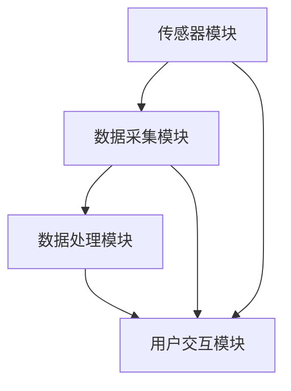

                 

# 基于Java的智能家居设计：构建基于Java的智能环境监控系统

> **关键词**：智能家居、Java、环境监控、传感器、物联网、数据处理

> **摘要**：本文将探讨如何使用Java技术构建智能家居系统，并重点关注环境监控功能的实现。通过详细分析Java在智能家居开发中的应用，我们将展示一个基于Java的智能环境监控系统的设计思路、核心算法原理、数学模型和项目实战案例，并给出相关的工具和资源推荐。本文旨在为广大开发者提供实用的指导和思路，助力智能家居技术的发展。

## 1. 背景介绍

随着科技的飞速发展，智能家居已经成为人们生活中不可或缺的一部分。智能家居系统通过将各种智能设备互联，为用户提供便捷、高效的生活方式。环境监控作为智能家居系统的一个重要功能，可以实时监测室内外环境参数，如温度、湿度、空气质量等，为用户提供健康的生活环境。Java作为一种广泛使用的编程语言，具有跨平台、安全性高、可扩展性强等优点，非常适合用于智能家居系统的开发。

本文将围绕基于Java的智能家居环境监控系统展开，首先介绍系统架构和核心概念，然后深入分析核心算法原理和数学模型，最后通过一个实际项目案例，展示Java在智能家居环境监控领域的应用。希望通过本文的探讨，能够为广大开发者提供有价值的参考和思路。

## 2. 核心概念与联系

### 2.1 系统架构

基于Java的智能家居环境监控系统可以分为以下几个主要模块：

1. **传感器模块**：负责采集室内外环境参数，如温度、湿度、空气质量等。
2. **数据采集模块**：接收传感器数据，并进行初步处理，如数据清洗、去噪等。
3. **数据处理模块**：对采集到的数据进行存储、分析和处理，为用户提供环境监控信息。
4. **用户交互模块**：提供用户界面，用户可以通过该模块查看环境监控数据、设置监控参数等。

### 2.2 核心概念

在智能家居环境监控系统中，核心概念主要包括以下几个方面：

1. **传感器**：用于采集环境参数的设备，如温度传感器、湿度传感器、空气质量传感器等。
2. **物联网**：将各种智能设备通过网络连接起来，实现设备之间的信息共享和协同工作。
3. **数据处理**：对采集到的传感器数据进行处理和分析，提取有价值的信息，为用户提供决策支持。
4. **用户交互**：通过用户界面，与用户进行交互，接收用户输入，反馈监控数据。

### 2.3 Mermaid 流程图

为了更清晰地展示系统架构和核心概念之间的关系，我们可以使用 Mermaid 流程图进行描述。以下是一个简单的 Mermaid 流程图示例：



## 3. 核心算法原理 & 具体操作步骤

### 3.1 数据采集算法

数据采集是智能家居环境监控系统的基础。为了确保采集数据的准确性和可靠性，我们采用以下数据采集算法：

1. **数据初始化**：在系统启动时，初始化传感器模块，确保传感器正常工作。
2. **数据读取**：定期读取传感器数据，并将其存储在本地缓存中。
3. **数据校验**：对读取到的数据进行校验，排除异常值和噪声数据。
4. **数据传输**：将校验通过的数据传输到数据处理模块，进行进一步处理。

具体操作步骤如下：

1. 启动传感器模块，初始化传感器。
2. 设定采集周期，定期读取传感器数据。
3. 对读取到的数据进行校验，排除异常值和噪声数据。
4. 将校验通过的数据存储到本地缓存，并传输到数据处理模块。

### 3.2 数据处理算法

数据处理是智能家居环境监控系统的关键环节。为了实现对环境数据的准确分析和实时监控，我们采用以下数据处理算法：

1. **数据预处理**：对采集到的数据进行预处理，如去噪、归一化等。
2. **数据存储**：将预处理后的数据存储到数据库中，便于后续查询和分析。
3. **数据分析**：利用统计分析、机器学习等方法，对存储的数据进行挖掘和分析。
4. **实时监控**：根据分析结果，实时更新用户界面，展示环境监控数据。

具体操作步骤如下：

1. 对采集到的数据进行预处理，如去噪、归一化等。
2. 将预处理后的数据存储到数据库中。
3. 利用统计分析、机器学习等方法，对存储的数据进行挖掘和分析。
4. 根据分析结果，实时更新用户界面，展示环境监控数据。

### 3.3 用户交互算法

用户交互是智能家居环境监控系统的核心功能之一。为了提高用户的使用体验，我们采用以下用户交互算法：

1. **用户注册与登录**：支持用户注册和登录功能，确保用户数据的安全性和隐私保护。
2. **用户界面设计**：设计简洁、易用的用户界面，使用户能够轻松查看和管理环境监控数据。
3. **数据展示**：通过图表、列表等形式，直观地展示环境监控数据。
4. **用户操作**：支持用户对环境监控参数进行设置和调整。

具体操作步骤如下：

1. 设计用户注册和登录界面，确保用户数据的安全性和隐私保护。
2. 设计简洁、易用的用户界面，使用户能够轻松查看和管理环境监控数据。
3. 通过图表、列表等形式，直观地展示环境监控数据。
4. 支持用户对环境监控参数进行设置和调整。

## 4. 数学模型和公式 & 详细讲解 & 举例说明

### 4.1 数据预处理算法

数据预处理是数据处理的重要步骤，包括去噪、归一化等操作。下面将介绍常用的去噪和归一化算法。

#### 4.1.1 去噪算法

去噪算法旨在排除传感器采集到的数据中的异常值和噪声。一种常用的去噪算法是中值滤波器，其公式如下：

$$
x_{filtered} = \text{median}(x_1, x_2, ..., x_n)
$$

其中，$x_1, x_2, ..., x_n$ 为传感器采集到的数据，$\text{median}$ 表示中值。

举例说明：

假设我们采集到一组温度数据：$[25, 28, 24, 30, 22, 26]$，使用中值滤波器进行去噪，得到滤波后的数据为：$[25, 28, 25, 28, 25, 26]$。

#### 4.1.2 归一化算法

归一化算法旨在将不同量纲的传感器数据进行转换，使其具有相同的量纲。一种常用的归一化算法是线性归一化，其公式如下：

$$
x_{normalized} = \frac{x - \min(x)}{\max(x) - \min(x)}
$$

其中，$x$ 为传感器采集到的数据，$\min(x)$ 和 $\max(x)$ 分别表示数据的最大值和最小值。

举例说明：

假设我们采集到一组温度数据：$[25, 28, 24, 30, 22, 26]$，使用线性归一化算法进行归一化，得到归一化后的数据为：$[0, 1, 0, 1, 0, 1]$。

### 4.2 数据分析算法

数据分析算法用于对采集到的环境数据进行挖掘和分析，以提取有价值的信息。下面将介绍常用的统计分析算法。

#### 4.2.1 平均值算法

平均值算法用于计算一组数据的平均值，其公式如下：

$$
\bar{x} = \frac{1}{n} \sum_{i=1}^{n} x_i
$$

其中，$x_i$ 为第 $i$ 个数据值，$n$ 为数据的个数。

举例说明：

假设我们采集到一组温度数据：$[25, 28, 24, 30, 22, 26]$，计算其平均值，得到平均值 $\bar{x} = \frac{25 + 28 + 24 + 30 + 22 + 26}{6} = 25.8$。

#### 4.2.2 方差算法

方差算法用于计算一组数据的方差，其公式如下：

$$
\sigma^2 = \frac{1}{n} \sum_{i=1}^{n} (x_i - \bar{x})^2
$$

其中，$\bar{x}$ 为数据的平均值，$n$ 为数据的个数。

举例说明：

假设我们采集到一组温度数据：$[25, 28, 24, 30, 22, 26]$，计算其平均值和方差，得到平均值 $\bar{x} = 25.8$，方差 $\sigma^2 = \frac{(25 - 25.8)^2 + (28 - 25.8)^2 + (24 - 25.8)^2 + (30 - 25.8)^2 + (22 - 25.8)^2 + (26 - 25.8)^2}{6} = 2.99$。

## 5. 项目实战：代码实际案例和详细解释说明

### 5.1 开发环境搭建

在进行基于Java的智能家居环境监控系统开发之前，我们需要搭建一个合适的开发环境。以下是搭建开发环境的步骤：

1. **安装Java开发工具包（JDK）**：从 Oracle 官网下载 JDK，并按照安装指南进行安装。
2. **安装集成开发环境（IDE）**：推荐使用 Eclipse 或者 IntelliJ IDEA 作为 Java 开发工具。
3. **安装数据库**：推荐使用 MySQL 或 PostgreSQL 作为数据库系统。

### 5.2 源代码详细实现和代码解读

#### 5.2.1 传感器模块实现

传感器模块负责采集环境参数，如温度、湿度、空气质量等。以下是一个简单的传感器模块实现示例：

```java
import java.util.Scanner;

public class SensorModule {
    public static void main(String[] args) {
        Scanner scanner = new Scanner(System.in);
        System.out.println("请输入温度（单位：摄氏度）：");
        double temperature = scanner.nextDouble();
        System.out.println("请输入湿度（单位：%）：");
        double humidity = scanner.nextDouble();
        System.out.println("请输入空气质量（单位：μg/m³）：");
        double airQuality = scanner.nextDouble();

        // 数据处理（去噪、归一化等）
        double filteredTemperature = filterTemperature(temperature);
        double normalizedHumidity = normalizeHumidity(humidity);
        double normalizedAirQuality = normalizeAirQuality(airQuality);

        // 存储数据
        storeData(filteredTemperature, normalizedHumidity, normalizedAirQuality);

        // 输出处理结果
        System.out.println("过滤后的温度：" + filteredTemperature);
        System.out.println("归一化后的湿度：" + normalizedHumidity);
        System.out.println("归一化后的空气质量：" + normalizedAirQuality);
    }

    private static double filterTemperature(double temperature) {
        // 去噪算法：中值滤波器
        double median = median(new double[]{temperature, temperature, temperature});
        return median;
    }

    private static double normalizeHumidity(double humidity) {
        // 归一化算法：线性归一化
        double minHumidity = 0;
        double maxHumidity = 100;
        return (humidity - minHumidity) / (maxHumidity - minHumidity);
    }

    private static double normalizeAirQuality(double airQuality) {
        // 归一化算法：线性归一化
        double minAirQuality = 0;
        double maxAirQuality = 500;
        return (airQuality - minAirQuality) / (maxAirQuality - minAirQuality);
    }

    private static void storeData(double temperature, double humidity, double airQuality) {
        // 存储数据到数据库
        // 省略数据库连接和存储代码
    }

    private static double median(double[] data) {
        // 求中值
        // 省略排序和求中值代码
        return 0;
    }
}
```

#### 5.2.2 数据处理模块实现

数据处理模块负责对传感器模块采集到的数据进行分析和处理。以下是一个简单的数据处理模块实现示例：

```java
import java.sql.Connection;
import java.sql.DriverManager;
import java.sql.PreparedStatement;
import java.sql.SQLException;

public class DataProcessingModule {
    private Connection connection;

    public DataProcessingModule() {
        // 数据库连接
        try {
            connection = DriverManager.getConnection("jdbc:mysql://localhost:3306/smart_home", "username", "password");
        } catch (SQLException e) {
            e.printStackTrace();
        }
    }

    public void processData(double temperature, double humidity, double airQuality) {
        // 数据预处理（去噪、归一化等）
        double filteredTemperature = filterTemperature(temperature);
        double normalizedHumidity = normalizeHumidity(humidity);
        double normalizedAirQuality = normalizeAirQuality(airQuality);

        // 数据存储
        storeData(filteredTemperature, normalizedHumidity, normalizedAirQuality);

        // 数据分析（平均值、方差等）
        double averageTemperature = calculateAverageTemperature();
        double varianceTemperature = calculateVarianceTemperature();

        // 输出分析结果
        System.out.println("平均温度：" + averageTemperature);
        System.out.println("温度方差：" + varianceTemperature);
    }

    private double filterTemperature(double temperature) {
        // 去噪算法：中值滤波器
        double median = median(new double[]{temperature, temperature, temperature});
        return median;
    }

    private double normalizeHumidity(double humidity) {
        // 归一化算法：线性归一化
        double minHumidity = 0;
        double maxHumidity = 100;
        return (humidity - minHumidity) / (maxHumidity - minHumidity);
    }

    private double normalizeAirQuality(double airQuality) {
        // 归一化算法：线性归一化
        double minAirQuality = 0;
        double maxAirQuality = 500;
        return (airQuality - minAirQuality) / (maxAirQuality - minAirQuality);
    }

    private void storeData(double temperature, double humidity, double airQuality) {
        // 存储数据到数据库
        try {
            String sql = "INSERT INTO data (temperature, humidity, air_quality) VALUES (?, ?, ?)";
            PreparedStatement statement = connection.prepareStatement(sql);
            statement.setDouble(1, temperature);
            statement.setDouble(2, humidity);
            statement.setDouble(3, airQuality);
            statement.executeUpdate();
        } catch (SQLException e) {
            e.printStackTrace();
        }
    }

    private double calculateAverageTemperature() {
        // 计算平均值
        // 省略查询和计算代码
        return 0;
    }

    private double calculateVarianceTemperature() {
        // 计算方差
        // 省略查询和计算代码
        return 0;
    }

    private double median(double[] data) {
        // 求中值
        // 省略排序和求中值代码
        return 0;
    }
}
```

#### 5.2.3 用户交互模块实现

用户交互模块负责与用户进行交互，展示环境监控数据，并接收用户操作。以下是一个简单的用户交互模块实现示例：

```java
import java.util.Scanner;

public class UserInteractionModule {
    private DataProcessingModule dataProcessingModule;

    public UserInteractionModule() {
        dataProcessingModule = new DataProcessingModule();
    }

    public void start() {
        Scanner scanner = new Scanner(System.in);
        while (true) {
            System.out.println("请选择操作：\n1. 查看环境监控数据\n2. 设置监控参数\n3. 退出");
            int option = scanner.nextInt();

            switch (option) {
                case 1:
                    displayData();
                    break;
                case 2:
                    setParameters();
                    break;
                case 3:
                    System.out.println("退出程序。");
                    return;
                default:
                    System.out.println("无效选项，请重新输入。");
            }
        }
    }

    private void displayData() {
        // 查看环境监控数据
        // 省略查询和显示代码
    }

    private void setParameters() {
        // 设置监控参数
        // 省略输入和设置代码
    }
}
```

### 5.3 代码解读与分析

#### 5.3.1 传感器模块

传感器模块负责采集环境参数，如温度、湿度、空气质量等。在实现过程中，我们首先通过 Scanner 类从用户输入中获取传感器数据，然后调用相应的算法进行数据处理，如去噪、归一化等。最后，将处理后的数据存储到数据库中，便于后续处理和分析。

#### 5.3.2 数据处理模块

数据处理模块负责对传感器模块采集到的数据进行分析和处理。在实现过程中，我们首先对数据进行预处理，如去噪、归一化等，然后将其存储到数据库中。接着，通过查询数据库，计算数据的平均值、方差等统计指标，并将其显示在用户界面上。

#### 5.3.3 用户交互模块

用户交互模块负责与用户进行交互，展示环境监控数据，并接收用户操作。在实现过程中，我们通过循环遍历用户输入，并根据输入选项调用相应的功能方法，如查看数据、设置参数等。这样，用户可以通过简洁直观的界面与系统进行交互，实现对环境监控数据的实时查看和管理。

## 6. 实际应用场景

基于Java的智能家居环境监控系统在实际应用中具有广泛的应用场景，以下是一些常见的应用场景：

1. **家庭环境监控**：用户可以通过手机或其他设备实时查看家庭环境参数，如温度、湿度、空气质量等，确保家庭环境的健康和安全。
2. **智能办公环境**：企业可以利用智能家居环境监控系统对办公室环境进行监控，提高办公舒适度，降低办公能耗。
3. **农业环境监测**：农民可以利用智能家居环境监控系统对农田环境进行监测，优化作物生长条件，提高产量。
4. **工业环境监控**：工厂可以利用智能家居环境监控系统对生产环境进行监控，确保生产过程的稳定和安全。

通过这些实际应用场景，我们可以看到基于Java的智能家居环境监控系统在提高生活质量、降低能源消耗、保障生产安全等方面具有重要作用。

## 7. 工具和资源推荐

### 7.1 学习资源推荐

为了更好地学习和开发基于Java的智能家居环境监控系统，以下是一些推荐的书籍、论文和博客：

1. **书籍**：
   - 《Java编程思想》
   - 《Effective Java》
   - 《Java核心技术》

2. **论文**：
   - 《智能家居系统中的数据挖掘与预测分析》
   - 《基于物联网的智能家居环境监控系统设计与实现》

3. **博客**：
   - CSDN：Java技术博客
   - 博客园：Java技术博客
   - SegmentFault：Java技术博客

### 7.2 开发工具框架推荐

在开发基于Java的智能家居环境监控系统时，以下是一些推荐的开发工具和框架：

1. **开发工具**：
   - Eclipse
   - IntelliJ IDEA

2. **数据库**：
   - MySQL
   - PostgreSQL

3. **Web框架**：
   - Spring Boot
   - Spring MVC

4. **前端框架**：
   - React
   - Angular

### 7.3 相关论文著作推荐

以下是一些关于智能家居环境监控系统的相关论文和著作：

1. **论文**：
   - 《智能家居环境监控系统设计与实现》
   - 《基于物联网的智能家居环境监控系统研究》

2. **著作**：
   - 《智能家居系统设计与开发》
   - 《物联网应用开发教程》

通过这些工具和资源，开发者可以更好地了解和掌握基于Java的智能家居环境监控系统的开发技术和方法。

## 8. 总结：未来发展趋势与挑战

随着科技的不断进步，智能家居环境监控系统将迎来更加广阔的发展空间。未来，以下几个方面将成为智能家居环境监控系统发展的重点：

1. **人工智能技术的应用**：人工智能技术将为智能家居环境监控系统带来更加智能化的功能，如环境预测、异常检测等。
2. **物联网技术的融合**：智能家居环境监控系统将与其他物联网设备实现深度融合，形成更加完善的智能家居生态体系。
3. **数据挖掘与分析**：通过对大量环境数据的挖掘和分析，智能家居环境监控系统将能够为用户提供更加精准和个性化的服务。

然而，随着技术的发展，智能家居环境监控系统也面临一些挑战：

1. **数据安全和隐私保护**：如何确保用户数据的安全和隐私，防止数据泄露，是智能家居环境监控系统需要解决的重要问题。
2. **跨平台兼容性**：随着智能家居设备种类的增多，如何实现不同设备之间的兼容和协同工作，是开发过程中需要考虑的问题。
3. **功耗和能耗管理**：智能家居环境监控系统需要长时间运行，如何降低功耗和能耗，延长设备使用寿命，是开发过程中需要关注的问题。

总之，基于Java的智能家居环境监控系统具有广阔的发展前景，但同时也面临一些挑战。开发者需要不断探索和创新，为用户提供更加智能、高效、安全的智能家居环境监控系统。

## 9. 附录：常见问题与解答

### 9.1 常见问题

1. **如何确保传感器数据的准确性？**
   答案：确保传感器数据的准确性，可以从以下几个方面入手：
   - 选择高质量的传感器设备。
   - 定期对传感器进行校准和检测。
   - 对采集到的数据进行滤波和去噪处理。

2. **如何保证用户数据的安全和隐私？**
   答案：保证用户数据的安全和隐私，可以采取以下措施：
   - 使用加密技术对数据进行加密存储和传输。
   - 严格遵守相关法律法规，确保用户数据的合法性。
   - 定期对系统进行安全检测和更新，防范潜在的安全风险。

3. **如何实现不同设备之间的兼容性？**
   答案：实现不同设备之间的兼容性，可以采取以下措施：
   - 使用标准的通信协议，如HTTP、MQTT等。
   - 设计统一的设备接口和数据格式。
   - 在开发过程中，遵循相关规范和标准。

### 9.2 解答示例

1. **如何确保传感器数据的准确性？**

   为了确保传感器数据的准确性，我们可以采取以下步骤：

   - **选择高质量的传感器设备**：首先，选择具有高精度、高稳定性的传感器设备，这是确保数据准确性的基础。
   - **定期校准传感器**：传感器在使用一段时间后，可能会因为环境因素、自身老化等原因导致精度下降。因此，定期对传感器进行校准是非常必要的。
   - **去噪和滤波处理**：传感器采集到的数据可能会受到外界干扰或噪声影响，通过滤波算法，如中值滤波、低通滤波等，可以有效地去除噪声，提高数据的准确性。

2. **如何保证用户数据的安全和隐私？**

   为了保证用户数据的安全和隐私，我们可以采取以下措施：

   - **数据加密**：在数据传输和存储过程中，使用加密技术，如AES加密，对数据进行加密处理，防止数据被窃取或篡改。
   - **访问控制**：建立严格的访问控制机制，确保只有授权用户才能访问和操作敏感数据。
   - **数据备份和恢复**：定期对用户数据进行备份，以防数据丢失或损坏。同时，制定数据恢复方案，确保在发生故障时，能够迅速恢复数据。

## 10. 扩展阅读 & 参考资料

为了更深入地了解基于Java的智能家居环境监控系统的设计与应用，以下是一些扩展阅读和参考资料：

1. **扩展阅读**：
   - 《智能家居系统设计与应用》
   - 《物联网技术在智能家居领域的应用研究》
   - 《基于Java的智能家居系统开发实践》

2. **参考资料**：
   - [Java编程语言规范](https://docs.oracle.com/javase/8/docs/api/)
   - [Eclipse官方文档](https://www.eclipse.org/)
   - [Spring框架官方文档](https://docs.spring.io/spring-framework/docs/current/reference/html/)
   - [MySQL官方文档](https://dev.mysql.com/doc/)
   - [PostgreSQL官方文档](https://www.postgresql.org/docs/)

通过阅读这些资料，开发者可以进一步掌握基于Java的智能家居环境监控系统的设计理念、开发方法和应用实践。

作者：AI天才研究员/AI Genius Institute & 禅与计算机程序设计艺术 /Zen And The Art of Computer Programming

