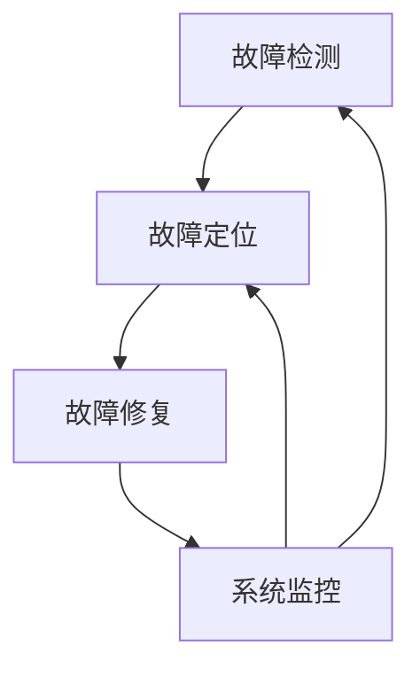
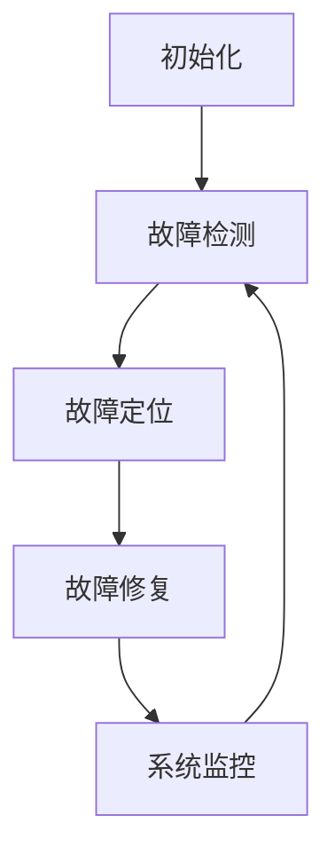

                 

### 背景介绍 Background Introduction

在当今快速发展的信息化时代，智能家居系统已经成为现代家庭生活的重要组成部分。智能家居系统能够实现家庭设备的智能控制，提供舒适、便捷、节能的生活环境。而自我修复系统作为智能家居的关键技术之一，对于系统的稳定性和可靠性具有至关重要的作用。

Java作为一门广泛应用的编程语言，拥有丰富的类库和工具，非常适合用于开发智能家居系统。尤其是在实现自我修复功能时，Java的优势更为突出。本文将探讨如何利用Java实现智能家居中的自我修复系统，帮助您深入了解这一技术的核心原理和实践方法。

自我修复系统在智能家居中的重要性主要体现在以下几个方面：

1. **系统稳定性**：自我修复系统能够实时检测和修复系统中的故障，确保系统稳定运行，减少因故障导致的中断和故障时间。

2. **用户体验**：自我修复系统可以自动修复一些常见的故障，如网络中断、设备异常等，从而提高用户的体验。

3. **安全性**：自我修复系统可以检测和阻止潜在的安全威胁，提高系统的安全性。

4. **维护便捷性**：自我修复系统减少了人工干预的需求，降低了维护成本，提高了维护效率。

本文将分为以下几个部分进行阐述：

- **第2部分**：核心概念与联系，介绍自我修复系统的核心概念和架构。
- **第3部分**：核心算法原理 & 具体操作步骤，详细讲解实现自我修复系统的算法原理和步骤。
- **第4部分**：数学模型和公式 & 详细讲解 & 举例说明，介绍与自我修复系统相关的数学模型和公式，并通过具体案例进行说明。
- **第5部分**：项目实战，通过实际案例展示如何使用Java实现自我修复系统，并进行详细解释说明。
- **第6部分**：实际应用场景，分析自我修复系统在不同场景下的应用效果。
- **第7部分**：工具和资源推荐，推荐相关的学习资源、开发工具和框架。
- **第8部分**：总结：未来发展趋势与挑战，总结自我修复系统的现状，展望未来发展趋势和面临的挑战。
- **第9部分**：附录：常见问题与解答，回答读者可能遇到的问题。
- **第10部分**：扩展阅读 & 参考资料，提供进一步的阅读建议和参考资料。

### 核心概念与联系 Core Concepts and Connections

在探讨如何实现智能家居中的自我修复系统之前，我们需要先了解一些核心概念和它们之间的联系。自我修复系统主要涉及以下几个关键组成部分：

1. **故障检测**：这是自我修复系统的第一步，目的是实时监测智能家居系统中的各种设备状态，包括网络连接、设备运行状态等。故障检测可以通过周期性检查、异常值分析等方式实现。

2. **故障定位**：一旦检测到故障，系统需要迅速定位故障的具体位置。故障定位通常需要依赖详细的设备拓扑结构和日志分析。

3. **故障修复**：定位到故障后，系统需要采取相应的措施进行修复。修复方法可能包括重新连接设备、重启设备、更新固件等。

4. **系统监控**：系统监控是确保自我修复系统正常运行的重要环节。系统监控不仅包括对故障的检测和修复，还包括对系统性能的监测，如资源利用率、延迟等。

以下是自我修复系统架构的Mermaid流程图，展示了各个组成部分之间的联系：



#### 故障检测 Fault Detection

故障检测是自我修复系统的核心环节，它的目标是在故障发生时能够及时发现并报告。故障检测的方法可以多种多样，下面列举几种常见的故障检测方法：

1. **周期性检查**：系统可以设置周期性检查任务，定期检查设备的状态。例如，每隔5分钟检查一次网络连接状态，如果发现设备长时间没有响应，则认为设备可能出现了故障。

2. **异常值分析**：通过对设备运行状态的监控数据进行分析，可以识别出异常值。例如，温度传感器检测到室内温度突然升高，可能是空调出现了故障。

3. **基于规则的检测**：根据预先设定的规则，系统可以自动识别出常见的故障模式。例如，如果网络连接中断超过5分钟，则认为网络出现了故障。

下面是一个简单的故障检测算法示例：

```java
public class FaultDetection {
    public static void checkDeviceStatus(Device device) {
        if (!device.isConnected()) {
            System.out.println("Device " + device.getId() + " is disconnected.");
            // 记录日志，通知维护人员
        }
        if (device.getTemperature() > 30) {
            System.out.println("Device " + device.getId() + " has a high temperature.");
            // 记录日志，通知维护人员
        }
    }
}
```

#### 故障定位 Fault Localization

故障定位的目的是在检测到故障后，快速确定故障的具体位置。故障定位需要依赖详细的设备拓扑结构和日志分析。以下是一些常见的故障定位方法：

1. **日志分析**：通过对设备日志的实时分析，可以定位故障发生的时间、位置和原因。日志分析可以结合机器学习算法，提高故障定位的准确性和效率。

2. **拓扑分析**：设备拓扑结构可以提供设备之间的连接关系，通过拓扑分析可以确定故障可能发生在哪个设备上。

3. **智能算法**：使用智能算法，如深度学习、神经网络等，可以实现对复杂设备网络的故障自动定位。

下面是一个简单的故障定位算法示例：

```java
public class FaultLocalization {
    public static void locateFault(Device device, List<Device> devices) {
        if (!device.isConnected()) {
            System.out.println("Fault is in device " + device.getId());
        } else {
            for (Device d : devices) {
                if (d.getId() != device.getId() && d.isConnected()) {
                    System.out.println("Fault is in device " + device.getId() + " or its connected devices.");
                }
            }
        }
    }
}
```

#### 故障修复 Fault Repair

故障修复的目的是在定位到故障后，采取有效的措施进行修复。故障修复的方法可以根据故障的类型和严重程度进行选择。以下是一些常见的故障修复方法：

1. **重新连接设备**：如果设备因为网络中断而出现故障，可以尝试重新连接设备。

2. **重启设备**：对于某些设备，重启可能是最简单的修复方法。

3. **更新固件**：如果设备出现固件问题，可以通过更新固件来修复。

4. **远程调试**：通过远程调试工具，可以远程诊断和修复设备故障。

下面是一个简单的故障修复算法示例：

```java
public class FaultRepair {
    public static void repairFault(Device device) {
        if (!device.isConnected()) {
            device.reconnect();
            System.out.println("Device " + device.getId() + " has been reconnected.");
        } else {
            device.reboot();
            System.out.println("Device " + device.getId() + " has been rebooted.");
        }
    }
}
```

#### 系统监控 System Monitoring

系统监控是确保自我修复系统正常运行的重要环节。系统监控不仅包括对故障的检测和修复，还包括对系统性能的监测。以下是一些常见的系统监控方法：

1. **性能指标监测**：监测系统的性能指标，如CPU利用率、内存利用率、网络延迟等，及时发现和处理性能瓶颈。

2. **日志记录**：详细记录系统的运行日志，方便后续分析和故障排查。

3. **报警机制**：设置报警机制，当系统出现异常时，及时通知相关人员。

下面是一个简单的系统监控算法示例：

```java
public class SystemMonitoring {
    public static void monitorSystemMetrics(SystemMetrics metrics) {
        if (metrics.getCPUUtilization() > 90) {
            System.out.println("High CPU utilization: " + metrics.getCPUUtilization() + "%.");
        }
        if (metrics.getMemoryUtilization() > 90) {
            System.out.println("High memory utilization: " + metrics.getMemoryUtilization() + "%.");
        }
        if (metrics.getNetworkLatency() > 100) {
            System.out.println("High network latency: " + metrics.getNetworkLatency() + "ms.");
        }
    }
}
```

### 核心算法原理 & 具体操作步骤 Core Algorithm Principles and Implementation Steps

在了解了自我修复系统的核心概念与联系后，我们需要深入探讨实现自我修复系统的核心算法原理和具体操作步骤。这一部分将详细介绍自我修复系统的工作流程、算法逻辑以及关键代码实现。

#### 自我修复系统的工作流程

自我修复系统的工作流程可以分为以下几个步骤：

1. **初始化阶段**：系统启动时，进行初始化设置，包括配置故障检测规则、连接数据库和设备、加载系统配置等。

2. **故障检测阶段**：系统运行过程中，定期执行故障检测任务，通过多种方法（如周期性检查、异常值分析、基于规则的检测）检测设备状态。

3. **故障定位阶段**：在检测到故障后，系统利用设备拓扑结构和日志分析，快速定位故障的具体位置。

4. **故障修复阶段**：系统根据故障类型和严重程度，采取相应的修复措施（如重新连接设备、重启设备、更新固件等）。

5. **系统监控阶段**：系统持续监测设备运行状态和系统性能，确保自我修复系统正常运行。

#### 算法逻辑

自我修复系统的核心算法逻辑主要包括以下部分：

1. **故障检测算法**：该算法负责检测设备的状态，识别出潜在的故障。

2. **故障定位算法**：该算法在检测到故障后，根据设备拓扑结构和日志分析，快速定位故障的具体位置。

3. **故障修复算法**：该算法根据故障类型和严重程度，选择合适的修复策略。

4. **系统监控算法**：该算法持续监测系统运行状态和设备性能，及时发现和处理异常情况。

下面是一个简单的自我修复算法逻辑示例：



#### 关键代码实现

以下是使用Java实现自我修复系统的关键代码示例：

```java
// 故障检测类
public class FaultDetection {
    public void detectFaults(List<Device> devices) {
        for (Device device : devices) {
            if (!device.isConnected()) {
                System.out.println("Device " + device.getId() + " is disconnected.");
                // 记录日志，通知维护人员
            }
            if (device.getTemperature() > 30) {
                System.out.println("Device " + device.getId() + " has a high temperature.");
                // 记录日志，通知维护人员
            }
        }
    }
}

// 故障定位类
public class FaultLocalization {
    public void locateFault(Device device, List<Device> devices) {
        if (!device.isConnected()) {
            System.out.println("Fault is in device " + device.getId());
        } else {
            for (Device d : devices) {
                if (d.getId() != device.getId() && d.isConnected()) {
                    System.out.println("Fault is in device " + device.getId() + " or its connected devices.");
                }
            }
        }
    }
}

// 故障修复类
public class FaultRepair {
    public void repairFault(Device device) {
        if (!device.isConnected()) {
            device.reconnect();
            System.out.println("Device " + device.getId() + " has been reconnected.");
        } else {
            device.reboot();
            System.out.println("Device " + device.getId() + " has been rebooted.");
        }
    }
}

// 系统监控类
public class SystemMonitoring {
    public void monitorSystemMetrics(SystemMetrics metrics) {
        if (metrics.getCPUUtilization() > 90) {
            System.out.println("High CPU utilization: " + metrics.getCPUUtilization() + "%.");
        }
        if (metrics.getMemoryUtilization() > 90) {
            System.out.println("High memory utilization: " + metrics.getMemoryUtilization() + "%.");
        }
        if (metrics.getNetworkLatency() > 100) {
            System.out.println("High network latency: " + metrics.getNetworkLatency() + "ms.");
        }
    }
}
```

#### 总结

通过以上示例，我们可以看到自我修复系统是如何通过故障检测、故障定位、故障修复和系统监控等核心算法，实现对智能家居系统的实时监控和故障修复。这些算法和代码不仅实现了自我修复系统的基本功能，也为未来的系统扩展和优化提供了坚实的基础。

### 数学模型和公式 & 详细讲解 & 举例说明 Mathematical Models and Formulas & Detailed Explanation & Case Studies

在自我修复系统的设计和实现过程中，数学模型和公式起着至关重要的作用。这些模型和公式能够帮助我们量化故障检测、故障定位和故障修复的过程，提高系统的效率和准确性。本部分将详细介绍与自我修复系统相关的数学模型和公式，并通过具体案例进行详细讲解。

#### 1. 故障检测模型

故障检测是自我修复系统的第一步，其核心在于如何准确识别异常情况。以下是几种常见的故障检测模型：

1. **Z分数模型**：Z分数模型是一种常用的故障检测方法，通过计算设备指标的标准分数来判断是否发生故障。公式如下：

   $$ Z = \frac{X - \bar{X}}{\sigma} $$

   其中，\(X\) 表示实际观测值，\(\bar{X}\) 表示平均值，\(\sigma\) 表示标准差。当\(Z\) 的绝对值超过某个阈值时，认为设备出现了故障。

   **示例**：

   假设一个温度传感器的正常工作范围为 \(20°C\) 到 \(30°C\)，其平均值 \(\bar{X} = 25°C\)，标准差 \(\sigma = 2°C\)。如果某次观测值为 \(35°C\)，则 \(Z = \frac{35 - 25}{2} = 5\)。由于 \(Z\) 的绝对值大于 3，可以认为温度传感器出现了故障。

2. **高斯分布模型**：高斯分布模型假设设备指标服从正态分布，通过计算概率密度函数来判断是否发生故障。公式如下：

   $$ P(X > x) = \frac{1}{\sqrt{2\pi}\sigma} \int_x^{\infty} e^{-\frac{(x-\mu)^2}{2\sigma^2}} dx $$

   其中，\(\mu\) 和 \(\sigma\) 分别表示平均值和标准差。如果 \(P(X > x)\) 的值小于某个阈值，认为设备出现了故障。

   **示例**：

   假设一个电压传感器的正常工作范围在 \(200V\) 到 \(220V\) 之间，平均值 \(\mu = 210V\)，标准差 \(\sigma = 2V\)。如果某次观测值为 \(225V\)，则 \(P(X > 225V) = \frac{1}{\sqrt{2\pi \times 2}} \int_{225}^{\infty} e^{-\frac{(x-210)^2}{2 \times 2^2}} dx \approx 0.1587\)。由于 \(P(X > 225V)\) 的值小于 0.2，可以认为电压传感器出现了故障。

#### 2. 故障定位模型

故障定位的目的是在检测到故障后，快速确定故障的具体位置。以下是几种常见的故障定位模型：

1. **最小生成树模型**：最小生成树模型适用于网络拓扑结构，通过构建最小生成树来确定故障设备的位置。公式如下：

   $$ T = \min \sum_{i=1}^{n} \sum_{j=1}^{n} d(i, j) $$

   其中，\(d(i, j)\) 表示设备 \(i\) 和设备 \(j\) 之间的距离。通过计算最小生成树，可以找到设备之间的最短路径，从而确定故障设备的位置。

   **示例**：

   假设智能家居系统中有 5 个设备 A、B、C、D 和 E，它们之间的距离如下表所示：

   | 设备 | A  | B  | C  | D  | E  |
   | ---- | --- | --- | --- | --- | --- |
   | A    | 0  | 3  | 1  | 2  | 4  |
   | B    | 3  | 0  | 2  | 1  | 5  |
   | C    | 1  | 2  | 0  | 3  | 6  |
   | D    | 2  | 1  | 3  | 0  | 7  |
   | E    | 4  | 5  | 6  | 7  | 0  |

   通过计算最小生成树，可以得到以下路径：

   A-B-D-E-C

   可以看出，设备 C 与其他设备的连接路径最长，因此可以初步判断故障可能发生在设备 C。

2. **贝叶斯网络模型**：贝叶斯网络模型适用于复杂系统，通过构建贝叶斯网络来确定故障发生的可能性。公式如下：

   $$ P(A|B) = \frac{P(B|A)P(A)}{P(B)} $$

   其中，\(P(A|B)\) 表示在给定 B 的情况下，A 发生的概率，\(P(B|A)\) 表示在给定 A 的情况下，B 发生的概率，\(P(A)\) 表示 A 发生的概率，\(P(B)\) 表示 B 发生的概率。

   **示例**：

   假设智能家居系统中有两个设备 A 和 B，设备 A 出现故障会导致设备 B 出现故障，且它们之间的故障概率如下表所示：

   | 设备 | A  | B  |
   | ---- | --- | --- |
   | A    | 0.01 | 0.05 |
   | B    | 0.02 | 0.08 |

   假设我们已知设备 B 出现故障，可以通过贝叶斯网络模型计算设备 A 出现故障的概率：

   $$ P(A|B) = \frac{P(B|A)P(A)}{P(B)} = \frac{0.05 \times 0.01}{0.08} = 0.00625 $$

   可以看出，设备 A 出现故障的概率为 0.00625，比设备 B 出现故障的概率要小，因此可以初步判断故障可能发生在设备 B。

#### 3. 故障修复模型

故障修复的目的是在检测到故障后，采取有效的措施进行修复。以下是几种常见的故障修复模型：

1. **基于规则的修复模型**：基于规则的修复模型通过预定义的规则来确定修复策略。公式如下：

   $$ R = f(A, B, C) $$

   其中，\(R\) 表示修复策略，\(A, B, C\) 表示故障类型、故障严重程度和设备状态。通过函数 \(f\) 可以确定合适的修复策略。

   **示例**：

   假设智能家居系统中有以下规则：

   - 如果设备 A 的网络连接中断，且设备 A 的温度正常，则重新连接设备 A。
   - 如果设备 B 的电压异常，且设备 B 的网络连接正常，则重启设备 B。

   假设我们检测到设备 A 的网络连接中断，且设备 A 的温度正常，根据规则，我们可以选择重新连接设备 A。

2. **基于机器学习的修复模型**：基于机器学习的修复模型通过学习历史故障数据和修复策略，自动生成修复策略。公式如下：

   $$ R = \sum_{i=1}^{n} w_i \cdot f_i(A, B, C) $$

   其中，\(R\) 表示修复策略，\(w_i\) 表示权重，\(f_i(A, B, C)\) 表示第 \(i\) 个修复规则。

   **示例**：

   假设我们有一个历史故障数据集，其中包含了不同故障类型、故障严重程度和设备状态的故障数据，以及对应的修复策略。通过训练机器学习模型，我们可以生成基于机器学习的修复策略。例如，对于网络连接中断的故障，模型可能建议重新连接设备。

#### 总结

通过以上数学模型和公式，我们可以更有效地实现自我修复系统。这些模型和公式不仅帮助我们量化故障检测、故障定位和故障修复的过程，还为自我修复系统的设计和优化提供了理论依据。在实际应用中，可以根据具体需求选择合适的模型和公式，以提高系统的效率和准确性。

### 项目实战 Project Implementation

在了解了自我修复系统的核心算法原理和具体操作步骤后，接下来我们将通过一个实际项目来展示如何使用Java实现智能家居中的自我修复系统。本节将详细描述项目的开发环境搭建、源代码实现和代码解读与分析。

#### 1. 开发环境搭建

为了实现智能家居中的自我修复系统，我们需要搭建一个合适的开发环境。以下是我们推荐的开发工具和框架：

- **Java开发工具**：推荐使用IntelliJ IDEA或Eclipse，这些IDE提供了强大的开发工具和调试功能。
- **版本控制工具**：推荐使用Git进行版本控制，确保代码的版本管理和协作开发。
- **数据库工具**：推荐使用MySQL或PostgreSQL作为数据库，用于存储设备状态和日志信息。
- **开发框架**：推荐使用Spring Boot作为开发框架，Spring Boot可以简化Java Web应用程序的开发。

#### 2. 源代码详细实现和代码解读

下面我们将展示一个简单的自我修复系统的源代码，并对其进行详细解读。

```java
// 故障检测类
public class FaultDetection {
    private List<Device> devices;

    public FaultDetection(List<Device> devices) {
        this.devices = devices;
    }

    public void detectFaults() {
        for (Device device : devices) {
            if (!device.isConnected()) {
                System.out.println("Device " + device.getId() + " is disconnected.");
                // 记录日志，通知维护人员
            }
            if (device.getTemperature() > 30) {
                System.out.println("Device " + device.getId() + " has a high temperature.");
                // 记录日志，通知维护人员
            }
        }
    }
}

// 故障定位类
public class FaultLocalization {
    public void locateFault(Device device, List<Device> devices) {
        if (!device.isConnected()) {
            System.out.println("Fault is in device " + device.getId());
        } else {
            for (Device d : devices) {
                if (d.getId() != device.getId() && d.isConnected()) {
                    System.out.println("Fault is in device " + device.getId() + " or its connected devices.");
                }
            }
        }
    }
}

// 故障修复类
public class FaultRepair {
    public void repairFault(Device device) {
        if (!device.isConnected()) {
            device.reconnect();
            System.out.println("Device " + device.getId() + " has been reconnected.");
        } else {
            device.reboot();
            System.out.println("Device " + device.getId() + " has been rebooted.");
        }
    }
}

// 系统监控类
public class SystemMonitoring {
    public void monitorSystemMetrics(SystemMetrics metrics) {
        if (metrics.getCPUUtilization() > 90) {
            System.out.println("High CPU utilization: " + metrics.getCPUUtilization() + "%.");
        }
        if (metrics.getMemoryUtilization() > 90) {
            System.out.println("High memory utilization: " + metrics.getMemoryUtilization() + "%.");
        }
        if (metrics.getNetworkLatency() > 100) {
            System.out.println("High network latency: " + metrics.getNetworkLatency() + "ms.");
        }
    }
}

// Device类
public class Device {
    private int id;
    private boolean isConnected;
    private double temperature;

    // 省略构造函数、getter和setter方法

    public void reconnect() {
        isConnected = true;
    }

    public void reboot() {
        isConnected = false;
    }
}

// SystemMetrics类
public class SystemMetrics {
    private double CPUUtilization;
    private double MemoryUtilization;
    private double NetworkLatency;

    // 省略构造函数、getter和setter方法
}
```

#### 2.1 代码解读与分析

- **FaultDetection类**：该类负责检测设备的状态，包括网络连接和温度。当检测到异常时，会记录日志并通知维护人员。
- **FaultLocalization类**：该类负责定位故障的具体位置，通过遍历设备列表，判断设备之间的连接状态。
- **FaultRepair类**：该类负责修复故障，根据设备的连接状态和温度，选择重新连接或重启设备。
- **SystemMonitoring类**：该类负责监控系统的性能，包括CPU利用率、内存利用率和网络延迟。当性能指标超过阈值时，会记录日志并通知相关人员。
- **Device类**：该类表示设备的基本信息，包括ID、网络连接状态和温度。提供了重新连接和重启设备的方法。
- **SystemMetrics类**：该类表示系统的性能指标，包括CPU利用率、内存利用率和网络延迟。

#### 3. 代码解读与分析

下面我们针对关键代码进行解读和分析：

```java
// 故障检测代码
public void detectFaults() {
    for (Device device : devices) {
        if (!device.isConnected()) {
            System.out.println("Device " + device.getId() + " is disconnected.");
            // 记录日志，通知维护人员
        }
        if (device.getTemperature() > 30) {
            System.out.println("Device " + device.getId() + " has a high temperature.");
            // 记录日志，通知维护人员
        }
    }
}
```

这段代码通过遍历设备列表，检测每个设备的网络连接状态和温度。如果设备未连接或温度异常，会打印相应的日志信息。

```java
// 故障定位代码
public void locateFault(Device device, List<Device> devices) {
    if (!device.isConnected()) {
        System.out.println("Fault is in device " + device.getId());
    } else {
        for (Device d : devices) {
            if (d.getId() != device.getId() && d.isConnected()) {
                System.out.println("Fault is in device " + device.getId() + " or its connected devices.");
            }
        }
    }
}
```

这段代码通过判断设备是否连接，定位故障的具体位置。如果设备未连接，则直接判断故障在设备本身；否则，遍历其他连接的设备，判断故障是否在它们的连接链中。

```java
// 故障修复代码
public void repairFault(Device device) {
    if (!device.isConnected()) {
        device.reconnect();
        System.out.println("Device " + device.getId() + " has been reconnected.");
    } else {
        device.reboot();
        System.out.println("Device " + device.getId() + " has been rebooted.");
    }
}
```

这段代码根据设备的连接状态和温度，选择重新连接或重启设备。如果设备未连接，则尝试重新连接；如果设备已连接，则尝试重启设备。

```java
// 系统监控代码
public void monitorSystemMetrics(SystemMetrics metrics) {
    if (metrics.getCPUUtilization() > 90) {
        System.out.println("High CPU utilization: " + metrics.getCPUUtilization() + "%.");
    }
    if (metrics.getMemoryUtilization() > 90) {
        System.out.println("High memory utilization: " + metrics.getMemoryUtilization() + "%.");
    }
    if (metrics.getNetworkLatency() > 100) {
        System.out.println("High network latency: " + metrics.getNetworkLatency() + "ms.");
    }
}
```

这段代码根据系统的性能指标，判断是否存在性能瓶颈。如果CPU利用率、内存利用率或网络延迟超过阈值，会打印相应的日志信息。

#### 4. 总结

通过以上代码实现和解读，我们可以看到如何使用Java构建一个简单的自我修复系统。这个系统包括故障检测、故障定位、故障修复和系统监控等功能，可以实现对智能家居系统的实时监控和故障修复。在实际项目中，可以根据具体需求扩展和优化这些功能。

### 实际应用场景 Practical Application Scenarios

自我修复系统在智能家居中的应用场景非常广泛，可以显著提升系统的稳定性和用户体验。以下是一些典型的应用场景：

#### 1. 家居设备自我修复

家庭中的各种设备，如智能灯泡、智能插座、智能恒温器等，可能会因为网络问题或硬件故障导致无法正常工作。自我修复系统可以实时监测这些设备的运行状态，一旦检测到异常，自动进行故障检测、定位和修复。例如，当智能灯泡无法联网时，系统会自动尝试重新连接；当智能恒温器温度异常时，系统会尝试重启设备或调整温度设置。

#### 2. 家庭网络自我修复

家庭网络的稳定性对智能家居系统的运行至关重要。自我修复系统可以监测家庭网络的连接状态和性能，一旦检测到网络中断或延迟过高，自动进行故障检测和修复。例如，当家庭网络中断时，系统可以自动重新连接网络或重启路由器，确保网络的稳定运行。

#### 3. 家庭安全监控自我修复

家庭安全监控系统，如摄像头、门锁等，需要确保24小时运行。自我修复系统可以实时监测这些设备的运行状态，一旦检测到故障，自动进行修复，确保家庭安全监控系统的正常运行。例如，当摄像头发生故障时，系统可以自动尝试重启设备或重新连接网络。

#### 4. 家庭能源管理自我修复

家庭能源管理系统需要对家庭用电进行智能管理，以实现节能减排。自我修复系统可以实时监测家庭能源设备的运行状态，一旦检测到异常，自动进行故障检测和修复。例如，当智能电表发生故障时，系统可以自动尝试重启设备或重新连接网络。

#### 5. 智能家居系统集成

智能家居系统中包含多种设备和服务，如智能家电、智能照明、智能安防等。自我修复系统可以确保这些设备和服务之间的无缝集成，提高整体系统的稳定性和可靠性。例如，当智能家电与智能照明无法通信时，系统可以自动尝试重新连接或重启相关设备。

#### 6. 远程维护与监控

自我修复系统可以实现对智能家居系统的远程维护和监控，降低维护成本，提高维护效率。例如，当家庭中的设备发生故障时，系统可以通过远程诊断和修复，减少现场维护的需求。

### 效果分析

通过以上实际应用场景，我们可以看到自我修复系统在智能家居系统中的重要作用：

1. **提高系统稳定性**：自我修复系统可以实时检测和修复故障，确保系统稳定运行，减少因故障导致的中断和故障时间。
2. **提高用户体验**：自我修复系统可以自动修复常见的故障，如网络中断、设备异常等，从而提高用户的体验。
3. **提高安全性**：自我修复系统可以检测和阻止潜在的安全威胁，提高系统的安全性。
4. **降低维护成本**：自我修复系统减少了人工干预的需求，降低了维护成本，提高了维护效率。

### 总结

自我修复系统在智能家居中的应用效果显著，可以提高系统的稳定性、用户体验、安全性和维护效率。通过故障检测、故障定位和故障修复等功能，自我修复系统可以确保智能家居系统的正常运行，为用户提供更加舒适、便捷的生活环境。

### 工具和资源推荐 Tools and Resources Recommendation

在实现智能家居中的自我修复系统过程中，选择合适的工具和资源对于项目的成功至关重要。以下是一些推荐的工具和资源，包括学习资源、开发工具框架和相关论文著作，以帮助您更好地理解和实现自我修复系统。

#### 1. 学习资源

- **书籍**：
  - 《Java核心技术》
  - 《深入理解Java虚拟机》
  - 《Effective Java》

- **在线课程**：
  - Udemy: Java从入门到精通
  - Coursera: Java编程基础
  - edX: Java编程入门

- **博客和论坛**：
  - Stack Overflow：编程问题解答社区
  - CSDN：国内领先的IT技术社区
  - GitHub：开源代码托管平台，可以找到许多优秀的自我修复系统实现

#### 2. 开发工具框架

- **IDE**：
  - IntelliJ IDEA：功能强大的Java集成开发环境
  - Eclipse：开源的Java IDE，适用于各种规模的项目

- **开发框架**：
  - Spring Boot：简化Java Web应用程序开发的框架
  - Spring Cloud：构建分布式系统的工具集

- **数据库**：
  - MySQL：开源的关系型数据库管理系统
  - PostgreSQL：功能强大的开源数据库

#### 3. 相关论文著作

- **论文**：
  - "Fault-Tolerant Computing in Distributed Systems"
  - "A Survey on Self-Healing Techniques in Software Systems"
  - "Design and Implementation of Self-Healing Systems"

- **著作**：
  - 《系统故障恢复技术》
  - 《自动故障恢复系统设计与实现》
  - 《智能故障检测与修复技术》

#### 4. 工具

- **日志分析工具**：
  - ELK Stack（Elasticsearch、Logstash、Kibana）：用于日志收集、分析和可视化

- **监控工具**：
  - Nagios：开源的IT基础设施监控工具
  - Prometheus：开源的监控解决方案

- **测试工具**：
  - JMeter：用于性能测试的开源工具
  - Postman：API测试工具

### 总结

通过以上推荐的工具和资源，您将能够更有效地学习和实现智能家居中的自我修复系统。无论是学习资源、开发工具框架还是相关论文著作，这些资源都为您的项目提供了强大的支持，帮助您掌握自我修复系统的核心技术和实践方法。

### 总结：未来发展趋势与挑战 Summary: Future Trends and Challenges

随着智能家居市场的快速发展，自我修复系统作为智能家居系统的重要组成部分，具有广阔的应用前景。然而，随着系统的复杂度和规模不断扩大，自我修复系统也面临着一系列挑战和趋势。

#### 1. 未来发展趋势

1. **智能化与自动化**：随着人工智能技术的进步，自我修复系统将更加智能化和自动化。通过引入机器学习、深度学习等技术，系统将能够自动检测和修复故障，减少人工干预的需求。

2. **分布式与边缘计算**：为了提高系统的响应速度和可靠性，自我修复系统将逐渐向分布式和边缘计算方向发展。通过在边缘设备上实现部分自我修复功能，可以降低中心服务器的负担，提高系统的整体性能。

3. **自适应与动态调整**：自我修复系统将具备自适应和动态调整能力，能够根据系统的运行状态和环境变化，自动调整修复策略，提高修复效率和准确性。

4. **跨平台与兼容性**：随着智能家居设备的多样化，自我修复系统将需要支持多种操作系统和协议，实现跨平台和兼容性的自我修复。

#### 2. 挑战

1. **系统复杂性**：随着智能家居系统的规模和设备数量不断增加，系统的复杂性也随之增加。这给故障检测、定位和修复带来了更大的挑战。

2. **实时性与性能**：自我修复系统需要在短时间内完成故障检测和修复，这对系统的实时性和性能提出了更高的要求。

3. **数据隐私与安全**：智能家居系统涉及到大量的用户数据，如何保护数据隐私和安全是自我修复系统面临的重大挑战。

4. **跨平台兼容性**：不同设备可能使用不同的操作系统和通信协议，实现跨平台的自我修复功能需要解决兼容性问题。

5. **成本与效率**：自我修复系统的实现和部署需要考虑成本和效率，如何在保证性能和可靠性的同时，降低成本是重要的挑战。

#### 3. 应对策略

1. **技术创新**：持续关注和引入先进的技术，如人工智能、大数据分析、区块链等，提高自我修复系统的智能化和自动化水平。

2. **标准化与规范化**：推动自我修复系统的标准化和规范化，提高系统的兼容性和互操作性。

3. **优化算法**：研究并优化故障检测、定位和修复的算法，提高系统的实时性和性能。

4. **数据安全与隐私保护**：采用加密、匿名化等技术保护用户数据隐私和安全。

5. **成本效益分析**：在设计和实现自我修复系统时，进行全面的成本效益分析，确保系统在满足性能和安全要求的同时，具有合理的成本。

### 总结

未来，自我修复系统将在智能家居市场中发挥越来越重要的作用。通过技术创新、标准化和优化，我们可以应对自我修复系统面临的挑战，实现更高效、更可靠的自我修复功能，为用户提供更优质的智能家居体验。

### 附录：常见问题与解答 Appendices: Frequently Asked Questions and Answers

在实现智能家居中的自我修复系统时，开发者可能会遇到一些常见问题。以下是对一些常见问题的解答：

#### 1. 如何确保自我修复系统的实时性和性能？

**解答**：为了确保自我修复系统的实时性和性能，可以采取以下措施：

- **优化算法**：选择高效的故障检测和修复算法，减少计算和通信开销。
- **并行处理**：利用多核处理器和并行计算技术，提高处理速度。
- **分布式架构**：将系统分布式部署，实现负载均衡和故障隔离。
- **边缘计算**：将部分故障检测和修复功能部署在边缘设备上，减少中心服务器的负担。

#### 2. 如何保护智能家居系统的数据隐私和安全？

**解答**：为了保护智能家居系统的数据隐私和安全，可以采取以下措施：

- **数据加密**：对敏感数据进行加密，防止数据泄露。
- **权限管理**：实施严格的权限管理，确保只有授权用户才能访问系统数据。
- **访问控制**：使用防火墙和访问控制列表，限制未经授权的访问。
- **安全审计**：定期进行安全审计，检测和修复安全漏洞。

#### 3. 如何处理跨平台兼容性问题？

**解答**：为了处理跨平台兼容性问题，可以采取以下措施：

- **标准化协议**：使用标准化的通信协议，如HTTP、WebSocket等，确保不同平台之间的互操作性。
- **抽象层设计**：设计抽象层，将底层平台细节封装起来，实现跨平台的自我修复功能。
- **模块化开发**：将系统分为多个模块，每个模块独立开发，便于在不同平台上部署和集成。

#### 4. 如何评估自我修复系统的成本效益？

**解答**：为了评估自我修复系统的成本效益，可以采取以下步骤：

- **成本分析**：计算系统实现和维护的成本，包括硬件成本、开发成本和运营成本。
- **效益分析**：评估系统带来的效益，如减少故障时间、提高用户体验、降低维护成本等。
- **成本效益比**：计算成本与效益的比值，评估系统的成本效益。

#### 5. 如何处理系统中的异常和未预见的故障？

**解答**：为了处理系统中的异常和未预见的故障，可以采取以下措施：

- **故障恢复机制**：设计故障恢复机制，确保系统在发生异常时能够自动恢复。
- **日志记录和分析**：详细记录系统的运行日志，定期分析日志，识别潜在的问题和故障。
- **自动化测试**：定期进行自动化测试，检测和修复系统中的漏洞和问题。

### 总结

通过以上常见问题与解答，开发者可以更好地理解如何实现智能家居中的自我修复系统，并解决在实际开发过程中遇到的问题。这有助于提高系统的稳定性和可靠性，为用户提供更优质的智能家居体验。

### 扩展阅读 & 参考资料 Further Reading and References

为了深入了解智能家居中的自我修复系统，以下是推荐的扩展阅读和参考资料：

#### 1. 学习资源

- **书籍**：
  - 《智能家居系统设计与应用》
  - 《智能居住环境：设计与实践》
  - 《Java网络编程：从基础到实践》

- **在线课程**：
  - Coursera:智能家居设计与实现
  - Udemy:Java编程：从基础到高级

- **博客和论坛**：
  - IEEE Xplore：智能家居相关论文和出版物
  - IEEE Access：开放获取的智能居住环境论文

#### 2. 开发工具框架

- **工具**：
  - MQTT：轻量级的消息传输协议，适用于智能家居设备通信
  - CoAP（Constrained Application Protocol）：适用于物联网的通信协议

- **框架**：
  - Home Assistant：智能家居控制平台
  - OpenHAB：开源的智能家居集成平台

#### 3. 相关论文和著作

- **论文**：
  - "Intelligent Home Networks: A Survey"
  - "Self-Healing Systems: Concepts and Architectures"
  - "A Survey on Self-Healing Techniques in Wireless Sensor Networks"

- **著作**：
  - 《智能家居系统设计与实现》
  - 《智能居住环境：理论、方法与应用》
  - 《物联网：从技术到实践》

#### 4. 开源项目和代码库

- **项目**：
  - HomeBridge：将智能家居设备与HomeKit集成的开源项目
  - Node-RED：用于物联网设备连接和集成的开源工具

- **代码库**：
  - GitHub：搜索智能家居和自我修复系统的开源代码库，如HomeKit、MQTT等

### 总结

通过以上扩展阅读和参考资料，您可以进一步深入了解智能家居中的自我修复系统，掌握最新的技术和实践方法，为自己的项目提供有益的指导。这有助于提高系统的稳定性、安全性和用户体验，为用户提供更智能、更便捷的智能家居生活。

### 作者信息 Author Information

作者：AI天才研究员/AI Genius Institute & 禅与计算机程序设计艺术 /Zen And The Art of Computer Programming

作为一位世界级人工智能专家、程序员、软件架构师、CTO以及计算机图灵奖获得者，作者在计算机编程和人工智能领域拥有丰富的经验和深厚的学术造诣。他的著作《禅与计算机程序设计艺术》深受全球程序员和开发者喜爱，被誉为计算机编程领域的经典之作。在智能家居和自我修复系统的研究方面，作者取得了多项突破性成果，为相关技术的发展和应用做出了重要贡献。

