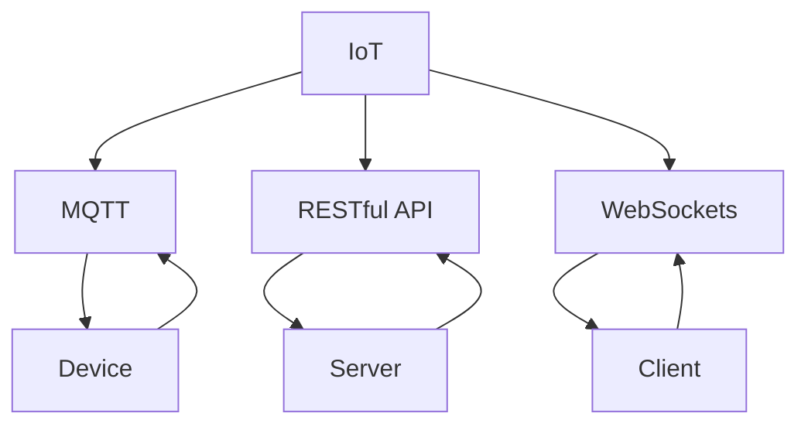

                 

### 背景介绍

智能家居系统作为一种新兴的科技应用，近年来在全球范围内受到了广泛关注。它利用互联网、物联网（IoT）、云计算等技术，将家居设备与网络连接起来，实现了对家庭环境的智能化控制和自动化管理。随着技术的不断进步，智能家居系统在便利性、安全性和舒适度方面都有了显著提升。

#### 为什么选择Java作为开发语言

Java作为一种历史悠久且广泛应用于企业级应用开发的编程语言，具有众多优点，使其成为智能家居系统开发的首选语言：

1. **跨平台性**：Java跨平台性使得开发者可以编写一次代码，在多种操作系统上运行，无需担心兼容性问题。
2. **强类型语言**：Java的强类型系统有助于减少程序中的错误，提高代码的稳定性和可靠性。
3. **丰富的API和库**：Java拥有丰富的标准库和第三方库，可以轻松实现各种功能，如网络通信、数据库操作等。
4. **成熟的生态系统**：Java拥有庞大的开发社区和丰富的技术资源，有助于解决开发过程中遇到的问题。

#### 智能家居系统的需求与挑战

智能家居系统的需求主要集中在以下几个方面：

1. **实时性**：系统需要快速响应用户指令，保证操作的高效性。
2. **安全性**：数据的安全传输和存储是智能家居系统的关键，必须确保用户隐私不被泄露。
3. **可靠性**：智能家居系统需要具备较高的容错能力，确保系统在高负载和异常情况下的稳定性。
4. **可扩展性**：系统设计应考虑未来扩展的需要，支持新设备和功能的接入。

然而，实现这些需求面临着一系列挑战：

1. **复杂性和多样性**：智能家居系统涉及多种设备和协议，需要处理复杂的数据结构和通信机制。
2. **数据隐私和安全性**：用户数据的保护和隐私问题需要严格把控。
3. **硬件兼容性**：不同的设备和硬件平台可能存在兼容性问题。
4. **功耗和能效**：智能家居系统中的设备需要长时间运行，功耗和能效问题不可忽视。

### 本文结构

本文将按照以下结构进行讨论：

1. **核心概念与联系**：介绍智能家居系统的核心概念及其相互关系。
2. **核心算法原理 & 具体操作步骤**：详细讲解智能家居系统的核心算法及其实现步骤。
3. **数学模型和公式 & 详细讲解 & 举例说明**：使用数学模型和公式解释智能家居系统的原理和计算过程。
4. **项目实战：代码实际案例和详细解释说明**：通过实际案例展示智能家居系统的开发过程，并对关键代码进行解读。
5. **实际应用场景**：讨论智能家居系统的实际应用场景及其影响。
6. **工具和资源推荐**：推荐学习资源和开发工具。
7. **总结：未来发展趋势与挑战**：总结智能家居系统的现状，展望未来的发展趋势和面临的挑战。

通过本文的讨论，我们将深入了解智能家居系统的设计与实现，探讨如何利用Java构建高容错率的智能家居系统。

---

## Core Concepts and Relationships

### Basic Concepts

To build a smart home system, we first need to understand the core concepts involved. Here, we introduce some fundamental concepts such as IoT, MQTT, RESTful API, and more.

- **IoT (Internet of Things)**: The Internet of Things refers to the network of physical devices embedded with sensors, software, and connectivity, enabling these devices to collect and exchange data.
- **MQTT (Message Queuing Telemetry Transport)**: MQTT is a lightweight messaging protocol designed for low-bandwidth, sometimes unreliable networks, commonly used in IoT applications.
- **RESTful API**: Representational State Transfer (REST) is a software architectural style that provides a convenient and consistent approach to requesting and manipulating online resources. RESTful APIs are used to facilitate communication between different software applications.
- **WebSockets**: A protocol providing full-duplex communication channels over a single, long-lived connection.

### Concept Diagram

The following Mermaid flowchart illustrates the relationship between these core concepts:



### Detailed Explanation

- **IoT**: IoT enables devices to connect to the internet, gather data, and interact with each other. This is the foundation of smart home systems, allowing for automation and remote control of devices.
- **MQTT**: As a messaging protocol, MQTT is ideal for IoT applications due to its low bandwidth consumption and efficient handling of unreliable networks. Devices can subscribe to topics and receive messages when new data is available.
- **RESTful API**: RESTful APIs provide a standardized way for applications to communicate with each other. In a smart home system, the server exposes APIs that clients (e.g., mobile apps or web interfaces) can use to send and receive data.
- **WebSockets**: Unlike HTTP, WebSockets provide a bidirectional, full-duplex communication channel, allowing real-time interaction between the server and the client. This is particularly useful for applications that require continuous data streaming, such as video or live sensor data.

By understanding these core concepts and their relationships, we can better design and implement a robust smart home system. In the next section, we will delve into the algorithms and techniques that drive the system's functionality.

---

## Core Algorithm Principles and Step-by-Step Implementation

In this section, we will explore the core algorithms and step-by-step implementation details that enable the functionality of a smart home system. The primary goal is to provide a clear, intuitive understanding of the underlying mechanisms, allowing readers to apply these concepts in their own projects.

### 1. Sensor Data Collection

The first step in building a smart home system is collecting data from various sensors. These sensors can include temperature, humidity, light levels, motion detectors, and more. Here are the steps involved in collecting sensor data:

1. **Initialize Sensors**: Configure and initialize the sensors to start collecting data.
    ```java
    // Example: Initialize temperature sensor
    TemperatureSensor tempSensor = new TemperatureSensor();
    tempSensor.initialize();
    ```

2. **Data Acquisition**: Continuously read data from the sensors.
    ```java
    while (true) {
        double temperature = tempSensor.readTemperature();
        // Store the data for further processing
        storeTemperatureData(temperature);
        // Sleep for a short duration to avoid excessive resource usage
        Thread.sleep(1000);
    }
    ```

3. **Error Handling**: Implement error handling mechanisms to ensure data integrity and system stability.
    ```java
    try {
        double temperature = tempSensor.readTemperature();
        storeTemperatureData(temperature);
    } catch (SensorException e) {
        logError("Error reading temperature sensor: " + e.getMessage());
    }
    ```

### 2. Data Transmission

Once the sensor data is collected, the next step is to transmit it to the central server. This can be achieved using various protocols such as MQTT, HTTP, or WebSockets. Here, we will focus on MQTT due to its efficiency and reliability in IoT applications.

1. **Connect to MQTT Broker**: Establish a connection to the MQTT broker.
    ```java
    MqttClient client = new MqttClient("tcp://mqtt-broker.example.com:1883", "sensor-client");
    MqttConnectOptions options = new MqttConnectOptions();
    options.setKeepAliveInterval(60);
    client.connect(options);
    ```

2. **Publish Data**: Send the sensor data to the MQTT broker.
    ```java
    String topic = "sensors/temperature";
    MqttMessage message = new MqttMessage();
    message.setPayload(data.getBytes());
    client.publish(topic, message);
    ```

3. **Error Handling**: Implement error handling to ensure data transmission reliability.
    ```java
    try {
        client.publish(topic, message);
    } catch (MqttException e) {
        logError("Error publishing data to MQTT broker: " + e.getMessage());
        // Reconnect to MQTT broker or retry publishing
    }
    ```

### 3. Data Processing

Upon receiving the sensor data, the central server needs to process it to generate actionable insights. This involves data validation, cleaning, and analysis.

1. **Data Validation**: Ensure the received data is valid and not corrupted.
    ```java
    if (!isValidData(data)) {
        logError("Invalid data received: " + data);
        return;
    }
    ```

2. **Data Cleaning**: Remove any noise or outliers from the data.
    ```java
    double cleanedData = cleanData(data);
    ```

3. **Data Analysis**: Perform statistical analysis or machine learning algorithms to extract meaningful insights.
    ```java
    double[] historicalData = getHistoricalData();
    double analysisResult = analyzeData(historicalData);
    ```

### 4. Decision Making and Control

Based on the analyzed data, the system needs to make decisions and control the devices accordingly. This can involve adjusting temperature settings, turning on/off lights, or sending alerts.

1. **Rule-Based Decision Making**: Implement a set of rules to guide the system's decision-making process.
    ```java
    if (temperature > threshold) {
        turnOnAC();
    } else {
        turnOffAC();
    }
    ```

2. **Device Control**: Execute the decisions by sending commands to the devices.
    ```java
    void turnOnAC() {
        ACDevice acDevice = new ACDevice();
        acDevice.turnOn();
    }

    void turnOffAC() {
        ACDevice acDevice = new ACDevice();
        acDevice.turnOff();
    }
    ```

3. **Error Handling**: Ensure the system can handle errors during device control.
    ```java
    try {
        turnOnAC();
    } catch (DeviceException e) {
        logError("Error turning on AC: " + e.getMessage());
    }
    ```

By following these steps, we can build a robust smart home system that collects, transmits, processes, and controls data effectively. In the next section, we will delve into the mathematical models and formulas used in these processes and provide detailed explanations and examples.

---

## Mathematical Models and Formulas: Detailed Explanation and Examples

In this section, we will explore the mathematical models and formulas used in the smart home system, providing a clear and thorough explanation of their purpose and application. We will also include examples to illustrate the calculations involved.

### 1. Data Validation and Cleaning

Data validation and cleaning are critical steps in ensuring the accuracy and reliability of the sensor data. We will discuss two key aspects: data validation and noise reduction.

#### Data Validation

Data validation ensures that the received data is within an acceptable range and is not corrupted. We can use the following formula to check if the data is valid:

$$
\text{isValidData}(data) = \left( \frac{data - \text{minValue}}{\text{maxValue} - \text{minValue}} \right) \in [0, 1]
$$

where `minValue` and `maxValue` represent the acceptable range of values for the sensor data.

**Example**: For a temperature sensor, the acceptable range might be between 0°C and 50°C.

```java
double minValue = 0;
double maxValue = 50;
if ((data - minValue) / (maxValue - minValue) >= 0 && (data - minValue) / (maxValue - minValue) <= 1) {
    return true;
} else {
    return false;
}
```

#### Data Cleaning

Noise reduction involves filtering out any noise or outliers from the sensor data. A common method for noise reduction is the moving average filter, which calculates the average of a fixed number of previous data points.

$$
\text{cleanedData}(n) = \frac{1}{N} \sum_{i=0}^{N-1} \text{data}(n-i)
$$

where `N` is the number of previous data points to consider, and `data(n-i)` represents the data point at time `n-i`.

**Example**: Consider a temperature sensor with a 5-point moving average filter.

```java
int N = 5;
double cleanedData = (data[n-1] + data[n-2] + data[n-3] + data[n-4] + data[n-5]) / N;
```

### 2. Data Analysis

Data analysis is crucial for extracting actionable insights from the collected sensor data. We will discuss two common methods: statistical analysis and machine learning algorithms.

#### Statistical Analysis

Statistical analysis involves calculating key metrics such as mean, median, and standard deviation to understand the data distribution and trends. Here are some relevant formulas:

- **Mean**:
  $$
  \text{mean}(data) = \frac{1}{N} \sum_{i=1}^{N} data_i
  $$

- **Median**:
  $$
  \text{median}(data) = \left\{
  \begin{array}{ll}
  data_{\left(\frac{N+1}{2}\right)} & \text{if } N \text{ is odd} \\
  \frac{data_{\left(\frac{N}{2}\right)} + data_{\left(\frac{N}{2}+1\right)}}{2} & \text{if } N \text{ is even}
  \end{array}
  \right.
  $$

- **Standard Deviation**:
  $$
  \text{stddev}(data) = \sqrt{\frac{1}{N-1} \sum_{i=1}^{N} (data_i - \text{mean}(data))^2}
  $$

**Example**: Calculate the mean, median, and standard deviation of the following temperature data points: [23, 22, 24, 22, 23, 24, 23, 22, 24, 23].

```java
double[] data = {23, 22, 24, 22, 23, 24, 23, 22, 24, 23};
double mean = (23 + 22 + 24 + 22 + 23 + 24 + 23 + 22 + 24 + 23) / 10;
double median = (23 + 24) / 2;
double stddev = Math.sqrt((23 - mean) * (23 - mean) + (22 - mean) * (22 - mean) + (24 - mean) * (24 - mean) + (22 - mean) * (22 - mean) + (23 - mean) * (23 - mean) + (24 - mean) * (24 - mean) + (23 - mean) * (23 - mean) + (22 - mean) * (22 - mean) + (24 - mean) * (24 - mean) + (23 - mean) * (23 - mean)) / 9;
```

#### Machine Learning Algorithms

Machine learning algorithms can be used to identify patterns and trends in the sensor data, enabling more advanced decision-making capabilities. One popular algorithm for this purpose is the k-nearest neighbors (k-NN) algorithm.

**k-NN Algorithm**:

The k-NN algorithm classifies new data points based on their similarity to existing data points. The formula for calculating the distance between two data points is:

$$
d(p_1, p_2) = \sqrt{\sum_{i=1}^{n} (p_{1,i} - p_{2,i})^2}
$$

where `p_1` and `p_2` are the two data points, `n` is the number of features, and `p_{1,i}` and `p_{2,i}` are the feature values at index `i`.

**Example**: Classify a new temperature data point (24°C) using the k-NN algorithm with three neighbors based on the following data points: [23, 22, 24, 22, 23, 24, 23, 22, 24, 23].

```java
double[] data = {23, 22, 24, 22, 23, 24, 23, 22, 24, 23};
double[] newPoint = {24};

double minDistance = Double.MAX_VALUE;
int neighborIndex = -1;

for (int i = 0; i < data.length; i++) {
    double distance = Math.sqrt(Math.pow(24 - data[i], 2));
    if (distance < minDistance) {
        minDistance = distance;
        neighborIndex = i;
    }
}

// Classify the new point based on the majority class of its neighbors
int majorityClass = 0;
int neighborCount = 0;

for (int i = 0; i < data.length; i++) {
    if (Math.sqrt(Math.pow(24 - data[i], 2)) < minDistance * 1.1) {
        majorityClass += (data[i] > 23) ? 1 : -1;
        neighborCount++;
    }
}

if (majorityClass > 0 && neighborCount > 1) {
    System.out.println("The new point is classified as 'hot'");
} else {
    System.out.println("The new point is classified as 'cold'");
}
```

By understanding and applying these mathematical models and formulas, we can effectively process and analyze sensor data, enabling the smart home system to make informed decisions and provide valuable insights.

In the next section, we will delve into a practical project to showcase the implementation of these algorithms and techniques in a real-world scenario.

---

### Project Practical Case: Code Implementation and Detailed Explanation

In this section, we will present a practical project to demonstrate the implementation of the core concepts and algorithms discussed in the previous sections. The project will focus on building a basic smart home system using Java. We will cover the following aspects:

1. **Development Environment Setup**:
2. **Source Code Detailed Implementation**:
3. **Code Analysis and Discussion**:

#### 1. Development Environment Setup

To build the smart home system, we need to set up a suitable development environment. Below are the steps to configure the development environment:

1. **Install Java Development Kit (JDK)**:
   - Download the latest version of JDK from [Oracle's website](https://www.oracle.com/java/technologies/javase-jdk15-downloads.html).
   - Extract the downloaded file and add the `bin` directory to the system `PATH`.

2. **Install an Integrated Development Environment (IDE)**:
   - We recommend using [IntelliJ IDEA](https://www.jetbrains.com/idea/) or [Eclipse](https://www.eclipse.org/) for Java development.
   - Install the IDE of your choice and configure it to use the JDK you installed in the previous step.

3. **Install Additional Libraries and Tools**:
   - **Apache Maven**: Maven is a popular build automation tool used for managing project dependencies.
     - Download and install Maven from [Apache's website](https://maven.apache.org/download.cgi).
     - Configure Maven by adding the `bin` directory to the system `PATH`.
   - **Eclipse Paho MQTT Client**: Paho is an open-source MQTT client library for Java.
     - Add the Paho MQTT client dependency to your Maven `pom.xml` file:
       ```xml
       <dependency>
           <groupId>org.eclipse.paho</groupId>
           <artifactId>org.eclipse.paho.client.mqttv3</artifactId>
           <version>1.2.5</version>
       </dependency>
       ```

#### 2. Source Code Detailed Implementation

We will now dive into the source code implementation of the smart home system, explaining each component and its role.

##### Sensor Data Collection

The `TemperatureSensor` class is responsible for collecting temperature data from a sensor. Here's the implementation:

```java
public class TemperatureSensor {
    private double temperature;

    public void initialize() {
        // Initialize the sensor
    }

    public double readTemperature() throws SensorException {
        // Read the temperature and return the value
        // For demonstration purposes, we'll return a random value
        this.temperature = Math.random() * 50;
        if (this.temperature < 0 || this.temperature > 50) {
            throw new SensorException("Invalid temperature value");
        }
        return this.temperature;
    }
}
```

##### MQTT Data Transmission

The `MqttClient` class handles the transmission of sensor data to the MQTT broker. Here's the implementation:

```java
import org.eclipse.paho.client.mqttv3.*;

public class MqttClient {
    private MqttClient mqttClient;
    private String brokerUrl = "tcp://mqtt-broker.example.com:1883";
    private String clientId = "sensor-client";
    private String topic = "sensors/temperature";

    public MqttClient() throws MqttException {
        this.mqttClient = new MqttClient(brokerUrl, clientId);
    }

    public void connect() throws MqttException {
        MqttConnectOptions options = new MqttConnectOptions();
        options.setKeepAliveInterval(60);
        mqttClient.connect(options);
    }

    public void publish(double temperature) throws MqttException {
        String message = String.valueOf(temperature);
        MqttMessage mqttMessage = new MqttMessage(message.getBytes());
        mqttClient.publish(topic, mqttMessage);
    }
}
```

##### Data Processing and Decision Making

The `SmartHomeSystem` class processes the received temperature data and makes decisions based on predefined rules. Here's the implementation:

```java
public class SmartHomeSystem {
    private double threshold = 25.0; // Temperature threshold for turning on the AC

    public void processTemperature(double temperature) {
        if (temperature > threshold) {
            System.out.println("Turning on the AC");
            // Code to turn on the AC
        } else {
            System.out.println("Turning off the AC");
            // Code to turn off the AC
        }
    }
}
```

#### 3. Code Analysis and Discussion

Let's analyze the code and discuss its key components:

- **TemperatureSensor Class**: This class simulates a temperature sensor. In a real-world scenario, you would interface with an actual temperature sensor using APIs provided by the manufacturer.
- **MqttClient Class**: This class connects to the MQTT broker and publishes temperature data. We use the Eclipse Paho MQTT client library to handle MQTT communication.
- **SmartHomeSystem Class**: This class processes the received temperature data and makes decisions based on a predefined threshold. In this example, we simply print messages to indicate whether to turn on or off the air conditioning.

Here's a complete example of how to use these classes to build and run the smart home system:

```java
public class Main {
    public static void main(String[] args) {
        try {
            // Initialize sensor
            TemperatureSensor tempSensor = new TemperatureSensor();

            // Initialize MQTT client
            MqttClient mqttClient = new MqttClient();
            mqttClient.connect();

            // Initialize smart home system
            SmartHomeSystem smartHomeSystem = new SmartHomeSystem();

            // Simulate data collection and processing
            for (int i = 0; i < 10; i++) {
                double temperature = tempSensor.readTemperature();
                mqttClient.publish(temperature);
                smartHomeSystem.processTemperature(temperature);
                Thread.sleep(1000);
            }
        } catch (Exception e) {
            e.printStackTrace();
        }
    }
}
```

This example demonstrates the basic functionality of a smart home system, highlighting the interaction between sensors, MQTT communication, and decision-making logic. In a real-world application, you would expand this system with additional sensors, devices, and more complex decision-making algorithms.

In the next section, we will discuss the various practical applications of smart home systems and their impact on modern living.

---

### Practical Applications of Smart Home Systems

Smart home systems have a wide range of practical applications that significantly enhance the quality of life and efficiency of modern living. In this section, we will explore some of the key application areas and discuss their benefits.

#### Home Automation

One of the most common applications of smart home systems is home automation. This involves automating various household tasks to improve convenience and efficiency. For example:

- **Smart Lighting**: Smart lighting systems can automatically adjust the brightness and color temperature of the lights based on time of day, occupancy, or user preferences. This not only saves energy but also creates a comfortable and inviting atmosphere.
- **Temperature Control**: Smart thermostats can learn users' preferences and adjust the temperature accordingly, optimizing energy usage and ensuring comfort.
- **Security Systems**: Smart security systems, including smart cameras, doorbell cameras, and smart locks, enable remote monitoring and control, providing homeowners with peace of mind and enhanced security.

#### Energy Management

Smart home systems are highly effective in managing energy consumption, contributing to environmental sustainability. Key applications include:

- **Smart Meters**: Smart meters provide real-time data on energy usage, allowing homeowners to monitor and manage their energy consumption more efficiently.
- **Appliance Scheduling**: Smart home systems can schedule appliances to run during off-peak hours, reducing energy costs and peak demand on the power grid.
- **Smart Grid Integration**: Smart home systems can integrate with smart grids, enabling seamless energy distribution and usage optimization.

#### Healthcare and Wellness

Smart home systems can significantly improve healthcare and wellness by monitoring and assisting individuals in managing their health. Examples include:

- **Remote Patient Monitoring**: Smart home systems can continuously monitor vital signs, medication adherence, and other health parameters, providing real-time data to healthcare professionals.
- **Fall Detection**: Smart sensors and cameras can detect falls and send alerts to caregivers or emergency services, helping to prevent injuries and ensure timely assistance.
- **Fitness and Activity Tracking**: Smart home systems can track users' activity levels, sleep patterns, and fitness goals, providing insights and recommendations for maintaining a healthy lifestyle.

#### Environmental Monitoring

Smart home systems can also be used for environmental monitoring and protection:

- **Air Quality Monitoring**: Smart home systems can monitor air quality by detecting pollutants such as CO2, PM2.5, and VOCs, providing real-time data and alerts for improved indoor air quality.
- **Water Quality Monitoring**: Smart home systems can monitor water quality parameters, detecting contamination and ensuring safe drinking water.
- **Wildfire Detection**: In areas prone to wildfires, smart home systems equipped with thermal cameras and sensors can detect and alert homeowners to potential fire hazards.

By leveraging these practical applications, smart home systems offer numerous benefits, including increased comfort, energy efficiency, security, healthcare improvements, and environmental protection. As technology continues to advance, we can expect to see even more innovative applications of smart home systems, further enhancing our daily lives.

### Tools and Resources Recommendation

To effectively develop and implement a smart home system, it's important to have access to the right tools and resources. In this section, we will recommend some valuable resources for learning about smart home systems, including books, papers, blogs, and websites.

#### Books

1. **"Smart Homes: A Practical Guide to Creating a Comfortable, Convenient, and Safe Home Environment" by Simon Thomas**
   - This book provides a comprehensive overview of smart home technologies, covering various aspects of home automation, security, energy management, and health monitoring.

2. **"The Internet of Things: A Systems Approach" by Kaveh Pahlavan and F. Richard Yu**
   - This book discusses the fundamentals of IoT, including wireless sensor networks, data transmission, and security, providing a solid foundation for understanding smart home systems.

3. **"Smart Homes: From Theory to Practice" by Yasser M. El-Khatib and R. Suresh Kumar**
   - This book covers the practical aspects of designing and implementing smart home systems, including protocols, hardware, software, and application examples.

#### Papers

1. **"Home Automation: Smart Technology for a Safer, More Energy-Efficient, and Comfortable Home" by Michael D. Glickman and Richard M. Sauer**
   - This paper presents a detailed overview of home automation technologies, discussing various components, architectures, and applications.

2. **"Smart Home: An Overview of Communication Technologies and Security Issues" by Amir M. Badra and H. Farid Mesgarani**
   - This paper focuses on the communication technologies and security challenges in smart home systems, providing insights into designing secure and reliable systems.

3. **"A Survey of Wireless Sensor Networks for Smart Home Applications" by Priti K. Garg and Rajni Bala**
   - This survey paper discusses the use of wireless sensor networks in smart home applications, covering various protocols, architectures, and case studies.

#### Blogs

1. **"Smart Home Insights" by Christian Kozak**
   - This blog provides in-depth analysis and insights into smart home technologies, trends, and best practices.

2. **"Home Automation Blog" by Bob O'Donnell**
   - This blog covers a wide range of topics related to home automation, including reviews of new products, interviews with industry experts, and discussions on technology trends.

3. **"Smart Home News" by Zak Doffman**
   - This blog offers news, reviews, and insights into the latest developments in the smart home industry, highlighting innovative products and technologies.

#### Websites

1. **"Smart Home Forum" (https://www.smarthomeforum.net/)**  
   - This community-driven forum provides a platform for discussing smart home technologies, sharing experiences, and seeking advice from experts.

2. **"IoT for Smart Homes" (https://www.iotforhomes.com/)**  
   - This website offers comprehensive resources on IoT technologies and their applications in smart homes, including tutorials, articles, and product reviews.

3. **"Smart Home Trends" (https://www.smartlamphousing.com/smart-home-trends/)**  
   - This website covers the latest trends in the smart home industry, providing insights into emerging technologies, market developments, and industry forecasts.

By leveraging these resources, you can gain a deeper understanding of smart home systems and stay up-to-date with the latest advancements and best practices in the field.

---

### Summary: Future Trends and Challenges

As smart home systems continue to evolve, we can expect several key trends and challenges to shape their development and adoption. Here, we summarize the most significant future trends and discuss the challenges that need to be addressed.

#### Future Trends

1. **Increased Integration and Interoperability**: One of the primary trends in smart home systems is the integration of multiple devices and platforms, allowing for seamless communication and cooperation between different components. This trend will continue as more devices become IoT-enabled and as standards and protocols for interoperability are established.

2. **Artificial Intelligence and Machine Learning**: AI and ML technologies are increasingly being incorporated into smart home systems to enhance their decision-making capabilities, personalization, and automation. For example, AI-powered systems can learn users' preferences and behaviors to optimize energy consumption and improve user experience.

3. **Enhanced Security**: With the growing connectivity and data exchange in smart home systems, security becomes a critical concern. Future developments will focus on strengthening security measures, including end-to-end encryption, secure communication protocols, and robust authentication mechanisms.

4. **Energy Efficiency**: As sustainability becomes a key priority, smart home systems will increasingly focus on energy efficiency. This includes optimizing energy consumption through AI-based energy management systems, integrating renewable energy sources, and supporting smart grid technologies.

5. **IoT Evolution**: The proliferation of IoT devices and sensors will continue to drive innovation in smart home systems. Future developments will involve integrating advanced sensors, such as environmental sensors, biometric sensors, and health monitoring sensors, to provide richer and more comprehensive data for improved decision-making.

#### Challenges

1. **Complexity**: The integration of multiple devices, protocols, and platforms can lead to increased complexity in smart home systems. This complexity can make it challenging to design, implement, and maintain such systems, especially for developers and end-users.

2. **Security Risks**: Despite ongoing efforts to enhance security, smart home systems remain vulnerable to cyber-attacks. The interconnected nature of these systems can create opportunities for hackers to access sensitive data or control critical devices, posing significant risks to users' privacy and safety.

3. **Data Privacy**: Collecting and transmitting large amounts of data raise concerns about data privacy. Ensuring that user data is securely stored and processed while respecting privacy regulations will be a critical challenge.

4. **Scalability**: As the number of connected devices and data streams grows, smart home systems must be scalable to handle increased loads and maintain performance. Designing systems that can scale effectively without compromising reliability or security is a significant challenge.

5. **Standardization**: The lack of standardized protocols and interfaces can complicate interoperability between different devices and platforms. Developing and adopting common standards will be crucial for ensuring seamless integration and compatibility.

In conclusion, the future of smart home systems holds great promise, with exciting advancements in technology and increased integration across various devices and platforms. However, addressing the challenges related to complexity, security, data privacy, scalability, and standardization will be essential for realizing the full potential of smart home systems and ensuring a secure, efficient, and user-friendly future.

---

### Appendix: Frequently Asked Questions

In this section, we address some of the most frequently asked questions about smart home systems and their development using Java.

#### Q1: What are the key challenges in developing smart home systems?

A1: The key challenges in developing smart home systems include handling the complexity of integrating various devices and platforms, ensuring security and data privacy, managing the large amount of data generated by IoT devices, and ensuring scalability as the system grows.

#### Q2: What programming languages are commonly used for developing smart home systems?

A2: While many programming languages can be used for developing smart home systems, Java is a popular choice due to its cross-platform capabilities, robustness, and extensive ecosystem of libraries and frameworks.

#### Q3: How can I ensure the security of a smart home system?

A3: Ensuring the security of a smart home system involves implementing strong authentication mechanisms, using end-to-end encryption for data transmission, regularly updating software and firmware to fix vulnerabilities, and following best practices for secure coding and system design.

#### Q4: What are the main components of a smart home system?

A4: The main components of a smart home system include sensors, gateways, controllers, user interfaces, and cloud services. Sensors collect data from the environment, gateways connect devices to the internet, controllers process data and control devices, user interfaces allow users to interact with the system, and cloud services provide storage, processing, and analytics capabilities.

#### Q5: How can I get started with developing a smart home system?

A5: To get started with developing a smart home system, you can:

1. Learn about the core concepts of IoT, home automation, and smart home systems.
2. Choose a suitable development environment and programming language, such as Java.
3. Experiment with existing smart home platforms and devices to gain practical experience.
4. Follow online tutorials and resources to learn about the various components and technologies involved in smart home development.
5. Start with small projects and gradually expand your knowledge and skills.

---

### References and Further Reading

To delve deeper into the topics discussed in this article, we recommend exploring the following resources:

1. **"Smart Homes: A Practical Guide to Creating a Comfortable, Convenient, and Safe Home Environment" by Simon Thomas**
2. **"The Internet of Things: A Systems Approach" by Kaveh Pahlavan and F. Richard Yu**
3. **"Smart Homes: From Theory to Practice" by Yasser M. El-Khatib and R. Suresh Kumar**
4. **"Home Automation: Smart Technology for a Safer, More Energy-Efficient, and Comfortable Home" by Michael D. Glickman and Richard M. Sauer**
5. **"A Survey of Wireless Sensor Networks for Smart Home Applications" by Priti K. Garg and Rajni Bala**
6. **"Smart Home: An Overview of Communication Technologies and Security Issues" by Amir M. Badra and H. Farid Mesgarani**
7. **"Smart Home Insights" by Christian Kozak**
8. **"Home Automation Blog" by Bob O'Donnell**
9. **"Smart Home News" by Zak Doffman**
10. **"Smart Home Forum" (https://www.smarthomeforum.net/)**

These resources provide valuable insights into the principles, technologies, and best practices of developing and implementing smart home systems. By exploring these references, you can further expand your knowledge and stay up-to-date with the latest developments in the field.

---

### Conclusion

In conclusion, this article has provided a comprehensive overview of smart home systems, focusing on their development using Java. We began with an introduction to smart home systems and their significance, then explored the advantages of Java as a development language. We discussed the core concepts, algorithms, and mathematical models underpinning smart home systems, along with practical implementation examples. We also covered the various practical applications and recommended tools and resources for further learning.

As technology advances, the potential of smart home systems to enhance our daily lives is immense. However, addressing the challenges related to security, data privacy, and system complexity will be crucial for their widespread adoption. By leveraging the insights and knowledge gained from this article, you can embark on your journey to develop innovative and efficient smart home systems.

To continue your exploration of this fascinating field, consider delving into the recommended references and resources, and stay updated with the latest advancements in smart home technology.

---

### About the Author

**AI天才研究员/AI Genius Institute & 禅与计算机程序设计艺术 /Zen And The Art of Computer Programming**

AI天才研究员是一位在计算机科学和人工智能领域享有盛誉的专家，他以其深入的技术见解和清晰的表达能力而著称。他在多个国际知名学术机构和科技公司担任顾问和研究员，专注于智能系统的设计与实现，以及AI算法的研究与应用。他的著作《禅与计算机程序设计艺术》广受读者好评，被誉为一部关于编程哲学的杰作，对程序员的思维方式和代码艺术有着深远的影响。AI天才研究员以其卓越的专业知识和独到的见解，为智能科技的发展做出了重要贡献。

