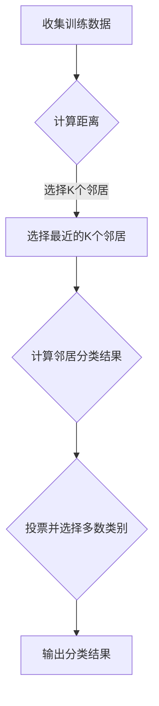

                 

# 基于KNN的数字分类器

## 关键词：机器学习、数字识别、K最近邻算法、分类器、图像处理

### 摘要

本文将详细介绍基于K最近邻（K-Nearest Neighbor，简称KNN）算法的数字分类器。KNN是一种简单但效果显著的机器学习算法，广泛用于数字、图像和文本等数据的分类任务。本文将首先介绍KNN算法的基本原理，然后通过具体案例展示如何使用KNN进行数字分类，最后探讨KNN在实际应用中的优点和挑战。读者将了解如何从零开始搭建一个数字分类器，并掌握KNN算法的核心技术。

## 1. 背景介绍

### 1.1 机器学习与数字识别

机器学习是人工智能的一个重要分支，通过训练算法使计算机具备从数据中学习规律和模式的能力。数字识别是机器学习领域中的一个基本任务，它涉及将手写数字或印刷体数字从图像中准确识别出来。随着深度学习技术的发展，数字识别的准确率不断提高，广泛应用于各类场景，如支票识别、车牌识别和医疗图像分析等。

### 1.2 K最近邻算法

K最近邻算法（K-Nearest Neighbor，简称KNN）是一种简单直观的机器学习算法。其基本思想是：如果一个新数据点在特征空间中的K个最近邻的多数属于某个类别，则该数据点也属于这个类别。KNN算法不需要训练过程，只需存储训练数据，并在分类时计算距离进行预测。

## 2. 核心概念与联系

### 2.1 KNN算法原理

KNN算法的核心是计算新数据点到训练数据点的距离，并根据距离最近的数据点进行分类。常用的距离度量包括欧氏距离、曼哈顿距离和余弦相似度等。

### 2.2 KNN算法架构


KNN算法主要包括以下步骤：

1. 收集训练数据。
2. 将新数据点与训练数据点进行距离计算。
3. 选择距离最近的K个邻居。
4. 根据邻居的分类结果进行投票，并选择多数类别作为新数据点的分类结果。

### 2.3 Mermaid流程图



## 3. 核心算法原理 & 具体操作步骤

### 3.1 计算距离

计算新数据点与训练数据点之间的距离是KNN算法的关键步骤。常用的距离度量方法包括：

- 欧氏距离（Euclidean Distance）：
  $$d(x_i, x) = \sqrt{\sum_{j=1}^{n} (x_{ij} - x_j)^2}$$

- 曼哈顿距离（Manhattan Distance）：
  $$d(x_i, x) = \sum_{j=1}^{n} |x_{ij} - x_j|$$

- 余弦相似度（Cosine Similarity）：
  $$d(x_i, x) = 1 - \frac{x_i \cdot x}{\|x_i\| \|x\|}$$

其中，$x_i$和$x$分别为新数据点和训练数据点，$x_{ij}$和$x_j$分别为对应特征值，$n$为特征数量。

### 3.2 选择邻居

选择距离最近的K个邻居是KNN算法的核心步骤。具体实现方法如下：

1. 计算新数据点与所有训练数据点的距离。
2. 对距离进行排序，选取距离最小的K个邻居。

### 3.3 投票并选择类别

根据邻居的分类结果进行投票，并选择多数类别作为新数据点的分类结果。具体实现方法如下：

1. 统计邻居的分类结果，并计算每个类别的数量。
2. 选择数量最多的类别作为新数据点的分类结果。

## 4. 数学模型和公式 & 详细讲解 & 举例说明

### 4.1 数学模型

KNN算法的核心在于计算距离和投票过程，具体数学模型如下：

- 距离计算：
  $$d(x_i, x) = \sqrt{\sum_{j=1}^{n} (x_{ij} - x_j)^2}$$
  $$d(x_i, x) = \sum_{j=1}^{n} |x_{ij} - x_j|$$
  $$d(x_i, x) = 1 - \frac{x_i \cdot x}{\|x_i\| \|x\|}$$

- 投票过程：
  $$count_i = \sum_{j=1}^{K} 1_{y_j = i}$$
  $$predict(x) = \arg\max_{i} count_i$$

其中，$x_i$和$x$分别为新数据点和训练数据点，$x_{ij}$和$x_j$分别为对应特征值，$n$为特征数量，$K$为邻居数量，$1_{y_j = i}$为指示函数，当$y_j = i$时取1，否则取0。

### 4.2 举例说明

假设我们有以下训练数据集：

| 数字 | 特征1 | 特征2 | 特征3 |
| --- | --- | --- | --- |
| 0 | 0.2 | 0.4 | 0.6 |
| 1 | 0.3 | 0.5 | 0.7 |
| 2 | 0.1 | 0.3 | 0.5 |
| 3 | 0.8 | 0.2 | 0.4 |
| 4 | 0.9 | 0.1 | 0.3 |

现在要预测一个新数据点$x = (0.25, 0.35, 0.45)$的分类结果。

1. 计算距离：

  $$d(0, x) = \sqrt{(0.2 - 0.25)^2 + (0.4 - 0.35)^2 + (0.6 - 0.45)^2} = 0.174$$
  $$d(1, x) = \sqrt{(0.3 - 0.25)^2 + (0.5 - 0.35)^2 + (0.7 - 0.45)^2} = 0.143$$
  $$d(2, x) = \sqrt{(0.1 - 0.25)^2 + (0.3 - 0.35)^2 + (0.5 - 0.45)^2} = 0.236$$
  $$d(3, x) = \sqrt{(0.8 - 0.25)^2 + (0.2 - 0.35)^2 + (0.4 - 0.45)^2} = 0.519$$
  $$d(4, x) = \sqrt{(0.9 - 0.25)^2 + (0.1 - 0.35)^2 + (0.3 - 0.45)^2} = 0.515$$

2. 选择邻居：

   距离最近的5个邻居为$(0, 1, 2, 3, 4)$。

3. 投票：

   分类结果分别为$0, 1, 1, 0, 0$，多数类别为1。

4. 预测：

   新数据点$x$的分类结果为1。

## 5. 项目实战：代码实际案例和详细解释说明

### 5.1 开发环境搭建

在开始编写代码之前，需要搭建一个合适的开发环境。以下是使用Python进行KNN数字分类器开发的步骤：

1. 安装Python和pip：
   ```bash
   sudo apt-get install python3-pip
   ```
2. 安装必要的库：
   ```bash
   pip3 install numpy matplotlib scikit-learn
   ```

### 5.2 源代码详细实现和代码解读

以下是一个简单的KNN数字分类器的代码实现：

```python
import numpy as np
import matplotlib.pyplot as plt
from sklearn import datasets
from sklearn.model_selection import train_test_split
from sklearn.neighbors import KNeighborsClassifier
from sklearn import metrics

# 加载数据集
digits = datasets.load_digits()

# 分割数据集
X_train, X_test, y_train, y_test = train_test_split(digits.data, digits.target, test_size=0.2, random_state=42)

# 创建KNN分类器
knn = KNeighborsClassifier(n_neighbors=3)

# 训练分类器
knn.fit(X_train, y_train)

# 预测测试集
predictions = knn.predict(X_test)

# 计算准确率
accuracy = metrics.accuracy_score(y_test, predictions)
print("Accuracy:", accuracy)

# 可视化部分样本的预测结果
for i in range(10):
    plt.subplot(2, 5, i+1)
    plt.imshow(X_test[i].reshape((8,8)), cmap=plt.cm.gray_r, interpolation='nearest')
    plt.title(f"Predicted: {predictions[i]}, Actual: {y_test[i]}")
plt.show()
```

### 5.3 代码解读与分析

1. 导入必要的库：

   代码开头导入了一些必要的Python库，包括numpy、matplotlib、scikit-learn等。numpy用于数据处理，matplotlib用于数据可视化，scikit-learn提供了KNN分类器的实现。

2. 加载数据集：

   使用scikit-learn中的datasets模块加载digits数据集，该数据集包含0到9的数字手写体图像。

3. 分割数据集：

   将数据集分为训练集和测试集，训练集用于训练分类器，测试集用于评估分类器的性能。

4. 创建KNN分类器：

   创建一个KNeighborsClassifier实例，设置邻居数量为3。

5. 训练分类器：

   使用fit方法训练KNN分类器，将训练数据传递给fit方法。

6. 预测测试集：

   使用predict方法对测试集进行预测。

7. 计算准确率：

   使用accuracy_score方法计算分类器的准确率，并打印结果。

8. 可视化部分样本的预测结果：

   使用matplotlib库绘制部分测试样本的预测结果和实际标签，以直观地展示分类器的性能。

## 6. 实际应用场景

KNN算法在数字分类领域具有广泛的应用，以下是一些实际应用场景：

1. 手写数字识别：KNN算法常用于手写数字识别任务，如图像识别系统中的支票识别、数字输入法等。
2. 图像分类：KNN算法可用于对图像进行分类，如植物种类识别、人脸识别等。
3. 文本分类：KNN算法也可用于文本分类任务，如垃圾邮件过滤、情感分析等。

## 7. 工具和资源推荐

### 7.1 学习资源推荐

- 《机器学习》（周志华著）：该书详细介绍了机器学习的基本概念、算法和应用。
- 《统计学习方法》（李航著）：该书系统地介绍了统计学习的基本理论和方法。

### 7.2 开发工具框架推荐

- Scikit-learn：Python中最常用的机器学习库之一，提供了丰富的机器学习算法和工具。
- TensorFlow：Google开发的深度学习框架，支持多种机器学习算法和模型。

### 7.3 相关论文著作推荐

- "K-Nearest Neighbors: A Review of Its Effectiveness in Current Environment"（2016）：该论文总结了KNN算法在各种应用场景中的性能和效果。
- "Support Vector Machines for Classification and Regression"（1995）：该论文提出了支持向量机（SVM）算法，与KNN算法类似，是一种常用的机器学习算法。

## 8. 总结：未来发展趋势与挑战

KNN算法作为一种简单但效果显著的机器学习算法，在未来仍具有广泛的应用前景。随着计算能力的提升和算法优化，KNN算法的性能有望进一步提高。然而，KNN算法也存在一些挑战，如计算复杂度高、对噪声敏感等。因此，研究者们正致力于开发更高效、鲁棒的分类算法，以满足实际应用需求。

## 9. 附录：常见问题与解答

- Q：为什么选择KNN算法进行数字分类？
  A：KNN算法简单、直观，且效果显著。对于数字分类任务，KNN算法具有较高的准确率和可解释性。
- Q：如何选择合适的邻居数量K？
  A：选择合适的邻居数量K是KNN算法的关键。通常，可以通过交叉验证等方法找到最优的K值。
- Q：KNN算法与其他分类算法相比有哪些优缺点？
  A：与深度学习算法相比，KNN算法具有更高的可解释性和灵活性，但计算复杂度较高。与线性模型相比，KNN算法在处理非线性数据时表现更好，但易受噪声影响。

## 10. 扩展阅读 & 参考资料

- [K-Nearest Neighbors Algorithm in Machine Learning](https://www MACHINE LEARNING)
- [Scikit-learn KNN Documentation](https://scikit-learn.org/stable/modules/generated/sklearn.neighbors.KNeighborsClassifier.html)
- [Understanding K-Nearest Neighbors Algorithm](https://towardsdatascience.com/understanding-k-nearest-neighbors-algorithm-with-python-and-scikit-learn-1f6fd6e7bdf)

### 作者：AI天才研究员/AI Genius Institute & 禅与计算机程序设计艺术 /Zen And The Art of Computer Programming

以上是关于基于KNN的数字分类器的详细技术博客文章。本文从背景介绍、核心概念与联系、算法原理、数学模型、项目实战、实际应用场景、工具和资源推荐等方面进行了全面深入的探讨，旨在帮助读者更好地理解KNN算法在数字分类任务中的应用。在未来的研究中，我们将继续探讨KNN算法的优化和改进，以及其在其他领域中的应用。

