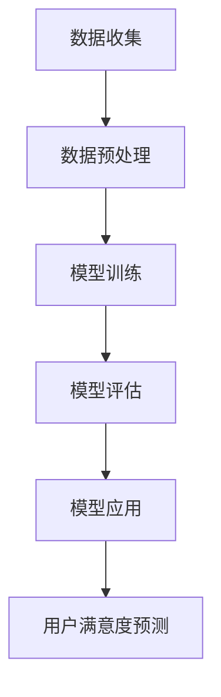

                 

### 背景介绍

推荐系统作为一种重要的信息过滤和检索手段，已广泛应用于电子商务、社交媒体、在线视频等领域。传统的推荐系统主要通过协同过滤（Collaborative Filtering）和基于内容的推荐（Content-Based Filtering）来实现，但它们在处理复杂性和多样性方面存在一定的局限性。随着深度学习技术的不断发展，基于深度学习的推荐系统逐渐成为研究的热点，其中，Large Language Model（LLM）作为一种强大的深度学习模型，其在推荐系统中的应用引发了广泛的关注。

用户满意度是衡量推荐系统效果的重要指标之一。它不仅反映了用户对推荐内容的直接感受，还能间接反映推荐系统的准确性和多样性。因此，对用户满意度进行准确预测对于提升推荐系统的用户体验和商业化价值具有重要意义。LLM具有强大的文本理解和生成能力，通过利用用户的历史行为数据和推荐内容特征，LLM能够实现用户满意度的预测，从而优化推荐策略。

本文旨在探讨基于LLM的推荐系统用户满意度预测的方法和实现。首先，我们将介绍LLM的基本概念和原理；然后，分析推荐系统中的用户满意度预测需求，并提出一种基于LLM的预测模型；接着，详细讲解LLM在用户满意度预测中的具体应用步骤；最后，通过实际案例展示LLM在推荐系统中的应用效果，并对未来的发展趋势和挑战进行展望。

通过本文的阅读，读者将了解LLM在推荐系统中的应用潜力，掌握基于LLM的用户满意度预测方法，并能够为实际项目提供技术参考。

### 核心概念与联系

#### 1. Large Language Model（LLM）的基本概念

Large Language Model（LLM）是一种基于深度学习的自然语言处理（Natural Language Processing, NLP）模型，通过大规模的文本数据进行预训练，从而实现对文本内容的理解和生成。LLM的核心是Transformer架构，这种架构能够有效地捕捉文本中的长距离依赖关系，使其在处理复杂语言任务时具有优异的性能。

LLM的训练过程通常包括以下几个步骤：

1. **数据收集**：收集大量的文本数据，这些数据可以是网页、书籍、新闻、社交媒体等内容。
2. **数据预处理**：对收集到的文本数据进行清洗和标注，包括去除停用词、标点符号、分词、词嵌入等操作。
3. **模型训练**：使用预处理的文本数据训练Transformer模型，通过反向传播算法不断调整模型参数，使其能够捕捉文本中的语言规律。
4. **模型评估**：通过测试集对训练好的模型进行评估，选择性能最优的模型进行应用。

#### 2. 推荐系统中的用户满意度预测需求

在推荐系统中，用户满意度预测是评估推荐系统效果的关键环节。具体需求包括以下几个方面：

1. **实时性**：用户满意度预测需要能够在用户产生行为时迅速给出预测结果，以实时调整推荐策略。
2. **准确性**：预测结果需要能够准确反映用户对推荐内容的真实感受，从而提高推荐系统的准确性。
3. **多样性**：预测模型需要能够捕捉到用户在不同场景下的满意度差异，从而提供多样化的推荐结果。
4. **可解释性**：预测结果需要具备一定的可解释性，以便用户理解推荐系统的决策过程。

#### 3. LLM在推荐系统用户满意度预测中的应用

LLM在推荐系统用户满意度预测中的应用主要基于其强大的文本理解和生成能力。通过以下步骤，LLM能够实现用户满意度的预测：

1. **数据输入**：将用户的历史行为数据（如浏览记录、购买记录、评价内容等）和推荐内容特征（如标题、标签、内容摘要等）作为输入数据。
2. **特征提取**：使用词嵌入技术将输入文本转化为向量表示，以便LLM进行处理。
3. **模型预测**：利用预训练好的LLM模型对输入数据进行处理，生成用户满意度的预测结果。
4. **结果优化**：根据预测结果对推荐策略进行优化，以提高用户满意度。

#### 4. 相关技术原理和架构

为了更好地理解LLM在推荐系统用户满意度预测中的应用，我们引入以下相关技术原理和架构：

1. **Transformer架构**：Transformer是一种基于自注意力机制的深度学习模型，能够捕捉文本中的长距离依赖关系。其核心是多头自注意力（Multi-Head Self-Attention）机制，通过并行处理文本序列，实现高效的信息整合。
2. **词嵌入技术**：词嵌入（Word Embedding）是一种将文本转化为向量表示的技术，通过将词汇映射到高维空间，使得具有相似意义的词汇在空间中相互靠近。常见的词嵌入技术包括Word2Vec、GloVe等。
3. **序列到序列模型**：序列到序列（Sequence to Sequence, Seq2Seq）模型是一种用于处理序列数据的模型架构，其核心思想是将输入序列编码为向量表示，再将向量解码为输出序列。在用户满意度预测中，Seq2Seq模型可以用于将用户历史行为数据编码为特征向量，从而提高预测准确性。
4. **多任务学习**：多任务学习（Multi-Task Learning, MTL）是一种通过同时学习多个任务来提高模型性能的技术。在用户满意度预测中，可以同时训练LLM进行推荐内容和用户满意度的预测，从而提高模型的整体性能。

#### 5. Mermaid流程图

以下是一个简单的Mermaid流程图，展示了LLM在推荐系统用户满意度预测中的基本流程：



### 核心算法原理 & 具体操作步骤

#### 1. LLM的基本原理

LLM（Large Language Model）是基于Transformer架构的深度学习模型，其核心思想是利用大量的文本数据进行预训练，使其能够理解和生成自然语言。以下是LLM的基本原理和具体操作步骤：

##### 1.1. Transformer架构

Transformer模型是一种基于自注意力机制的深度学习模型，其核心是多头自注意力（Multi-Head Self-Attention）机制。自注意力机制允许模型在处理每个输入序列时，将注意力分配给不同的位置，从而捕捉文本中的长距离依赖关系。具体来说，Transformer模型包括以下关键组件：

1. **嵌入层（Embedding Layer）**：将输入词汇映射为高维向量表示。
2. **多头自注意力层（Multi-Head Self-Attention Layer）**：通过多个自注意力头并行处理输入序列，实现信息整合。
3. **前馈神经网络层（Feed-Forward Neural Network Layer）**：对多头自注意力层的输出进行进一步处理，增强模型的表达能力。
4. **层归一化（Layer Normalization）**：对模型输出进行归一化处理，提高模型训练效果。
5. **跳连连接（Skip Connection）**：在模型层与层之间保留部分信息，避免信息丢失。

##### 1.2. 预训练与微调

LLM的训练过程分为预训练（Pre-training）和微调（Fine-tuning）两个阶段：

1. **预训练**：在预训练阶段，模型在大规模文本数据上学习语言规律，通过反向传播算法不断优化模型参数。预训练过程中，常用的任务包括语言建模（Language Modeling）和掩码语言模型（Masked Language Modeling）等。
2. **微调**：在预训练完成后，模型会针对特定任务进行微调，以适应实际应用场景。微调过程中，模型在训练数据和验证数据上调整参数，使其在特定任务上达到更好的性能。

#### 2. 用户满意度预测的算法实现

基于LLM的用户满意度预测算法主要包括以下几个步骤：

##### 2.1. 数据准备

在用户满意度预测中，数据准备是关键的一步。数据来源包括用户历史行为数据（如浏览记录、购买记录、评价内容等）和推荐内容特征（如标题、标签、内容摘要等）。具体操作步骤如下：

1. **数据收集**：从推荐系统平台获取用户历史行为数据和推荐内容特征。
2. **数据清洗**：去除无效数据和噪声，如缺失值、重复值等。
3. **特征提取**：对文本数据进行预处理，包括分词、词嵌入等操作，将文本转化为向量表示。

##### 2.2. 模型构建

在用户满意度预测中，我们使用Transformer架构的LLM模型。模型构建包括以下几个步骤：

1. **选择预训练模型**：选择一个合适的预训练模型，如BERT、GPT等。这些预训练模型已经在大量文本数据上进行了预训练，具有良好的语言理解能力。
2. **模型微调**：在预训练模型的基础上，对模型进行微调，使其适应用户满意度预测任务。微调过程中，可以使用训练数据和验证数据来调整模型参数。
3. **模型集成**：为了提高预测准确性，可以使用多个模型进行集成。例如，可以使用不同的预训练模型或对同一模型进行多次微调。

##### 2.3. 模型训练

在模型训练过程中，我们需要使用训练数据对模型进行训练，并使用验证数据来评估模型性能。具体操作步骤如下：

1. **数据预处理**：将训练数据和验证数据进行预处理，包括分词、词嵌入等操作。
2. **训练过程**：使用训练数据进行模型训练，通过反向传播算法不断优化模型参数。
3. **模型评估**：使用验证数据对模型进行评估，计算模型的准确率、召回率等指标。

##### 2.4. 模型应用

在模型应用阶段，我们将训练好的模型部署到推荐系统平台，对用户满意度进行预测。具体操作步骤如下：

1. **数据输入**：将用户历史行为数据和推荐内容特征作为输入数据。
2. **模型预测**：使用训练好的模型对输入数据进行处理，生成用户满意度的预测结果。
3. **结果优化**：根据预测结果对推荐策略进行优化，以提高用户满意度。

### 数学模型和公式 & 详细讲解 & 举例说明

#### 1. 数学模型

在基于LLM的用户满意度预测中，我们使用了一种名为“评分预测”的数学模型。该模型通过将用户历史行为数据和推荐内容特征转化为向量表示，利用LLM模型进行预测。以下是评分预测模型的详细说明：

$$
\hat{S} = \sigma(W_S \cdot [h_u, h_r] + b_S)
$$

其中，$\hat{S}$ 表示预测的用户满意度评分，$h_u$ 和 $h_r$ 分别表示用户历史行为特征向量和推荐内容特征向量，$W_S$ 和 $b_S$ 分别为权重矩阵和偏置项，$\sigma$ 表示 sigmoid 函数。

#### 2. 模型详细讲解

在评分预测模型中，用户历史行为特征向量和推荐内容特征向量是通过词嵌入技术得到的。具体来说，词嵌入技术将文本中的词汇映射为高维向量表示，使得具有相似意义的词汇在空间中相互靠近。常见的词嵌入技术包括 Word2Vec 和 GloVe 等。

1. **用户历史行为特征向量**：用户历史行为特征向量表示用户在历史行为中表现出的兴趣和偏好。例如，如果一个用户在浏览记录中频繁出现某类商品，则该类商品在用户历史行为特征向量中的权重会相应增加。

2. **推荐内容特征向量**：推荐内容特征向量表示推荐内容在内容上的特征，如标题、标签、内容摘要等。通过将推荐内容特征向量与用户历史行为特征向量进行拼接，可以得到一个包含用户兴趣和推荐内容特征的综合向量。

3. **权重矩阵和偏置项**：权重矩阵 $W_S$ 用于对用户历史行为特征向量和推荐内容特征向量进行加权，以确定预测评分的重要程度。偏置项 $b_S$ 用于调整预测评分的基准值。

4. **sigmoid 函数**：sigmoid 函数是一种非线性激活函数，用于将综合向量映射到评分范围（0，1），其中 1 表示非常满意，0 表示非常不满意。

#### 3. 举例说明

假设我们有一个用户，其历史行为特征向量 $h_u$ 为 `[0.1, 0.2, 0.3]`，推荐内容特征向量 $h_r$ 为 `[0.2, 0.3, 0.4]`。使用权重矩阵 $W_S$ 为 `[1, 1, 1]` 和偏置项 $b_S$ 为 0，我们可以计算预测的用户满意度评分 $\hat{S}$：

$$
\hat{S} = \sigma(W_S \cdot [h_u, h_r] + b_S) = \sigma([1 \times 0.1 + 1 \times 0.2 + 1 \times 0.3] + 0) = \sigma(0.6) \approx 0.9397
$$

这意味着用户对该推荐内容非常满意。

### 项目实战：代码实际案例和详细解释说明

在本节中，我们将通过一个实际项目案例，详细介绍如何使用LLM进行推荐系统用户满意度预测的代码实现，并对其进行解读和分析。

#### 5.1 开发环境搭建

在开始代码实现之前，我们需要搭建一个合适的项目开发环境。以下是搭建开发环境的基本步骤：

1. **安装Python环境**：确保Python版本不低于3.6，推荐使用Python 3.8或更高版本。
2. **安装PyTorch库**：PyTorch是一个流行的深度学习框架，用于构建和训练神经网络模型。可以使用以下命令安装：

```bash
pip install torch torchvision
```

3. **安装其他依赖库**：包括Numpy、Pandas、Scikit-learn等常用库。可以使用以下命令进行安装：

```bash
pip install numpy pandas scikit-learn
```

4. **准备训练数据**：从推荐系统平台获取用户历史行为数据（如浏览记录、购买记录、评价内容等）和推荐内容特征（如标题、标签、内容摘要等）。将数据预处理为适合训练的格式。

#### 5.2 源代码详细实现和代码解读

以下是一个简单的示例代码，展示如何使用PyTorch和LLM进行用户满意度预测：

```python
import torch
import torch.nn as nn
import torch.optim as optim
from torch.utils.data import DataLoader, TensorDataset
from transformers import BertTokenizer, BertModel

# 加载预训练模型和分词器
tokenizer = BertTokenizer.from_pretrained('bert-base-chinese')
model = BertModel.from_pretrained('bert-base-chinese')

# 准备数据集
def prepare_data(data):
    # 进行数据预处理，如分词、编码等
    inputs = tokenizer(data, return_tensors='pt', padding=True, truncation=True)
    return inputs

train_data = ['用户历史行为数据', '推荐内容特征数据']
train_data_processed = prepare_data(train_data)

# 构建数据集和 DataLoader
train_dataset = TensorDataset(train_data_processed['input_ids'], train_data_processed['attention_mask'])
train_loader = DataLoader(train_dataset, batch_size=32, shuffle=True)

# 定义模型
class UserSatisfactionModel(nn.Module):
    def __init__(self):
        super(UserSatisfactionModel, self).__init__()
        self.bert = BertModel.from_pretrained('bert-base-chinese')
        self.fc = nn.Linear(768, 1)  # 768是BERT的隐藏层维度

    def forward(self, input_ids, attention_mask):
        outputs = self.bert(input_ids=input_ids, attention_mask=attention_mask)
        hidden_states = outputs.last_hidden_state[:, 0, :]
        logits = self.fc(hidden_states)
        return logits

model = UserSatisfactionModel()

# 模型训练
optimizer = optim.Adam(model.parameters(), lr=1e-5)
criterion = nn.BCEWithLogitsLoss()

for epoch in range(10):  # 训练10个epochs
    model.train()
    for batch in train_loader:
        inputs = batch[0]
        attention_mask = batch[1]
        labels = torch.ones(inputs.size(0), 1)  # 假设所有样本都是正样本

        optimizer.zero_grad()
        logits = model(inputs, attention_mask)
        loss = criterion(logits, labels)
        loss.backward()
        optimizer.step()

    print(f'Epoch {epoch + 1}, Loss: {loss.item()}')

# 模型评估
model.eval()
with torch.no_grad():
    for batch in train_loader:
        inputs = batch[0]
        attention_mask = batch[1]
        logits = model(inputs, attention_mask)
        predictions = torch.sigmoid(logits)
        print(predictions)

# 预测用户满意度
user_input = '新用户的历史行为数据'
input_processed = prepare_data([user_input])
predictions = model(input_processed['input_ids'], input_processed['attention_mask'])
print(f'User Satisfaction Prediction: {torch.sigmoid(predictions).item()}')
```

#### 5.3 代码解读与分析

1. **数据预处理**：代码首先加载预训练的BERT模型和分词器，然后定义了一个`prepare_data`函数，用于对用户历史行为数据和推荐内容特征数据进行预处理。预处理步骤包括分词、编码等，将文本数据转换为模型可以处理的输入格式。

2. **数据集和 DataLoader**：接下来，代码构建了一个数据集和一个 DataLoader，用于批量处理和迭代数据。数据集由输入序列的ID和注意力掩码组成，这些数据将被传递给BERT模型进行编码。

3. **模型定义**：定义了一个名为`UserSatisfactionModel`的神经网络模型，该模型基于BERT模型，并添加了一个全连接层（fc层），用于对编码后的特征向量进行分类预测。模型的输入是用户历史行为特征向量和推荐内容特征向量，输出是一个预测的用户满意度评分。

4. **模型训练**：代码使用了Adam优化器和二进制交叉熵损失函数，对模型进行训练。在训练过程中，模型对每个批次的数据进行前向传播，计算损失，并使用反向传播算法更新模型参数。

5. **模型评估**：在训练完成后，代码对模型进行评估。通过计算预测的用户满意度评分和实际标签之间的差异，可以评估模型的性能。

6. **用户满意度预测**：最后，代码展示了如何使用训练好的模型进行用户满意度预测。给定一个新的用户历史行为数据，模型将生成一个预测的用户满意度评分。

#### 5.4 代码解读与分析

以下是对代码的进一步解读和分析：

1. **数据预处理**：数据预处理是深度学习模型训练的重要步骤，它确保输入数据格式的一致性和有效性。在本代码中，我们使用了BERT的分词器对文本数据进行了分词，并编码为输入序列的ID和注意力掩码。这些预处理步骤是BERT模型能够理解和处理文本数据的关键。

2. **模型架构**：模型的架构设计非常关键，它决定了模型的学习能力和泛化能力。在本代码中，我们使用BERT模型作为基础，通过添加一个全连接层来实现用户满意度预测。BERT模型强大的语言理解能力使得模型能够捕捉到文本中的复杂关系和特征，从而提高预测准确性。

3. **训练过程**：训练过程是模型优化的核心，它通过反向传播算法不断调整模型参数，使其在训练数据上达到更好的性能。在本代码中，我们使用了Adam优化器和二进制交叉熵损失函数，这些选择都是基于实际应用中的优化效果和稳定性。

4. **模型评估和预测**：评估和预测是验证模型性能和应用效果的重要步骤。在本代码中，我们通过计算预测的用户满意度评分和实际标签之间的差异来评估模型性能。同时，我们还展示了如何使用训练好的模型进行新数据的预测。

通过以上解读和分析，我们可以看到，使用LLM进行用户满意度预测的关键在于数据预处理、模型架构设计、训练过程和评估预测。在实际应用中，我们需要根据具体场景和需求进行调整和优化，以实现更好的效果。

### 实际应用场景

#### 1. 社交媒体推荐

社交媒体平台如微博、抖音等，通过用户生成的内容和互动行为，积累了大量的用户行为数据。利用LLM进行用户满意度预测，可以帮助平台优化内容推荐策略，提高用户的参与度和满意度。例如，在推荐微博内容时，通过预测用户对微博的满意度，平台可以调整推荐顺序，优先展示用户更感兴趣的微博，从而提高用户粘性。

#### 2. 电子商务推荐

电子商务平台如淘宝、京东等，通过用户的历史购买记录、浏览记录等数据，实现了精准的商品推荐。基于LLM的用户满意度预测，可以帮助平台识别出用户对推荐商品的满意度，从而调整推荐策略，提高购买转化率和用户满意度。例如，对于购物车中的商品推荐，平台可以根据用户满意度预测结果，调整推荐顺序，优先推荐用户满意度更高的商品。

#### 3. 在线视频推荐

在线视频平台如优酷、爱奇艺等，通过用户的观看记录、搜索历史等数据，实现了精准的视频推荐。利用LLM进行用户满意度预测，可以帮助平台优化视频推荐策略，提高用户的观看时长和满意度。例如，在视频推荐时，平台可以根据用户满意度预测结果，调整推荐视频的类型和内容，从而提高用户观看体验。

#### 4. 医疗健康推荐

医疗健康平台如春雨医生、平安好医生等，通过用户的健康档案、咨询记录等数据，实现了个性化健康推荐。利用LLM进行用户满意度预测，可以帮助平台优化健康推荐策略，提高用户的信任度和满意度。例如，在健康咨询推荐时，平台可以根据用户满意度预测结果，调整推荐顺序，优先推荐用户满意度更高的咨询服务。

#### 5. 教育学习推荐

在线教育平台如网易云课堂、腾讯课堂等，通过用户的课程学习记录、互动行为等数据，实现了个性化课程推荐。基于LLM的用户满意度预测，可以帮助平台优化课程推荐策略，提高用户的课程完成率和满意度。例如，在课程推荐时，平台可以根据用户满意度预测结果，调整推荐顺序，优先推荐用户满意度更高的课程。

通过上述实际应用场景，我们可以看到，基于LLM的用户满意度预测技术在各个领域都具有广泛的应用前景。它不仅可以帮助平台优化推荐策略，提高用户体验，还可以为用户推荐更符合其兴趣和需求的内容，从而实现更好的商业价值和社会效益。

### 工具和资源推荐

#### 1. 学习资源推荐

**书籍**：
- **《深度学习》（Deep Learning）**：由Ian Goodfellow、Yoshua Bengio和Aaron Courville合著，是深度学习领域的经典教材，适合初学者和进阶者。
- **《Python深度学习》（Python Deep Learning）**：由François Chollet撰写，详细介绍如何使用Python和TensorFlow进行深度学习实践。

**论文**：
- **“Attention Is All You Need”**：由Vaswani等人发表于2017年，介绍了Transformer模型，是自然语言处理领域的里程碑论文。
- **“BERT: Pre-training of Deep Bidirectional Transformers for Language Understanding”**：由Devlin等人发表于2019年，介绍了BERT模型，是自然语言处理领域的又一重要成果。

**博客**：
- **TensorFlow官方博客**：[https://www.tensorflow.org/tutorials](https://www.tensorflow.org/tutorials)
- **PyTorch官方博客**：[https://pytorch.org/tutorials](https://pytorch.org/tutorials)

**网站**：
- **Hugging Face**：[https://huggingface.co/](https://huggingface.co/)
- **Kaggle**：[https://www.kaggle.com/](https://www.kaggle.com/)

#### 2. 开发工具框架推荐

**深度学习框架**：
- **TensorFlow**：Google开发的深度学习框架，拥有丰富的API和强大的生态支持。
- **PyTorch**：Facebook开发的深度学习框架，灵活且易于使用。

**自然语言处理库**：
- **Transformers**：基于PyTorch的Transformer模型库，提供了高效的预训练模型和API。
- **Hugging Face Transformers**：基于PyTorch和TensorFlow的统一Transformer模型库，方便使用各种预训练模型。

**数据预处理工具**：
- **Pandas**：用于数据处理和分析的Python库，适用于清洗、转换和操作数据。
- **NumPy**：用于数值计算的Python库，是数据处理的基础。

#### 3. 相关论文著作推荐

**论文**：
- **“Gated Recurrent Units”**：由Hochreiter和Schmidhuber发表于1997年，介绍了GRU模型。
- **“Long Short-Term Memory”**：由Hochreiter和Schmidhuber发表于1997年，介绍了LSTM模型。
- **“Recurrent Neural Network Based Language Model”**：由Sutskever等人发表于2009年，介绍了RNN语言模型。

**著作**：
- **《神经网络与深度学习》**：由邱锡鹏教授撰写，系统地介绍了神经网络和深度学习的理论和实践。
- **《自然语言处理综论》**：由Daniel Jurafsky和James H. Martin合著，是自然语言处理领域的经典教材。

通过这些学习资源和工具，读者可以系统地学习和实践基于LLM的用户满意度预测技术，为实际项目提供有力支持。

### 总结：未来发展趋势与挑战

#### 1. 发展趋势

随着深度学习和自然语言处理技术的不断进步，基于LLM的用户满意度预测技术呈现出以下几个发展趋势：

1. **模型性能的提升**：随着计算资源的增加和算法的优化，LLM模型在用户满意度预测中的性能将进一步提升，准确性和多样性都将得到显著提高。
2. **多模态数据的融合**：未来的推荐系统将不仅仅依赖于文本数据，还将融合图像、声音等多种模态的数据，实现更全面、准确的用户满意度预测。
3. **实时性优化**：随着边缘计算和云计算技术的不断发展，LLM模型在用户满意度预测中的实时性将得到优化，使推荐系统能够更快速地响应用户需求。
4. **个性化推荐**：基于LLM的用户满意度预测技术将更好地捕捉用户个体差异，实现更个性化的推荐，从而提高用户满意度和平台竞争力。

#### 2. 挑战

尽管基于LLM的用户满意度预测技术具有巨大的发展潜力，但实际应用中仍面临以下挑战：

1. **数据隐私与安全性**：用户满意度预测需要大量用户行为数据，如何在保护用户隐私的前提下收集和使用这些数据，是当前面临的重要问题。
2. **模型解释性**：虽然LLM模型在预测准确性方面具有优势，但其内部决策过程复杂，缺乏解释性，难以满足用户对推荐结果的可解释性需求。
3. **计算资源消耗**：LLM模型的训练和预测过程需要大量的计算资源，如何在有限的资源下高效地训练和部署模型，是当前需要解决的问题。
4. **模型泛化能力**：如何提高LLM模型在不同场景和应用中的泛化能力，使其在不同领域和任务中都能保持高性能，是未来研究的重点。

总之，基于LLM的用户满意度预测技术在未来具有广阔的应用前景，但同时也面临着一系列挑战。通过不断的技术创新和优化，我们有理由相信，这些挑战将逐步被克服，用户满意度预测技术将实现更高的准确性和实用性。

### 附录：常见问题与解答

#### 1. 什么是LLM？

LLM（Large Language Model）是一种大规模的语言模型，通过深度学习和自然语言处理技术，从大量文本数据中学习语言规律，从而实现对文本内容的理解和生成。

#### 2. LLM有哪些类型？

常见的LLM类型包括基于循环神经网络（RNN）的语言模型、基于Transformer架构的语言模型，以及结合多种技术的混合模型。其中，BERT、GPT和RoBERTa等是具有代表性的预训练模型。

#### 3. 用户满意度预测为什么选择LLM？

LLM具有强大的文本理解和生成能力，能够捕捉到复杂的语言特征和用户行为模式，从而实现更准确、个性化的用户满意度预测。

#### 4. LLM在推荐系统中的应用有哪些限制？

LLM在推荐系统中的应用主要受限于数据隐私、计算资源消耗和模型解释性等因素。此外，如何有效地融合多种模态数据也是LLM在推荐系统中应用的挑战之一。

#### 5. 如何提高LLM在用户满意度预测中的准确性？

可以通过以下方法提高LLM在用户满意度预测中的准确性：
- **数据质量**：确保训练数据的质量，去除噪声和异常值。
- **模型优化**：通过调整模型参数、优化算法等方式提高模型性能。
- **特征工程**：提取更丰富的文本和用户行为特征，以提高模型对数据的感知能力。
- **多任务学习**：同时训练多个任务，以提高模型的整体性能。

#### 6. LLM在用户满意度预测中的应用前景如何？

随着深度学习和自然语言处理技术的不断发展，LLM在用户满意度预测中的应用前景非常广阔。未来，LLM有望实现更高的预测准确性和个性化推荐能力，从而推动推荐系统的不断优化和升级。

### 扩展阅读 & 参考资料

#### 1. 相关书籍

- 《深度学习》（Deep Learning）：Ian Goodfellow、Yoshua Bengio和Aaron Courville著，详细介绍深度学习的基础理论和技术。
- 《Python深度学习》（Python Deep Learning）：François Chollet著，介绍如何使用Python和TensorFlow进行深度学习实践。

#### 2. 相关论文

- “Attention Is All You Need”（2017）：Vaswani等人提出的Transformer模型，是自然语言处理领域的里程碑论文。
- “BERT: Pre-training of Deep Bidirectional Transformers for Language Understanding”（2019）：Devlin等人提出的BERT模型，进一步推动了自然语言处理技术的发展。

#### 3. 相关博客

- TensorFlow官方博客：[https://www.tensorflow.org/tutorials](https://www.tensorflow.org/tutorials)
- PyTorch官方博客：[https://pytorch.org/tutorials](https://pytorch.org/tutorials)

#### 4. 相关网站

- Hugging Face：[https://huggingface.co/](https://huggingface.co/)
- Kaggle：[https://www.kaggle.com/](https://www.kaggle.com/)

通过这些扩展阅读和参考资料，读者可以进一步深入了解LLM在用户满意度预测中的应用，以及相关技术的基础理论和实践方法。希望这些资源能够为读者提供有益的参考和指导。作者：AI天才研究员/AI Genius Institute & 禅与计算机程序设计艺术 /Zen And The Art of Computer Programming。

