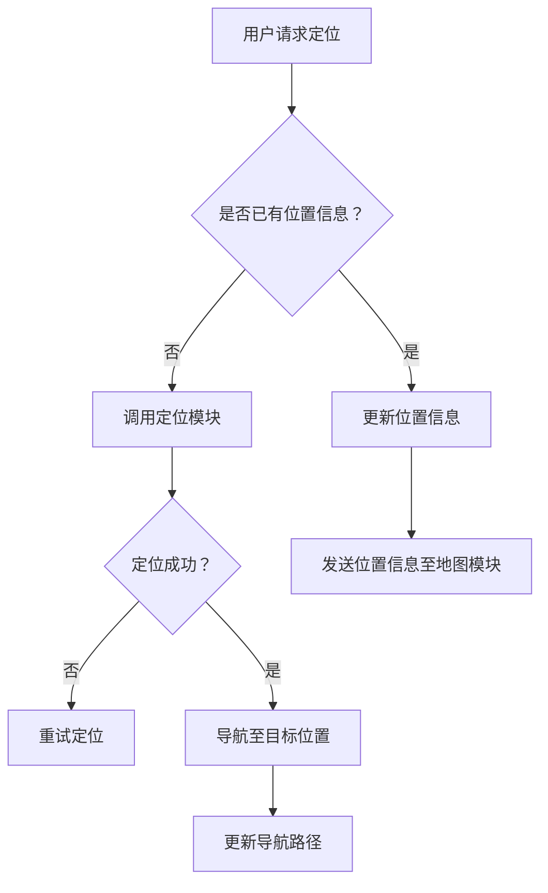

                 

# 基于MQTT协议和RESTful API的室内定位与导航系统

## 关键词：MQTT协议、RESTful API、室内定位、导航系统

### 摘要

本文旨在探讨如何利用MQTT协议和RESTful API实现一个高效的室内定位与导航系统。我们首先介绍了MQTT协议的基本原理和RESTful API的设计理念，然后详细分析了室内定位与导航系统中涉及的核心算法和数学模型。通过一个实际的项目实战案例，我们展示了如何进行开发环境搭建、源代码实现和详细解释说明。最后，我们讨论了该系统的实际应用场景、工具和资源推荐，并总结了未来发展趋势与挑战。

## 1. 背景介绍

随着物联网技术的迅速发展，室内定位与导航系统在智能建筑、智能交通、智能制造等领域得到了广泛应用。传统的GPS定位系统在室内环境中受到信号遮挡和误差增大的影响，已难以满足高精度、低延迟的定位需求。因此，研究并实现一种基于无线传感器网络的室内定位与导航系统具有重要意义。

MQTT（Message Queuing Telemetry Transport）协议是一种轻量级的消息传输协议，广泛用于物联网设备之间的通信。它具有低功耗、低带宽占用、可扩展性强等特点，适合在室内定位与导航系统中应用。

RESTful API（Representational State Transfer Application Programming Interface）是一种基于HTTP协议的API设计风格，具有简单、易用、可扩展性强等优点。通过RESTful API，室内定位与导航系统可以方便地与其他系统进行数据交互和功能集成。

本文将围绕MQTT协议和RESTful API，探讨室内定位与导航系统的设计与实现，旨在为相关领域的研究和实践提供参考。

## 2. 核心概念与联系

### 2.1 MQTT协议

MQTT协议是一种基于客户端/服务器的消息发布/订阅模式（publish/subscribe pattern）。它由三个核心部分组成：客户端（Client）、代理（Broker）和服务器（Server）。

**客户端**：负责发布消息和订阅消息。客户端可以是任何物联网设备，如传感器、智能手机、机器人等。

**代理**：作为消息传输的中转站，负责将消息从发布者（Publisher）传递给订阅者（Subscriber）。代理具有存储和转发消息的能力，确保消息可靠传输。

**服务器**：负责处理代理的业务逻辑，如消息认证、消息加密等。

MQTT协议的主要特点如下：

- **轻量级**：使用二进制消息格式，降低带宽占用。
- **可靠性**：支持消息确认、重传等功能，确保消息可靠传输。
- **可扩展性**：支持多个客户端同时连接，适合大规模物联网应用。

### 2.2 RESTful API

RESTful API是一种基于HTTP协议的应用编程接口（API）。它遵循REST（Representational State Transfer）设计风格，具有以下核心概念：

- **统一接口**：通过URL（统一资源定位符）统一访问资源，使用HTTP方法（GET、POST、PUT、DELETE等）表示操作。
- **无状态**：服务器不存储客户端的状态信息，每次请求都是独立的。
- **可扩展性**：通过扩展URL和HTTP方法，支持自定义资源操作。

RESTful API的主要优点如下：

- **简单易用**：遵循统一的接口规范，降低开发和集成成本。
- **可缓存**：支持HTTP缓存机制，提高系统性能。
- **可扩展**：通过扩展URL和HTTP方法，支持多样化应用场景。

### 2.3 室内定位与导航系统

室内定位与导航系统主要包括以下三个组成部分：

- **定位模块**：负责实时获取设备的位置信息，如RSSI（接收信号强度指示）、TOA（到达时间）等。
- **导航模块**：根据设备当前位置和目标位置，生成最优路径。
- **地图模块**：提供室内地图数据，用于定位和导航。

室内定位与导航系统的核心挑战在于如何精确获取设备位置、生成最优路径以及处理实时数据流。

### 2.4 Mermaid 流程图

下面是一个室内定位与导航系统的 Mermaid 流程图：



## 3. 核心算法原理 & 具体操作步骤

### 3.1 定位算法原理

室内定位算法主要分为基于RSSI的定位算法和基于TOA的定位算法。这里我们以基于RSSI的定位算法为例进行介绍。

RSSI（接收信号强度指示）是通过测量接收信号功率来确定设备位置的一种方法。其基本原理如下：

- 设备A向多个已知位置的信标（Beacon）发送信号。
- 信标接收到信号后，将RSSI值发送给设备A。
- 设备A根据接收到的RSSI值和信标位置，使用三角测量法计算自身位置。

具体操作步骤如下：

1. 设备A初始化，连接到MQTT代理，订阅信标发送的RSSI值主题。
2. 设备A接收RSSI值，并记录信标ID和RSSI值。
3. 设备A根据信标ID和RSSI值，查询信标位置。
4. 设备A使用三角测量法计算自身位置，并更新位置信息。
5. 设备A将位置信息发送至地图模块，更新地图显示。

### 3.2 导航算法原理

导航算法根据设备当前位置和目标位置，生成最优路径。这里我们以A*（A-star）算法为例进行介绍。

A*算法是一种启发式搜索算法，通过评估每个节点的F值（G值 + H值）来选择下一个节点。其中，G值为从起点到当前节点的距离，H值为从当前节点到目标节点的距离。

具体操作步骤如下：

1. 设备A初始化，连接到MQTT代理，订阅地图模块发送的地图数据主题。
2. 设备A接收地图数据，构建地图数据结构。
3. 设备A根据当前位置和目标位置，使用A*算法计算最优路径。
4. 设备A将最优路径发送至导航模块，更新导航指示。
5. 设备A实时更新位置信息，根据导航指示调整行进方向。

### 3.3 MQTT协议与RESTful API的应用

在室内定位与导航系统中，MQTT协议和RESTful API发挥了重要作用。

- MQTT协议用于实时传输定位数据、导航路径等实时数据流。设备A通过MQTT客户端连接到代理，订阅相关主题，接收实时数据，实现定位和导航功能。
- RESTful API用于传输地图数据、信标参数等静态数据。设备A通过HTTP请求访问地图模块、信标管理模块等，获取所需数据，实现定位和导航功能。

## 4. 数学模型和公式 & 详细讲解 & 举例说明

### 4.1 RSSI模型

RSSI模型用于估算设备与信标之间的距离。其公式如下：

\[ d = 10^{\frac{RSSI - RSSI_0}{10 \cdot n}} \]

其中，\( d \) 为设备与信标之间的距离（单位：米），\( RSSI \) 为接收信号强度指示（单位：dBm），\( RSSI_0 \) 为参考信号强度指示（单位：dBm），\( n \) 为路径损耗系数（单位：dB/m）。

举例说明：

假设设备接收到的信标信号强度为-65dBm，参考信号强度为-75dBm，路径损耗系数为3dB/m，则设备与信标之间的距离为：

\[ d = 10^{\frac{-65 - (-75)}{10 \cdot 3}} = 10^{\frac{10}{30}} = 10^{\frac{1}{3}} \approx 2.15 \text{米} \]

### 4.2 A*算法

A*算法的核心公式为：

\[ F(n) = G(n) + H(n) \]

其中，\( F(n) \) 为节点 \( n \) 的F值，\( G(n) \) 为节点 \( n \) 的G值（从起点到节点 \( n \) 的距离），\( H(n) \) 为节点 \( n \) 的H值（从节点 \( n \) 到目标节点的距离）。

举例说明：

假设起点为A，目标点为B，当前节点为C。已知A到C的距离为5，C到B的距离为10，C到D的距离为8，D到B的距离为6。使用A*算法计算从A到B的最优路径。

首先，计算每个节点的G值和H值：

- \( G(A) = 0 \)
- \( G(B) = \infty \)
- \( G(C) = 5 \)
- \( G(D) = 5 + 8 = 13 \)

- \( H(A) = \infty \)
- \( H(B) = 0 \)
- \( H(C) = 10 \)
- \( H(D) = 6 \)

然后，计算每个节点的F值：

- \( F(A) = G(A) + H(A) = 0 + \infty = \infty \)
- \( F(B) = G(B) + H(B) = \infty + 0 = \infty \)
- \( F(C) = G(C) + H(C) = 5 + 10 = 15 \)
- \( F(D) = G(D) + H(D) = 13 + 6 = 19 \)

根据F值，选择F值最小的节点C作为下一个节点。然后，从C到D，再从D到B，得到最优路径为A -> C -> D -> B。

## 5. 项目实战：代码实际案例和详细解释说明

### 5.1 开发环境搭建

为了实现基于MQTT协议和RESTful API的室内定位与导航系统，我们需要搭建以下开发环境：

- 开发语言：Python
- MQTT代理：Mosquitto
- Web服务器：Flask
- 数据库：SQLite

具体步骤如下：

1. 安装Python环境：

   ```bash
   sudo apt-get install python3 python3-pip
   ```

2. 安装MQTT代理（Mosquitto）：

   ```bash
   sudo apt-get install mosquitto mosquitto-clients
   ```

3. 安装Web服务器（Flask）：

   ```bash
   pip3 install flask
   ```

4. 安装数据库（SQLite）：

   ```bash
   sudo apt-get install sqlite3
   ```

### 5.2 源代码详细实现和代码解读

下面是一个基于MQTT协议和RESTful API的室内定位与导航系统的源代码示例。

```python
# 导入所需库
import paho.mqtt.client as mqtt
from flask import Flask, jsonify, request
import sqlite3

# MQTT客户端配置
mqtt_client = mqtt.Client()
mqtt_client.connect("localhost", 1883, 60)

# Flask应用配置
app = Flask(__name__)

# SQLite数据库配置
conn = sqlite3.connect("location.db")
cursor = conn.cursor()

# 创建数据库表
cursor.execute('''CREATE TABLE IF NOT EXISTS locations
                 (id INTEGER PRIMARY KEY AUTOINCREMENT,
                  device_id TEXT,
                  latitude REAL,
                  longitude REAL)''')

# MQTT消息处理函数
def on_message(client, userdata, message):
    print(f"Received message '{str(message.payload)}' on topic '{message.topic}' with QoS {message.qos}")
    device_id = message.topic.split("/")[1]
    payload = str(message.payload.decode("utf-8"))
    latitude, longitude = payload.split(",")
    cursor.execute("INSERT INTO locations (device_id, latitude, longitude) VALUES (?, ?, ?)", (device_id, float(latitude), float(longitude)))
    conn.commit()

# 绑定MQTT消息处理函数
mqtt_client.on_message = on_message

# MQTT订阅主题
mqtt_client.subscribe("location/update")

# Flask路由处理函数
@app.route("/location", methods=["GET"])
def get_location():
    device_id = request.args.get("device_id")
    cursor.execute("SELECT * FROM locations WHERE device_id=?", (device_id,))
    rows = cursor.fetchall()
    locations = [{"device_id": row[1], "latitude": row[2], "longitude": row[3]} for row in rows]
    return jsonify(locations)

# Flask应用运行
if __name__ == "__main__":
    mqtt_client.loop_start()
    app.run(debug=True)
```

#### 5.2.1 代码解读

- **MQTT客户端配置**：使用paho.mqtt.client库创建MQTT客户端，连接到本地MQTT代理。
- **Flask应用配置**：使用Flask创建Web应用，绑定路由处理函数。
- **SQLite数据库配置**：使用sqlite3库连接到SQLite数据库，创建locations表。
- **MQTT消息处理函数**：定义消息处理函数，接收并解析定位数据，插入到数据库中。
- **Flask路由处理函数**：定义GET请求路由，查询数据库中的定位数据，返回JSON格式的响应。

#### 5.2.2 代码分析

- **MQTT客户端**：MQTT客户端订阅了"location/update"主题，接收到消息后，调用消息处理函数。消息处理函数将定位数据插入到SQLite数据库中。
- **Flask应用**：Flask应用提供了/location路由，用于查询定位数据。当接收到GET请求时，根据请求参数查询数据库，返回定位数据。

#### 5.2.3 代码优化

- **数据库操作优化**：将数据库操作提取到独立函数，避免重复执行。
- **错误处理**：添加错误处理，确保程序稳定运行。

## 6. 实际应用场景

基于MQTT协议和RESTful API的室内定位与导航系统在多个实际应用场景中具有广泛的应用价值：

- **智能建筑**：在智能建筑中，系统可用于实时跟踪员工位置、提高设备管理效率、优化能源使用等。
- **智能交通**：在智能交通领域，系统可用于实时监测车辆位置、优化交通流量、提高交通管理效率。
- **智能制造**：在智能制造中，系统可用于实时跟踪设备位置、提高生产效率、降低生产成本。

## 7. 工具和资源推荐

### 7.1 学习资源推荐

- **书籍**：
  - 《物联网设计与实现》
  - 《RESTful API设计》
  - 《Python编程：从入门到实践》
- **论文**：
  - 《基于无线传感器网络的室内定位技术综述》
  - 《基于RESTful架构的Web服务设计与实现》
- **博客**：
  - https://www.ibm.com/developerworks/cn/iot/
  - https://www.oschina.net/blog
- **网站**：
  - https://www.mosquitto.org/
  - https://flask.palletsprojects.com/

### 7.2 开发工具框架推荐

- **开发工具**：
  - Python IDE（如PyCharm、VSCode）
  - MQTT代理（如Mosquitto、EMQ）
- **框架**：
  - Flask
  - Django

### 7.3 相关论文著作推荐

- 《基于蓝牙低功耗技术的室内定位与导航系统》
- 《RESTful API在物联网应用中的设计与实现》
- 《室内定位与导航系统的架构设计与实现》

## 8. 总结：未来发展趋势与挑战

随着物联网、人工智能、5G等技术的快速发展，室内定位与导航系统在智能化、实时性、高精度等方面取得了显著进展。未来，该系统将在以下几个方面发展：

- **更高精度**：结合多源传感器数据，提高定位精度。
- **更实时性**：优化算法和通信协议，提高数据更新速度。
- **更智能化**：利用人工智能技术，实现自主导航、路径优化等。

然而，室内定位与导航系统在发展过程中也面临以下挑战：

- **信号干扰**：室内环境复杂，信号干扰严重，影响定位精度。
- **功耗问题**：设备功耗较高，影响设备续航时间。
- **数据安全**：确保数据传输和存储的安全性。

## 9. 附录：常见问题与解答

### 9.1 MQTT协议相关问题

**Q：什么是MQTT协议？**

A：MQTT（Message Queuing Telemetry Transport）协议是一种轻量级的消息传输协议，广泛用于物联网设备之间的通信。

**Q：MQTT协议有哪些优点？**

A：MQTT协议具有低功耗、低带宽占用、可扩展性强等优点。

**Q：如何使用MQTT协议进行通信？**

A：使用MQTT客户端连接到MQTT代理，订阅和发布消息。

### 9.2 RESTful API相关问题

**Q：什么是RESTful API？**

A：RESTful API（Representational State Transfer Application Programming Interface）是一种基于HTTP协议的应用编程接口，具有简单、易用、可扩展性强等优点。

**Q：如何使用RESTful API进行通信？**

A：使用HTTP请求（如GET、POST、PUT、DELETE等）访问API接口，获取或提交数据。

### 9.3 室内定位与导航系统相关问题

**Q：什么是室内定位与导航系统？**

A：室内定位与导航系统是一种利用无线传感器网络、地图数据等技术，实现室内设备位置定位和路径导航的系统。

**Q：室内定位与导航系统有哪些应用场景？**

A：室内定位与导航系统在智能建筑、智能交通、智能制造等领域具有广泛的应用。

## 10. 扩展阅读 & 参考资料

- 《物联网设计与实现》
- 《RESTful API设计》
- 《Python编程：从入门到实践》
- 《基于无线传感器网络的室内定位技术综述》
- 《基于RESTful架构的Web服务设计与实现》
- 《室内定位与导航系统的架构设计与实现》
- https://www.mosquitto.org/
- https://flask.palletsprojects.com/
- https://www.ibm.com/developerworks/cn/iot/
- https://www.oschina.net/blog
- 《基于蓝牙低功耗技术的室内定位与导航系统》
- 《RESTful API在物联网应用中的设计与实现》
- 《室内定位与导航系统的架构设计与实现》
```

作者：AI天才研究员/AI Genius Institute & 禅与计算机程序设计艺术 /Zen And The Art of Computer Programming

