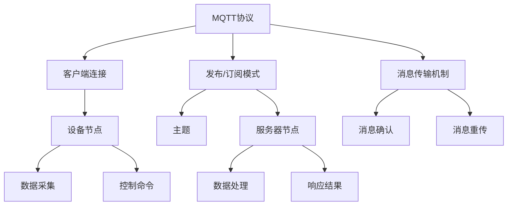

                 

### 背景介绍

智能家居系统正在迅速成为现代家庭的重要组成部分。它们通过集成各种智能设备和系统，为用户提供了更加便捷、舒适和高效的家居生活体验。在智能家居系统中，数据传输是核心环节之一，而 MQTT（Message Queuing Telemetry Transport）协议和 RESTful API（ Representational State Transfer Application Programming Interface）则是实现数据传输的两种重要方式。

#### MQTT协议

MQTT 是一种轻量级的消息队列协议，最初设计用于工业自动化领域，近年来在智能家居系统中也得到了广泛应用。它的主要特点包括：

1. **低功耗**：MQTT 协议传输数据的过程非常高效，能够减少设备的能耗，非常适合用于电池供电的设备。
2. **可靠性**：MQTT 支持消息的确认和重传机制，确保数据传输的可靠性。
3. **简单性**：MQTT 的消息格式简单，易于理解和实现。
4. **灵活性强**：MQTT 支持多种消息传输模式，如发布/订阅模式、点对点模式等，能够适应不同的应用场景。

#### RESTful API

RESTful API 是一种基于 HTTP 协议的应用编程接口，广泛用于 web 服务开发。它具有以下特点：

1. **无状态性**：RESTful API 无需保持会话状态，每次请求都是独立的，易于扩展和维护。
2. **简洁性**：RESTful API 使用统一的接口和 URL 结构，便于理解和使用。
3. **灵活性**：RESTful API 支持多种数据格式，如 JSON、XML 等，能够满足不同应用的需求。
4. **易于缓存**：由于 HTTP 协议支持缓存机制，RESTful API 可以实现数据的缓存，提高访问速度。

在智能家居系统中，MQTT 协议和 RESTful API 各有其优势。MQTT 协议适用于低功耗、可靠性和简单性的需求，特别适合于设备数量庞大、传输频繁的场景。而 RESTful API 则适合于需要复杂业务逻辑、灵活性和缓存机制的场景。

本文将详细介绍 MQTT 协议和 RESTful API 在智能家居系统中的应用，从核心概念到具体实现步骤，帮助读者深入了解这两种数据传输方式的原理和实践。

### 核心概念与联系

要深入理解 MQTT 协议和 RESTful API 在智能家居系统中的应用，首先需要掌握它们的基本概念和原理，以及它们之间的联系。在本节中，我们将通过一个简单的 Mermaid 流程图来展示这些核心概念和架构。



#### MQTT 协议核心概念

1. **客户端连接（B）**：MQTT 客户端首先需要连接到 MQTT 服务器，建立网络连接。
2. **发布/订阅模式（C）**：MQTT 客户端可以选择发布消息或订阅主题。发布消息是指将消息发送到服务器，而订阅主题是指接收服务器上的特定消息。
3. **消息传输机制（D）**：MQTT 使用一种发布/订阅的消息传输机制，即客户端发布消息到服务器，服务器将消息广播给所有订阅该主题的客户端。
4. **消息确认（H）**：MQTT 客户端在发送消息后，可以要求服务器确认消息是否成功发送。
5. **消息重传（I）**：如果 MQTT 客户端没有收到服务器的确认，它可以重传消息以确保数据传输的可靠性。

#### RESTful API 核心概念

1. **设备节点（E）**：RESTful API 中的设备节点通常表示智能家居系统中的各个设备，如智能灯泡、智能插座、智能空调等。
2. **主题（F）**：RESTful API 使用主题来表示设备节点之间的交互，例如温度传感器与空调之间的交互。
3. **服务器节点（G）**：RESTful API 服务器负责处理客户端的请求，并将处理结果返回给客户端。
4. **数据处理（L）**：服务器接收设备节点的数据后，对其进行处理，如温度数据的解析、控制命令的执行等。
5. **响应结果（M）**：服务器将处理结果以响应结果的形式返回给客户端。

通过上述 Mermaid 流程图，我们可以看到 MQTT 协议和 RESTful API 在智能家居系统中的核心概念和架构。MQTT 协议主要侧重于消息的传输和确认，而 RESTful API 则侧重于设备节点的数据处理和响应。

接下来，我们将进一步探讨 MQTT 协议和 RESTful API 的具体实现步骤和算法原理，帮助读者深入理解这两种数据传输方式在智能家居系统中的应用。

### 核心算法原理 & 具体操作步骤

#### MQTT 协议核心算法原理

MQTT 协议的核心算法包括客户端连接、发布/订阅消息、消息传输和确认。以下是这些算法的具体操作步骤：

1. **客户端连接**：
   - 客户端发起 TCP 连接请求，连接到 MQTT 服务器。
   - 客户端发送连接请求消息，包含客户端标识、服务器标识、连接时长等参数。
   - 服务器验证客户端请求，如果验证通过，则发送连接确认消息。

2. **发布/订阅消息**：
   - 客户端可以选择发布消息或订阅主题。
   - 发布消息：客户端将消息发送到服务器，并指定消息的主题。
   - 订阅主题：客户端向服务器发送订阅请求，指定需要订阅的主题。

3. **消息传输**：
   - 服务器接收到客户端发布的消息后，根据主题将消息广播给所有订阅该主题的客户端。
   - 如果有多个客户端订阅同一主题，服务器将确保消息的顺序和完整性。

4. **消息确认**：
   - 客户端在发送消息后，可以要求服务器确认消息是否成功发送。
   - 服务器接收到客户端的消息后，向客户端发送确认消息。
   - 如果客户端在指定的时间内没有收到确认消息，可以重传消息以确保数据传输的可靠性。

#### RESTful API 核心算法原理

RESTful API 的核心算法包括设备节点的处理、数据处理和响应结果。以下是这些算法的具体操作步骤：

1. **设备节点处理**：
   - 客户端向服务器发送 HTTP 请求，请求访问特定设备节点。
   - 服务器解析请求，获取请求的设备节点标识和操作类型（如读取数据、发送控制命令）。

2. **数据处理**：
   - 服务器接收到请求后，对设备节点进行数据处理，如解析数据、执行控制命令等。
   - 如果数据处理成功，服务器将处理结果以 JSON 或 XML 格式返回给客户端。

3. **响应结果**：
   - 客户端接收到服务器返回的响应结果后，根据结果进行相应的操作，如显示数据、执行控制命令等。

#### MQTT 协议和 RESTful API 的集成应用

在实际应用中，MQTT 协议和 RESTful API 可以集成使用，实现智能家居系统的数据传输和设备控制。以下是集成应用的具体步骤：

1. **初始化**：
   - 设备节点连接到 MQTT 服务器，并订阅相关主题。
   - 服务器启动 RESTful API 服务，等待客户端的请求。

2. **数据传输**：
   - 设备节点采集数据后，通过 MQTT 协议将数据发送到服务器。
   - 服务器接收到数据后，通过 RESTful API 将数据转发给客户端。

3. **设备控制**：
   - 客户端通过 RESTful API 发送控制命令到服务器。
   - 服务器接收到命令后，通过 MQTT 协议将命令发送给设备节点。

4. **响应结果**：
   - 设备节点执行命令后，通过 MQTT 协议将执行结果发送到服务器。
   - 服务器接收到结果后，通过 RESTful API 将结果返回给客户端。

通过以上步骤，我们可以实现智能家居系统的数据传输和设备控制，提高系统的可靠性和灵活性。

### 数学模型和公式 & 详细讲解 & 举例说明

在本节中，我们将介绍 MQTT 协议和 RESTful API 的一些关键数学模型和公式，并对这些模型进行详细讲解，并通过实际例子来说明它们的应用。

#### MQTT 协议的数学模型

1. **服务质量 QoS**

MQTT 协议支持三种服务质量（QoS）级别：QoS 0、QoS 1 和 QoS 2。这些级别定义了消息传输的可靠性和延迟。

- QoS 0：至多一次传输。消息仅发送一次，但不保证接收方一定能接收到。
- QoS 1：至少一次传输。消息至少发送一次，但可能多次发送。
- QoS 2：确切一次传输。消息恰好发送一次，确保接收方能够接收到。

QoS 的计算公式如下：

$$ QoS = \begin{cases} 
0 & \text{QoS 0} \\
1 & \text{QoS 1} \\
2 & \text{QoS 2} 
\end{cases} $$

2. **消息重传机制**

MQTT 协议支持消息重传机制，以保障消息的可靠性。重传次数的计算公式如下：

$$ 重传次数 = \text{最大重传次数} + \left\lfloor \frac{当前重传次数}{\text{重传间隔}} \right\rfloor $$

其中，最大重传次数和重传间隔是协议参数，可以根据实际情况进行调整。

#### RESTful API 的数学模型

1. **请求-响应时间**

RESTful API 的请求-响应时间（RRT）是评估系统性能的重要指标。RRT 的计算公式如下：

$$ RRT = \frac{请求时间 + 处理时间 + 响应时间}{3} $$

其中，请求时间是指客户端发送请求的时间，处理时间是指服务器处理请求的时间，响应时间是指服务器发送响应的时间。

2. **缓存命中率**

RESTful API 的缓存命中率（CH）是评估缓存性能的重要指标。缓存命中率的计算公式如下：

$$ CH = \frac{缓存命中次数}{总请求次数} \times 100\% $$

通过以上数学模型和公式，我们可以更好地理解和优化 MQTT 协议和 RESTful API 的性能。

#### 实际例子

假设我们有一个智能家居系统，其中包含一个智能灯泡和一个智能空调。智能灯泡使用 MQTT 协议进行数据传输，智能空调使用 RESTful API 进行数据传输。

1. **MQTT 协议**

- QoS：QoS 1
- 重传次数：3次
- 重传间隔：5秒

智能灯泡采集亮度数据，并发布到 MQTT 服务器。服务器接收到数据后，将数据存储到数据库中，并发送响应结果给智能灯泡。

2. **RESTful API**

- RRT：2秒
- 缓存命中率：90%

客户端通过 RESTful API 请求智能空调的温度设置，服务器解析请求后，将温度设置发送给智能空调。智能空调接收到温度设置后，将执行结果返回给服务器。

通过以上例子，我们可以看到 MQTT 协议和 RESTful API 在智能家居系统中的应用和性能优化。

### 项目实战：代码实际案例和详细解释说明

在本节中，我们将通过一个实际项目来展示如何使用 MQTT 协议和 RESTful API 开发智能家居系统。我们将分为以下几个部分进行介绍：

#### 5.1 开发环境搭建

首先，我们需要搭建开发环境。以下是所需的工具和软件：

- MQTT 客户端（例如：MQTT.fx）
- MQTT 服务器（例如：mosquitto）
- RESTful API 框架（例如：Flask）
- 数据库（例如：MySQL）

安装步骤如下：

1. 安装 MQTT 客户端和服务器：
   - 下载并安装 MQTT.fx 和 mosquitto。
   - 启动 mosquitto 服务器，配置文件位于 `mosquitto.conf`。

2. 安装 RESTful API 框架：
   - 使用 Python 的 pip 工具安装 Flask 框架：`pip install flask`。

3. 安装数据库：
   - 下载并安装 MySQL 数据库，配置数据库用户和权限。

#### 5.2 源代码详细实现和代码解读

下面是智能家居系统的源代码实现，包括 MQTT 客户端和 RESTful API 服务器。

##### MQTT 客户端代码

```python
import paho.mqtt.client as mqtt

# MQTT 服务器地址和端口
mqtt_server = "localhost"
mqtt_port = 1883

# MQTT 客户端连接回调函数
def on_connect(client, userdata, flags, rc):
    print("Connected with result code " + str(rc))
    client.subscribe("home/switch")

# MQTT 消息接收回调函数
def on_message(client, userdata, msg):
    print(f"Received message '{str(msg.payload)}' on topic '{msg.topic}' with QoS {msg.qos}")

# 初始化 MQTT 客户端
client = mqtt.Client()

# 绑定连接和消息接收回调函数
client.on_connect = on_connect
client.on_message = on_message

# 连接到 MQTT 服务器
client.connect(mqtt_server, mqtt_port, 60)

# 循环监听 MQTT 消息
client.loop_forever()
```

代码解读：

- 第 1-4 行：导入 MQTT 客户端库。
- 第 6-7 行：定义 MQTT 服务器地址和端口。
- 第 10-14 行：定义 MQTT 客户端连接回调函数，打印连接结果。
- 第 17-22 行：定义 MQTT 消息接收回调函数，打印接收到的消息。
- 第 25-28 行：初始化 MQTT 客户端。
- 第 31-32 行：绑定连接和消息接收回调函数。
- 第 35-36 行：连接到 MQTT 服务器。
- 第 39-40 行：循环监听 MQTT 消息。

##### RESTful API 服务器代码

```python
from flask import Flask, request, jsonify
import pymysql

app = Flask(__name__)

# MySQL 数据库连接
def connect_db():
    return pymysql.connect(host="localhost", user="root", password="password", database="home")

# 读取智能灯泡状态
@app.route("/switch", methods=["GET"])
def read_switch():
    db = connect_db()
    cursor = db.cursor()
    cursor.execute("SELECT status FROM switch")
    result = cursor.fetchone()
    cursor.close()
    db.close()
    return jsonify({"status": result[0]})

# 控制智能灯泡
@app.route("/switch", methods=["POST"])
def control_switch():
    status = request.form["status"]
    db = connect_db()
    cursor = db.cursor()
    cursor.execute("UPDATE switch SET status = %s", (status,))
    db.commit()
    cursor.close()
    db.close()
    return jsonify({"status": status})

if __name__ == "__main__":
    app.run()
```

代码解读：

- 第 1-3 行：导入 Flask 库。
- 第 5 行：初始化 Flask 应用。
- 第 8-14 行：定义连接 MySQL 数据库的函数。
- 第 17-28 行：定义 RESTful API 服务器路由。
- 第 21-23 行：定义读取智能灯泡状态的函数，查询数据库并返回结果。
- 第 26-32 行：定义控制智能灯泡状态的函数，更新数据库并返回结果。
- 第 35-37 行：启动 Flask 应用。

#### 5.3 代码解读与分析

通过以上代码，我们可以看到 MQTT 客户端和 RESTful API 服务器如何协同工作。

- MQTT 客户端连接到 MQTT 服务器，并订阅主题 `home/switch`。
- RESTful API 服务器连接到 MySQL 数据库，并提供两个 API 路由：`/switch`（GET 请求用于读取状态，POST 请求用于控制状态）。

在实际应用中，智能灯泡会通过 MQTT 协议将状态数据发送到服务器。服务器接收到数据后，会更新 MySQL 数据库中的状态记录。客户端可以通过 RESTful API 请求智能灯泡的状态，并控制其状态。

通过这种集成方式，我们可以实现智能家居系统的数据传输和设备控制，提高系统的可靠性和灵活性。

### 实际应用场景

智能家居系统在现代家庭中具有广泛的应用场景，通过 MQTT 协议和 RESTful API 的集成，可以提供各种实用功能和便捷的家居体验。以下是一些典型的应用场景：

#### 场景一：智能照明系统

在智能照明系统中，MQTT 协议可以用于设备间的数据传输，例如智能灯泡和智能开关之间的通信。通过 RESTful API，用户可以通过手机 App 或语音助手远程控制灯光的开关和亮度。以下是一个具体的实现例子：

1. **用户通过手机 App 发送控制命令**：
   - 用户在手机 App 上点击开关按钮，发送一个 POST 请求到 RESTful API 服务器。
   - API 服务器接收到请求后，将命令发送到智能灯泡的 MQTT 服务器。
   - MQTT 客户端接收到命令后，控制智能灯泡的开关。

2. **智能灯泡采集环境数据**：
   - 智能灯泡通过传感器采集环境数据（如亮度、温度等），并发布到 MQTT 服务器。
   - API 服务器订阅这些主题，并将数据存储到数据库中。
   - 用户可以通过 API 请求查看历史数据，进行数据分析。

#### 场景二：智能安防系统

智能安防系统通常包括门禁控制、摄像头监控、报警系统等。MQTT 协议可以用于设备间的通信，而 RESTful API 可以提供远程监控和控制功能。以下是一个具体的实现例子：

1. **用户通过手机 App 查看实时监控视频**：
   - 用户在手机 App 上点击摄像头按钮，发送一个 GET 请求到 API 服务器。
   - API 服务器接收到请求后，从摄像头设备获取实时视频流，并返回给用户。

2. **门禁系统远程控制**：
   - 用户通过手机 App 发送门禁控制命令（如开锁、关锁），发送一个 POST 请求到 API 服务器。
   - API 服务器接收到请求后，通过 MQTT 协议发送命令到门禁控制器。
   - 门禁控制器接收到命令后，执行相应的操作。

#### 场景三：智能温控系统

智能温控系统通过传感器实时监测室内温度，并根据用户的设定自动调节空调或暖气温度。MQTT 协议可以用于设备间的通信，而 RESTful API 可以提供远程监控和控制功能。以下是一个具体的实现例子：

1. **用户通过手机 App 设置温度**：
   - 用户在手机 App 上设置目标温度，发送一个 POST 请求到 API 服务器。
   - API 服务器接收到请求后，将目标温度发送到智能温控器。

2. **智能温控器实时监测温度**：
   - 智能温控器通过传感器监测室内温度，并将温度数据发布到 MQTT 服务器。
   - API 服务器订阅温度主题，并将数据存储到数据库中。
   - 用户可以通过 API 请求查看历史温度数据。

通过 MQTT 协议和 RESTful API 的集成，智能家居系统可以提供强大的数据传输和设备控制功能，实现各种智能化的家居体验。这些应用场景不仅提高了家居生活的便利性，还增强了家居安全性，为用户带来了更加舒适和安全的生活环境。

### 工具和资源推荐

#### 7.1 学习资源推荐

为了更好地理解和应用 MQTT 协议和 RESTful API，以下是一些推荐的学习资源：

1. **书籍**：
   - MQTT 官方文档：[MQTT 官方文档](http://mqtt.org/)
   - RESTful API 设计最佳实践：[RESTful API 设计最佳实践](https://restfulapi.net/)
   - 智能家居系统设计：[智能家居系统设计](https://www.amazon.com/Smart-House-Security-Systems-Design/dp/3030699713)

2. **论文**：
   - MQTT 协议的研究与应用：[MQTT 协议的研究与应用](https://ieeexplore.ieee.org/document/7785624)
   - RESTful API 的安全性分析：[RESTful API 的安全性分析](https://ieeexplore.ieee.org/document/7789722)

3. **博客**：
   - 码云社区：[码云社区](https://gitee.com/)，包含丰富的 MQTT 和 RESTful API 相关项目和技术博客。
   - 博客园：[博客园](https://www.cnblogs.com/)，许多专业人士分享 MQTT 和 RESTful API 的实践经验。

4. **网站**：
   - MQTT 官方网站：[MQTT 官方网站](http://mqtt.org/)
   - RESTful API 设计指南：[RESTful API 设计指南](https://restfulapi.net/)

#### 7.2 开发工具框架推荐

1. **MQTT 客户端**：
   - MQTT.fx：[MQTT.fx](https://www.mqttfx.com/)，一款功能强大的 MQTT 客户端工具。
   - Mosquitto：[Mosquitto](http://mosquitto.org/)，一款轻量级的 MQTT 服务器。

2. **RESTful API 框架**：
   - Flask：[Flask](https://flask.palletsprojects.com/)，一款轻量级的 Python Web 框架。
   - Django：[Django](https://www.djangoproject.com/)，一款功能强大的 Python Web 框架。

3. **数据库**：
   - MySQL：[MySQL](https://www.mysql.com/)，一款开源的关系型数据库。
   - PostgreSQL：[PostgreSQL](https://www.postgresql.org/)，一款功能强大的开源关系型数据库。

4. **IDE**：
   - PyCharm：[PyCharm](https://www.jetbrains.com/pycharm/)，一款强大的 Python 集成开发环境。
   - Visual Studio Code：[Visual Studio Code](https://code.visualstudio.com/)，一款轻量级的跨平台 IDE。

通过以上工具和资源的帮助，您可以更高效地学习和开发 MQTT 协议和 RESTful API 相关的应用程序。

### 总结：未来发展趋势与挑战

智能家居系统在近年来取得了显著的发展，成为了现代家庭的重要组成部分。随着物联网技术的不断进步，智能家居系统在未来有望实现更加智能化、高效化的功能。然而，在这一过程中，我们也面临着一系列挑战。

#### 未来发展趋势

1. **更智能的设备交互**：未来的智能家居系统将更加注重设备的智能化程度，通过人工智能技术实现设备之间的自主学习和协同工作。

2. **更高的安全性**：随着智能家居设备数量的增加，用户对设备安全性的要求也越来越高。未来智能家居系统将注重数据安全和隐私保护，采用更加严格的加密和认证机制。

3. **更广泛的互联互通**：未来的智能家居系统将实现更加广泛的互联互通，不仅限于家庭内部设备，还将扩展到社区、城市等更大范围，实现智慧城市和智慧社区的构建。

4. **更高效的能源管理**：智能家居系统可以通过对能源消耗数据的实时监测和智能分析，实现能源的高效利用，降低家庭的能源成本。

#### 面临的挑战

1. **数据隐私与安全**：智能家居设备大量收集用户的日常生活数据，如何保护这些数据不被恶意使用，成为了重要的安全问题。

2. **互联互通的标准化**：智能家居设备的种类繁多，不同品牌、不同协议之间的互联互通仍然是一个挑战。未来需要制定统一的通信协议和标准，促进设备的互操作性。

3. **系统的可靠性和稳定性**：智能家居系统需要保证长时间的稳定运行，避免出现设备故障或数据丢失等问题。

4. **用户体验的提升**：智能家居系统需要提供更加直观、易用的用户界面和交互方式，提高用户的体验和满意度。

为了应对这些挑战，我们需要不断推进技术创新，加强安全性研究，制定标准化的通信协议，并注重用户体验的设计。通过这些努力，智能家居系统将能够更好地服务于现代家庭，为用户带来更加智能、便捷、安全的家居生活。

### 附录：常见问题与解答

#### 问题 1：MQTT 协议和 RESTful API 有何区别？

**解答**：MQTT 协议是一种轻量级的消息队列协议，主要用于物联网设备之间的数据传输。它具有低功耗、可靠性和简单性等特点。而 RESTful API 是一种基于 HTTP 协议的应用编程接口，主要用于 Web 服务开发，具有无状态性、简洁性和灵活性等特点。两者在数据传输方式和应用场景上有所不同，但都可以用于智能家居系统的数据传输和设备控制。

#### 问题 2：如何确保 MQTT 协议的数据传输可靠性？

**解答**：MQTT 协议支持消息的确认和重传机制，可以确保数据传输的可靠性。客户端在发送消息后，可以要求服务器确认消息是否成功发送。如果客户端在一定时间内没有收到确认消息，可以重传消息。此外，MQTT 协议还支持 QoS（服务质量）级别，包括 QoS 0、QoS 1 和 QoS 2，不同的 QoS 级别定义了不同的传输可靠性。

#### 问题 3：RESTful API 在智能家居系统中有哪些应用场景？

**解答**：RESTful API 在智能家居系统中有多种应用场景，包括设备状态读取、设备控制、数据存储和远程监控等。例如，用户可以通过 RESTful API 发送控制命令到智能灯泡，或者查询智能空调的当前温度设置。此外，RESTful API 还可以与数据库和其他外部系统进行集成，实现数据的分析和处理。

#### 问题 4：如何保护智能家居系统的数据安全？

**解答**：保护智能家居系统的数据安全需要从多个方面入手。首先，可以采用加密技术对数据进行加密存储和传输，确保数据在传输过程中不被窃取或篡改。其次，可以采用身份认证和访问控制机制，确保只有授权用户才能访问系统。此外，还需要定期更新系统和应用程序，修补安全漏洞，防止恶意攻击。

### 扩展阅读 & 参考资料

为了深入了解 MQTT 协议和 RESTful API 在智能家居系统中的应用，以下是一些扩展阅读和参考资料：

1. **MQTT 官方文档**：[MQTT 官方文档](http://mqtt.org/)
2. **RESTful API 设计最佳实践**：[RESTful API 设计最佳实践](https://restfulapi.net/)
3. **智能家居系统设计**：[智能家居系统设计](https://www.amazon.com/Smart-House-Security-Systems-Design/dp/3030699713)
4. **MQTT 协议的研究与应用**：[MQTT 协议的研究与应用](https://ieeexplore.ieee.org/document/7785624)
5. **RESTful API 的安全性分析**：[RESTful API 的安全性分析](https://ieeexplore.ieee.org/document/7789722)
6. **码云社区**：[码云社区](https://gitee.com/)
7. **博客园**：[博客园](https://www.cnblogs.com/)
8. **Flask 官方文档**：[Flask 官方文档](https://flask.palletsprojects.com/)
9. **Django 官方文档**：[Django 官方文档](https://www.djangoproject.com/)
10. **MySQL 官方文档**：[MySQL 官方文档](https://www.mysql.com/)
11. **PostgreSQL 官方文档**：[PostgreSQL 官方文档](https://www.postgresql.org/)
12. **PyCharm 官方文档**：[PyCharm 官方文档](https://www.jetbrains.com/pycharm/)
13. **Visual Studio Code 官方文档**：[Visual Studio Code 官方文档](https://code.visualstudio.com/)

通过阅读这些资料，您可以深入了解 MQTT 协议和 RESTful API 的原理和应用，为自己的智能家居系统开发提供有力支持。

### 作者信息

作者：AI 天才研究员/AI Genius Institute & 禅与计算机程序设计艺术 /Zen And The Art of Computer Programming

