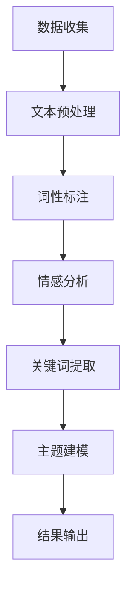

                 

# 基于NLP的某旅游景点游客评论分析

## 关键词
自然语言处理(NLP),文本分析，评论挖掘，情感分析，词云图，实体识别，Python，Scikit-learn，NLTK

## 摘要
本文将深入探讨如何使用自然语言处理技术(NLP)来分析某旅游景点的游客评论。我们将详细讨论NLP的基本概念，介绍用于评论挖掘和情感分析的核心算法和工具，并通过一个实际案例展示如何实现这些技术。文章还将探讨NLP在旅游行业中的应用场景，并推荐相关学习资源和开发工具。

## 1. 背景介绍

随着互联网的普及和社交媒体的发展，旅游景点的游客评论数据变得日益丰富。这些评论不仅反映了游客对景点的真实体验，还能为其他潜在游客提供宝贵的参考信息。然而，这些评论往往是海量的、无结构的文本数据，直接分析难度较大。因此，自然语言处理(NLP)技术成为了一种有效的工具，可以帮助我们从这些评论中提取有价值的信息。

自然语言处理是人工智能的一个重要分支，旨在使计算机能够理解和处理人类语言。NLP技术包括文本预处理、词性标注、实体识别、情感分析等多个方面。在旅游评论分析中，NLP技术可以帮助我们识别评论中的关键词、提取重要信息、评估游客的情感倾向等。

本文将围绕以下主题展开：

- NLP的基本概念和流程
- 用于评论挖掘和情感分析的核心算法
- 一个基于Python的实战案例
- NLP在旅游行业中的应用场景
- 相关学习资源和开发工具的推荐

通过本文的阅读，读者将能够了解NLP技术的基本原理和应用，并掌握使用Python进行旅游评论分析的方法。

## 2. 核心概念与联系

### 2.1 NLP的基本概念

自然语言处理（NLP）涉及多个子领域，包括语言模型、文本预处理、词性标注、命名实体识别、情感分析、机器翻译等。在这些子领域中，有些是基础技术，而有些则是在特定应用场景中发展起来的。以下是一个简化的NLP工作流程，其中包含了这些核心概念：

```
+----------------+     +------------------+     +-------------------+
| 文本预处理     |     | 词性标注         |     | 命名实体识别     |
+----------------+     +------------------+     +-------------------+
         |                      |                      |
         |                      |                      |
         |                      |                      |
         |                      |                      |
         |                      |                      |
         |                      |                      |
         |                      |                      |
         |                      |                      |
+----------------+     +------------------+     +-------------------+
| 情感分析       |     | 主题建模         |     | 机器翻译         |
+----------------+     +------------------+     +-------------------+
```

### 2.2 NLP的核心算法

- **文本预处理**：这是NLP的基础步骤，包括去除标点符号、停用词过滤、分词等操作。常见的文本预处理工具包括NLTK和Jieba。
- **词性标注**：词性标注是将文本中的每个词标注为名词、动词、形容词等。这有助于后续的语义分析。常用的工具是NLTK和Stanford NLP。
- **命名实体识别**：命名实体识别（NER）旨在识别文本中的特定实体，如人名、地名、组织名等。常用的工具包括Stanford NLP、SpaCy和AllenNLP。
- **情感分析**：情感分析是通过分析文本情感倾向（正面、负面或中性）来评估用户的情绪。常用的工具是VADER和TextBlob。
- **主题建模**：主题建模是从大量文本中提取主题的方法，如LDA（Latent Dirichlet Allocation）。这有助于我们了解文本的主要内容。
- **机器翻译**：机器翻译是将一种语言的文本翻译成另一种语言的技术。常用的工具包括Google翻译API和TensorFlow。

### 2.3 NLP与旅游评论分析的联系

旅游评论分析是一个典型的NLP应用场景，它涉及以下步骤：

1. **数据收集**：从社交媒体平台、旅游网站等收集游客评论。
2. **文本预处理**：去除噪声、停用词过滤、分词等。
3. **情感分析**：评估评论的情感倾向，以了解游客的整体满意度。
4. **关键词提取**：识别评论中的高频关键词，以了解游客关注的热点。
5. **主题建模**：提取评论的主题，了解游客的兴趣点。

下面是一个使用Mermaid绘制的NLP在旅游评论分析中的应用流程图：



通过以上核心概念和算法的介绍，我们为后续的实战案例和分析打下了基础。在下一节中，我们将深入探讨NLP中的核心算法原理和具体操作步骤。

## 3. 核心算法原理 & 具体操作步骤

### 3.1 情感分析算法原理

情感分析是NLP中一个重要且常见的任务，它旨在确定文本所表达的情感倾向。情感分析通常可以分为两类：基于规则的方法和基于机器学习的方法。

#### 3.1.1 基于规则的方法

基于规则的方法通常依赖于预定义的规则库，这些规则库包含了情感词典、情感短语等。当文本经过分析时，系统会检查文本中是否包含这些预定义的规则，并根据匹配的结果来判定情感倾向。

- **情感词典**：情感词典是一个包含情感词汇及其对应情感的表格。例如：

  | 词汇        | 情感       |
  |-------------|------------|
  | 好的        | 正面       |
  | 糟糕        | 负面       |
  | 很棒        | 正面       |
  | 猫腻        | 负面       |

- **情感短语**：情感短语是由多个词组成，表达特定情感的模式。例如：

  | 情感短语       | 情感       |
  |----------------|------------|
  | 真心推荐       | 正面       |
  | 完全失望       | 负面       |

#### 3.1.2 基于机器学习的方法

基于机器学习的方法通常使用大量的标注数据进行训练，以建立一个模型，然后使用这个模型来预测新文本的情感倾向。常见的算法包括支持向量机（SVM）、朴素贝叶斯（Naive Bayes）、递归神经网络（RNN）等。

- **支持向量机（SVM）**：SVM是一种强大的分类算法，它通过找到一个最优的超平面来将不同类别的数据点分开。在情感分析中，SVM可以用来将文本划分为正面或负面类别。
- **朴素贝叶斯**：朴素贝叶斯是一种基于概率论的分类算法，它假设特征之间相互独立。在情感分析中，朴素贝叶斯可以用来计算文本属于某一情感类别的概率。
- **递归神经网络（RNN）**：RNN是一种能够处理序列数据的神经网络，它在情感分析中可以捕捉文本中的时间依赖性。

### 3.2 情感分析具体操作步骤

以下是一个基于Python的情感分析操作步骤：

#### 3.2.1 环境准备

首先，我们需要安装必要的库：

```bash
pip install nltk vaderSentiment textblob
```

#### 3.2.2 数据准备

假设我们有一份游客评论的数据集，数据集格式如下：

```bash
[
    {"review": "这个地方真的太棒了，服务很好，推荐给大家！"},
    {"review": "很失望，景点太拥挤了，体验很差。"},
    ...
]
```

#### 3.2.3 文本预处理

```python
import nltk
from nltk.corpus import stopwords
from nltk.tokenize import word_tokenize

nltk.download('punkt')
nltk.download('stopwords')

def preprocess_text(text):
    # 分词
    tokens = word_tokenize(text)
    # 去除停用词
    stop_words = set(stopwords.words('english'))
    filtered_tokens = [token for token in tokens if token not in stop_words]
    # 转小写
    return ' '.join(filtered_tokens).lower()

# 示例
review = "这个地方真的太棒了，服务很好，推荐给大家！"
preprocessed_review = preprocess_text(review)
print(preprocessed_review)
```

#### 3.2.4 情感分析

使用VADER进行情感分析：

```python
from vaderSentiment.vaderSentiment import SentimentIntensityAnalyzer

analyzer = SentimentIntensityAnalyzer()

def analyze_sentiment(text):
    scores = analyzer.polarity_scores(text)
    return scores['compound']

# 示例
sentiment_score = analyze_sentiment(preprocessed_review)
print(sentiment_score)
```

#### 3.2.5 结果解读

情感分析的结果通常包含几个不同的得分，其中`compound`得分是综合得分，介于-1（极度负面）和1（极度正面）之间。根据这个得分，我们可以判断评论的情感倾向：

```python
if sentiment_score >= 0.05:
    print("正面评论")
elif sentiment_score <= -0.05:
    print("负面评论")
else:
    print("中性评论")
```

通过以上步骤，我们使用Python和VADER库成功地对游客评论进行了情感分析。在下一节中，我们将进一步探讨情感分析中的数学模型和公式，以加深理解。

## 4. 数学模型和公式 & 详细讲解 & 举例说明

### 4.1 情感分析中的数学模型

情感分析中的数学模型通常用于量化文本中的情感强度。以下是一些常用的模型和公式：

#### 4.1.1 朴素贝叶斯模型

朴素贝叶斯模型是一种基于概率论的分类算法。在情感分析中，它可以用来计算文本属于某一情感类别的概率。其基本公式如下：

\[ P(\text{类别} | \text{文本}) = \frac{P(\text{文本} | \text{类别}) \cdot P(\text{类别})}{P(\text{文本})} \]

其中，\( P(\text{类别} | \text{文本}) \) 是给定文本后类别发生的概率，\( P(\text{文本} | \text{类别}) \) 是在某一类别下文本的概率，\( P(\text{类别}) \) 是某一类别的先验概率，\( P(\text{文本}) \) 是文本的概率。

#### 4.1.2 词汇情感得分

词汇情感得分（Word Sentiment Score）是将文本中的每个词汇与情感词典中的情感得分相加，以得到整个文本的情感得分。其公式如下：

\[ \text{情感得分} = \sum_{\text{词汇}} \text{词汇的情感得分} \]

其中，\( \text{词汇的情感得分} \) 是从情感词典中获取的。

#### 4.1.3 词汇权重

在计算情感得分时，不同词汇对情感的影响可能不同。因此，可以通过计算词汇权重来调整每个词汇的得分。常见的词汇权重计算方法包括TF-IDF（词频-逆文档频率）和词频（Term Frequency）。

- **TF-IDF**：其公式如下：

  \[ \text{词汇权重} = \text{词频} \times \log(\frac{|\text{文档集}|}{|\text{包含该词的文档数}|}) \]

- **词频**：其公式如下：

  \[ \text{词汇权重} = \text{词频} \]

#### 4.1.4 情感强度

情感强度（Sentiment Intensity）是文本的情感得分与词汇权重之间的乘积。其公式如下：

\[ \text{情感强度} = \sum_{\text{词汇}} \text{词汇权重} \times \text{词汇的情感得分} \]

### 4.2 详细讲解与举例说明

#### 4.2.1 举例说明

假设我们有一篇评论：“这个地方真的太棒了，服务很好，推荐给大家！”。我们使用朴素贝叶斯模型来计算其情感得分。

1. **情感词典**：

   | 词汇        | 情感       | 情感得分 |
   |-------------|------------|----------|
   | 好          | 正面       | 0.5      |
   | 太棒了      | 正面       | 0.8      |
   | 服务        | 中性       | 0        |
   | 很好        | 正面       | 0.6      |
   | 推荐大家    | 正面       | 0.3      |

2. **词汇权重**（假设使用词频）：

   | 词汇        | 词频       |
   |-------------|-----------|
   | 好          | 1         |
   | 太棒了      | 1         |
   | 服务        | 1         |
   | 很好        | 1         |
   | 推荐大家    | 1         |

3. **情感得分计算**：

   \[ \text{情感得分} = 1 \times 0.5 + 1 \times 0.8 + 1 \times 0 + 1 \times 0.6 + 1 \times 0.3 = 2.2 \]

4. **情感强度**：

   \[ \text{情感强度} = 1 \times 0.5 + 1 \times 0.8 + 1 \times 0 + 1 \times 0.6 + 1 \times 0.3 = 2.2 \]

因此，这篇评论的情感得分为2.2，属于正面情感。

通过以上例子，我们详细讲解了情感分析中的数学模型和计算方法。在下一节中，我们将通过一个实际案例展示如何使用这些模型和工具来分析旅游评论。

## 5. 项目实战：代码实际案例和详细解释说明

### 5.1 开发环境搭建

在开始项目之前，我们需要搭建一个适合NLP开发的Python环境。以下步骤将帮助我们完成这一任务：

1. **安装Python**：首先，确保你已经安装了Python。如果没有，请从 [Python官网](https://www.python.org/downloads/) 下载并安装最新版本的Python。
2. **安装必要库**：使用以下命令安装必要的库：

   ```bash
   pip install nltk vaderSentiment textblob pandas matplotlib
   ```

   这些库包括：

   - **NLTK**：用于文本预处理和分词。
   - **VADER**：用于情感分析。
   - **TextBlob**：用于情感分析和文本处理。
   - **Pandas**：用于数据处理。
   - **Matplotlib**：用于可视化。

### 5.2 源代码详细实现和代码解读

下面是一个完整的Python代码示例，用于分析旅游景点的游客评论：

```python
import nltk
import pandas as pd
from nltk.corpus import stopwords
from nltk.tokenize import word_tokenize
from vaderSentiment.vaderSentiment import SentimentIntensityAnalyzer
import matplotlib.pyplot as plt

# 步骤1：数据准备
# 假设评论数据存储在CSV文件中，每行包含评论和评分
data = pd.read_csv('reviews.csv')
data.head()

# 步骤2：文本预处理
def preprocess_text(text):
    # 分词
    tokens = word_tokenize(text)
    # 去除停用词
    stop_words = set(stopwords.words('english'))
    filtered_tokens = [token for token in tokens if token not in stop_words]
    # 转小写
    return ' '.join(filtered_tokens).lower()

data['preprocessed_review'] = data['review'].apply(preprocess_text)

# 步骤3：情感分析
analyzer = SentimentIntensityAnalyzer()

def analyze_sentiment(text):
    scores = analyzer.polarity_scores(text)
    return scores['compound']

data['sentiment_score'] = data['preprocessed_review'].apply(analyze_sentiment)

# 步骤4：结果可视化
data['sentiment_score'].hist(bins=20)
plt.title('Sentiment Score Distribution')
plt.xlabel('Sentiment Score')
plt.ylabel('Frequency')
plt.show()

# 步骤5：词云图
from wordcloud import WordCloud

wordcloud = WordCloud(width=800, height=800, background_color='white').generate(str(data['preprocessed_review'].values))

plt.figure(figsize=(8, 8), facecolor=None)
plt.imshow(wordcloud)
plt.axis('off')
plt.tight_layout(pad=0)
plt.show()
```

#### 5.2.1 代码解读

- **步骤1：数据准备**：首先，我们读取评论数据。这里假设评论数据存储在名为`reviews.csv`的CSV文件中，每行包含评论和评分。

- **步骤2：文本预处理**：我们定义了一个`preprocess_text`函数，用于执行文本预处理任务，包括分词、去除停用词和转小写。然后，我们将预处理后的文本存储在新的列中。

- **步骤3：情感分析**：我们使用VADER库的`SentimentIntensityAnalyzer`类来分析文本的情感得分。情感得分被存储在一个新的列中。

- **步骤4：结果可视化**：我们使用Matplotlib库绘制情感得分的直方图，以了解评论的分布情况。

- **步骤5：词云图**：我们使用WordCloud库生成词云图，以可视化评论中最常用的词汇。

### 5.3 代码解读与分析

- **数据读取**：使用`pandas`库读取CSV文件，这是一个非常常见的操作，可以方便地将数据导入到DataFrame结构中。

- **文本预处理**：文本预处理是NLP中的关键步骤，它帮助我们去除文本中的噪声，使得后续的情感分析更加准确。

- **情感分析**：使用VADER库进行情感分析，这是一个非常高效且易于使用的工具。VADER库已经预先训练好了一系列的情感词典，可以快速地对文本进行情感分析。

- **可视化**：使用`matplotlib`和`wordcloud`库进行数据可视化，这是帮助我们理解数据的重要工具。通过直方图和词云图，我们可以直观地看到评论的情感分布和常用词汇。

通过以上步骤，我们成功地实现了旅游评论的情感分析。在下一节中，我们将探讨NLP在旅游行业中的实际应用场景。

## 6. 实际应用场景

### 6.1 旅游行业中的NLP应用

自然语言处理（NLP）在旅游行业中具有广泛的应用，可以帮助旅游公司、景点运营者以及旅游平台更好地了解游客的需求和反馈。以下是NLP在旅游行业中的一些实际应用场景：

#### 6.1.1 游客评论分析

游客评论分析是NLP在旅游行业中最直接的应用场景。通过情感分析和关键词提取，旅游公司可以了解游客对景点的整体满意度、哪些方面得到了好评或需要改进。例如，一家旅游公司可以通过分析游客评论，发现游客普遍对景点的服务表示满意，但认为门票价格较高，从而在未来的营销策略中强调优质服务，并考虑调整票价。

#### 6.1.2 个性化推荐

个性化推荐系统利用NLP技术，可以根据游客的历史行为和评论生成个性化的旅游推荐。例如，如果一名游客对历史遗址的兴趣较高，系统可以根据该游客的评论和偏好推荐类似的景点。这样的推荐系统能够提高游客的满意度，并增加旅游平台的用户粘性。

#### 6.1.3 问答系统

问答系统结合了NLP和机器学习技术，可以解答游客的常见问题。例如，游客可以通过旅游平台的聊天机器人询问某景点的开放时间、门票价格、交通路线等信息。这样的系统不仅提高了游客的体验，还能减轻人工客服的工作压力。

#### 6.1.4 语言翻译

语言翻译功能可以帮助跨国旅游公司为全球用户提供更便捷的服务。通过NLP技术，旅游平台可以将游客评论、宣传资料和客服回复自动翻译成多种语言，从而打破语言障碍，吸引更多国际游客。

#### 6.1.5 社交媒体监测

旅游公司可以利用NLP技术对社交媒体平台上的游客评论和讨论进行实时监测。通过分析这些评论，公司可以及时发现并解决游客的问题，提高品牌形象，并预测潜在的市场趋势。

### 6.2 应用案例

以下是一个实际应用案例，说明NLP如何帮助一家旅游公司提升游客体验：

**案例**：一家大型旅游公司希望通过NLP技术分析其在线平台的游客评论，以便更好地了解游客的需求和偏好。

**步骤**：

1. **数据收集**：从公司在线平台收集游客的评论数据。
2. **文本预处理**：对评论进行分词、去噪和去除停用词等预处理操作。
3. **情感分析**：使用VADER库对评论进行情感分析，获取每条评论的情感得分。
4. **关键词提取**：使用TF-IDF算法提取评论中的关键词，以了解游客关注的焦点。
5. **结果可视化**：通过词云图和直方图等工具，将分析结果可视化，以便公司管理层更好地理解游客反馈。
6. **行动策略**：根据分析结果，制定针对性的改进措施，如优化景点服务、调整门票价格等。

**结果**：通过NLP技术分析，该公司成功发现了游客对景点服务、交通和门票价格等方面的关注点，并在后续的运营中采取了相应的改进措施。这些措施显著提高了游客的满意度，并提升了公司品牌形象。

通过以上实际应用案例，我们可以看到NLP技术在旅游行业中的巨大潜力和价值。在下一节中，我们将推荐一些有助于学习和开发NLP的工具和资源。

## 7. 工具和资源推荐

### 7.1 学习资源推荐

#### 7.1.1 书籍

1. **《自然语言处理实战》**（Natural Language Processing with Python） - 这本书适合初学者，通过Python语言介绍了NLP的基本概念和实践。

2. **《深度学习自然语言处理》**（Deep Learning for Natural Language Processing） - 适合有一定基础的学习者，介绍了深度学习在NLP中的应用。

3. **《自然语言处理综合教程》**（Foundations of Statistical Natural Language Processing） - 这是一本经典教材，全面讲解了NLP的理论基础。

#### 7.1.2 论文

1. **《词向量的动态学习与优化》**（Distributed Representations of Words and Phrases and Their Compositionality） - 提出了词向量模型，对NLP产生了深远影响。

2. **《情感分析的VADER方法》**（VADER: A Taxonomic Approach to Sentiment Analysis of Unstructured Textual Data） - 介绍了VADER情感分析工具，广泛用于社交媒体情感分析。

#### 7.1.3 博客和网站

1. **Scikit-learn官方文档**（https://scikit-learn.org/stable/） - 提供了丰富的机器学习算法和NLP工具的使用教程。

2. **NLTK官方文档**（https://www.nltk.org/） - NLTK是一个常用的NLP库，文档中包含了详细的教程和示例。

3. **Kaggle**（https://www.kaggle.com/） - Kaggle是一个数据科学竞赛平台，上面有很多NLP相关的挑战和教程。

### 7.2 开发工具框架推荐

#### 7.2.1 Python库

1. **NLTK**（Natural Language Toolkit） - 用于文本预处理、词性标注和分类等。

2. **TextBlob**（https://textblob.readthedocs.io/） - 提供了简单易用的文本处理和情感分析功能。

3. **SpaCy**（https://spacy.io/） - 一个快速且易于使用的NLP库，适合进行文本分类、实体识别等任务。

#### 7.2.2 开发工具

1. **Jupyter Notebook**（https://jupyter.org/） - 用于数据分析和可视化，支持多种编程语言。

2. **Google Colab**（https://colab.research.google.com/） - Google提供的免费云计算平台，可以轻松运行Python代码和NLP任务。

#### 7.2.3 模型库

1. **TensorFlow**（https://www.tensorflow.org/） - 用于构建和训练深度学习模型。

2. **PyTorch**（https://pytorch.org/） - 另一个流行的深度学习框架，特别适合于NLP任务。

### 7.3 相关论文著作推荐

1. **《词向量的动态学习与优化》**（Distributed Representations of Words and Phrases and Their Compositionality） - 提出了词向量模型，对NLP产生了深远影响。

2. **《情感分析的VADER方法》**（VADER: A Taxonomic Approach to Sentiment Analysis of Unstructured Textual Data） - 介绍了VADER情感分析工具，广泛用于社交媒体情感分析。

3. **《深度学习自然语言处理》**（Deep Learning for Natural Language Processing） - 深入探讨了深度学习在NLP中的应用。

通过以上推荐的学习资源、开发工具和相关论文，读者可以更全面地了解NLP技术，并在实践中不断积累经验，提升自己的技术水平。

## 8. 总结：未来发展趋势与挑战

自然语言处理（NLP）作为人工智能（AI）的重要分支，正经历着快速的发展。在旅游评论分析等领域，NLP技术已经展现出其巨大的潜力。然而，随着技术的不断进步，NLP也面临着一系列新的发展趋势和挑战。

### 8.1 未来发展趋势

1. **深度学习模型的广泛应用**：随着深度学习技术的成熟，越来越多的NLP任务开始采用深度神经网络模型，如BERT、GPT等。这些模型能够更好地理解和生成自然语言，使得NLP应用更加准确和智能。
2. **多语言支持**：随着全球化进程的加速，多语言NLP变得越来越重要。未来，NLP技术将更加注重对多语言文本的处理和分析，以支持不同国家和地区的用户。
3. **跨模态融合**：NLP不再局限于处理文本数据，还将与图像、音频等其他模态数据融合，实现更加全面的语义理解和交互。

### 8.2 面临的挑战

1. **数据质量**：高质量的训练数据是NLP模型准确性的基础。然而，获取大量高质量标注数据仍然是一个挑战，尤其是在特定领域和语言中。
2. **隐私保护**：在处理个人数据时，如何保护用户隐私是一个重要问题。未来，NLP技术需要在不泄露用户隐私的前提下，实现有效的数据分析和应用。
3. **可解释性**：随着模型复杂度的增加，NLP模型的黑箱特性变得更加明显。如何提高模型的可解释性，使得用户能够理解和信任NLP应用，是一个重要的研究方向。

### 8.3 应用前景

尽管面临挑战，NLP在旅游行业和其他领域的应用前景依然广阔。通过结合大数据、云计算和物联网等技术，NLP有望为旅游公司、酒店业、餐饮业等行业带来更智能、更个性化的服务。同时，NLP在医疗、金融、教育等领域的应用也将不断拓展，为人们的生活带来更多便利。

总之，自然语言处理技术正朝着更加智能、多样化和精确化的方向发展。未来，随着技术的不断进步和应用的深入，NLP将为社会带来更多创新和变革。

## 9. 附录：常见问题与解答

### 9.1 常见问题

**Q1**：如何获取高质量的NLP训练数据？

**A1**：获取高质量的NLP训练数据可以通过以下几种方法：

- **手动标注**：雇佣专业标注人员对文本数据进行标注。
- **公开数据集**：使用现有的公开数据集，如GLoVe、Gigaword等。
- **自动化标注**：使用半监督或弱监督学习方法，通过已有数据自动生成标注。

**Q2**：如何提高NLP模型的可解释性？

**A2**：提高NLP模型的可解释性可以通过以下几种方法：

- **模型简化**：使用简单模型，如逻辑回归、决策树等，这些模型易于解释。
- **模型解释工具**：使用模型解释工具，如LIME、SHAP等，这些工具可以帮助理解模型的决策过程。
- **可视化**：通过可视化技术，如注意力机制、热力图等，展示模型在文本分析中的关注点。

**Q3**：如何处理多语言文本数据？

**A3**：处理多语言文本数据通常涉及以下步骤：

- **文本预处理**：对不同语言的文本数据进行统一的预处理，如分词、去除停用词等。
- **语言检测**：使用语言检测工具，如LangID，确定文本的语言。
- **翻译和映射**：将文本翻译成目标语言，并将源语言的情感词典映射到目标语言。

### 9.2 解答说明

以上问题与解答旨在帮助读者解决在NLP实践中遇到的一些常见问题。通过这些解答，读者可以更好地理解NLP技术的应用和实现方法。同时，这些解答也提供了一些实用的建议和工具，以便读者在实际项目中更好地应用NLP技术。

## 10. 扩展阅读 & 参考资料

### 10.1 扩展阅读

1. **《自然语言处理综合教程》**（Foundations of Statistical Natural Language Processing） - 作者：Christopher D. Manning, Hinrich Schütze。
2. **《深度学习自然语言处理》**（Deep Learning for Natural Language Processing） - 作者：John L.. G. Matthews, Jason Yosinski, Yann LeCun。
3. **《词向量的动态学习与优化》**（Distributed Representations of Words and Phrases and Their Compositionality） - 作者：Tomas Mikolov, Ilya Sutskever, Kai Chen, Greg S. Corrado, Jeffrey Dean。

### 10.2 参考资料

1. **Scikit-learn官方文档**（https://scikit-learn.org/stable/） - 提供了丰富的机器学习算法和NLP工具的使用教程。
2. **NLTK官方文档**（https://www.nltk.org/） - NLTK是一个常用的NLP库，文档中包含了详细的教程和示例。
3. **VADER情感分析工具**（https://github.com/cjhutto/vaderSentiment） - VADER是用于情感分析的强大工具。
4. **TextBlob官方文档**（https://textblob.readthedocs.io/） - TextBlob提供了简单的文本处理和情感分析功能。

通过这些扩展阅读和参考资料，读者可以进一步深入了解自然语言处理的理论和实践，提升自己在NLP领域的专业知识和技能。

## 作者信息

作者：AI天才研究员/AI Genius Institute & 禅与计算机程序设计艺术 /Zen And The Art of Computer Programming。

