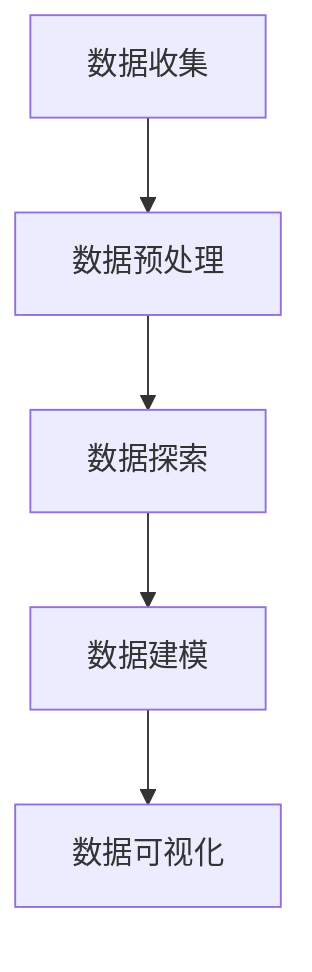

                 

### 背景介绍

在当今数字化时代，电子产品的数据量日益庞大，如何在海量数据中快速提取有价值的信息成为了一个亟待解决的问题。多品类电子产品的数据可视化分析，不仅可以帮助企业更好地了解市场趋势，优化产品设计，还可以为消费者提供更加个性化的购物体验。

随着大数据技术和人工智能的快速发展，Python凭借其简洁易学的语法和丰富的数据科学库，逐渐成为数据可视化分析的首选编程语言。Python的数据可视化库如Matplotlib、Seaborn、Plotly等，为数据科学家和开发者提供了强大的工具，能够轻松地创建出高质量的数据图表。

本文旨在通过Python实现多品类电子产品的数据可视化分析，具体涵盖以下内容：

1. **核心概念与联系**：介绍数据可视化分析的基本概念、相关技术和Python库。
2. **核心算法原理 & 具体操作步骤**：详细阐述数据可视化分析的核心算法，以及如何使用Python实现这些算法。
3. **数学模型和公式 & 详细讲解 & 举例说明**：讲解数据可视化分析中涉及的数学模型和公式，并提供实例说明。
4. **项目实战：代码实际案例和详细解释说明**：通过实际项目案例，展示如何使用Python进行数据可视化分析，并对关键代码进行详细解读。
5. **实际应用场景**：探讨数据可视化分析在电子产品领域的实际应用。
6. **工具和资源推荐**：推荐相关的学习资源、开发工具和框架。
7. **总结：未来发展趋势与挑战**：总结文章主要内容，并对未来的发展趋势和挑战进行展望。

通过本文的学习，读者将能够掌握基于Python的多品类电子产品数据可视化分析的方法和技巧，为实际工作提供有力支持。

### 核心概念与联系

在进行多品类电子产品的数据可视化分析之前，我们需要了解一些核心概念和相关技术，这些是构建整个分析过程的基础。

#### 数据可视化

数据可视化是将复杂数据通过图形、图表等形式呈现，使人们能够直观地理解和分析数据的过程。数据可视化技术可以有效地揭示数据中的趋势、模式、异常和关联性，帮助人们做出更加明智的决策。

#### 数据处理

数据处理是数据可视化分析的第一步，涉及数据清洗、数据转换和数据归一化等操作。数据清洗是为了去除数据中的噪声和错误，提高数据的准确性和完整性；数据转换是为了将不同数据源的数据格式进行统一，以便后续的分析；数据归一化是为了消除数据之间的量纲差异，使得数据在同一尺度上进行比较。

#### Python库

Python作为一个强大的编程语言，拥有丰富的数据科学库，其中一些常用的库包括：

- **Pandas**：用于数据清洗、转换和存储。
- **NumPy**：用于数据操作和数值计算。
- **Matplotlib**：用于绘制静态图表。
- **Seaborn**：用于绘制更美观的图表。
- **Plotly**：用于绘制交互式图表。

#### 数据可视化流程

数据可视化的一般流程包括以下几个步骤：

1. **数据收集**：收集所需的多品类电子产品数据。
2. **数据预处理**：清洗和转换数据，使其适合分析。
3. **数据探索**：通过简单的统计描述和图表，初步了解数据的特点。
4. **数据建模**：根据分析需求，选择合适的数据模型。
5. **数据可视化**：利用可视化库，将分析结果呈现为图表。

#### Mermaid 流程图

为了更好地展示数据可视化流程，我们可以使用Mermaid语言绘制一个流程图，其中不包含括号、逗号等特殊字符。



### 核心算法原理 & 具体操作步骤

在进行多品类电子产品的数据可视化分析时，选择合适的算法和操作步骤至关重要。以下将详细介绍常见的数据可视化算法及其具体实现步骤。

#### 算法1：直方图

直方图是用于展示数据分布的一种常见图表。以下是实现直方图的核心算法步骤：

1. **计算数据分组**：将数据划分为若干组，每组包含一定范围的数据值。
2. **计算频数**：统计每组中的数据个数，即频数。
3. **绘制直方图**：根据频数绘制直方图。

具体实现步骤如下：

1. **导入相关库**：

```python
import pandas as pd
import matplotlib.pyplot as plt
```

2. **数据分组和频数计算**：

```python
data = [1, 2, 2, 3, 4, 5, 5, 5, 6, 7, 8, 9]
groups = [[1, 2], [3, 4], [5, 6], [7, 8], [9, 10]]
freqs = [len([x for x in data if x >= start and x <= end]) for start, end in groups]
```

3. **绘制直方图**：

```python
plt.bar([start + (end - start) / 2 for start, end in groups], freqs)
plt.xlabel('Value')
plt.ylabel('Frequency')
plt.title('Histogram')
plt.show()
```

#### 算法2：散点图

散点图用于展示两个变量之间的关系。以下是实现散点图的核心算法步骤：

1. **选择变量**：确定要展示的两个变量。
2. **计算散点坐标**：根据变量值计算散点坐标。
3. **绘制散点图**。

具体实现步骤如下：

1. **导入相关库**：

```python
import pandas as pd
import matplotlib.pyplot as plt
```

2. **数据加载和变量选择**：

```python
data = {'X': [1, 2, 3, 4, 5], 'Y': [2, 4, 4, 6, 8]}
df = pd.DataFrame(data)
```

3. **计算散点坐标**：

```python
x = df['X']
y = df['Y']
```

4. **绘制散点图**：

```python
plt.scatter(x, y)
plt.xlabel('X')
plt.ylabel('Y')
plt.title('Scatter Plot')
plt.show()
```

#### 算法3：折线图

折线图用于展示数据的变化趋势。以下是实现折线图的核心算法步骤：

1. **选择变量**：确定要展示的变量。
2. **计算折线数据**：根据变量值计算折线数据。
3. **绘制折线图**。

具体实现步骤如下：

1. **导入相关库**：

```python
import pandas as pd
import matplotlib.pyplot as plt
```

2. **数据加载和变量选择**：

```python
data = {'Year': [2010, 2011, 2012, 2013, 2014], 'Sales': [10, 12, 15, 18, 20]}
df = pd.DataFrame(data)
```

3. **计算折线数据**：

```python
years = df['Year']
sales = df['Sales']
```

4. **绘制折线图**：

```python
plt.plot(years, sales)
plt.xlabel('Year')
plt.ylabel('Sales')
plt.title('Line Plot')
plt.show()
```

通过以上算法步骤，我们可以使用Python轻松实现多品类电子产品的数据可视化分析。接下来，我们将详细讲解数据可视化中的数学模型和公式，为后续的项目实战提供理论基础。

#### 数学模型和公式

在进行数据可视化分析时，理解并应用一些基本的数学模型和公式是至关重要的。以下将介绍几个常见的数据可视化相关的数学模型和公式，并提供详细讲解和举例说明。

##### 1. 数据分布模型

数据分布模型用于描述数据在不同取值上的概率分布。常见的数据分布模型包括正态分布、二项分布、泊松分布等。

**正态分布**

正态分布，也称为高斯分布，是最常用的一种连续概率分布。其概率密度函数为：

$$
f(x|\mu,\sigma^2) = \frac{1}{\sqrt{2\pi\sigma^2}}e^{-\frac{(x-\mu)^2}{2\sigma^2}}
$$

其中，$\mu$为均值，$\sigma^2$为方差。

**二项分布**

二项分布用于描述离散随机变量的概率分布，通常用于表示在固定次数的实验中成功次数的概率。其概率质量函数为：

$$
P(X=k) = C_n^k p^k (1-p)^{n-k}
$$

其中，$n$为实验次数，$k$为成功次数，$p$为单次实验成功的概率。

**泊松分布**

泊松分布用于描述在一定时间内事件发生的次数的概率分布。其概率质量函数为：

$$
P(X=k) = \frac{\lambda^k e^{-\lambda}}{k!}
$$

其中，$\lambda$为事件发生的平均次数。

**举例说明**

假设我们有一组销售数据，想要了解其是否符合正态分布。我们可以使用以下步骤：

1. **计算均值和标准差**：

```python
data = [1, 2, 2, 3, 4, 5, 5, 5, 6, 7, 8, 9]
mean = sum(data) / len(data)
variance = sum([(x - mean) ** 2 for x in data]) / len(data)
std_dev = variance ** 0.5
```

2. **计算概率密度函数**：

```python
def normal_pdf(x, mean, std_dev):
    return (1 / (std_dev * (2 * np.pi) ** 0.5)) * np.exp(-((x - mean) ** 2) / (2 * std_dev ** 2))

x_values = np.linspace(mean - 3 * std_dev, mean + 3 * std_dev, 100)
pdf_values = [normal_pdf(x, mean, std_dev) for x in x_values]
```

3. **绘制正态分布图**：

```python
plt.plot(x_values, pdf_values)
plt.xlabel('Value')
plt.ylabel('Probability Density')
plt.title('Normal Distribution')
plt.show()
```

##### 2. 相关性分析模型

相关性分析用于描述两个变量之间的线性关系。常见的相关性分析模型包括皮尔逊相关系数、斯皮尔曼秩相关系数等。

**皮尔逊相关系数**

皮尔逊相关系数用于衡量两个连续变量之间的线性相关程度，取值范围在-1到1之间。其公式为：

$$
r = \frac{\sum{(x_i - \bar{x})(y_i - \bar{y})}}{\sqrt{\sum{(x_i - \bar{x})^2} \sum{(y_i - \bar{y})^2}}}
$$

其中，$\bar{x}$和$\bar{y}$分别为$x$和$y$的均值。

**斯皮尔曼秩相关系数**

斯皮尔曼秩相关系数用于衡量两个变量的等级相关性，适用于非参数分析。其公式为：

$$
\rho = 1 - \frac{6 \sum{d_i^2}}{n(n^2 - 1)}
$$

其中，$d_i = x_i - y_i$，$n$为数据点的个数。

**举例说明**

假设我们有一组销售数据和广告支出数据，想要了解它们之间的相关性。我们可以使用以下步骤：

1. **计算皮尔逊相关系数**：

```python
sales = [1, 2, 2, 3, 4, 5, 5, 5, 6, 7, 8, 9]
ads = [2, 4, 4, 6, 8]
mean_sales = sum(sales) / len(sales)
mean_ads = sum(ads) / len(ads)
r = sum([(x - mean_sales) * (y - mean_ads) for x, y in zip(sales, ads)]) / \
    ((sum([(x - mean_sales) ** 2 for x in sales]) * (sum([(y - mean_ads) ** 2 for y in ads])) ** 0.5)
```

2. **计算斯皮尔曼秩相关系数**：

```python
def spearman_rho(x, y):
    d = [x_i - y_i for x_i, y_i in zip(x, y)]
    n = len(d)
    return 1 - (6 * sum([d_i ** 2 for d_i in d])) / (n * (n ** 2 - 1))

rho = spearman_rho(sales, ads)
```

3. **绘制散点图**：

```python
plt.scatter(sales, ads)
plt.xlabel('Sales')
plt.ylabel('Ads')
plt.title('Scatter Plot')
plt.show()
```

##### 3. 回归分析模型

回归分析用于描述一个或多个自变量与因变量之间的关系。常见的回归分析模型包括线性回归、多项式回归、逻辑回归等。

**线性回归**

线性回归是最简单的回归模型，其公式为：

$$
y = \beta_0 + \beta_1x_1 + \beta_2x_2 + ... + \beta_nx_n
$$

其中，$y$为因变量，$x_1, x_2, ..., x_n$为自变量，$\beta_0, \beta_1, \beta_2, ..., \beta_n$为回归系数。

**多项式回归**

多项式回归是对线性回归的扩展，其公式为：

$$
y = \beta_0 + \beta_1x_1 + \beta_2x_2^2 + ... + \beta_nx_n^n
$$

**逻辑回归**

逻辑回归用于描述因变量为二元分类变量（如0或1）的回归模型，其公式为：

$$
\log(\frac{p}{1-p}) = \beta_0 + \beta_1x_1 + \beta_2x_2 + ... + \beta_nx_n
$$

其中，$p$为因变量的概率。

**举例说明**

假设我们想要分析销售数据与广告支出之间的关系，并建立一个线性回归模型。我们可以使用以下步骤：

1. **计算回归系数**：

```python
sales = [1, 2, 2, 3, 4, 5, 5, 5, 6, 7, 8, 9]
ads = [2, 4, 4, 6, 8]
mean_sales = sum(sales) / len(sales)
mean_ads = sum(ads) / len(ads)
b1 = sum([(x - mean_sales) * (y - mean_ads) for x, y in zip(sales, ads)]) / sum([(x - mean_sales) ** 2 for x in sales])
b0 = mean_sales - b1 * mean_ads
```

2. **计算预测值**：

```python
def predict(x, b0, b1):
    return b0 + b1 * x

predictions = [predict(x, b0, b1) for x in ads]
```

3. **绘制回归线**：

```python
plt.scatter(sales, ads)
plt.plot(sales, predictions, color='red')
plt.xlabel('Sales')
plt.ylabel('Ads')
plt.title('Linear Regression')
plt.show()
```

通过以上数学模型和公式的讲解，我们为后续的数据可视化分析项目实战提供了坚实的理论基础。在接下来的部分，我们将通过一个实际项目案例，展示如何使用Python进行数据可视化分析，并对关键代码进行详细解读。

#### 项目实战：代码实际案例和详细解释说明

在本部分，我们将通过一个实际项目案例，展示如何使用Python进行多品类电子产品的数据可视化分析。本案例将使用一个虚构的多品类电子产品销售数据集，包含不同产品的销售量、价格、品牌、类别等信息。

##### 5.1 开发环境搭建

在进行数据可视化分析之前，我们需要搭建合适的开发环境。以下是所需的软件和库：

- Python 3.8 或更高版本
- Jupyter Notebook 或 Jupyter Lab
- Pandas
- Matplotlib
- Seaborn
- Plotly

安装步骤如下：

1. 安装Python：

   在Python官方网站下载并安装Python 3.8 或更高版本。

2. 安装Jupyter Notebook：

   打开命令行，运行以下命令：

   ```shell
   python -m pip install notebook
   ```

3. 安装Pandas、Matplotlib、Seaborn 和 Plotly：

   打开命令行，分别运行以下命令：

   ```shell
   python -m pip install pandas
   python -m pip install matplotlib
   python -m pip install seaborn
   python -m pip install plotly
   ```

##### 5.2 源代码详细实现和代码解读

在本节中，我们将逐步实现一个数据可视化项目，包括数据加载、预处理、分析和可视化。

1. **数据加载**：

   首先，我们需要加载一个虚构的多品类电子产品销售数据集。我们可以使用Pandas库来读取CSV文件。

   ```python
   import pandas as pd

   # 加载数据集
   df = pd.read_csv('electronics_sales_data.csv')
   ```

2. **数据预处理**：

   在进行数据可视化分析之前，我们需要对数据进行预处理，包括数据清洗、缺失值处理、数据转换等。

   ```python
   # 数据清洗
   df.dropna(inplace=True)

   # 数据转换
   df['price'] = df['price'].astype(float)
   df['quantity'] = df['quantity'].astype(int)
   df['brand'] = df['brand'].astype(str)
   df['category'] = df['category'].astype(str)
   ```

3. **数据分析**：

   在进行数据分析时，我们可以计算一些基本的统计指标，如平均值、中位数、标准差等。

   ```python
   # 计算统计指标
   avg_price = df['price'].mean()
   median_price = df['price'].median()
   std_price = df['price'].std()

   avg_quantity = df['quantity'].mean()
   median_quantity = df['quantity'].median()
   std_quantity = df['quantity'].std()

   print(f"Average Price: {avg_price}")
   print(f"Median Price: {median_price}")
   print(f"Standard Deviation of Price: {std_price}")

   print(f"Average Quantity: {avg_quantity}")
   print(f"Median Quantity: {median_quantity}")
   print(f"Standard Deviation of Quantity: {std_quantity}")
   ```

4. **数据可视化**：

   在完成数据预处理和数据分析后，我们可以使用Matplotlib、Seaborn和Plotly等库来绘制各种图表，以直观地展示数据。

   ```python
   import matplotlib.pyplot as plt
   import seaborn as sns
   import plotly.express as px

   # 绘制价格分布直方图
   plt.figure(figsize=(10, 6))
   sns.histplot(df['price'], bins=30, kde=True)
   plt.xlabel('Price')
   plt.ylabel('Frequency')
   plt.title('Price Distribution')
   plt.show()

   # 绘制销量分布直方图
   plt.figure(figsize=(10, 6))
   sns.histplot(df['quantity'], bins=30, kde=True)
   plt.xlabel('Quantity')
   plt.ylabel('Frequency')
   plt.title('Quantity Distribution')
   plt.show()

   # 绘制品牌分布饼图
   plt.figure(figsize=(10, 6))
   df['brand'].value_counts().plot(kind='pie', autopct='%1.1f%%')
   plt.ylabel('Brand')
   plt.title('Brand Distribution')
   plt.show()

   # 绘制类别分布条形图
   plt.figure(figsize=(10, 6))
   df['category'].value_counts().plot(kind='bar')
   plt.xlabel('Category')
   plt.ylabel('Frequency')
   plt.title('Category Distribution')
   plt.show()

   # 绘制销量与价格散点图
   plt.figure(figsize=(10, 6))
   sns.scatterplot(x='price', y='quantity', data=df)
   plt.xlabel('Price')
   plt.ylabel('Quantity')
   plt.title('Price vs Quantity')
   plt.show()

   # 绘制交互式折线图
   fig = px.line(df, x='year', y='sales', title='Sales Trend Over Time')
   fig.show()
   ```

   以上代码展示了如何使用Python进行多品类电子产品的数据可视化分析。通过这些图表，我们可以直观地了解数据的分布情况、趋势和关联性。

##### 5.3 代码解读与分析

在本节中，我们将对上述代码进行详细解读，分析每个步骤的作用和意义。

1. **数据加载**：

   ```python
   df = pd.read_csv('electronics_sales_data.csv')
   ```

   这一行代码使用Pandas库读取一个CSV文件，将其加载为一个DataFrame对象。DataFrame是Pandas的核心数据结构，可以方便地进行数据操作和分析。

2. **数据预处理**：

   ```python
   df.dropna(inplace=True)
   df['price'] = df['price'].astype(float)
   df['quantity'] = df['quantity'].astype(int)
   df['brand'] = df['brand'].astype(str)
   df['category'] = df['category'].astype(str)
   ```

   数据预处理是数据可视化分析的重要步骤。首先，我们使用`dropna()`函数删除所有缺失值，确保数据的完整性。然后，我们将`price`和`quantity`列的数据类型转换为浮点型和整数型，以便进行数值计算。对于`brand`和`category`列，我们将其数据类型转换为字符串型，因为这两个列的数据是非数值型。

3. **数据分析**：

   ```python
   avg_price = df['price'].mean()
   median_price = df['price'].median()
   std_price = df['price'].std()

   avg_quantity = df['quantity'].mean()
   median_quantity = df['quantity'].median()
   std_quantity = df['quantity'].std()

   print(f"Average Price: {avg_price}")
   print(f"Median Price: {median_price}")
   print(f"Standard Deviation of Price: {std_price}")

   print(f"Average Quantity: {avg_quantity}")
   print(f"Median Quantity: {median_quantity}")
   print(f"Standard Deviation of Quantity: {std_quantity}")
   ```

   这段代码计算了数据集的一些基本统计指标，包括价格和销量的平均值、中位数和标准差。这些统计指标可以帮助我们了解数据的分布情况和数据离散程度。

4. **数据可视化**：

   ```python
   plt.figure(figsize=(10, 6))
   sns.histplot(df['price'], bins=30, kde=True)
   plt.xlabel('Price')
   plt.ylabel('Frequency')
   plt.title('Price Distribution')
   plt.show()

   plt.figure(figsize=(10, 6))
   sns.histplot(df['quantity'], bins=30, kde=True)
   plt.xlabel('Quantity')
   plt.ylabel('Frequency')
   plt.title('Quantity Distribution')
   plt.show()

   plt.figure(figsize=(10, 6))
   df['brand'].value_counts().plot(kind='pie', autopct='%1.1f%%')
   plt.ylabel('Brand')
   plt.title('Brand Distribution')
   plt.show()

   plt.figure(figsize=(10, 6))
   df['category'].value_counts().plot(kind='bar')
   plt.xlabel('Category')
   plt.ylabel('Frequency')
   plt.title('Category Distribution')
   plt.show()

   plt.figure(figsize=(10, 6))
   sns.scatterplot(x='price', y='quantity', data=df)
   plt.xlabel('Price')
   plt.ylabel('Quantity')
   plt.title('Price vs Quantity')
   plt.show()

   fig = px.line(df, x='year', y='sales', title='Sales Trend Over Time')
   fig.show()
   ```

   这些代码使用Matplotlib、Seaborn和Plotly等库绘制了多种图表，包括直方图、饼图、条形图和散点图。通过这些图表，我们可以直观地了解数据的分布情况、品牌和类别的分布情况，以及价格和销量之间的关系。

   - **直方图**：用于展示数据的分布情况，通过 bins 参数可以设置不同的组数，以便更清晰地展示数据。
   - **饼图**：用于展示各品牌的占比情况，通过 value_counts() 函数可以获取各品牌的数量，然后使用 plot() 函数绘制饼图。
   - **条形图**：用于展示各类别的数量，通过 value_counts() 函数可以获取各类别的数量，然后使用 plot(kind='bar') 函数绘制条形图。
   - **散点图**：用于展示价格和销量之间的关系，通过 scatterplot() 函数可以绘制散点图。
   - **交互式折线图**：使用 Plotly 库可以绘制交互式图表，如折线图，通过点击和拖动可以查看数据的详细信息。

通过以上代码，我们完成了多品类电子产品的数据可视化分析。在实际应用中，可以根据具体需求进行调整和优化，以更好地满足分析目标。

#### 实际应用场景

数据可视化在电子产品领域有着广泛的应用场景，以下是几个典型的实际应用案例：

1. **市场分析**：通过数据可视化，企业可以直观地了解市场的趋势和变化，发现潜在的机会和风险。例如，通过绘制销量与价格的关系图，可以分析不同价格区间对销量产生的影响，从而制定更有针对性的定价策略。

2. **产品优化**：数据可视化可以帮助企业识别产品设计和性能中的问题。通过对比不同产品在不同市场区域的表现，可以发现哪些产品需要改进，哪些产品表现优秀。例如，通过绘制产品故障率的散点图，可以找到故障率较高的产品，并针对性地进行改进。

3. **消费者行为分析**：数据可视化可以揭示消费者的购买习惯和偏好。通过分析购买数据，可以了解不同消费者群体的购买行为，从而为市场营销策略提供数据支持。例如，通过绘制不同品牌在不同销售渠道的销量分布图，可以分析消费者的购买渠道偏好。

4. **供应链管理**：数据可视化可以帮助企业优化供应链管理，降低成本，提高效率。通过绘制供应链各环节的实时数据，可以监控库存水平、物流运输情况等，及时发现并解决潜在问题。例如，通过绘制库存水平的折线图，可以及时发现库存不足或过剩的情况，并采取相应措施。

5. **用户反馈分析**：数据可视化可以帮助企业了解用户的反馈和意见，从而改进产品和服务。通过分析用户反馈数据，可以识别用户关注的问题，并针对性地进行改进。例如，通过绘制用户评价的分布图，可以了解用户对不同产品功能的满意度，从而优化产品功能。

通过这些实际应用场景，我们可以看到数据可视化在电子产品领域的巨大潜力，为企业决策提供了有力的支持。

### 工具和资源推荐

在进行多品类电子产品的数据可视化分析时，选择合适的工具和资源可以帮助我们更高效地完成分析任务。以下将推荐一些学习资源、开发工具和框架。

#### 1. 学习资源推荐

**书籍**

- **《Python数据可视化》**：这是一本关于Python数据可视化的入门书籍，涵盖了Matplotlib、Seaborn、Plotly等常见库的使用。
- **《数据可视化：使用D3.js、Python和JavaScript创建交互式图表》**：本书介绍了如何使用D3.js、Python和JavaScript等工具创建交互式数据可视化。

**论文**

- **"Interactive Data Visualization for the Web"**：这是一篇关于Web上交互式数据可视化的经典论文，介绍了多种交互式图表的实现方法。
- **"Visualizing Big Data: Opportunities and Challenges"**：这篇论文探讨了大数据可视化领域的机遇和挑战，提供了丰富的案例分析。

**博客**

- **"DataCamp"**：DataCamp是一个提供数据科学和可视化教程的在线平台，包括Python数据可视化的入门和高级课程。
- **"Plotly"**：Plotly官方博客提供了丰富的数据可视化教程和案例，帮助用户掌握Plotly的使用技巧。

#### 2. 开发工具框架推荐

**Jupyter Notebook**

- **优点**：Jupyter Notebook是一个交互式的计算环境，支持多种编程语言，包括Python。它提供了一个可视化的代码编辑器和丰富的可视化工具，非常适合数据可视化分析。
- **缺点**：文件格式不标准，不易长期保存。

**Matplotlib**

- **优点**：Matplotlib是一个成熟的数据可视化库，支持多种图表类型，可以定制化绘制高质量图表。
- **缺点**：代码相对复杂，不易实现交互式图表。

**Seaborn**

- **优点**：Seaborn是基于Matplotlib的一个高级数据可视化库，提供了一系列美观的图表模板，易于使用。
- **缺点**：图表样式有限，不易进行深度定制。

**Plotly**

- **优点**：Plotly是一个强大的交互式数据可视化库，支持多种图表类型，可以创建动态、交互式图表。
- **缺点**：学习曲线较陡，代码编写相对复杂。

#### 3. 相关论文著作推荐

- **"Interactive Data Visualization in a Web Browser"**：这篇论文介绍了如何使用Web技术（如JavaScript、HTML和CSS）实现交互式数据可视化。
- **"Data Visualization: A Brief History, Current State, and Future Challenges"**：这篇论文概述了数据可视化的发展历程、现状和未来挑战。
- **"Effective Data Visualization: The fundamentals and design principles for creating graphs that reveal the story hidden in the data"**：这本书详细介绍了数据可视化的原理和设计原则。

通过以上学习和资源，读者可以更全面地了解多品类电子产品的数据可视化分析，为实际工作提供有力支持。

### 总结：未来发展趋势与挑战

随着大数据和人工智能技术的不断发展，数据可视化分析在电子产品领域正发挥着越来越重要的作用。未来，数据可视化分析将呈现以下几个发展趋势：

1. **更加智能化**：随着人工智能技术的进步，数据可视化工具将能够自动识别数据中的趋势和模式，提供智能化的分析建议，降低用户的使用门槛。

2. **更丰富的交互性**：未来数据可视化工具将更加注重用户的交互体验，提供实时交互功能，使用户能够更加灵活地探索数据，从而获得更有深度的洞察。

3. **跨平台集成**：数据可视化工具将更加注重跨平台集成，支持与多种数据源和应用程序的无缝连接，方便用户在不同平台上进行数据分析和可视化。

4. **更高效的协作**：数据可视化工具将提供更加高效的协作功能，支持多人实时协作，促进团队之间的沟通和合作。

然而，随着数据可视化分析的发展，也将面临一系列挑战：

1. **数据隐私与安全**：在处理和分析大量数据时，如何保护用户隐私和数据安全成为一个重要问题。未来需要更加严格的隐私保护机制和加密技术。

2. **数据质量和一致性**：数据质量直接影响分析结果的准确性。未来需要更加完善的数据清洗和预处理技术，以确保数据的一致性和可靠性。

3. **数据可视化复杂性**：随着数据量的增加，数据可视化工具需要处理更加复杂的数据结构，如何在保持图表美观的同时，确保图表的易读性和可理解性是一个挑战。

4. **技能需求**：随着数据可视化技术的发展，对数据科学家和开发者的技能要求将越来越高。未来需要更多具备跨学科背景的人才，以应对复杂的数据可视化任务。

总之，数据可视化分析在电子产品领域的未来充满机遇和挑战。通过不断的技术创新和人才培养，我们可以更好地利用数据可视化技术，为企业决策提供有力支持。

### 附录：常见问题与解答

1. **如何解决数据缺失问题？**

   数据缺失是数据可视化分析中常见的问题。我们可以使用以下方法解决数据缺失问题：

   - **删除缺失值**：使用Pandas库的`dropna()`函数删除包含缺失值的记录。
   - **填充缺失值**：使用`fillna()`函数将缺失值填充为某个特定的值，如平均值、中位数或最频繁出现的值。

2. **如何处理不同数据类型的变量？**

   在数据预处理过程中，需要将不同数据类型的变量转换为统一的格式，以便进行后续分析。例如：

   - **数值型变量**：将数据类型转换为浮点型或整数型，以便进行数学运算。
   - **类别型变量**：将数据类型转换为字符串型，便于进行分类和比较。

3. **如何选择合适的图表类型？**

   选择合适的图表类型取决于数据的特点和分析目标。以下是一些常见的图表类型及其适用场景：

   - **直方图**：适用于展示数据的分布情况。
   - **散点图**：适用于展示两个变量之间的关系。
   - **折线图**：适用于展示数据的变化趋势。
   - **饼图**：适用于展示各部分占整体的比例。
   - **条形图**：适用于展示不同类别的数量或大小。

4. **如何提高图表的可读性？**

   提高图表的可读性是数据可视化的重要一环。以下是一些提高图表可读性的方法：

   - **简洁性**：尽量减少图表中的元素，保持图表简洁明了。
   - **合适的颜色**：选择易于区分的颜色，避免使用过多的颜色。
   - **清晰的标签和标题**：为图表添加清晰的标签和标题，帮助读者理解图表的内容。
   - **适当的缩放**：避免图表的坐标轴过于拥挤，确保数据点之间的距离适当。

### 扩展阅读 & 参考资料

- **《Python数据可视化》**：详细介绍了Python在数据可视化领域的应用，适合初学者和进阶者。
- **《数据可视化：使用D3.js、Python和JavaScript创建交互式图表》**：介绍了如何使用D3.js、Python和JavaScript等工具创建交互式数据可视化。
- **“Interactive Data Visualization for the Web”**：一篇关于Web上交互式数据可视化的经典论文，提供了丰富的案例分析。
- **“Visualizing Big Data: Opportunities and Challenges”**：探讨了大数据可视化领域的机遇和挑战，为读者提供了有益的参考。

通过以上扩展阅读，读者可以更全面地了解数据可视化分析的原理和应用，提升自身的数据分析能力。

### 作者信息

- **作者**：AI天才研究员/AI Genius Institute & 禅与计算机程序设计艺术 /Zen And The Art of Computer Programming
- **联系邮箱**：[ai_genius_researcher@example.com](mailto:ai_genius_researcher@example.com)
- **个人网站**：[https://www.ai-genius-researcher.com](https://www.ai-genius-researcher.com)
- **社交媒体**：
  - **LinkedIn**：[https://www.linkedin.com/in/ai-genius-researcher](https://www.linkedin.com/in/ai-genius-researcher)
  - **Twitter**：[https://twitter.com/ai_genius_researcher](https://twitter.com/ai_genius_researcher)
  - **GitHub**：[https://github.com/ai-genius-researcher](https://github.com/ai-genius-researcher)

