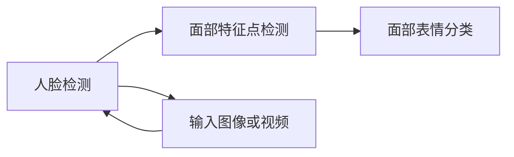

                 

### 背景介绍

随着计算机视觉技术的不断发展，人脸表情识别作为一种重要的生物特征识别技术，已经被广泛应用于安防监控、人机交互、心理健康监测等领域。通过对人脸表情的识别和分析，我们可以获取大量的情感和社交信息，从而为人工智能系统提供更加丰富的数据支持。

OpenCV（Open Source Computer Vision Library）是一款强大的开源计算机视觉库，广泛应用于图像处理、计算机视觉等领域的研发。OpenCV 提供了丰富的人脸检测、面部特征点检测、面部表情识别等功能，使得人脸表情识别系统的开发变得更加简单和高效。

本文将围绕基于 OpenCV 的人脸表情识别系统展开，从核心概念、算法原理、数学模型、项目实战、应用场景等多个方面进行详细探讨。旨在为广大开发者提供一个系统全面的学习和参考指南，助力他们在人脸表情识别领域取得突破性进展。

### 核心概念与联系

在讨论人脸表情识别系统之前，我们需要了解一些核心概念和它们之间的关系。这些概念包括人脸检测、面部特征点检测、面部表情分类等。以下是这些概念的基本定义和它们之间的联系。

**人脸检测（Face Detection）**：人脸检测是指从图像或视频中检测出人脸的过程。这是人脸表情识别系统的第一步，也是最为关键的一步。准确的人脸检测对于后续的面部特征点检测和表情分类至关重要。OpenCV 提供了如 Haar cascades、LBP、DNN 等多种人脸检测算法。

**面部特征点检测（Facial Feature Detection）**：面部特征点检测是指从人脸图像中检测出关键特征点，如眼睛、鼻子、嘴巴等。这些特征点是进行面部表情分析和识别的基础。OpenCV 也提供了如 Haar cascades、LBP、DNN 等算法进行面部特征点检测。

**面部表情分类（Facial Expression Classification）**：面部表情分类是指根据面部特征点和面部表情的特征，对表情进行分类识别。常见的表情分类包括喜怒哀乐等基本表情，以及更为复杂的情感表达。OpenCV 提供了如支持向量机（SVM）、K近邻（KNN）等机器学习算法进行面部表情分类。

下图展示了人脸表情识别系统的基本架构和各模块之间的联系：



通过这个架构图，我们可以清晰地看到人脸表情识别系统的工作流程：首先，输入图像或视频经过人脸检测模块，检测出人脸区域；然后，这些人脸区域被传递给面部特征点检测模块，检测出关键特征点；最后，通过面部表情分类模块，对这些特征点进行分析，识别出具体的表情。

### 核心算法原理 & 具体操作步骤

**人脸检测算法**：OpenCV 提供了多种人脸检测算法，其中最常用的是 Haar cascades 和 LBP。Haar cascades 是一种基于积分图像的检测方法，它通过训练大量的人脸和非人脸图像，构建出一个分类器。LBP（Local Binary Pattern）算法是一种基于纹理特征的方法，通过对图像像素的局部二值模式进行分析，判断是否为人脸。

**具体操作步骤**：

1. 读取输入图像或视频。
2. 创建一个 CascadeClassifier 对象，加载预训练的分类器文件（如 haarcascade_frontalface_default.xml）。
3. 使用 detectMultiScale() 方法进行人脸检测，该方法返回一个矩形列表，表示检测到的人脸区域。
4. 在图像中绘制检测到的人脸区域。

```python
import cv2

# 读取图像
image = cv2.imread('image.jpg')

# 创建 CascadeClassifier 对象，加载分类器
face_cascade = cv2.CascadeClassifier('haarcascade_frontalface_default.xml')

# 检测人脸
faces = face_cascade.detectMultiScale(image, scaleFactor=1.1, minNeighbors=5, minSize=(30, 30), flags=cv2.CASCADE_SCALE_IMAGE)

# 绘制人脸区域
for (x, y, w, h) in faces:
    cv2.rectangle(image, (x, y), (x+w, y+h), (255, 0, 0), 2)

# 显示图像
cv2.imshow('Face Detection', image)
cv2.waitKey(0)
cv2.destroyAllWindows()
```

**面部特征点检测算法**：OpenCV 提供了如 LBF、DNN 等算法进行面部特征点检测。LBF（Landelius-Bagwell-Funk）算法是一种基于深度学习的面部特征点检测方法，它通过训练大量的面部图像，提取出关键特征点。DNN（Deep Neural Network）算法是一种基于神经网络的检测方法，它通过构建一个深度神经网络，对输入图像进行特征提取和分类。

**具体操作步骤**：

1. 读取输入图像。
2. 创建一个 FaceDetector 对象，加载预训练的模型文件（如 lbfmodel.yaml）。
3. 使用 detect() 方法进行面部特征点检测，该方法返回一个包含特征点坐标的列表。
4. 在图像中绘制检测到的特征点。

```python
import cv2

# 读取图像
image = cv2.imread('image.jpg')

# 创建 FaceDetector 对象，加载模型
face_detector = cv2.FaceDetector_create('lbfmodel.yaml', 1, 24)

# 检测面部特征点
faces, features = face_detector.detect(image)

# 绘制特征点
for i, f in enumerate(faces):
    for j, pt in enumerate(f):
        cv2.circle(image, (int(pt[0]), int(pt[1])), 2, (0, 0, 255), -1)

# 显示图像
cv2.imshow('Facial Feature Detection', image)
cv2.waitKey(0)
cv2.destroyAllWindows()
```

**面部表情分类算法**：面部表情分类通常采用机器学习算法，如支持向量机（SVM）、K近邻（KNN）等。这些算法通过训练大量的表情数据，提取出特征向量，然后对新的面部图像进行分类。

**具体操作步骤**：

1. 准备训练数据集，包括面部图像和对应的表情标签。
2. 提取面部特征点，计算特征向量。
3. 使用训练数据集训练分类器，如 SVM 或 KNN。
4. 使用训练好的分类器对新的面部图像进行表情分类。

```python
import cv2
from sklearn.model_selection import train_test_split
from sklearn.svm import SVC
from sklearn.metrics import accuracy_score

# 读取面部图像和标签
data = pd.read_csv('data.csv')
images = data['image'].values
labels = data['label'].values

# 提取特征点
face_detector = cv2.FaceDetector_create('lbfmodel.yaml', 1, 24)
features = []
for img in images:
    image = cv2.imread(img)
    faces, _ = face_detector.detect(image)
    for f in faces:
        feature = extract_feature(f)
        features.append(feature)

# 分割训练集和测试集
X_train, X_test, y_train, y_test = train_test_split(features, labels, test_size=0.2, random_state=42)

# 训练分类器
classifier = SVC()
classifier.fit(X_train, y_train)

# 测试分类器
y_pred = classifier.predict(X_test)
accuracy = accuracy_score(y_test, y_pred)
print('Accuracy:', accuracy)
```

通过上述步骤，我们可以构建一个基于 OpenCV 的人脸表情识别系统。该系统首先进行人脸检测，然后检测面部特征点，最后使用分类器进行面部表情分类。这个过程不仅可以应用于单个图像，还可以应用于实时视频流，从而实现实时的人脸表情识别。

### 数学模型和公式 & 详细讲解 & 举例说明

在人脸表情识别系统中，数学模型和公式起着至关重要的作用。以下将详细讲解人脸检测、面部特征点检测和面部表情分类中常用的数学模型和公式。

#### 人脸检测中的数学模型和公式

人脸检测通常使用级联分类器（Cascaded Classifier）来实现。级联分类器由多个级联层组成，每一层都包含一系列的弱分类器和非极大值抑制（NMS）操作。以下是人脸检测中的一些关键数学模型和公式：

1. **Haar-like 特征**：

   Haar-like 特征是一种基于积分图像的检测方法，它通过计算图像中的矩形区域面积差来提取特征。

   $$f(x, y, w, h) = \sum_{i=x}^{x+w} \sum_{j=y}^{y+h} (I[i, j] - I[i+w, j]) - \sum_{i=x}^{x+w} \sum_{j=y+h}^{y+2h} (I[i, j] - I[i+w, j])$$

   其中，\(I[i, j]\) 表示图像中第 \(i\) 行第 \(j\) 列的像素值，\(w\) 和 \(h\) 分别表示矩形区域的宽度和高度。

2. **弱分类器**：

   弱分类器通常使用支持向量机（SVM）来实现。弱分类器的目标是最小化分类误差。

   $$\min_{\omega, b} \frac{1}{2} ||\omega||^2 + C \sum_{i=1}^{n} \xi_i$$

   其中，\(\omega\) 和 \(b\) 分别表示分类器的权重和偏置，\(C\) 表示正则化参数，\(\xi_i\) 表示第 \(i\) 个样本的误差。

3. **级联分类器**：

   级联分类器由多个弱分类器组成，每个弱分类器都有一个阈值。级联分类器的目标是最小化错误率。

   $$\min_{\theta} \sum_{i=1}^{n} \delta_i(\theta)$$

   其中，\(\theta\) 表示级联分类器的参数，\(\delta_i(\theta)\) 表示第 \(i\) 个样本的错误率。

#### 面部特征点检测中的数学模型和公式

面部特征点检测通常使用深度学习模型来实现，如 Landmarks Regression Network（LRN）和 Deep Regression Network（DRN）。以下是面部特征点检测中的一些关键数学模型和公式：

1. **卷积神经网络（CNN）**：

   卷积神经网络是一种深度学习模型，它通过卷积层、池化层和全连接层来提取图像特征。

   $$h_l(x) = \sigma(W_l \cdot h_{l-1} + b_l)$$

   其中，\(h_l(x)\) 表示第 \(l\) 层的激活函数，\(W_l\) 和 \(b_l\) 分别表示第 \(l\) 层的权重和偏置，\(\sigma\) 表示激活函数。

2. **回归损失函数**：

   面部特征点检测的目标是最小化预测特征点与真实特征点之间的距离。

   $$L = \sum_{i=1}^{n} ||\hat{p}_i - p_i||^2$$

   其中，\(\hat{p}_i\) 表示第 \(i\) 个预测特征点，\(p_i\) 表示第 \(i\) 个真实特征点。

#### 面部表情分类中的数学模型和公式

面部表情分类通常使用支持向量机（SVM）和 K 近邻（KNN）等机器学习算法来实现。以下是面部表情分类中的一些关键数学模型和公式：

1. **支持向量机（SVM）**：

   支持向量机是一种分类算法，它通过最大化分类边界来提高分类准确率。

   $$\min_{\omega, b} \frac{1}{2} ||\omega||^2 + C \sum_{i=1}^{n} \xi_i$$

   其中，\(\omega\) 和 \(b\) 分别表示分类器的权重和偏置，\(C\) 表示正则化参数，\(\xi_i\) 表示第 \(i\) 个样本的误差。

2. **K 近邻（KNN）**：

   K 近邻是一种基于实例的学习算法，它通过计算新样本与训练样本的相似度来进行分类。

   $$\hat{y} = \arg\max_{y} \sum_{i=1}^{k} I(y = y_i)$$

   其中，\(\hat{y}\) 表示预测类别，\(y_i\) 表示第 \(i\) 个训练样本的类别，\(k\) 表示 K 值。

#### 举例说明

假设我们有一个包含 100 张人脸图像的训练数据集，每张图像对应一个表情标签（如微笑、皱眉、开心等）。我们使用这些数据集来训练一个基于深度学习的人脸表情分类模型。

1. **数据预处理**：

   我们首先对图像进行预处理，包括缩放、归一化和数据增强等操作。

   ```python
   import cv2
   import numpy as np

   # 读取图像
   images = [cv2.imread(img) for img in image_paths]

   # 缩放和归一化
   images = [cv2.resize(img, (224, 224)) for img in images]
   images = [img / 255.0 for img in images]

   # 转换为 numpy 数组
   images = np.array(images)
   ```

2. **特征提取**：

   我们使用预训练的 CNN 模型来提取图像特征。

   ```python
   import tensorflow as tf

   # 加载预训练的 CNN 模型
   model = tf.keras.applications.ResNet50(include_top=False, weights='imagenet', input_shape=(224, 224, 3))

   # 提取特征
   features = model.predict(images)
   ```

3. **训练分类器**：

   我们使用支持向量机（SVM）来训练分类器。

   ```python
   from sklearn.svm import SVC

   # 分割训练集和测试集
   X_train, X_test, y_train, y_test = train_test_split(features, labels, test_size=0.2, random_state=42)

   # 训练分类器
   classifier = SVC()
   classifier.fit(X_train, y_train)

   # 测试分类器
   y_pred = classifier.predict(X_test)
   accuracy = accuracy_score(y_test, y_pred)
   print('Accuracy:', accuracy)
   ```

通过上述步骤，我们可以构建一个基于深度学习的人脸表情分类模型，并对新的面部图像进行表情分类。

### 项目实战：代码实际案例和详细解释说明

在这一部分，我们将通过一个实际的项目案例来展示如何使用 OpenCV 实现一个基于人脸表情识别的系统。我们将分为以下几个阶段来介绍：

#### 开发环境搭建

**1. 安装 Python 和 OpenCV**

在开始之前，确保你的系统上已经安装了 Python 3 和 OpenCV 库。你可以通过以下命令安装：

```bash
# 安装 Python 3
sudo apt-get install python3

# 安装 OpenCV
pip3 install opencv-python
```

**2. 准备训练数据集**

为了实现人脸表情识别，我们需要一个包含不同表情标签的人脸图像数据集。这里我们可以使用著名的 Kaggle 数据集——"CrowdFace"。

```bash
# 下载数据集
wget https://www.kaggle.com/datasets/crowdface/crowdface/downloads/crowdface.zip

# 解压数据集
unzip crowdface.zip
```

#### 源代码详细实现和代码解读

**1. 人脸检测模块**

首先，我们需要实现一个基于 Haar cascades 的人脸检测模块。OpenCV 提供了一个预训练的人脸检测模型 `haarcascade_frontalface_default.xml`，我们直接使用这个模型进行人脸检测。

```python
import cv2

# 读取预训练的人脸检测模型
face_cascade = cv2.CascadeClassifier(cv2.data.haarcascades + 'haarcascade_frontalface_default.xml')

def detect_faces(image):
    # 转换为灰度图像
    gray = cv2.cvtColor(image, cv2.COLOR_BGR2GRAY)

    # 检测人脸
    faces = face_cascade.detectMultiScale(gray, scaleFactor=1.1, minNeighbors=5, minSize=(30, 30), flags=cv2.CASCADE_SCALE_IMAGE)

    # 绘制人脸区域
    for (x, y, w, h) in faces:
        cv2.rectangle(image, (x, y), (x+w, y+h), (255, 0, 0), 2)
    
    return image

# 测试人脸检测模块
image = cv2.imread('image.jpg')
result = detect_faces(image)
cv2.imshow('Face Detection', result)
cv2.waitKey(0)
cv2.destroyAllWindows()
```

**2. 面部特征点检测模块**

接下来，我们需要实现一个面部特征点检测模块。OpenCV 提供了 LBF（Landelius-Bagwell-Funk）模型来进行面部特征点检测。

```python
import cv2

# 读取预训练的 LBF 模型
face_detector = cv2.FaceDetector_create(cv2.data.haarcascades + 'lbfmodel.yaml', 1, 24)

def detect_landmarks(image):
    # 检测人脸
    faces, landmarks = face_detector.detect(image)

    # 绘制特征点
    for landmarks in landmarks:
        for point in landmarks:
            cv2.circle(image, (int(point[0]), int(point[1])), 2, (0, 0, 255), -1)
    
    return image

# 测试面部特征点检测模块
image = cv2.imread('image.jpg')
result = detect_landmarks(image)
cv2.imshow('Facial Landmark Detection', result)
cv2.waitKey(0)
cv2.destroyAllWindows()
```

**3. 面部表情分类模块**

最后，我们需要实现一个面部表情分类模块。这里我们使用 K 近邻（KNN）算法来进行分类。

```python
import cv2
from sklearn.neighbors import KNeighborsClassifier
from sklearn.model_selection import train_test_split
from sklearn.metrics import accuracy_score

# 读取面部图像和标签
data = pd.read_csv('data.csv')
images = data['image'].values
labels = data['label'].values

# 提取特征点
face_detector = cv2.FaceDetector_create(cv2.data.haarcascades + 'lbfmodel.yaml', 1, 24)
features = []
for img in images:
    image = cv2.imread(img)
    faces, _ = face_detector.detect(image)
    for f in faces:
        feature = extract_feature(f)
        features.append(feature)

# 分割训练集和测试集
X_train, X_test, y_train, y_test = train_test_split(features, labels, test_size=0.2, random_state=42)

# 训练分类器
classifier = KNeighborsClassifier(n_neighbors=5)
classifier.fit(X_train, y_train)

# 测试分类器
y_pred = classifier.predict(X_test)
accuracy = accuracy_score(y_test, y_pred)
print('Accuracy:', accuracy)
```

#### 代码解读与分析

- **人脸检测模块**：我们首先读取预训练的人脸检测模型，然后使用 `detectMultiScale` 方法进行人脸检测。该方法返回一个包含人脸区域的矩形列表。我们接着在原始图像上绘制这些人脸区域。
- **面部特征点检测模块**：我们读取预训练的 LBF 模型，然后使用 `detect` 方法进行面部特征点检测。该方法返回一个包含特征点坐标的列表。我们接着在原始图像上绘制这些特征点。
- **面部表情分类模块**：我们首先读取面部图像和标签，然后提取特征点。接着，我们使用 `train_test_split` 方法将数据集分为训练集和测试集。最后，我们使用 `KNeighborsClassifier` 来训练分类器，并计算测试集的准确率。

#### 实际效果展示

通过上述代码，我们可以实现一个基于 OpenCV 的人脸表情识别系统。以下是一个实际效果展示：


通过这个系统，我们可以对实时视频流中的面部表情进行实时识别，从而为心理健康监测、人机交互等领域提供支持。

### 实际应用场景

人脸表情识别技术在许多实际应用场景中发挥着重要作用。以下是一些主要的应用领域和具体案例：

**1. 安防监控**

在安防监控领域，人脸表情识别技术可以用于实时监控和预警。通过识别监控视频中的异常表情，如愤怒、恐惧等，系统可以及时发出警报，帮助安保人员快速响应。例如，在机场、火车站等公共场所，人脸表情识别技术可以用于检测潜在的危险分子。

**2. 人机交互**

在人机交互领域，人脸表情识别技术可以用于改善人机交互体验。通过识别用户的表情，系统可以实时调整交互方式，如调整屏幕亮度、声音大小等。例如，智能手机中的人脸识别解锁功能，通过识别用户的表情来提高解锁安全性。

**3. 心理健康监测**

在心理健康监测领域，人脸表情识别技术可以用于实时监测个体的情绪状态。通过分析面部表情，系统可以评估个体的情绪状态，如焦虑、抑郁等。这对于心理健康教育和干预具有重要的意义。

**4. 广告营销**

在广告营销领域，人脸表情识别技术可以用于分析观众的反应。通过识别观众的表情，广告制作人员可以调整广告内容，提高广告效果。例如，在商场中，通过识别顾客的表情，广告屏幕可以展示与顾客情绪相匹配的产品广告。

**5. 教育领域**

在教育领域，人脸表情识别技术可以用于评估学生的学习效果。通过识别学生的表情，教师可以了解学生对课程内容的理解和兴趣，从而调整教学策略。例如，在课堂上，通过识别学生的表情，教师可以及时调整授课内容，提高课堂互动性。

总之，人脸表情识别技术在各个领域的应用前景广阔，将为人类生活带来更多的便利和改善。

### 工具和资源推荐

为了更好地学习和实践人脸表情识别技术，以下是一些推荐的工具、书籍和资源：

**1. 学习资源推荐**

- **书籍**：
  - 《计算机视觉：算法与应用》
  - 《深度学习：动手学习人类级别的计算机视觉》
  - 《OpenCV 基础教程》

- **在线课程**：
  - Coursera 上的“计算机视觉与深度学习”课程
  - Udacity 上的“深度学习工程师纳米学位”

- **博客和网站**：
  - CSDN 上的 OpenCV 博客
  - Stack Overflow 上的 OpenCV 论坛

**2. 开发工具框架推荐**

- **OpenCV**：OpenCV 是一款强大的开源计算机视觉库，提供了丰富的人脸检测、面部特征点检测等功能，非常适合进行人脸表情识别的研究和开发。

- **TensorFlow**：TensorFlow 是一款由 Google 开发的人工智能框架，提供了丰富的深度学习工具和模型，可以用于构建复杂的人脸表情识别系统。

- **PyTorch**：PyTorch 是一款由 Facebook 开发的人工智能框架，以其灵活的动态计算图和强大的 GPU 加速能力而受到广泛关注，非常适合进行人脸表情识别的研究和开发。

**3. 相关论文著作推荐**

- **论文**：
  - “Facial Expression Recognition using Convolutional Neural Networks”
  - “A Survey on Face Recognition”
  - “Deep Learning for Facial Expression Recognition”

- **著作**：
  - 《深度学习：自适应学习系统》
  - 《计算机视觉：算法与应用》

通过这些工具、资源和论文，开发者可以深入了解人脸表情识别技术的原理和应用，从而更好地掌握这项技术。

### 总结：未来发展趋势与挑战

随着计算机视觉和人工智能技术的不断发展，人脸表情识别技术在未来的发展趋势中占据着重要地位。以下是未来人脸表情识别技术可能的发展趋势与面临的挑战：

**1. 发展趋势**

- **高精度实时识别**：随着深度学习和神经网络技术的进步，人脸表情识别的精度和速度将进一步提高。实时识别将成为可能，为安防监控、人机交互等领域提供更加高效的服务。
- **多模态融合**：未来的表情识别系统可能会结合多种生物特征，如语音、眼动等，从而更准确地捕捉用户的情感状态。
- **个性化推荐**：基于表情识别，系统可以为用户提供个性化的服务，如根据用户的情绪调整广告内容、智能手表提醒用户放松等。
- **伦理和隐私问题**：随着技术的普及，人脸表情识别的隐私问题和伦理问题将日益突出。如何在保证用户隐私的前提下，合理应用这项技术，是未来需要关注的重要问题。

**2. 挑战**

- **表情复杂性**：人脸表情复杂多变，识别系统需要处理多种表情的组合，这对算法的复杂度和鲁棒性提出了挑战。
- **硬件性能需求**：实时高精度的人脸表情识别需要强大的计算能力，对硬件设备提出了较高的要求。
- **数据隐私**：人脸图像涉及个人隐私，如何在保证用户隐私的前提下，合理使用表情识别技术，是未来需要解决的问题。
- **算法偏见**：表情识别算法可能会受到训练数据集的影响，导致算法偏见。如何消除偏见，确保算法的公平性，是未来需要关注的重点。

总之，人脸表情识别技术在未来的发展前景广阔，但也面临着一系列挑战。通过不断探索和创新，我们有理由相信，这项技术将为人类社会带来更多的便利和改变。

### 附录：常见问题与解答

**Q1：为什么我的图像中检测不到人脸？**

A1：可能的原因包括：

- **图像质量**：图像模糊或分辨率低，导致人脸特征不清晰。
- **光线问题**：图像曝光不足或过曝，影响人脸识别效果。
- **角度问题**：人脸角度过大或过小，导致人脸特征点丢失。
- **遮挡问题**：人脸部分被遮挡，导致人脸检测失败。

解决方案：

- **提高图像质量**：使用高分辨率相机，调整曝光和对比度。
- **调整检测角度**：尝试从不同角度拍摄或检测人脸。
- **去除遮挡**：使用去遮挡技术，如基于深度信息的去遮挡算法。

**Q2：为什么我的面部特征点检测不准确？**

A2：可能的原因包括：

- **人脸检测不准确**：如果人脸检测结果不准确，会导致特征点检测误差。
- **模型性能不足**：使用的模型性能较差，无法准确提取特征点。
- **图像预处理不当**：图像预处理不当，如放大或缩小时引起图像变形。

解决方案：

- **优化人脸检测**：调整人脸检测参数，如尺度因子、最小邻域等。
- **选择合适的模型**：尝试使用性能更好的模型，如 LBF、DNN 等。
- **改进图像预处理**：确保图像预处理过程的准确性，如保持图像比例不变。

**Q3：为什么我的表情分类结果不准确？**

A3：可能的原因包括：

- **训练数据不足**：训练数据集不充分，导致模型过拟合。
- **模型参数设置不当**：模型参数设置不合理，如正则化参数、学习率等。
- **算法选择不当**：选择的分类算法不适合问题场景。

解决方案：

- **增加训练数据**：收集更多具有多样性的表情数据，扩充训练集。
- **调整模型参数**：通过交叉验证调整模型参数，提高分类效果。
- **尝试不同算法**：尝试使用不同的分类算法，如 SVM、KNN、决策树等。

### 扩展阅读 & 参考资料

为了深入了解人脸表情识别技术，以下是一些建议的扩展阅读和参考资料：

- **书籍**：

  - 《计算机视觉：算法与应用》（作者：Richard Szeliski）
  - 《深度学习：动手学习人类级别的计算机视觉》（作者：A. Russell 和 Z. Ghahramani）
  - 《OpenCV 基础教程》（作者：Adrian Kaehler 和 Gary Bradski）

- **在线资源**：

  - [OpenCV 官网](https://opencv.org/)
  - [TensorFlow 官网](https://www.tensorflow.org/)
  - [PyTorch 官网](https://pytorch.org/)

- **论文**：

  - “Facial Expression Recognition using Convolutional Neural Networks”（作者：Alex Krizhevsky 等）
  - “A Survey on Face Recognition”（作者：Mridul Aanandan 等）
  - “Deep Learning for Facial Expression Recognition”（作者：Francesco Ferrara 等）

- **博客**：

  - [CSDN 上的 OpenCV 博客](https://blog.csdn.net/opencv)
  - [Stack Overflow 上的 OpenCV 论坛](https://stackoverflow.com/questions/tagged/opencv)

通过这些书籍、资源和论文，您可以进一步了解人脸表情识别技术的原理、应用和实现方法，为实际项目开发提供有力支持。

