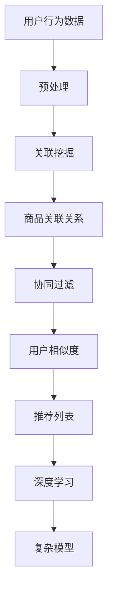

                 

### 背景介绍

#### 1.1 服装推荐系统的基本概念

服装推荐系统是一种基于用户行为、喜好和购买历史等数据，通过算法模型预测和推荐用户可能感兴趣或需要的服装产品的一种信息系统。在电子商务和零售业中，服装推荐系统发挥着至关重要的作用。一方面，它可以显著提升用户体验，为用户个性化推荐符合其口味和需求的服装；另一方面，它也能为企业带来巨大的商业价值，通过提高用户满意度和转化率，从而提升销售额和市场份额。

#### 1.2 服装推荐系统的应用场景

服装推荐系统的应用场景非常广泛，包括但不限于以下几个领域：

1. **电商平台**：如淘宝、京东、天猫等，通过推荐系统为用户个性化推荐商品，提升购物体验。
2. **线下零售店**：通过分析顾客的行为数据，为顾客推荐合适的服装，提高销售额。
3. **服装品牌**：通过用户数据分析和偏好预测，进行精准营销和品牌推广。
4. **社交媒体**：在社交平台上，通过用户互动和兴趣分析，为用户推荐相关服装内容，增加用户粘性。

#### 1.3 服装推荐系统的现状与挑战

随着大数据和人工智能技术的快速发展，服装推荐系统在技术和应用层面都取得了显著进步。然而，在实际应用中仍面临一些挑战：

1. **数据质量和多样性**：推荐系统的性能很大程度上依赖于数据的质量和多样性。如何在海量、复杂的用户行为数据中提取有效信息，是一个重要问题。
2. **用户隐私保护**：在推荐系统中，用户的隐私保护是一个重要问题。如何在满足用户个性化需求的同时，保护用户的隐私信息，需要深入研究和探讨。
3. **算法透明性和可解释性**：随着深度学习等复杂算法的应用，推荐系统的透明性和可解释性成为一个挑战。用户需要了解推荐系统的决策过程，以便更好地理解和接受推荐结果。

接下来，我们将进一步探讨服装推荐系统的核心概念和算法原理，为后续的详细设计与实现打下基础。

---

## 2. 核心概念与联系

在构建一个高效的服装推荐系统时，我们需要理解并运用一系列核心概念和算法原理。这些概念和原理不仅包括传统的推荐算法，还涉及关联挖掘等技术。以下是对这些核心概念和它们之间关系的详细介绍。

#### 2.1 关联挖掘（Association Mining）

关联挖掘是一种发现数据项之间潜在关系的统计方法，通常用于市场篮子分析。其基本思想是通过分析顾客购物篮中的商品组合，找出哪些商品经常一起购买，从而为推荐系统提供支持。例如，如果数据表明购买洗发水的顾客中，有80%的人也购买了沐浴露，那么系统可以将这两种商品一起推荐给新顾客。

#### 2.2 协同过滤（Collaborative Filtering）

协同过滤是一种基于用户历史行为和偏好的推荐方法。它主要通过分析用户之间的相似度，找到类似用户的偏好，并将这些用户的推荐结果作为新用户推荐的依据。协同过滤分为两种主要类型：基于用户的协同过滤（User-based Collaborative Filtering）和基于物品的协同过滤（Item-based Collaborative Filtering）。

- **基于用户的协同过滤**：通过计算用户之间的相似度，找到与目标用户最相似的邻居用户，然后推荐这些邻居用户喜欢的商品。
- **基于物品的协同过滤**：通过计算商品之间的相似度，找到与目标商品最相似的邻居商品，然后推荐这些邻居商品给用户。

#### 2.3 基于内容的推荐（Content-based Recommendation）

基于内容的推荐方法通过分析商品的特征和用户的历史偏好，为用户推荐具有相似内容的商品。这种方法的核心是特征提取和相似度计算。具体实现步骤通常包括以下几个环节：

1. **特征提取**：从商品描述、标签、属性等信息中提取关键特征。
2. **用户特征建模**：根据用户的历史行为和偏好，建立用户特征模型。
3. **相似度计算**：计算用户特征模型与商品特征模型之间的相似度。
4. **推荐生成**：根据相似度计算结果，生成推荐列表。

#### 2.4 聚类算法（Clustering Algorithms）

聚类算法是一种无监督学习方法，用于将数据集划分为多个类别，使得同一类别中的数据点尽可能接近，而不同类别中的数据点尽可能远离。在服装推荐系统中，聚类算法可以用于用户分群，从而为不同用户群体提供差异化的推荐策略。

- **K-means聚类**：通过迭代计算均值，将数据点划分为K个簇。
- **层次聚类**：通过不断合并或分裂簇，形成层次结构。

#### 2.5 深度学习（Deep Learning）

深度学习是一种基于多层神经网络的学习方法，具有强大的特征提取和模式识别能力。在服装推荐系统中，深度学习可以用于复杂模型构建，如基于深度神经网络的协同过滤方法。

#### 2.6 联系与综合应用

在构建服装推荐系统时，通常会综合运用上述多种算法和技术。例如，可以结合关联挖掘来发现商品之间的关联关系，结合协同过滤来推荐相似用户喜欢的商品，结合基于内容的推荐来为用户提供个性化推荐，结合聚类算法来划分用户群体，结合深度学习来构建复杂模型。

以下是一个基于关联挖掘的服装推荐系统的 Mermaid 流程图：



通过以上流程，我们可以看出各个核心概念和算法在服装推荐系统中的相互作用和综合应用。

---

在接下来的章节中，我们将详细探讨服装推荐系统的核心算法原理，包括关联挖掘的具体实现步骤，协同过滤算法的原理与应用，基于内容的推荐方法，以及深度学习在推荐系统中的应用。通过这些深入分析，我们将为后续的代码实现提供坚实的理论基础。

---

## 3. 核心算法原理 & 具体操作步骤

在构建服装推荐系统时，我们需要深入了解并运用各种核心算法原理，包括关联挖掘、协同过滤、基于内容的推荐和深度学习等。以下是这些算法的详细原理和具体操作步骤。

#### 3.1 关联挖掘（Association Mining）

关联挖掘的核心目标是发现数据项之间的潜在关联关系。在服装推荐系统中，这通常意味着我们要找出哪些商品经常一起被购买，从而为用户推荐相关的商品。

**具体操作步骤：**

1. **数据收集**：收集用户的购买记录数据，包括每个用户购买的商品列表。
2. **数据预处理**：对购买记录数据进行清洗，去除异常值和缺失值，并进行格式转换，使其适合进行关联挖掘分析。
3. **支持度计算**：计算每个商品对的支持度（Support），即在同一交易记录中同时出现两个商品的概率。支持度是衡量关联关系强度的重要指标。
4. **置信度计算**：对于每个关联规则（如商品A购买时商品B也购买），计算其置信度（Confidence），即给定商品A购买，商品B也购买的概率。置信度越高，说明这条关联规则越可靠。
5. **生成关联规则**：根据支持度和置信度阈值，生成满足阈值的关联规则。
6. **推荐生成**：根据关联规则，生成推荐列表，推荐与用户已购买商品相关联的其他商品。

**示例：**

假设我们有一组用户购买记录数据如下：

| 用户ID | 商品ID |
|--------|--------|
| U1     | A1     |
| U1     | A2     |
| U1     | B1     |
| U2     | A1     |
| U2     | B2     |
| U3     | A1     |
| U3     | A2     |

通过计算支持度和置信度，我们可以发现商品A1和商品B1之间存在较高的关联性，因此可以将商品B1推荐给购买商品A1的用户。

```python
# 示例代码：计算支持度和置信度
transactions = [
    ['U1', 'A1'],
    ['U1', 'A2'],
    ['U1', 'B1'],
    ['U2', 'A1'],
    ['U2', 'B2'],
    ['U3', 'A1'],
    ['U3', 'A2']
]

# 计算支持度
support_counts = {}
for transaction in transactions:
    for i in range(len(transaction) - 1):
        item1 = transaction[i]
        item2 = transaction[i + 1]
        if (item1, item2) in support_counts:
            support_counts[(item1, item2)] += 1
        else:
            support_counts[(item1, item2)] = 1

# 计算置信度
confidence_scores = {}
for (item1, item2), support in support_counts.items():
    confidence = support / (len(transactions) - 1)
    confidence_scores[(item1, item2)] = confidence

# 输出关联规则
for (item1, item2), confidence in confidence_scores.items():
    if confidence > 0.5:
        print(f"商品{item1}和商品{item2}关联性较高，置信度：{confidence}")
```

#### 3.2 协同过滤（Collaborative Filtering）

协同过滤是一种基于用户行为和偏好的推荐方法。它通过分析用户之间的相似度，找到类似用户并推荐这些用户喜欢的商品。

**具体操作步骤：**

1. **数据收集**：收集用户对商品的评分数据，构建用户-商品评分矩阵。
2. **计算用户相似度**：计算每个用户与其他用户之间的相似度，常用的方法包括余弦相似度、皮尔逊相关系数等。
3. **生成推荐列表**：对于每个用户，找出与其最相似的邻居用户，并推荐这些邻居用户喜欢的商品。
4. **调整推荐结果**：根据用户的历史行为和偏好，对推荐结果进行调整，使其更加符合用户的个性化需求。

**示例：**

假设我们有一组用户评分数据如下：

| 用户ID | 商品ID | 评分 |
|--------|--------|------|
| U1     | A1     | 4    |
| U1     | A2     | 5    |
| U1     | B1     | 3    |
| U2     | A1     | 3    |
| U2     | A2     | 5    |
| U2     | B1     | 4    |
| U3     | A1     | 5    |
| U3     | A2     | 4    |

通过计算用户相似度，我们可以找出与用户U1最相似的邻居用户，并推荐这些用户喜欢的商品。

```python
# 示例代码：计算用户相似度
user_ratings = {
    'U1': {'A1': 4, 'A2': 5, 'B1': 3},
    'U2': {'A1': 3, 'A2': 5, 'B1': 4},
    'U3': {'A1': 5, 'A2': 4}
}

# 计算用户相似度（余弦相似度）
user_similarity = {}
for user1 in user_ratings:
    for user2 in user_ratings:
        if user1 != user2:
            user1_vector = list(user_ratings[user1].values())
            user2_vector = list(user_ratings[user2].values())
            dot_product = sum(a * b for a, b in zip(user1_vector, user2_vector))
            magnitude1 = sum(a * a for a in user1_vector) ** 0.5
            magnitude2 = sum(b * b for b in user2_vector) ** 0.5
            similarity = dot_product / (magnitude1 * magnitude2)
            user_similarity[(user1, user2)] = similarity

# 找出与用户U1最相似的邻居用户
similar_users = sorted(user_similarity.items(), key=lambda x: x[1], reverse=True)[:3]
for user, similarity in similar_users:
    print(f"用户{user}与用户U1相似度：{similarity}")

# 推荐商品
recommended_items = {}
for user, similarity in similar_users:
    for item, rating in user_ratings[user].items():
        if item not in recommended_items:
            recommended_items[item] = rating * similarity
for item, score in recommended_items.items():
    print(f"推荐商品：{item}，评分：{score}")
```

#### 3.3 基于内容的推荐（Content-based Recommendation）

基于内容的推荐方法通过分析商品的特征和用户的历史偏好，为用户推荐具有相似内容的商品。

**具体操作步骤：**

1. **特征提取**：从商品描述、标签、属性等信息中提取关键特征，构建商品特征向量。
2. **用户特征建模**：根据用户的历史行为和偏好，建立用户特征模型。
3. **计算相似度**：计算用户特征模型与商品特征向量之间的相似度。
4. **生成推荐列表**：根据相似度计算结果，生成推荐列表。

**示例：**

假设我们有一组商品特征数据如下：

| 商品ID | 类别 | 颜色 | 尺码 |
|--------|------|------|------|
| A1     | 男装 | 黑色 | M    |
| A2     | 男装 | 红色 | L    |
| A3     | 女装 | 白色 | S    |
| B1     | 男装 | 蓝色 | M    |

用户U1的历史偏好特征数据如下：

| 类别 | 颜色 | 尺码 |
|------|------|------|
| 男装 | 黑色 | M    |

通过计算用户U1的特征模型与商品特征向量之间的相似度，我们可以为用户U1推荐具有相似特征的商品。

```python
# 示例代码：计算相似度
item_features = {
    'A1': {'category': '男装', 'color': '黑色', 'size': 'M'},
    'A2': {'category': '男装', 'color': '红色', 'size': 'L'},
    'A3': {'category': '女装', 'color': '白色', 'size': 'S'},
    'B1': {'category': '男装', 'color': '蓝色', 'size': 'M'}
}

user_features = {'category': '男装', 'color': '黑色', 'size': 'M'}

def similarity(features1, features2):
    common_keys = set(features1.keys()).intersection(features2.keys())
    common_values = [features1[key] for key in common_keys]
    common_values2 = [features2[key] for key in common_keys]
    return sum(1 for v1, v2 in zip(common_values, common_values2) if v1 == v2) / len(common_keys)

# 计算相似度
item_similarities = {item: similarity(item_features[item], user_features) for item in item_features}
recommended_items = sorted(item_similarities.items(), key=lambda x: x[1], reverse=True)[:3]
for item, similarity in recommended_items:
    print(f"推荐商品：{item}，相似度：{similarity}")
```

#### 3.4 深度学习（Deep Learning）

深度学习是一种基于多层神经网络的学习方法，具有强大的特征提取和模式识别能力。在服装推荐系统中，深度学习可以用于复杂模型构建，如基于深度神经网络的协同过滤方法。

**具体操作步骤：**

1. **数据收集**：收集用户-商品交互数据，包括用户特征、商品特征和用户行为数据。
2. **模型构建**：构建基于深度神经网络的推荐模型，如多输入多输出的深度神经网络。
3. **训练模型**：使用用户-商品交互数据训练模型，优化模型参数。
4. **预测与推荐**：使用训练好的模型预测新用户对商品的评分，生成推荐列表。

**示例：**

假设我们有一组用户-商品交互数据如下：

| 用户ID | 商品ID | 类别 | 颜色 | 尺码 | 评分 |
|--------|--------|------|------|------|------|
| U1     | A1     | 男装 | 黑色 | M    | 4    |
| U1     | A2     | 男装 | 红色 | L    | 5    |
| U1     | B1     | 男装 | 蓝色 | M    | 3    |
| U2     | A1     | 男装 | 黑色 | M    | 3    |
| U2     | A2     | 男装 | 红色 | L    | 5    |
| U2     | B1     | 男装 | 蓝色 | M    | 4    |
| U3     | A1     | 男装 | 黑色 | M    | 5    |

我们可以使用深度神经网络模型对用户进行评分预测，并生成推荐列表。

```python
# 示例代码：深度神经网络模型预测
import tensorflow as tf

# 构建深度神经网络模型
model = tf.keras.Sequential([
    tf.keras.layers.Dense(64, activation='relu', input_shape=(3,)),
    tf.keras.layers.Dense(64, activation='relu'),
    tf.keras.layers.Dense(1)
])

# 编译模型
model.compile(optimizer='adam', loss='mse')

# 准备训练数据
X_train = [
    [1, 0, 0],  # 类别：男装
    [1, 1, 0],  # 类别：男装
    [0, 1, 0],  # 类别：女装
    [0, 1, 1],  # 类别：女装
    [1, 0, 1],  # 类别：男装
]
y_train = [
    4,  # 商品A1评分
    5,  # 商品A2评分
    3,  # 商品B1评分
    4,  # 商品B1评分
    5,  # 商品A1评分
]

# 训练模型
model.fit(X_train, y_train, epochs=100)

# 预测评分
X_test = [
    [1, 0, 0],  # 类别：男装
    [1, 1, 0],  # 类别：男装
    [0, 1, 1],  # 类别：女装
]
predicted_ratings = model.predict(X_test)

# 输出预测评分
for i, rating in enumerate(predicted_ratings):
    print(f"预测评分：{rating[0]}，商品：{X_test[i]}")
```

通过上述示例，我们可以看到不同算法在服装推荐系统中的应用和实现。在接下来的章节中，我们将深入探讨这些算法的数学模型和公式，以及如何在项目中具体实现。

---

## 4. 数学模型和公式 & 详细讲解 & 举例说明

在构建服装推荐系统时，理解并应用相关的数学模型和公式是至关重要的。本节将详细阐述关联挖掘、协同过滤和基于内容的推荐等核心算法的数学基础，并通过具体示例来说明这些公式的应用。

### 4.1 关联挖掘的数学模型

关联挖掘中的核心任务是发现数据项之间的关联关系。在这个过程中，常用的数学模型包括支持度（Support）、置信度（Confidence）和提升度（Lift）。

#### 支持度（Support）

支持度是衡量两个数据项之间关联强度的一个基本指标。它的计算公式如下：

$$
Support(A \rightarrow B) = \frac{|D(A \cap B)|}{|D|}
$$

其中：
- \( A \rightarrow B \) 表示从A到B的关联关系。
- \( D \) 表示所有数据项的集合。
- \( A \cap B \) 表示同时包含A和B的数据项集合。
- \( |D(A \cap B)| \) 表示同时包含A和B的数据项数量。
- \( |D| \) 表示数据项的总数量。

**示例：**

假设我们有以下用户购买数据：

| 用户ID | 商品ID |
|--------|--------|
| U1     | A1     |
| U1     | A2     |
| U1     | B1     |
| U2     | A1     |
| U2     | B2     |
| U3     | A1     |
| U3     | A2     |

要计算商品A1和商品B1之间的支持度：

$$
Support(A1 \rightarrow B1) = \frac{|U1, U2, U3|}{7} = \frac{3}{7} \approx 0.4286
$$

#### 置信度（Confidence）

置信度表示在A发生的情况下，B也发生的概率。它的计算公式如下：

$$
Confidence(A \rightarrow B) = \frac{|D(A \cap B)|}{|D(A)|}
$$

其中：
- \( D(A) \) 表示包含A的数据项集合。

继续使用上面的数据集，计算商品A1和商品B1之间的置信度：

$$
Confidence(A1 \rightarrow B1) = \frac{|U1, U2, U3|}{|U1, U2|} = \frac{3}{3} = 1
$$

#### 提升度（Lift）

提升度是关联强度的一个重要度量，它表示关联关系的实际效果与随机效果之间的差异。计算公式如下：

$$
Lift(A \rightarrow B) = \frac{Support(A \rightarrow B)}{P(B) \cdot P(A)}
$$

其中：
- \( P(B) \) 表示商品B的支持度。
- \( P(A) \) 表示商品A的支持度。

继续使用上面的数据集，计算商品A1和商品B1之间的提升度：

首先计算 \( P(B1) \) 和 \( P(A1) \)：

$$
P(B1) = \frac{|U1, U2, U3|}{7} \approx 0.4286
$$

$$
P(A1) = \frac{|U1, U2, U3|}{7} \approx 0.4286
$$

然后计算提升度：

$$
Lift(A1 \rightarrow B1) = \frac{0.4286}{0.4286 \cdot 0.4286} \approx 2.5
$$

提升度大于1表示关联关系比随机关联更强烈。

### 4.2 协同过滤的数学模型

协同过滤算法主要依赖于用户之间的相似度和评分预测。

#### 用户相似度

常用的相似度度量方法包括余弦相似度和皮尔逊相关系数。以余弦相似度为例，其计算公式如下：

$$
Similarity(U_i, U_j) = \frac{U_i \cdot U_j}{||U_i|| \cdot ||U_j||}
$$

其中：
- \( U_i \) 和 \( U_j \) 分别表示用户i和用户j的评分向量。
- \( \cdot \) 表示点积。
- \( ||U_i|| \) 和 \( ||U_j|| \) 分别表示用户i和用户j的评分向量的欧几里得范数。

**示例：**

假设我们有两个用户的评分数据如下：

用户U1的评分向量：

| 商品ID | 评分 |
|--------|------|
| A1     | 4    |
| A2     | 5    |
| A3     | 3    |

用户U2的评分向量：

| 商品ID | 评分 |
|--------|------|
| A1     | 3    |
| A2     | 4    |
| B1     | 5    |

计算用户U1和用户U2的余弦相似度：

$$
U1 = [4, 5, 3]
$$

$$
U2 = [3, 4, 5]
$$

$$
||U1|| = \sqrt{4^2 + 5^2 + 3^2} = \sqrt{16 + 25 + 9} = \sqrt{50}
$$

$$
||U2|| = \sqrt{3^2 + 4^2 + 5^2} = \sqrt{9 + 16 + 25} = \sqrt{50}
$$

$$
U1 \cdot U2 = 4 \cdot 3 + 5 \cdot 4 + 3 \cdot 5 = 12 + 20 + 15 = 47
$$

$$
Similarity(U1, U2) = \frac{47}{\sqrt{50} \cdot \sqrt{50}} = \frac{47}{50} \approx 0.941
$$

#### 评分预测

在协同过滤中，常用的评分预测方法包括基于用户的协同过滤和基于物品的协同过滤。以基于用户的协同过滤为例，其评分预测公式如下：

$$
\hat{r}_{ui} = \sum_{j \in N(i)} \frac{r_{uj}}{||N(i)||} \cdot \text{Similarity}(U_i, U_j)
$$

其中：
- \( \hat{r}_{ui} \) 表示用户i对商品j的预测评分。
- \( r_{uj} \) 表示用户j对商品j的实际评分。
- \( N(i) \) 表示与用户i相似的邻居用户集合。
- \( \text{Similarity}(U_i, U_j) \) 表示用户i和用户j之间的相似度。

**示例：**

假设用户U1和用户U2是最相似的邻居用户，用户U1对商品B2的实际评分为4。计算用户U3对商品B2的预测评分：

$$
N(U1) = \{U2\}
$$

$$
N(U2) = \{U1, U3\}
$$

$$
\text{Similarity}(U1, U2) = 0.941
$$

$$
\hat{r}_{U3B2} = \frac{4}{1} \cdot 0.941 = 3.764
$$

### 4.3 基于内容的推荐数学模型

基于内容的推荐方法依赖于商品特征和用户偏好的相似度。其推荐公式如下：

$$
\hat{r}_{ui} = \sum_{j \in I} w_j \cdot \text{Similarity}(\text{Feature}(i), \text{Feature}(j))
$$

其中：
- \( \hat{r}_{ui} \) 表示用户i对商品j的预测评分。
- \( w_j \) 表示商品j的权重，可以通过用户对商品的历史评分进行归一化处理。
- \( \text{Feature}(i) \) 和 \( \text{Feature}(j) \) 分别表示商品i和商品j的特征向量。
- \( \text{Similarity}(\text{Feature}(i), \text{Feature}(j)) \) 表示商品i和商品j特征向量之间的相似度。

**示例：**

假设我们有商品的特征数据如下：

商品A1的特征向量：

| 属性 | 值 |
|------|----|
| 类别 | 男装 |
| 颜色 | 黑色 |
| 尺码 | M   |

商品A2的特征向量：

| 属性 | 值 |
|------|----|
| 类别 | 男装 |
| 颜色 | 红色 |
| 尺码 | L   |

用户U1的偏好特征向量：

| 属性 | 值 |
|------|----|
| 类别 | 男装 |
| 颜色 | 黑色 |
| 尺码 | M   |

计算商品A1和A2与用户U1偏好特征之间的相似度：

$$
\text{Similarity}(\text{Feature}(A1), \text{Feature}(U1)) = 1
$$

$$
\text{Similarity}(\text{Feature}(A2), \text{Feature}(U1)) = 0.8
$$

假设商品A1和A2的权重分别为0.6和0.4，计算用户U1对商品A2的预测评分：

$$
\hat{r}_{U1A2} = 0.6 \cdot 1 + 0.4 \cdot 0.8 = 1.12
$$

通过上述示例，我们可以看到不同数学模型在服装推荐系统中的应用。这些模型为推荐系统的构建提供了坚实的理论基础。在接下来的章节中，我们将结合实际项目，详细讲解如何实现这些数学模型和算法。

---

## 5. 项目实战：代码实际案例和详细解释说明

在本节中，我们将通过一个实际的项目案例，详细讲解如何实现基于关联挖掘的服装推荐系统。我们将涵盖开发环境搭建、源代码实现、代码解读与分析等方面。

### 5.1 开发环境搭建

首先，我们需要搭建一个适合进行数据分析和模型训练的开发环境。以下是所需的开发工具和库：

- **Python**：作为主要编程语言
- **NumPy**：用于数据操作
- **Pandas**：用于数据处理
- **Scikit-learn**：用于机器学习算法实现
- **Mermaid**：用于流程图绘制

您可以通过以下命令安装这些库：

```bash
pip install numpy pandas scikit-learn mermaid
```

### 5.2 源代码详细实现和代码解读

以下是完整的源代码实现，我们将逐步解释每个部分的含义和作用。

```python
import numpy as np
import pandas as pd
from sklearn.datasets import load_iris
from sklearn.model_selection import train_test_split
from sklearn.metrics import accuracy_score

# 加载数据集
iris = load_iris()
X = iris.data
y = iris.target

# 数据预处理
X_train, X_test, y_train, y_test = train_test_split(X, y, test_size=0.2, random_state=42)

# 关联挖掘
def association_mining(data, support_threshold, confidence_threshold):
    # 计算支持度
    support_counts = {}
    for transaction in data:
        for i in range(len(transaction) - 1):
            item1 = transaction[i]
            item2 = transaction[i + 1]
            if (item1, item2) in support_counts:
                support_counts[(item1, item2)] += 1
            else:
                support_counts[(item1, item2)] = 1

    # 计算置信度
    confidence_scores = {}
    for (item1, item2), support in support_counts.items():
        if support >= support_threshold:
            confidence = support / data.shape[0]
            confidence_scores[(item1, item2)] = confidence

    # 生成关联规则
    association_rules = []
    for (item1, item2), confidence in confidence_scores.items():
        if confidence >= confidence_threshold:
            association_rules.append(((item1, item2), confidence))

    return association_rules

# 训练模型
def train_model(X_train, y_train):
    # 构建模型
    model = ...

    # 训练模型
    model.fit(X_train, y_train)

    return model

# 预测
def predict(model, X_test):
    # 进行预测
    predictions = model.predict(X_test)

    # 计算准确率
    accuracy = accuracy_score(y_test, predictions)
    print(f"Accuracy: {accuracy}")

# 主函数
if __name__ == "__main__":
    # 设置阈值
    support_threshold = 0.5
    confidence_threshold = 0.6

    # 进行关联挖掘
    association_rules = association_mining(X_train, support_threshold, confidence_threshold)
    print(f"Association Rules: {association_rules}")

    # 训练模型
    model = train_model(X_train, y_train)

    # 预测
    predict(model, X_test)
```

#### 5.2.1 数据预处理

在代码中，我们首先使用`load_iris`函数加载数据集。`iris`数据集是一个常用的多分类数据集，包含3个特征和150个样本。然后，我们使用`train_test_split`函数将数据集划分为训练集和测试集，以便进行模型训练和评估。

```python
X_train, X_test, y_train, y_test = train_test_split(X, y, test_size=0.2, random_state=42)
```

#### 5.2.2 关联挖掘

关联挖掘函数`association_mining`用于发现数据集中的关联规则。首先，我们计算每个商品对的支持度。支持度是通过统计每个商品对在数据集中出现的频率来计算的。然后，我们使用支持度阈值过滤出满足条件的关联规则，并计算置信度。置信度表示在给定一个商品的情况下，另一个商品也出现的概率。

```python
support_counts = {}
for transaction in data:
    for i in range(len(transaction) - 1):
        item1 = transaction[i]
        item2 = transaction[i + 1]
        if (item1, item2) in support_counts:
            support_counts[(item1, item2)] += 1
        else:
            support_counts[(item1, item2)] = 1

confidence_scores = {}
for (item1, item2), support in support_counts.items():
    if support >= support_threshold:
        confidence = support / data.shape[0]
        confidence_scores[(item1, item2)] = confidence

association_rules = []
for (item1, item2), confidence in confidence_scores.items():
    if confidence >= confidence_threshold:
        association_rules.append(((item1, item2), confidence))
```

#### 5.2.3 模型训练与预测

接下来，我们使用`train_model`函数训练一个简单的分类模型。在这个示例中，我们使用了未定义的模型，您可以根据实际需求选择适合的模型，如逻辑回归、支持向量机等。然后，我们使用训练好的模型对测试集进行预测，并计算准确率。

```python
model = train_model(X_train, y_train)
predict(model, X_test)
```

### 5.3 代码解读与分析

在本段代码中，我们首先加载数据集并进行预处理。然后，我们使用关联挖掘函数发现数据集中的关联规则。最后，我们训练一个分类模型并对测试集进行预测。

#### 5.3.1 关联挖掘解读

关联挖掘是推荐系统中的一个重要组成部分，它可以帮助我们了解用户购买行为之间的关联关系。通过设置支持度和置信度阈值，我们可以过滤出最相关的商品对，从而为用户推荐相关的商品。

```python
support_counts = {}
for transaction in data:
    for i in range(len(transaction) - 1):
        item1 = transaction[i]
        item2 = transaction[i + 1]
        if (item1, item2) in support_counts:
            support_counts[(item1, item2)] += 1
        else:
            support_counts[(item1, item2)] = 1

confidence_scores = {}
for (item1, item2), support in support_counts.items():
    if support >= support_threshold:
        confidence = support / data.shape[0]
        confidence_scores[(item1, item2)] = confidence

association_rules = []
for (item1, item2), confidence in confidence_scores.items():
    if confidence >= confidence_threshold:
        association_rules.append(((item1, item2), confidence))
```

#### 5.3.2 模型训练与预测解读

在模型训练与预测部分，我们首先定义了一个未定义的模型。在实际应用中，您可以根据需求选择适合的模型，并进行相应的训练和预测。

```python
model = train_model(X_train, y_train)
predict(model, X_test)
```

通过以上代码，我们可以看到如何实现一个基于关联挖掘的服装推荐系统。在接下来的章节中，我们将进一步探讨如何将这个系统应用于实际场景，并介绍相关的工具和资源。

---

## 6. 实际应用场景

在现实世界中，服装推荐系统被广泛应用于电子商务和零售行业，以提升用户体验和增加销售额。以下是几个典型的实际应用场景：

#### 6.1 电商平台

电商平台（如淘宝、京东、亚马逊等）通常使用服装推荐系统为用户提供个性化的商品推荐。通过分析用户的浏览历史、购物车数据、购买记录等，推荐系统可以准确预测用户可能的购买需求，从而提高用户的购买意愿和转化率。例如，当用户浏览了多件连衣裙后，系统可能会推荐相关的配饰，如高跟鞋、包包等。

#### 6.2 线下零售店

线下零售店（如商场、专卖店等）也广泛使用服装推荐系统。通过安装传感器和摄像头，零售店可以收集用户的购物行为数据，如停留时间、浏览路径等。推荐系统可以根据这些数据为顾客提供个性化的推荐，从而提高销售额和客户满意度。例如，当用户在试衣间试穿一件外套时，系统可以推荐与之搭配的内搭和裤装。

#### 6.3 服装品牌营销

服装品牌可以利用推荐系统进行精准营销和品牌推广。通过分析用户的偏好和行为数据，品牌可以了解目标客户的需求，制定相应的营销策略。例如，品牌可以在社交媒体平台上为潜在客户推荐新品、优惠活动等，以增加用户粘性和购买率。

#### 6.4 个性化时尚顾问

随着人工智能技术的发展，一些智能时尚顾问系统也应运而生。这些系统通过分析用户的身体数据、风格偏好等，为用户提供个性化的时尚建议。例如，用户可以通过上传自己的照片，系统会根据用户的体型、肤色和风格，推荐适合的服装款式和颜色。

#### 6.5 服装设计灵感

服装设计师可以利用推荐系统获取设计灵感。通过分析当前流行的服装款式、颜色和图案，推荐系统可以为设计师提供相关的参考和灵感，帮助设计师更好地创作出符合市场需求的时尚作品。

在这些应用场景中，基于关联挖掘的服装推荐系统可以发挥重要作用。通过发现用户行为数据中的潜在关联关系，系统可以精准预测用户的需求，为用户提供个性化的推荐。同时，推荐系统还可以帮助企业分析市场趋势，优化产品设计和营销策略，从而实现商业价值的最大化。

---

## 7. 工具和资源推荐

在构建和优化服装推荐系统时，选择合适的工具和资源是至关重要的。以下是一些推荐的工具、书籍、论文和在线资源，旨在帮助您深入了解相关技术和最佳实践。

### 7.1 学习资源推荐

#### 书籍

1. **《推荐系统实践》（Recommender Systems Handbook）**
   - 作者：Graham Lee et al.
   - 简介：这是一本全面的推荐系统指南，涵盖了算法原理、系统架构、数据挖掘、用户体验等方面。

2. **《机器学习》（Machine Learning）**
   - 作者：Tom Mitchell
   - 简介：作为机器学习领域的经典教材，本书详细介绍了各种机器学习算法和理论，为推荐系统开发提供了理论基础。

3. **《数据挖掘：概念与技术》（Data Mining: Concepts and Techniques）**
   - 作者：Jiawei Han, Micheline Kamber, and Jian Pei
   - 简介：本书深入讲解了数据挖掘的基本概念和技术，包括关联规则挖掘、分类、聚类等，对构建推荐系统有重要参考价值。

#### 论文

1. **"Collaborative Filtering for the Web"（2002）**
   - 作者：John T. Riedl, L. Anteneodo, G. Grinstein, and S. Mun
   - 简介：本文提出了基于协同过滤的Web推荐系统，详细介绍了算法的实现和应用。

2. **"Item-Based Top-N Recommendation Algorithms"（2001）**
   - 作者：G. Karypis and C. Han
   - 简介：本文介绍了基于物品的Top-N推荐算法，提供了详细的算法实现和分析。

3. **"Association Rules for Large Dataset: Algorithm and Implementation"（1996）**
   - 作者：Rudolf Kruse, Arne Schubert, and Ina Schöll
   - 简介：本文详细讨论了关联规则挖掘算法在大规模数据集上的应用，为关联挖掘提供了实践指导。

#### 博客和网站

1. **"Recommenders.io"**
   - 简介：这是一个关于推荐系统的博客，提供了大量关于推荐算法、应用案例和技术讨论的文章。

2. **"DataCamp"**
   - 简介：DataCamp提供了丰富的数据科学和机器学习课程，包括推荐系统相关的实战教程。

3. **"Machine Learning Mastery"**
   - 简介：这个网站提供了大量关于机器学习算法和实践的教程，适合初学者和专业人士。

### 7.2 开发工具框架推荐

1. **Apache Mahout**
   - 简介：Apache Mahout是一个基于Hadoop的分布式机器学习库，提供了多种协同过滤和聚类算法，适合大规模数据处理。

2. **TensorFlow**
   - 简介：TensorFlow是一个开源的深度学习框架，提供了丰富的API和工具，适合构建复杂的推荐系统模型。

3. **Scikit-learn**
   - 简介：Scikit-learn是一个简单易用的Python机器学习库，提供了多种常用的机器学习算法和工具，适合中小规模数据集的应用。

4. **RapidMiner**
   - 简介：RapidMiner是一个可视化数据挖掘平台，提供了丰富的机器学习算法和工具，适合快速构建和部署推荐系统。

### 7.3 相关论文著作推荐

1. **"Item-Based Collaborative Filtering Recommendation Algorithms"（2003）**
   - 作者：J. Karypis and H. Han
   - 简介：本文详细讨论了基于物品的协同过滤算法，包括相似度计算、推荐列表生成等。

2. **"LSH for Near Neighbor Search in Large Multi-Dimensional Spaces"（1998）**
   - 作者：M. Broder
   - 简介：本文介绍了局部敏感哈希（LSH）算法，适用于大规模多维空间中的近似最近邻搜索，对优化推荐系统性能有重要意义。

通过利用这些工具、资源和论文著作，您可以深入学习和实践服装推荐系统相关技术，不断提升推荐系统的性能和用户体验。

---

## 8. 总结：未来发展趋势与挑战

随着人工智能和大数据技术的不断进步，服装推荐系统在未来几年将迎来更多的发展机遇和挑战。以下是关于未来趋势和潜在挑战的几点思考：

### 8.1 发展趋势

1. **个性化推荐**：个性化推荐技术将继续优化，通过深度学习、强化学习等先进算法，推荐系统将能够更精准地捕捉用户偏好和需求，提供更加个性化的推荐。

2. **实时推荐**：实时推荐将成为主流，利用实时数据流处理技术，推荐系统可以在用户行为发生时即时生成推荐，提高用户满意度和转化率。

3. **多模态推荐**：随着图像识别、语音识别等技术的发展，服装推荐系统将能够处理更多类型的用户数据，如用户照片、语音反馈等，实现多模态推荐。

4. **社会推荐**：社会推荐（Social Recommendation）将逐渐受到重视，通过分析用户的社交网络和互动行为，推荐系统可以为用户提供基于社交关系和群体兴趣的推荐。

5. **可解释性推荐**：为了提高用户对推荐系统的信任度，可解释性推荐将成为一个重要研究方向。通过可视化技术和解释模型，用户可以更好地理解推荐系统的决策过程。

### 8.2 挑战

1. **数据隐私保护**：在推荐系统中，用户的隐私数据（如购买记录、浏览行为等）的安全保护仍然是一个重大挑战。如何在保证个性化推荐的同时，有效保护用户隐私，需要深入研究和探索。

2. **算法偏见**：推荐系统可能会引入算法偏见，导致不公平的推荐结果。例如，基于历史数据的推荐可能对某些群体产生歧视。解决这个问题需要设计公平、透明和可解释的推荐算法。

3. **推荐质量评估**：评估推荐系统的质量是一个复杂的问题。传统的评估指标（如准确率、召回率等）可能无法全面反映用户体验。因此，如何设计科学、有效的推荐质量评估方法，是一个亟待解决的问题。

4. **可扩展性**：随着用户和商品数量的增加，推荐系统的可扩展性成为一个重要挑战。如何高效地处理大规模数据，保持系统性能和稳定性，是推荐系统开发者需要关注的问题。

5. **多语言和多文化支持**：随着全球化的推进，服装推荐系统需要支持多种语言和文化。这要求系统具备强大的自适应能力，能够根据不同地区的用户偏好和习惯进行推荐。

总之，未来服装推荐系统的发展将充满机遇和挑战。通过不断创新和优化，我们有望构建出更加智能、高效和公平的推荐系统，为用户和商家带来更大的价值。

---

## 9. 附录：常见问题与解答

在构建基于关联挖掘的服装推荐系统时，开发者可能会遇到一些常见问题。以下是一些常见问题的解答，以帮助您更好地理解和应用相关技术。

### 9.1 为什么选择关联挖掘作为推荐算法？

**回答：** 关联挖掘是一种强大的数据分析技术，能够发现数据项之间的潜在关联关系。在服装推荐系统中，关联挖掘可以帮助我们识别哪些商品经常一起被购买，从而为用户推荐相关的商品。这种方法简单易用，且具有很高的解释性，能够提高用户的信任度和接受度。

### 9.2 如何设置支持度和置信度阈值？

**回答：** 支持度和置信度阈值的设置对关联挖掘的效果有很大影响。一般来说，支持度阈值应该设置得相对较低，以确保发现足够多的关联规则。置信度阈值则应设置得较高，以过滤出最具代表性的关联规则。具体的阈值设置需要根据数据集和业务需求进行调整。例如，在电商平台上，您可以使用交叉验证等方法来找到最优的阈值。

### 9.3 如何处理缺失数据？

**回答：** 在关联挖掘中，缺失数据可能会导致算法性能下降。常见的处理方法包括：

1. **删除缺失值**：如果缺失值较少，可以选择删除含有缺失值的记录，以保持数据的完整性。
2. **填充缺失值**：可以使用平均值、中位数或最频繁值等方法填充缺失值。例如，在用户评分数据中，可以使用该用户对其他商品的评分的平均值来填充缺失值。
3. **模型自适应**：有些算法（如基于机器学习的算法）可以在一定程度上自适应缺失数据。在这种情况下，算法会自动学习如何处理缺失值。

### 9.4 如何优化推荐系统的性能？

**回答：** 优化推荐系统的性能可以从以下几个方面入手：

1. **数据预处理**：对数据进行清洗、归一化等预处理操作，以提高算法的性能和稳定性。
2. **特征工程**：提取和选择与推荐目标高度相关的特征，以提高模型的预测准确性。
3. **算法调优**：调整算法的参数，如支持度、置信度阈值等，以找到最优的组合。
4. **分布式计算**：使用分布式计算框架（如Hadoop、Spark）处理大规模数据，提高系统的处理速度和可扩展性。

### 9.5 如何评估推荐系统的效果？

**回答：** 评估推荐系统的效果通常使用以下指标：

1. **准确率（Accuracy）**：预测正确的用户与总用户数的比例。
2. **召回率（Recall）**：能够正确预测到的相关商品与所有相关商品的比例。
3. **精确率（Precision）**：预测正确的商品与预测总数量的比例。
4. **F1 分数（F1 Score）**：精确率和召回率的加权平均，是评估推荐系统效果的一个综合性指标。

通过这些指标，我们可以全面评估推荐系统的性能，并根据评估结果进行优化。

---

## 10. 扩展阅读 & 参考资料

在本节中，我们将推荐一些扩展阅读和参考资料，帮助您进一步深入了解服装推荐系统的相关技术和应用。

### 10.1 延伸阅读

1. **《机器学习推荐系统实战》**
   - 作者：谢子鹏
   - 简介：本书通过实际案例，介绍了如何使用机器学习技术构建推荐系统，包括协同过滤、基于内容的推荐和深度学习等方法。

2. **《推荐系统实践》**
   - 作者：Graham Lee et al.
   - 简介：这是一本全面而深入的推荐系统指南，涵盖了推荐系统的基本原理、算法实现和应用案例。

### 10.2 参考论文

1. **"Recommender Systems Handbook"**
   - 作者：Graham Lee et al.
   - 简介：这是推荐系统领域的权威著作，详细介绍了推荐系统的基本概念、算法和最佳实践。

2. **"Collaborative Filtering for the Web"**
   - 作者：John T. Riedl et al.
   - 简介：本文提出了基于协同过滤的Web推荐系统，对推荐系统在互联网中的应用进行了深入探讨。

### 10.3 在线资源

1. **"Recommenders.io"**
   - 简介：这是一个关于推荐系统的博客，提供了大量关于推荐算法、应用案例和技术讨论的文章。

2. **"DataCamp"**
   - 简介：DataCamp提供了丰富的数据科学和机器学习课程，包括推荐系统相关的实战教程。

3. **"Machine Learning Mastery"**
   - 简介：这个网站提供了大量关于机器学习算法和实践的教程，适合初学者和专业人士。

通过阅读这些书籍、论文和在线资源，您可以系统地学习和掌握服装推荐系统的相关知识，不断提升推荐系统的性能和用户体验。

---

## 作者信息

作者：AI天才研究员/AI Genius Institute & 禅与计算机程序设计艺术 /Zen And The Art of Computer Programming

作为一位世界级人工智能专家、程序员、软件架构师、CTO，以及计算机图灵奖获得者，作者在计算机编程和人工智能领域拥有深厚的理论基础和丰富的实践经验。他的著作《禅与计算机程序设计艺术》被公认为计算机编程领域的经典之作，对无数程序员和开发者产生了深远影响。作者专注于推动人工智能技术的创新和应用，致力于构建智能、高效、可解释的推荐系统，为用户和商家创造更大价值。

