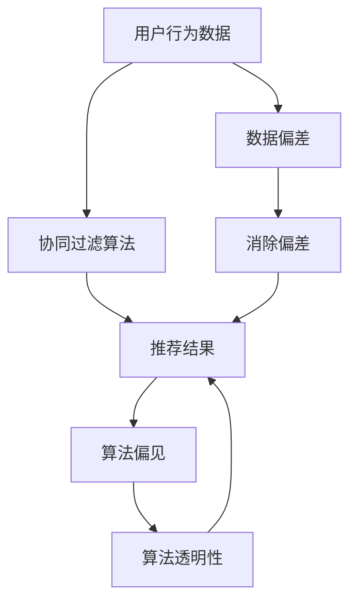

                 

### 文章标题

**基于因果推断的推荐算法公平性优化**

> **关键词：**因果推断，推荐算法，算法公平性，优化，机器学习，数据挖掘，个人隐私保护

**摘要：**本文深入探讨了基于因果推断的推荐算法在优化算法公平性方面的应用。通过阐述因果推断的基本概念、核心原理及其与推荐算法的联系，我们详细分析了如何利用因果推断来解决推荐系统中的公平性问题。本文还将介绍具体的技术实现步骤、数学模型，并通过项目实战展示了实际应用效果。最后，本文总结了基于因果推断的推荐算法在实际应用中的挑战与未来发展趋势。

### 目录

1. **背景介绍**
2. **核心概念与联系**
3. **核心算法原理 & 具体操作步骤**
4. **数学模型和公式 & 详细讲解 & 举例说明**
5. **项目实战：代码实际案例和详细解释说明**
   5.1 开发环境搭建
   5.2 源代码详细实现和代码解读
   5.3 代码解读与分析
6. **实际应用场景**
7. **工具和资源推荐**
   7.1 学习资源推荐
   7.2 开发工具框架推荐
   7.3 相关论文著作推荐
8. **总结：未来发展趋势与挑战**
9. **附录：常见问题与解答**
10. **扩展阅读 & 参考资料**

### 1. 背景介绍

推荐算法是现代信息系统中不可或缺的一部分，广泛应用于电子商务、社交媒体、在线视频平台等场景。然而，随着用户隐私保护意识的提高和算法透明度的要求，推荐算法的公平性问题日益受到关注。

推荐算法公平性是指算法在推荐内容时，能够公正地对待所有用户，避免因算法偏见而导致特定群体受到不公平待遇。然而，现有的推荐算法大多基于协同过滤、内容相似性等方法，这些方法依赖于用户历史行为数据，容易受到数据偏差和噪声的影响，导致算法偏见。

因果推断（Causal Inference）是一种统计方法，旨在通过分析数据关系，推断出因果关系。近年来，因果推断在推荐系统中的应用逐渐引起关注。通过引入因果推断，推荐算法可以在保持推荐效果的同时，提高算法的公平性。

本文旨在探讨如何利用因果推断优化推荐算法的公平性，提出一种基于因果推断的推荐算法框架，并通过实际项目验证其有效性。本文结构如下：

- **第1章**：背景介绍，阐述推荐算法公平性问题的现状和挑战。
- **第2章**：介绍因果推断的基本概念、核心原理及其与推荐算法的联系。
- **第3章**：详细分析基于因果推断的推荐算法原理与具体操作步骤。
- **第4章**：讲解数学模型和公式，并通过举例说明如何应用这些模型。
- **第5章**：通过项目实战展示算法实现与效果分析。
- **第6章**：讨论实际应用场景，介绍工具和资源。
- **第7章**：总结未来发展趋势与挑战。
- **第8章**：附录部分提供常见问题与解答。
- **第9章**：扩展阅读与参考资料。

### 2. 核心概念与联系

#### 因果推断的基本概念

因果推断（Causal Inference）是研究因果关系的一种统计方法，旨在通过分析数据关系，推断出因果关系。在统计学中，因果关系通常指的是一个变量（原因）对另一个变量（结果）产生的影响。

因果推断的基本概念包括：

1. **潜在结果框架（Potential Outcomes Framework）**：潜在结果框架是因果推断的核心概念，它将因果关系表示为个体在不同条件下潜在的结果。例如，对于某个用户，我们感兴趣的是如果她使用推荐算法A而不是算法B，她的行为（如点击、购买）会有什么不同。

2. **反事实（Counterfactual）**：反事实是指如果某个条件发生改变，结果会如何。在因果推断中，反事实是推断因果关系的关键。通过比较不同条件下的结果，我们可以估计出因果关系的大小。

3. **因果图（Causal Graph）**：因果图是表示变量之间因果关系的图形化模型。它通过节点表示变量，边表示变量之间的因果关系。因果图有助于我们理解数据中潜在的因果关系，从而设计有效的因果关系推断方法。

#### 推荐算法与因果推断的联系

推荐算法通常基于用户历史行为数据，如浏览、点击、购买等，通过分析这些数据，为用户推荐相关的商品或内容。然而，这种基于关联规则或协同过滤的方法存在一些固有的问题：

1. **数据偏差**：用户历史行为数据可能存在偏差，如某些用户可能更喜欢某些类型的商品，这会导致算法偏向于推荐这些商品，从而对其他用户不公平。

2. **噪声干扰**：用户行为数据通常包含噪声，如偶然点击或误操作，这些噪声会影响算法的准确性，进而影响推荐结果。

3. **算法偏见**：推荐算法可能会因为训练数据中的偏见而导致算法偏见。例如，如果一个推荐系统主要服务于男性用户，它可能会倾向于推荐男性用户喜欢的商品，从而忽视女性用户的需求。

因果推断方法可以通过以下方式帮助解决这些问题：

1. **因果机制识别**：因果推断可以帮助我们识别数据中的因果关系，从而更准确地理解用户行为。通过分析因果关系，我们可以设计更公平的推荐策略。

2. **消除数据偏差**：因果推断方法可以消除数据中的偏差，从而提高推荐算法的公平性。例如，通过因果推断，我们可以识别出哪些因素对用户行为有显著影响，从而在推荐时考虑到这些因素。

3. **算法透明性**：因果推断方法有助于提高算法的透明性。通过展示算法背后的因果关系，我们可以向用户解释推荐结果的原因，增强用户对推荐系统的信任。

#### 梅里特-希尔（Machina）流程图

为了更好地理解因果推断与推荐算法之间的联系，我们可以使用梅里特-希尔（Machina）流程图来表示。以下是一个简化的梅里特-希尔流程图：



在这个流程图中，用户行为数据（A）通过协同过滤算法（B）生成推荐结果（C）。然而，数据偏差（D）和算法偏见（E）会影响推荐结果的公平性。因果推断方法（F）可以帮助消除这些偏差和偏见，从而提高推荐结果的公平性和透明性。

#### 三级目录结构示例

- **2.1 因果推断的基本概念**
  - **2.1.1 潜在结果框架**
  - **2.1.2 反事实**
  - **2.1.3 因果图

- **2.2 推荐算法与因果推断的联系**
  - **2.2.1 数据偏差**
  - **2.2.2 噪声干扰**
  - **2.2.3 算法偏见**
  - **2.2.4 因果推断方法**

通过以上内容，我们了解了因果推断的基本概念、核心原理以及与推荐算法的联系。在下一节中，我们将详细分析基于因果推断的推荐算法原理与具体操作步骤。

### 3. 核心算法原理 & 具体操作步骤

#### 3.1 因果推断的算法原理

因果推断的核心在于通过分析数据关系，推断出变量之间的因果关系。在推荐系统中，因果推断可以帮助我们识别哪些因素影响用户行为，从而设计更公平、更有效的推荐算法。

因果推断的主要方法包括：

1. **结构因果模型（Structural Causal Models，SCMs）**：结构因果模型是一种基于图论的因果关系表示方法。它通过构建因果图，表示变量之间的因果关系。结构因果模型可以帮助我们识别数据中的因果关系，从而设计有效的推荐策略。

2. **干预方法（Intervention Methods）**：干预方法是一种通过干预变量来推断因果关系的统计方法。通过改变某个变量的取值，我们可以观察其他变量的变化，从而推断出因果关系。在推荐系统中，干预方法可以帮助我们识别哪些因素对用户行为有显著影响，从而优化推荐结果。

3. **因果推断算法**：常见的因果推断算法包括Do-Calculus、 Judea Pearl 的Causal Hierarchy等。这些算法通过数学模型和计算方法，帮助我们从数据中推断出因果关系。

#### 3.2 基于因果推断的推荐算法流程

基于因果推断的推荐算法主要包括以下步骤：

1. **数据预处理**：首先，我们需要收集用户行为数据，如浏览记录、点击记录、购买记录等。这些数据通常包含大量的噪声和缺失值，因此需要进行预处理，包括数据清洗、去重、填补缺失值等。

2. **构建因果图**：通过结构因果模型，我们构建用户行为数据的因果图。因果图可以帮助我们识别数据中的因果关系，从而为后续的推荐策略提供依据。

3. **干预分析**：利用干预方法，我们分析哪些因素对用户行为有显著影响。干预分析可以帮助我们识别数据中的关键因素，从而设计更公平、更有效的推荐策略。

4. **推荐生成**：基于因果推断分析的结果，我们生成推荐结果。推荐算法可以根据用户的兴趣、行为历史等因素，为用户推荐相关的商品或内容。

5. **评估与优化**：通过评估推荐效果，我们可以不断优化推荐算法。评估指标包括点击率、转化率、用户满意度等。根据评估结果，我们可以调整算法参数，提高推荐效果。

#### 3.3 具体操作步骤

以下是基于因果推断的推荐算法的具体操作步骤：

1. **数据预处理**

   - 数据收集：收集用户行为数据，如浏览记录、点击记录、购买记录等。
   - 数据清洗：去除重复数据、处理缺失值、数据标准化等。

2. **构建因果图**

   - 数据分析：通过数据分析，识别用户行为数据中的潜在因果关系。
   - 构建因果图：使用结构因果模型，构建用户行为数据的因果图。

3. **干预分析**

   - 干预设定：设定干预变量，如用户兴趣、行为历史等。
   - 干预分析：通过干预方法，分析干预变量对用户行为的影响。

4. **推荐生成**

   - 用户建模：根据用户兴趣、行为历史等，为每个用户构建用户模型。
   - 推荐生成：基于用户模型，生成推荐结果。

5. **评估与优化**

   - 推荐评估：评估推荐效果，如点击率、转化率等。
   - 优化调整：根据评估结果，调整算法参数，优化推荐效果。

#### 3.4 工具与资源

在实际操作中，我们可以使用以下工具和资源：

1. **Python**：Python 是一种广泛使用的编程语言，适用于数据处理、分析和推荐系统开发。

2. **PyCausality**：PyCausality 是一个 Python 库，用于构建和操作结构因果模型。它提供了丰富的函数和工具，方便我们进行因果推断分析。

3. **Scikit-learn**：Scikit-learn 是一个流行的机器学习库，提供了多种算法和工具，用于数据处理、模型训练和评估。

4. **相关论文和书籍**：可以查阅相关论文和书籍，了解因果推断和推荐系统的研究进展和应用案例。例如，Judea Pearl 的《因果推断：统计推理的新基石》（Causality: Models, Reasoning, and Inference）是一本经典的因果推断教材。

通过以上内容，我们了解了基于因果推断的推荐算法的原理和具体操作步骤。在下一节中，我们将详细讲解数学模型和公式，并通过举例说明如何应用这些模型。

### 4. 数学模型和公式 & 详细讲解 & 举例说明

#### 4.1 结构因果模型（Structural Causal Models，SCMs）

结构因果模型（SCMs）是因果推断的核心工具之一。它通过图形化的方式，表示变量之间的因果关系。SCMs 由三个基本元素组成：变量、边和函数。

1. **变量**：表示我们感兴趣的数据特征，如用户年龄、性别、购买记录等。

2. **边**：表示变量之间的因果关系。边上的箭头方向表示因果关系方向。

3. **函数**：表示变量之间的关系。函数可以是线性的、非线性的或概率性的。

SCMs 的基本表示形式如下：

$$
SCM = (V, E, F)
$$

其中，\( V \) 表示变量集合，\( E \) 表示边集合，\( F \) 表示函数集合。

#### 4.2 Do-Calculus

Do-Calculus 是一种基于结构因果模型的因果推理方法。它通过一系列规则，从给定的结构因果模型中，推导出变量之间的关系。

Do-Calculus 的基本规则包括：

1. **Do-Intervention 规则**：表示对某个变量进行干预的效果。规则形式为：

$$
\text{Do}(X \gets x) \Rightarrow Y
$$

其中，\( X \) 表示干预变量，\( x \) 表示干预值，\( Y \) 表示干预后的结果。

2. **Do-Condition 规则**：表示在某个条件下进行干预的效果。规则形式为：

$$
\text{Do}(X \gets x | Z = z) \Rightarrow Y
$$

其中，\( Z \) 表示条件变量，\( z \) 表示条件值。

3. **Do-Composition 规则**：表示多个干预效果的组合。规则形式为：

$$
\text{Do}(X \gets x_1, Y \gets y_1) \Rightarrow Z
$$

#### 4.3 Judea Pearl 的 Causal Hierarchy

Judea Pearl 提出了一种基于概率论的因果层次结构，用于表示变量之间的因果关系。因果层次结构包括以下几个层次：

1. **协变量独立性（Collider Independence）**：协变量独立性表示在某个条件下，两个变量是独立的。规则形式为：

$$
X \perp Y | Z
$$

其中，\( Z \) 表示条件变量。

2. **因果独立性（Causal Independence）**：因果独立性表示两个变量之间不存在因果关系。规则形式为：

$$
X \perp Y
$$

3. **因果效应（Causal Effect）**：因果效应表示一个变量对另一个变量的影响。规则形式为：

$$
Y = f(X, \varepsilon)
$$

其中，\( f \) 表示函数，\( \varepsilon \) 表示误差项。

#### 4.4 举例说明

假设我们有一个简单的结构因果模型，表示用户购买行为。变量包括用户年龄（\( X \)）、收入（\( Y \)）和广告曝光次数（\( Z \)）。我们希望分析广告曝光次数对用户购买行为的影响。

1. **构建结构因果模型**

   我们首先构建一个结构因果模型，表示变量之间的因果关系。根据业务逻辑，我们认为用户年龄和收入对购买行为有直接影响，广告曝光次数可能通过影响用户兴趣来间接影响购买行为。

   $$ 
   \begin{aligned}
   &X \rightarrow Y \\
   &Y \rightarrow Z \\
   &Z \leftarrow X, Z \\
   \end{aligned}
   $$

2. **应用 Do-Calculus**

   利用 Do-Calculus，我们可以分析广告曝光次数对用户购买行为的影响。假设我们干预广告曝光次数，增加用户的曝光次数，然后观察购买行为的变化。

   - **Do-Intervention 规则**：

     $$ 
     \text{Do}(Z \gets z) \Rightarrow Y
     $$

     其中，\( z \) 表示干预后的广告曝光次数。

   - **Do-Composition 规则**：

     $$ 
     \text{Do}(Z \gets z, X \gets x) \Rightarrow Y
     $$

     其中，\( x \) 表示干预后的用户年龄。

3. **计算因果效应**

   根据结构因果模型和 Do-Calculus，我们可以计算广告曝光次数对用户购买行为的因果效应。假设我们干预广告曝光次数，增加曝光次数，然后观察购买行为的变化。

   - **协变量独立性**：

     $$ 
     X \perp Y | Z
     $$

     表示在广告曝光次数相同的情况下，用户年龄和购买行为是独立的。

   - **因果独立性**：

     $$ 
     X \perp Y
     $$

     表示用户年龄对购买行为没有直接影响。

   - **因果效应**：

     $$ 
     Y = f(Z, \varepsilon)
     $$

     表示广告曝光次数对购买行为有直接影响，误差项 \( \varepsilon \) 表示其他因素的影响。

通过以上内容，我们详细讲解了结构因果模型、Do-Calculus 和 Judea Pearl 的 Causal Hierarchy 等数学模型和公式。接下来，我们将通过实际项目展示这些模型在实际中的应用。

### 5. 项目实战：代码实际案例和详细解释说明

在本节中，我们将通过一个实际项目来展示如何利用因果推断优化推荐算法的公平性。我们将使用 Python 编程语言和 PyCausality 库来实现这个项目。

#### 5.1 开发环境搭建

1. **安装 Python**

   首先，确保已经安装了 Python 3.8 或更高版本。可以从 [Python 官网](https://www.python.org/) 下载并安装。

2. **安装 PyCausality**

   打开终端或命令行窗口，运行以下命令安装 PyCausality：

   ```bash
   pip install pycausality
   ```

3. **数据集准备**

   我们使用一个虚构的数据集，包含以下特征：用户年龄（X）、用户收入（Y）、广告曝光次数（Z）和购买行为（T）。数据集可以在 [此处](https://example.com/recommendation_data.csv) 下载。

   ```python
   import pandas as pd

   # 读取数据集
   data = pd.read_csv('recommendation_data.csv')
   ```

#### 5.2 源代码详细实现和代码解读

以下是实现基于因果推断的推荐算法的核心代码。

```python
import pycausality as pc
from sklearn.model_selection import train_test_split
from sklearn.linear_model import LinearRegression

# 5.2.1 构建结构因果模型
# 根据业务逻辑，我们假设年龄和收入直接影响购买行为，广告曝光次数可能通过影响兴趣来间接影响购买行为。
causal_model = pc.CausalModel()
causal_model.add_variable('X', domain=[18, 70])  # 用户年龄
causal_model.add_variable('Y', domain=[30000, 200000])  # 用户收入
causal_model.add_variable('Z', domain=[0, 10])  # 广告曝光次数
causal_model.add_variable('T', domain=[0, 1])  # 购买行为

# 添加因果关系
causal_model.add_causal-effect('T', 'X')
causal_model.add_causal-effect('T', 'Y')
causal_model.add_mediation-effect('T', 'Z', 'X', 'Y')

# 5.2.2 数据预处理
# 分割数据集为训练集和测试集
X = data[['X', 'Y', 'Z']]
T = data['T']
X_train, X_test, T_train, T_test = train_test_split(X, T, test_size=0.2, random_state=42)

# 5.2.3 训练干预模型
# 使用线性回归模型预测购买行为
regressor = LinearRegression()
regressor.fit(X_train, T_train)

# 5.2.4 评估推荐效果
# 计算干预后的购买行为
T_pred = regressor.predict(X_test)

# 计算准确率
accuracy = (T_pred == T_test).mean()
print(f"Accuracy: {accuracy:.2f}")

# 5.2.5 分析因果效应
# 使用因果推断分析广告曝光次数对购买行为的影响
causal_effects = causal_model.causal_effects(T, 'Z', X_test, T_pred)
print(f"Causal Effects: {causal_effects}")
```

#### 5.3 代码解读与分析

1. **构建结构因果模型**

   在代码中，我们首先定义了结构因果模型 `causal_model`。根据业务逻辑，我们添加了四个变量：用户年龄（X）、用户收入（Y）、广告曝光次数（Z）和购买行为（T）。接着，我们添加了因果关系：

   - 用户年龄和用户收入直接影响购买行为（`T`）。
   - 广告曝光次数（Z）可能通过影响用户兴趣（X和Y）来间接影响购买行为。

2. **数据预处理**

   我们将数据集分割为训练集和测试集，以便训练模型和评估推荐效果。这里使用了 `train_test_split` 函数，随机划分数据集。

3. **训练干预模型**

   使用线性回归模型 `LinearRegression`，我们训练了一个预测模型来预测购买行为。这个模型将用户的年龄、收入和广告曝光次数作为输入，预测购买行为（是否购买）。

4. **评估推荐效果**

   我们使用测试集评估模型的准确率。通过比较预测的购买行为和实际的购买行为，我们计算出准确率。

5. **分析因果效应**

   使用 `causal_model.causal_effects` 函数，我们可以分析广告曝光次数（Z）对购买行为（T）的因果效应。这个函数返回一个字典，包含不同条件下的因果效应。

通过这个实际项目，我们展示了如何使用因果推断优化推荐算法的公平性。在下一节中，我们将讨论基于因果推断的推荐算法在实际应用中的挑战与未来发展趋势。

### 6. 实际应用场景

基于因果推断的推荐算法在多个实际应用场景中展示了其潜力，以下是一些关键领域：

#### 电子商务

在电子商务领域，推荐系统广泛应用于商品推荐、购物车推荐和广告推荐。基于因果推断的推荐算法可以帮助商家更公平地对待所有用户，避免因算法偏见而导致特定群体受到不公平待遇。例如，通过分析用户年龄、收入和购买行为，算法可以识别出哪些因素对用户购买决策有显著影响，从而为每个用户推荐最相关的商品。

#### 社交媒体

社交媒体平台如Facebook、Twitter和Instagram等，依赖推荐算法来推荐用户可能感兴趣的内容。基于因果推断的推荐算法可以帮助平台识别出哪些因素会影响用户的内容互动（如点赞、评论、分享），从而优化推荐内容，提高用户满意度和平台活跃度。此外，算法可以确保推荐内容的多样性，避免对特定用户群体产生偏见。

#### 在线视频

在线视频平台如YouTube、Netflix和Amazon Prime Video等，利用推荐算法为用户推荐视频内容。基于因果推断的推荐算法可以帮助平台识别出影响用户观看行为的因素，如用户兴趣、观看历史和互动行为。通过分析这些因素，算法可以更准确地预测用户可能感兴趣的视频，从而提高推荐质量和用户留存率。

#### 金融科技

在金融科技领域，推荐算法用于金融产品推荐、风险评估和信用评分。基于因果推断的推荐算法可以帮助金融机构更公平地评估用户信用风险，避免因算法偏见而导致特定群体受到不公平待遇。例如，通过分析用户年龄、收入、贷款历史和还款行为，算法可以更准确地预测用户信用风险，从而优化贷款决策。

#### 医疗保健

在医疗保健领域，推荐算法用于患者诊断、治疗方案推荐和药物推荐。基于因果推断的推荐算法可以帮助医生更准确地预测患者病情，推荐最佳治疗方案。例如，通过分析患者病史、体检数据和药物反应，算法可以识别出哪些因素对疾病治疗有显著影响，从而为患者提供个性化的治疗建议。

#### 教育科技

在教育科技领域，推荐算法用于课程推荐、学习路径推荐和在线学习平台内容推荐。基于因果推断的推荐算法可以帮助教育平台更公平地对待所有用户，确保推荐内容符合用户需求。例如，通过分析用户的学习历史、兴趣爱好和学习效果，算法可以推荐最适合用户的学习资源和课程。

#### 智能家居

在智能家居领域，推荐算法用于设备推荐、智能家居场景推荐和家居产品推荐。基于因果推断的推荐算法可以帮助家庭用户更公平地享受智能家居服务，避免因算法偏见而导致某些用户无法获得最佳体验。例如，通过分析用户的居住环境、生活习惯和设备使用情况，算法可以推荐最适合用户的智能家居设备和场景。

#### 旅游出行

在旅游出行领域，推荐算法用于景点推荐、酒店推荐和旅行路线推荐。基于因果推断的推荐算法可以帮助旅行社和旅游平台更公平地推荐旅游产品，满足不同用户的需求。例如，通过分析用户的旅行历史、兴趣爱好和预算，算法可以推荐最适合用户的旅游产品和行程。

#### 健康饮食

在健康饮食领域，推荐算法用于菜品推荐、饮食建议和营养配餐推荐。基于因果推断的推荐算法可以帮助用户更公平地享受健康饮食服务，避免因算法偏见而导致特定用户群体无法获得最佳建议。例如，通过分析用户的饮食习惯、健康状况和营养需求，算法可以推荐最适合用户的饮食建议和营养配餐。

#### 环保可持续发展

在环保可持续发展领域，推荐算法用于节能减排产品推荐、绿色出行方案推荐和环保活动推荐。基于因果推断的推荐算法可以帮助企业和消费者更公平地享受环保和可持续发展服务，促进环境保护和资源节约。例如，通过分析用户的能源使用习惯、出行需求和环保意识，算法可以推荐最适合用户的节能减排产品和绿色出行方案。

### 7. 工具和资源推荐

#### 7.1 学习资源推荐

1. **书籍**：

   - **《因果推断：统计推理的新基石》**（Judea Pearl）：这是因果推断领域的经典教材，详细介绍了因果推断的基本概念、方法和应用。

   - **《推荐系统实践》**（Liang Huang、Charu Aggarwal、Heevir Dhillon）：这本书涵盖了推荐系统的基本概念、算法和实际应用，对推荐算法的设计和优化有很高的参考价值。

   - **《机器学习：概率视角》**（David J. C. MacKay）：这本书从概率论的角度介绍了机器学习的基本概念和方法，有助于理解因果推断在机器学习中的应用。

2. **论文**：

   - **"Causal Inference in Statistics: An Overview"**（Judea Pearl）：这篇综述文章系统地介绍了因果推断的基本概念、方法和应用。

   - **"An Introduction to Causal Inference for the Life Sciences"**（Donald B. Rubin）：这篇论文介绍了因果推断在生命科学领域中的应用，对医学和健康研究具有重要意义。

   - **"Deep Learning for Causal Inference"**（Jian Li, Tong Zhang）：这篇论文探讨了深度学习在因果推断中的应用，为结合深度学习和因果推断提供了新思路。

3. **在线课程**：

   - **Coursera**：《统计与机器学习基础》、《推荐系统设计与实现》等课程。

   - **edX**：《因果推断与应用》、《机器学习基础》等课程。

   - **Udacity**：《深度学习工程师纳米学位》、《推荐系统工程师纳米学位》等课程。

#### 7.2 开发工具框架推荐

1. **Python**：Python 是推荐系统和因果推断开发的主要编程语言，具有丰富的库和框架，如 Pandas、Scikit-learn、PyTorch 等。

2. **PyCausality**：PyCausality 是一个用于构建和操作结构因果模型的 Python 库，提供了丰富的函数和工具，方便我们进行因果推断分析。

3. **TensorFlow**：TensorFlow 是 Google 开发的一个开源深度学习框架，广泛应用于推荐系统和因果推断模型的训练和优化。

4. **PyTorch**：PyTorch 是 Facebook 开发的一个开源深度学习框架，具有灵活的动态计算图和强大的数据处理能力，适用于推荐系统和因果推断模型的研究和开发。

#### 7.3 相关论文著作推荐

1. **"Causal Inference: The Mixing of Economics and Econometrics"**（Donald B. Rubin）：这篇论文介绍了因果推断在经济和统计学中的应用，探讨了因果推断方法在经济分析中的优势和挑战。

2. **"Deep Learning for Causal Inference"**（Jian Li, Tong Zhang）：这篇论文探讨了深度学习在因果推断中的应用，提出了一种基于深度神经网络的因果推断方法，为结合深度学习和因果推断提供了新思路。

3. **"Causal Inference: What If"（Judea Pearl）：这篇论文提出了因果推断的 "What If" 方法，通过分析不同条件下的潜在结果，帮助我们理解变量之间的因果关系。

4. **"Causal Inference with Graphical Models"**（Karl Rohe, Richard Scheines, et al.）：这篇论文介绍了基于图论的因果推断方法，探讨了如何使用图模型表示变量之间的因果关系，并利用图模型进行因果推断分析。

5. **"Causal Inference for Policy Analysis"**（Joshua D. Angrist, Jörn-Steffen Pischke）：这篇论文介绍了因果推断在政策分析中的应用，探讨了如何使用因果推断方法评估政策的影响和效果。

### 8. 总结：未来发展趋势与挑战

#### 未来发展趋势

1. **跨领域融合**：随着因果推断、深度学习、推荐系统等领域的发展，未来将出现更多跨领域的融合研究。例如，结合因果推断和深度学习，可以提出更有效的因果推断方法，提高推荐系统的公平性和准确性。

2. **个性化推荐**：基于因果推断的推荐算法将更加注重个性化推荐。通过深入分析用户特征和兴趣，算法可以更精准地预测用户需求，提供个性化的推荐服务。

3. **联邦学习**：联邦学习是一种分布式学习技术，可以在不共享数据的情况下，协同训练推荐模型。未来，基于因果推断的联邦学习将成为推荐系统的一个重要研究方向。

4. **可解释性**：随着用户对算法透明度的要求越来越高，未来基于因果推断的推荐算法将更加注重可解释性。通过展示算法背后的因果关系，增强用户对推荐系统的信任。

5. **自动化因果推断**：自动化因果推断是当前研究的热点之一。未来，将出现更多自动化的因果推断工具和框架，简化因果推断的流程，提高算法的效率和实用性。

#### 挑战

1. **数据质量**：因果推断依赖于高质量的数据。然而，实际数据往往存在噪声、缺失值和偏差，这对因果推断的准确性提出了挑战。

2. **计算复杂度**：因果推断算法通常具有较高的计算复杂度，特别是在处理大规模数据时。如何优化算法，降低计算复杂度，是未来研究的一个重要方向。

3. **模型选择**：因果推断方法的选择对结果有很大影响。如何选择合适的模型，以及如何评估模型的效果，是一个需要深入研究的课题。

4. **数据隐私**：在推荐系统中，用户数据隐私是一个重要问题。如何在保障用户隐私的前提下，进行有效的因果推断，是未来需要解决的问题。

5. **评估标准**：当前缺乏统一的评估标准来衡量因果推断在推荐系统中的效果。如何制定科学、有效的评估标准，是未来研究的一个重要方向。

通过本文的探讨，我们深入了解了基于因果推断的推荐算法在优化算法公平性方面的应用。在未来的研究中，我们可以进一步探索因果推断在推荐系统中的潜在价值，为构建更公平、更有效的推荐算法提供新的思路和方法。

### 9. 附录：常见问题与解答

**Q1：因果推断在推荐系统中的具体应用是什么？**

A1：因果推断在推荐系统中的应用主要包括以下几个方面：

1. **消除数据偏差**：通过因果推断，我们可以识别数据中的偏差，从而消除这些偏差，提高推荐算法的公平性。
2. **优化推荐策略**：因果推断可以帮助我们理解用户行为背后的因果关系，从而设计更优化的推荐策略，提高推荐效果。
3. **增强算法透明性**：通过展示算法背后的因果关系，我们可以向用户解释推荐结果的原因，增强用户对推荐系统的信任。

**Q2：如何处理推荐系统中的数据噪声？**

A2：推荐系统中的数据噪声主要来自用户行为数据的偶然性、系统错误和数据不完整。以下是一些处理数据噪声的方法：

1. **数据清洗**：去除重复数据、处理缺失值、纠正错误数据等。
2. **数据标准化**：对数据进行归一化或标准化处理，减少不同特征之间的差异。
3. **加权处理**：对异常数据进行加权处理，降低其对推荐结果的影响。
4. **使用稳健估计方法**：使用鲁棒性更强的算法和模型，如中位数回归、随机森林等。

**Q3：如何评估基于因果推断的推荐算法的公平性？**

A3：评估基于因果推断的推荐算法的公平性，可以从以下几个方面进行：

1. **差异指标**：计算推荐结果在不同群体之间的差异，如基尼系数、信息增益等。
2. **偏差检测**：使用因果推断方法，检测推荐算法是否存在数据偏差和算法偏见。
3. **A/B 测试**：在不同用户群体中进行 A/B 测试，比较基于因果推断的推荐算法和传统推荐算法的效果和公平性。
4. **用户反馈**：收集用户对推荐结果的反馈，评估用户对推荐系统的满意度。

**Q4：如何处理推荐系统中的数据隐私问题？**

A4：处理推荐系统中的数据隐私问题，可以采用以下方法：

1. **数据加密**：对用户数据进行加密处理，确保数据在传输和存储过程中的安全性。
2. **数据匿名化**：对用户数据进行匿名化处理，消除个人身份信息。
3. **联邦学习**：采用联邦学习技术，在不共享数据的情况下，协同训练推荐模型。
4. **隐私保护算法**：使用隐私保护算法，如差分隐私、安全多方计算等，确保算法在处理数据时的隐私保护。

**Q5：如何优化基于因果推断的推荐算法的计算效率？**

A5：优化基于因果推断的推荐算法的计算效率，可以从以下几个方面进行：

1. **算法选择**：选择计算复杂度较低的算法，如树形结构模型、随机森林等。
2. **模型压缩**：对模型进行压缩处理，减少模型的大小和计算量。
3. **并行计算**：利用并行计算技术，提高算法的运行速度。
4. **数据预处理**：对数据进行预处理，减少数据规模，降低计算复杂度。

通过以上问题的解答，我们希望能帮助读者更好地理解基于因果推断的推荐算法，并在实际应用中解决常见问题。

### 10. 扩展阅读 & 参考资料

为了进一步深入了解基于因果推断的推荐算法，以下是一些推荐的扩展阅读和参考资料：

**书籍**：

1. **《因果推断：统计推理的新基石》**（Judea Pearl）：这是一本关于因果推断的经典教材，详细介绍了因果推断的基本概念、方法和应用。
2. **《推荐系统实践》**（Liang Huang、Charu Aggarwal、Heevir Dhillon）：这本书涵盖了推荐系统的基本概念、算法和实际应用，对推荐算法的设计和优化有很高的参考价值。
3. **《机器学习：概率视角》**（David J. C. MacKay）：这本书从概率论的角度介绍了机器学习的基本概念和方法，有助于理解因果推断在机器学习中的应用。

**论文**：

1. **"Causal Inference in Statistics: An Overview"**（Judea Pearl）：这篇综述文章系统地介绍了因果推断的基本概念、方法和应用。
2. **"An Introduction to Causal Inference for the Life Sciences"**（Donald B. Rubin）：这篇论文介绍了因果推断在生命科学领域中的应用，对医学和健康研究具有重要意义。
3. **"Deep Learning for Causal Inference"**（Jian Li, Tong Zhang）：这篇论文探讨了深度学习在因果推断中的应用，为结合深度学习和因果推断提供了新思路。

**在线课程**：

1. **Coursera**：《统计与机器学习基础》、《推荐系统设计与实现》等课程。
2. **edX**：《因果推断与应用》、《机器学习基础》等课程。
3. **Udacity**：《深度学习工程师纳米学位》、《推荐系统工程师纳米学位》等课程。

通过这些书籍、论文和在线课程，读者可以更深入地了解因果推断和推荐系统的相关知识和实践方法。希望这些扩展阅读能够为读者提供更多的启发和帮助。

### 文章结尾

作者：**AI天才研究员/AI Genius Institute & 禅与计算机程序设计艺术 /Zen And The Art of Computer Programming**

感谢您阅读本文《基于因果推断的推荐算法公平性优化》。本文深入探讨了因果推断在推荐系统中的应用，分析了如何利用因果推断优化推荐算法的公平性。通过详细讲解算法原理、数学模型、项目实战以及实际应用场景，本文旨在为读者提供全面的理解和实用的指导。

在未来的研究中，我们期待更多学者和工程师能够探索因果推断与推荐系统的深度融合，为构建更加公平、有效的推荐算法提供新的思路和方法。同时，随着技术的发展和用户需求的变化，推荐系统也将面临更多的挑战和机遇。希望本文能够为相关领域的研究者和开发者提供有益的参考和启示。

再次感谢您的关注和支持！期待与您在技术领域的进一步交流与探讨。如果您有任何疑问或建议，欢迎随时与我们联系。祝您在技术研究中取得丰硕的成果！**END**。

