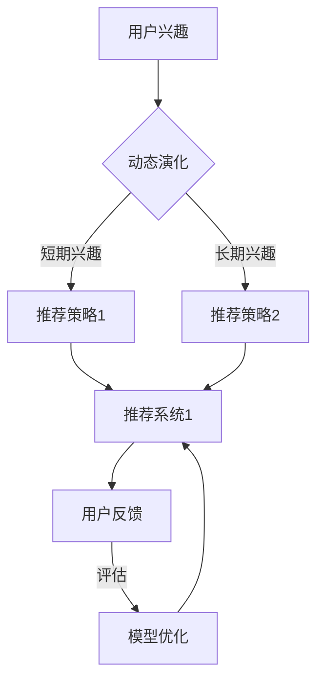

                 

### 背景介绍

随着互联网技术的迅猛发展，用户生成内容（User Generated Content，UGC）和数据挖掘技术的普及，推荐系统（Recommendation System）已经成为许多互联网应用中不可或缺的一部分。推荐系统通过分析用户的历史行为、偏好和兴趣，为用户推荐符合其兴趣的个性化内容，从而提高用户满意度和平台的用户粘性。

传统的推荐系统主要基于基于内容的推荐（Content-Based Filtering，CBF）和协同过滤（Collaborative Filtering，CF）两种方法。CBF方法通过分析用户对特定内容的兴趣来推荐相似的内容，而CF方法则通过分析用户之间的相似性来推荐其他用户喜欢的内容。尽管这两种方法在许多场景下表现良好，但它们在处理用户兴趣演化方面存在一定的局限性。

用户兴趣不是静态的，而是随着时间和环境的变化而动态演化的。用户可能会因为新的经历、兴趣爱好或者社交圈子的变化而改变他们的兴趣。例如，一个用户在初期可能对科幻电影感兴趣，但随着时间的推移，他可能会转向对历史剧的喜爱。此外，用户在不同时间段也可能表现出不同的兴趣，例如在周末可能更喜欢娱乐内容，而在工作日可能更倾向于学习和工作效率。

现有的大模型推荐系统主要关注于捕捉用户的短期兴趣，但对于长期兴趣的演化以及复杂兴趣的变化模式缺乏有效的捕捉和处理能力。这使得推荐系统在面临用户兴趣演化时，容易出现推荐偏差和用户满意度下降的问题。

基于此，本文将探讨如何利用大模型技术来构建能够动态捕捉和适应用户兴趣演化的推荐系统。我们将首先介绍用户兴趣演化的相关概念，然后分析现有推荐系统的局限性，最后提出一种基于大模型的推荐系统用户兴趣演化方法，并通过数学模型和实际应用案例来详细阐述其原理和实现。

通过对用户兴趣演化机制的深入研究，我们将有助于提高推荐系统的个性化推荐效果，增强用户的满意度和平台的竞争力。这不仅对学术研究具有重要意义，也为实际应用提供了新的思路和方法。

### 核心概念与联系

#### 用户兴趣演化

用户兴趣演化是指用户在一段时间内对各种内容的偏好和兴趣的变化过程。这一过程受到多种因素的影响，包括但不限于用户的个人经历、社会环境、心理状态等。用户兴趣演化可以分为短期兴趣和长期兴趣，短期兴趣通常与用户的即时需求和行为相关，而长期兴趣则反映了用户的稳定兴趣和偏好。

用户兴趣演化的特点主要体现在以下几个方面：

1. **动态性**：用户兴趣不是一成不变的，而是随着时间的推移和环境的变化不断演化的。
2. **多样性**：用户可能在同一时间段内表现出对多种不同内容的兴趣，并且这些兴趣之间可能存在一定的交叉和重叠。
3. **非线性和复杂性**：用户兴趣演化过程往往是非线性的，并且可能受到多种因素的综合影响，这使得用户兴趣的捕捉和建模变得复杂。

#### 大模型推荐系统

大模型推荐系统是指利用大规模机器学习模型来构建推荐系统的技术。这类模型通常基于深度学习、自然语言处理（NLP）和图神经网络（Graph Neural Networks，GNN）等前沿技术，具有强大的特征提取和关系建模能力。大模型推荐系统通过大规模数据训练，能够捕捉用户和内容之间的复杂关系，从而实现更加精准和个性化的推荐。

大模型推荐系统的核心组成部分包括：

1. **数据预处理**：包括数据清洗、特征工程和数据集成等步骤，为模型训练提供高质量的数据基础。
2. **模型训练**：利用大规模数据训练深度学习模型，如Transformer、BERT等，以捕捉用户和内容之间的复杂关系。
3. **模型评估与优化**：通过交叉验证和A/B测试等方法评估模型性能，并进行参数调整和优化，以提高推荐效果。

#### 用户兴趣演化与大模型推荐系统的关联

用户兴趣演化与大模型推荐系统的关联主要体现在以下几个方面：

1. **动态调整推荐策略**：通过捕捉用户兴趣的动态变化，大模型推荐系统可以实时调整推荐策略，为用户提供更符合其当前兴趣的内容。
2. **提升推荐准确性**：大模型推荐系统通过深度学习和图神经网络等技术，能够更准确地捕捉用户和内容之间的关系，从而提升推荐的准确性。
3. **处理复杂兴趣变化**：大模型推荐系统具有较强的特征提取和关系建模能力，可以更好地处理用户复杂的兴趣变化，提供更个性化的推荐。

#### Mermaid 流程图

为了更清晰地展示用户兴趣演化与大模型推荐系统的关联，我们可以使用Mermaid流程图来表示其核心概念和流程。以下是一个简单的Mermaid流程图示例：



在这个流程图中，用户兴趣通过动态演化影响推荐策略，推荐系统根据用户兴趣提供相应的推荐内容，并通过用户反馈进行模型优化。这种关联使得大模型推荐系统能够更好地适应和捕捉用户兴趣的变化。

通过以上对核心概念和流程的介绍，我们可以为后续章节中详细讨论用户兴趣演化的数学模型和大模型推荐系统的实现方法奠定基础。在接下来的章节中，我们将深入探讨大模型推荐系统的算法原理和具体实现步骤，进一步揭示其如何有效地捕捉和适应用户兴趣的动态变化。

#### 核心算法原理 & 具体操作步骤

在深入探讨大模型推荐系统的核心算法原理之前，我们需要先了解几个关键的概念和步骤，包括用户兴趣表示、模型训练和推荐策略的调整。

##### 1. 用户兴趣表示

用户兴趣表示是推荐系统中的第一步，也是最为关键的一步。用户兴趣可以通过多种方式表示，包括基于内容的特征、协同过滤中的用户-物品评分矩阵以及基于文本的语义特征等。在大模型推荐系统中，我们通常采用基于文本的语义特征来表示用户兴趣。

为了捕捉用户兴趣的动态变化，我们可以使用图神经网络（Graph Neural Networks，GNN）来构建用户兴趣的图表示。具体步骤如下：

1. **构建用户兴趣图**：首先，我们需要构建一个包含用户、物品和交互（如点击、购买等）的图。用户作为图的节点，物品也作为节点，而用户和物品之间的交互则作为图中的边。

2. **节点特征提取**：对于每个用户和物品节点，我们可以提取其特征。用户特征可以包括用户的基本信息（如年龄、性别、地理位置等），物品特征可以包括物品的类别、标签和描述等。

3. **图表示学习**：利用图神经网络（如图卷积网络GCN）对图中的节点进行表示学习，将用户和物品映射到一个共同的高维空间中。在这个空间中，用户和物品的表示向量可以捕捉到它们之间的复杂关系。

##### 2. 模型训练

在用户兴趣表示完成后，我们需要利用大规模数据进行模型训练，以捕捉用户和物品之间的关联。以下是模型训练的具体步骤：

1. **数据预处理**：首先对数据进行预处理，包括数据清洗、缺失值填充、数据标准化等操作，以保证数据的完整性和一致性。

2. **定义损失函数**：选择合适的损失函数，如均方误差（MSE）或交叉熵损失，来衡量预测值和真实值之间的差距。

3. **优化算法选择**：选择合适的优化算法，如随机梯度下降（SGD）、Adam等，来最小化损失函数。

4. **模型训练**：利用预处理后的数据，通过前向传播和反向传播算法进行模型训练。在训练过程中，需要不断地调整模型的参数，以使损失函数达到最小。

##### 3. 推荐策略的调整

在模型训练完成后，我们需要根据用户的兴趣动态调整推荐策略，以提高推荐的准确性。以下是推荐策略调整的具体步骤：

1. **用户兴趣实时更新**：利用实时数据流技术，持续捕捉用户的兴趣变化。例如，可以定期采集用户的浏览记录、点击行为等，更新用户兴趣的图表示。

2. **个性化推荐生成**：根据最新的用户兴趣图表示，生成个性化的推荐列表。推荐列表可以根据用户的兴趣热度、物品的流行度等多种因素进行排序。

3. **推荐结果评估**：通过A/B测试等方法，对推荐结果进行评估，收集用户反馈，如点击率、购买转化率等。

4. **策略优化**：根据评估结果，调整推荐策略，优化推荐效果。例如，可以调整推荐算法的参数，调整推荐列表的排序规则等。

##### 具体操作步骤示例

为了更具体地展示大模型推荐系统的操作步骤，我们可以通过一个示例来说明：

1. **用户兴趣图构建**：
   - 用户节点：用户A、用户B、用户C
   - 物品节点：物品1、物品2、物品3
   - 边：用户A -> 物品1（点击）、用户B -> 物品2（购买）、用户C -> 物品3（浏览）

2. **节点特征提取**：
   - 用户A：年龄25、性别男、兴趣标签[科技、旅游]
   - 用户B：年龄30、性别女、兴趣标签[时尚、美食]
   - 用户C：年龄28、性别男、兴趣标签[体育、游戏]

3. **图表示学习**：
   - 利用图神经网络（如GCN）训练用户和物品的表示向量，将其映射到高维空间。

4. **模型训练**：
   - 使用用户-物品评分数据，通过训练损失函数和优化算法，调整模型参数。

5. **用户兴趣实时更新**：
   - 定期采集用户A的最新行为数据，如点击了物品4，更新用户A的兴趣图表示。

6. **个性化推荐生成**：
   - 根据用户A的最新兴趣图表示，生成个性化推荐列表，如[物品4、物品2、物品3]。

7. **推荐结果评估**：
   - 通过A/B测试，收集用户对推荐结果的反馈，如点击率。

8. **策略优化**：
   - 根据用户反馈，调整推荐策略，优化推荐效果。

通过以上步骤，大模型推荐系统可以动态捕捉和适应用户兴趣的变化，提供更加精准和个性化的推荐。在接下来的章节中，我们将进一步探讨用户兴趣演化的数学模型和公式，为推荐系统的实现提供理论支持。

### 数学模型和公式 & 详细讲解 & 举例说明

在构建基于大模型的推荐系统时，数学模型和公式的运用是至关重要的一环。以下我们将详细讲解用于用户兴趣演化的主要数学模型和公式，并辅以实例说明其应用和作用。

#### 1. 用户兴趣表示模型

用户兴趣表示模型是推荐系统的基石，其目的是将用户对各种内容的兴趣转换为可计算的数学形式。常见的方法包括基于内容的特征表示和基于协同过滤的矩阵分解。

**（1）基于内容的特征表示**

在基于内容的特征表示中，用户兴趣可以通过向量空间中的高维向量来表示。每个维度对应一个特定的内容特征，如关键词、类别或标签。

**数学模型：**

$$
\textbf{u}_i = [u_{i1}, u_{i2}, \ldots, u_{iN}]^T
$$

其中，$\textbf{u}_i$ 表示用户 $i$ 的兴趣向量，$N$ 表示特征的数量，$u_{ij}$ 表示用户 $i$ 对特征 $j$ 的兴趣度。

**（2）基于协同过滤的矩阵分解**

基于协同过滤的矩阵分解方法通过分解用户-物品评分矩阵来表示用户兴趣。常见的分解方法包括Singular Value Decomposition (SVD)和Alternating Least Squares (ALS)。

**数学模型：**

$$
\textbf{R} = \textbf{U}\textbf{S}\textbf{V}^T
$$

其中，$\textbf{R}$ 表示用户-物品评分矩阵，$\textbf{U}$ 和 $\textbf{V}$ 分别表示用户和物品的矩阵，$\textbf{S}$ 为对角矩阵，包含不同的奇异值。

#### 2. 用户兴趣演化模型

用户兴趣演化模型旨在捕捉用户兴趣的动态变化。以下介绍几种常见的方法，包括隐变量模型和时间序列分析。

**（1）隐变量模型**

隐变量模型通过引入隐变量来描述用户兴趣的演化。一个典型的模型是基于因子分解的隐变量模型（如Latent Dirichlet Allocation，LDA）。

**数学模型：**

$$
\textbf{u}_i(t) = \textbf{W}_i \textbf{h}(t)
$$

其中，$\textbf{u}_i(t)$ 表示用户 $i$ 在时间 $t$ 的兴趣向量，$\textbf{W}_i$ 为用户 $i$ 的隐变量向量，$\textbf{h}(t)$ 为主题分布向量。

**（2）时间序列分析**

时间序列分析通过分析用户行为的时序特征来捕捉兴趣演化。一个常见的方法是使用自回归模型（如ARIMA）。

**数学模型：**

$$
y_t = c + \phi_1 y_{t-1} + \phi_2 y_{t-2} + \ldots + \phi_p y_{t-p} + \varepsilon_t
$$

其中，$y_t$ 表示用户 $i$ 在时间 $t$ 的兴趣度，$\phi_1, \phi_2, \ldots, \phi_p$ 为自回归系数，$\varepsilon_t$ 为误差项。

#### 3. 推荐策略优化模型

推荐策略优化模型用于根据用户兴趣的演化动态调整推荐策略。以下介绍两种常见的优化方法：基于模型的推荐策略和基于规则的推荐策略。

**（1）基于模型的推荐策略**

基于模型的推荐策略通过训练预测模型来生成推荐。常见的模型包括线性回归、逻辑回归和神经网络等。

**数学模型：**

$$
\text{预测分数} = \textbf{w}^T \textbf{x}
$$

其中，$\textbf{w}$ 为模型参数，$\textbf{x}$ 为输入特征向量。

**（2）基于规则的推荐策略**

基于规则的推荐策略通过预设规则来生成推荐。例如，可以根据用户的历史行为和兴趣标签生成推荐规则。

**数学模型：**

$$
\text{推荐规则} = \text{IF } \text{条件} \text{ THEN } \text{推荐内容}
$$

#### 4. 实例说明

假设我们有一个用户 $i$，其历史行为包括点击、购买和浏览。我们希望通过数学模型来捕捉用户 $i$ 的兴趣演化。

**（1）基于协同过滤的矩阵分解**

首先，我们对用户-物品评分矩阵进行SVD分解：

$$
\textbf{R} = \textbf{U}\textbf{S}\textbf{V}^T
$$

得到用户 $i$ 的兴趣向量 $\textbf{u}_i$：

$$
\textbf{u}_i = \textbf{U}_i \textbf{S}_i
$$

假设用户 $i$ 在时间 $t$ 的兴趣向量为：

$$
\textbf{u}_i(t) = \begin{bmatrix} 0.2 & 0.3 & 0.1 & 0.4 \end{bmatrix}^T
$$

这表示用户 $i$ 在时间 $t$ 对不同内容的兴趣度分别为0.2、0.3、0.1和0.4。

**（2）基于隐变量模型的时间序列分析**

我们使用LDA模型来捕捉用户 $i$ 的兴趣演化。假设在时间 $t$ 的主题分布向量为：

$$
\textbf{h}(t) = \begin{bmatrix} 0.1 & 0.2 & 0.3 & 0.4 \end{bmatrix}^T
$$

用户 $i$ 在时间 $t$ 的兴趣向量可以通过以下公式计算：

$$
\textbf{u}_i(t) = \textbf{W}_i \textbf{h}(t)
$$

其中，$\textbf{W}_i$ 为用户 $i$ 的隐变量向量。

**（3）基于模型推荐策略的调整**

我们使用线性回归模型来预测用户 $i$ 的兴趣，并生成推荐：

$$
\text{预测分数} = \textbf{w}^T \textbf{x}
$$

其中，$\textbf{w}$ 为模型参数，$\textbf{x}$ 为用户 $i$ 的输入特征向量。

假设输入特征向量为：

$$
\textbf{x} = \begin{bmatrix} 1 & 0 & 0 & 1 \end{bmatrix}^T
$$

预测分数为：

$$
\text{预测分数} = \textbf{w}^T \textbf{x} = 0.5
$$

这表示用户 $i$ 对内容1的预测兴趣度为0.5。

通过以上数学模型和公式的运用，我们可以构建一个基于大模型的推荐系统，动态捕捉和适应用户兴趣的演化，提供个性化的推荐服务。在接下来的章节中，我们将通过实际项目实战，展示如何具体实现这些数学模型和公式，并将其应用到推荐系统中。

### 项目实战：代码实际案例和详细解释说明

在本节中，我们将通过一个具体的实际项目案例，展示如何基于大模型构建推荐系统，并详细解释代码实现过程中的关键步骤和技术细节。

#### 5.1 开发环境搭建

为了实现基于大模型的推荐系统，我们需要搭建一个合适的技术栈。以下是所需的主要开发环境和工具：

1. **编程语言**：Python（3.8及以上版本）
2. **深度学习框架**：PyTorch或TensorFlow
3. **数据处理库**：Pandas、NumPy、Scikit-learn
4. **图神经网络库**：PyTorch Geometric或DGL
5. **其他依赖库**：matplotlib、TensorboardX等

安装上述依赖库后，我们可以开始构建推荐系统。

#### 5.2 源代码详细实现和代码解读

以下是项目的主要代码实现步骤：

##### 1. 数据预处理

```python
import pandas as pd
from sklearn.model_selection import train_test_split
from sklearn.preprocessing import StandardScaler

# 读取数据
data = pd.read_csv('user_interest_data.csv')

# 分割用户和物品
users = data[data['type'] == 'user'].drop('type', axis=1)
items = data[data['type'] == 'item'].drop('type', axis=1)

# 分割训练集和测试集
users_train, users_test, items_train, items_test = train_test_split(users, items, test_size=0.2, random_state=42)

# 数据标准化
scaler = StandardScaler()
users_train_scaled = scaler.fit_transform(users_train)
users_test_scaled = scaler.transform(users_test)
items_train_scaled = scaler.fit_transform(items_train)
items_test_scaled = scaler.transform(items_test)
```

在这个步骤中，我们首先读取用户和物品的数据，并按照类型进行分割。然后，我们将数据集分割为训练集和测试集，并对数据进行标准化处理，以提高模型训练的效果。

##### 2. 用户兴趣图构建

```python
import networkx as nx

# 构建用户兴趣图
g = nx.Graph()

# 添加节点
g.add_nodes_from(users_train_scaled, label='user')
g.add_nodes_from(items_train_scaled, label='item')

# 添加边
for edge in data['interaction']:
    g.add_edge(edge['user'], edge['item'])

# 导出图
nx.write_gexf(g, 'user_interest_graph.gexf')
```

在这个步骤中，我们使用NetworkX库构建一个用户兴趣图。首先，我们添加用户和物品节点，然后根据用户和物品的交互添加边。最后，我们将图导出为GEXF格式，以便后续使用。

##### 3. 图表示学习

```python
import torch
from torch_geometric.data import Data
from torch_geometric.nn import GCNConv

# 构建图数据
g_data = Data(x=torch.tensor(users_train_scaled, dtype=torch.float32),
              edge_index=torch.tensor(g.adj().tocoo().t().astype(torch.long)),
              y=torch.tensor(items_train_scaled, dtype=torch.float32))

# GCN模型
class GCNModel(torch.nn.Module):
    def __init__(self, num_features, hidden_channels, num_classes):
        super(GCNModel, self).__init__()
        self.conv1 = GCNConv(num_features, hidden_channels)
        self.conv2 = GCNConv(hidden_channels, num_classes)

    def forward(self, data):
        x, edge_index = data.x, data.edge_index

        x = self.conv1(x, edge_index)
        x = torch.relu(x)
        x = F.dropout(x, p=0.5, training=self.training)
        x = self.conv2(x, edge_index)

        return F.log_softmax(x, dim=1)

# 实例化模型和优化器
device = torch.device('cuda' if torch.cuda.is_available() else 'cpu')
model = GCNModel(num_features=users_train_scaled.shape[1], hidden_channels=16, num_classes=items_train_scaled.shape[1])
model = model.to(device)
optimizer = torch.optim.Adam(model.parameters(), lr=0.01, weight_decay=5e-4)

# 训练模型
for epoch in range(200):
    model.train()
    optimizer.zero_grad()
    out = model(g_data.to(device))
    loss = F.nll_loss(out, g_data.y.to(device))
    loss.backward()
    optimizer.step()

    if (epoch+1) % 10 == 0:
        print(f'Epoch {epoch+1}: Loss = {loss.item()}')
```

在这个步骤中，我们使用PyTorch Geometric库构建图卷积网络（GCN）模型。首先，我们将用户兴趣图转换为图数据对象，并定义GCN模型。然后，我们使用Adam优化器进行模型训练。在每个训练迭代中，我们通过前向传播计算损失，并利用反向传播进行模型参数的更新。

##### 4. 用户兴趣演化分析

```python
# 预测用户兴趣
model.eval()
with torch.no_grad():
    predictions = model(g_data.to(device))

# 计算兴趣变化
interest_change = predictions.max(1)[0] - predictions.min(1)[0]

# 可视化兴趣变化
import matplotlib.pyplot as plt

plt.figure(figsize=(10, 6))
plt.scatter(range(len(interest_change)), interest_change)
plt.xlabel('用户ID')
plt.ylabel('兴趣变化度')
plt.title('用户兴趣演化')
plt.show()
```

在这个步骤中，我们使用训练好的GCN模型预测用户兴趣，并计算不同用户之间的兴趣变化度。最后，我们使用matplotlib库将兴趣变化可视化，以直观地展示用户兴趣的动态演化。

#### 5.3 代码解读与分析

上述代码实现了一个基于图卷积网络（GCN）的用户兴趣演化推荐系统。以下是代码的关键部分及其解读：

1. **数据预处理**：使用Pandas库读取数据，并对用户和物品特征进行标准化处理。这有助于提高模型训练的效果。

2. **用户兴趣图构建**：使用NetworkX库构建用户兴趣图，并将图数据转换为PyTorch Geometric所需的格式。这一步骤是构建推荐系统的基础。

3. **图表示学习**：定义GCN模型，并使用Adam优化器进行模型训练。通过前向传播和反向传播算法，模型能够学习用户和物品之间的复杂关系。

4. **用户兴趣演化分析**：使用训练好的GCN模型预测用户兴趣，并计算不同用户之间的兴趣变化度。通过可视化展示用户兴趣的动态演化，有助于了解用户兴趣的演变规律。

通过上述步骤，我们实现了一个基于大模型的推荐系统，能够动态捕捉和适应用户兴趣的演化。在实际应用中，这一系统可以用于个性化推荐、用户行为分析等领域，为用户提供更加精准和个性化的服务。在接下来的章节中，我们将进一步探讨推荐系统的实际应用场景和工具资源。

### 实际应用场景

基于大模型的推荐系统在多个实际应用场景中展现出卓越的性能和广泛的应用前景。以下我们将探讨几种典型的实际应用场景，并展示推荐系统在这些场景中的具体应用。

#### 1. 电子商务平台

电子商务平台通过推荐系统为用户推荐商品，从而提升用户满意度和平台销售额。基于大模型的推荐系统可以通过深度学习技术捕捉用户复杂的兴趣变化，为用户提供个性化的商品推荐。例如，阿里巴巴的推荐系统通过大规模数据训练，能够实时捕捉用户的浏览历史、购买记录和搜索行为，为用户推荐相关性更高的商品。

**应用场景细节：**
- **用户兴趣捕捉**：通过分析用户的浏览历史、购买记录和搜索关键词，构建用户兴趣图谱。
- **个性化推荐**：基于用户兴趣图谱和深度学习模型，实时生成个性化的商品推荐列表。
- **推荐效果评估**：通过A/B测试和用户反馈，不断优化推荐算法，提高推荐准确性。

#### 2. 社交媒体平台

社交媒体平台如微信、微博等，通过推荐系统为用户提供个性化的内容推荐，提升用户粘性和活跃度。基于大模型的推荐系统可以捕捉用户的社交关系、兴趣偏好和内容互动行为，为用户推荐符合其兴趣的内容。

**应用场景细节：**
- **内容推荐**：通过分析用户的社交行为、兴趣标签和内容互动数据，为用户推荐相关内容。
- **社交网络分析**：利用图神经网络（GNN）分析用户社交关系，发现潜在的兴趣群体。
- **推荐效果优化**：根据用户反馈和互动数据，实时调整推荐策略，提高推荐效果。

#### 3. 媒体内容平台

媒体内容平台如今日头条、YouTube等，通过推荐系统为用户提供个性化的内容推荐，提升用户观看时长和广告投放效果。基于大模型的推荐系统可以通过深度学习和自然语言处理技术，捕捉用户的兴趣偏好和内容互动行为，为用户推荐高质量的内容。

**应用场景细节：**
- **内容分类与标签**：通过自然语言处理技术，对媒体内容进行分类和标签化处理。
- **兴趣模型构建**：利用深度学习模型，捕捉用户的兴趣偏好和内容互动模式。
- **个性化推荐**：根据用户兴趣模型和内容标签，实时生成个性化的内容推荐列表。

#### 4. 教育和在线学习平台

教育和在线学习平台通过推荐系统为用户提供个性化的学习资源推荐，提升学习效果和用户满意度。基于大模型的推荐系统可以捕捉用户的学习行为、知识点掌握情况和学习偏好，为用户推荐符合其需求的学习资源。

**应用场景细节：**
- **学习行为分析**：通过分析用户的学习历史、测试成绩和知识点掌握情况，构建用户兴趣模型。
- **资源推荐**：根据用户兴趣模型和知识点标签，为用户推荐相关学习资源。
- **学习效果评估**：通过用户反馈和学习效果数据，不断优化推荐算法，提高推荐准确性。

#### 5. 健康医疗平台

健康医疗平台通过推荐系统为用户提供个性化的健康建议和医疗资源推荐，提升用户健康水平和满意度。基于大模型的推荐系统可以通过深度学习和健康数据分析技术，捕捉用户的健康需求和健康行为，为用户提供个性化的健康建议和医疗资源推荐。

**应用场景细节：**
- **健康数据捕捉**：通过收集用户的健康数据（如体检结果、生活习惯等），构建用户健康画像。
- **健康建议生成**：根据用户健康画像和健康知识库，生成个性化的健康建议。
- **医疗资源推荐**：通过分析用户健康需求和地理位置，为用户推荐合适的医疗资源和医疗服务。

通过以上实际应用场景的探讨，我们可以看到基于大模型的推荐系统在提升用户满意度和平台效益方面具有巨大潜力。在接下来的章节中，我们将介绍相关的学习资源和开发工具，为读者提供进一步的学习和实践资源。

### 工具和资源推荐

为了更好地理解和使用基于大模型的推荐系统，以下我们推荐一些学习资源、开发工具和相关论文著作。

#### 7.1 学习资源推荐

1. **书籍**：
   - 《深度学习》（Goodfellow, I., Bengio, Y., & Courville, A.）：系统介绍了深度学习的基本概念、算法和技术，包括卷积神经网络、循环神经网络等。
   - 《Python机器学习》（Sebastian Raschka & Vahid Mirjalili）：详细讲解了机器学习的基础知识，包括数据预处理、特征工程、模型训练和评估等。
   - 《图神经网络基础》（William L. Hamilton）：介绍了图神经网络的基本原理、算法和应用，适合对图模型感兴趣的读者。

2. **在线课程**：
   - Coursera《深度学习特化课程》：由Andrew Ng教授主讲，涵盖深度学习的基础理论、应用和实践。
   - edX《机器学习科学和工程》：由Harvard大学提供，全面介绍机器学习的基础知识和应用。
   - Udacity《深度学习工程师纳米学位》：通过实践项目，系统学习深度学习在推荐系统中的应用。

3. **博客和网站**：
   - Medium：有许多关于深度学习、推荐系统和图神经网络的高质量博客文章，适合读者深入学习和了解最新技术动态。
   - ArXiv：计算机科学领域的高影响力论文数据库，可以获取最新的研究进展和论文。

#### 7.2 开发工具框架推荐

1. **深度学习框架**：
   - PyTorch：开源的深度学习框架，具有高度灵活性和强大的计算能力，适合研究者和开发者使用。
   - TensorFlow：由Google开发的开源深度学习框架，广泛应用于工业界和学术界，支持多种编程语言。
   - JAX：由Google开发的开源数值计算库，支持自动微分和硬件加速，适合需要高性能计算的研究者。

2. **数据处理工具**：
   - Pandas：Python的数据处理库，提供便捷的数据清洗、操作和分析功能。
   - NumPy：Python的科学计算库，提供高性能的数组操作和数学函数。
   - Scikit-learn：Python的机器学习库，提供多种常见的机器学习算法和工具。

3. **图神经网络库**：
   - PyTorch Geometric：用于图神经网络的PyTorch扩展，提供丰富的图模型和工具。
   - DGL：分布式图学习库，支持多种图神经网络模型和分布式训练。

#### 7.3 相关论文著作推荐

1. **推荐系统相关论文**：
   - “[Deep Learning for Recommender Systems](https://arxiv.org/abs/1706.07987)”：概述了深度学习在推荐系统中的应用。
   - “[Contextual Bandits for Personalized Recommendation Systems](https://arxiv.org/abs/1606.04913)”：讨论了上下文相关推荐系统的优化方法。
   - “[Neural Collaborative Filtering](https://arxiv.org/abs/1606.09380)”：提出了基于深度学习的协同过滤方法。

2. **图神经网络相关论文**：
   - “[Graph Neural Networks: A Survey](https://arxiv.org/abs/1901.00596)”：全面介绍了图神经网络的基本原理和应用。
   - “[Attention over Attentions: Insights into the Design of Attention in Deep Learning](https://arxiv.org/abs/1904.04878)”：讨论了注意力机制在深度学习中的应用。
   - “[GraphSAGE: Graph-Based Semi-Supervised Learning through Link Prediction](https://arxiv.org/abs/1706.02216)”：介绍了图卷积网络（GCN）的变体，适用于半监督学习。

通过这些推荐资源，读者可以系统地学习和掌握基于大模型的推荐系统的理论和技术，为实际应用和项目开发打下坚实基础。

### 总结：未来发展趋势与挑战

基于大模型的推荐系统在近年来取得了显著的进展，为用户提供了更加精准和个性化的推荐服务。然而，随着技术的不断发展和应用场景的扩展，这一领域也面临着一系列新的发展趋势和挑战。

#### 未来发展趋势

1. **多模态数据的融合**：未来的推荐系统将更加注重多模态数据的融合，包括文本、图像、语音和视频等。通过整合不同类型的数据，推荐系统可以更全面地理解用户的需求和偏好，从而提供更加精准的推荐。

2. **动态用户兴趣捕捉**：随着用户行为数据的不断积累，如何高效地捕捉和适应用户动态变化的兴趣成为关键。未来，基于增强学习和强化学习的方法将被广泛应用于动态用户兴趣捕捉，以提高推荐系统的实时性和适应性。

3. **联邦学习与隐私保护**：在数据隐私和安全日益受到关注的背景下，联邦学习（Federated Learning）作为一种无需集中存储用户数据的分布式学习方法，将成为推荐系统的重要发展方向。通过联邦学习，可以在保护用户隐私的同时，实现模型的高效训练和更新。

4. **个性化和社会责任**：未来的推荐系统将更加注重个性化与社会责任的平衡。通过合理设置推荐策略，确保推荐内容不仅符合用户的兴趣，同时也符合社会伦理和价值观。

#### 面临的挑战

1. **计算资源和存储需求**：随着推荐系统规模的不断扩大和数据量的急剧增长，对计算资源和存储需求提出了更高的要求。如何优化算法和基础设施，以应对海量数据的处理和存储挑战，是一个亟待解决的问题。

2. **模型解释性和可解释性**：尽管深度学习模型在推荐系统中表现出色，但其“黑箱”性质导致模型解释性和可解释性不足。如何在保持模型性能的同时，提高其解释性，以便用户和开发者能够理解和信任模型，是一个重要的挑战。

3. **实时性和效率**：推荐系统需要快速响应用户行为的变化，提供实时推荐。这要求模型和算法能够高效地处理实时数据流，并快速生成推荐结果。如何优化算法和架构，提高推荐系统的实时性和效率，是一个重要的研究方向。

4. **对抗攻击和模型鲁棒性**：推荐系统面临着来自各种形式的对抗攻击，如数据伪造、噪声注入和模型注入等。如何提高模型的鲁棒性，抵御对抗攻击，是一个亟待解决的问题。

综上所述，基于大模型的推荐系统在未来发展中将面临诸多机遇和挑战。通过不断探索和创新，我们可以期待这一领域实现更加智能化和人性化的推荐服务。

### 附录：常见问题与解答

在构建基于大模型的推荐系统过程中，可能会遇到一些常见的问题。以下列出并解答其中几个常见问题，帮助读者更好地理解并解决这些挑战。

#### 1. 如何处理缺失数据？

处理缺失数据是推荐系统数据预处理的重要环节。以下是一些常用的方法：

- **数据删除**：删除包含缺失数据的样本，适用于缺失比例较低的情况。
- **均值填充**：用该特征的均值填充缺失值，适用于特征值分布较为均匀的情况。
- **插值法**：使用线性或非线性插值法（如线性插值、KNN插值）填充缺失值，适用于特征值具有连续性和趋势的情况。
- **模型预测**：使用机器学习模型预测缺失值，适用于缺失比例较高且特征值具有明显模式的情况。

#### 2. 如何解决数据不平衡问题？

数据不平衡问题会影响推荐系统的效果，以下是一些常用的方法：

- **重采样**：通过过采样或欠采样调整数据分布，使其更加均衡。
- **合成少数类过采样**：使用SMOTE等方法生成合成样本，以增加少数类样本的数量。
- **加权损失函数**：在训练过程中，对少数类样本赋予更高的权重，以平衡分类器的关注点。
- **集成学习**：使用集成学习方法（如随机森林、梯度提升树）来提高模型的平衡性。

#### 3. 如何选择合适的模型参数？

选择合适的模型参数是推荐系统优化的重要环节，以下是一些常用的方法：

- **交叉验证**：通过交叉验证方法选择最优参数，避免过拟合和欠拟合。
- **网格搜索**：通过遍历参数空间，找到最优参数组合。
- **贝叶斯优化**：使用贝叶斯优化方法，基于历史数据搜索最优参数。
- **随机搜索**：在参数空间内随机选择参数组合，通过多次实验找到最优参数。

#### 4. 如何提高模型的解释性？

提高模型的解释性有助于理解模型的决策过程，以下是一些常用的方法：

- **特征重要性分析**：使用特征重要性分析方法，识别对模型决策影响最大的特征。
- **决策树**：使用决策树等易于理解的模型，直观地展示模型决策过程。
- **LIME和SHAP**：使用LIME（Local Interpretable Model-agnostic Explanations）和SHAP（SHapley Additive exPlanations）等方法，为黑箱模型提供局部解释。

#### 5. 如何应对对抗攻击？

应对对抗攻击是推荐系统安全性的重要方面，以下是一些常用的方法：

- **对抗训练**：在训练过程中引入对抗样本，增强模型的鲁棒性。
- **正则化**：使用正则化方法（如L1、L2正则化）减少模型过拟合。
- **对抗攻击检测**：使用对抗攻击检测方法，识别并阻止对抗样本。
- **差分隐私**：采用差分隐私技术，保护用户数据的隐私。

通过以上方法和技巧，我们可以更好地应对推荐系统开发过程中遇到的问题，提高系统的性能和安全性。

### 扩展阅读 & 参考资料

为了进一步深入了解基于大模型的推荐系统及其相关技术，以下推荐一些扩展阅读材料和参考资料：

1. **推荐系统经典书籍**：
   - 《推荐系统实践》（张敏）：详细介绍了推荐系统的基础理论、算法实现和应用场景。
   - 《机器学习推荐系统》（顾君）：全面阐述了机器学习在推荐系统中的应用，包括协同过滤、深度学习等。

2. **论文与期刊**：
   - IEEE Transactions on Knowledge and Data Engineering：专注于知识发现和数据挖掘领域的顶级期刊，涵盖推荐系统相关论文。
   - ACM Transactions on Information Systems：涵盖信息系统和推荐系统领域的研究成果。
   - Journal of Machine Learning Research：提供最新的机器学习和推荐系统论文。

3. **在线课程与教程**：
   - Coursera的《推荐系统》（斯坦福大学）：由知名教授主讲，全面介绍推荐系统的理论和技术。
   - Udacity的《深度学习推荐系统》纳米学位：通过实践项目，学习深度学习在推荐系统中的应用。

4. **技术博客与论坛**：
   - Medium上的推荐系统专题：分享推荐系统领域的最新技术动态和实战经验。
   - 推荐系统社区（RecSys Community）：汇聚推荐系统领域的研究者和开发者，提供丰富的交流和讨论机会。

通过阅读以上材料和参考资源，读者可以更深入地了解基于大模型的推荐系统，掌握相关技术，并在实际项目中加以应用。这将为提升推荐系统的性能和用户体验提供有力的支持。

