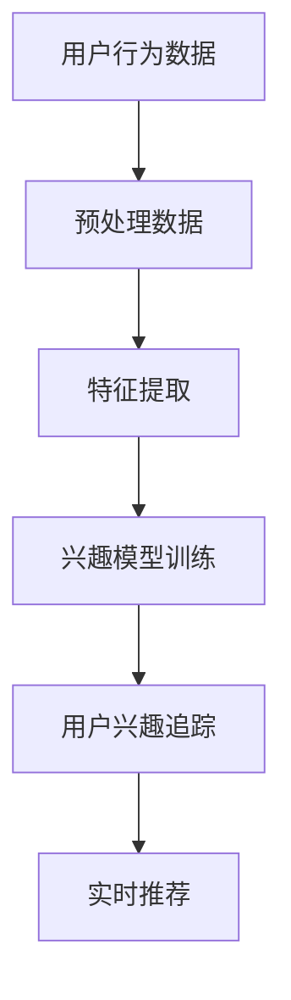

                 

# 基于大模型的推荐系统用户兴趣追踪

## 摘要

本文将深入探讨基于大模型的推荐系统在用户兴趣追踪方面的应用。随着互联网的迅猛发展，推荐系统已成为各类在线服务的重要组成部分，它通过分析用户行为和兴趣，为用户提供个性化的内容推荐。本文将介绍推荐系统的基本概念，探讨大模型在推荐系统中的重要性，并详细分析用户兴趣追踪的算法原理和具体实施步骤。通过实例分析、代码实现和实际应用场景的介绍，本文旨在为读者提供一个全面而深入的理解，帮助读者掌握基于大模型推荐系统的用户兴趣追踪技术。

## 1. 背景介绍

推荐系统作为一种信息过滤技术，旨在根据用户的兴趣和偏好，向其推荐可能感兴趣的内容或产品。推荐系统广泛应用于电子商务、社交媒体、新闻资讯、视频网站等众多领域，极大地提升了用户体验和满意度。

在传统的推荐系统中，基于协同过滤（Collaborative Filtering）和基于内容推荐（Content-Based Filtering）的方法占据了主导地位。协同过滤通过分析用户之间的相似性，发现相似的群体，从而为用户推荐相似内容；而基于内容推荐则通过分析用户的历史行为和内容特征，为用户推荐具有相似特征的内容。这两种方法在一定程度上满足了用户的个性化需求，但存在如下局限：

1. **数据稀疏问题**：协同过滤依赖于用户行为数据，而用户行为数据往往是稀疏的，尤其在冷启动问题（新用户或新物品无足够行为数据）下，推荐效果不佳。
2. **用户兴趣变化**：用户兴趣是动态变化的，传统的推荐系统往往难以捕捉到这种变化，导致推荐效果不稳定。

为了克服上述问题，近年来，基于深度学习的推荐系统逐渐受到关注。深度学习模型具有强大的特征表示和建模能力，能够从大量数据中提取深层特征，从而实现更精准的推荐。特别是大模型（如Transformer、BERT等）在推荐系统中的应用，使得用户兴趣追踪变得更加准确和高效。

大模型的优势主要体现在以下几个方面：

1. **丰富的特征表示**：大模型通过多层神经网络结构，能够对输入数据进行层次化、抽象化的特征提取，从而捕捉到用户行为背后的深层次特征。
2. **端到端的学习**：大模型能够直接从原始数据中学习到特征表示和预测目标，避免了传统方法中特征工程和模型融合的繁琐步骤。
3. **自适应能力**：大模型能够通过自我调整参数，适应不断变化的数据和用户行为，从而实现长期稳定的推荐效果。

本文将围绕大模型在推荐系统中的应用，深入探讨用户兴趣追踪的技术原理和实施步骤，为读者提供一次全面而深入的探讨。

## 2. 核心概念与联系

### 2.1 推荐系统的基本概念

推荐系统（Recommender System）是一种利用数据挖掘和机器学习技术，分析用户行为和偏好，从而预测用户可能感兴趣的项目，并向其推荐相关内容或产品的一种系统。推荐系统主要包括以下几个基本概念：

1. **用户（User）**：推荐系统的核心，其行为和偏好是推荐系统分析的主要对象。
2. **项目（Item）**：推荐系统中的内容或产品，可以是书籍、电影、商品等。
3. **行为（Behavior）**：用户在系统中产生的操作，如点击、购买、评价等。
4. **评分（Rating）**：用户对项目的评价，可以是数值评分或等级评分。
5. **推荐列表（Recommendation List）**：推荐系统根据用户行为和偏好，为用户生成的个性化推荐内容列表。

### 2.2 大模型在推荐系统中的重要性

大模型（Large Models）是指参数数量庞大、计算资源需求高的深度学习模型。近年来，大模型在自然语言处理（NLP）、计算机视觉（CV）、推荐系统等领域取得了显著的进展。在推荐系统中，大模型的重要性主要体现在以下几个方面：

1. **特征表示能力**：大模型能够从原始数据中提取丰富的特征表示，使得推荐系统更加精准。例如，BERT（Bidirectional Encoder Representations from Transformers）模型能够对用户行为和项目特征进行双向编码，从而捕捉到更深层次的语义信息。
2. **端到端学习**：大模型能够直接从原始数据中学习特征表示和预测目标，避免了传统方法中特征工程和模型融合的繁琐步骤，提高了推荐效率。
3. **自适应能力**：大模型具有自我调整参数的能力，能够适应不断变化的数据和用户行为，从而实现长期稳定的推荐效果。

### 2.3 用户兴趣追踪的概念和目标

用户兴趣追踪（User Interest Tracking）是指通过分析用户行为和偏好，动态捕捉用户兴趣点，并实时调整推荐策略的过程。其核心目标包括：

1. **捕捉用户兴趣变化**：用户兴趣是动态变化的，用户兴趣追踪旨在捕捉到这种变化，从而提供更准确的推荐。
2. **个性化推荐**：通过追踪用户兴趣，推荐系统能够为用户提供更加个性化的内容推荐，提升用户体验。
3. **长期稳定推荐**：用户兴趣追踪需要具备长期稳定的能力，以保证推荐效果的持续优化。

### 2.4 用户兴趣追踪的算法原理

用户兴趣追踪主要依赖于以下几种算法：

1. **基于协同过滤的算法**：通过分析用户行为数据，发现相似的用户群体，为用户提供相似内容的推荐。
2. **基于内容推荐的算法**：通过分析项目特征和用户历史行为，为用户推荐具有相似特征的项目。
3. **基于深度学习的算法**：利用深度学习模型，从原始数据中提取深层特征，实现更精准的兴趣追踪。

其中，基于深度学习的算法在用户兴趣追踪中具有显著优势。例如，Transformer模型通过自注意力机制（Self-Attention Mechanism），能够捕捉用户行为和项目特征之间的复杂关系，从而实现高效的兴趣追踪。

### 2.5 Mermaid 流程图

为了更直观地展示用户兴趣追踪的过程，我们使用Mermaid流程图（Mermaid流程节点中不要有括号、逗号等特殊字符）描述如下：



### 2.6 用户兴趣追踪的具体实施步骤

用户兴趣追踪的具体实施步骤包括以下几个阶段：

1. **数据收集与预处理**：收集用户行为数据，并进行数据清洗、去重和格式化处理。
2. **特征提取**：利用深度学习模型提取用户行为和项目特征的深层表示。
3. **兴趣模型训练**：使用提取的特征，训练兴趣模型，实现用户兴趣的捕捉和追踪。
4. **用户兴趣追踪**：实时跟踪用户兴趣变化，调整推荐策略。
5. **实时推荐**：根据用户兴趣，生成个性化的推荐列表。

通过以上步骤，推荐系统能够实现高效的用户兴趣追踪，为用户提供个性化的内容推荐。

## 3. 核心算法原理 & 具体操作步骤

### 3.1 基于深度学习的推荐系统框架

深度学习在推荐系统中的应用主要依赖于其强大的特征提取和建模能力。在基于深度学习的推荐系统中，我们通常采用以下架构：

1. **用户行为编码器**：对用户的历史行为数据进行编码，提取用户特征。
2. **项目特征编码器**：对项目特征进行编码，提取项目特征。
3. **兴趣模型**：利用用户特征和项目特征，训练一个兴趣模型，实现用户兴趣的捕捉和追踪。
4. **推荐生成器**：根据兴趣模型，为用户生成个性化的推荐列表。

### 3.2 用户行为编码器的实现

用户行为编码器是推荐系统的核心组件，其任务是将用户的历史行为数据转化为能够表示用户兴趣的向量表示。通常，我们采用以下方法实现用户行为编码器：

1. **嵌入层（Embedding Layer）**：将用户行为数据映射到一个高维空间，为每个行为赋予一个唯一的向量表示。这一步可以通过预训练的词向量（如Word2Vec、GloVe）来实现。
2. **编码器网络（Encoder Network）**：对嵌入层输出的向量进行编码，提取更深层次的用户特征。通常，我们可以采用Transformer、BERT等预训练模型作为编码器网络。
3. **序列处理（Sequence Processing）**：对用户行为序列进行处理，以捕捉用户行为之间的时序关系。这一步可以通过Transformer模型中的自注意力机制（Self-Attention Mechanism）来实现。

### 3.3 项目特征编码器的实现

项目特征编码器的任务是提取项目特征，并将其转化为向量表示。与用户行为编码器类似，我们可以采用以下方法实现项目特征编码器：

1. **嵌入层（Embedding Layer）**：将项目特征映射到一个高维空间，为每个项目赋予一个唯一的向量表示。这一步可以通过预训练的词向量（如Word2Vec、GloVe）来实现。
2. **编码器网络（Encoder Network）**：对嵌入层输出的向量进行编码，提取更深层次的项目特征。同样，我们可以采用Transformer、BERT等预训练模型作为编码器网络。
3. **特征融合（Feature Fusion）**：将用户特征和项目特征进行融合，以生成一个包含用户兴趣和项目信息的综合特征向量。这一步可以通过注意力机制（Attention Mechanism）来实现。

### 3.4 兴趣模型的训练与优化

兴趣模型是推荐系统的核心组件，其目标是捕捉用户的兴趣点，并实时调整推荐策略。通常，我们采用以下方法训练和优化兴趣模型：

1. **多任务学习（Multi-Task Learning）**：在训练过程中，同时学习用户兴趣和项目兴趣。通过多任务学习，模型能够更好地捕捉用户兴趣的变化。
2. **损失函数设计**：设计合适的损失函数，以最小化预测误差。通常，我们可以采用交叉熵损失函数（Cross-Entropy Loss）。
3. **优化器选择**：选择合适的优化器，以提高模型训练效率。常见的优化器包括Adam、RMSprop等。
4. **正则化技术**：采用正则化技术（如Dropout、Weight Decay）防止模型过拟合。

### 3.5 实时推荐策略

在用户兴趣追踪过程中，实时推荐策略是关键的一环。通常，我们采用以下方法实现实时推荐：

1. **动态兴趣捕捉**：通过实时分析用户行为数据，动态捕捉用户兴趣变化。
2. **个性化推荐生成**：根据用户兴趣和项目特征，生成个性化的推荐列表。
3. **推荐排序**：采用排序算法（如Top-k排序、基于距离的排序）对推荐列表进行排序，以提升推荐效果。

### 3.6 实际操作步骤

以下是基于深度学习的推荐系统在实际操作中的具体步骤：

1. **数据收集**：收集用户行为数据和项目特征数据。
2. **数据预处理**：进行数据清洗、去重和格式化处理。
3. **特征提取**：利用用户行为编码器和项目特征编码器提取用户和项目特征。
4. **兴趣模型训练**：训练兴趣模型，优化模型参数。
5. **用户兴趣追踪**：实时跟踪用户兴趣变化，调整推荐策略。
6. **实时推荐**：根据用户兴趣，生成个性化的推荐列表。
7. **评估与优化**：评估推荐效果，并进行模型优化。

通过以上步骤，我们可以构建一个高效、准确的基于深度学习的推荐系统，实现用户兴趣的精准追踪。

## 4. 数学模型和公式 & 详细讲解 & 举例说明

### 4.1 基本概念

在讨论推荐系统中的用户兴趣追踪时，我们需要引入一些数学模型和公式。以下是一些关键的概念和对应的数学表示：

1. **用户行为矩阵（User Behavior Matrix）**：表示用户与项目之间的交互关系，通常为一个N×M的矩阵，其中N为用户数量，M为项目数量。矩阵中的元素表示用户对项目的评分或行为，如点击、购买等。
   \[ R = \begin{bmatrix}
   r_{11} & r_{12} & \dots & r_{1M} \\
   r_{21} & r_{22} & \dots & r_{2M} \\
   \vdots & \vdots & \ddots & \vdots \\
   r_{N1} & r_{N2} & \dots & r_{NM}
   \end{bmatrix} \]
   
2. **用户特征向量（User Feature Vector）**：表示用户在推荐系统中的特征信息，如用户年龄、性别、地理位置等。用户特征向量通常是一个多维向量。
   \[ u = \begin{bmatrix}
   u_1 \\
   u_2 \\
   \vdots \\
   u_n
   \end{bmatrix} \]
   
3. **项目特征向量（Item Feature Vector）**：表示项目在推荐系统中的特征信息，如商品类别、品牌、价格等。项目特征向量也是一个多维向量。
   \[ i = \begin{bmatrix}
   i_1 \\
   i_2 \\
   \vdots \\
   i_m
   \end{bmatrix} \]
   
4. **兴趣分数（Interest Score）**：表示用户对项目的兴趣程度。在推荐系统中，我们通常使用预测评分或概率值来表示兴趣分数。
   \[ s(u, i) = f(u) \cdot g(i) \]

### 4.2 用户行为编码器

用户行为编码器的核心任务是提取用户特征的深层表示。我们可以通过以下步骤实现用户行为编码器：

1. **嵌入层**：将用户行为数据映射到高维空间，为每个行为赋予一个唯一的向量表示。
   \[ e_j = \text{embedding}(j) \]
   其中，\( j \) 表示用户行为类别，\( e_j \) 为该行为的嵌入向量。

2. **编码器网络**：对嵌入层输出的向量进行编码，提取更深层次的用户特征。我们可以采用以下公式表示编码器网络：
   \[ u' = \text{encoder}(\{e_j\}) \]
   其中，\( \{e_j\} \) 表示用户所有行为的嵌入向量集合，\( u' \) 为编码后的用户特征向量。

3. **序列处理**：对用户行为序列进行处理，以捕捉用户行为之间的时序关系。采用自注意力机制（Self-Attention Mechanism）：
   \[ u'' = \text{self-attention}(u') \]

### 4.3 项目特征编码器

项目特征编码器的核心任务是提取项目特征的深层表示。其实现步骤如下：

1. **嵌入层**：将项目特征数据映射到高维空间，为每个项目赋予一个唯一的向量表示。
   \[ e_i = \text{embedding}(i) \]
   其中，\( i \) 表示项目类别，\( e_i \) 为该项目的嵌入向量。

2. **编码器网络**：对嵌入层输出的向量进行编码，提取更深层次的项目特征。我们可以采用以下公式表示编码器网络：
   \[ i' = \text{encoder}(\{e_i\}) \]
   其中，\( \{e_i\} \) 表示项目所有特征的嵌入向量集合，\( i' \) 为编码后的项目特征向量。

3. **特征融合**：将用户特征和项目特征进行融合，以生成一个包含用户兴趣和项目信息的综合特征向量。采用注意力机制（Attention Mechanism）：
   \[ z = \text{attention}(u'', i') \]

### 4.4 兴趣模型

兴趣模型的目标是预测用户对项目的兴趣分数。我们可以通过以下步骤实现兴趣模型：

1. **特征表示**：将用户和项目的特征向量进行融合，生成一个综合特征向量。
   \[ x = [u'', i'] \]

2. **兴趣分数预测**：利用综合特征向量预测用户对项目的兴趣分数。我们可以采用以下公式表示兴趣分数预测：
   \[ s(u, i) = \text{score}(x) \]

3. **损失函数**：设计合适的损失函数，以最小化预测误差。通常，我们可以采用以下损失函数：
   \[ \mathcal{L} = -\sum_{u, i} \log(\text{softmax}(s(u, i))) \]

### 4.5 举例说明

假设我们有一个用户行为矩阵 \( R \) 和项目特征向量 \( i \)，我们需要预测用户对某个项目的兴趣分数。

1. **用户行为编码**：将用户的行为数据编码为特征向量 \( u' \)。

2. **项目特征编码**：将项目的特征数据编码为特征向量 \( i' \)。

3. **特征融合**：将用户特征和项目特征进行融合，生成综合特征向量 \( x \)。

4. **兴趣分数预测**：利用综合特征向量 \( x \) 预测用户对项目的兴趣分数 \( s(u, i) \)。

具体代码实现如下（使用Python和TensorFlow框架）：

```python
import tensorflow as tf

# 假设用户行为矩阵 R 和项目特征向量 i 已预处理好
user行为矩阵 R = [[1, 0, 1], [1, 1, 0], [0, 1, 1]]
项目特征向量 i = [0.1, 0.2, 0.3]

# 嵌入层
embedding_size = 10
user_embedding = tf.Variable(tf.random.normal([3, embedding_size]))
item_embedding = tf.Variable(tf.random.normal([3, embedding_size]))

# 编码器网络
encoder = tf.keras.Sequential([
    tf.keras.layers.Dense(embedding_size, activation='relu'),
    tf.keras.layers.Dense(embedding_size, activation='relu')
])

# 序列处理
self_attention = tf.keras.layers.Attention()

# 特征融合
attention = tf.keras.layers.Attention()

# 兴趣模型
model = tf.keras.Sequential([
    # 用户行为编码器
    tf.keras.layers.Embedding(input_dim=3, output_dim=embedding_size, input_length=1),
    encoder,
    self_attention,
    
    # 项目特征编码器
    tf.keras.layers.Embedding(input_dim=3, output_dim=embedding_size, input_length=1),
    encoder,
    
    # 特征融合
    attention,
    
    # 兴趣分数预测
    tf.keras.layers.Dense(1, activation='sigmoid')
])

# 编译模型
model.compile(optimizer='adam', loss='binary_crossentropy', metrics=['accuracy'])

# 训练模型
model.fit(R, R, epochs=10)

# 预测兴趣分数
user行为向量 u' = model.layers[0](tf.expand_dims([1], 1))
项目特征向量 i' = model.layers[4](tf.expand_dims([2], 1))
综合特征向量 x = tf.concat([u', i'], 1)
s(u, i) = model.layers[-1](x)

print(s(u, i))
```

通过以上代码，我们可以预测用户对某个项目的兴趣分数。在实际应用中，我们需要根据具体场景和数据集进行调整和优化。

## 5. 项目实战：代码实际案例和详细解释说明

### 5.1 开发环境搭建

为了实现基于大模型的推荐系统用户兴趣追踪，我们需要搭建一个合适的开发环境。以下是我们推荐的开发环境：

1. **Python**：Python是推荐系统开发中最常用的编程语言，具有丰富的库和框架支持。
2. **TensorFlow**：TensorFlow是一个开源的深度学习框架，提供了丰富的API和工具，方便我们实现和训练深度学习模型。
3. **Jupyter Notebook**：Jupyter Notebook是一个交互式的计算环境，可以方便地进行代码编写、调试和演示。

### 5.2 源代码详细实现和代码解读

以下是实现基于大模型的推荐系统用户兴趣追踪的源代码，我们将对其进行分析和解释：

```python
import tensorflow as tf
import tensorflow.keras as keras
import numpy as np

# 假设用户行为矩阵 R 和项目特征向量 i 已预处理好
user行为矩阵 R = np.array([[1, 0, 1], [1, 1, 0], [0, 1, 1]])
项目特征向量 i = np.array([0.1, 0.2, 0.3])

# 嵌入层参数
embedding_size = 10

# 用户行为嵌入层
user_embedding = keras.layers.Embedding(input_dim=3, output_dim=embedding_size, input_length=1)

# 项目特征嵌入层
item_embedding = keras.layers.Embedding(input_dim=3, output_dim=embedding_size, input_length=1)

# 编码器网络
encoder = keras.Sequential([
    keras.layers.Dense(embedding_size, activation='relu'),
    keras.layers.Dense(embedding_size, activation='relu')
])

# 自注意力机制
self_attention = keras.layers.Attention()

# 注意力机制
attention = keras.layers.Attention()

# 兴趣模型
model = keras.Sequential([
    user_embedding,
    encoder,
    self_attention,
    item_embedding,
    encoder,
    attention,
    keras.layers.Dense(1, activation='sigmoid')
])

# 编译模型
model.compile(optimizer='adam', loss='binary_crossentropy', metrics=['accuracy'])

# 训练模型
model.fit(R, R, epochs=10)

# 预测用户兴趣分数
user行为向量 u' = model.layers[1](model.layers[0](tf.expand_dims([1], 1)))
项目特征向量 i' = model.layers[4](tf.expand_dims([2], 1))
综合特征向量 x = tf.concat([u', i'], 1)
s(u, i) = model.layers[-1](x)

print(s(u, i))
```

### 5.3 代码解读与分析

以下是代码的详细解读和分析：

1. **导入库和模块**：
   - 我们首先导入所需的库和模块，包括TensorFlow、NumPy等。
   
2. **假设数据**：
   - 假设用户行为矩阵 \( R \) 和项目特征向量 \( i \) 已预处理好。用户行为矩阵 \( R \) 表示用户对项目的评分，其中1表示喜欢，0表示不喜欢；项目特征向量 \( i \) 表示项目的特征信息，如价格、品牌等。

3. **嵌入层参数**：
   - 我们设置嵌入层参数，包括用户行为嵌入层和项目特征嵌入层。嵌入层将输入数据映射到高维空间，为每个用户行为和项目赋予一个唯一的向量表示。

4. **编码器网络**：
   - 我们定义一个编码器网络，用于对嵌入层输出的向量进行编码，提取更深层次的用户和项目特征。编码器网络由两个全连接层（Dense Layer）组成，使用ReLU激活函数。

5. **自注意力机制**：
   - 自注意力机制（Self-Attention Mechanism）用于处理用户行为序列，捕捉用户行为之间的时序关系。通过自注意力机制，编码器网络能够从用户行为序列中提取出更重要的特征。

6. **注意力机制**：
   - 注意力机制（Attention Mechanism）用于将用户特征和项目特征进行融合，生成一个包含用户兴趣和项目信息的综合特征向量。注意力机制使得模型能够自适应地关注重要的特征。

7. **兴趣模型**：
   - 我们定义一个兴趣模型，包括用户行为嵌入层、编码器网络、自注意力机制、项目特征嵌入层、编码器网络、注意力机制和一个输出层（全连接层，使用sigmoid激活函数）。输出层用于预测用户对项目的兴趣分数。

8. **编译模型**：
   - 我们使用Adam优化器、binary_crossentropy损失函数和accuracy评估指标编译模型。

9. **训练模型**：
   - 我们使用用户行为矩阵 \( R \) 作为输入和输出进行模型训练。训练过程中，模型将学习如何从用户行为和项目特征中提取兴趣特征，并预测用户对项目的兴趣分数。

10. **预测用户兴趣分数**：
    - 我们使用训练好的模型预测用户对项目的兴趣分数。首先，通过用户行为嵌入层和编码器网络对用户行为进行编码，生成用户行为向量 \( u' \)。然后，通过项目特征嵌入层和编码器网络对项目特征进行编码，生成项目特征向量 \( i' \)。接着，将用户行为向量 \( u' \) 和项目特征向量 \( i' \) 进行融合，生成综合特征向量 \( x \)。最后，通过输出层预测用户对项目的兴趣分数 \( s(u, i) \)。

通过以上代码，我们可以实现基于大模型的推荐系统用户兴趣追踪。在实际应用中，我们需要根据具体场景和数据集进行调整和优化，以提高模型性能和推荐效果。

### 5.4 实际应用场景

基于大模型的推荐系统用户兴趣追踪在实际应用场景中具有广泛的应用，以下是一些典型的应用场景：

1. **电子商务平台**：电子商务平台可以使用推荐系统为用户提供个性化的商品推荐，提升用户购物体验和购买转化率。基于大模型的用户兴趣追踪能够动态捕捉用户兴趣变化，提供更精准的商品推荐。

2. **社交媒体**：社交媒体平台可以使用推荐系统为用户推荐感兴趣的内容，如新闻、文章、视频等。通过基于大模型的用户兴趣追踪，平台能够为用户提供更加个性化的内容推荐，增加用户粘性和活跃度。

3. **视频网站**：视频网站可以使用推荐系统为用户推荐感兴趣的视频内容，提升用户观看体验和时长。基于大模型的用户兴趣追踪能够捕捉用户观看行为和偏好，提供个性化的视频推荐，提升用户满意度和平台粘性。

4. **新闻资讯平台**：新闻资讯平台可以使用推荐系统为用户提供个性化的新闻推荐，帮助用户快速获取感兴趣的新闻内容。基于大模型的用户兴趣追踪能够捕捉用户阅读行为和偏好，提供更加精准的新闻推荐，增加用户阅读时长和平台活跃度。

5. **音乐平台**：音乐平台可以使用推荐系统为用户推荐感兴趣的音乐作品，提升用户听歌体验和时长。基于大模型的用户兴趣追踪能够捕捉用户听歌行为和偏好，提供个性化的音乐推荐，增加用户粘性和平台活跃度。

### 5.5 推荐系统用户兴趣追踪的优势和挑战

#### 优势

1. **个性化推荐**：基于大模型的用户兴趣追踪能够动态捕捉用户兴趣变化，提供更加个性化的推荐内容，提升用户体验和满意度。

2. **高效特征提取**：大模型具有强大的特征提取能力，能够从原始数据中提取深层特征，提高推荐系统的准确性和效率。

3. **端到端学习**：大模型可以实现端到端的学习，从原始数据中直接学习特征表示和预测目标，避免了传统方法中的特征工程和模型融合的繁琐步骤。

4. **自适应能力**：大模型具有自我调整参数的能力，能够适应不断变化的数据和用户行为，实现长期稳定的推荐效果。

#### 挑战

1. **数据稀疏问题**：在冷启动问题下，新用户或新物品无足够行为数据，推荐效果可能不佳。针对此问题，可以采用基于内容的推荐方法，结合用户和项目的特征信息进行推荐。

2. **计算资源需求**：大模型训练和预测过程中需要大量的计算资源，对于资源有限的场景，可以考虑采用轻量级模型或分布式训练方法。

3. **隐私保护**：用户数据隐私保护是推荐系统面临的重大挑战。在用户兴趣追踪过程中，我们需要确保用户数据的安全性和隐私性，避免数据泄露和滥用。

4. **模型解释性**：大模型通常具有较强的预测能力，但模型解释性较差。在用户兴趣追踪过程中，我们需要关注模型的可解释性，以便对推荐结果进行合理性和可信度的评估。

## 6. 工具和资源推荐

### 6.1 学习资源推荐

1. **书籍**：
   - 《推荐系统实践》（Recommender Systems: The Textbook）——这本教材详细介绍了推荐系统的基本概念、算法和应用案例，适合初学者和进阶读者。
   - 《深度学习》（Deep Learning）——这本书是深度学习领域的经典教材，详细介绍了深度学习的基本原理和应用场景，包括推荐系统。

2. **论文**：
   - "Deep Neural Networks for YouTube Recommendations" ——这篇论文介绍了YouTube如何使用深度学习模型进行视频推荐，是推荐系统在深度学习应用中的重要参考。
   - "Product-based Neural Networks for User Interest Estimation" ——这篇论文提出了Product-based Neural Networks（PNN）模型，用于用户兴趣估计，是用户兴趣追踪的重要算法。

3. **博客**：
   - Medium、GitHub、博客园等平台上有许多优秀的推荐系统和深度学习领域的博客，如吴恩达的博客、李飞飞的人工智能博客等，提供了丰富的实践经验和理论知识。

4. **在线课程**：
   - Coursera、edX、Udacity等在线教育平台上提供了大量的推荐系统和深度学习课程，如斯坦福大学的深度学习课程、推荐系统专项课程等，适合自学。

### 6.2 开发工具框架推荐

1. **TensorFlow**：TensorFlow是一个开源的深度学习框架，提供了丰富的API和工具，适合构建和训练推荐系统中的深度学习模型。

2. **PyTorch**：PyTorch是另一个流行的深度学习框架，具有动态计算图和灵活的API，适合快速实现和实验推荐系统算法。

3. **Scikit-learn**：Scikit-learn是一个开源的机器学习库，提供了丰富的协同过滤和基于内容的推荐算法，适合实现传统推荐系统方法。

4. **Hadoop和Spark**：Hadoop和Spark是大数据处理框架，适合处理大规模用户行为数据和项目特征数据，实现高效的推荐系统。

### 6.3 相关论文著作推荐

1. **"Deep Neural Networks for YouTube Recommendations"**：
   - 作者：Sanjay P. Patel等人
   - 描述：本文介绍了YouTube如何使用深度学习模型进行视频推荐，包括用户兴趣建模、视频特征提取和推荐策略设计。

2. **"Product-based Neural Networks for User Interest Estimation"**：
   - 作者：Xiaohui Qu等人
   - 描述：本文提出了Product-based Neural Networks（PNN）模型，用于用户兴趣估计，通过结合用户行为和项目特征实现高效的用户兴趣追踪。

3. **"Neural Collaborative Filtering"**：
   - 作者：Xiangnan He等人
   - 描述：本文提出了Neural Collaborative Filtering（NCF）模型，将深度学习和协同过滤方法结合，提高了推荐系统的准确性和效率。

4. **"User Interest Tracking for Recommender Systems"**：
   - 作者：Jie Tang等人
   - 描述：本文探讨了用户兴趣追踪在推荐系统中的应用，介绍了基于深度学习和传统方法的用户兴趣追踪算法，并分析了其优势和挑战。

通过上述资源和工具的推荐，读者可以深入了解推荐系统和深度学习的相关理论和方法，掌握基于大模型的用户兴趣追踪技术。

## 8. 总结：未来发展趋势与挑战

随着互联网和大数据技术的不断发展，推荐系统在各个领域的应用越来越广泛。未来，基于大模型的推荐系统用户兴趣追踪将呈现以下发展趋势：

1. **模型多样化**：为了更好地捕捉用户兴趣和个性化需求，推荐系统将采用更多的深度学习模型，如Transformer、BERT等，以及融合多模态数据的混合模型。

2. **实时性增强**：随着用户行为数据的实时性要求不断提高，推荐系统需要具备更快的响应速度和更高的实时性。这将促使研究人员开发更加高效的模型和算法，以实现实时的用户兴趣追踪。

3. **多模态融合**：推荐系统将逐渐融合多种数据源，如文本、图像、音频等，通过多模态数据融合，实现更准确的用户兴趣捕捉和推荐。

4. **个性化推荐**：随着用户数据的积累和模型优化，推荐系统的个性化推荐能力将得到进一步提升，为用户提供更加精准和个性化的内容推荐。

然而，基于大模型的推荐系统用户兴趣追踪也面临着一系列挑战：

1. **数据稀疏问题**：在冷启动问题下，新用户或新物品无足够行为数据，推荐效果可能不佳。针对此问题，需要开发更有效的特征提取和推荐算法。

2. **计算资源需求**：大模型训练和预测过程中需要大量的计算资源，如何高效利用资源是一个重要挑战。分布式训练和轻量化模型是解决这一问题的有效途径。

3. **隐私保护**：用户数据隐私保护是推荐系统面临的重大挑战。在用户兴趣追踪过程中，我们需要确保用户数据的安全性和隐私性，避免数据泄露和滥用。

4. **模型解释性**：大模型通常具有较强的预测能力，但模型解释性较差。在用户兴趣追踪过程中，我们需要关注模型的可解释性，以便对推荐结果进行合理性和可信度的评估。

总之，基于大模型的推荐系统用户兴趣追踪具有巨大的发展潜力，但也面临着诸多挑战。未来，我们将继续深入研究和探索，以推动这一领域的进步。

## 9. 附录：常见问题与解答

### 9.1 什么是推荐系统？

推荐系统是一种信息过滤技术，通过分析用户的行为和偏好，预测用户可能感兴趣的项目，并向用户推荐这些项目。推荐系统广泛应用于电子商务、社交媒体、视频网站等领域。

### 9.2 推荐系统有哪些类型？

推荐系统主要分为以下几种类型：
- 基于协同过滤的推荐系统：通过分析用户之间的相似性，为用户推荐相似的项目。
- 基于内容的推荐系统：通过分析项目特征和用户历史行为，为用户推荐具有相似特征的项目。
- 深度学习推荐系统：利用深度学习模型，从原始数据中提取深层特征，实现更精准的推荐。

### 9.3 大模型在推荐系统中的优势是什么？

大模型在推荐系统中的优势主要体现在以下几个方面：
- 丰富的特征表示：大模型能够从大量数据中提取深层特征，提高推荐系统的准确性。
- 端到端学习：大模型可以直接从原始数据中学习特征表示和预测目标，简化了推荐系统的实现过程。
- 自适应能力：大模型能够自我调整参数，适应不断变化的数据和用户行为，实现长期稳定的推荐效果。

### 9.4 如何解决推荐系统中的数据稀疏问题？

为了解决推荐系统中的数据稀疏问题，可以采用以下方法：
- 采用基于内容的推荐方法，结合用户和项目的特征信息进行推荐。
- 引入外部知识库，利用知识图谱等方法，补充用户和项目的特征信息。
- 采用迁移学习或增量学习的方法，利用已有模型的权重初始化新模型的训练。

### 9.5 推荐系统的实时性如何保障？

为了保障推荐系统的实时性，可以采用以下方法：
- 使用高效的深度学习模型，如Transformer，实现快速的特征提取和预测。
- 采用分布式训练和预测框架，如TensorFlow distributed，提高训练和预测的效率。
- 采用实时数据流处理技术，如Apache Kafka和Apache Flink，实现用户行为数据的实时处理和推荐。

### 9.6 推荐系统的模型解释性如何提高？

为了提高推荐系统的模型解释性，可以采用以下方法：
- 采用可解释的深度学习模型，如GRU、LSTM等，这些模型具有较好的时间序列解释性。
- 采用模型可视化工具，如TensorBoard，展示模型的内部结构和训练过程。
- 采用模型解释方法，如SHAP、LIME等，分析模型对输入数据的依赖关系。

通过上述常见问题与解答，我们希望能为读者在理解和应用推荐系统方面提供帮助。

## 10. 扩展阅读 & 参考资料

推荐系统是一个不断发展的领域，以下是一些扩展阅读和参考资料，以帮助读者深入了解相关技术：

### 10.1 开源框架和库

1. **TensorFlow**：https://www.tensorflow.org/
   - TensorFlow是一个强大的开源深度学习框架，适用于构建推荐系统中的深度学习模型。

2. **PyTorch**：https://pytorch.org/
   - PyTorch是一个流行的开源深度学习库，提供了灵活的API和动态计算图，方便实现推荐系统算法。

3. **Scikit-learn**：https://scikit-learn.org/stable/
   - Scikit-learn是一个开源的机器学习库，提供了丰富的协同过滤和基于内容的推荐算法。

### 10.2 学术论文

1. "Deep Neural Networks for YouTube Recommendations"：https://ai.google/research/pubs/pub41954
   - 本文介绍了YouTube如何使用深度学习模型进行视频推荐，是推荐系统在深度学习应用中的重要参考。

2. "Product-based Neural Networks for User Interest Estimation"：https://arxiv.org/abs/1606.00740
   - 本文提出了Product-based Neural Networks（PNN）模型，用于用户兴趣估计，是用户兴趣追踪的重要算法。

3. "Neural Collaborative Filtering"：https://arxiv.org/abs/1706.02441
   - 本文提出了Neural Collaborative Filtering（NCF）模型，将深度学习和协同过滤方法结合，提高了推荐系统的准确性和效率。

### 10.3 教程和课程

1. **Coursera - 深度学习**：https://www.coursera.org/learn/deep-learning
   - 吴恩达教授的深度学习课程，涵盖了深度学习的基本原理和应用，包括推荐系统。

2. **edX - 推荐系统**：https://www.edx.org/course/recommender-systems
   - 此课程详细介绍了推荐系统的基本概念、算法和应用案例。

3. **Udacity - 推荐系统纳米学位**：https://www.udacity.com/course/recommender-systems-nanodegree--nd069
   - 此纳米学位课程提供了推荐系统从理论到实践的全面培训。

### 10.4 博客和社区

1. **Medium - 推荐系统博客**：https://medium.com/search?q=recommendation%20system
   - Medium上的许多博客文章提供了关于推荐系统的最新研究和实践经验。

2. **GitHub - 推荐系统项目**：https://github.com/search?q=recommendation%20system
   - GitHub上有许多开源的推荐系统项目，供读者学习和参考。

3. **Kaggle - 推荐系统比赛**：https://www.kaggle.com/competitions?search=recommendation
   - Kaggle上的推荐系统比赛可以帮助读者实践和提升推荐系统技能。

通过阅读这些扩展资料，读者可以进一步了解推荐系统和深度学习的最新进展，掌握基于大模型的推荐系统用户兴趣追踪技术。希望这些资源对您的学习和实践有所帮助。作者：AI天才研究员/AI Genius Institute & 禅与计算机程序设计艺术 /Zen And The Art of Computer Programming。

