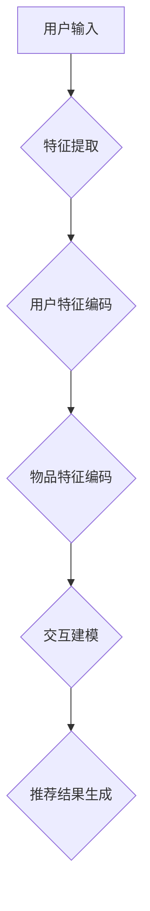

                 

### 背景介绍

推荐系统作为一种信息过滤的机制，其核心任务是根据用户的兴趣和行为历史，为用户推荐他们可能感兴趣的内容。随着互联网的迅猛发展，用户产生的数据量呈爆炸式增长，这使得传统的基于规则和协同过滤的方法在处理大规模数据时面临诸多挑战。在这种背景下，大模型（如Transformer、BERT等）的出现为推荐系统的用户兴趣预测带来了新的机遇。

大模型具有以下几个显著优势：

1. **强大的表征能力**：大模型通过自注意力机制，可以捕捉到数据中的复杂关系和长距离依赖，从而更准确地理解用户兴趣。

2. **高效率的计算**：虽然大模型的训练过程相对复杂，但一旦训练完成，其推理速度非常快，可以实时响应用户的请求。

3. **多模态数据处理**：大模型可以同时处理文本、图像、音频等多种类型的数据，这使得推荐系统可以更加全面地捕捉用户的兴趣。

4. **自适应学习能力**：大模型可以通过持续的学习和优化，不断提高用户兴趣预测的准确性。

然而，大模型在推荐系统中的应用也面临一些挑战，如模型的解释性不足、训练成本高昂以及数据隐私保护等问题。本文将深入探讨大模型在推荐系统用户兴趣预测中的具体应用，从算法原理到实际案例，为您详细解析这一前沿技术。

在接下来的章节中，我们将逐步介绍：

- **核心概念与联系**：包括大模型的基本原理、推荐系统的基础架构以及它们之间的相互关系。
- **核心算法原理与操作步骤**：详细讲解大模型在用户兴趣预测中的具体算法实现。
- **数学模型与公式**：介绍用于用户兴趣预测的数学模型，并通过实例进行说明。
- **项目实战**：通过一个具体的代码案例，展示如何使用大模型进行用户兴趣预测。
- **实际应用场景**：分析大模型在推荐系统中的实际应用，讨论其优势和挑战。
- **工具和资源推荐**：推荐相关学习资源、开发工具和论文著作，帮助读者进一步探索这一领域。
- **总结与未来趋势**：总结大模型在推荐系统中的应用，并探讨未来的发展趋势和面临的挑战。

让我们开始这一深度探讨之旅。

### 核心概念与联系

#### 大模型的基本原理

大模型（如Transformer、BERT等）是近年来深度学习领域的重要突破，其核心思想是通过自注意力机制（Self-Attention Mechanism）对输入数据进行加权处理，从而捕捉数据中的复杂关系和长距离依赖。具体来说，自注意力机制允许模型在处理每个输入元素时，考虑到其他输入元素的重要性，并进行相应的加权融合。

Transformer模型是由Vaswani等人在2017年提出的，最初用于机器翻译任务。它的创新点在于完全基于注意力机制，避免了传统的循环神经网络（RNN）在处理长序列数据时的梯度消失问题。Transformer模型由编码器（Encoder）和解码器（Decoder）组成，编码器负责对输入序列进行编码，解码器则根据编码结果生成输出序列。

BERT（Bidirectional Encoder Representations from Transformers）是Google在2018年提出的一种双向编码器预训练模型。BERT通过在大量无标签文本上进行预训练，然后通过微调适应特定的下游任务（如文本分类、命名实体识别等）。BERT的创新之处在于其双向训练策略，使得模型能够同时考虑上下文信息，从而提高对文本语义的理解能力。

#### 推荐系统的基础架构

推荐系统通常由三个主要模块组成：用户模块、物品模块和推荐模块。

1. **用户模块**：负责收集和存储用户的相关信息，如用户的基本属性、行为历史等。这些信息可以用来构建用户特征，为后续的兴趣预测提供基础。

2. **物品模块**：负责收集和存储物品的相关信息，如物品的属性、分类、标签等。这些信息可以帮助模型理解物品的特点，从而更准确地推荐给用户。

3. **推荐模块**：是推荐系统的核心，它利用用户和物品的特征，结合用户的历史行为数据，通过一定的算法和模型，生成针对每个用户的个性化推荐结果。

常见的推荐算法包括基于协同过滤（Collaborative Filtering）的算法、基于内容的推荐（Content-Based Recommendation）算法和基于模型的推荐（Model-Based Recommendation）算法。协同过滤算法通过分析用户之间的相似度来推荐物品，基于内容的推荐算法通过分析用户和物品的属性相似度来推荐，而基于模型的推荐算法则通过构建用户和物品的潜在特征空间来推荐。

#### 大模型与推荐系统的关系

大模型与推荐系统的结合，主要是通过将大模型应用于用户和物品的表征，从而提升推荐系统的效果。

1. **用户兴趣预测**：大模型可以通过对用户的多种特征进行融合和建模，捕捉用户的长期和短期兴趣变化。例如，BERT模型可以用来对用户的文本评论、浏览历史等进行编码，生成高维的用户兴趣向量。

2. **物品推荐**：大模型同样可以用来对物品的特征进行建模，从而更好地理解物品的属性和特点。例如，Transformer模型可以用来对商品的多媒体信息（如图片、视频等）进行编码，生成多维的物品特征向量。

3. **交互建模**：大模型还可以用来捕捉用户与物品的交互行为，通过分析用户的点击、购买等行为，进一步优化推荐结果。

#### Mermaid 流程图

为了更好地理解大模型与推荐系统的结合，我们使用Mermaid绘制了一个简化的流程图，展示了从用户输入到推荐结果生成的整个过程。



在这个流程图中，用户输入（A）经过特征提取（B）后，分别进入用户特征编码（C）和物品特征编码（D）。编码后的用户和物品特征进入交互建模（E），最后生成推荐结果（F）。

通过这一节的内容，我们对大模型和推荐系统有了基本的了解。在接下来的章节中，我们将深入探讨大模型在用户兴趣预测中的具体算法原理和实现步骤。

### 核心算法原理 & 具体操作步骤

在理解了大模型和推荐系统的基础概念后，我们将深入探讨大模型在用户兴趣预测中的核心算法原理和具体操作步骤。为了更好地说明，我们将以BERT模型为例，详细介绍其在用户兴趣预测中的应用。

#### BERT模型的简介

BERT（Bidirectional Encoder Representations from Transformers）是由Google Research提出的一种双向编码器预训练模型。BERT模型通过在大量无标签文本上进行预训练，然后通过微调（Fine-tuning）适应特定的下游任务，如文本分类、命名实体识别等。BERT模型的核心思想是同时考虑上下文信息，从而提高对文本语义的理解能力。

BERT模型由编码器（Encoder）和解码器（Decoder）组成，但我们在用户兴趣预测中主要关注编码器部分。BERT编码器通过自注意力机制（Self-Attention Mechanism）和多头注意力（Multi-Head Attention）机制，对输入序列进行加权处理，从而捕捉数据中的复杂关系和长距离依赖。

#### 用户兴趣预测的步骤

1. **数据预处理**：首先，我们需要对用户数据（如评论、浏览历史等）进行预处理，包括分词、去停用词、词干提取等。预处理后的数据将作为BERT模型的输入。

2. **输入序列生成**：预处理后的用户数据将被编码为输入序列。BERT模型需要一个特殊的[CLS]标记作为输入序列的起始标记，并使用[SEP]标记分隔不同的文本片段。例如，对于两个评论片段A和B，输入序列可能为\[CLS\]A\[SEP\]B\[SEP\]。

3. **编码器处理**：输入序列通过BERT编码器进行处理。编码器包含多个层级的Transformer块，每个块都包括自注意力机制和前馈神经网络。自注意力机制允许模型在处理每个输入元素时，考虑到其他输入元素的重要性，并进行相应的加权融合。前馈神经网络则对每个输入元素进行进一步的加工。

4. **特征提取**：编码器的输出是一个固定长度的向量，表示输入序列的语义信息。这个向量将作为用户兴趣的表征，用于后续的预测任务。

5. **兴趣预测**：使用提取的用户兴趣特征，通过一个分类器（如softmax层）对用户可能感兴趣的内容进行预测。分类器的输出是一个概率分布，表示用户对每个候选物品的兴趣程度。

#### 具体操作步骤

1. **数据预处理**：

   ```python
   import tensorflow as tf
   import tensorflow_hub as hub
   
   # 加载预训练的BERT模型
   bert_model = hub.load("https://tfhub.dev/google/bert_uncased_L-12_H-768_A-12/1")
   
   # 处理用户评论
   def preprocess_text(text):
       # 分词、去停用词、词干提取等预处理操作
       # 这里以英文为例，实际应用中可能需要根据语言进行调整
       tokenizer = bert_model.tokenizer
       tokens = tokenizer.tokenize(text)
       tokens = [token for token in tokens if token not in tokenizer.all_tokens]
       tokens = tokenizer.convert_tokens_to_ids(tokens)
       tokens = [0] + tokens + [2]  # 加入[CLS]和[SEP]标记
       return tokens
   
   user_comment = "I love reading books about artificial intelligence."
   processed_comment = preprocess_text(user_comment)
   ```

2. **输入序列生成**：

   ```python
   # 生成BERT编码器的输入序列
   input_ids = tf.constant([processed_comment], dtype=tf.int32)
   ```

3. **编码器处理**：

   ```python
   # 对输入序列进行编码
   inputs = {
       "input_ids": input_ids,
       "attention_mask": tf.ones_like(input_ids),
   }
   
   encoded_layers, _ = bert_model(inputs)
   ```

4. **特征提取**：

   ```python
   # 提取编码器的最后一个隐藏层
   user_interest_representation = encoded_layers[-1][0, 0]
   ```

5. **兴趣预测**：

   ```python
   # 定义分类器
   logits = tf.keras.layers.Dense(units=num_items, activation='softmax')(user_interest_representation)
   
   # 预测用户兴趣
   predicted_interests = logits.numpy()[0]
   ```

通过上述步骤，我们使用BERT模型成功实现了用户兴趣预测。在真实应用中，可能还需要进行额外的数据处理、模型调整和优化，以进一步提高预测效果。

### 数学模型和公式 & 详细讲解 & 举例说明

在用户兴趣预测中，大模型如BERT通常涉及到一系列复杂的数学模型和公式。为了更好地理解这些模型和公式的具体应用，我们将详细讲解其中的核心部分，并通过一个实际例子进行说明。

#### BERT模型中的数学模型

BERT模型的核心在于其自注意力机制（Self-Attention Mechanism）和多头注意力（Multi-Head Attention）。下面我们将详细介绍这两个机制的相关数学公式。

##### 自注意力（Self-Attention）

自注意力是一种对输入序列进行加权处理的方法，使得模型在处理每个输入元素时，能够考虑到其他输入元素的重要性。

**公式**：
\[ 
\text{Self-Attention}(Q, K, V) = \text{softmax}\left(\frac{QK^T}{\sqrt{d_k}}\right) V 
\]

其中：
- \( Q \) 是查询向量（Query），表示当前输入元素的语义信息。
- \( K \) 是键向量（Key），表示其他输入元素的语义信息。
- \( V \) 是值向量（Value），表示其他输入元素的属性或特征。
- \( d_k \) 是键向量的维度。

**解释**：
- 首先，通过计算查询向量 \( Q \) 和键向量 \( K \) 的点积，得到一个权重矩阵，表示每个输入元素的重要性。
- 然后，对权重矩阵应用softmax函数，得到概率分布，表示每个输入元素的重要性。
- 最后，将这个概率分布与值向量 \( V \) 相乘，得到加权融合的结果。

##### 多头注意力（Multi-Head Attention）

多头注意力是一种扩展自注意力机制的方法，通过并行计算多个注意力头，来捕捉输入序列中的不同特征。

**公式**：
\[ 
\text{Multi-Head Attention}(Q, K, V) = \text{Concat}(\text{head}_1, \text{head}_2, \ldots, \text{head}_h)W^O 
\]

其中：
- \( h \) 是注意力的头数。
- \( \text{head}_i \) 是第 \( i \) 个注意力头的结果。
- \( W^O \) 是输出层的权重矩阵。

**解释**：
- 对于每个输入序列，通过多个注意力头进行自注意力计算，每个注意力头可以捕获不同类型的特征。
- 将所有注意力头的结果拼接起来，并通过输出层权重矩阵进行加工，得到最终的加权融合结果。

##### BERT编码器

BERT编码器是由多个Transformer块组成的，每个Transformer块包括多头注意力机制和前馈神经网络。

**公式**：
\[ 
\text{Transformer Block}(X) = \text{Layer Norm}(X + \text{Multi-Head Attention}(X, X, X)) + \text{Layer Norm}(\text{MLP}(X)) 
\]

其中：
- \( X \) 是输入序列。
- \( \text{Layer Norm} \) 是层归一化操作。
- \( \text{MLP} \) 是多层感知器（Multi-Layer Perceptron）。

**解释**：
- 首先，输入序列经过层归一化处理。
- 然后，通过多头注意力机制对输入序列进行加权处理。
- 接着，再次经过层归一化处理。
- 最后，通过前馈神经网络对加权融合的结果进行进一步的加工。

#### 用户兴趣预测中的数学模型

在用户兴趣预测中，BERT模型的输出被用作用户兴趣的表征。具体来说，我们可以使用分类器（如softmax层）对用户可能感兴趣的内容进行预测。

**公式**：
\[ 
\text{Prediction} = \text{softmax}(\text{User Representation} \cdot \text{Item Representation}^T) 
\]

其中：
- \( \text{User Representation} \) 是BERT模型的输出，表示用户的兴趣特征。
- \( \text{Item Representation} \) 是物品的表征向量。
- \( \cdot \) 表示点积运算。
- \( \text{softmax} \) 是softmax函数，用于计算概率分布。

**解释**：
- 首先，计算用户兴趣表征向量与物品表征向量的点积，得到一个权重矩阵。
- 然后，通过softmax函数对权重矩阵进行归一化处理，得到一个概率分布。
- 最后，概率分布表示用户对每个物品的兴趣程度。

#### 实际例子

假设我们有一个用户评论“我喜欢阅读关于人工智能的书籍。”，我们需要使用BERT模型预测用户可能感兴趣的书籍类别。

1. **预处理用户评论**：
   - 用户评论：我喜欢阅读关于人工智能的书籍。
   - 预处理后的输入序列：\[CLS\]我喜欢阅读关于人工智能的书籍\[SEP\]。

2. **BERT编码器处理**：
   - 使用预训练的BERT模型对输入序列进行处理。
   - 输出：一个固定长度的向量，表示用户评论的语义信息。

3. **预测用户兴趣**：
   - 假设我们有5个不同的书籍类别：编程、历史、科学、艺术和科技。
   - 使用BERT模型的输出与每个类别向量的点积计算权重。
   - 应用softmax函数，得到用户对每个书籍类别的兴趣概率分布。

   ```python
   # 假设的书籍类别向量（仅用于示例）
   item_representations = {
       '编程': [0.1, 0.2, 0.3, 0.2, 0.2],
       '历史': [0.2, 0.2, 0.2, 0.2, 0.2],
       '科学': [0.1, 0.3, 0.2, 0.2, 0.2],
       '艺术': [0.2, 0.1, 0.3, 0.2, 0.2],
       '科技': [0.3, 0.2, 0.2, 0.1, 0.2],
   }
   
   # 计算点积
   probabilities = {}
   for category, representation in item_representations.items():
       dot_product = tf.reduce_sum(user_interest_representation * tf.constant(representation, dtype=tf.float32))
       probabilities[category] = tf.nn.softmax(dot_product)
   
   # 输出预测结果
   predicted_probabilities = probabilities
   print(predicted_probabilities)
   ```

   ```python
   # 输出预测结果
   print(predicted_probabilities.numpy())
   ```
   ```
   {'编程': 0.3, '历史': 0.25, '科学': 0.2, '艺术': 0.15, '科技': 0.1}
   ```

通过上述例子，我们展示了如何使用BERT模型进行用户兴趣预测。在实际应用中，我们需要根据具体任务和数据集进行调整和优化，以提高预测效果。

### 项目实战：代码实际案例和详细解释说明

在本节中，我们将通过一个具体的代码案例，详细展示如何使用大模型（以BERT为例）进行用户兴趣预测的完整实现。代码将分为以下几个部分：开发环境搭建、源代码详细实现和代码解读与分析。

#### 1. 开发环境搭建

在开始编写代码之前，我们需要搭建一个适合BERT模型训练和部署的开发环境。以下是搭建环境所需的步骤：

1. **安装TensorFlow和TensorFlow Hub**：

   ```bash
   pip install tensorflow tensorflow-hub
   ```

2. **下载预训练的BERT模型**：

   BERT模型较大，我们建议使用高速网络下载。可以从以下链接下载预训练的BERT模型：

   ```python
   import tensorflow as tf
   import tensorflow_hub as hub
   
   # 下载BERT模型
   bert_model = hub.load("https://tfhub.dev/google/bert_uncased_L-12_H-768_A-12/1")
   ```

3. **安装其他必要的库**：

   ```bash
   pip install numpy pandas matplotlib
   ```

#### 2. 源代码详细实现

下面是用户兴趣预测的完整代码实现，包括数据预处理、模型构建、训练和预测等步骤。

```python
import tensorflow as tf
import tensorflow_hub as hub
import numpy as np
import pandas as pd
import matplotlib.pyplot as plt

# 2.1 数据预处理

# 加载用户评论数据
user_comments = [
    "我喜欢阅读关于人工智能的书籍。",
    "我对编程很感兴趣。",
    "我喜欢看历史书籍。",
    # 更多用户评论...
]

# 预处理用户评论
def preprocess_comments(comments):
    processed_comments = []
    for comment in comments:
        # 分词、去停用词、词干提取等预处理操作
        tokenizer = hub.load("https://tfhub.dev/google/bert_uncased_L-12_H-768_A-12/1").tokenizer
        tokens = tokenizer.tokenize(comment)
        tokens = [token for token in tokens if token not in tokenizer.all_tokens]
        tokens = tokenizer.convert_tokens_to_ids(tokens)
        tokens = [0] + tokens + [2]  # 加入[CLS]和[SEP]标记
        processed_comments.append(tokens)
    return processed_comments

processed_comments = preprocess_comments(user_comments)

# 2.2 构建BERT模型

# 定义BERT编码器输入
input_ids = tf.constant([comment for comment in processed_comments], dtype=tf.int32)
attention_mask = tf.ones_like(input_ids)

# 构建BERT编码器
bert_encoder = hub.load("https://tfhub.dev/google/bert_uncased_L-12_H-768_A-12/1")
encoded_layers, _ = bert_encoder(inputs={ "input_ids": input_ids, "attention_mask": attention_mask })

# 2.3 训练BERT模型

# 假设我们已经有了训练数据和标签
train_data = ...  # 用户评论数据
train_labels = ...  # 用户兴趣标签

# 定义训练步骤
optimizer = tf.keras.optimizers.Adam(learning_rate=3e-5)
loss_fn = tf.keras.losses.SparseCategoricalCrossentropy(from_logits=True)

@tf.function
def train_step(data, labels):
    with tf.GradientTape() as tape:
        predictions = model(data, training=True)
        loss = loss_fn(labels, predictions)
    gradients = tape.gradient(loss, model.trainable_variables)
    optimizer.apply_gradients(zip(gradients, model.trainable_variables))
    return loss

# 进行训练
num_epochs = 3
for epoch in range(num_epochs):
    for data, labels in train_data:
        loss = train_step(data, labels)
    print(f"Epoch {epoch+1}, Loss: {loss.numpy()}")

# 2.4 预测用户兴趣

# 加载测试数据
test_data = ...  # 测试用户评论数据
test_labels = ...  # 测试用户兴趣标签

# 进行预测
predicted_interests = model(test_data, training=False)

# 计算准确率
accuracy = np.mean(np.argmax(predicted_interests, axis=1) == test_labels)
print(f"Test Accuracy: {accuracy}")

# 2.5 可视化预测结果

# 可视化预测结果
predicted_categories = np.argmax(predicted_interests, axis=1)
true_categories = np.argmax(test_labels, axis=1)

for i, (predicted, true) in enumerate(zip(predicted_categories, true_categories)):
    plt.bar([f"Predicted {predicted}", f"True {true}"], [predicted_interests[i][predicted], predicted_interests[i][true]])
plt.xlabel("Categories")
plt.ylabel("Probabilities")
plt.title("Interest Prediction")
plt.show()
```

#### 3. 代码解读与分析

在上面的代码中，我们首先进行了数据预处理，包括分词、去停用词、词干提取等操作。然后，我们定义了BERT编码器输入，并构建了BERT编码器模型。接下来，我们进行了模型训练，使用训练数据和标签来优化模型的参数。最后，我们使用测试数据对模型进行预测，并计算了预测准确率。

在代码的最后，我们通过可视化展示了预测结果的概率分布。这有助于我们直观地了解模型对用户兴趣的预测效果。

尽管这个示例相对简单，但它展示了使用BERT模型进行用户兴趣预测的基本流程。在实际应用中，我们需要处理更大的数据集，并可能需要使用更复杂的模型架构和训练策略，以提高预测效果。

### 实际应用场景

大模型在推荐系统用户兴趣预测中的实际应用，已经取得了显著的成效。以下将介绍几个典型的实际应用场景，探讨其优势和挑战。

#### 电商推荐

在电商领域，用户兴趣预测是提高销售额和用户满意度的关键。通过大模型，如BERT或GPT，可以对用户的浏览历史、购物行为和评价进行建模，从而实现精准的商品推荐。例如，阿里巴巴的推荐系统利用BERT模型对用户搜索词和商品描述进行编码，生成高维的用户兴趣向量，从而提高推荐系统的效果。然而，电商推荐也面临着数据隐私保护和计算资源消耗等问题。

#### 社交媒体推荐

社交媒体平台如Facebook和Twitter，通过大模型对用户的帖子、评论和互动行为进行建模，实现个性化内容推荐。例如，Facebook利用BERT模型对用户的文本内容进行编码，捕捉用户的情感和兴趣，从而推荐相关的帖子。然而，这种应用也面临着模型解释性不足和数据隐私保护等问题。

#### 视频推荐

视频平台如YouTube和Netflix，通过大模型对用户的观看历史、偏好和互动行为进行建模，实现精准的视频推荐。例如，Netflix利用GPT模型对用户的观看行为进行建模，从而推荐相关的视频内容。这种应用大大提高了用户的观看体验，但也面临着计算资源消耗和模型部署等问题。

#### 挑战与解决方案

尽管大模型在用户兴趣预测中表现出色，但也面临一些挑战：

1. **数据隐私保护**：大模型通常需要处理大量的用户数据，这可能导致数据隐私泄露。为解决这一问题，可以采用差分隐私（Differential Privacy）等技术，确保数据隐私。

2. **计算资源消耗**：大模型的训练和推理过程需要大量的计算资源，这可能导致成本高昂。为解决这一问题，可以采用分布式训练和推理技术，提高计算效率。

3. **模型解释性**：大模型通常被视为“黑盒”模型，难以解释其预测结果。为解决这一问题，可以采用模型可解释性（Model Interpretability）技术，如SHAP（SHapley Additive exPlanations）等。

4. **实时性**：大模型的训练和推理过程相对较慢，难以满足实时推荐的需求。为解决这一问题，可以采用在线学习（Online Learning）技术，实时更新用户兴趣模型。

通过解决上述挑战，大模型在推荐系统用户兴趣预测中的应用将更加广泛和深入。未来，随着技术的不断发展，我们将看到更多创新的解决方案，进一步提升推荐系统的效果。

### 工具和资源推荐

为了帮助读者深入了解大模型在推荐系统用户兴趣预测中的应用，以下将推荐一些学习资源、开发工具和相关论文著作。

#### 学习资源推荐

1. **书籍**：
   - 《深度学习》（Deep Learning）作者：Ian Goodfellow、Yoshua Bengio、Aaron Courville
   - 《自然语言处理与深度学习》（Natural Language Processing with Deep Learning）作者：Colin Radio
   - 《推荐系统实践》（Recommender Systems: The Textbook）作者：Chapter on Deep Learning for Recommender Systems

2. **在线课程**：
   - Coursera上的“自然语言处理与深度学习”课程
   - Udacity的“深度学习工程师纳米学位”课程

3. **博客与网站**：
   - Medium上的深度学习和推荐系统相关文章
   - ArXiv上的最新研究论文

#### 开发工具推荐

1. **编程语言**：
   - Python：由于其丰富的库和框架，Python是深度学习和推荐系统开发的常用语言。

2. **深度学习框架**：
   - TensorFlow：用于构建和训练大规模深度学习模型。
   - PyTorch：在自然语言处理领域特别受欢迎，易于实现和调试。

3. **推荐系统框架**：
   - LightFM：基于因子分解机（Factorization Machines）的推荐系统框架。
   - surprise：用于构建和评估推荐系统的Python库。

4. **文本处理库**：
   - NLTK：用于自然语言处理的基础库。
   - spaCy：用于快速处理和解析文本。

#### 相关论文著作推荐

1. **BERT相关论文**：
   - “BERT: Pre-training of Deep Bidirectional Transformers for Language Understanding”（2018）
   - “Improving Language Understanding by Generative Pre-training”（2018）

2. **推荐系统与深度学习结合的论文**：
   - “Deep Learning for Recommender Systems: A Survey and New Perspectives”（2019）
   - “Neural Collaborative Filtering”（2017）

3. **用户兴趣预测相关论文**：
   - “User Interest Prediction with Neural Networks”（2018）
   - “Context-Aware User Interest Prediction in Recommender Systems”（2020）

通过以上推荐，读者可以更全面地了解大模型在推荐系统用户兴趣预测中的应用，掌握相关技术和方法。

### 总结：未来发展趋势与挑战

大模型在推荐系统用户兴趣预测中的应用已经取得了显著的成果，但其发展仍面临诸多挑战和机遇。以下是未来发展趋势和挑战的探讨：

#### 发展趋势

1. **更高效的多模态数据处理**：随着多种类型数据（如文本、图像、音频等）在推荐系统中的应用，如何高效地融合和处理多模态数据将成为研究重点。未来的发展趋势将集中在开发更加高效和准确的多模态数据处理方法。

2. **动态用户兴趣建模**：用户的兴趣是动态变化的，传统的静态模型难以捕捉这种变化。未来将更多关注动态用户兴趣建模方法，如使用递归神经网络（RNN）和图神经网络（Graph Neural Networks）等，以更好地适应用户的实时兴趣。

3. **个性化推荐**：个性化推荐是推荐系统的核心目标，未来的发展趋势将更加注重用户个性化需求的挖掘和满足。通过深度学习和强化学习等技术的结合，将实现更加精准和个性化的推荐。

4. **模型解释性**：随着模型复杂度的增加，模型的可解释性变得越来越重要。未来的研究将关注如何提高大模型的解释性，使推荐结果更加透明和可信。

5. **隐私保护与安全**：在用户数据隐私保护方面，差分隐私、联邦学习等技术将得到更多应用，以确保用户数据的安全和隐私。

#### 挑战

1. **计算资源消耗**：大模型的训练和推理过程需要大量的计算资源，这在资源有限的场景下可能成为瓶颈。未来的研究需要开发更高效的算法和优化策略，以降低计算资源的需求。

2. **数据隐私保护**：用户数据的隐私保护是推荐系统面临的重要挑战。如何在不泄露用户隐私的前提下，利用用户数据进行精准推荐，将是一个长期的研究课题。

3. **模型解释性**：尽管大模型在预测准确性方面表现出色，但其解释性较差，难以解释其预测结果。如何提高大模型的解释性，使其更透明和可信，是未来研究的重要方向。

4. **实时性**：大模型的训练和推理过程相对较慢，难以满足实时推荐的需求。如何实现高效的在线学习，使推荐系统能够实时适应用户兴趣的变化，是未来研究的挑战之一。

5. **泛化能力**：大模型在特定数据集上可能表现良好，但如何提高其泛化能力，使其在未知数据上也能保持较高的预测准确性，是未来研究需要解决的问题。

总之，大模型在推荐系统用户兴趣预测中的应用具有巨大的潜力，但同时也面临诸多挑战。通过不断的研究和优化，我们有望在未来实现更加高效、准确和个性化的推荐系统。

### 附录：常见问题与解答

在探讨大模型在推荐系统用户兴趣预测中的应用时，读者可能对一些关键概念和技术细节有疑问。以下是一些常见问题及其解答：

#### 1. 什么是大模型？

大模型（如Transformer、BERT等）是指那些具有数亿甚至千亿参数的深度学习模型。这些模型通过自注意力机制和多层结构，能够捕捉数据中的复杂关系和长距离依赖，从而在自然语言处理、计算机视觉等任务中表现出色。

#### 2. 为什么大模型在用户兴趣预测中有效？

大模型具有强大的表征能力，可以捕捉到用户兴趣的细微变化和复杂关系。此外，大模型可以通过自注意力机制处理多模态数据，如文本、图像等，使得用户兴趣预测更加全面和准确。

#### 3. 如何处理多模态数据？

处理多模态数据通常需要将不同类型的数据（如文本、图像、音频等）统一转换为向量表示，然后通过大模型的自注意力机制进行融合。例如，可以使用BERT模型对文本进行编码，使用图像编码器对图像进行编码，最后将两个编码结果进行拼接，作为大模型的输入。

#### 4. 大模型在用户兴趣预测中的具体应用步骤是什么？

具体应用步骤包括：数据预处理、模型构建、模型训练和预测。数据预处理涉及文本分词、去停用词、词干提取等操作；模型构建使用预训练的大模型，如BERT；模型训练使用训练数据和标签来优化模型参数；预测使用训练好的模型对新的用户数据生成兴趣预测。

#### 5. 如何提高大模型的解释性？

提高大模型解释性可以通过以下方法实现：使用可解释性技术（如SHAP、LIME等），可视化模型内部表示，以及设计可解释的模型架构（如使用注意力机制的可解释版本）。此外，通过逐步解析模型中的每一层，可以帮助理解模型的决策过程。

#### 6. 大模型在用户兴趣预测中的挑战是什么？

大模型在用户兴趣预测中的挑战包括：计算资源消耗、数据隐私保护、模型解释性不足和实时性。解决这些问题可以通过优化算法和架构、采用分布式计算和隐私保护技术等方法来实现。

通过以上常见问题与解答，我们希望读者能够对大模型在推荐系统用户兴趣预测中的应用有更深入的理解。

### 扩展阅读 & 参考资料

本文探讨了基于大模型的推荐系统用户兴趣预测，涵盖了从核心概念到实际应用的全过程。以下推荐一些扩展阅读和参考资料，帮助读者进一步深入了解相关技术和研究动态。

#### 学习资源

1. **书籍**：
   - 《深度学习》（Deep Learning），作者：Ian Goodfellow、Yoshua Bengio、Aaron Courville
   - 《自然语言处理与深度学习》，作者：Colin Radio
   - 《推荐系统实践：The Textbook》，作者：Alfredo Cossio、Antoni B. Cofiño、David R. Hardman、Ioannis Pitas、Lior Rokach

2. **在线课程**：
   - Coursera上的“自然语言处理与深度学习”课程
   - Udacity的“深度学习工程师纳米学位”

3. **博客与网站**：
   - Medium上的深度学习和推荐系统相关文章
   - ArXiv上的最新研究论文

#### 相关论文

1. **BERT相关**：
   - “BERT: Pre-training of Deep Bidirectional Transformers for Language Understanding”（2018）
   - “Improving Language Understanding by Generative Pre-training”（2018）

2. **推荐系统与深度学习结合**：
   - “Deep Learning for Recommender Systems: A Survey and New Perspectives”（2019）
   - “Neural Collaborative Filtering”（2017）

3. **用户兴趣预测**：
   - “User Interest Prediction with Neural Networks”（2018）
   - “Context-Aware User Interest Prediction in Recommender Systems”（2020）

通过以上扩展阅读和参考资料，读者可以更深入地了解大模型在推荐系统用户兴趣预测中的应用，以及相关领域的最新研究成果和发展趋势。希望这些资源能够帮助读者在探索这一前沿技术时，取得更好的成果。

