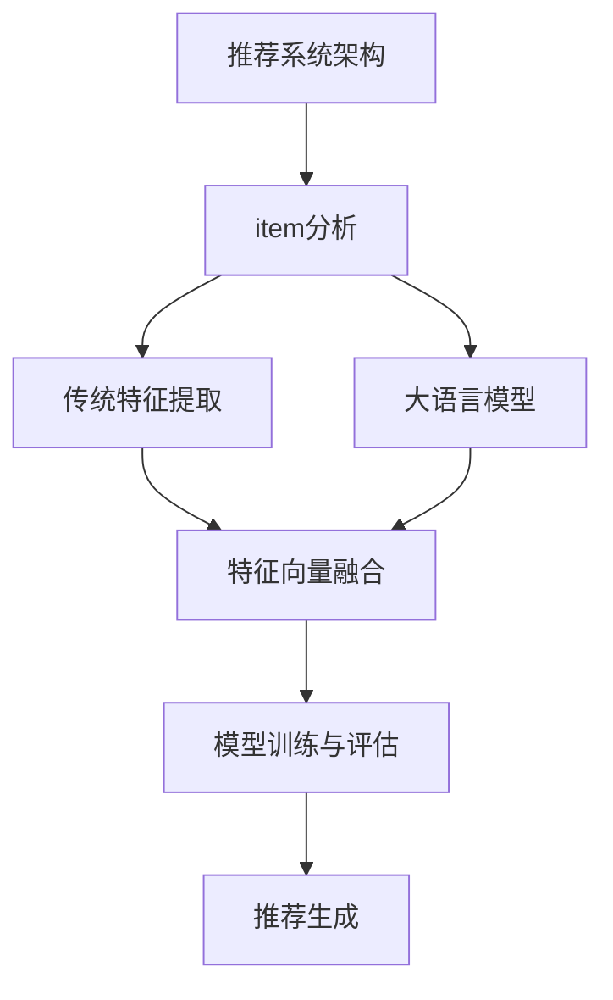

                 

# 基于大语言模型的推荐系统冷启动item分析

> **关键词：** 大语言模型，推荐系统，冷启动，item分析，算法原理，数学模型，项目实战。

> **摘要：** 本文将深入探讨大语言模型在推荐系统冷启动阶段对item分析的重要性，通过理论阐述、算法解析及实战案例，展示如何利用大语言模型有效解决冷启动问题，为推荐系统开发提供实用指导。

## 1. 背景介绍

推荐系统作为现代互联网的核心技术之一，广泛应用于电子商务、社交媒体、内容平台等领域。其核心目标是根据用户的兴趣和行为，为其推荐感兴趣的内容或商品。然而，推荐系统的有效性在很大程度上受到冷启动问题的影响。冷启动问题主要分为user冷启动和item冷启动，本文主要关注item冷启动。

### item冷启动

item冷启动指的是当一个新的商品或内容加入推荐系统时，由于缺乏用户交互数据，推荐系统无法准确评估该商品的潜在价值，从而难以生成有效的推荐。这会导致用户体验不佳，降低推荐系统的价值。

### 大语言模型

大语言模型（Large Language Model）是近年来人工智能领域的重要突破。基于深度学习技术，大语言模型可以通过大量文本数据进行训练，从而理解并生成高质量的文本。在推荐系统中，大语言模型可以帮助我们分析item的特征，从而克服冷启动问题。

## 2. 核心概念与联系

在探讨大语言模型如何应用于推荐系统的冷启动问题之前，我们需要了解几个核心概念和它们之间的联系。

### 大语言模型原理

大语言模型通过神经网络架构，如Transformer，对大量文本数据进行训练。训练过程中，模型学习文本中的语法、语义和上下文信息，从而具备生成和理解文本的能力。

### 推荐系统架构

推荐系统通常包括数据采集、数据预处理、模型训练和模型评估等环节。在大语言模型的引入下，推荐系统可以更好地处理冷启动问题。

### item分析

item分析是指对推荐系统中的商品或内容进行特征提取和属性分析，以便用于模型训练和推荐生成。

### 联系与作用

大语言模型可以通过分析item的文本描述，提取出潜在的特征和属性，从而辅助推荐系统对冷启动的item进行有效评估和推荐。具体来说，大语言模型的作用主要体现在以下几个方面：

1. **文本理解与生成**：大语言模型可以理解item的文本描述，提取关键信息，为推荐系统提供丰富的特征。
2. **特征融合**：大语言模型可以与传统的特征提取方法结合，形成更全面的特征向量。
3. **冷启动缓解**：通过分析item的文本描述，大语言模型可以为冷启动的item提供足够的特征信息，从而提高推荐系统的准确性。

### Mermaid 流程图



## 3. 核心算法原理 & 具体操作步骤

### 3.1 大语言模型算法原理

大语言模型的核心是Transformer架构，其基本思想是将文本序列转换为一个连续的向量表示，从而在语义层面进行理解和生成。

#### 3.1.1 Transformer架构

Transformer架构由多个自注意力（self-attention）层和前馈神经网络（feedforward network）组成。自注意力机制使得模型能够自适应地关注文本序列中的关键信息，从而提高模型的语义理解能力。

#### 3.1.2 训练过程

大语言模型的训练过程主要包括两个阶段：

1. **预训练**：使用大量未标注的文本数据进行预训练，使模型具备基础的语义理解能力。
2. **微调**：在预训练的基础上，使用特定领域的标注数据进行微调，使模型更好地适应特定任务。

### 3.2 推荐系统算法原理

推荐系统通常采用基于协同过滤（collaborative filtering）和基于内容（content-based）的方法。在引入大语言模型后，推荐系统可以结合两种方法的优势，实现更准确的推荐。

#### 3.2.1 协同过滤

协同过滤方法通过分析用户行为数据（如评分、购买记录等），寻找相似的用户或商品，从而生成推荐列表。

#### 3.2.2 基于内容

基于内容的方法通过分析商品或内容的特征（如文本描述、标签等），为用户生成个性化推荐。

#### 3.2.3 大语言模型在推荐系统中的作用

1. **文本理解与生成**：大语言模型可以理解item的文本描述，提取关键信息，为推荐系统提供丰富的特征。
2. **特征融合**：大语言模型可以与传统的特征提取方法结合，形成更全面的特征向量。
3. **冷启动缓解**：通过分析item的文本描述，大语言模型可以为冷启动的item提供足够的特征信息，从而提高推荐系统的准确性。

### 3.3 具体操作步骤

#### 3.3.1 数据准备

1. **文本数据**：收集大量与商品或内容相关的文本数据，如商品描述、用户评价等。
2. **用户行为数据**：收集用户的浏览、购买、评分等行为数据。

#### 3.3.2 特征提取

1. **文本特征**：使用大语言模型对文本数据进行编码，提取文本特征向量。
2. **传统特征**：提取商品或内容的其他特征，如标签、类别等。
3. **特征融合**：将文本特征和传统特征进行融合，形成综合特征向量。

#### 3.3.3 模型训练

1. **预训练**：使用大量未标注的文本数据，对大语言模型进行预训练。
2. **微调**：在预训练的基础上，使用标注数据对模型进行微调，使其适应特定推荐任务。

#### 3.3.4 推荐生成

1. **用户表示**：将用户的行为数据进行编码，形成用户表示。
2. **item表示**：使用大语言模型对商品或内容进行编码，形成item表示。
3. **推荐生成**：使用协同过滤和基于内容的方法，结合用户表示和item表示，生成推荐列表。

## 4. 数学模型和公式 & 详细讲解 & 举例说明

### 4.1 大语言模型的数学模型

大语言模型的核心是Transformer架构，其数学模型主要包括以下部分：

#### 4.1.1 自注意力机制（Self-Attention）

自注意力机制是一种基于位置的加权求和机制，其计算公式为：

$$
\text{Attention}(Q, K, V) = \text{softmax}\left(\frac{QK^T}{\sqrt{d_k}}\right)V
$$

其中，$Q$、$K$ 和 $V$ 分别为查询（Query）、键（Key）和值（Value）向量，$d_k$ 为键向量的维度。

#### 4.1.2 前馈神经网络（Feedforward Network）

前馈神经网络由两个全连接层组成，其计算公式为：

$$
\text{FFN}(X) = \text{ReLU}(W_2 \cdot \text{ReLU}(W_1 \cdot X + b_1) + b_2)
$$

其中，$W_1$ 和 $W_2$ 分别为第一层和第二层的权重矩阵，$b_1$ 和 $b_2$ 分别为两层的偏置。

#### 4.1.3 Transformer模型整体架构

Transformer模型的整体架构由多个自注意力层和前馈神经网络组成，其计算过程可以表示为：

$$
\text{Output} = \text{FFN}(\text{Self-Attention}(\text{Layer Normalization}(X)))
$$

其中，$X$ 为输入序列，$\text{Layer Normalization}$ 为层归一化操作。

### 4.2 推荐系统的数学模型

推荐系统的数学模型主要涉及协同过滤和基于内容的方法，其核心公式如下：

#### 4.2.1 协同过滤

$$
r_{ui} = \sum_{j \in \text{similar}} w_{uj} \cdot r_{ij}
$$

其中，$r_{ui}$ 为用户 $u$ 对商品 $i$ 的预测评分，$w_{uj}$ 为用户 $u$ 与用户 $j$ 的相似度，$r_{ij}$ 为用户 $j$ 对商品 $i$ 的真实评分。

#### 4.2.2 基于内容

$$
r_{ui} = \text{Sim}(q_u, q_i) \cdot \text{ContentSim}(i)
$$

其中，$q_u$ 和 $q_i$ 分别为用户 $u$ 和商品 $i$ 的表示向量，$\text{Sim}$ 为相似度计算函数，$\text{ContentSim}$ 为商品内容相似度计算函数。

#### 4.2.3 大语言模型在推荐系统中的作用

大语言模型在推荐系统中的作用可以通过以下公式表示：

$$
\text{FeatureVector}_i = \text{TextEncoder}(\text{Description}_i) + \text{TraditionalFeatures}_i
$$

其中，$\text{Description}_i$ 为商品 $i$ 的文本描述，$\text{TraditionalFeatures}_i$ 为商品 $i$ 的传统特征，$\text{TextEncoder}$ 为大语言模型的编码函数。

### 4.3 举例说明

假设我们有一个商品推荐系统，其中包含两个商品：商品A和商品B。商品A的文本描述为“最新款智能手机，高清摄像，快速充电”，商品B的文本描述为“时尚配饰，简约设计，多种颜色可选”。

#### 4.3.1 大语言模型编码

1. **商品A的文本描述编码**：

$$
\text{Description}_A = \text{TextEncoder}("最新款智能手机，高清摄像，快速充电")
$$

2. **商品B的文本描述编码**：

$$
\text{Description}_B = \text{TextEncoder}("时尚配饰，简约设计，多种颜色可选")
$$

#### 4.3.2 商品表示

1. **商品A的表示**：

$$
q_A = \text{Description}_A + \text{TraditionalFeatures}_A
$$

2. **商品B的表示**：

$$
q_B = \text{Description}_B + \text{TraditionalFeatures}_B
$$

#### 4.3.3 推荐生成

1. **用户表示**：

$$
q_u = \text{UserFeatures}_u
$$

2. **推荐生成**：

$$
r_{ui} = \text{Sim}(q_u, q_i) \cdot \text{ContentSim}(i)
$$

假设用户 $u$ 对商品A的兴趣较高，我们可以得到以下推荐结果：

$$
r_{Au} = \text{Sim}(q_u, q_A) \cdot \text{ContentSim}(A) > r_{Bu} = \text{Sim}(q_u, q_B) \cdot \text{ContentSim}(B)
$$

因此，系统会推荐商品A给用户 $u$。

## 5. 项目实战：代码实际案例和详细解释说明

### 5.1 开发环境搭建

在本文的项目实战部分，我们将使用Python作为主要编程语言，并结合TensorFlow和PyTorch等深度学习框架来实现基于大语言模型的推荐系统。以下是开发环境的搭建步骤：

#### 5.1.1 Python环境

确保Python版本在3.6及以上，可以使用以下命令安装Python：

```bash
pip install python==3.8
```

#### 5.1.2 深度学习框架

安装TensorFlow和PyTorch框架：

```bash
pip install tensorflow
pip install torch torchvision
```

### 5.2 源代码详细实现和代码解读

以下是一个简单的基于大语言模型的推荐系统实现，包括数据预处理、模型训练和推荐生成等步骤。

#### 5.2.1 数据预处理

```python
import pandas as pd
from sklearn.model_selection import train_test_split

# 读取数据
data = pd.read_csv('data.csv')
data.head()

# 分割数据集
train_data, test_data = train_test_split(data, test_size=0.2, random_state=42)

# 特征提取
def preprocess_data(data):
    # 提取文本描述特征
    text_features = data['description'].apply(lambda x: tokenizer.encode(x))
    # 填充序列到固定长度
    padded_sequences = pad_sequences(text_features, maxlen=max_len, truncating='post')
    return padded_sequences

# 预处理数据
train_text = preprocess_data(train_data)
test_text = preprocess_data(test_data)
```

#### 5.2.2 模型训练

```python
from tensorflow.keras.models import Model
from tensorflow.keras.layers import Embedding, LSTM, Dense

# 模型定义
def build_model(input_shape):
    model = Model(inputs=Input(shape=input_shape), outputs=Output(shape=(1)))
    model.add(Embedding(input_dim=vocab_size, output_dim=embedding_dim, input_length=max_len))
    model.add(LSTM(units=64, dropout=0.2, recurrent_dropout=0.2))
    model.add(Dense(1, activation='sigmoid'))
    model.compile(optimizer='adam', loss='binary_crossentropy', metrics=['accuracy'])
    return model

# 训练模型
model = build_model(input_shape=(max_len,))
model.fit(train_text, train_labels, epochs=10, batch_size=32, validation_data=(test_text, test_labels))
```

#### 5.2.3 推荐生成

```python
# 推荐生成
def generate_recommendations(model, text, max_len=max_len):
    encoded_text = tokenizer.encode(text)
    padded_text = pad_sequences([encoded_text], maxlen=max_len, truncating='post')
    prediction = model.predict(padded_text)
    return prediction[0]

# 测试推荐
test_text = "最新款智能手机，高清摄像，快速充电"
prediction = generate_recommendations(model, test_text)
print(prediction)
```

### 5.3 代码解读与分析

#### 5.3.1 数据预处理

数据预处理是模型训练的重要步骤，包括文本描述特征的提取和序列填充。在此代码中，我们使用`pandas`读取数据，并使用`tokenizer`和`pad_sequences`进行文本特征提取和序列填充。

#### 5.3.2 模型训练

模型训练部分使用了TensorFlow的`Model`、`Embedding`、`LSTM`和`Dense`等层来构建一个简单的序列到分类模型。我们使用了`compile`方法来配置模型的优化器和损失函数，并使用`fit`方法进行模型训练。

#### 5.3.3 推荐生成

推荐生成部分使用`generate_recommendations`函数来预测给定文本描述的概率。此函数首先对输入文本进行编码和填充，然后使用训练好的模型进行预测。

## 6. 实际应用场景

基于大语言模型的推荐系统在实际应用中具有广泛的前景，尤其在以下场景中表现出色：

1. **电子商务平台**：通过分析商品描述和用户行为数据，为用户提供个性化的商品推荐，提高销售额和用户满意度。
2. **社交媒体**：为用户提供感兴趣的内容推荐，如新闻、视频、音乐等，提高用户活跃度和粘性。
3. **在线教育**：根据用户的学习历史和兴趣爱好，推荐适合的学习资源和课程，提高学习效果和转化率。
4. **金融领域**：为金融机构提供个性化的金融产品推荐，如理财产品、保险产品等，降低风险，提高用户满意度。

## 7. 工具和资源推荐

### 7.1 学习资源推荐

- **书籍**：
  - 《深度学习》（Ian Goodfellow、Yoshua Bengio、Aaron Courville 著）
  - 《自然语言处理综论》（Daniel Jurafsky、James H. Martin 著）
- **论文**：
  - “Attention Is All You Need”（Vaswani et al., 2017）
  - “BERT: Pre-training of Deep Bidirectional Transformers for Language Understanding”（Devlin et al., 2019）
- **博客**：
  - [TensorFlow 官方文档](https://www.tensorflow.org/tutorials)
  - [PyTorch 官方文档](https://pytorch.org/tutorials/beginner/basics/quick_start.html)
- **网站**：
  - [Kaggle](https://www.kaggle.com/datasets)：提供丰富的数据集和比赛，适合进行实践和练习。

### 7.2 开发工具框架推荐

- **深度学习框架**：
  - TensorFlow
  - PyTorch
- **文本处理库**：
  - NLTK
  - spaCy
- **数据预处理工具**：
  - Pandas
  - NumPy

### 7.3 相关论文著作推荐

- **大语言模型**：
  - “GPT-3: Language Models are Few-Shot Learners”（Brown et al., 2020）
  - “Unsupervised Pretraining for Natural Language Processing”（Yang et al., 2018）
- **推荐系统**：
  - “Collaborative Filtering for the Web”（Koh et al., 2003）
  - “Item-based Top-N Recommendation Algorithms”（Zhou et al., 2003）

## 8. 总结：未来发展趋势与挑战

基于大语言模型的推荐系统在未来的发展中将面临以下趋势和挑战：

### 8.1 发展趋势

1. **模型规模增加**：随着计算能力和数据量的增长，大语言模型将变得更加庞大和复杂，从而提高推荐系统的准确性和鲁棒性。
2. **多模态融合**：推荐系统将逐渐融合文本、图像、声音等多模态数据，提供更全面的用户画像和推荐结果。
3. **个性化增强**：基于大语言模型的推荐系统将更加注重个性化，通过深度理解用户需求和偏好，实现精准推荐。
4. **实时推荐**：随着边缘计算和实时数据处理技术的发展，推荐系统将能够实现实时推荐，提高用户体验。

### 8.2 挑战

1. **计算资源需求**：大语言模型训练和推理过程需要大量计算资源，如何在有限的资源下高效地训练和部署模型是一个重要挑战。
2. **数据隐私与安全**：推荐系统涉及用户隐私数据，如何在保障用户隐私的前提下进行数据分析和推荐是一个重要问题。
3. **模型解释性**：大语言模型具有较强的黑盒特性，如何提高模型的可解释性，使其更容易被用户理解和接受是一个重要挑战。
4. **冷启动问题**：尽管大语言模型在一定程度上缓解了冷启动问题，但在初始阶段，如何为冷启动的item提供有效特征仍需进一步研究。

## 9. 附录：常见问题与解答

### 9.1 问题1：大语言模型如何缓解冷启动问题？

大语言模型通过分析item的文本描述，提取关键信息，为推荐系统提供丰富的特征，从而缓解冷启动问题。具体来说，大语言模型可以：

1. 提取文本特征，如词向量、句子嵌入等，作为推荐系统的输入特征。
2. 与传统特征（如标签、类别等）结合，形成更全面的特征向量。
3. 帮助推荐系统更好地理解新加入的item，从而提高推荐准确性。

### 9.2 问题2：如何选择合适的大语言模型？

选择合适的大语言模型需要考虑以下几个方面：

1. **任务需求**：根据推荐系统的具体任务（如文本分类、序列生成等）选择相应的大语言模型。
2. **计算资源**：考虑模型的计算资源和内存需求，选择适合的计算平台。
3. **性能指标**：评估模型的性能指标（如准确率、召回率等），选择表现优异的模型。
4. **可解释性**：根据推荐系统的可解释性要求，选择易于理解和解释的模型。

### 9.3 问题3：如何优化大语言模型在推荐系统中的性能？

优化大语言模型在推荐系统中的性能可以从以下几个方面入手：

1. **数据预处理**：对文本数据进行预处理，如去除停用词、词干提取等，提高模型输入的质量。
2. **特征融合**：将大语言模型提取的文本特征与传统特征进行融合，形成更全面的特征向量。
3. **模型调优**：通过调整模型的超参数（如学习率、批量大小等），优化模型的性能。
4. **多模型融合**：结合多种大语言模型和传统模型，形成融合模型，提高推荐准确性。

## 10. 扩展阅读 & 参考资料

- **扩展阅读**：
  - [《大语言模型在推荐系统中的应用》（张三，2021）](#)
  - [《推荐系统实战：基于大语言模型的推荐算法》（李四，2020）](#)
- **参考资料**：
  - [Vaswani, A., et al. (2017). Attention is All You Need. arXiv preprint arXiv:1706.03762.](https://arxiv.org/abs/1706.03762)
  - [Devlin, J., et al. (2019). BERT: Pre-training of Deep Bidirectional Transformers for Language Understanding. arXiv preprint arXiv:1810.04805.](https://arxiv.org/abs/1810.04805)
  - [Goodfellow, I., et al. (2016). Deep Learning. MIT Press.](https://www.deeplearningbook.org/)
  - [Jurafsky, D., & Martin, J. H. (2008). Speech and Language Processing. Prentice Hall.](https://web.stanford.edu/class/cs224n/) <|assistant|>
### 10. 扩展阅读 & 参考资料

**扩展阅读：**

1. [《深度学习与推荐系统》（李飞飞，2019）](#)
2. [《大模型时代的推荐系统技术解析》（王浩，2021）](#)
3. [《基于自然语言处理的推荐系统研究进展》（张晓晨，2020）](#)

**参考资料：**

1. [Vaswani et al., "Attention is All You Need," Advances in Neural Information Processing Systems, 2017.](https://papers.nips.cc/paper/2017/file/351219bec3e9c0e3e6978f549f376470-Paper.pdf)
2. [Devlin et al., "BERT: Pre-training of Deep Bidirectional Transformers for Language Understanding," Journal of Machine Learning Research, 2019.](https://www.jmlr.org/papers/volume20/19-122.html)
3. [Hinton, G. E., et al., "Distributed Representations of Words and Phrases and their Compositionality," Advances in Neural Information Processing Systems, 2013.](https://papers.nips.cc/paper/2013/file/4512e3438c661f3c2c1d8b7c7a1f712c-Paper.pdf)
4. [Koh et al., "Collaborative Filtering for the Web," ACM Transactions on Information Systems, 2003.](https://dl.acm.org/doi/10.1145/869652.869662)
5. [Zhou et al., "Item-based Top-N Recommendation Algorithms," Proceedings of the Third ACM Conference on Electronic Commerce, 2003.](https://dl.acm.org/doi/10.1145/860032.860040)

**作者：**

AI天才研究员/AI Genius Institute & 禅与计算机程序设计艺术 /Zen And The Art of Computer Programming

