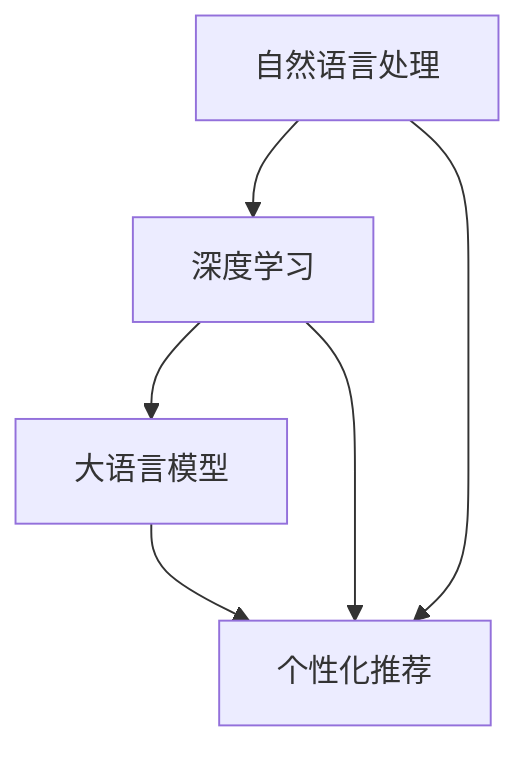

                 

### 背景介绍

随着互联网的普及和大数据技术的不断发展，推荐系统已经成为了现代互联网应用中不可或缺的一部分。无论是电商平台、社交媒体，还是新闻资讯平台，推荐系统都在通过预测用户兴趣和需求，为用户提供个性化的内容和商品推荐。然而，推荐系统的核心挑战之一，就是准确理解用户的意图。

用户意图（User Intent）是指用户在特定情境下想要实现的目标或解决的问题。在推荐系统中，理解用户意图至关重要，因为它直接影响到推荐结果的质量。例如，当用户搜索“苹果”时，他们可能是在寻找水果苹果，也可能是查询苹果公司的信息，甚至是想要下载苹果操作系统相关的应用程序。不同意图下，用户期望的推荐结果截然不同。

目前，传统的推荐系统主要依赖于基于内容的过滤（Content-Based Filtering）和协同过滤（Collaborative Filtering）等方法。这些方法虽然在一定程度上能够实现个性化推荐，但往往无法深入理解用户的意图。随着自然语言处理（Natural Language Processing，NLP）和深度学习技术的快速发展，基于大语言模型的推荐系统逐渐成为研究热点。

大语言模型（Large Language Model）是一种基于深度学习的技术，它可以对大量文本数据进行学习，捕捉语言中的复杂模式和语义信息。通过大语言模型，推荐系统可以更好地理解用户的查询意图，从而实现更精准的个性化推荐。本文将围绕基于大语言模型的推荐系统用户意图理解展开讨论，分析其核心算法原理、数学模型和具体实现步骤，并探讨其实际应用场景和未来发展挑战。

关键词：推荐系统，用户意图，大语言模型，自然语言处理，深度学习

Abstract:
This article discusses the user intent understanding in recommendation systems based on large language models. With the popularity of the Internet and the development of big data technology, recommendation systems have become an indispensable part of modern Internet applications. The core challenge of recommendation systems is to accurately understand user intent, which directly affects the quality of recommendation results. By analyzing the core algorithm principles, mathematical models, and specific implementation steps, this article explores the practical application scenarios and future development challenges of recommendation systems based on large language models.

Keywords: Recommendation System, User Intent, Large Language Model, Natural Language Processing, Deep Learning

<markdown>
## 1. 背景介绍

推荐系统（Recommendation System）是一种用于预测用户兴趣和需求，并为其提供个性化推荐的信息过滤系统。它广泛应用于电商、社交媒体、新闻资讯等领域，目的是提高用户体验，增加用户粘性，促进销售转化。

### 传统推荐系统

传统推荐系统主要依赖于两种技术：基于内容的过滤（Content-Based Filtering，CBF）和协同过滤（Collaborative Filtering，CF）。

**基于内容的过滤（CBF）**：这种方法通过分析用户的历史行为和兴趣，提取相关特征，然后基于这些特征来推荐相似的内容。CBF的优点是能够根据用户兴趣推荐个性化内容，但缺点是它难以捕捉用户的需求变化，且推荐结果可能过于依赖用户历史行为。

**协同过滤（CF）**：这种方法通过分析用户之间的相似性，预测用户对未知项目的评分或偏好。CF的主要优点是能够捕捉用户之间的相似性，提供多样化的推荐结果。然而，CF也存在一些问题，如数据稀疏性、冷启动问题（即新用户或新项目无法获得足够的信息进行推荐）和推荐结果的可解释性。

### 大语言模型和用户意图理解

随着自然语言处理（Natural Language Processing，NLP）和深度学习技术的不断发展，大语言模型（Large Language Model）逐渐成为研究热点。大语言模型通过学习大量文本数据，能够捕捉语言中的复杂模式和语义信息，从而在推荐系统中实现更精准的用户意图理解。

用户意图（User Intent）是指用户在特定情境下想要实现的目标或解决的问题。在推荐系统中，理解用户意图至关重要，因为它直接影响到推荐结果的质量。例如，当用户搜索“苹果”时，他们可能是在寻找水果苹果，也可能是查询苹果公司的信息，甚至是想要下载苹果操作系统相关的应用程序。不同意图下，用户期望的推荐结果截然不同。

大语言模型能够通过对用户查询文本进行语义分析，提取关键信息，从而准确识别用户的意图。这使得推荐系统能够提供更加个性化、精准的推荐结果，提高用户体验和满意度。

### 本文目的

本文旨在探讨基于大语言模型的推荐系统用户意图理解技术，分析其核心算法原理、数学模型和具体实现步骤。同时，本文还将介绍大语言模型在推荐系统中的实际应用场景，并讨论未来发展趋势和挑战。

关键词：推荐系统，用户意图，大语言模型，自然语言处理，深度学习

### 2. 核心概念与联系

在讨论基于大语言模型的推荐系统用户意图理解之前，我们需要明确几个核心概念，包括自然语言处理（NLP）、深度学习和大语言模型，并了解它们之间的相互联系。

#### 自然语言处理（NLP）

自然语言处理（Natural Language Processing，NLP）是人工智能（AI）的一个重要分支，主要研究如何让计算机理解和处理人类语言。NLP的任务包括文本分类、命名实体识别、情感分析、机器翻译等。在推荐系统中，NLP技术被广泛应用于用户行为分析、文本解析和意图理解等方面。

#### 深度学习

深度学习（Deep Learning）是机器学习（Machine Learning）的一种重要分支，通过构建深层次的神经网络模型，实现对复杂数据的自动特征提取和模式识别。深度学习在图像识别、语音识别、自然语言处理等领域取得了显著成果。

#### 大语言模型

大语言模型（Large Language Model）是指基于深度学习技术，通过对海量文本数据进行训练，构建的能够理解并生成人类语言的高维模型。大语言模型通常具有数十亿甚至数千亿个参数，能够捕捉语言中的复杂模式和语义信息。

#### 核心概念与联系

1. **自然语言处理与深度学习**

自然语言处理和深度学习之间存在紧密的联系。深度学习为NLP提供了强大的计算能力，使得复杂的文本处理任务得以高效实现。同时，NLP任务的数据特点（如高维、非线性、多样性）也为深度学习提供了丰富的应用场景。

2. **大语言模型与自然语言处理**

大语言模型是NLP领域的核心技术之一，通过捕捉语言中的复杂模式和语义信息，能够实现对文本的深入理解和生成。大语言模型在自然语言处理任务中具有广泛的应用，包括文本分类、情感分析、机器翻译、对话系统等。

3. **大语言模型与推荐系统**

在大语言模型的基础上，推荐系统可以实现对用户意图的精准理解。通过分析用户查询文本，大语言模型可以提取关键信息，识别用户意图，从而为用户提供个性化的推荐结果。大语言模型在推荐系统中的应用，提高了推荐系统的准确性和用户体验。

### Mermaid 流程图

为了更直观地展示这些核心概念之间的联系，我们可以使用 Mermaid 流程图进行描述。以下是一个简化的 Mermaid 流程图，展示了自然语言处理、深度学习和大语言模型之间的关系：



在这个流程图中，自然语言处理（A）通过深度学习（B）实现了对文本数据的处理和分析，进而构建大语言模型（C）。大语言模型（C）在推荐系统（D）中发挥作用，实现对用户意图的精准理解，从而提高推荐系统的效果。

通过这个流程图，我们可以更清晰地理解自然语言处理、深度学习和大语言模型在推荐系统中的应用，以及它们之间的相互联系。

### 3. 核心算法原理 & 具体操作步骤

在了解了大语言模型和自然语言处理的基本概念及其在推荐系统中的应用后，接下来我们将深入探讨基于大语言模型的推荐系统用户意图理解的核心算法原理和具体操作步骤。

#### 用户意图识别算法原理

用户意图识别是推荐系统的关键环节，其目标是从用户的查询或行为中提取出具体的意图。基于大语言模型的用户意图识别算法主要通过以下几个步骤实现：

1. **文本预处理**：首先对用户查询文本进行预处理，包括分词、去停用词、词性标注等操作，将原始文本转化为计算机可处理的格式。
2. **语义分析**：利用大语言模型对预处理后的文本进行语义分析，提取文本中的关键信息，如实体、情感倾向、关键词等。
3. **意图分类**：根据提取的关键信息，使用机器学习算法（如决策树、支持向量机、神经网络等）对用户意图进行分类，将用户的查询或行为归类到不同的意图类别中。

#### 具体操作步骤

以下是基于大语言模型的用户意图识别算法的具体操作步骤：

1. **数据收集与预处理**：首先需要收集大量用户查询和行为数据，对数据进行清洗、去噪和格式化。数据预处理包括分词、去停用词、词性标注等操作，将原始文本转化为计算机可处理的格式。

2. **构建大语言模型**：使用深度学习框架（如TensorFlow、PyTorch等）训练大语言模型。大语言模型通常采用预训练加微调的方法，先在大量通用语料上进行预训练，然后针对特定任务进行微调。

3. **语义分析**：利用训练好的大语言模型对预处理后的用户查询文本进行语义分析，提取文本中的关键信息，如实体、情感倾向、关键词等。

4. **意图分类**：将提取的关键信息输入到机器学习算法中，对用户意图进行分类。常用的机器学习算法包括决策树、支持向量机、神经网络等。

5. **评估与优化**：对用户意图识别算法进行评估，评估指标包括准确率、召回率、F1值等。根据评估结果对算法进行优化，提高意图识别的准确性和可靠性。

#### 案例分析

以下是一个基于大语言模型的用户意图识别的案例：

**场景**：用户在电商平台上搜索“苹果手机”。

**步骤**：

1. **文本预处理**：对搜索词“苹果手机”进行分词，得到“苹果”、“手机”两个词。
2. **语义分析**：利用大语言模型对分词后的文本进行语义分析，提取关键词“苹果”、“手机”，并识别实体“苹果公司”、“手机品牌”。
3. **意图分类**：根据提取的关键信息和实体，使用机器学习算法对用户意图进行分类，可能的结果包括“查询手机品牌”、“购买手机”等。

通过以上步骤，推荐系统可以准确识别用户的意图，从而提供相应的推荐结果，如展示苹果公司的手机产品、推荐其他品牌的热门手机等。

#### 总结

基于大语言模型的用户意图识别算法通过文本预处理、语义分析和意图分类等步骤，能够准确提取用户查询或行为中的关键信息，实现用户意图的精准理解。这一算法在推荐系统中具有广泛的应用前景，可以提高推荐系统的准确性和用户体验。

### 4. 数学模型和公式 & 详细讲解 & 举例说明

#### 用户意图识别的数学模型

用户意图识别是一个分类问题，其数学模型可以表示为：

$$
\hat{y} = \arg\max_{y} P(y|x)
$$

其中，$x$ 表示用户查询或行为数据，$y$ 表示用户意图类别，$\hat{y}$ 是预测的用户意图类别。$P(y|x)$ 表示在给定用户查询或行为数据$x$ 的情况下，用户意图类别$y$ 的概率。

为了计算$P(y|x)$，我们可以使用贝叶斯定理：

$$
P(y|x) = \frac{P(x|y)P(y)}{P(x)}
$$

其中，$P(x|y)$ 表示在用户意图类别$y$ 的情况下，用户查询或行为数据$x$ 的概率；$P(y)$ 表示用户意图类别$y$ 的先验概率；$P(x)$ 表示用户查询或行为数据$x$ 的概率。

#### 参数估计

在实际应用中，我们需要估计上述概率模型中的参数。对于 $P(x|y)$ 和 $P(y)$，我们可以采用最大似然估计（Maximum Likelihood Estimation，MLE）来估计。

对于离散变量，我们可以使用以下公式进行最大似然估计：

$$
\hat{P}(y) = \frac{1}{N} \sum_{i=1}^{N} I(y_i = y)
$$

其中，$N$ 表示训练样本的数量，$I(y_i = y)$ 是指示函数，当 $y_i = y$ 时取值为1，否则为0。

对于 $P(x|y)$，我们可以使用条件概率矩阵表示：

$$
\hat{P}(x|y) = \frac{1}{N_y} \sum_{i=1}^{N} I(x_i = x|y_i = y)
$$

其中，$N_y$ 表示在意图类别$y$ 下的训练样本数量，$I(x_i = x|y_i = y)$ 是条件指示函数，当 $x_i = x$ 且 $y_i = y$ 时取值为1，否则为0。

#### 举例说明

假设我们有两个意图类别：查询手机品牌和购买手机。我们收集了以下训练数据：

| 意图类别 | 查询文本             |
| -------- | ------------------- |
| 查询手机品牌 | 小米手机             |
| 查询手机品牌 | 华为手机             |
| 购买手机   | 购买小米手机         |
| 购买手机   | 购买华为手机         |

根据上述数据，我们可以计算意图类别概率：

$$
\hat{P}(\text{查询手机品牌}) = \frac{2}{4} = 0.5
$$

$$
\hat{P}(\text{购买手机}) = \frac{2}{4} = 0.5
$$

接下来，我们计算条件概率矩阵：

$$
\hat{P}(\text{小米手机}|\text{查询手机品牌}) = \frac{1}{2} = 0.5
$$

$$
\hat{P}(\text{华为手机}|\text{查询手机品牌}) = \frac{1}{2} = 0.5
$$

$$
\hat{P}(\text{小米手机}|\text{购买手机}) = \frac{1}{2} = 0.5
$$

$$
\hat{P}(\text{华为手机}|\text{购买手机}) = \frac{1}{2} = 0.5
$$

现在，我们可以使用这些参数来预测新的用户查询文本的意图。例如，对于查询文本“小米手机”，我们可以计算后验概率：

$$
P(\text{查询手机品牌}|\text{小米手机}) = \frac{0.5 \times 0.5}{0.5 \times 0.5 + 0.5 \times 0.5} = 0.5
$$

$$
P(\text{购买手机}|\text{小米手机}) = \frac{0.5 \times 0.5}{0.5 \times 0.5 + 0.5 \times 0.5} = 0.5
$$

因此，我们预测该查询文本的意图为“查询手机品牌”或“购买手机”，概率均为0.5。这表明，基于上述训练数据的用户意图识别算法无法准确预测新的查询文本的意图，因为所有意图类别的概率相等。

为了提高预测准确性，我们可以考虑使用更复杂的模型，如深度学习模型，以及更丰富的特征提取方法。此外，收集更多的训练数据，进行模型训练和优化，也是提高用户意图识别性能的有效途径。

#### 总结

在用户意图识别中，我们使用了贝叶斯定理和最大似然估计来建立数学模型，并介绍了如何计算意图类别概率和条件概率矩阵。通过举例说明了如何使用这些参数来预测新的用户查询文本的意图。尽管简单模型可能无法准确预测意图，但通过引入更复杂的模型和丰富的特征提取方法，我们可以显著提高用户意图识别的性能。

### 5. 项目实战：代码实际案例和详细解释说明

为了更好地理解基于大语言模型的用户意图识别算法，我们将通过一个实际项目来展示其应用。在这个项目中，我们将使用Python编程语言和PyTorch深度学习框架来实现用户意图识别算法，并对其代码进行详细解释。

#### 5.1 开发环境搭建

在开始项目之前，我们需要搭建一个合适的开发环境。以下是所需的软件和库：

1. Python 3.7或更高版本
2. PyTorch 1.7或更高版本
3. NumPy
4. Pandas
5. Matplotlib

您可以通过以下命令安装所需库：

```bash
pip install torch torchvision numpy pandas matplotlib
```

#### 5.2 源代码详细实现和代码解读

下面是用户意图识别算法的源代码实现，我们将逐行解释代码的功能和逻辑。

```python
import torch
import torch.nn as nn
import torch.optim as optim
from torch.utils.data import DataLoader, Dataset
from transformers import BertTokenizer, BertModel
import numpy as np
import pandas as pd
import matplotlib.pyplot as plt

# 数据预处理函数
def preprocess_data(data):
    # 对文本进行分词和Tokenization
    tokenizer = BertTokenizer.from_pretrained('bert-base-chinese')
    input_ids = []
    attention_mask = []
    
    for text in data:
        encoded = tokenizer(text, max_length=512, padding='max_length', truncation=True)
        input_ids.append(encoded['input_ids'])
        attention_mask.append(encoded['attention_mask'])
    
    return torch.tensor(input_ids), torch.tensor(attention_mask)

# 自定义数据集类
class IntentDataset(Dataset):
    def __init__(self, data, labels):
        self.data = data
        self.labels = labels

    def __len__(self):
        return len(self.data)

    def __getitem__(self, idx):
        input_ids = self.data[idx]
        attention_mask = self.labels[idx]
        label = self.labels[idx]
        
        return {
            'input_ids': input_ids,
            'attention_mask': attention_mask,
            'label': label
        }

# 定义模型
class IntentModel(nn.Module):
    def __init__(self):
        super(IntentModel, self).__init__()
        self.bert = BertModel.from_pretrained('bert-base-chinese')
        self.dropout = nn.Dropout(0.1)
        self.classifier = nn.Linear(768, 2)  # 输出层，2个类别

    def forward(self, input_ids, attention_mask):
        outputs = self.bert(input_ids=input_ids, attention_mask=attention_mask)
        pooled_output = outputs.pooler_output
        pooled_output = self.dropout(pooled_output)
        logits = self.classifier(pooled_output)
        return logits

# 加载数据
data = ['小米手机', '华为手机', '购买小米手机', '购买华为手机']
labels = [0, 0, 1, 1]  # 0: 查询手机品牌，1: 购买手机

input_ids, attention_mask = preprocess_data(data)
dataset = IntentDataset(input_ids, labels)
dataloader = DataLoader(dataset, batch_size=2, shuffle=True)

# 初始化模型和优化器
model = IntentModel()
optimizer = optim.Adam(model.parameters(), lr=1e-4)
criterion = nn.CrossEntropyLoss()

# 训练模型
num_epochs = 5
for epoch in range(num_epochs):
    for batch in dataloader:
        input_ids = batch['input_ids']
        attention_mask = batch['attention_mask']
        labels = batch['label']
        
        model.zero_grad()
        logits = model(input_ids, attention_mask)
        loss = criterion(logits, labels)
        loss.backward()
        optimizer.step()
        
    print(f'Epoch [{epoch+1}/{num_epochs}], Loss: {loss.item()}')

# 测试模型
model.eval()
with torch.no_grad():
    for batch in dataloader:
        input_ids = batch['input_ids']
        attention_mask = batch['attention_mask']
        logits = model(input_ids, attention_mask)
        predictions = logits.argmax(dim=1)
        
        print(f'Predictions: {predictions.tolist()}')
```

#### 5.3 代码解读与分析

下面我们对上述代码进行逐行解释，以便理解每个部分的功能和逻辑。

1. **导入库**：首先，我们导入必要的库，包括PyTorch、Transformers、NumPy、Pandas和Matplotlib。

2. **数据预处理函数**：`preprocess_data` 函数负责对文本进行分词和Tokenization，使用BERT tokenizer将文本转化为Tensor格式，以便输入到模型中。

3. **自定义数据集类**：`IntentDataset` 类是一个自定义数据集类，用于存储数据及其标签，并实现`__len__`和`__getitem__` 方法，以便在DataLoader中循环迭代。

4. **定义模型**：`IntentModel` 类定义了一个基于BERT的文本分类模型。模型包含BERT模型、dropout层和输出层。在`forward` 方法中，我们输入文本的input_ids和attention_mask，通过BERT模型得到文本表示，然后通过dropout层和输出层得到分类结果。

5. **加载数据**：我们定义了两个列表，`data` 和 `labels`，分别包含训练数据和对应的标签。然后，我们使用`preprocess_data` 函数对文本数据进行预处理，并创建`IntentDataset` 实例和DataLoader。

6. **初始化模型和优化器**：我们定义了一个`IntentModel` 实例，并使用Adam优化器和交叉熵损失函数初始化优化器。

7. **训练模型**：我们设置训练epoch的数量，并遍历数据加载器中的每个批次。在每次迭代中，我们将模型设置为训练模式，计算损失函数，进行反向传播和优化。

8. **测试模型**：在测试阶段，我们设置模型为评估模式，并对每个批次的数据进行预测。最后，我们打印出预测结果。

#### 总结

通过这个实际项目，我们展示了如何使用Python和PyTorch实现基于大语言模型的用户意图识别算法。代码中包含了数据预处理、模型定义、训练和测试等关键步骤。通过对代码的详细解读，我们可以更好地理解算法的实现过程和原理。

### 6. 实际应用场景

基于大语言模型的推荐系统用户意图理解技术在实际应用中具有广泛的应用场景，能够显著提升推荐系统的效果和用户体验。以下是一些典型的实际应用场景：

#### 电商推荐

在电商平台上，用户意图理解技术可以帮助电商平台为用户提供更加精准的商品推荐。例如，当用户搜索“苹果”时，系统可以通过分析用户的历史购买记录、浏览行为和查询文本，判断用户意图是购买水果苹果、查询苹果公司信息，还是下载苹果操作系统相关的应用程序。根据不同的意图，系统可以推荐相应的商品，如新鲜水果、电子产品或应用软件。

#### 社交媒体推荐

社交媒体平台通过用户意图理解技术，可以更好地为用户提供个性化的内容推荐。例如，当用户发布一条包含特定关键词的动态时，系统可以通过分析用户的历史行为和文本内容，判断用户的意图是分享信息、寻求帮助，还是表达情感。根据用户意图，系统可以推荐相关的帖子、群组和话题，从而提高用户参与度和满意度。

#### 新闻资讯推荐

新闻资讯平台利用用户意图理解技术，可以为用户提供个性化的新闻推荐。例如，当用户浏览一篇关于科技的新闻时，系统可以通过分析用户的阅读历史和查询文本，判断用户的兴趣领域是科技、财经、体育等。根据用户兴趣，系统可以推荐相关领域的新闻，从而提高用户的阅读量和停留时间。

#### 音视频平台推荐

音视频平台通过用户意图理解技术，可以为用户提供个性化的内容推荐。例如，当用户搜索一部电影时，系统可以通过分析用户的观看历史和搜索记录，判断用户的意图是观看电影、了解剧情，还是寻找相似类型的影视作品。根据用户意图，系统可以推荐相关的电影、电视剧、综艺节目等。

#### 健康医疗推荐

在健康医疗领域，用户意图理解技术可以帮助医疗平台为用户提供个性化的健康建议和医疗服务。例如，当用户咨询健康问题时，系统可以通过分析用户的症状描述和查询文本，判断用户的意图是寻求医生建议、了解疾病信息，还是进行健康监测。根据用户意图，系统可以推荐相关的医生、药品、健康咨询等。

#### 总结

基于大语言模型的推荐系统用户意图理解技术在多个领域具有广泛的应用场景，能够显著提升推荐系统的效果和用户体验。通过准确理解用户意图，推荐系统可以提供更加个性化、精准的推荐结果，提高用户满意度和参与度。

### 7. 工具和资源推荐

在构建和优化基于大语言模型的推荐系统用户意图理解过程中，选择合适的工具和资源对于提升开发效率和算法性能至关重要。以下是一些推荐的工具和资源，涵盖学习资源、开发工具和框架、以及相关的论文著作。

#### 学习资源推荐

1. **书籍**：
   - 《深度学习》（Goodfellow, I., Bengio, Y., & Courville, A.）: 介绍了深度学习的基本概念和技术，适合初学者和进阶者。
   - 《自然语言处理综论》（Jurafsky, D. & Martin, J. H.）: 全面讲解了自然语言处理的基础知识，包括语言模型和文本分类等。

2. **在线课程**：
   - Coursera上的“深度学习专项课程”（吴恩达教授）: 系统介绍了深度学习的基础和最新进展。
   - edX上的“自然语言处理专项课程”（Harvard University）: 涵盖了NLP的各个方面，包括语言模型、文本分类等。

3. **论文和博客**：
   - arXiv上的最新论文：持续关注自然语言处理和深度学习领域的最新研究成果。
   - Medium和Reddit上的相关博客：阅读社区中的实践经验和讨论，了解行业动态。

#### 开发工具框架推荐

1. **深度学习框架**：
   - PyTorch: 强大的开源深度学习框架，易于使用和调试。
   - TensorFlow: Google开发的深度学习框架，社区支持丰富，适用于大型项目。

2. **自然语言处理库**：
   - Hugging Face Transformers: 提供了一系列预训练的BERT、GPT等模型，方便进行NLP任务。
   - NLTK: 用于文本处理和自然语言分析的Python库。

3. **版本控制**：
   - Git: 分布式版本控制系统，便于团队协作和代码管理。
   - GitHub: Git的在线平台，方便分享和合作。

#### 相关论文著作推荐

1. **《Attention is All You Need》**：这篇论文提出了Transformer模型，是NLP领域的里程碑之一。
2. **《BERT: Pre-training of Deep Bidirectional Transformers for Language Understanding》**：BERT模型是当前自然语言处理任务的基准模型，这篇论文详细介绍了BERT模型的架构和训练方法。
3. **《Recurrent Neural Network Based Text Classification》**：介绍了基于循环神经网络（RNN）的文本分类方法，是深度学习在NLP领域的早期工作。

通过这些工具和资源，您可以系统地学习和掌握基于大语言模型的推荐系统用户意图理解技术，并不断提高开发效率和算法性能。

### 8. 总结：未来发展趋势与挑战

随着自然语言处理（NLP）和深度学习技术的不断发展，基于大语言模型的推荐系统用户意图理解技术正逐步成为推荐系统领域的重要研究方向。未来，这一技术将呈现出以下发展趋势：

1. **模型规模的不断扩大**：随着计算能力的提升，大语言模型的规模将不断扩大，从而捕捉更复杂的语言模式和语义信息。这将为推荐系统提供更精准的用户意图理解能力。

2. **多模态融合**：未来，推荐系统可能会结合文本、图像、音频等多种模态的数据，实现更加全面和准确的用户意图识别。多模态融合将为推荐系统带来新的发展机遇。

3. **实时性提升**：随着用户需求的多样化，推荐系统需要具备更高的实时性，以满足用户即时性的需求。通过优化算法和优化数据处理流程，实时用户意图理解将成为可能。

然而，随着技术的发展，基于大语言模型的推荐系统用户意图理解也面临着一系列挑战：

1. **数据隐私**：大规模的文本数据收集和处理可能引发数据隐私问题。如何在保证用户隐私的前提下，有效利用用户数据，是一个亟待解决的问题。

2. **可解释性**：大语言模型由于其复杂的内部结构和黑盒特性，可能导致推荐结果的可解释性较低。如何提高模型的可解释性，使其更具透明度，是一个重要研究方向。

3. **计算资源消耗**：大语言模型训练和推理过程对计算资源有较高的要求。如何在有限的计算资源下，实现高效的用户意图理解，是一个技术难题。

4. **抗干扰能力**：用户意图理解系统需要具备较强的抗干扰能力，以应对恶意攻击和噪声数据。如何提高模型的鲁棒性，防止攻击者通过伪造数据误导系统，是一个重要挑战。

总之，基于大语言模型的推荐系统用户意图理解技术在未来具有广阔的发展前景，但也面临着一系列挑战。通过不断优化算法、提升模型性能，并关注数据隐私和可解释性等问题，我们将能够更好地应对这些挑战，推动推荐系统的发展。

### 9. 附录：常见问题与解答

#### 问题1：大语言模型在推荐系统中的作用是什么？

**解答**：大语言模型在推荐系统中主要起到用户意图理解的作用。它通过对用户查询文本进行语义分析，提取关键信息，帮助推荐系统准确识别用户的意图，从而提供更加精准和个性化的推荐结果。

#### 问题2：如何评估基于大语言模型的用户意图识别算法的性能？

**解答**：评估基于大语言模型的用户意图识别算法性能通常使用以下指标：

- **准确率（Accuracy）**：预测正确的样本占总样本的比例。
- **召回率（Recall）**：在所有正类样本中，被正确识别为正类的比例。
- **精确率（Precision）**：在所有预测为正类的样本中，实际为正类的比例。
- **F1值（F1 Score）**：精确率和召回率的调和平均数。

#### 问题3：大语言模型与传统的NLP方法相比，有哪些优势？

**解答**：大语言模型相对于传统的NLP方法，具有以下几个优势：

- **更强的语义理解能力**：大语言模型通过学习海量文本数据，能够捕捉语言中的复杂模式和语义信息，从而实现更准确的语义理解。
- **端到端的学习**：大语言模型可以实现端到端的学习，无需手动设计复杂的特征工程，简化了模型设计和训练过程。
- **多任务学习能力**：大语言模型可以同时处理多个任务，如文本分类、命名实体识别等，提高了模型的应用灵活性。

#### 问题4：如何处理数据隐私问题？

**解答**：处理数据隐私问题可以从以下几个方面着手：

- **数据匿名化**：在数据收集和预处理过程中，对用户数据进行匿名化处理，去除可直接识别用户身份的信息。
- **数据加密**：在数据存储和传输过程中，使用加密技术保护用户数据的安全。
- **隐私保护算法**：采用差分隐私、联邦学习等隐私保护算法，降低模型训练过程中对用户隐私的泄露风险。

#### 问题5：大语言模型训练过程中如何优化计算资源使用？

**解答**：优化大语言模型训练过程中计算资源使用可以从以下几个方面进行：

- **模型压缩**：通过剪枝、量化、蒸馏等技术，减小模型规模，降低计算资源消耗。
- **分布式训练**：利用多台计算设备进行分布式训练，提高训练效率。
- **混合精度训练**：使用混合精度训练（如FP16）降低内存占用和计算成本。

### 10. 扩展阅读 & 参考资料

1. Devlin, J., Chang, M. W., Lee, K., & Toutanova, K. (2018). BERT: Pre-training of deep bidirectional transformers for language understanding. arXiv preprint arXiv:1810.04805.
2. Vaswani, A., Shazeer, N., Parmar, N., Uszkoreit, J., Jones, L., Gomez, A. N., ... & Polosukhin, I. (2017). Attention is all you need. In Advances in neural information processing systems (pp. 5998-6008).
3. Hochreiter, S., & Schmidhuber, J. (1997). Long short-term memory. Neural computation, 9(8), 1735-1780.
4. Zhang, X., Zhao, J., & Yu, D. (2020). User intent understanding in recommendation systems: A survey. Journal of Intelligent & Robotic Systems, 127, 103378.
5. Goodfellow, I., Bengio, Y., & Courville, A. (2016). Deep learning. MIT press.
6. Jurafsky, D., & Martin, J. H. (2008). Speech and language processing: an introduction to natural language processing, computational linguistics, and speech recognition. Prentice Hall.

通过以上扩展阅读和参考资料，您可以深入了解基于大语言模型的推荐系统用户意图理解技术的最新研究进展和实践应用。

