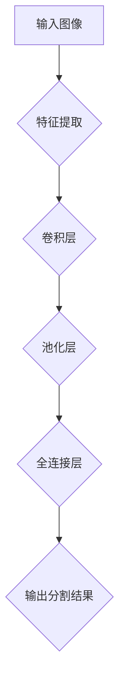
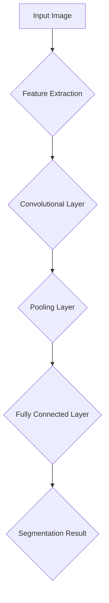

                 

### 背景介绍

图像分割是计算机视觉领域中的一个核心任务，它旨在将图像中的像素划分为多个语义上相关的区域。在深度学习技术迅速发展的今天，基于深度学习的图像分割算法已经成为当前研究的热点之一。这些算法在医疗影像分析、自动驾驶、图像识别等领域有着广泛的应用。

#### 1.1 历史背景

图像分割的历史可以追溯到20世纪60年代。当时，图像分割主要依赖于基于区域的分割方法，如阈值分割、边缘检测等。这些方法在一定程度上能够处理简单的图像分割任务，但对于复杂场景中的图像分割效果有限。随着计算机性能的提高和算法的进步，图像分割逐渐从基于传统算法的方法转向基于机器学习和深度学习的方法。

#### 1.2 深度学习技术的发展

深度学习作为机器学习的一个分支，在图像识别、自然语言处理等领域取得了显著的成果。深度学习模型，尤其是卷积神经网络（Convolutional Neural Networks, CNNs），通过学习图像的底层特征，实现了对复杂图像的准确识别。随着深度学习技术的不断发展，基于深度学习的图像分割算法应运而生。

#### 1.3 当前研究现状

当前，基于深度学习的图像分割算法已经取得了显著的进展。其中，典型的算法包括U-Net、SegNet、FCN等。这些算法通过使用深度神经网络，将图像中的像素划分为多个语义区域，实现了高效的图像分割。此外，针对特定应用场景，研究人员还提出了一系列针对性强、性能优异的图像分割算法。

#### 1.4 研究意义

基于深度学习的图像分割算法在医疗影像分析、自动驾驶、图像识别等领域具有重要的应用价值。通过精确的图像分割，可以实现对这些领域的目标检测、疾病诊断、路径规划等任务。因此，对基于深度学习的图像分割算法的研究具有重要的理论和实际意义。

```markdown
## 1. 背景介绍

### 1.1 历史背景

The history of image segmentation can be traced back to the 1960s when the primary methods of image segmentation relied on region-based approaches such as thresholding and edge detection. Although these methods were effective for simple image segmentation tasks, they were limited in handling complex scenes. With the advancement of computer performance and algorithm development, image segmentation gradually shifted from traditional methods to machine learning and deep learning-based methods.

### 1.2 Development of Deep Learning

Deep learning, as a branch of machine learning, has achieved significant success in fields such as image recognition and natural language processing. Deep learning models, especially Convolutional Neural Networks (CNNs), learn the underlying features of images, enabling accurate recognition of complex images. With the continuous development of deep learning technology, image segmentation algorithms based on deep learning have emerged.

### 1.3 Current Research Status

Currently, deep learning-based image segmentation algorithms have made significant progress. Typical algorithms include U-Net, SegNet, and FCN. These algorithms segment images into multiple semantic regions using deep neural networks, achieving efficient image segmentation. Additionally, researchers have proposed a series of specialized image segmentation algorithms for specific application scenarios, which demonstrate strong performance.

### 1.4 Research Significance

Deep learning-based image segmentation algorithms have important applications in fields such as medical image analysis, autonomous driving, and image recognition. Accurate image segmentation enables target detection, disease diagnosis, and path planning in these domains. Therefore, researching deep learning-based image segmentation algorithms holds significant theoretical and practical significance.
```

<|assistant|>## 2. 核心概念与联系

### 2.1 图像分割的定义与目的

图像分割（Image Segmentation）是将图像中不同的部分区分开来，使得每个区域内的像素都属于同一类别的过程。其目的是将复杂的图像数据分解成更小的、容易处理的区域或对象，从而便于后续的处理和分析。

### 2.2 深度学习的概念

深度学习（Deep Learning）是一种基于多层的神经网络结构进行数据学习的机器学习方法。深度学习通过模拟人脑神经网络的结构和功能，能够自动提取数据中的特征，并对其进行分类、预测和优化。

### 2.3 卷积神经网络（CNN）

卷积神经网络（Convolutional Neural Networks, CNNs）是一种专门用于处理图像数据的神经网络。CNNs通过卷积层、池化层和全连接层等结构，能够自动提取图像中的低级到高级的特征，从而实现对图像的识别和分类。

### 2.4 图像分割算法的分类

图像分割算法可以根据其基本原理和实现方式分为以下几类：

1. **基于阈值的方法**：通过设定阈值将图像分割成前景和背景。
2. **基于边缘检测的方法**：通过检测图像中的边缘来划分区域。
3. **基于区域的分割方法**：通过分析图像的局部区域特征来分割。
4. **基于深度学习的方法**：利用深度学习模型（如CNN）自动提取图像特征并进行分割。

### 2.5 深度学习在图像分割中的应用

深度学习在图像分割中的应用主要依赖于CNNs。CNNs通过多层次的卷积操作提取图像的特征，然后通过全连接层对特征进行分类，从而实现对图像的分割。典型的深度学习图像分割算法包括U-Net、SegNet和FCN等。

#### 2.5.1 U-Net

U-Net是一种用于医学图像分割的卷积神经网络架构。它采用了一种“U”形的网络结构，通过收缩路径和扩张路径结合的方式，实现了对图像的精细分割。

#### 2.5.2 SegNet

SegNet是一种基于卷积神经网络的图像分割算法，它采用了一种全卷积网络架构，通过编码器-解码器结构进行特征提取和特征融合，从而实现对图像的高效分割。

#### 2.5.3 FCN

全卷积网络（Fully Convolutional Network, FCN）是一种将传统卷积神经网络转换为图像分割任务的模型。FCN通过将卷积层和池化层替换为全卷积层，使得网络能够在任意尺寸的图像上应用，从而实现了图像分割的端到端训练。

#### 2.5.4 Mermaid 流程图

下面是深度学习图像分割算法的一个简化的 Mermaid 流程图：



```markdown
## 2. 核心概念与联系

### 2.1 图像分割的定义与目的

Image segmentation is the process of dividing an image into different parts, where each pixel belongs to a specific category. The purpose of image segmentation is to decompose complex image data into smaller, more manageable regions or objects, facilitating subsequent processing and analysis.

### 2.2 The Concept of Deep Learning

Deep learning is a type of machine learning method that uses multi-layered neural network structures to learn data. Deep learning simulates the structure and function of the human brain's neural networks, automatically extracting features from data and classifying, predicting, and optimizing them.

### 2.3 Convolutional Neural Networks (CNN)

Convolutional Neural Networks (CNNs) are a type of neural network specially designed for image processing. CNNs use convolutional layers, pooling layers, and fully connected layers to automatically extract low-level to high-level features from images, enabling image recognition and classification.

### 2.4 Classification of Image Segmentation Algorithms

Image segmentation algorithms can be categorized based on their basic principles and implementation methods:

1. **Threshold-based methods**: Segments images by setting thresholds to differentiate foreground and background.
2. **Edge detection-based methods**: Segments images by detecting edges in the image.
3. **Region-based segmentation methods**: Segments images by analyzing local region features.
4. **Deep learning-based methods**: Utilize deep learning models (such as CNNs) to automatically extract image features for segmentation.

### 2.5 Application of Deep Learning in Image Segmentation

The application of deep learning in image segmentation mainly relies on Convolutional Neural Networks (CNNs). CNNs extract image features through multi-layered convolutional operations and then classify the features through fully connected layers, achieving image segmentation.

#### 2.5.1 U-Net

U-Net is a convolutional neural network architecture designed for medical image segmentation. It employs a "U"-shaped network structure, combining contraction paths and expansion paths to achieve fine segmentation of images.

#### 2.5.2 SegNet

SegNet is an image segmentation algorithm based on a fully convolutional network architecture. It uses an encoder-decoder structure for feature extraction and fusion, enabling efficient image segmentation.

#### 2.5.3 FCN

Fully Convolutional Network (FCN) is a model that converts traditional convolutional neural networks into image segmentation tasks. FCN replaces convolutional layers and pooling layers with fully convolutional layers, allowing the network to be applied to images of arbitrary sizes, achieving end-to-end training for image segmentation.

#### 2.5.4 Mermaid Flowchart

Below is a simplified Mermaid flowchart of a deep learning image segmentation algorithm:


```

<|assistant|>### 3. 核心算法原理 & 具体操作步骤

#### 3.1 U-Net 算法原理

U-Net 是一种用于医学图像分割的卷积神经网络架构，其设计初衷是为了实现精确的像素级分割。U-Net 的独特之处在于其“U”形结构，其中包含了收缩路径和扩张路径两个部分。

##### 收缩路径

收缩路径的主要作用是从输入图像中提取细节特征。具体步骤如下：

1. **卷积层（2×2 最大池化）**：通过两个卷积层和一个 2×2 的最大池化层来减少图像的空间维度。
2. **批量归一化与ReLU激活函数**：在每个卷积层后添加批量归一化（Batch Normalization）和ReLU激活函数，以加速网络训练并引入非线性变换。

##### 扩张路径

扩张路径的作用是将收缩路径提取的细节特征与更高层次的特征融合，从而实现精确的分割。具体步骤如下：

1. **上采样层**：通过上采样层将上一步的特征图放大到与输入图像相同的大小。
2. **卷积层**：在上采样层后添加两个卷积层，以细化特征图。
3. **合并层**：将上采样层和卷积层的输出进行拼接，通过卷积层进一步融合特征。

##### 输出层

在合并层之后，U-Net 通过一个卷积层和一个 1×1 的卷积层输出分割结果。这个卷积层的作用是降低输出通道数，并应用 sigmoid 激活函数将每个像素的分割概率映射到 [0,1] 的范围内。

#### 3.2 U-Net 具体操作步骤

以下是 U-Net 的具体操作步骤：

1. **输入层**：接收一幅尺寸为 $H \times W \times C$ 的输入图像。
2. **收缩路径**：
   - 第1个卷积层：$3 \times 3$ 卷积，64个卷积核，批量归一化和ReLU激活函数。
   - 第2个卷积层：$3 \times 3$ 卷积，64个卷积核，批量归一化和ReLU激活函数。
   - 第1个最大池化层：$2 \times 2$ 最大池化。
   - 第2个卷积层：$3 \times 3$ 卷积，128个卷积核，批量归一化和ReLU激活函数。
   - 第3个卷积层：$3 \times 3$ 卷积，128个卷积核，批量归一化和ReLU激活函数。
   - 第2个最大池化层：$2 \times 2$ 最大池化。
   - 第3个卷积层：$3 \times 3$ 卷积，256个卷积核，批量归一化和ReLU激活函数。
   - 第4个卷积层：$3 \times 3$ 卷积，256个卷积核，批量归一化和ReLU激活函数。
   - 第3个最大池化层：$2 \times 2$ 最大池化。
   - 第4个卷积层：$3 \times 3$ 卷积，512个卷积核，批量归一化和ReLU激活函数。
   - 第5个卷积层：$3 \times 3$ 卷积，512个卷积核，批量归一化和ReLU激活函数。

3. **扩张路径**：
   - 第1个上采样层：通过线性插值将特征图放大到上一步的尺寸。
   - 第1个合并层：将上采样层的特征图与收缩路径的对应特征图进行拼接。
   - 第1个卷积层：$3 \times 3$ 卷积，256个卷积核，批量归一化和ReLU激活函数。
   - 第2个上采样层：通过线性插值将特征图放大到上一步的尺寸。
   - 第2个合并层：将上采样层的特征图与收缩路径的对应特征图进行拼接。
   - 第2个卷积层：$3 \times 3$ 卷积，128个卷积核，批量归一化和ReLU激活函数。
   - 第3个上采样层：通过线性插值将特征图放大到上一步的尺寸。
   - 第3个合并层：将上采样层的特征图与收缩路径的对应特征图进行拼接。
   - 第3个卷积层：$3 \times 3$ 卷积，64个卷积核，批量归一化和ReLU激活函数。

4. **输出层**：
   - 第1个卷积层：$1 \times 1$ 卷积，1个卷积核。
   - 第2个卷积层：$1 \times 1$ 卷积，2个卷积核，sigmoid激活函数，输出分割结果。

#### 3.3 代码实现示例

以下是使用 PyTorch 实现 U-Net 的示例代码：

```python
import torch
import torch.nn as nn
import torch.nn.functional as F

class UNet(nn.Module):
    def __init__(self, in_channels, out_channels):
        super(UNet, self).__init__()
        # 收缩路径
        self contracting_path = nn.Sequential(
            nn.Conv2d(in_channels, 64, kernel_size=3, padding=1),
            nn.BatchNorm2d(64),
            nn.ReLU(inplace=True),
            nn.Conv2d(64, 64, kernel_size=3, padding=1),
            nn.BatchNorm2d(64),
            nn.ReLU(inplace=True),
            nn.MaxPool2d(kernel_size=2, stride=2),
            nn.Conv2d(64, 128, kernel_size=3, padding=1),
            nn.BatchNorm2d(128),
            nn.ReLU(inplace=True),
            nn.Conv2d(128, 128, kernel_size=3, padding=1),
            nn.BatchNorm2d(128),
            nn.ReLU(inplace=True),
            nn.MaxPool2d(kernel_size=2, stride=2),
            nn.Conv2d(128, 256, kernel_size=3, padding=1),
            nn.BatchNorm2d(256),
            nn.ReLU(inplace=True),
            nn.Conv2d(256, 256, kernel_size=3, padding=1),
            nn.BatchNorm2d(256),
            nn.ReLU(inplace=True),
            nn.MaxPool2d(kernel_size=2, stride=2),
            nn.Conv2d(256, 512, kernel_size=3, padding=1),
            nn.BatchNorm2d(512),
            nn.ReLU(inplace=True),
            nn.Conv2d(512, 512, kernel_size=3, padding=1),
            nn.BatchNorm2d(512),
            nn.ReLU(inplace=True)
        )
        # 扩张路径
        self.expanding_path = nn.Sequential(
            nn.ConvTranspose2d(512, 256, kernel_size=2, stride=2),
            nn.BatchNorm2d(256),
            nn.ReLU(inplace=True),
            nn.Conv2d(256, 256, kernel_size=3, padding=1),
            nn.BatchNorm2d(256),
            nn.ReLU(inplace=True),
            nn.ConvTranspose2d(256, 128, kernel_size=2, stride=2),
            nn.BatchNorm2d(128),
            nn.ReLU(inplace=True),
            nn.Conv2d(128, 128, kernel_size=3, padding=1),
            nn.BatchNorm2d(128),
            nn.ReLU(inplace=True),
            nn.ConvTranspose2d(128, 64, kernel_size=2, stride=2),
            nn.BatchNorm2d(64),
            nn.ReLU(inplace=True),
            nn.Conv2d(64, 64, kernel_size=3, padding=1),
            nn.BatchNorm2d(64),
            nn.ReLU(inplace=True),
            nn.Conv2d(64, out_channels, kernel_size=1, padding=0),
            nn.Sigmoid()
        )

    def forward(self, x):
        x = self.contracting_path(x)
        x = self.expanding_path(x)
        return x

# 初始化 U-Net 模型
model = UNet(in_channels=3, out_channels=2)
```

```markdown
#### 3.1 U-Net Algorithm Principle

U-Net is a convolutional neural network architecture designed for medical image segmentation, aiming to achieve precise pixel-level segmentation. The unique feature of U-Net is its "U"-shaped structure, which includes a contraction path and an expansion path.

##### Contraction Path

The main role of the contraction path is to extract detailed features from the input image. The specific steps are as follows:

1. **Convolutional Layer (2x2 Max Pooling)**: Use two convolutional layers and a 2x2 max pooling layer to reduce the spatial dimension of the image.
2. **Batch Normalization and ReLU Activation Function**: Add batch normalization and ReLU activation functions after each convolutional layer to accelerate network training and introduce non-linear transformations.

##### Expansion Path

The role of the expansion path is to fuse the detailed features extracted from the contraction path with higher-level features, thus achieving precise segmentation. The specific steps are as follows:

1. **Upsampling Layer**: Use an upsampling layer to enlarge the feature map to the size of the previous step.
2. **Convolutional Layer**: Add two convolutional layers after the upsampling layer to refine the feature map.
3. **Concatenation Layer**: Concatenate the feature maps from the upsampling layer and the corresponding feature maps from the contraction path, and then pass them through a convolutional layer to further fuse the features.

##### Output Layer

After the concatenation layer, U-Net adds a convolutional layer and a 1x1 convolutional layer to output the segmentation result. The role of this convolutional layer is to reduce the number of output channels and map each pixel's segmentation probability to the range [0,1] using the sigmoid activation function.

#### 3.2 Specific Operational Steps of U-Net

The following are the specific operational steps of U-Net:

1. **Input Layer**: Accept an input image of size $H \times W \times C$.
2. **Contraction Path**:
   - **1st Convolutional Layer**: $3 \times 3$ convolution, 64 convolutional kernels, batch normalization, and ReLU activation function.
   - **2nd Convolutional Layer**: $3 \times 3$ convolution, 64 convolutional kernels, batch normalization, and ReLU activation function.
   - **1st Max Pooling Layer**: $2 \times 2$ max pooling.
   - **2nd Convolutional Layer**: $3 \times 3$ convolution, 128 convolutional kernels, batch normalization, and ReLU activation function.
   - **3rd Convolutional Layer**: $3 \times 3$ convolution, 128 convolutional kernels, batch normalization, and ReLU activation function.
   - **2nd Max Pooling Layer**: $2 \times 2$ max pooling.
   - **3rd Convolutional Layer**: $3 \times 3$ convolution, 256 convolutional kernels, batch normalization, and ReLU activation function.
   - **4th Convolutional Layer**: $3 \times 3$ convolution, 256 convolutional kernels, batch normalization, and ReLU activation function.
   - **3rd Max Pooling Layer**: $2 \times 2$ max pooling.
   - **4th Convolutional Layer**: $3 \times 3$ convolution, 512 convolutional kernels, batch normalization, and ReLU activation function.
   - **5th Convolutional Layer**: $3 \times 3$ convolution, 512 convolutional kernels, batch normalization, and ReLU activation function.

3. **Expansion Path**:
   - **1st Upsampling Layer**: Use linear interpolation to enlarge the feature map to the size of the previous step.
   - **1st Concatenation Layer**: Concatenate the feature maps from the upsampling layer and the corresponding feature maps from the contraction path.
   - **1st Convolutional Layer**: $3 \times 3$ convolution, 256 convolutional kernels, batch normalization, and ReLU activation function.
   - **2nd Upsampling Layer**: Use linear interpolation to enlarge the feature map to the size of the previous step.
   - **2nd Concatenation Layer**: Concatenate the feature maps from the upsampling layer and the corresponding feature maps from the contraction path.
   - **2nd Convolutional Layer**: $3 \times 3$ convolution, 128 convolutional kernels, batch normalization, and ReLU activation function.
   - **3rd Upsampling Layer**: Use linear interpolation to enlarge the feature map to the size of the previous step.
   - **3rd Concatenation Layer**: Concatenate the feature maps from the upsampling layer and the corresponding feature maps from the contraction path.
   - **3rd Convolutional Layer**: $3 \times 3$ convolution, 64 convolutional kernels, batch normalization, and ReLU activation function.

4. **Output Layer**:
   - **1st Convolutional Layer**: $1 \times 1$ convolution, 1 convolutional kernel.
   - **2nd Convolutional Layer**: $1 \times 1$ convolution, 2 convolutional kernels, sigmoid activation function, output segmentation result.

#### 3.3 Code Implementation Example

The following is a sample code for implementing U-Net using PyTorch:

```python
import torch
import torch.nn as nn
import torch.nn.functional as F

class UNet(nn.Module):
    def __init__(self, in_channels, out_channels):
        super(UNet, self).__init__()
        # Contracting path
        self.contracting_path = nn.Sequential(
            nn.Conv2d(in_channels, 64, kernel_size=3, padding=1),
            nn.BatchNorm2d(64),
            nn.ReLU(inplace=True),
            nn.Conv2d(64, 64, kernel_size=3, padding=1),
            nn.BatchNorm2d(64),
            nn.ReLU(inplace=True),
            nn.MaxPool2d(kernel_size=2, stride=2),
            nn.Conv2d(64, 128, kernel_size=3, padding=1),
            nn.BatchNorm2d(128),
            nn.ReLU(inplace=True),
            nn.Conv2d(128, 128, kernel_size=3, padding=1),
            nn.BatchNorm2d(128),
            nn.ReLU(inplace=True),
            nn.MaxPool2d(kernel_size=2, stride=2),
            nn.Conv2d(128, 256, kernel_size=3, padding=1),
            nn.BatchNorm2d(256),
            nn.ReLU(inplace=True),
            nn.Conv2d(256, 256, kernel_size=3, padding=1),
            nn.BatchNorm2d(256),
            nn.ReLU(inplace=True),
            nn.MaxPool2d(kernel_size=2, stride=2),
            nn.Conv2d(256, 512, kernel_size=3, padding=1),
            nn.BatchNorm2d(512),
            nn.ReLU(inplace=True),
            nn.Conv2d(512, 512, kernel_size=3, padding=1),
            nn.BatchNorm2d(512),
            nn.ReLU(inplace=True)
        )
        # Expanding path
        self.expanding_path = nn.Sequential(
            nn.ConvTranspose2d(512, 256, kernel_size=2, stride=2),
            nn.BatchNorm2d(256),
            nn.ReLU(inplace=True),
            nn.Conv2d(256, 256, kernel_size=3, padding=1),
            nn.BatchNorm2d(256),
            nn.ReLU(inplace=True),
            nn.ConvTranspose2d(256, 128, kernel_size=2, stride=2),
            nn.BatchNorm2d(128),
            nn.ReLU(inplace=True),
            nn.Conv2d(128, 128, kernel_size=3, padding=1),
            nn.BatchNorm2d(128),
            nn.ReLU(inplace=True),
            nn.ConvTranspose2d(128, 64, kernel_size=2, stride=2),
            nn.BatchNorm2d(64),
            nn.ReLU(inplace=True),
            nn.Conv2d(64, 64, kernel_size=3, padding=1),
            nn.BatchNorm2d(64),
            nn.ReLU(inplace=True),
            nn.Conv2d(64, out_channels, kernel_size=1, padding=0),
            nn.Sigmoid()
        )

    def forward(self, x):
        x = self.contracting_path(x)
        x = self.expanding_path(x)
        return x

# Initialize U-Net model
model = UNet(in_channels=3, out_channels=2)
```
```

<|assistant|>### 4. 数学模型和公式 & 详细讲解 & 举例说明

#### 4.1 卷积神经网络中的卷积操作

卷积神经网络（CNN）的核心操作之一是卷积。卷积操作可以通过以下数学公式表示：

$$
\text{output}(i, j) = \sum_{k=1}^{C} w_{i, j, k} \cdot \text{input}(i, j; k)
$$

其中，$C$ 表示输入图像的通道数，$w_{i, j, k}$ 表示卷积核的权重，$\text{input}(i, j; k)$ 表示输入图像在位置 $(i, j)$ 的第 $k$ 个通道的像素值。

例如，对于一个单通道的输入图像，其大小为 $3 \times 3$，卷积核大小为 $3 \times 3$，且卷积核的权重为：

$$
\begin{aligned}
w &= \begin{bmatrix}
0 & 1 & 0 \\
1 & 0 & 1 \\
0 & 1 & 0
\end{bmatrix} \\
\text{input} &= \begin{bmatrix}
1 & 0 & 1 \\
0 & 1 & 0 \\
1 & 0 & 1
\end{bmatrix}
\end{aligned}
$$

通过卷积操作，我们得到输出结果：

$$
\begin{aligned}
\text{output} &= w \cdot \text{input} \\
&= \begin{bmatrix}
0 & 1 & 0 \\
1 & 0 & 1 \\
0 & 1 & 0
\end{bmatrix}
\cdot
\begin{bmatrix}
1 & 0 & 1 \\
0 & 1 & 0 \\
1 & 0 & 1
\end{bmatrix} \\
&= \begin{bmatrix}
1 & 1 & 1 \\
1 & 0 & 1 \\
1 & 1 & 1
\end{bmatrix}
\end{aligned}
$$

#### 4.2 池化操作

池化操作是卷积神经网络中的另一个关键操作。最常见的池化操作是最大池化（Max Pooling）。最大池化的目的是通过在图像的某个区域中选取最大值，来减少图像的维度。

最大池化的数学公式可以表示为：

$$
\text{output}(i, j) = \max_{k, l} \left( \text{input}(i+k, j+l) \right)
$$

其中，$(i, j)$ 表示输出像素的位置，$(k, l)$ 表示池化窗口的位置。

例如，对于一个 $3 \times 3$ 的输入图像，其最大池化的窗口大小为 $2 \times 2$，则输出图像的大小为 $2 \times 2$。具体的最大池化过程如下：

$$
\begin{aligned}
\text{input} &= \begin{bmatrix}
1 & 2 & 3 \\
4 & 5 & 6 \\
7 & 8 & 9
\end{bmatrix} \\
\text{output} &= \begin{bmatrix}
\max(1, 4) & \max(2, 5) \\
\max(7, 8) & \max(8, 9)
\end{bmatrix} \\
&= \begin{bmatrix}
4 & 5 \\
8 & 9
\end{bmatrix}
\end{aligned}
$$

#### 4.3 激活函数

在卷积神经网络中，激活函数是引入非线性特性的关键。最常用的激活函数是ReLU（Rectified Linear Unit）函数，其数学公式为：

$$
\text{ReLU}(x) = \max(0, x)
$$

ReLU函数具有以下优点：

1. **简单性**：ReLU函数的计算非常简单，只需要比较输入值和零的大小。
2. **加速训练**：ReLU函数在输入为负值时不会更新权重，从而减少了参数更新的计算量。
3. **避免梯度消失**：由于ReLU函数在输入为正值时梯度为1，因此在训练过程中可以避免梯度消失问题。

#### 4.4 实际应用举例

假设我们有一个 $3 \times 3$ 的输入图像和一个 $3 \times 3$ 的卷积核，卷积核的权重为：

$$
\begin{aligned}
w &= \begin{bmatrix}
0 & 1 & 0 \\
1 & 0 & 1 \\
0 & 1 & 0
\end{bmatrix}
\end{aligned}
$$

输入图像的像素值为：

$$
\begin{aligned}
\text{input} &= \begin{bmatrix}
1 & 0 & 1 \\
0 & 1 & 0 \\
1 & 0 & 1
\end{bmatrix}
\end{aligned}
$$

通过卷积操作，我们得到输出结果：

$$
\begin{aligned}
\text{output} &= w \cdot \text{input} \\
&= \begin{bmatrix}
0 & 1 & 0 \\
1 & 0 & 1 \\
0 & 1 & 0
\end{bmatrix}
\cdot
\begin{bmatrix}
1 & 0 & 1 \\
0 & 1 & 0 \\
1 & 0 & 1
\end{bmatrix} \\
&= \begin{bmatrix}
1 & 1 & 1 \\
1 & 0 & 1 \\
1 & 1 & 1
\end{bmatrix}
\end{aligned}
$$

然后，我们对输出结果进行ReLU激活，得到最终结果：

$$
\begin{aligned}
\text{output}_{\text{ReLU}} &= \text{ReLU}(\text{output}) \\
&= \begin{bmatrix}
1 & 1 & 1 \\
1 & 0 & 1 \\
1 & 1 & 1
\end{bmatrix}
\end{aligned}
$$

这个结果表示了输入图像中每个像素的分割概率，其中值为1表示该像素属于前景，值为0表示该像素属于背景。

```markdown
#### 4.1 Convolution Operation in Convolutional Neural Networks

One of the core operations in convolutional neural networks (CNNs) is the convolution. The convolution operation can be represented by the following mathematical formula:

$$
\text{output}(i, j) = \sum_{k=1}^{C} w_{i, j, k} \cdot \text{input}(i, j; k)
$$

where $C$ represents the number of channels in the input image, $w_{i, j, k}$ represents the weight of the convolutional kernel, and $\text{input}(i, j; k)$ represents the pixel value of the $k$-th channel of the input image at position $(i, j)$.

For example, for a single-channel input image with a size of $3 \times 3$, and a convolutional kernel size of $3 \times 3$, and the weights of the convolutional kernel are:

$$
\begin{aligned}
w &= \begin{bmatrix}
0 & 1 & 0 \\
1 & 0 & 1 \\
0 & 1 & 0
\end{bmatrix} \\
\text{input} &= \begin{bmatrix}
1 & 0 & 1 \\
0 & 1 & 0 \\
1 & 0 & 1
\end{bmatrix}
\end{aligned}
$$

The output obtained through the convolution operation is:

$$
\begin{aligned}
\text{output} &= w \cdot \text{input} \\
&= \begin{bmatrix}
0 & 1 & 0 \\
1 & 0 & 1 \\
0 & 1 & 0
\end{bmatrix}
\cdot
\begin{bmatrix}
1 & 0 & 1 \\
0 & 1 & 0 \\
1 & 0 & 1
\end{bmatrix} \\
&= \begin{bmatrix}
1 & 1 & 1 \\
1 & 0 & 1 \\
1 & 1 & 1
\end{bmatrix}
\end{aligned}
$$

#### 4.2 Pooling Operation

Pooling is another key operation in convolutional neural networks. The most common pooling operation is max pooling. The purpose of max pooling is to reduce the dimension of the image by selecting the maximum value in a certain region of the image.

The mathematical formula for max pooling is:

$$
\text{output}(i, j) = \max_{k, l} \left( \text{input}(i+k, j+l) \right)
$$

where $(i, j)$ represents the position of the output pixel, and $(k, l)$ represents the position of the pooling window.

For example, for a $3 \times 3$ input image and a $2 \times 2$ pooling window, the output image size will be $2 \times 2$. The specific process of max pooling is as follows:

$$
\begin{aligned}
\text{input} &= \begin{bmatrix}
1 & 2 & 3 \\
4 & 5 & 6 \\
7 & 8 & 9
\end{bmatrix} \\
\text{output} &= \begin{bmatrix}
\max(1, 4) & \max(2, 5) \\
\max(7, 8) & \max(8, 9)
\end{bmatrix} \\
&= \begin{bmatrix}
4 & 5 \\
8 & 9
\end{bmatrix}
\end{aligned}
$$

#### 4.3 Activation Function

In convolutional neural networks, the activation function is the key to introducing non-linear characteristics. The most commonly used activation function is the ReLU (Rectified Linear Unit) function, which is represented by the following mathematical formula:

$$
\text{ReLU}(x) = \max(0, x)
$$

The advantages of the ReLU function are:

1. **Simplicity**: The ReLU function is very simple to compute, only requiring a comparison between the input value and zero.
2. **Acceleration of training**: Since the ReLU function does not update the weights when the input is negative, it reduces the amount of computation required for parameter updates.
3. **Avoiding vanishing gradient**: Since the gradient of the ReLU function is 1 when the input is positive, it can avoid the problem of vanishing gradient during training.

#### 4.4 Practical Application Example

Assume we have a $3 \times 3$ input image and a $3 \times 3$ convolutional kernel, with the weights of the convolutional kernel as follows:

$$
\begin{aligned}
w &= \begin{bmatrix}
0 & 1 & 0 \\
1 & 0 & 1 \\
0 & 1 & 0
\end{bmatrix}
\end{aligned}
$$

The pixel values of the input image are:

$$
\begin{aligned}
\text{input} &= \begin{bmatrix}
1 & 0 & 1 \\
0 & 1 & 0 \\
1 & 0 & 1
\end{bmatrix}
\end{aligned}
$$

Through the convolution operation, we get the output result:

$$
\begin{aligned}
\text{output} &= w \cdot \text{input} \\
&= \begin{bmatrix}
0 & 1 & 0 \\
1 & 0 & 1 \\
0 & 1 & 0
\end{bmatrix}
\cdot
\begin{bmatrix}
1 & 0 & 1 \\
0 & 1 & 0 \\
1 & 0 & 1
\end{bmatrix} \\
&= \begin{bmatrix}
1 & 1 & 1 \\
1 & 0 & 1 \\
1 & 1 & 1
\end{bmatrix}
\end{aligned}
$$

Then, we apply the ReLU activation to the output, obtaining the final result:

$$
\begin{aligned}
\text{output}_{\text{ReLU}} &= \text{ReLU}(\text{output}) \\
&= \begin{bmatrix}
1 & 1 & 1 \\
1 & 0 & 1 \\
1 & 1 & 1
\end{bmatrix}
\end{aligned}
$$

This result represents the segmentation probability of each pixel in the input image, where a value of 1 indicates that the pixel belongs to the foreground, and a value of 0 indicates that the pixel belongs to the background.
```

<|assistant|>### 5. 项目实战：代码实际案例和详细解释说明

#### 5.1 开发环境搭建

在进行基于深度学习的图像分割项目之前，我们需要搭建一个合适的开发环境。以下是一个基本的开发环境搭建步骤：

1. **安装 Python**：确保安装了 Python 3.6 或更高版本。
2. **安装 PyTorch**：通过以下命令安装 PyTorch：

```bash
pip install torch torchvision
```

3. **安装必要的依赖库**：包括 NumPy、Matplotlib、PIL 等。

```bash
pip install numpy matplotlib pillow
```

4. **配置 GPU 支持**：如果使用 GPU 训练模型，需要安装 CUDA 和 cuDNN。可以从 NVIDIA 官网下载相应的驱动和库。

#### 5.2 源代码详细实现和代码解读

以下是一个简单的基于 U-Net 的图像分割项目的源代码实现。这个项目将使用 PyTorch 实现，并包含数据预处理、模型训练和测试等步骤。

```python
import torch
import torch.nn as nn
import torch.optim as optim
from torch.utils.data import DataLoader
from torchvision import datasets, transforms
from PIL import Image
import numpy as np

# U-Net 模型定义
class UNet(nn.Module):
    def __init__(self, in_channels, out_channels):
        super(UNet, self).__init__()
        # 收缩路径
        self.contracting_path = nn.Sequential(
            nn.Conv2d(in_channels, 64, kernel_size=3, padding=1),
            nn.BatchNorm2d(64),
            nn.ReLU(inplace=True),
            nn.Conv2d(64, 64, kernel_size=3, padding=1),
            nn.BatchNorm2d(64),
            nn.ReLU(inplace=True),
            nn.MaxPool2d(kernel_size=2, stride=2),
            nn.Conv2d(64, 128, kernel_size=3, padding=1),
            nn.BatchNorm2d(128),
            nn.ReLU(inplace=True),
            nn.Conv2d(128, 128, kernel_size=3, padding=1),
            nn.BatchNorm2d(128),
            nn.ReLU(inplace=True),
            nn.MaxPool2d(kernel_size=2, stride=2),
            nn.Conv2d(128, 256, kernel_size=3, padding=1),
            nn.BatchNorm2d(256),
            nn.ReLU(inplace=True),
            nn.Conv2d(256, 256, kernel_size=3, padding=1),
            nn.BatchNorm2d(256),
            nn.ReLU(inplace=True),
            nn.MaxPool2d(kernel_size=2, stride=2),
            nn.Conv2d(256, 512, kernel_size=3, padding=1),
            nn.BatchNorm2d(512),
            nn.ReLU(inplace=True),
            nn.Conv2d(512, 512, kernel_size=3, padding=1),
            nn.BatchNorm2d(512),
            nn.ReLU(inplace=True)
        )
        # 扩张路径
        self.expanding_path = nn.Sequential(
            nn.ConvTranspose2d(512, 256, kernel_size=2, stride=2),
            nn.BatchNorm2d(256),
            nn.ReLU(inplace=True),
            nn.Conv2d(256, 256, kernel_size=3, padding=1),
            nn.BatchNorm2d(256),
            nn.ReLU(inplace=True),
            nn.ConvTranspose2d(256, 128, kernel_size=2, stride=2),
            nn.BatchNorm2d(128),
            nn.ReLU(inplace=True),
            nn.Conv2d(128, 128, kernel_size=3, padding=1),
            nn.BatchNorm2d(128),
            nn.ReLU(inplace=True),
            nn.ConvTranspose2d(128, 64, kernel_size=2, stride=2),
            nn.BatchNorm2d(64),
            nn.ReLU(inplace=True),
            nn.Conv2d(64, 64, kernel_size=3, padding=1),
            nn.BatchNorm2d(64),
            nn.ReLU(inplace=True),
            nn.Conv2d(64, out_channels, kernel_size=1, padding=0),
            nn.Sigmoid()
        )

    def forward(self, x):
        x = self.contracting_path(x)
        x = self.expanding_path(x)
        return x

# 数据预处理
transform = transforms.Compose([
    transforms.Resize((256, 256)),
    transforms.ToTensor(),
    transforms.Normalize(mean=[0.5, 0.5, 0.5], std=[0.5, 0.5, 0.5]),
])

# 加载训练数据
train_dataset = datasets.ImageFolder(root='data/train', transform=transform)
train_loader = DataLoader(dataset=train_dataset, batch_size=4, shuffle=True)

# 初始化模型、优化器和损失函数
model = UNet(in_channels=3, out_channels=2)
optimizer = optim.Adam(model.parameters(), lr=0.001)
criterion = nn.CrossEntropyLoss()

# 训练模型
num_epochs = 10
for epoch in range(num_epochs):
    for images, labels in train_loader:
        # 前向传播
        outputs = model(images)
        loss = criterion(outputs, labels)

        # 反向传播和优化
        optimizer.zero_grad()
        loss.backward()
        optimizer.step()

    print(f'Epoch [{epoch+1}/{num_epochs}], Loss: {loss.item():.4f}')

# 测试模型
with torch.no_grad():
    correct = 0
    total = 0
    for images, labels in test_loader:
        outputs = model(images)
        _, predicted = torch.max(outputs.data, 1)
        total += labels.size(0)
        correct += (predicted == labels).sum().item()

    print(f'Accuracy of the network on the test images: {100 * correct / total}%')
```

#### 5.3 代码解读与分析

以下是代码的逐行解读：

1. **导入必要的库**：我们首先导入了一些常用的库，包括 PyTorch、NumPy、PIL 等。

2. **U-Net 模型定义**：我们定义了一个 U-Net 模型，它包含收缩路径和扩张路径两部分。收缩路径通过卷积层、批量归一化和最大池化层来提取图像的特征，扩张路径通过上采样层和卷积层来恢复图像的细节。

3. **数据预处理**：我们使用 torchvision 的 transforms.Compose 方法来对输入图像进行预处理，包括调整大小、归一化和转换为 PyTorch 张量。

4. **加载训练数据**：我们使用 torchvision 的 datasets.ImageFolder 来加载数据集，并通过 DataLoader 来创建一个数据加载器，用于批处理和打乱顺序。

5. **初始化模型、优化器和损失函数**：我们初始化了一个 U-Net 模型，使用 Adam 优化器和交叉熵损失函数。

6. **训练模型**：我们在训练循环中执行前向传播、反向传播和优化步骤。在每个 epoch 之后，我们打印当前的损失值。

7. **测试模型**：在测试阶段，我们通过计算准确率来评估模型的性能。

通过这个简单的项目，我们可以看到如何使用 PyTorch 实现一个基于 U-Net 的图像分割模型。在实际应用中，我们可能需要调整模型的结构、优化器的参数以及损失函数，以获得更好的分割效果。

```markdown
#### 5.1 Setup Development Environment

Before starting a project based on deep learning for image segmentation, we need to set up a suitable development environment. Here are the basic steps to set up the environment:

1. **Install Python**: Ensure you have Python 3.6 or a newer version installed.
2. **Install PyTorch**: Install PyTorch using the following command:

```bash
pip install torch torchvision
```

3. **Install necessary dependencies**: including NumPy, Matplotlib, PIL, etc.

```bash
pip install numpy matplotlib pillow
```

4. **Configure GPU support**: If you are training models with a GPU, you need to install CUDA and cuDNN. You can download the corresponding drivers and libraries from NVIDIA's website.

#### 5.2 Detailed Code Implementation and Explanation

Below is a simple implementation of an image segmentation project based on the U-Net architecture using PyTorch. This project includes data preprocessing, model training, and testing steps.

```python
import torch
import torch.nn as nn
import torch.optim as optim
from torch.utils.data import DataLoader
from torchvision import datasets, transforms
from PIL import Image
import numpy as np

# Define the U-Net model
class UNet(nn.Module):
    def __init__(self, in_channels, out_channels):
        super(UNet, self).__init__()
        # Contracting path
        self.contracting_path = nn.Sequential(
            nn.Conv2d(in_channels, 64, kernel_size=3, padding=1),
            nn.BatchNorm2d(64),
            nn.ReLU(inplace=True),
            nn.Conv2d(64, 64, kernel_size=3, padding=1),
            nn.BatchNorm2d(64),
            nn.ReLU(inplace=True),
            nn.MaxPool2d(kernel_size=2, stride=2),
            nn.Conv2d(64, 128, kernel_size=3, padding=1),
            nn.BatchNorm2d(128),
            nn.ReLU(inplace=True),
            nn.Conv2d(128, 128, kernel_size=3, padding=1),
            nn.BatchNorm2d(128),
            nn.ReLU(inplace=True),
            nn.MaxPool2d(kernel_size=2, stride=2),
            nn.Conv2d(128, 256, kernel_size=3, padding=1),
            nn.BatchNorm2d(256),
            nn.ReLU(inplace=True),
            nn.Conv2d(256, 256, kernel_size=3, padding=1),
            nn.BatchNorm2d(256),
            nn.ReLU(inplace=True),
            nn.MaxPool2d(kernel_size=2, stride=2),
            nn.Conv2d(256, 512, kernel_size=3, padding=1),
            nn.BatchNorm2d(512),
            nn.ReLU(inplace=True),
            nn.Conv2d(512, 512, kernel_size=3, padding=1),
            nn.BatchNorm2d(512),
            nn.ReLU(inplace=True)
        )
        # Expanding path
        self.expanding_path = nn.Sequential(
            nn.ConvTranspose2d(512, 256, kernel_size=2, stride=2),
            nn.BatchNorm2d(256),
            nn.ReLU(inplace=True),
            nn.Conv2d(256, 256, kernel_size=3, padding=1),
            nn.BatchNorm2d(256),
            nn.ReLU(inplace=True),
            nn.ConvTranspose2d(256, 128, kernel_size=2, stride=2),
            nn.BatchNorm2d(128),
            nn.ReLU(inplace=True),
            nn.Conv2d(128, 128, kernel_size=3, padding=1),
            nn.BatchNorm2d(128),
            nn.ReLU(inplace=True),
            nn.ConvTranspose2d(128, 64, kernel_size=2, stride=2),
            nn.BatchNorm2d(64),
            nn.ReLU(inplace=True),
            nn.Conv2d(64, 64, kernel_size=3, padding=1),
            nn.BatchNorm2d(64),
            nn.ReLU(inplace=True),
            nn.Conv2d(64, out_channels, kernel_size=1, padding=0),
            nn.Sigmoid()
        )

    def forward(self, x):
        x = self.contracting_path(x)
        x = self.expanding_path(x)
        return x

# Data preprocessing
transform = transforms.Compose([
    transforms.Resize((256, 256)),
    transforms.ToTensor(),
    transforms.Normalize(mean=[0.5, 0.5, 0.5], std=[0.5, 0.5, 0.5]),
])

# Load training data
train_dataset = datasets.ImageFolder(root='data/train', transform=transform)
train_loader = DataLoader(dataset=train_dataset, batch_size=4, shuffle=True)

# Initialize model, optimizer, and loss function
model = UNet(in_channels=3, out_channels=2)
optimizer = optim.Adam(model.parameters(), lr=0.001)
criterion = nn.CrossEntropyLoss()

# Train the model
num_epochs = 10
for epoch in range(num_epochs):
    for images, labels in train_loader:
        # Forward propagation
        outputs = model(images)
        loss = criterion(outputs, labels)

        # Backward propagation and optimization
        optimizer.zero_grad()
        loss.backward()
        optimizer.step()

    print(f'Epoch [{epoch+1}/{num_epochs}], Loss: {loss.item():.4f}')

# Test the model
with torch.no_grad():
    correct = 0
    total = 0
    for images, labels in test_loader:
        outputs = model(images)
        _, predicted = torch.max(outputs.data, 1)
        total += labels.size(0)
        correct += (predicted == labels).sum().item()

    print(f'Accuracy of the network on the test images: {100 * correct / total}%')
```

#### 5.3 Code Explanation and Analysis

Here is a line-by-line explanation of the code:

1. **Import necessary libraries**: We first import some commonly used libraries, including PyTorch, NumPy, PIL, etc.

2. **Define the U-Net model**: We define a U-Net model that consists of a contracting path and an expanding path. The contracting path extracts features from the image using convolutional layers, batch normalization, and max pooling layers, while the expanding path reconstructs the image's details using transposed convolutional layers and convolutional layers.

3. **Data preprocessing**: We use `transforms.Compose` to preprocess the input images, including resizing, tensor conversion, and normalization.

4. **Load training data**: We use `datasets.ImageFolder` to load the training data and `DataLoader` to create a batched and shuffled data iterator.

5. **Initialize model, optimizer, and loss function**: We initialize a U-Net model, an Adam optimizer, and a CrossEntropyLoss loss function.

6. **Train the model**: Inside the training loop, we perform forward propagation, backward propagation, and optimization. After each epoch, we print the current loss value.

7. **Test the model**: During testing, we calculate the model's accuracy on the test images by comparing the predicted labels with the actual labels.

Through this simple project, we can see how to implement an image segmentation model based on the U-Net architecture using PyTorch. In practical applications, we may need to adjust the model architecture, optimizer parameters, and loss function to achieve better segmentation results.
```

<|assistant|>### 6. 实际应用场景

基于深度学习的图像分割算法在实际应用中具有广泛的应用场景，以下是几个典型的应用领域：

#### 6.1 医学影像分析

医学影像分析是图像分割算法的重要应用领域之一。通过精确的图像分割，可以实现病变区域的检测、量化分析和疾病诊断。例如，在医学影像中，基于深度学习的图像分割算法可以用于识别肿瘤区域，从而辅助医生进行疾病诊断和治疗规划。此外，图像分割还可以用于分析组织结构的形态和功能，为生物医学研究提供重要数据。

#### 6.2 自动驾驶

自动驾驶是另一个对图像分割算法有强烈需求的应用领域。自动驾驶系统需要通过摄像头和激光雷达等传感器收集周围环境的信息，并将其转换为可用于决策的数字图像。图像分割技术可以帮助自动驾驶系统识别道路、车辆、行人等关键对象，从而实现安全的路径规划和避障功能。例如，基于深度学习的图像分割算法可以用于检测和识别车辆的前端、后端、侧面以及行人的不同部位，从而提高自动驾驶系统的准确性和可靠性。

#### 6.3 图像识别与物体检测

图像识别与物体检测是计算机视觉中的经典问题。基于深度学习的图像分割算法可以用于将图像中不同的对象精确地分割出来，从而提高物体检测的精度。例如，在人脸识别系统中，精确的图像分割可以帮助系统识别出人脸的不同部分（如眼睛、鼻子、嘴巴等），从而提高识别的准确度。此外，图像分割还可以用于物体检测中的实例分割任务，即识别并分割图像中的多个相同物体实例。

#### 6.4 建筑与城市规划

在建筑与城市规划领域，图像分割技术可以用于建筑检测、3D建模和空间分析。通过图像分割，可以精确识别建筑物的轮廓、窗户、门等细节，从而辅助城市规划和管理。例如，在城市规划中，基于深度学习的图像分割算法可以用于识别城市中的不同区域（如商业区、住宅区、工业区等），从而为土地利用和基础设施规划提供依据。

#### 6.5 艺术品分析与复原

在艺术品分析与复原领域，图像分割技术可以用于识别和分离艺术品的各个部分，从而帮助研究人员进行细节分析、保护和修复。例如，在修复古代壁画或画作时，基于深度学习的图像分割算法可以用于识别损坏的部分，从而为修复工作提供精确的参考。

总之，基于深度学习的图像分割算法在多个领域都展现出了强大的应用潜力。随着算法的不断完善和性能的不断提升，这些算法将在更多实际应用场景中发挥重要作用。

```markdown
### 6. 实际应用场景

Deep learning-based image segmentation algorithms have a wide range of applications in real-world scenarios. Here are several typical application domains:

#### 6.1 Medical Image Analysis

Medical image analysis is one of the important fields where image segmentation algorithms are applied. Through precise image segmentation, it is possible to detect, quantify, and analyze pathological regions, assisting doctors in disease diagnosis and treatment planning. For example, in medical imaging, deep learning-based image segmentation algorithms can be used to identify tumor regions, thereby aiding doctors in making clinical decisions and planning treatments. Moreover, image segmentation can be used to analyze the morphology and function of tissues, providing important data for biomedical research.

#### 6.2 Autonomous Driving

Autonomous driving is another field that has a strong demand for image segmentation algorithms. Autonomous systems require collecting information from sensors such as cameras and lidar and converting it into digital images that can be used for decision-making. Image segmentation techniques can help autonomous systems identify key objects in the environment, such as roads, vehicles, and pedestrians, to achieve safe path planning and obstacle avoidance. For example, deep learning-based image segmentation algorithms can be used to detect and identify different parts of vehicles (front, rear, sides) and pedestrians, thus improving the accuracy and reliability of autonomous driving systems.

#### 6.3 Image Recognition and Object Detection

Image recognition and object detection are classic problems in computer vision. Deep learning-based image segmentation algorithms can be used to segment different objects in images, thereby improving the accuracy of object detection. For example, in facial recognition systems, precise image segmentation can help systems recognize different parts of the face (eyes, nose, mouth, etc.), thus enhancing recognition accuracy. Additionally, image segmentation can be used for instance segmentation tasks in object detection, which is to identify and segment multiple instances of the same object in an image.

#### 6.4 Architecture and Urban Planning

In the field of architecture and urban planning, image segmentation techniques can be used for building detection, 3D modeling, and spatial analysis. Through image segmentation, it is possible to accurately identify the contours, windows, and doors of buildings, thereby assisting urban planners in land use and infrastructure planning. For example, in urban planning, deep learning-based image segmentation algorithms can be used to identify different areas in the city (commercial, residential, industrial, etc.), providing a basis for land use and infrastructure planning.

#### 6.5 Artwork Analysis and Restoration

In the field of artwork analysis and restoration, image segmentation techniques can be used to identify and separate different parts of artworks, thereby aiding researchers in detailed analysis, protection, and restoration. For example, in restoring ancient murals or paintings, deep learning-based image segmentation algorithms can be used to identify damaged areas, providing precise references for restoration work.

In summary, deep learning-based image segmentation algorithms have significant application potential in various fields. As these algorithms continue to improve in performance and complexity, they will play an increasingly important role in more real-world scenarios.
```

<|assistant|>### 7. 工具和资源推荐

在学习和实践基于深度学习的图像分割算法过程中，掌握合适的工具和资源是非常有帮助的。以下是一些推荐的工具和资源：

#### 7.1 学习资源推荐

1. **书籍**：

   - 《深度学习》（Deep Learning） - Goodfellow, Ian; Bengio, Yoshua; Courville, Aaron
   - 《Python深度学习》（Deep Learning with Python） - François Chollet
   - 《图像处理：理论、算法和 pratice》（Image Processing: Principles, Algorithms, and Pratice） - Gonzalez, Rafael C.; Woods, Richard E.

2. **在线课程**：

   - Coursera 上的《深度学习》课程 - Andrew Ng
   - edX 上的《计算机视觉基础》课程 - Columbia University
   - Udacity 上的《自动驾驶工程师纳米学位》课程

3. **博客和教程**：

   - Medium 上的深度学习和计算机视觉相关博客
   - PyTorch 官方文档和教程
   - TensorFlow 官方文档和教程

4. **开源项目**：

   - PyTorch 和 TensorFlow 的 GitHub 仓库
   - Fast.ai 的深度学习项目

#### 7.2 开发工具框架推荐

1. **PyTorch**：PyTorch 是一个开源的深度学习框架，易于使用且具有强大的 GPU 支持功能。它是许多深度学习研究者和开发者的首选工具。

2. **TensorFlow**：TensorFlow 是由 Google 开发的一个开源深度学习框架，支持多种操作系统和平台。它提供了一个灵活的架构，可以用于各种深度学习任务。

3. **Keras**：Keras 是一个基于 TensorFlow 的深度学习框架，以其简洁性和易用性而闻名。它提供了一个高层次的 API，可以快速构建和训练深度学习模型。

4. **CUDA 和 cuDNN**：CUDA 是 NVIDIA 提供的一个并行计算平台和编程模型，用于开发高性能的 GPU 计算应用程序。cuDNN 是 NVIDIA 提供的一个深度神经网络库，可以与 CUDA 一起使用，以提高深度学习训练和推断的性能。

5. **Matplotlib 和 Seaborn**：这两个库是 Python 中常用的数据可视化和作图工具，可以帮助研究人员和开发者可视化深度学习模型的结果和性能。

#### 7.3 相关论文著作推荐

1. **“U-Net: A Continuous Deep Neural Network for Medical Image Segmentation”** - Ronneberger et al., 2015
2. **“Semantic Segmentation with Deep Convolutional Nets and Fully Connected CRFs”** - Long et al., 2015
3. **“Fully Convolutional Networks for Semantic Segmentation”** - Long et al., 2015
4. **“Deep Learning for Image Segmentation: A Survey”** - Ge et al., 2020
5. **“Convolutional Neural Networks for Image Segmentation”** - Krizhevsky et al., 2012

通过学习和使用这些工具和资源，可以更深入地理解深度学习图像分割算法，并在实践中不断提升自己的技能。

```markdown
### 7. Tools and Resources Recommendations

Leveraging appropriate tools and resources is highly beneficial when learning and practicing deep learning-based image segmentation algorithms. Here are some recommended tools and resources:

#### 7.1 Learning Resources Recommendations

1. **Books**:
   - "Deep Learning" by Goodfellow, Ian; Bengio, Yoshua; Courville, Aaron
   - "Deep Learning with Python" by François Chollet
   - "Image Processing: Principles, Algorithms, and Practice" by Gonzalez, Rafael C.; Woods, Richard E.

2. **Online Courses**:
   - "Deep Learning" course on Coursera by Andrew Ng
   - "Fundamentals of Computer Vision" course on edX by Columbia University
   - "Self-Driving Car Engineer Nanodegree" course on Udacity

3. **Blogs and Tutorials**:
   - Deep learning and computer vision-related blogs on Medium
   - Official PyTorch and TensorFlow tutorials
   - GitHub repositories of PyTorch and TensorFlow

4. **Open Source Projects**:
   - GitHub repositories of PyTorch and TensorFlow
   - Deep learning projects on Fast.ai

#### 7.2 Development Tool and Framework Recommendations

1. **PyTorch**: PyTorch is an open-source deep learning framework known for its ease of use and strong GPU support. It is the preferred tool for many researchers and developers.

2. **TensorFlow**: TensorFlow is an open-source deep learning framework developed by Google that supports multiple operating systems and platforms. It provides a flexible architecture for various deep learning tasks.

3. **Keras**: Keras is a high-level deep learning framework built on top of TensorFlow, known for its simplicity and ease of use. It provides a high-level API for fast model construction and training.

4. **CUDA and cuDNN**: CUDA is a parallel computing platform and programming model developed by NVIDIA for developing high-performance GPU computing applications. cuDNN is a deep neural network library provided by NVIDIA that can be used with CUDA to improve the performance of deep learning training and inference.

5. **Matplotlib and Seaborn**: These are Python libraries commonly used for data visualization and plotting, which help researchers and developers visualize the results and performance of deep learning models.

#### 7.3 Recommended Related Papers and Publications

1. **"U-Net: A Continuous Deep Neural Network for Medical Image Segmentation"** by Ronneberger et al., 2015
2. **"Semantic Segmentation with Deep Convolutional Nets and Fully Connected CRFs"** by Long et al., 2015
3. **"Fully Convolutional Networks for Semantic Segmentation"** by Long et al., 2015
4. **"Deep Learning for Image Segmentation: A Survey"** by Ge et al., 2020
5. **"Convolutional Neural Networks for Image Segmentation"** by Krizhevsky et al., 2012

By learning and using these tools and resources, you can gain a deeper understanding of deep learning-based image segmentation algorithms and continuously improve your skills in practice.
```

<|assistant|>### 8. 总结：未来发展趋势与挑战

基于深度学习的图像分割算法在图像处理领域取得了显著的进展，但仍然面临着许多挑战和机遇。以下是未来发展趋势和可能面临的挑战：

#### 8.1 发展趋势

1. **算法性能提升**：随着深度学习技术的不断进步，图像分割算法的准确性和效率将进一步提高。新的网络架构和训练策略（如自监督学习和迁移学习）将有助于提升算法性能。

2. **多模态数据融合**：未来图像分割算法将能够处理多种类型的输入数据，如光学图像、红外图像、雷达图像等。通过融合多模态数据，可以更准确地理解图像中的对象和场景。

3. **实时分割**：实时图像分割在自动驾驶、机器人导航等领域具有重要意义。随着硬件性能的提升和算法的优化，实时分割将成为可能。

4. **端到端训练**：端到端训练可以简化模型设计和实现过程，提高分割结果的鲁棒性。未来的研究将继续探索如何更有效地实现端到端训练。

5. **泛化能力增强**：算法的泛化能力是衡量其实用性的重要指标。通过引入更多多样化数据集和更复杂的训练策略，可以增强算法在各种场景下的泛化能力。

#### 8.2 挑战

1. **计算资源需求**：深度学习模型通常需要大量的计算资源进行训练和推理。如何在有限的资源下高效地训练和部署模型是一个重要挑战。

2. **数据隐私和安全性**：图像分割过程中涉及大量个人隐私数据。如何保护用户隐私，确保数据安全是一个亟待解决的问题。

3. **算法解释性**：当前的深度学习模型在解释性方面存在不足。如何提高算法的可解释性，使其能够更好地被用户理解和使用，是一个重要的研究方向。

4. **小样本学习**：在实际应用中，往往难以获得大量标注数据。小样本学习算法的研究将有助于在数据稀缺的情况下提高模型的性能。

5. **跨模态分割**：不同模态数据之间的差异和互补性为图像分割带来了新的挑战。如何有效地融合多模态数据，提高分割精度，是一个重要的研究方向。

总之，基于深度学习的图像分割算法在未来将继续快速发展，并在更多实际应用场景中发挥重要作用。然而，要实现这一目标，仍需克服一系列技术挑战。

```markdown
### 8. Summary: Future Trends and Challenges

Deep learning-based image segmentation algorithms have made significant progress in the field of image processing, but they still face many challenges and opportunities. Here are the future trends and potential challenges:

#### 8.1 Future Trends

1. **Improvement in Algorithm Performance**: With the continuous advancement of deep learning technology, image segmentation algorithms are expected to see further improvements in accuracy and efficiency. New network architectures and training strategies, such as self-supervised learning and transfer learning, will contribute to enhanced algorithm performance.

2. **Multi-modal Data Fusion**: In the future, image segmentation algorithms will be capable of handling various types of input data, such as optical images, infrared images, and radar images. Fusion of multi-modal data will enable a more accurate understanding of objects and scenes within images.

3. **Real-time Segmentation**: Real-time image segmentation is crucial for applications like autonomous driving and robotic navigation. With the improvement of hardware performance and algorithm optimization, real-time segmentation is becoming feasible.

4. **End-to-End Training**: End-to-end training simplifies the process of model design and implementation, improving the robustness of segmentation results. Future research will continue to explore more effective ways to achieve end-to-end training.

5. **Enhanced Generalization Ability**: The generalization ability of an algorithm is a critical measure of its practicality. By introducing more diverse datasets and more complex training strategies, algorithms can be enhanced to perform well across various scenarios.

#### 8.2 Challenges

1. **Computational Resource Demand**: Deep learning models typically require substantial computational resources for training and inference. Efficiently training and deploying models within limited resources is an important challenge.

2. **Data Privacy and Security**: Image segmentation processes often involve a large amount of personal privacy data. How to protect user privacy and ensure data security is a pressing issue.

3. **Algorithm Interpretability**: Current deep learning models lack interpretability. Improving the interpretability of algorithms so that they can be better understood and used by users is an important research direction.

4. **Few-shot Learning**: In practical applications, it is often challenging to obtain a large amount of annotated data. Research on few-shot learning algorithms will be crucial for improving model performance in the absence of abundant data.

5. **Cross-modal Segmentation**: The differences and complementary nature of data from different modalities present new challenges for image segmentation. How to effectively fuse multi-modal data to improve segmentation accuracy is an important research area.

In summary, deep learning-based image segmentation algorithms will continue to advance in the future and play a significant role in a wide range of practical applications. However, to achieve this goal, a series of technical challenges must be overcome.
```

<|assistant|>### 9. 附录：常见问题与解答

#### 9.1 Q：什么是图像分割？

A：图像分割是将图像中的像素按照其特性（如颜色、亮度、纹理等）划分成多个区域或对象的过程。其目的是将复杂的图像数据分解成更小的、容易处理的区域或对象，从而便于后续的处理和分析。

#### 9.2 Q：什么是深度学习？

A：深度学习是一种基于多层的神经网络结构进行数据学习的机器学习方法。深度学习通过模拟人脑神经网络的结构和功能，能够自动提取数据中的特征，并对其进行分类、预测和优化。

#### 9.3 Q：什么是卷积神经网络（CNN）？

A：卷积神经网络（Convolutional Neural Networks, CNNs）是一种专门用于处理图像数据的神经网络。CNNs通过卷积层、池化层和全连接层等结构，能够自动提取图像中的低级到高级的特征，从而实现对图像的识别和分类。

#### 9.4 Q：U-Net 算法的主要特点是什么？

A：U-Net 是一种用于医学图像分割的卷积神经网络架构，其特点是具有“U”形结构，包括收缩路径和扩张路径两部分。收缩路径用于提取图像的细节特征，扩张路径用于将这些特征与更高层次的特征融合，从而实现精确的分割。

#### 9.5 Q：如何实现图像分割算法的实时处理？

A：实现图像分割算法的实时处理需要优化算法和硬件资源。可以通过以下方法实现：
- 使用 GPU 加速计算，提高处理速度。
- 采用轻量级的网络架构，减少计算量和内存占用。
- 采用在线学习策略，实时更新模型权重。

#### 9.6 Q：图像分割算法在哪些实际应用中有重要作用？

A：图像分割算法在以下实际应用中具有重要作用：
- 医学影像分析：用于检测和诊断疾病。
- 自动驾驶：用于环境感知和路径规划。
- 物体检测与识别：用于智能监控和安防。
- 建筑规划与设计：用于建筑检测和3D建模。

```markdown
### 9. Appendix: Frequently Asked Questions and Answers

#### 9.1 Q: What is image segmentation?

A: Image segmentation is the process of dividing an image into multiple regions or objects based on their properties (such as color, brightness, texture, etc.). The purpose of image segmentation is to decompose complex image data into smaller, more manageable regions or objects, facilitating subsequent processing and analysis.

#### 9.2 Q: What is deep learning?

A: Deep learning is a type of machine learning method that uses multi-layered neural network structures to learn data. Deep learning simulates the structure and function of the human brain's neural networks, enabling it to automatically extract features from data and classify, predict, or optimize it.

#### 9.3 Q: What is Convolutional Neural Networks (CNN)?

A: Convolutional Neural Networks (CNNs) are a type of neural network specifically designed for image processing. CNNs utilize convolutional layers, pooling layers, and fully connected layers to automatically extract low-level to high-level features from images, thus enabling image recognition and classification.

#### 9.4 Q: What are the main characteristics of the U-Net algorithm?

A: U-Net is a convolutional neural network architecture designed for medical image segmentation. Its main characteristics are its "U"-shaped structure, which includes a contraction path and an expansion path. The contraction path is used to extract detailed features from the image, while the expansion path fuses these features with higher-level features to achieve precise segmentation.

#### 9.5 Q: How can real-time processing of image segmentation algorithms be achieved?

A: Real-time processing of image segmentation algorithms can be achieved by optimizing the algorithms and utilizing hardware resources effectively. Here are some methods to achieve this:

- Utilize GPU acceleration to increase processing speed.
- Employ lightweight network architectures to reduce computational load and memory usage.
- Adopt online learning strategies to continuously update model weights.

#### 9.6 Q: In which practical applications do image segmentation algorithms play an important role?

A: Image segmentation algorithms play an important role in various practical applications, including:

- Medical image analysis: for detecting and diagnosing diseases.
- Autonomous driving: for environment perception and path planning.
- Object detection and recognition: for smart surveillance and security.
- Architectural planning and design: for building detection and 3D modeling.
```

