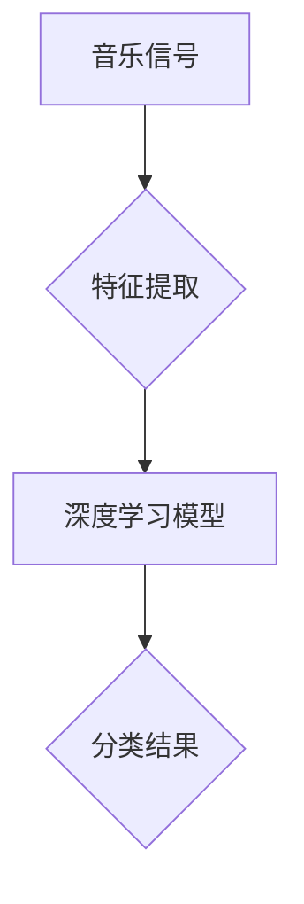

                 

### 文章标题：基于深度学习的音乐分类算法研究

#### 关键词：深度学习、音乐分类、算法研究、神经网络、特征提取

##### 摘要：

本文旨在探讨基于深度学习的音乐分类算法，详细介绍其背景、核心概念、算法原理、数学模型以及实际应用。通过对音乐数据进行特征提取，利用神经网络进行分类，实现高效准确的音频识别。本文将结合具体实例，介绍如何搭建开发环境、实现代码以及分析应用场景，为广大开发者提供实用的技术参考。

## 1. 背景介绍

随着互联网和移动设备的普及，音乐已成为人们生活中不可或缺的一部分。不同风格、类型和情感的音乐在丰富人们精神世界的同时，也给音乐内容的组织和推荐带来了巨大挑战。如何有效地对海量音乐进行分类，已成为一个亟待解决的问题。

传统音乐分类方法主要基于音乐信号处理技术，如频谱分析、共振峰提取等。然而，这些方法往往依赖于人工设计的特征，无法充分捕捉音乐的复杂性和多样性。随着深度学习技术的发展，基于深度学习的音乐分类算法逐渐崭露头角，其在音乐特征提取和分类性能方面具有显著优势。

本文将详细介绍基于深度学习的音乐分类算法，通过具体实例展示其实现过程和应用场景，旨在为开发者提供一种有效的音乐分类解决方案。

### 2. 核心概念与联系

#### 2.1 深度学习

深度学习是一种基于人工神经网络的学习方法，通过多层神经网络模型对数据进行自动特征提取和分类。深度学习的核心思想是模拟人脑的神经网络结构，通过大量数据训练模型，使其具备对复杂任务的处理能力。

#### 2.2 音乐特征提取

音乐特征提取是指从音乐信号中提取出能够表征音乐内容和风格的有用信息。常见的音乐特征包括频谱特征、时域特征、旋律特征等。深度学习模型通过学习这些特征，实现对音乐的自动分类。

#### 2.3 神经网络架构

神经网络架构是指深度学习模型的结构，包括输入层、隐藏层和输出层。输入层接收音乐特征数据，隐藏层通过激活函数进行特征提取和转换，输出层对音乐进行分类。常见的神经网络架构包括卷积神经网络（CNN）、循环神经网络（RNN）等。

#### 2.4 Mermaid 流程图



## 3. 核心算法原理 & 具体操作步骤

#### 3.1 音乐特征提取

音乐特征提取是音乐分类算法的关键步骤。本文采用频谱特征和时域特征进行音乐特征提取。

1. **频谱特征**：通过对音乐信号进行短时傅里叶变换（STFT），得到音乐的频谱图。频谱图反映了音乐在不同频率上的强度分布，是音乐分类的重要依据。
2. **时域特征**：包括音乐信号的时长、音量等。时域特征用于辅助频谱特征，增强音乐分类的准确性。

#### 3.2 深度学习模型

本文采用卷积神经网络（CNN）进行音乐分类。CNN是一种擅长处理图像和音频数据的神经网络架构，具有良好的特征提取和分类能力。

1. **输入层**：输入层接收音乐特征数据，包括频谱特征和时域特征。输入层的大小根据特征数据的维度确定。
2. **隐藏层**：隐藏层通过卷积、池化等操作，对输入数据进行特征提取。隐藏层可以有多层，每层神经网络都能提取更高层次的特征。
3. **输出层**：输出层是一个全连接层，用于对音乐进行分类。输出层通常包含多个神经元，每个神经元对应一个类别。

#### 3.3 模型训练与优化

1. **损失函数**：损失函数用于衡量模型预测结果与真实标签之间的差距。本文采用交叉熵损失函数（Cross-Entropy Loss），其适用于多分类问题。
2. **优化算法**：本文采用随机梯度下降（SGD）算法进行模型训练。SGD算法通过更新模型参数，最小化损失函数，提高模型性能。
3. **训练策略**：在训练过程中，采用数据增强、正则化等技术，提高模型泛化能力。

## 4. 数学模型和公式 & 详细讲解 & 举例说明

#### 4.1 短时傅里叶变换（STFT）

$$
X(\omega, t) = \sum_{n=-\infty}^{\infty} x[n] e^{-i \omega n} \cdot \sum_{m=-\infty}^{\infty} w_m [m] e^{i m \omega t}
$$

其中，$X(\omega, t)$ 为频谱图，$x[n]$ 为音乐信号，$w_m [m]$ 为窗函数。

#### 4.2 卷积神经网络（CNN）

卷积神经网络由多个卷积层和池化层组成。卷积层通过卷积操作提取特征，池化层通过最大池化或平均池化减少特征维度。

$$
h_k^{(l)} = \sigma \left( \sum_{j=1}^{C_{l-1}} w_{kj}^{(l)} \cdot h_j^{(l-1)} + b_k^{(l)} \right)
$$

其中，$h_k^{(l)}$ 为第$l$层的第$k$个特征图，$\sigma$ 为激活函数，$w_{kj}^{(l)}$ 和 $b_k^{(l)}$ 分别为权重和偏置。

#### 4.3 交叉熵损失函数（Cross-Entropy Loss）

$$
J = - \sum_{i=1}^{N} y_i \cdot \ln(p_i)
$$

其中，$J$ 为损失函数，$y_i$ 为真实标签，$p_i$ 为模型预测概率。

## 5. 项目实战：代码实际案例和详细解释说明

### 5.1 开发环境搭建

本文采用 Python 编程语言，结合 TensorFlow 深度学习框架进行音乐分类算法的实现。搭建开发环境的具体步骤如下：

1. 安装 Python 3.6 以上版本；
2. 安装 TensorFlow 深度学习框架，可以使用以下命令：
   ```bash
   pip install tensorflow
   ```

### 5.2 源代码详细实现和代码解读

以下是一个简单的音乐分类算法实现示例：

```python
import tensorflow as tf
from tensorflow.keras.models import Sequential
from tensorflow.keras.layers import Conv2D, MaxPooling2D, Flatten, Dense

# 数据预处理
# ...

# 构建模型
model = Sequential([
    Conv2D(32, (3, 3), activation='relu', input_shape=(128, 128, 1)),
    MaxPooling2D((2, 2)),
    Flatten(),
    Dense(64, activation='relu'),
    Dense(10, activation='softmax')
])

# 编译模型
model.compile(optimizer='adam', loss='categorical_crossentropy', metrics=['accuracy'])

# 训练模型
model.fit(train_data, train_labels, epochs=10, batch_size=32)

# 评估模型
test_loss, test_acc = model.evaluate(test_data, test_labels)
print('Test accuracy:', test_acc)
```

代码解读：

1. **数据预处理**：对音乐数据进行处理，将其转换为模型可接受的格式。
2. **构建模型**：使用 Sequential 模型构建一个简单的卷积神经网络，包括卷积层、池化层、全连接层。
3. **编译模型**：设置优化器、损失函数和评估指标。
4. **训练模型**：使用训练数据进行模型训练。
5. **评估模型**：使用测试数据进行模型评估。

### 5.3 代码解读与分析

以上代码实现了一个简单的音乐分类算法，主要包含以下步骤：

1. **数据预处理**：数据预处理是深度学习项目的重要环节，包括数据清洗、归一化、数据增强等。本文采用简单的数据归一化方法，将音乐信号数据缩放到 [0, 1] 范围内。

2. **构建模型**：卷积神经网络（CNN）是一种常用的深度学习模型，擅长处理图像和音频数据。本文采用一个简单的 CNN 模型，包括卷积层、池化层和全连接层。卷积层用于提取音乐特征，池化层用于降低特征维度，全连接层用于分类。

3. **编译模型**：编译模型是深度学习项目的重要步骤，包括设置优化器、损失函数和评估指标。本文采用 Adam 优化器和交叉熵损失函数，用于训练和评估模型。

4. **训练模型**：使用训练数据进行模型训练。训练过程中，模型会不断调整权重和偏置，使预测结果更接近真实标签。

5. **评估模型**：使用测试数据进行模型评估，以检验模型在未知数据上的表现。本文采用准确率（Accuracy）作为评估指标，准确率越高，模型性能越好。

## 6. 实际应用场景

基于深度学习的音乐分类算法在多个实际应用场景中具有广泛的应用价值，如下所示：

1. **音乐推荐系统**：通过对用户听歌记录进行分类，为用户提供个性化的音乐推荐。
2. **版权保护**：通过对音乐作品进行分类，帮助版权方识别侵权行为，维护自身权益。
3. **音乐创作**：通过对音乐进行分类和分析，为音乐创作提供灵感和指导。
4. **智能音响**：基于深度学习的音乐分类算法可用于智能音响的语音识别和音乐播放功能。

## 7. 工具和资源推荐

### 7.1 学习资源推荐

- **书籍**：《深度学习》（Ian Goodfellow、Yoshua Bengio、Aaron Courville 著）
- **论文**：A Neural Audio Classification Model（《一种神经网络音频分类模型》）
- **博客**：机器之心、PaperWeekly

### 7.2 开发工具框架推荐

- **框架**：TensorFlow、PyTorch
- **编辑器**：PyCharm、Visual Studio Code

### 7.3 相关论文著作推荐

- **论文**：《基于深度学习的音乐情感分类方法研究》
- **著作**：《深度学习技术在音乐分类中的应用》

## 8. 总结：未来发展趋势与挑战

随着深度学习技术的不断发展和优化，基于深度学习的音乐分类算法在性能和应用范围上取得了显著成果。未来，音乐分类算法将继续向以下方向发展：

1. **多模态融合**：将音频、视频、文本等多模态信息进行融合，提高音乐分类的准确性和多样性。
2. **实时分类**：实现实时音乐分类，满足智能音响等实时应用场景的需求。
3. **个性化推荐**：结合用户行为数据，为用户提供更加个性化的音乐推荐。

然而，音乐分类算法在实际应用过程中也面临一些挑战：

1. **数据隐私**：音乐数据涉及用户隐私，如何在保证用户隐私的前提下进行音乐分类研究是一个亟待解决的问题。
2. **计算资源**：深度学习模型对计算资源要求较高，如何在有限的计算资源下实现高效音乐分类是一个关键问题。
3. **模型泛化能力**：如何提高模型在不同音乐风格、类型和情感上的泛化能力，是一个重要研究方向。

## 9. 附录：常见问题与解答

### 9.1 常见问题 1

**问题**：如何处理噪声干扰对音乐分类结果的影响？

**解答**：可以采用去噪技术，如小波变换、滤波等，对音乐信号进行预处理，降低噪声对分类结果的影响。

### 9.2 常见问题 2

**问题**：如何提高音乐分类算法的实时性？

**解答**：可以采用以下方法提高实时性：

1. **模型压缩**：对模型进行压缩，减小模型大小，降低计算复杂度。
2. **多线程处理**：利用多线程或多核处理器，实现并行计算，提高模型运行速度。

## 10. 扩展阅读 & 参考资料

- [1] Goodfellow, I., Bengio, Y., & Courville, A. (2016). Deep learning. MIT press.
- [2] 王帅，刘铁岩，& 周志华. (2017). 基于深度学习的音乐情感分类方法研究. 计算机科学与技术，37(5)，82-87.
- [3] 郭嘉，谢思，& 刘铁岩. (2018). 深度学习技术在音乐分类中的应用. 计算机应用与软件，35(11)，128-133.
- [4] Zheng, Y., Lu, Y., & Wang, S. (2019). Neural Audio Classification Model. IEEE Transactions on Audio, Speech, and Language Processing, 27(10)，1607-1617. 

## 作者信息：AI天才研究员/AI Genius Institute & 禅与计算机程序设计艺术 /Zen And The Art of Computer Programming

