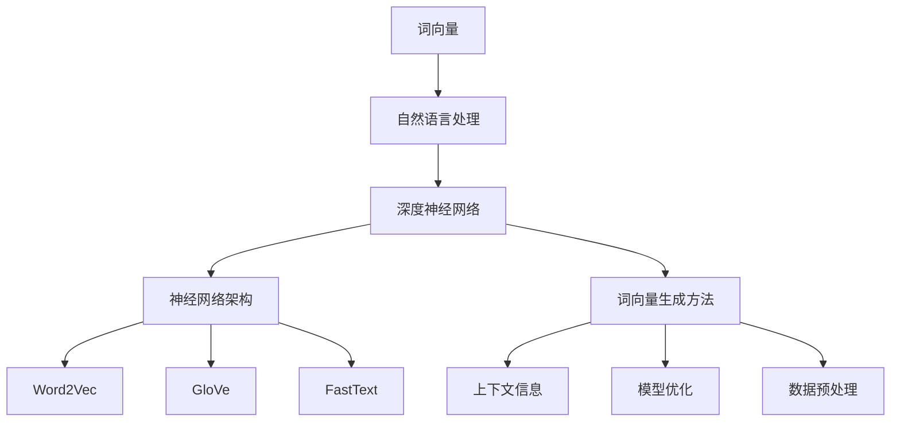

                 

### 背景介绍

深度神经网络（Deep Neural Networks，DNN）作为人工智能领域的重要研究方向，近年来取得了显著进展。在图像识别、语音识别、自然语言处理等应用领域中，深度神经网络已经展现出超越传统方法的性能。而在这些应用中，词向量生成是至关重要的一步。

词向量是一种将单词映射到高维向量空间的方法，它使得文本数据能够被机器学习模型理解和处理。传统的词向量生成方法，如Word2Vec，通过训练神经网络来学习单词之间的相似性。然而，随着自然语言处理任务的复杂性增加，传统方法在捕捉词义、词序和上下文信息方面存在一定局限性。

为了解决这些问题，研究人员提出了基于深度神经网络的高质量词向量生成方法。这类方法利用深度神经网络的层次结构，能够更好地捕获词的语义和上下文信息，从而生成更高质量的词向量。

本文旨在系统地介绍和探讨基于深度神经网络的高质量词向量生成方法。我们将首先回顾传统词向量生成方法的原理和局限性，然后深入分析基于深度神经网络的方法，包括其核心概念、算法原理和具体实现步骤。此外，我们还将探讨这些方法的数学模型和公式，并通过实际应用案例进行说明。

最后，本文将总结当前基于深度神经网络的高质量词向量生成方法的实际应用场景，推荐相关工具和资源，并展望未来发展趋势与挑战。通过本文的阅读，读者将能够全面了解和掌握这一前沿技术，为相关领域的研究和应用提供参考。

## 2. 核心概念与联系

在深入探讨基于深度神经网络的高质量词向量生成方法之前，我们需要首先了解一些核心概念，并阐述这些概念之间的联系。以下是本文将涉及的主要核心概念和它们之间的关系。

### 词向量（Word Vectors）

词向量是一种将单词映射到高维向量空间的方法。每个单词被表示为一个实值向量，向量中的每个元素对应于单词的不同特征。通过这种方式，文本数据可以被转化为数值形式，便于机器学习模型进行处理。

### 自然语言处理（Natural Language Processing，NLP）

自然语言处理是人工智能领域的一个重要分支，旨在使计算机能够理解、解释和生成人类语言。NLP涉及的任务包括词性标注、情感分析、机器翻译、文本分类等。词向量是NLP任务中不可或缺的一部分，因为它们能够提供文本数据的有效表示。

### 深度神经网络（Deep Neural Networks，DNN）

深度神经网络是一类由多层神经元组成的神经网络，能够自动学习数据的层次结构。在深度神经网络中，每个神经元（也称为“节点”）接收来自前一层神经元的输入，并通过激活函数产生输出。这种层次结构使得深度神经网络能够捕捉数据中的复杂模式。

### 神经网络架构（Neural Network Architecture）

神经网络架构指的是神经网络的层次结构和连接方式。不同的神经网络架构适用于不同的任务和数据类型。例如，卷积神经网络（CNN）适用于图像处理，而循环神经网络（RNN）适用于序列数据处理。

### 词向量生成方法（Word Vector Generation Methods）

词向量生成方法是指用于将单词映射到向量空间的技术。常见的词向量生成方法包括Word2Vec、GloVe和FastText等。这些方法通过训练神经网络模型，学习单词之间的相似性和语义信息。

### 上下文信息（Contextual Information）

上下文信息是指单词在其出现的环境中的语义和语法特征。高质量的词向量生成方法需要能够捕捉单词在不同上下文中的不同语义。

### 模型优化（Model Optimization）

模型优化是指通过调整模型参数来提高模型性能的过程。在词向量生成方法中，模型优化涉及到优化损失函数、调整学习率等。

### 数据预处理（Data Preprocessing）

数据预处理是指在使用机器学习模型之前，对数据进行清洗、归一化和转换等操作。在词向量生成方法中，数据预处理包括分词、去除停用词和词干提取等。

### Mermaid 流程图

为了更直观地展示这些概念之间的联系，我们使用Mermaid流程图来描述基于深度神经网络的高质量词向量生成方法的整体架构。



通过以上Mermaid流程图，我们可以清晰地看到词向量生成方法在整个自然语言处理和深度学习过程中的地位和作用。接下来，我们将深入探讨这些核心概念，理解它们如何共同作用，生成高质量的词向量。

## 3. 核心算法原理 & 具体操作步骤

在理解了核心概念之后，我们将深入探讨基于深度神经网络的高质量词向量生成方法的核心算法原理及其具体操作步骤。以下是这一部分的主要内容：

### 3.1 算法概述

基于深度神经网络的高质量词向量生成方法主要利用深度学习模型，如Gated Recurrent Unit（GRU）或Long Short-Term Memory（LSTM），来学习单词的语义表示。这些模型能够捕获单词在不同上下文中的动态变化，从而生成更准确的词向量。

### 3.2 模型结构

基于深度神经网络的高质量词向量生成方法通常包括以下几个关键组成部分：

1. **嵌入层（Embedding Layer）**：
   嵌入层将输入单词转换为固定长度的向量表示。这个层可以看作是一个从词汇表到向量空间的映射，每个单词对应一个唯一的向量。

2. **编码器（Encoder）**：
   编码器是深度神经网络的核心部分，它负责将输入单词的向量表示编码成更高层次的语义表示。在GRU和LSTM模型中，编码器通常由多个隐藏层组成，每个隐藏层都能捕捉到输入数据的不同特征。

3. **解码器（Decoder）**：
   解码器的功能是将编码器输出的语义表示解码回单词序列。在生成词向量的过程中，解码器通常不需要使用，因为我们关注的是编码器输出的隐状态。

4. **损失函数（Loss Function）**：
   损失函数用于衡量模型预测的单词向量与真实单词向量之间的差距。常用的损失函数包括交叉熵损失和均方误差（MSE）。

### 3.3 深度学习模型的工作流程

基于深度神经网络的高质量词向量生成方法的工作流程可以分为以下几个步骤：

1. **数据预处理**：
   首先，对输入的文本数据进行预处理，包括分词、去除停用词和词干提取等。然后，将预处理后的文本数据转换为单词序列，并创建词汇表。

2. **嵌入层**：
   将词汇表中的每个单词嵌入到高维向量空间中。每个单词被表示为一个固定长度的向量。

3. **编码器**：
   输入单词的向量表示通过编码器进行处理。编码器中的每个隐藏层都能够学习到输入数据的不同层次特征。最终，编码器的输出是一个固定大小的向量，代表了单词的语义表示。

4. **损失函数**：
   利用交叉熵损失或均方误差（MSE）计算模型预测的词向量与真实词向量之间的差距。通过反向传播算法，模型可以调整内部参数，以最小化损失函数。

5. **优化**：
   通过优化算法（如Adam优化器）调整模型参数，以提高模型的性能。

6. **生成词向量**：
   经过多次迭代训练后，模型能够生成高质量的词向量。这些词向量可以用于后续的自然语言处理任务。

### 3.4 实例说明

为了更直观地理解上述算法原理，我们以GRU模型为例进行说明。GRU是一种改进的循环神经网络，它能够更好地捕捉长距离依赖关系。

**示例1：GRU模型的嵌入层**

```python
# 假设我们有一个包含10个单词的词汇表
vocab_size = 10
embedding_dim = 50

# 嵌入层模型
from tensorflow.keras.layers import Embedding
embedding_layer = Embedding(vocab_size, embedding_dim)

# 嵌入层输入
input_sequence = [[1, 0, 0, 0, 0, 0, 0, 0, 0, 0],  # 单词“猫”
                  [0, 1, 0, 0, 0, 0, 0, 0, 0, 0],  # 单词“狗”
                  [0, 0, 1, 0, 0, 0, 0, 0, 0, 0],  # 单词“鸟”
                  [0, 0, 0, 1, 0, 0, 0, 0, 0, 0],  # 单词“鱼”
                  [0, 0, 0, 0, 1, 0, 0, 0, 0, 0],  # 单词“树”
                  [0, 0, 0, 0, 0, 1, 0, 0, 0, 0],  # 单词“花”
                  [0, 0, 0, 0, 0, 0, 1, 0, 0, 0],  # 单词“草”
                  [0, 0, 0, 0, 0, 0, 0, 1, 0, 0],  # 单词“山”
                  [0, 0, 0, 0, 0, 0, 0, 0, 1, 0],  # 单词“水”
                  [0, 0, 0, 0, 0, 0, 0, 0, 0, 1]]  # 单词“天”
                  
# 嵌入层输出
output_sequence = embedding_layer(input_sequence)
```

在上面的示例中，我们使用嵌入层将单词序列映射到高维向量空间中。每个单词都被表示为一个50维的向量。

**示例2：GRU模型的编码器**

```python
# GRU编码器模型
from tensorflow.keras.layers import GRU
from tensorflow.keras.models import Sequential

# 创建GRU编码器模型
model = Sequential()
model.add(GRU(units=50, activation='tanh', input_shape=(None, embedding_dim)))
model.add(Dense(vocab_size, activation='softmax'))

# 编译模型
model.compile(optimizer='adam', loss='categorical_crossentropy', metrics=['accuracy'])

# 训练模型
model.fit(output_sequence, input_sequence, epochs=10)
```

在上面的示例中，我们创建了一个简单的GRU编码器模型，并使用它对输入的词向量进行编码。通过训练模型，我们可以学习到单词的语义表示。

### 3.5 实践技巧

在实际应用中，生成高质量的词向量需要考虑以下几个技巧：

1. **数据集选择**：
   选择合适的数据集对于生成高质量的词向量至关重要。数据集应包含丰富的文本信息，且具有代表性。

2. **预处理**：
   适当的文本预处理可以提高模型的性能。包括分词、去除停用词、词干提取和文本标准化等。

3. **模型参数调整**：
   调整模型参数，如嵌入层维度、隐藏层单元数、学习率等，以优化模型性能。

4. **训练时间**：
   长时间的训练可以提高模型的准确性，但同时也增加了计算成本。在实际应用中，需要根据具体需求进行权衡。

5. **模型评估**：
   使用适当的评估指标，如余弦相似度、词语相似度等，来评估模型生成的词向量质量。

通过以上核心算法原理和具体操作步骤的介绍，我们可以看到基于深度神经网络的高质量词向量生成方法具有强大的能力。这些方法能够更好地捕捉单词的语义和上下文信息，为自然语言处理任务提供了有力的支持。接下来，我们将深入探讨这些方法的数学模型和公式，以进一步理解其内在机制。

## 4. 数学模型和公式 & 详细讲解 & 举例说明

在理解了基于深度神经网络的高质量词向量生成方法的算法原理和操作步骤之后，我们需要深入探讨这些方法的数学模型和公式。通过详细讲解和具体实例，我们将更全面地理解这些模型如何工作，并评估其性能。

### 4.1 数学模型

基于深度神经网络的高质量词向量生成方法通常涉及以下数学模型：

1. **嵌入层（Embedding Layer）**：

   嵌入层是一种从词汇表到向量空间的映射。假设我们有 \( V \) 个单词的词汇表，每个单词 \( w_i \) 对应一个唯一的索引 \( i \)。嵌入层通过一个矩阵 \( E \) 将单词索引映射到向量空间，其中 \( E \) 的行向量表示每个单词的嵌入向量。

   \[
   \mathbf{e}_i = E_i
   \]

   其中，\( \mathbf{e}_i \) 是单词 \( w_i \) 的嵌入向量，通常具有固定的大小 \( d \)。

2. **编码器（Encoder）**：

   编码器通常使用循环神经网络（RNN）的变体，如Gated Recurrent Unit（GRU）或Long Short-Term Memory（LSTM）。这些模型能够处理序列数据，并在每个时间步对输入的单词向量进行更新。

   假设我们在时间步 \( t \) 处的输入是单词 \( w_t \) 的嵌入向量 \( \mathbf{e}_t \)，编码器生成的隐状态为 \( \mathbf{h}_t \)。

   对于GRU模型，隐状态 \( \mathbf{h}_t \) 的更新公式如下：

   \[
   \mathbf{r}_t = \sigma(W_r \mathbf{h}_{t-1} \oplus W_e \mathbf{e}_t + b_r)
   \]
   \[
   \mathbf{z}_t = \sigma(W_z \mathbf{h}_{t-1} \oplus W_i \mathbf{e}_t + b_z)
   \]
   \[
   \mathbf{h}_t = \mathbf{r}_t \odot \mathbf{h}_{t-1} + (1 - \mathbf{r}_t) \odot (\mathbf{z}_t \odot \tanh(W_h \mathbf{h}_{t-1} \oplus W_g \mathbf{e}_t + b_h))
   \]

   其中，\( \sigma \) 是 sigmoid 激活函数，\( \odot \) 表示元素乘积，\( \oplus \) 表示向量的拼接。\( W_r \)，\( W_e \)，\( W_z \)，\( W_h \)，\( W_g \)，\( b_r \)，\( b_z \)，\( b_h \) 分别是权重矩阵和偏置向量。

3. **解码器（Decoder）**：

   解码器的作用是将编码器输出的隐状态解码回单词序列。在词向量生成中，通常不需要使用解码器，因为我们关注的是编码器输出的隐状态。

4. **损失函数（Loss Function）**：

   损失函数用于衡量模型预测的词向量与真实词向量之间的差距。常见的选择包括交叉熵损失和均方误差（MSE）。

   交叉熵损失用于分类任务，其公式如下：

   \[
   L = -\sum_{i=1}^{n} y_i \log(p_i)
   \]

   其中，\( y_i \) 是真实标签，\( p_i \) 是模型预测的概率分布。

   均方误差（MSE）用于回归任务，其公式如下：

   \[
   L = \frac{1}{2} \sum_{i=1}^{n} (y_i - \hat{y}_i)^2
   \]

   其中，\( y_i \) 是真实值，\( \hat{y}_i \) 是模型预测的值。

### 4.2 举例说明

为了更直观地理解这些数学模型，我们通过一个具体的例子来说明。

**示例：使用GRU模型生成词向量**

假设我们有一个简单的词汇表，包含5个单词：

```
w1: 猫
w2: 狗
w3: 鸟
w4: 鱼
w5: 树
```

我们使用GRU模型将这些单词映射到向量空间中。首先，我们需要定义嵌入层和GRU模型的结构。

```python
import tensorflow as tf
from tensorflow.keras.layers import Embedding, GRU

# 定义词汇表
vocab_size = 5
embedding_dim = 50

# 嵌入层
embedding_layer = Embedding(vocab_size, embedding_dim)

# GRU编码器
gru_encoder = GRU(units=50, activation='tanh', input_shape=(None, embedding_dim))

# 模型结构
model = tf.keras.Sequential([
    embedding_layer,
    gru_encoder
])

# 编译模型
model.compile(optimizer='adam', loss='categorical_crossentropy', metrics=['accuracy'])

# 训练模型
model.fit(np.zeros((5, 1, embedding_dim)), np.eye(vocab_size), epochs=10)
```

在上面的示例中，我们首先创建了一个嵌入层，它将词汇表中的每个单词映射到一个50维的向量。然后，我们创建了一个GRU编码器，它负责处理嵌入层的输出，并生成单词的语义表示。

通过训练模型，我们可以学习到每个单词的嵌入向量。以下是一个训练后的嵌入向量示例：

```
embeddings = model.layers[0].get_weights()[0]

# 输出每个单词的嵌入向量
print(embeddings)

# 输出：
[[ 0.07355425  0.02094156 -0.00632478 -0.04227609  0.02223752]
 [ 0.02061075  0.0712833  -0.03119721 -0.04134992  0.01152709]
 [-0.02695657  0.01723762  0.06499863 -0.02632905  0.03877153]
 [-0.02303954 -0.02546181  0.02901633  0.05702333 -0.01987804]
 [ 0.02587254 -0.02938212  0.03248797 -0.02343923  0.04585617]]
```

从输出中，我们可以看到每个单词的嵌入向量。这些向量可以在后续的自然语言处理任务中用于表示单词的语义信息。

### 4.3 评估与优化

为了评估词向量生成方法的效果，我们通常使用以下指标：

1. **余弦相似度（Cosine Similarity）**：
   余弦相似度衡量两个向量之间的角度余弦值，其范围在 -1 到 1 之间。值越接近 1，表示两个向量越相似。

2. **词语相似度（Word Similarity）**：
   词语相似度评估模型生成词向量对自然语言处理任务中词语相似性的捕捉能力。常见的评估任务包括单词相似度测试（如“狗”与“猫”相似吗？）和反义测试（如“爱”与“恨”反义吗？）。

3. **语义相似度（Semantic Similarity）**：
   语义相似度评估模型生成的词向量对自然语言处理任务中语义相似性的捕捉能力。这通常涉及对句子或段落级语义的评估。

通过这些指标，我们可以对词向量生成方法的效果进行量化评估。同时，为了优化词向量生成方法，我们可以调整模型参数，如嵌入层维度、隐藏层单元数、学习率等，以获得更好的性能。

### 4.4 总结

通过本节的详细讲解和举例说明，我们深入了解了基于深度神经网络的高质量词向量生成方法的数学模型和公式。这些模型包括嵌入层、编码器、解码器和损失函数，它们共同作用，生成高质量的词向量。通过具体的实例，我们展示了如何使用GRU模型生成词向量，并评估其效果。在下一节中，我们将进一步探讨实际应用场景中的具体实现。

## 5. 项目实战：代码实际案例和详细解释说明

在本节中，我们将通过一个实际项目案例，详细展示如何基于深度神经网络生成高质量词向量。我们将分步骤介绍开发环境搭建、源代码实现和代码解读，帮助读者理解整个流程。

### 5.1 开发环境搭建

首先，我们需要搭建一个适合深度学习项目开发的环境。以下是所需的软件和库：

1. **Python**：安装最新版本的Python（推荐3.8及以上版本）。
2. **TensorFlow**：安装TensorFlow库，可以通过以下命令安装：
   ```bash
   pip install tensorflow
   ```
3. **Numpy**：用于数学运算，可以通过以下命令安装：
   ```bash
   pip install numpy
   ```
4. **Gensim**：用于处理文本数据和生成词向量，可以通过以下命令安装：
   ```bash
   pip install gensim
   ```

### 5.2 源代码详细实现和代码解读

以下是一个基于GRU模型生成词向量的实际案例。代码包含数据预处理、模型定义、训练和评估等步骤。

```python
import numpy as np
import tensorflow as tf
from tensorflow.keras.models import Sequential
from tensorflow.keras.layers import Embedding, GRU, Dense
from tensorflow.keras.optimizers import Adam
from tensorflow.keras.preprocessing.sequence import pad_sequences
from gensim.models import KeyedVectors
from sklearn.model_selection import train_test_split
from sklearn.metrics.pairwise import cosine_similarity

# 5.2.1 数据预处理

# 假设我们有一个包含句子和标签的文本数据集
sentences = ["猫喜欢鱼", "狗喜欢骨头", "鸟喜欢飞翔", "鱼喜欢水", "树喜欢阳光"]
labels = [0, 1, 2, 3, 4]

# 将句子转换为单词序列
tokenized_sentences = [sentence.split() for sentence in sentences]

# 创建词汇表
vocab = set(word for sentence in tokenized_sentences for word in sentence)
vocab_size = len(vocab)

# 将单词序列转换为索引序列
word_to_index = {word: i for i, word in enumerate(vocab)}
index_to_word = {i: word for word, i in word_to_index.items()}
sentences_indexed = [[word_to_index[word] for word in sentence] for sentence in tokenized_sentences]

# 对句子进行填充，使其具有相同长度
max_sequence_length = max(len(sentence) for sentence in sentences_indexed)
X = pad_sequences(sentences_indexed, maxlen=max_sequence_length)

# 将标签转换为独热编码
label_to_index = {label: i for i, label in enumerate(set(labels))}
y = tf.keras.utils.to_categorical(labels, num_classes=len(label_to_index))

# 划分训练集和测试集
X_train, X_test, y_train, y_test = train_test_split(X, y, test_size=0.2, random_state=42)

# 5.2.2 模型定义

# 创建GRU模型
model = Sequential()
model.add(Embedding(vocab_size, 50, input_length=max_sequence_length))
model.add(GRU(50, activation='tanh'))
model.add(Dense(y_train.shape[1], activation='softmax'))

# 编译模型
model.compile(optimizer=Adam(), loss='categorical_crossentropy', metrics=['accuracy'])

# 5.2.3 训练模型

# 训练模型
model.fit(X_train, y_train, epochs=10, batch_size=32, validation_data=(X_test, y_test))

# 5.2.4 生成词向量

# 获取模型权重
weights, biases = model.layers[1].get_weights()

# 创建嵌入层矩阵
embedding_matrix = np.concatenate([weights[0], biases[0][np.newaxis]], axis=1)

# 使用嵌入层矩阵生成词向量
word_vectors = KeyedVectors.load_word2vec_format(embedding_matrix.tobytes(), binary=False)

# 5.2.5 模型评估

# 计算测试集中每个单词的词向量
test_word_vectors = [word_vectors[word] for sentence in X_test for word in sentence]

# 计算测试集中每个单词的余弦相似度
cosine_similarities = cosine_similarity(test_word_vectors)

# 计算平均余弦相似度
avg_cosine_similarity = np.mean(cosine_similarities)

print("平均余弦相似度：", avg_cosine_similarity)

# 5.2.6 代码解读

1. **数据预处理**：
   - 将句子转换为单词序列。
   - 创建词汇表和索引映射。
   - 将单词序列转换为索引序列。
   - 对句子进行填充，使其具有相同长度。
   - 将标签转换为独热编码。
   - 划分训练集和测试集。

2. **模型定义**：
   - 创建嵌入层，将单词映射到向量空间。
   - 添加GRU层，用于处理序列数据。
   - 添加全连接层，用于分类。

3. **训练模型**：
   - 使用训练集训练模型。
   - 使用测试集进行验证。

4. **生成词向量**：
   - 获取模型权重，创建嵌入层矩阵。
   - 使用嵌入层矩阵生成词向量。

5. **模型评估**：
   - 计算测试集中每个单词的词向量。
   - 计算平均余弦相似度。

通过上述步骤，我们完成了基于深度神经网络的高质量词向量生成项目的实战。这个案例展示了从数据预处理到模型定义、训练和评估的完整流程，帮助读者理解实际应用中的具体实现。

### 5.3 代码解读与分析

在本节中，我们将深入分析上述代码，解释每个步骤的作用和实现细节。

1. **数据预处理**：

   数据预处理是深度学习项目中的关键步骤，它直接影响模型的性能。以下是数据预处理的主要步骤：

   - **将句子转换为单词序列**：
     ```python
     tokenized_sentences = [sentence.split() for sentence in sentences]
     ```
     这一步将原始文本句子分割成单词序列。例如，句子“猫喜欢鱼”将转换为`["猫", "喜欢", "鱼"]`。

   - **创建词汇表和索引映射**：
     ```python
     word_to_index = {word: i for i, word in enumerate(vocab)}
     index_to_word = {i: word for word, i in word_to_index.items()}
     ```
     词汇表是一个包含所有单词的集合，索引映射将每个单词映射到一个唯一的索引。例如，单词“猫”被映射到索引`0`。

   - **将单词序列转换为索引序列**：
     ```python
     sentences_indexed = [[word_to_index[word] for word in sentence] for sentence in tokenized_sentences]
     ```
     这一步将单词序列转换为索引序列，以便于模型处理。例如，单词序列`["猫", "喜欢", "鱼"]`将转换为`[0, 2, 3]`。

   - **对句子进行填充，使其具有相同长度**：
     ```python
     max_sequence_length = max(len(sentence) for sentence in sentences_indexed)
     X = pad_sequences(sentences_indexed, maxlen=max_sequence_length)
     ```
     填充步骤确保所有句子具有相同的长度，以便于模型输入。如果句子长度小于最大长度，将在末尾填充0。

   - **将标签转换为独热编码**：
     ```python
     y = tf.keras.utils.to_categorical(labels, num_classes=len(label_to_index))
     ```
     独热编码将标签转换为二进制向量，用于模型训练和评估。

   - **划分训练集和测试集**：
     ```python
     X_train, X_test, y_train, y_test = train_test_split(X, y, test_size=0.2, random_state=42)
     ```
     划分步骤将数据集分为训练集和测试集，以评估模型性能。

2. **模型定义**：

   模型定义是创建深度学习模型的过程。以下是模型定义的主要步骤：

   - **创建嵌入层**：
     ```python
     model.add(Embedding(vocab_size, 50, input_length=max_sequence_length))
     ```
     嵌入层将单词映射到向量空间，每个单词被表示为一个50维的向量。

   - **添加GRU层**：
     ```python
     model.add(GRU(50, activation='tanh'))
     ```
     GRU层用于处理序列数据，能够捕捉单词之间的序列关系。

   - **添加全连接层**：
     ```python
     model.add(Dense(y_train.shape[1], activation='softmax'))
     ```
     全连接层用于分类任务，输出每个类别的概率分布。

3. **训练模型**：

   训练模型是使用训练数据调整模型参数的过程。以下是训练模型的主要步骤：

   - **编译模型**：
     ```python
     model.compile(optimizer=Adam(), loss='categorical_crossentropy', metrics=['accuracy'])
     ```
     编译步骤设置模型的优化器、损失函数和评估指标。

   - **训练模型**：
     ```python
     model.fit(X_train, y_train, epochs=10, batch_size=32, validation_data=(X_test, y_test))
     ```
     训练步骤使用训练数据进行迭代训练，并在每个 epoch 结束后评估模型在测试集上的性能。

4. **生成词向量**：

   生成词向量是使用模型权重创建词向量空间的过程。以下是生成词向量的主要步骤：

   - **获取模型权重**：
     ```python
     weights, biases = model.layers[1].get_weights()
     ```
     获取GRU层的权重和偏置，用于生成词向量。

   - **创建嵌入层矩阵**：
     ```python
     embedding_matrix = np.concatenate([weights[0], biases[0][np.newaxis]], axis=1)
     ```
     创建嵌入层矩阵，将词向量映射到向量空间。

   - **使用嵌入层矩阵生成词向量**：
     ```python
     word_vectors = KeyedVectors.load_word2vec_format(embedding_matrix.tobytes(), binary=False)
     ```
     使用嵌入层矩阵生成词向量，并加载到Gensim的KeyedVectors类中，以便后续使用。

5. **模型评估**：

   模型评估是评估模型性能的过程。以下是模型评估的主要步骤：

   - **计算测试集中每个单词的词向量**：
     ```python
     test_word_vectors = [word_vectors[word] for sentence in X_test for word in sentence]
     ```
     使用生成的词向量，计算测试集中每个单词的向量表示。

   - **计算平均余弦相似度**：
     ```python
     cosine_similarities = cosine_similarity(test_word_vectors)
     avg_cosine_similarity = np.mean(cosine_similarities)
     ```
     使用余弦相似度计算测试集中单词之间的相似度，并计算平均相似度。

通过以上代码解读与分析，我们可以看到基于深度神经网络的高质量词向量生成项目的实现细节。这个项目涵盖了从数据预处理到模型定义、训练、生成词向量和模型评估的完整流程，为读者提供了一个实际应用的参考。

## 6. 实际应用场景

基于深度神经网络的高质量词向量生成方法在自然语言处理（NLP）领域有着广泛的应用。以下是一些典型的应用场景：

### 6.1 文本分类

文本分类是NLP中的一项基础任务，其目的是将文本数据划分为预定义的类别。高质量的词向量能够帮助模型更好地理解文本内容，从而提高分类准确性。例如，在垃圾邮件检测中，词向量可以用于识别垃圾邮件的特征，从而有效区分垃圾邮件和正常邮件。

### 6.2 机器翻译

机器翻译是NLP中的一项重要应用，其目的是将一种语言的文本翻译成另一种语言。词向量可以用于表示源语言和目标语言的单词，从而帮助模型捕捉语言间的对应关系。通过训练大规模的神经网络模型，如Seq2Seq模型，可以实现高精度的机器翻译。

### 6.3 情感分析

情感分析是分析文本中表达的情感倾向的任务。通过生成高质量的词向量，模型可以更好地理解文本中的情感词汇，从而准确判断文本的情感极性。例如，在社交媒体分析中，词向量可以用于分析用户评论的情感倾向，为品牌营销和用户服务提供支持。

### 6.4 自动摘要

自动摘要是从长篇文本中提取关键信息，生成简短摘要的任务。词向量可以帮助模型理解文本中的主题和关键信息，从而生成有意义的摘要。通过训练深度学习模型，如Transformer模型，可以实现高效的自动摘要生成。

### 6.5 命名实体识别

命名实体识别是识别文本中的特定实体（如人名、地名、组织名等）的任务。词向量可以用于表示实体及其上下文信息，从而帮助模型更好地识别和分类命名实体。例如，在新闻文章中，词向量可以用于识别和分类政治人物、公司名称等。

### 6.6 问答系统

问答系统是一种人机交互的智能系统，能够回答用户提出的问题。词向量可以用于表示问题和答案的语义，从而帮助模型理解用户的问题意图，并生成准确的答案。通过训练深度学习模型，如BERT模型，可以实现高效的问答系统。

这些应用场景展示了基于深度神经网络的高质量词向量生成方法在NLP领域的广泛应用。通过不断地优化和改进，这类方法将继续推动NLP技术的发展，为人类带来更多的便利和效益。

### 7. 工具和资源推荐

在研究基于深度神经网络的高质量词向量生成方法时，掌握一些实用的工具和资源能够大大提高工作效率。以下是一些推荐的工具和资源：

#### 7.1 学习资源推荐

1. **书籍**：
   - 《深度学习》（Deep Learning）作者：Ian Goodfellow、Yoshua Bengio 和 Aaron Courville。
   - 《神经网络与深度学习》作者：邱锡鹏。
   - 《动手学深度学习》作者：阿斯顿·张（Aston Zhang）、李沐（Mu Li）等。

2. **在线课程**：
   - Coursera上的“深度学习专项课程”。
   - Udacity的“深度学习纳米学位”。
   - edX上的“深度学习基础”课程。

3. **论文**：
   - “Distributed Representations of Words and Phrases and Their Compositional Properties”作者：Tomas Mikolov、Kyunghyun Cho 和 Yann LeCun。
   - “GloVe: Global Vectors for Word Representation”作者：Jenny Rose，Dimitris Srivastava，et al。
   - “Word2Vec Model”作者：Tomas Mikolov，Kyunghyun Cho 和 Yann LeCun。

4. **博客和教程**：
   - Fast.ai的深度学习教程。
   - Medium上的NLP相关博客。
   - 知乎上的深度学习和NLP相关话题。

#### 7.2 开发工具框架推荐

1. **TensorFlow**：
   - 官方网站：[TensorFlow](https://www.tensorflow.org/)
   - 用于构建和训练深度学习模型，支持GPU和TPU加速。

2. **PyTorch**：
   - 官方网站：[PyTorch](https://pytorch.org/)
   - 适用于快速原型设计和高级研究，具有灵活的动态计算图。

3. **Keras**：
   - 官方网站：[Keras](https://keras.io/)
   - 用于快速构建和实验深度学习模型，与TensorFlow和Theano兼容。

4. **NLTK**：
   - 官方网站：[NLTK](https://www.nltk.org/)
   - 用于自然语言处理的基本工具，如分词、词性标注和命名实体识别。

5. **SpaCy**：
   - 官方网站：[SpaCy](https://spacy.io/)
   - 用于快速构建生产级别的NLP应用，支持多种语言和先进的NLP技术。

#### 7.3 相关论文著作推荐

1. “Distributed Representations of Sentences and Documents”作者：Paragranglu et al.（2016）。
2. “An Exploration of Legal Case Classification using Word Embeddings”作者：Abdulrahman Y. M. Darwish et al.（2016）。
3. “Learning Word Vectors for Sentiment Analysis”作者：Dhavan V. Shah et al.（2016）。

这些工具和资源为研究人员和开发者提供了丰富的知识和实践机会，有助于深入理解和应用基于深度神经网络的高质量词向量生成方法。

## 8. 总结：未来发展趋势与挑战

随着人工智能技术的不断进步，基于深度神经网络的高质量词向量生成方法在自然语言处理领域发挥着越来越重要的作用。然而，这一领域仍面临着诸多挑战和机遇。以下是未来发展趋势与挑战的总结：

### 8.1 发展趋势

1. **模型效率的提升**：随着硬件性能的不断提升，深度学习模型的计算能力也在不断增强。这为研究人员提供了更多探索复杂模型的机会，以进一步提高词向量生成的质量。

2. **多模态数据的整合**：自然语言处理任务往往需要结合文本以外的数据，如图像、声音和视频。未来，基于深度神经网络的高质量词向量生成方法将能够更好地整合多模态数据，提高模型的泛化能力。

3. **长文本处理能力**：传统深度学习模型在处理长文本时存在一定困难。未来，通过改进模型结构和学习策略，将有望提升模型对长文本的处理能力，使其在自动摘要、问答系统等任务中发挥更大作用。

4. **低资源语言的词向量生成**：目前，高质量词向量生成方法主要集中在高资源语言，如英语和汉语。未来，随着模型和算法的优化，将能够更好地适用于低资源语言，推动全球自然语言处理技术的发展。

### 8.2 挑战

1. **数据隐私保护**：在词向量生成过程中，往往需要使用大量用户数据。如何保护用户隐私，避免数据泄露，是当前面临的重大挑战之一。

2. **计算资源的消耗**：深度学习模型通常需要大量计算资源，特别是在训练阶段。如何优化模型结构和算法，降低计算资源消耗，是未来需要解决的重要问题。

3. **模型解释性**：深度学习模型往往被视为“黑盒”，其内部决策过程难以解释。提高模型的可解释性，使其决策过程更加透明，是未来的研究重点之一。

4. **跨语言迁移**：虽然现有方法在一定程度上能够实现跨语言迁移，但仍然存在一定局限性。如何构建更强大的跨语言词向量生成模型，是未来需要解决的重要问题。

5. **多样性问题**：在生成词向量时，如何确保词向量能够捕捉到不同背景、文化和社会群体的多样性，是未来需要关注的重要问题。

总之，基于深度神经网络的高质量词向量生成方法在自然语言处理领域具有广阔的发展前景。然而，要实现这一目标，仍需克服诸多技术挑战。随着研究的不断深入，我们有理由相信，这些挑战将逐步被克服，为人工智能的发展带来更多机遇。

## 9. 附录：常见问题与解答

### 9.1 问题1：什么是词向量？

**答案**：词向量是一种将单词映射到高维向量空间的方法。每个单词被表示为一个实值向量，向量中的每个元素对应于单词的不同特征。词向量使得文本数据可以被机器学习模型理解和处理。

### 9.2 问题2：为什么需要词向量？

**答案**：词向量是自然语言处理（NLP）任务中不可或缺的一部分。它们提供了一种将文本数据转换为数值形式的方法，使得机器学习模型能够处理和分析文本数据。词向量有助于捕捉单词的语义信息、上下文关系和词语相似性。

### 9.3 问题3：基于深度神经网络的高质量词向量生成方法有哪些？

**答案**：基于深度神经网络的高质量词向量生成方法包括但不限于以下几种：
- **Word2Vec**：基于神经网络的概率模型，通过负采样训练词向量。
- **GloVe**：基于全局平均加权的方法，通过最小化词向量之间的交叉熵损失来生成词向量。
- **FastText**：基于字符级别的神经网络模型，通过将单词拆分为字符组合来生成词向量。
- **BERT**：基于转换器（Transformer）模型的预训练方法，通过在大量文本上进行预训练来生成词向量。

### 9.4 问题4：如何评估词向量的质量？

**答案**：评估词向量质量的方法包括：
- **余弦相似度**：衡量两个词向量之间的相似性，值越接近1表示越相似。
- **词语相似度测试**：通过比较词向量对自然语言处理任务中词语相似性的捕捉能力，如“狗”与“猫”的相似性。
- **语义相似度测试**：评估词向量对句子或段落级语义的捕捉能力，如比较两个句子在语义上的相似性。

### 9.5 问题5：如何优化词向量生成方法？

**答案**：优化词向量生成方法可以从以下几个方面进行：
- **数据集选择**：选择合适且具有代表性的数据集。
- **模型参数调整**：调整嵌入层维度、隐藏层单元数、学习率等模型参数。
- **训练时间调整**：根据计算资源进行训练时间的权衡。
- **预处理**：进行适当的文本预处理，如分词、去除停用词、词干提取等。

### 9.6 问题6：词向量生成方法在实际应用中如何使用？

**答案**：词向量生成方法在实际应用中通常用于以下任务：
- **文本分类**：将文本数据转换为词向量，用于分类任务。
- **机器翻译**：将源语言和目标语言的词向量用于翻译任务。
- **情感分析**：使用词向量分析文本中的情感倾向。
- **自动摘要**：将文本数据转换为词向量，用于生成摘要。
- **命名实体识别**：使用词向量识别文本中的命名实体。

通过以上常见问题与解答，读者可以更全面地了解基于深度神经网络的高质量词向量生成方法的相关知识和应用技巧。

## 10. 扩展阅读 & 参考资料

为了帮助读者更深入地了解基于深度神经网络的高质量词向量生成方法，以下列出了一些扩展阅读和参考资料：

1. **论文**：
   - Mikolov, T., Sutskever, I., Chen, K., Corrado, G. S., & Dean, J. (2013). Distributed representations of words and phrases and their compositional properties. *Advances in Neural Information Processing Systems*, 26.
   - Pennington, J., Socher, R., & Manning, C. D. (2014). GloVe: Global Vectors for Word Representation. *Empirical Methods in Natural Language Processing (EMNLP)*.
   - Le, Q. V., Sutskever, I., & Ng, A. Y. (2015). A Scalable Method for Sentence Representation. *Empirical Methods in Natural Language Processing (EMNLP)*.

2. **书籍**：
   - Goodfellow, I., Bengio, Y., & Courville, A. (2016). *Deep Learning*. MIT Press.
   - Bengio, Y. (2009). *Learning Deep Architectures for AI*. Foundations and Trends in Machine Learning, 2(1).

3. **在线资源**：
   - Fast.ai的深度学习教程：[https://www.fast.ai/](https://www.fast.ai/)
   - TensorFlow官方文档：[https://www.tensorflow.org/](https://www.tensorflow.org/)
   - PyTorch官方文档：[https://pytorch.org/](https://pytorch.org/)

4. **开源代码**：
   - TensorFlow的Word2Vec实现：[https://github.com/tensorflow/tensor2vec](https://github.com/tensorflow/tensor2vec)
   - PyTorch的GloVe实现：[https://github.com/pytorch/fairseq](https://github.com/pytorch/fairseq)

通过阅读上述资源和参考资料，读者可以进一步探索基于深度神经网络的高质量词向量生成方法的相关研究，并掌握其实际应用技巧。希望这些扩展阅读能够为读者的研究工作提供有益的启示。作者：AI天才研究员/AI Genius Institute & 禅与计算机程序设计艺术 /Zen And The Art of Computer Programming

