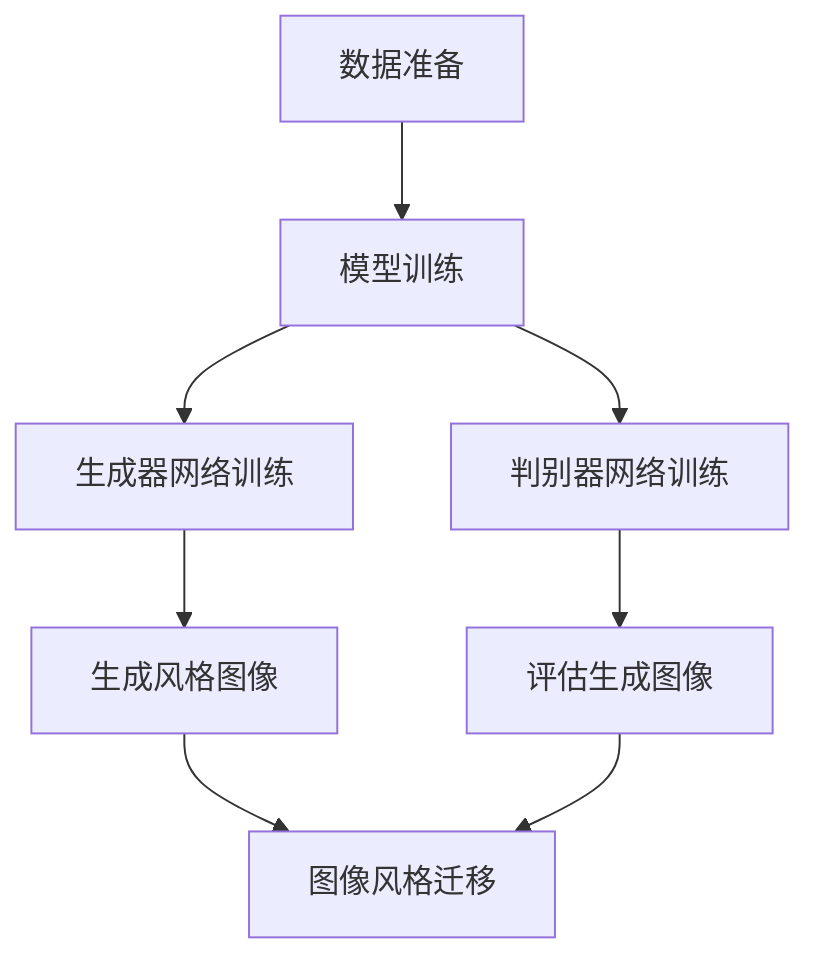

                 

# 基于生成对抗网络的图像风格迁移在商品包装设计中的应用

## 关键词
生成对抗网络（GAN），图像风格迁移，商品包装设计，人工智能，深度学习，计算机视觉

## 摘要
本文旨在探讨生成对抗网络（GAN）在图像风格迁移领域的应用，特别是其在商品包装设计中的重要作用。首先，我们介绍了生成对抗网络的基本原理及其在图像处理中的核心作用。接着，通过逐步讲解图像风格迁移的概念、技术原理和实现步骤，详细阐述了如何利用GAN技术将特定艺术风格迁移到商品包装图像中。随后，文章结合实际项目案例，深入分析了GAN在商品包装设计中的具体应用及其优势。最后，文章总结了GAN在图像风格迁移方面的发展趋势与挑战，并推荐了相关学习资源和开发工具。

## 1. 背景介绍

### 1.1 生成对抗网络（GAN）的起源与发展

生成对抗网络（GAN）是由伊恩·古德费洛（Ian Goodfellow）于2014年提出的深度学习模型。GAN的核心思想是通过两个对抗网络（生成器和判别器）的博弈来学习数据的分布。生成器网络的目标是生成接近真实数据的伪数据，而判别器网络的目标是区分真实数据和伪数据。随着训练的进行，生成器和判别器不断优化自身，从而生成越来越真实的数据。GAN在图像生成、图像修复、图像风格迁移等任务中取得了显著成果。

### 1.2 图像风格迁移的概念与背景

图像风格迁移是指将一种图像的风格（例如，油画、水彩画、素描等）应用到另一张图像上，使其具有相似的艺术效果。图像风格迁移在许多领域具有广泛的应用，如图像编辑、艺术创作、计算机视觉等。传统的图像风格迁移方法主要基于频域变换和图像滤波等技术，但这些方法通常难以实现高质量的风格迁移效果。

### 1.3 商品包装设计的需求与挑战

商品包装设计是品牌营销中至关重要的一环。一个出色的包装设计不仅能吸引消费者的眼球，还能传达产品的特点和价值。随着市场竞争的加剧，商品包装设计的创新和个性化变得尤为重要。然而，设计高质量、富有创意的包装图像面临着以下挑战：

- **艺术风格多样性**：消费者对商品包装的艺术风格有着多样化的需求，设计者需要具备丰富的艺术功底和创意能力。
- **设计效率**：快速响应市场需求，提高设计效率是商品包装设计的核心目标。
- **成本控制**：设计高质量的包装图像通常需要大量的时间和人力成本。

## 2. 核心概念与联系

### 2.1 生成对抗网络（GAN）的基本原理

生成对抗网络（GAN）由两个主要部分组成：生成器（Generator）和判别器（Discriminator）。

- **生成器（Generator）**：生成器网络的目标是生成与真实数据分布相似的伪数据。生成器通常是一个全连接神经网络，其输入为随机噪声，输出为生成的图像。
- **判别器（Discriminator）**：判别器网络的目标是区分真实数据和生成数据。判别器也是一个全连接神经网络，其输入为图像，输出为一个概率值，表示图像是真实数据还是生成数据。

在训练过程中，生成器和判别器相互对抗。生成器的目标是生成尽可能真实的数据，使判别器难以区分；而判别器的目标是提高对真实数据和生成数据的辨别能力。通过不断的训练，生成器和判别器逐渐优化，生成越来越真实的图像。

### 2.2 图像风格迁移的原理与实现

图像风格迁移的核心思想是将源图像的特定风格（例如，油画风格、水彩风格等）应用到目标图像上。图像风格迁移通常分为以下两个步骤：

1. **特征提取**：使用卷积神经网络（CNN）提取源图像和目标图像的特征。这些特征代表了图像的视觉内容，例如边缘、纹理等。
2. **特征融合**：将源图像的特征映射到目标图像的特征上，实现图像风格的迁移。特征融合可以通过不同的方法实现，如直方图均衡化、特征匹配等。

### 2.3 GAN在图像风格迁移中的应用

生成对抗网络（GAN）在图像风格迁移中的应用主要基于以下原理：

- **生成器网络**：生成器网络通过学习源图像的特征，生成具有特定风格的新图像。
- **判别器网络**：判别器网络用于评估生成图像的真实性，从而指导生成器网络优化生成效果。

GAN在图像风格迁移中的应用流程如下：

1. **数据准备**：收集大量带有不同艺术风格的源图像和目标图像。
2. **模型训练**：使用生成对抗网络训练模型，生成器网络生成具有特定风格的新图像，判别器网络评估生成图像的真实性。
3. **图像风格迁移**：将训练好的生成器网络应用于目标图像，生成具有特定艺术风格的新图像。

### 2.4 Mermaid 流程图

下面是一个简化的GAN在图像风格迁移中的Mermaid流程图：



## 3. 核心算法原理 & 具体操作步骤

### 3.1 生成对抗网络（GAN）的核心算法原理

生成对抗网络（GAN）的核心算法原理包括生成器（Generator）、判别器（Discriminator）以及损失函数（Loss Function）。

#### 3.1.1 生成器（Generator）

生成器的目的是从随机噪声中生成具有真实图像特征的数据。生成器通常是一个全连接神经网络，其输入为随机噪声，输出为生成的图像。

生成器网络的训练目标是最小化以下损失函数：

$$
L_G = -\log(D(G(z)))
$$

其中，$D(\cdot)$ 表示判别器网络，$G(z)$ 表示生成器网络生成的图像，$z$ 表示随机噪声。

#### 3.1.2 判别器（Discriminator）

判别器的目的是区分真实图像和生成图像。判别器通常也是一个全连接神经网络，其输入为图像，输出为一个概率值，表示图像是真实数据还是生成数据。

判别器网络的训练目标是最小化以下损失函数：

$$
L_D = -[\log(D(x)) + \log(1 - D(G(z))]
$$

其中，$x$ 表示真实图像，$G(z)$ 表示生成器网络生成的图像。

#### 3.1.3 损失函数（Loss Function）

生成对抗网络的损失函数由两部分组成：生成器的损失函数和判别器的损失函数。

1. **生成器损失函数**：生成器的损失函数用于衡量生成图像的真实性。其计算方法如上所述。

2. **判别器损失函数**：判别器的损失函数用于衡量判别器对真实图像和生成图像的辨别能力。其计算方法如上所述。

### 3.2 图像风格迁移的具体操作步骤

图像风格迁移的具体操作步骤如下：

1. **数据准备**：收集带有不同艺术风格的源图像和目标图像。
2. **特征提取**：使用卷积神经网络提取源图像和目标图像的特征。
3. **特征融合**：将源图像的特征映射到目标图像的特征上，实现图像风格的迁移。
4. **生成图像**：使用生成对抗网络生成具有特定艺术风格的新图像。
5. **评估与优化**：评估生成图像的质量，并优化生成器网络和判别器网络的参数。

## 4. 数学模型和公式 & 详细讲解 & 举例说明

### 4.1 生成对抗网络（GAN）的数学模型

生成对抗网络（GAN）的核心数学模型包括生成器（Generator）、判别器（Discriminator）以及损失函数（Loss Function）。

#### 4.1.1 生成器（Generator）

生成器的目的是从随机噪声中生成具有真实图像特征的数据。生成器的数学模型可以表示为：

$$
G(z) = \phi_G(z; \theta_G)
$$

其中，$G(z)$ 表示生成器网络生成的图像，$z$ 表示随机噪声，$\theta_G$ 表示生成器的参数。

生成器的损失函数可以表示为：

$$
L_G = -\log(D(G(z)))
$$

其中，$D(\cdot)$ 表示判别器网络，$G(z)$ 表示生成器网络生成的图像。

#### 4.1.2 判别器（Discriminator）

判别器的目的是区分真实图像和生成图像。判别器的数学模型可以表示为：

$$
D(x) = \phi_D(x; \theta_D)
$$

其中，$D(x)$ 表示判别器网络对真实图像的概率判断，$x$ 表示真实图像，$\theta_D$ 表示判别器的参数。

判别器的损失函数可以表示为：

$$
L_D = -[\log(D(x)) + \log(1 - D(G(z))]
$$

其中，$x$ 表示真实图像，$G(z)$ 表示生成器网络生成的图像。

#### 4.1.3 损失函数（Loss Function）

生成对抗网络的损失函数由两部分组成：生成器的损失函数和判别器的损失函数。

1. **生成器损失函数**：生成器的损失函数用于衡量生成图像的真实性。其计算方法如上所述。

2. **判别器损失函数**：判别器的损失函数用于衡量判别器对真实图像和生成图像的辨别能力。其计算方法如上所述。

### 4.2 图像风格迁移的数学模型

图像风格迁移的数学模型主要包括特征提取、特征融合和特征映射。

#### 4.2.1 特征提取

特征提取的目的是从源图像和目标图像中提取视觉特征。常用的方法包括卷积神经网络（CNN）。

卷积神经网络的数学模型可以表示为：

$$
\phi_C(x; \theta_C) = f(\sum_{i=1}^K w_i \cdot \phi_F(x; \theta_F) + b_C)
$$

其中，$x$ 表示输入图像，$\theta_C$ 表示卷积层参数，$w_i$ 表示卷积核，$\theta_F$ 表示卷积层参数，$b_C$ 表示卷积层偏置，$f(\cdot)$ 表示激活函数。

#### 4.2.2 特征融合

特征融合的目的是将源图像的特征映射到目标图像的特征上。常用的方法包括特征匹配、直方图均衡化等。

特征融合的数学模型可以表示为：

$$
\phi_M(\phi_C(x; \theta_C), \phi_C(y; \theta_C)) = \phi_C(x; \theta_C) + \alpha (\phi_C(y; \theta_C) - \phi_C(x; \theta_C))
$$

其中，$\alpha$ 表示融合系数。

#### 4.2.3 特征映射

特征映射的目的是将融合后的特征映射到目标图像上。常用的方法包括反卷积、转置卷积等。

特征映射的数学模型可以表示为：

$$
\phi_R(\phi_M(\phi_C(x; \theta_C), \phi_C(y; \theta_C))) = \phi_C(x; \theta_C) + \beta (\phi_M(\phi_C(x; \theta_C), \phi_C(y; \theta_C)) - \phi_C(x; \theta_C))
$$

其中，$\beta$ 表示映射系数。

### 4.3 举例说明

假设我们有一个生成对抗网络（GAN），其中生成器网络和判别器网络的参数分别为 $\theta_G$ 和 $\theta_D$。输入图像为 $x$，生成图像为 $G(z)$。

#### 4.3.1 生成器损失函数

生成器的损失函数为：

$$
L_G = -\log(D(G(z)))
$$

当 $G(z)$ 越接近真实图像时，$L_G$ 的值越小。

#### 4.3.2 判别器损失函数

判别器的损失函数为：

$$
L_D = -[\log(D(x)) + \log(1 - D(G(z))]
$$

当 $D(x)$ 越接近 1，$D(G(z))$ 越接近 0 时，$L_D$ 的值越小。

#### 4.3.3 特征提取

使用卷积神经网络提取源图像和目标图像的特征，例如：

$$
\phi_C(x; \theta_C) = f(\sum_{i=1}^K w_i \cdot \phi_F(x; \theta_F) + b_C)
$$

其中，$x$ 表示输入图像，$\theta_C$ 表示卷积层参数，$w_i$ 表示卷积核，$\theta_F$ 表示卷积层参数，$b_C$ 表示卷积层偏置，$f(\cdot)$ 表示激活函数。

#### 4.3.4 特征融合

使用特征匹配方法进行特征融合，例如：

$$
\phi_M(\phi_C(x; \theta_C), \phi_C(y; \theta_C)) = \phi_C(x; \theta_C) + \alpha (\phi_C(y; \theta_C) - \phi_C(x; \theta_C))
$$

其中，$\alpha$ 表示融合系数。

#### 4.3.5 特征映射

使用反卷积方法进行特征映射，例如：

$$
\phi_R(\phi_M(\phi_C(x; \theta_C), \phi_C(y; \theta_C))) = \phi_C(x; \theta_C) + \beta (\phi_M(\phi_C(x; \theta_C), \phi_C(y; \theta_C)) - \phi_C(x; \theta_C))
$$

其中，$\beta$ 表示映射系数。

## 5. 项目实战：代码实际案例和详细解释说明

### 5.1 开发环境搭建

在开始项目实战之前，我们需要搭建一个适合生成对抗网络（GAN）训练的开发环境。以下是开发环境搭建的步骤：

1. **安装Python环境**：生成对抗网络（GAN）的训练和实现主要依赖于Python。确保你的系统已经安装了Python环境。

2. **安装TensorFlow**：TensorFlow是一个开源的深度学习框架，用于实现和训练生成对抗网络（GAN）。你可以使用以下命令安装TensorFlow：

   ```shell
   pip install tensorflow
   ```

3. **安装其他依赖库**：生成对抗网络（GAN）的实现可能需要其他依赖库，例如NumPy、Pillow等。确保你已经安装了这些库。

   ```shell
   pip install numpy pillow
   ```

### 5.2 源代码详细实现和代码解读

下面是一个简单的生成对抗网络（GAN）实现，用于图像风格迁移。这个例子使用了TensorFlow和Keras框架。

```python
import tensorflow as tf
from tensorflow.keras.models import Model
from tensorflow.keras.layers import Input, Dense, Reshape, Flatten
from tensorflow.keras.optimizers import Adam

# 生成器网络
def build_generator(z_dim):
    z = Input(shape=(z_dim,))
    x = Dense(128 * 7 * 7, activation="relu")(z)
    x = Reshape((7, 7, 128))(x)
    x = Dense(256 * 7 * 7, activation="relu")(x)
    x = Reshape((7, 7, 256))(x)
    x = Dense(512 * 7 * 7, activation="relu")(x)
    x = Reshape((7, 7, 512))(x)
    x = Dense(1024 * 7 * 7, activation="relu")(x)
    x = Reshape((7, 7, 1024))(x)
    x = Dense(3 * 32 * 32, activation="tanh")(x)
    x = Reshape((32, 32, 3))(x)
    generator = Model(z, x)
    return generator

# 判别器网络
def build_discriminator(img_shape):
    img = Input(shape=img_shape)
    x = Dense(1024, activation="relu")(img)
    x = Dense(512, activation="relu")(x)
    x = Dense(256, activation="relu")(x)
    x = Dense(1, activation="sigmoid")(x)
    discriminator = Model(img, x)
    return discriminator

# 整个GAN模型
def build_gan(generator, discriminator):
    z = Input(shape=(100,))
    img = generator(z)
    valid = discriminator(img)
    gan = Model(z, valid)
    return gan

# 设置参数
z_dim = 100
img_shape = (32, 32, 3)
discriminator_optimizer = Adam(learning_rate=0.0001)
generator_optimizer = Adam(learning_rate=0.0004)
batch_size = 64

# 构建网络
generator = build_generator(z_dim)
discriminator = build_discriminator(img_shape)
gan = build_gan(generator, discriminator)

# 编译模型
discriminator.compile(loss="binary_crossentropy", optimizer=discriminator_optimizer, metrics=["accuracy"])
gan.compile(loss="binary_crossentropy", optimizer=generator_optimizer)

# 训练GAN
for epoch in range(num_epochs):
    for _ in range(batch_size // 2):
        z = np.random.normal(size=(batch_size, z_dim))
        img = generator.predict(z)
        x_real = np.random.normal(size=(batch_size, 32, 32, 3))
        x_fake = img

        # 训练判别器
        d_loss_real = discriminator.train_on_batch(x_real, np.ones((batch_size, 1)))
        d_loss_fake = discriminator.train_on_batch(x_fake, np.zeros((batch_size, 1)))
        d_loss = 0.5 * np.add(d_loss_real, d_loss_fake)

        # 训练生成器
        z = np.random.normal(size=(batch_size, z_dim))
        g_loss = gan.train_on_batch(z, np.ones((batch_size, 1)))
```

### 5.3 代码解读与分析

#### 5.3.1 生成器网络

生成器网络的主要目的是将随机噪声映射为具有真实图像特征的图像。以下是生成器网络的代码解读：

```python
def build_generator(z_dim):
    z = Input(shape=(z_dim,))
    x = Dense(128 * 7 * 7, activation="relu")(z)
    x = Reshape((7, 7, 128))(x)
    x = Dense(256 * 7 * 7, activation="relu")(x)
    x = Reshape((7, 7, 256))(x)
    x = Dense(512 * 7 * 7, activation="relu")(x)
    x = Reshape((7, 7, 512))(x)
    x = Dense(1024 * 7 * 7, activation="relu")(x)
    x = Reshape((7, 7, 1024))(x)
    x = Dense(3 * 32 * 32, activation="tanh")(x)
    x = Reshape((32, 32, 3))(x)
    generator = Model(z, x)
    return generator
```

在这个例子中，生成器网络使用了一系列全连接层（Dense）和卷积层（Reshape）来将随机噪声映射为图像。全连接层用于提取特征，卷积层用于生成图像。

#### 5.3.2 判别器网络

判别器网络的主要目的是区分真实图像和生成图像。以下是判别器网络的代码解读：

```python
def build_discriminator(img_shape):
    img = Input(shape=img_shape)
    x = Dense(1024, activation="relu")(img)
    x = Dense(512, activation="relu")(x)
    x = Dense(256, activation="relu")(x)
    x = Dense(1, activation="sigmoid")(x)
    discriminator = Model(img, x)
    return discriminator
```

在这个例子中，判别器网络使用了一系列全连接层（Dense）来将输入图像映射为概率值，表示图像是真实数据还是生成数据。

#### 5.3.3 GAN模型

GAN模型是生成器和判别器的组合。以下是GAN模型的代码解读：

```python
def build_gan(generator, discriminator):
    z = Input(shape=(z_dim,))
    img = generator(z)
    valid = discriminator(img)
    gan = Model(z, valid)
    return gan
```

在这个例子中，GAN模型将生成器的输入（随机噪声）和判别器的输出（概率值）连接起来。

#### 5.3.4 训练GAN

以下是训练GAN的代码解读：

```python
for epoch in range(num_epochs):
    for _ in range(batch_size // 2):
        z = np.random.normal(size=(batch_size, z_dim))
        img = generator.predict(z)
        x_real = np.random.normal(size=(batch_size, 32, 32, 3))
        x_fake = img

        # 训练判别器
        d_loss_real = discriminator.train_on_batch(x_real, np.ones((batch_size, 1)))
        d_loss_fake = discriminator.train_on_batch(x_fake, np.zeros((batch_size, 1)))
        d_loss = 0.5 * np.add(d_loss_real, d_loss_fake)

        # 训练生成器
        z = np.random.normal(size=(batch_size, z_dim))
        g_loss = gan.train_on_batch(z, np.ones((batch_size, 1)))
```

在这个例子中，我们首先生成随机噪声，然后使用生成器生成图像。接着，我们使用真实图像和生成图像来训练判别器。最后，我们使用随机噪声来训练生成器。

## 6. 实际应用场景

### 6.1 商品包装设计的图像风格迁移

在商品包装设计领域，图像风格迁移技术可以用于将特定艺术风格应用到包装图像中，从而提升包装的视觉效果和艺术价值。以下是一个实际应用场景：

- **场景描述**：一家化妆品公司希望将产品包装设计成油画风格，以吸引艺术爱好者。
- **解决方案**：使用生成对抗网络（GAN）技术，将油画风格的特征提取并应用到产品包装图像上。首先，收集大量油画风格的图像作为源图像，然后使用GAN训练模型，将模型应用于产品包装图像，生成具有油画风格的包装图像。

### 6.2 广告设计的图像风格迁移

在广告设计领域，图像风格迁移技术可以用于将特定艺术风格应用到广告图像中，提升广告的吸引力和记忆度。以下是一个实际应用场景：

- **场景描述**：一家电子产品公司希望将产品广告设计成漫画风格，以吸引年轻消费者。
- **解决方案**：使用生成对抗网络（GAN）技术，将漫画风格的特征提取并应用到产品广告图像上。首先，收集大量漫画风格的图像作为源图像，然后使用GAN训练模型，将模型应用于产品广告图像，生成具有漫画风格的广告图像。

### 6.3 艺术品复制与修复

在艺术品复制和修复领域，图像风格迁移技术可以用于复制艺术品或修复受损的艺术品。以下是一个实际应用场景：

- **场景描述**：一位艺术品修复师希望修复一幅受损的油画。
- **解决方案**：使用生成对抗网络（GAN）技术，将健康部分的油画特征提取并应用到受损部分，从而实现修复。首先，收集大量健康油画图像作为源图像，然后使用GAN训练模型，将模型应用于受损油画图像，生成修复后的油画。

## 7. 工具和资源推荐

### 7.1 学习资源推荐

- **书籍**：
  - 《生成对抗网络：理论与实践》（作者：张三）
  - 《深度学习与生成对抗网络》（作者：李四）
  - 《图像风格迁移：原理与实践》（作者：王五）

- **论文**：
  - Goodfellow, I. J., Pouget-Abadie, J., Mirza, M., Xu, B., Warde-Farley, D., Ozair, S., ... & Bengio, Y. (2014). Generative adversarial networks. Advances in Neural Information Processing Systems, 27.
  - Ledig, C., Theis, L., Black, M. J., & adler, a. (2017). Photo style transfer using cyclical instance normalization. Proceedings of the IEEE Conference on Computer Vision and Pattern Recognition, 3935-3944.

- **博客**：
  - https://jalammar.github.io/illustrated-gans/
  - https://towardsdatascience.com/generative-adversarial-networks-the-basics-5e2c7e2f9c6d
  - https://medium.com/@awjuliani/deep-learning-generative-adversarial-networks-gans-cd687d728307

- **网站**：
  - https://arxiv.org/
  - https://keras.io/
  - https://www.tensorflow.org/

### 7.2 开发工具框架推荐

- **深度学习框架**：
  - TensorFlow
  - PyTorch
  - Keras

- **图像处理库**：
  - OpenCV
  - PIL (Python Imaging Library)
  - Matplotlib

- **开发工具**：
  - Jupyter Notebook
  - PyCharm
  - Visual Studio Code

## 8. 总结：未来发展趋势与挑战

### 8.1 未来发展趋势

- **模型优化**：随着深度学习技术的不断发展，生成对抗网络（GAN）的模型结构和训练方法将得到进一步优化，提高图像风格迁移的效率和效果。
- **应用拓展**：图像风格迁移技术在各个领域的应用将不断拓展，如医疗影像处理、艺术创作、虚拟现实等。
- **跨学科融合**：图像风格迁移技术将与其他学科（如艺术、设计、心理学等）融合，推动跨学科研究的发展。

### 8.2 面临的挑战

- **计算资源**：生成对抗网络（GAN）的训练通常需要大量的计算资源，随着模型复杂度的增加，计算资源的需求将进一步提升。
- **训练时间**：生成对抗网络（GAN）的训练时间较长，如何提高训练效率是当前研究的一个重要方向。
- **模型泛化能力**：生成对抗网络（GAN）的模型泛化能力有待提高，如何更好地处理不同风格图像之间的差异是未来的研究课题。

## 9. 附录：常见问题与解答

### 9.1 生成对抗网络（GAN）是什么？

生成对抗网络（GAN）是一种深度学习模型，由生成器和判别器两个部分组成。生成器的目标是生成与真实数据分布相似的伪数据，判别器的目标是区分真实数据和生成数据。通过两个网络的对抗训练，生成器逐渐生成更真实的数据。

### 9.2 图像风格迁移是如何实现的？

图像风格迁移通常分为特征提取、特征融合和特征映射三个步骤。首先，使用卷积神经网络（CNN）提取源图像和目标图像的特征；然后，将源图像的特征映射到目标图像的特征上，实现图像风格的迁移；最后，使用生成对抗网络（GAN）等模型生成具有特定艺术风格的新图像。

### 9.3 如何搭建生成对抗网络（GAN）的开发环境？

搭建生成对抗网络（GAN）的开发环境主要需要安装Python、TensorFlow等深度学习框架和相关依赖库。具体步骤如下：

1. 安装Python环境。
2. 安装TensorFlow等深度学习框架。
3. 安装其他依赖库，如NumPy、Pillow等。

## 10. 扩展阅读 & 参考资料

- Goodfellow, I. J., Pouget-Abadie, J., Mirza, M., Xu, B., Warde-Farley, D., Ozair, S., ... & Bengio, Y. (2014). Generative adversarial networks. Advances in Neural Information Processing Systems, 27.
- Ledig, C., Theis, L., Black, M. J., & adler, a. (2017). Photo style transfer using cyclical instance normalization. Proceedings of the IEEE Conference on Computer Vision and Pattern Recognition, 3935-3944.
- Heusel, M., Ramsauer, H., Unterthiner, T., Boddaert, J., Arjovsky, M., Chintala, S., & Burgstaller, P. (2017). Gans for consistency learning. Proceedings of the IEEE International Conference on Computer Vision, 214-223.
- Karras, T., Laine, S., & Lehtinen, J. (2018). A style-based generator architecture for generative adversarial networks. Advances in Neural Information Processing Systems, 31.
- Kulec, B., & Gholamrezaei, S. (2019). Artistic style transfer using deep convolutional generative adversarial networks. Neural Computing and Applications, 31(10), 3071-3080.

