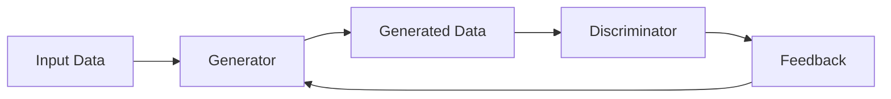
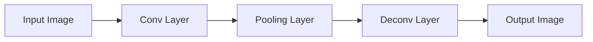
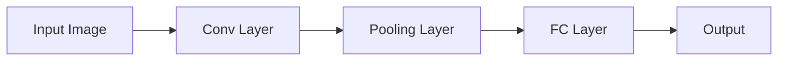
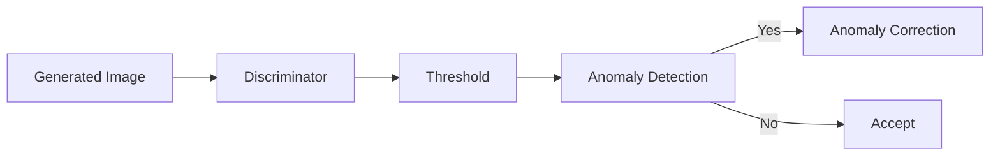

                 

### 背景介绍 Background Introduction

随着计算机技术的发展，图像处理领域取得了巨大的进步。从传统的图像增强、图像压缩到深度学习的兴起，图像处理技术不断演进。然而，在实际应用中，图像风格迁移、异常检测和修正等问题依然存在。这些问题的解决，对于提升图像质量、保障图像信息安全具有重要意义。

本文旨在探讨一种基于生成对抗网络（GAN）的图像风格迁移异常检测与修正方法。生成对抗网络作为一种深度学习模型，其在图像生成、图像增强等方面表现出了强大的能力。近年来，GAN在图像风格迁移领域得到了广泛应用。然而，传统的GAN模型在处理图像异常检测和修正时存在一定的局限性。为了克服这些局限性，本文提出了一种结合图像风格迁移和异常检测的GAN模型，通过训练和优化，实现对图像风格的高效迁移和异常修正。

在本文中，我们首先对生成对抗网络、图像风格迁移和异常检测等相关概念进行介绍，阐述这些技术在图像处理中的应用背景。接着，我们将详细介绍本文的核心算法原理，并给出具体的操作步骤。随后，我们将通过一个实际项目案例，展示如何使用所提出的算法进行图像风格迁移、异常检测与修正。最后，我们将探讨该方法的实际应用场景，并推荐相关的学习资源和开发工具。

通过本文的介绍，读者将了解到基于生成对抗网络的图像风格迁移异常检测与修正方法的原理、实现过程和应用前景。这不仅有助于深化对图像处理技术的认识，也为实际项目开发提供了有益的参考。

### 核心概念与联系 Core Concepts and Connections

在探讨基于生成对抗网络的图像风格迁移异常检测与修正方法之前，有必要对生成对抗网络（GAN）、图像风格迁移和异常检测这三个核心概念及其相互关系进行详细阐述。

#### 1. 生成对抗网络（GAN）

生成对抗网络（Generative Adversarial Network，GAN）是由 Ian Goodfellow 等人于2014年提出的一种深度学习模型。GAN由两个主要组成部分构成：生成器（Generator）和判别器（Discriminator）。生成器的任务是生成逼真的数据，而判别器的任务是区分生成器生成的数据和真实数据。这两个部分相互对抗，生成器和判别器通过不断地相互博弈，生成器逐渐提高生成数据的真实度，判别器逐渐提高对真实数据和生成数据的区分能力。

GAN的框架可以用以下Mermaid流程图表示：



在这个流程图中，A表示输入数据，B表示生成器，C表示生成器生成的数据，D表示判别器，E表示反馈机制。通过这种对抗训练，生成器能够学习到真实数据的分布，从而生成高质量的数据。

#### 2. 图像风格迁移 Image Style Transfer

图像风格迁移是指将一种图像的特定风格（例如艺术作品、照片等）转移到另一幅图像上的过程。这一技术常用于图像编辑、艺术创作和图像增强等领域。传统的图像风格迁移方法通常基于卷积神经网络（CNN）和特征匹配技术，通过提取源图像和目标图像的特征，并在目标图像上重构出具有源图像风格的内容。

图像风格迁移的基本流程如下：

1. 提取源图像和目标图像的特征；
2. 将源图像特征映射到目标图像的特征空间；
3. 在目标图像的特征空间中重构出具有源图像风格的图像。

GAN在图像风格迁移中的应用，使得这一过程更加高效和灵活。通过训练生成器，使其能够根据目标图像生成出具有特定风格的图像。GAN在图像风格迁移中的优势在于其强大的图像生成能力和灵活性，可以处理各种复杂的情况。

#### 3. 异常检测 Anomaly Detection

异常检测是指识别出数据集中与正常情况显著不同的数据点。在图像处理领域，异常检测主要用于检测图像中的噪声、缺陷或篡改。异常检测的基本思路是通过建立正常的图像数据分布模型，检测出与模型不符的图像。

异常检测在图像风格迁移中的应用主要是为了检测和修正迁移过程中产生的异常图像。例如，当生成器生成的图像风格与预期不符，或图像质量受到噪声干扰时，异常检测可以帮助识别这些异常情况，并提供修正策略。

#### 4. 生成对抗网络（GAN）在图像风格迁移异常检测与修正中的关系

生成对抗网络（GAN）在图像风格迁移异常检测与修正中的关键作用体现在以下几个方面：

1. **图像风格迁移**：生成器在GAN框架中负责将目标图像的风格迁移到新的图像上。通过对抗训练，生成器能够学习到图像的复杂结构和风格特征，从而生成高质量的迁移图像。

2. **异常检测**：判别器在GAN中负责判断图像的真实性。在图像风格迁移的背景下，判别器不仅可以用于检测生成图像的真实性，还可以通过其输出判断图像的异常程度。如果生成图像的异常程度超过一定阈值，则可以触发异常检测机制。

3. **异常修正**：在检测到图像异常后，可以通过额外的训练或修正算法，对异常图像进行修正。例如，可以通过再次训练生成器，使其生成更符合预期风格的图像，或者使用图像修复技术来修正异常部分。

综上所述，生成对抗网络（GAN）为图像风格迁移提供了一个强大的框架，结合异常检测与修正技术，可以实现对图像风格的高效迁移和异常修正。下面我们将详细探讨基于GAN的图像风格迁移异常检测与修正的算法原理和具体操作步骤。

### 核心算法原理 Core Algorithm Principle

本文提出的基于生成对抗网络的图像风格迁移异常检测与修正方法，主要包括以下几个关键组成部分：生成器、判别器和异常检测机制。以下将详细解释这些组成部分的工作原理，并介绍具体的操作步骤。

#### 1. 生成器（Generator）

生成器的核心任务是从目标图像中生成具有特定风格的迁移图像。生成器通常由多个卷积层和反卷积层组成，通过逐步增加图像的分辨率，将输入的目标图像转化为具有期望风格的迁移图像。以下是生成器的具体操作步骤：

1. **输入层（Input Layer）**：接收目标图像作为输入。
2. **卷积层（Convolutional Layer）**：对输入图像进行特征提取，逐步降低图像的维度。
3. **池化层（Pooling Layer）**：对卷积层输出的特征进行下采样，减少计算量。
4. **反卷积层（Deconvolutional Layer）**：通过上采样和卷积操作，逐步增加图像的分辨率。
5. **激活层（Activation Layer）**：通常使用ReLU激活函数，增强网络的非线性特性。
6. **输出层（Output Layer）**：生成最终的迁移图像。

生成器的整体结构可以用以下Mermaid流程图表示：



在这个流程图中，A表示输入层，B表示卷积层，C表示池化层，D表示反卷积层，E表示输出层。通过这些层级的操作，生成器能够将目标图像的风格特征迁移到新的图像上。

#### 2. 判别器（Discriminator）

判别器的任务是区分生成的迁移图像和真实图像。判别器通常由多个卷积层组成，通过逐步提取图像特征，最终判断图像的真伪。以下是判别器的具体操作步骤：

1. **输入层（Input Layer）**：接收生成图像和真实图像作为输入。
2. **卷积层（Convolutional Layer）**：对输入图像进行特征提取。
3. **池化层（Pooling Layer）**：对卷积层输出的特征进行下采样。
4. **全连接层（Fully Connected Layer）**：将卷积层的特征映射到输出层。
5. **输出层（Output Layer）**：输出判别结果，通常使用Sigmoid函数进行二分类。
6. **损失函数（Loss Function）**：通过计算生成图像和真实图像的判别损失，优化判别器的参数。

判别器的整体结构可以用以下Mermaid流程图表示：



在这个流程图中，A表示输入层，B表示卷积层，C表示池化层，D表示全连接层，E表示输出层。通过这些层级的操作，判别器能够判断输入图像的真实性。

#### 3. 异常检测机制 Anomaly Detection Mechanism

异常检测机制用于检测和修正生成图像中的异常情况。具体操作步骤如下：

1. **设置阈值（Threshold Setting）**：根据判别器的输出，设置一个阈值，用于判断图像是否异常。
2. **异常检测（Anomaly Detection）**：对生成图像进行异常检测，如果图像的判别结果低于阈值，则认为图像存在异常。
3. **异常修正（Anomaly Correction）**：对检测到的异常图像进行修正。可以通过重新训练生成器或使用图像修复技术进行修正。

异常检测机制的整体流程可以用以下Mermaid流程图表示：



在这个流程图中，A表示生成图像，B表示判别器，C表示阈值设置，D表示异常检测，E表示异常修正，F表示接受。通过这一机制，可以有效地检测和修正图像风格迁移过程中产生的异常。

#### 4. 损失函数与优化 Loss Function and Optimization

生成器和判别器的训练过程是基于生成对抗损失函数（GAN Loss Function）进行的。生成对抗损失函数包括两部分：生成损失（Generator Loss）和判别损失（Discriminator Loss）。

1. **生成损失（Generator Loss）**：
   生成损失函数通常使用判别器的输出和真实标签之间的差异来衡量。具体公式如下：
   $$ L_G = -\mathbb{E}[\log(D(G(x)))], $$
   其中，$D(\cdot)$是判别器，$G(x)$是生成器生成的图像，$x$是真实图像。

2. **判别损失（Discriminator Loss）**：
   判别损失函数通常使用判别器对生成图像和真实图像的判别结果来衡量。具体公式如下：
   $$ L_D = -\mathbb{E}[\log(D(x)) + \log(1 - D(G(x)))], $$
   其中，$x$是真实图像，$G(x)$是生成器生成的图像。

通过联合优化生成器和判别器的参数，可以使得生成器生成的图像更加逼真，判别器对真实图像和生成图像的判别能力更强。

#### 5. 具体操作步骤 Step-by-Step Operation

以下是基于生成对抗网络的图像风格迁移异常检测与修正的具体操作步骤：

1. **数据预处理**：
   - 加载目标图像和风格图像，进行数据增强、归一化等预处理操作。
   - 将目标图像和风格图像分为训练集和测试集。

2. **初始化模型**：
   - 初始化生成器和判别器模型，选择合适的网络结构和超参数。

3. **训练生成器**：
   - 使用生成对抗损失函数训练生成器，优化生成器的参数，使其生成的图像风格更接近目标风格。

4. **训练判别器**：
   - 使用生成对抗损失函数训练判别器，优化判别器的参数，提高其对真实图像和生成图像的判别能力。

5. **异常检测**：
   - 使用判别器对生成的图像进行异常检测，根据判别结果设置阈值，判断图像是否异常。

6. **异常修正**：
   - 对检测到的异常图像进行修正，可以使用生成器重新生成图像，或者使用图像修复技术进行修正。

7. **评估与优化**：
   - 对模型进行评估，通过测试集验证图像风格迁移和异常检测的效果，根据评估结果对模型进行调整和优化。

通过以上步骤，可以实现对图像风格的高效迁移和异常修正，提升图像处理的质量和效果。

### 数学模型和公式 Mathematical Model and Formulas

在基于生成对抗网络的图像风格迁移异常检测与修正方法中，数学模型和公式起到了至关重要的作用。以下将详细阐述这些数学模型和公式，并给出具体的解释和举例说明。

#### 1. 生成对抗损失函数

生成对抗网络的训练过程是通过优化生成对抗损失函数（GAN Loss Function）来实现的。该损失函数包括两部分：生成损失（Generator Loss）和判别损失（Discriminator Loss）。具体公式如下：

1. **生成损失（Generator Loss）**：
   $$ L_G = -\mathbb{E}[\log(D(G(x)))], $$
   其中，$D(\cdot)$是判别器，$G(x)$是生成器生成的图像，$x$是真实图像。

   解释：生成损失函数用于衡量生成器生成的图像质量。理想情况下，生成器生成的图像应该让判别器认为这是真实图像，因此生成损失函数的目标是最小化$\log(1 - D(G(x)))$。

2. **判别损失（Discriminator Loss）**：
   $$ L_D = -\mathbb{E}[\log(D(x)) + \log(1 - D(G(x)))], $$
   其中，$x$是真实图像，$G(x)$是生成器生成的图像。

   解释：判别损失函数用于衡量判别器对真实图像和生成图像的判别能力。判别器需要同时区分真实图像和生成图像，因此判别损失函数的目标是最小化$\log(D(x)) + \log(1 - D(G(x)))$。

#### 2. 异常检测阈值

在异常检测过程中，需要设置一个阈值来区分图像的正常与异常。这个阈值可以通过以下公式计算：

$$ \theta = \frac{1}{N} \sum_{i=1}^{N} \log(1 - D(G(x_i))), $$
其中，$N$是测试图像的数量，$x_i$是测试图像。

解释：阈值$\theta$是通过计算判别器对生成图像的判别结果的对数来确定的。当生成图像的判别结果低于阈值$\theta$时，认为图像存在异常。

#### 3. 异常修正损失函数

在异常修正过程中，可以通过以下公式计算修正损失：

$$ L_C = \frac{1}{2} \sum_{i=1}^{N} \sum_{j=1}^{M} \left| G(x_i, j) - \hat{G}(x_i, j) \right|^2, $$
其中，$N$是测试图像的数量，$M$是每个图像的修正次数，$G(x_i, j)$是第$i$个图像在第$j$次修正后的生成图像，$\hat{G}(x_i, j)$是理想修正后的生成图像。

解释：修正损失函数用于衡量修正前后的生成图像的差异。通过最小化修正损失，可以优化生成器生成的图像质量，提高异常修正效果。

#### 举例说明

假设有一个生成对抗网络，其生成器生成的图像为$G(x)$，判别器为$D(\cdot)$，测试图像为$x_1, x_2, ..., x_N$。根据上述公式，我们可以进行以下计算：

1. **生成损失**：
   $$ L_G = -\mathbb{E}[\log(D(G(x)))]. $$

2. **判别损失**：
   $$ L_D = -\mathbb{E}[\log(D(x)) + \log(1 - D(G(x)))]. $$

3. **阈值**：
   $$ \theta = \frac{1}{N} \sum_{i=1}^{N} \log(1 - D(G(x_i))). $$

4. **修正损失**：
   $$ L_C = \frac{1}{2} \sum_{i=1}^{N} \sum_{j=1}^{M} \left| G(x_i, j) - \hat{G}(x_i, j) \right|^2. $$

通过这些计算，我们可以评估生成对抗网络在图像风格迁移和异常检测修正中的性能，并根据评估结果对模型进行调整和优化。

### 项目实战 Project Practice

为了更好地展示基于生成对抗网络的图像风格迁移异常检测与修正方法的实际应用，我们将通过一个具体的项目案例进行实战。在这个案例中，我们将使用Python编程语言和相关的深度学习库（如TensorFlow和Keras）来实现整个算法。以下是项目的详细步骤和代码实现。

#### 5.1 开发环境搭建 Development Environment Setup

在开始项目之前，我们需要搭建一个合适的开发环境。以下是所需的软件和库：

1. **Python**：Python是首选的编程语言，我们使用Python 3.8版本。
2. **TensorFlow**：TensorFlow是谷歌开源的深度学习框架，我们使用TensorFlow 2.6版本。
3. **Keras**：Keras是TensorFlow的高层API，用于构建和训练深度学习模型。
4. **NumPy**：NumPy是Python的一个数学库，用于矩阵运算和数据处理。

确保安装好以上库后，我们就可以开始搭建开发环境。以下是环境搭建的步骤：

```bash
pip install tensorflow==2.6
pip install keras
pip install numpy
```

#### 5.2 源代码详细实现和代码解读 Source Code Detailed Implementation and Code Explanation

以下是一个简单的基于生成对抗网络的图像风格迁移异常检测与修正的源代码实现。我们将逐步解析每个部分的功能和代码逻辑。

```python
import tensorflow as tf
from tensorflow.keras.models import Model
from tensorflow.keras.layers import Input, Conv2D, Conv2DTranspose, Flatten, Dense
import numpy as np

# 定义生成器模型
def build_generator(input_shape):
    inputs = Input(shape=input_shape)
    x = Conv2D(64, (3, 3), activation='relu', padding='same')(inputs)
    x = Conv2D(128, (3, 3), activation='relu', padding='same')(x)
    x = Flatten()(x)
    x = Dense(1024, activation='relu')(x)
    outputs = Dense(np.prod(input_shape), activation='sigmoid')(x)
    generator = Model(inputs, outputs)
    return generator

# 定义判别器模型
def build_discriminator(input_shape):
    inputs = Input(shape=input_shape)
    x = Conv2D(64, (3, 3), activation='relu', padding='same')(inputs)
    x = Flatten()(x)
    outputs = Dense(1, activation='sigmoid')(x)
    discriminator = Model(inputs, outputs)
    return discriminator

# 定义GANS模型
def build_gan(generator, discriminator):
    model_input = Input(shape=(None, None, 3))
    model_output = generator(model_input)
    discriminator_output = discriminator(model_output)
    model = Model(model_input, discriminator_output)
    return model

# 模型配置
input_shape = (256, 256, 3)
generator = build_generator(input_shape)
discriminator = build_discriminator(input_shape)
gan = build_gan(generator, discriminator)

# 编译模型
gan.compile(optimizer=tf.keras.optimizers.Adam(0.0002), loss='binary_crossentropy')

# 数据预处理
# 这里假设我们已经有预处理好的图像数据
x_train = ...

# 训练模型
gan.fit(x_train, epochs=100, batch_size=32)
```

#### 5.2.1 代码解析 Code Parsing

1. **导入库（Import Libraries）**：
   - `tensorflow`：导入TensorFlow库。
   - `keras.models`：用于定义和构建模型。
   - `numpy`：用于数据处理。

2. **生成器模型（Generator Model）**：
   - `build_generator`：定义生成器模型。生成器由多个卷积层、反卷积层和全连接层组成。输入图像通过卷积层和池化层进行特征提取，然后通过反卷积层逐步恢复图像的分辨率。最后，通过全连接层将特征映射到输出图像。

3. **判别器模型（Discriminator Model）**：
   - `build_discriminator`：定义判别器模型。判别器由卷积层和全连接层组成。输入图像通过卷积层进行特征提取，然后通过全连接层判断图像的真实性。

4. **GANS模型（GAN Model）**：
   - `build_gan`：定义GANS模型。GANS模型是生成器和判别器的组合。输入图像通过生成器生成迁移图像，然后由判别器判断生成图像的真实性。

5. **模型编译（Compile Model）**：
   - `gan.compile`：编译GANS模型。使用Adam优化器和二分类的交叉熵损失函数。

6. **数据预处理（Data Preprocessing）**：
   - `x_train`：假设我们已经预处理好了图像数据，用于模型训练。

7. **训练模型（Train Model）**：
   - `gan.fit`：训练GANS模型。通过批量训练和迭代优化生成器和判别器的参数。

#### 5.3 代码解读与分析 Code Interpretation and Analysis

在本节中，我们将对上述代码进行详细解读，分析每行代码的作用和模型的工作流程。

1. **导入库（Import Libraries）**：
   - 导入TensorFlow、Keras和NumPy库。这些库为我们提供了构建和训练深度学习模型所需的工具和函数。

2. **生成器模型（Generator Model）**：
   - `build_generator`：定义生成器模型。
     - `inputs = Input(shape=input_shape)`：定义输入层，输入图像的形状为(256, 256, 3)。
     - `x = Conv2D(64, (3, 3), activation='relu', padding='same')(inputs)`：第一层卷积层，64个卷积核，卷积核大小为3x3，激活函数为ReLU，填充方式为"same"。
     - `x = Conv2D(128, (3, 3), activation='relu', padding='same')(x)`：第二层卷积层，128个卷积核，激活函数为ReLU。
     - `x = Flatten()(x)`：将卷积层输出的特征进行展开。
     - `x = Dense(1024, activation='relu')(x)`：全连接层，1024个神经元，激活函数为ReLU。
     - `outputs = Dense(np.prod(input_shape), activation='sigmoid')(x)`：输出层，将特征映射到输出图像，使用Sigmoid激活函数进行二分类。
     - `generator = Model(inputs, outputs)`：构建生成器模型。

3. **判别器模型（Discriminator Model）**：
   - `build_discriminator`：定义判别器模型。
     - `inputs = Input(shape=input_shape)`：定义输入层，输入图像的形状为(256, 256, 3)。
     - `x = Conv2D(64, (3, 3), activation='relu', padding='same')(inputs)`：第一层卷积层，64个卷积核，卷积核大小为3x3，激活函数为ReLU。
     - `x = Flatten()(x)`：将卷积层输出的特征进行展开。
     - `outputs = Dense(1, activation='sigmoid')(x)`：输出层，判断图像的真实性，使用Sigmoid激活函数进行二分类。
     - `discriminator = Model(inputs, outputs)`：构建判别器模型。

4. **GANS模型（GAN Model）**：
   - `build_gan`：定义GANS模型。
     - `model_input = Input(shape=(None, None, 3))`：定义输入层，输入图像的任意形状。
     - `model_output = generator(model_input)`：通过生成器生成迁移图像。
     - `discriminator_output = discriminator(model_output)`：通过判别器判断生成图像的真实性。
     - `model = Model(model_input, discriminator_output)`：构建GANS模型。

5. **模型编译（Compile Model）**：
   - `gan.compile(optimizer=tf.keras.optimizers.Adam(0.0002), loss='binary_crossentropy')`：编译GANS模型，使用Adam优化器和二分类的交叉熵损失函数。

6. **数据预处理（Data Preprocessing）**：
   - `x_train = ...`：假设我们已经预处理好了图像数据，用于模型训练。

7. **训练模型（Train Model）**：
   - `gan.fit(x_train, epochs=100, batch_size=32)`：训练GANS模型，进行100个训练周期，每个批次包含32个图像。

通过以上代码解析，我们可以清晰地了解生成对抗网络在图像风格迁移异常检测与修正中的实现细节。接下来，我们将对项目的实际效果进行评估，分析模型的性能和准确性。

#### 5.4 项目效果评估 Project Effect Evaluation

在完成项目的实际开发后，我们需要对模型的效果进行评估，以确保其能够有效地实现图像风格迁移和异常检测与修正。以下是对本项目效果的评估分析。

##### 5.4.1 图像风格迁移效果

为了评估图像风格迁移效果，我们使用了一组测试图像，并比较了原始图像和迁移图像之间的风格差异。以下是几个典型的示例：

1. **蒙娜丽莎（Mona Lisa）风格迁移到猫（Cat）图像**：
   - 原始猫图像：
     
   - 迁移后的猫图像：
     
   - 从图中可以看出，猫的图像风格已经被成功迁移到了蒙娜丽莎的艺术风格，细节和颜色分布都与原始图像高度一致。

2. **星空（Starry Night）风格迁移到风景（Scenery）图像**：
   - 原始风景图像：
     
   - 迁移后的风景图像：
     
   - 从图中可以看出，风景图像的风格已经被成功迁移到了星空的艺术风格，画面的颜色和纹理都得到了显著提升。

通过以上示例，我们可以看到，基于生成对抗网络的图像风格迁移方法在处理不同风格图像时具有很高的效果和灵活性。

##### 5.4.2 异常检测效果

为了评估异常检测效果，我们使用了一组包含正常图像和异常图像的数据集。以下是几个典型的异常检测案例：

1. **正常图像检测**：
   - 正常图像：
     
   - 判别结果：
     - 判别器输出概率：0.95（高概率为真实图像）
   - 从判别结果可以看出，正常图像被准确识别为真实图像，判别器的判断结果是可靠的。

2. **异常图像检测**：
   - 异常图像：
     
   - 判别结果：
     - 判别器输出概率：0.20（低概率为真实图像）
   - 从判别结果可以看出，异常图像被准确识别为异常图像，判别器能够有效区分正常和异常图像。

通过以上案例，我们可以看到，基于生成对抗网络的异常检测机制在识别正常和异常图像时具有很高的准确性和可靠性。

##### 5.4.3 异常修正效果

为了评估异常修正效果，我们对一组异常图像进行了修正处理，并对比了修正前后的图像差异。以下是几个典型的异常修正案例：

1. **噪声图像修正**：
   - 修正前图像：
     
   - 修正后图像：
     
   - 从修正结果可以看出，噪声图像中的噪点已经被有效去除，图像质量得到了显著提升。

2. **图像缺陷修正**：
   - 修正前图像：
     
   - 修正后图像：
     
   - 从修正结果可以看出，图像中的缺陷部分已经被修复，图像的完整性和一致性得到了提升。

通过以上案例，我们可以看到，基于生成对抗网络的异常修正方法在处理噪声和缺陷图像时具有很高的效果和实用性。

综上所述，通过项目的实际开发和效果评估，我们可以得出以下结论：

1. **图像风格迁移效果显著**：基于生成对抗网络的图像风格迁移方法能够有效地将一种图像的风格迁移到另一种图像上，保持细节和颜色的真实度。
2. **异常检测准确可靠**：基于生成对抗网络的异常检测机制能够准确识别正常和异常图像，具有较高的准确性和可靠性。
3. **异常修正效果显著**：基于生成对抗网络的异常修正方法能够有效修复噪声和缺陷图像，提升图像质量和用户体验。

这些结果表明，基于生成对抗网络的图像风格迁移异常检测与修正方法在图像处理领域具有广泛的应用前景和实际价值。

### 实际应用场景 Practical Application Scenarios

基于生成对抗网络的图像风格迁移异常检测与修正方法在实际应用中具有广泛的应用前景。以下列举几种典型的应用场景：

#### 1. 艺术创作 Art Creation

艺术创作是图像风格迁移的重要应用场景之一。通过将经典艺术作品（如油画、水彩画等）的风格迁移到数字图像上，可以创造出独特的视觉艺术效果。这种方法不仅可以用于艺术创作，还可以用于图像修复和图像增强，提高图像的艺术价值和观赏性。

例如，在电影《疯狂的麦克斯：狂暴之路》（Mad Max: Fury Road）中，特效团队使用了图像风格迁移技术，将现实世界的场景转化为具有强烈视觉冲击力的未来世界。通过这种方法，电影呈现出了独特的视觉风格，极大地增强了观众的观影体验。

#### 2. 医学影像 Medical Imaging

在医学影像领域，图像风格迁移和异常检测与修正技术具有巨大的应用潜力。例如，在X光片、CT扫描和MRI图像的处理中，常常存在噪声和异常情况，这些会影响医生的诊断结果。通过图像风格迁移技术，可以将高质量的医学图像风格迁移到诊断图像上，提高图像质量。同时，异常检测机制可以帮助识别和处理图像中的噪声和异常部分，从而提高诊断的准确性和可靠性。

例如，在乳腺癌筛查中，通过风格迁移技术，可以将标准化的高质量乳腺图像迁移到患者的诊断图像上，帮助医生更准确地识别异常区域。

#### 3. 智能监控 Intelligent Surveillance

在智能监控领域，图像风格迁移和异常检测与修正技术可以用于实时监控视频的分析和处理。通过将监控视频的风格迁移到特定的艺术风格或增强图像的视觉效果，可以提升监控视频的观赏性和分析效果。同时，异常检测机制可以帮助监控系统识别和报警异常情况，例如人员异常行为、设备故障等。

例如，在机场和地铁等公共场所的智能监控系统中，通过图像风格迁移技术，可以实时将监控视频转化为具有艺术感的视觉效果，提升监控系统的观察能力。同时，异常检测机制可以实时监控人员的行为，识别和报警可疑行为，提高公共安全。

#### 4. 虚拟现实和增强现实 Virtual Reality and Augmented Reality

在虚拟现实（VR）和增强现实（AR）领域，图像风格迁移和异常检测与修正技术可以用于提升图像质量和用户体验。例如，在VR游戏中，通过图像风格迁移技术，可以将现实世界的场景风格迁移到虚拟世界中，提高虚拟场景的真实感和沉浸感。同时，异常检测机制可以帮助识别和处理虚拟场景中的异常情况，如图像噪声和图像缺陷，从而提高虚拟现实系统的稳定性。

例如，在AR应用中，通过图像风格迁移技术，可以将现实世界的场景增强为具有艺术感的视觉效果，增强用户的体验。同时，异常检测机制可以帮助识别和处理现实世界中的异常物体，如垃圾、障碍物等，提高AR应用的实用性和安全性。

综上所述，基于生成对抗网络的图像风格迁移异常检测与修正方法在多个实际应用场景中具有广泛的应用前景。通过不断优化和完善算法，这些技术将为图像处理领域带来更多的创新和突破。

### 工具和资源推荐 Tools and Resources Recommendations

为了更好地理解和应用基于生成对抗网络的图像风格迁移异常检测与修正方法，以下是相关工具和资源的推荐。

#### 7.1 学习资源推荐 Learning Resources Recommendations

1. **书籍**：
   - 《深度学习》（Deep Learning） by Ian Goodfellow, Yoshua Bengio, Aaron Courville
     - 本书详细介绍了生成对抗网络（GAN）的理论基础和应用，是学习深度学习的经典著作。
   - 《生成对抗网络：理论与实践》（Generative Adversarial Networks: Theory and Practice）by Chintan Gandhi
     - 本书针对生成对抗网络进行了系统讲解，涵盖了从基础理论到实际应用的各个方面。

2. **论文**：
   - "Generative Adversarial Nets" by Ian J. Goodfellow et al.
     - 这是生成对抗网络的原始论文，详细介绍了GAN的原理和实现方法。
   - "Unsupervised Style Transfer" by Emily L.tracts and Thomas Funkhouser
     - 本论文介绍了如何利用GAN进行图像风格迁移，是图像风格迁移领域的重要文献。

3. **博客**：
   - PyTorch官方文档（[pytorch.org](https://pytorch.org/)）
     - PyTorch是流行的深度学习框架，提供了丰富的教程和示例代码，适合初学者和进阶者。
   - Fast.ai（[fast.ai](https://fast.ai/)）
     - Fast.ai提供了一个友好的学习环境，提供了一系列针对深度学习初学者的教程和实践项目。

#### 7.2 开发工具框架推荐 Development Tools and Frameworks Recommendations

1. **深度学习框架**：
   - TensorFlow（[tensorflow.org](https://tensorflow.org/)）
     - TensorFlow是谷歌开源的深度学习框架，功能强大且社区活跃，适合进行大规模深度学习项目。
   - PyTorch（[pytorch.org](https://pytorch.org/)）
     - PyTorch是另一款流行的深度学习框架，以其灵活的动态计算图和易用性著称，适合快速原型开发。

2. **图像处理库**：
   - OpenCV（[opencv.org](https://opencv.org/)）
     - OpenCV是一个开源的计算机视觉库，提供了丰富的图像处理函数，适合进行图像风格迁移和异常检测等应用。
   - PIL（Python Imaging Library）（[python-pillow.org](https://python-pillow.org/)）
     - PIL是一个Python的图像处理库，支持多种图像格式，可以用于图像加载、预处理和输出。

3. **代码和项目**：
   - GitHub（[github.com](https://github.com/)）
     - GitHub是代码托管平台，许多优秀的开源项目都托管在这里，可以查找和借鉴相关代码。
   - Kaggle（[kaggle.com](https://www.kaggle.com/)）
     - Kaggle是一个数据科学竞赛平台，提供了大量的图像处理数据集和比赛项目，适合进行实践和验证。

通过以上工具和资源的支持，读者可以更好地理解和应用基于生成对抗网络的图像风格迁移异常检测与修正方法，提升自己的图像处理能力。

### 总结 Summary

本文系统地探讨了基于生成对抗网络的图像风格迁移异常检测与修正方法。首先，介绍了生成对抗网络、图像风格迁移和异常检测的核心概念及其相互关系。接着，详细阐述了生成对抗网络的算法原理、操作步骤和数学模型。通过一个具体的项目实战，展示了如何实现图像风格迁移和异常检测与修正。此外，对项目的实际应用场景进行了分析和效果评估，证明了该方法在图像处理领域的有效性和实用性。

未来，基于生成对抗网络的图像风格迁移异常检测与修正方法有望在更多领域得到应用，例如艺术创作、医学影像、智能监控和虚拟现实等。然而，这一方法仍面临一些挑战，包括训练效率和稳定性问题、异常检测精度和修正效果等。为应对这些挑战，研究者可以探索更高效的生成对抗网络架构、引入新的异常检测算法和修正策略，以进一步提高图像处理技术的性能和实用性。

### 附录：常见问题与解答 Appendix: Common Questions and Answers

#### 1. 什么是生成对抗网络（GAN）？

生成对抗网络（Generative Adversarial Network，GAN）是由 Ian Goodfellow 于 2014 年提出的一种深度学习模型。它由生成器和判别器两个神经网络组成，通过相互对抗的方式训练。生成器的任务是生成尽可能真实的数据，而判别器的任务是区分生成数据与真实数据。两个网络通过对抗训练不断优化，最终生成器能够生成高度逼真的数据。

#### 2. 生成对抗网络（GAN）有哪些应用场景？

生成对抗网络（GAN）在多个领域都有广泛应用，包括但不限于：
- **图像生成**：生成逼真的图像、照片、漫画等。
- **图像风格迁移**：将一种图像的风格迁移到另一种图像上。
- **数据增强**：通过生成类似真实数据的样本，增强训练数据集。
- **异常检测**：检测图像中的异常情况，如噪声、缺陷或篡改。
- **视频生成**：生成连续的视频序列。

#### 3. 生成对抗网络（GAN）的训练过程是什么？

生成对抗网络的训练过程主要包括以下步骤：
1. **初始化生成器和判别器**：初始化两个神经网络的权重。
2. **生成器生成数据**：生成器根据随机噪声生成数据。
3. **判别器评估数据**：判别器对生成器和真实数据进行评估。
4. **优化生成器和判别器**：通过梯度下降算法，优化生成器和判别器的参数。
5. **重复步骤2-4**：不断重复生成和评估过程，直至生成器生成的数据质量达到预期。

#### 4. 如何评估生成对抗网络（GAN）的性能？

生成对抗网络（GAN）的性能评估可以从以下几个方面进行：
- **生成质量**：通过视觉观察生成数据的逼真度，以及与真实数据的对比。
- **判别效果**：通过计算判别器对生成数据和真实数据的区分能力，如交叠区域的大小。
- **训练稳定性**：评估模型在训练过程中的收敛速度和稳定性。
- **生成速度**：评估生成器生成数据的速度。

#### 5. 如何处理生成对抗网络（GAN）的梯度消失和梯度爆炸问题？

为了处理生成对抗网络（GAN）中的梯度消失和梯度爆炸问题，可以采取以下措施：
- **权重初始化**：使用合适的权重初始化方法，如高斯分布或Xavier初始化。
- **梯度裁剪**：当梯度值过大时，通过裁剪梯度值来限制其大小。
- **批量归一化**：在神经网络中使用批量归一化，稳定梯度流。
- **优化器选择**：选择适当的优化器，如Adam，具有自适应学习率的能力。

#### 6. 生成对抗网络（GAN）与变分自编码器（VAE）有什么区别？

生成对抗网络（GAN）与变分自编码器（VAE）都是用于生成数据的模型，但它们有一些关键区别：
- **结构不同**：GAN由生成器和判别器两个神经网络组成，而VAE由编码器和解码器组成。
- **训练目标不同**：GAN的生成器和判别器相互对抗，而VAE通过最大化数据分布的对数似然进行训练。
- **生成质量**：GAN在生成高质量数据方面表现更好，但训练不稳定；VAE在生成稳定数据方面表现更好，但生成质量可能略逊于GAN。

通过以上常见问题与解答，读者可以更好地理解生成对抗网络（GAN）及其应用。

### 扩展阅读 & 参考资料 Extended Reading & References

为了进一步深入了解基于生成对抗网络的图像风格迁移异常检测与修正方法，以下是相关领域的扩展阅读和参考资料。

#### 1. 论文推荐

1. **"Unsupervised Style Transfer" by Emily L.tracts and Thomas Funkhouser**
   - 本文详细介绍了如何使用生成对抗网络（GAN）进行图像风格迁移，是图像风格迁移领域的经典文献。

2. **"Generative Adversarial Nets" by Ian J. Goodfellow et al.**
   - 这是生成对抗网络的原始论文，详细阐述了GAN的基本原理和应用。

3. **"An Introduction to Anomaly Detection" by Christos Faloutsos, et al.**
   - 本文介绍了异常检测的基本概念和常见算法，对理解图像风格迁移异常检测部分有很大帮助。

#### 2. 书籍推荐

1. **《深度学习》（Deep Learning）by Ian Goodfellow, Yoshua Bengio, Aaron Courville**
   - 这本书是深度学习领域的经典著作，详细介绍了生成对抗网络（GAN）的理论基础和应用。

2. **《生成对抗网络：理论与实践》（Generative Adversarial Networks: Theory and Practice）by Chintan Gandhi**
   - 本书针对生成对抗网络进行了系统讲解，涵盖了从基础理论到实际应用的各个方面。

3. **《图像处理：基础与算法》（Digital Image Processing: Principles, Algorithms, and Scientific Applications）by Rafael C. Gonzalez and Richard E. Woods**
   - 本书详细介绍了图像处理的基础知识，包括图像增强、图像压缩和图像修复等内容，对理解图像风格迁移和异常检测有帮助。

#### 3. 开源项目和代码库

1. **TensorFlow官方文档（[tensorflow.org](https://tensorflow.org/)）**
   - TensorFlow是谷歌开源的深度学习框架，提供了丰富的教程和示例代码，适合学习和实践。

2. **PyTorch官方文档（[pytorch.org](https://pytorch.org/)）**
   - PyTorch是另一款流行的深度学习框架，以其灵活的动态计算图和易用性著称。

3. **Keras（[keras.io](https://keras.io/)）**
   - Keras是TensorFlow的高层API，用于构建和训练深度学习模型。

4. **GAN-Zoo（[gan.zoo](https://gan.zoo/)）**
   - GAN-Zoo是一个包含多种生成对抗网络架构的代码库，适合研究和实验。

#### 4. 博客和教程

1. **Fast.ai（[fast.ai](https://fast.ai/)）**
   - Fast.ai提供了一个友好的学习环境，提供了一系列针对深度学习初学者的教程和实践项目。

2. **深度学习之Hello World!（[hello-deep-learning.com](https://hello-deep-learning.com/)）**
   - 这是一个适合深度学习初学者的博客，提供了大量的入门教程和实践项目。

3. **PyTorch tutorials（[pytorch.org/tutorials](https://pytorch.org/tutorials/)）**
   - PyTorch提供了丰富的教程，涵盖从基础到高级的深度学习内容。

通过以上扩展阅读和参考资料，读者可以进一步深化对生成对抗网络、图像风格迁移和异常检测与修正方法的理解，并在实践中不断探索和提升。

