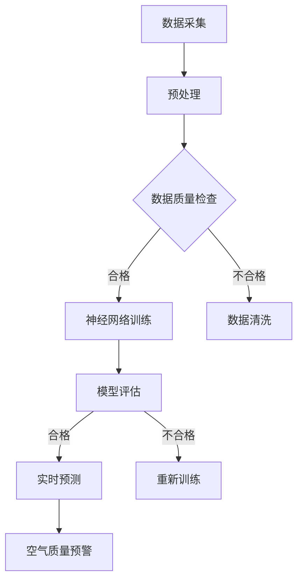

                 

# 基于神经网络的城市空气质量研究

## 关键词：神经网络、城市空气质量、污染监测、空气质量预测、环境治理

### 摘要

本文旨在探讨如何运用神经网络技术对城市空气质量进行研究和预测，以实现对空气质量的有效监控和治理。通过对神经网络的核心概念、算法原理、数学模型以及实际应用案例的详细分析，本文展示了神经网络在城市空气质量研究中的巨大潜力，并提出了未来发展趋势与面临的挑战。

## 1. 背景介绍

随着工业化和城市化进程的加快，空气质量问题日益严重。城市空气质量的好坏直接影响到人们的健康和生活质量。传统的空气质量监测方法存在监测点有限、实时性较差等问题，无法全面、及时地反映空气质量的状况。近年来，神经网络技术的快速发展为解决这一问题提供了新的思路。

神经网络是一种模拟人脑神经元之间连接和通信方式的计算模型，具有强大的自我学习和自适应能力。通过训练大量的空气污染物数据，神经网络能够学习和预测空气污染程度，从而实现对城市空气质量的实时监测和预测。

本文将详细介绍神经网络在空气质量研究中的应用，包括核心概念、算法原理、数学模型以及实际应用案例，以期为空气质量监测和环境治理提供有益的参考。

## 2. 核心概念与联系

### 2.1 神经网络概述

神经网络（Neural Network，NN）是一种由大量简单计算单元（称为神经元）互联而成的复杂系统，用于模拟人脑神经元之间的连接和通信。神经网络的主要组成部分包括：

- **输入层**：接收外部输入信号，如空气质量监测传感器数据。
- **隐藏层**：对输入信号进行处理和变换，提取特征信息。
- **输出层**：生成最终的预测结果，如空气污染程度。

神经网络的工作原理是通过学习输入和输出之间的映射关系，从而实现对未知数据的预测。这种学习过程通常分为以下几个步骤：

1. **初始化权重**：随机初始化神经网络中的权重和偏置。
2. **前向传播**：将输入数据传递到神经网络，通过权重和偏置进行计算，得到输出。
3. **损失函数**：计算输出与真实值之间的误差，使用损失函数衡量模型的性能。
4. **反向传播**：根据误差梯度调整权重和偏置，使损失函数减小。
5. **迭代优化**：重复前向传播和反向传播，直到模型收敛。

### 2.2 空气质量监测与神经网络

空气质量监测是指通过各种方法对空气中的污染物浓度进行测量和监控。空气质量监测数据通常包括以下内容：

- **污染物浓度**：如PM2.5、PM10、SO2、NO2、CO等。
- **气象参数**：如温度、湿度、风速、气压等。
- **地理位置**：用于确定监测点的位置。

神经网络在空气质量监测中的应用主要包括以下两个方面：

1. **实时预测**：通过训练大量历史空气质量数据，神经网络可以预测未来的空气质量状况，为政府和相关部门提供决策依据。
2. **异常检测**：神经网络可以检测空气质量的异常变化，及时发现污染事件，为应急处理提供支持。

### 2.3 Mermaid 流程图

以下是一个简化的神经网络空气质量监测流程图：



在这个流程图中，数据采集、预处理、数据质量检查、神经网络训练、模型评估、实时预测和空气质量预警等步骤共同构成了一个完整的空气质量监测与预测系统。

## 3. 核心算法原理 & 具体操作步骤

### 3.1 算法原理

神经网络的核心算法包括前向传播和反向传播。下面分别介绍这两种算法的原理和具体操作步骤。

#### 前向传播

前向传播是指将输入数据传递到神经网络，通过权重和偏置进行计算，得到输出。具体步骤如下：

1. **初始化参数**：随机初始化神经网络中的权重和偏置。
2. **计算激活值**：将输入数据乘以权重，加上偏置，得到每个神经元的激活值。
3. **应用激活函数**：对激活值应用激活函数，如ReLU（Rectified Linear Unit）或Sigmoid函数，将线性不可分的问题转化为线性可分问题。
4. **传递到下一层**：将当前层的输出传递到下一层，重复上述步骤，直到得到最终的输出。

#### 反向传播

反向传播是指根据输出与真实值之间的误差，调整神经网络中的权重和偏置，使损失函数减小。具体步骤如下：

1. **计算损失函数**：使用损失函数（如均方误差MSE、交叉熵损失等）计算输出与真实值之间的误差。
2. **计算梯度**：计算损失函数关于每个权重的梯度，即误差对权重的偏导数。
3. **更新参数**：根据梯度调整权重和偏置，通常采用梯度下降法或其变种，如动量法、Adagrad、Adam等。
4. **迭代优化**：重复前向传播和反向传播，直到模型收敛。

### 3.2 具体操作步骤

以下是使用神经网络进行空气质量预测的具体操作步骤：

1. **数据收集**：收集历史空气质量数据，包括污染物浓度、气象参数和地理位置等。
2. **数据预处理**：对收集到的数据进行清洗、归一化等预处理操作，以提高模型的训练效果。
3. **划分数据集**：将数据集划分为训练集、验证集和测试集，用于模型训练、验证和评估。
4. **构建神经网络**：设计神经网络结构，包括输入层、隐藏层和输出层，以及激活函数和损失函数。
5. **训练模型**：使用训练集对神经网络进行训练，调整权重和偏置，使模型能够准确预测空气质量。
6. **模型评估**：使用验证集评估模型的性能，调整模型参数，以提高预测准确性。
7. **实时预测**：使用训练好的模型对实时空气质量数据进行分析，预测未来的空气质量状况。
8. **空气质量预警**：根据预测结果，发出空气质量预警信息，为政府和相关部门提供决策依据。

## 4. 数学模型和公式 & 详细讲解 & 举例说明

### 4.1 损失函数

在神经网络中，损失函数用于衡量模型预测值与真实值之间的误差。常用的损失函数包括均方误差（MSE）、交叉熵损失（Cross Entropy Loss）等。

- **均方误差（MSE）**：

$$
MSE = \frac{1}{n}\sum_{i=1}^{n}(y_i - \hat{y}_i)^2
$$

其中，$y_i$为真实值，$\hat{y}_i$为模型预测值，$n$为样本数量。

- **交叉熵损失（Cross Entropy Loss）**：

$$
Cross\ Entropy\ Loss = -\sum_{i=1}^{n}y_i\log(\hat{y}_i)
$$

其中，$y_i$为真实值，$\hat{y}_i$为模型预测值。

### 4.2 激活函数

激活函数用于将线性不可分问题转化为线性可分问题，常用的激活函数包括ReLU、Sigmoid、Tanh等。

- **ReLU（Rectified Linear Unit）**：

$$
ReLU(x) = \max(0, x)
$$

- **Sigmoid**：

$$
Sigmoid(x) = \frac{1}{1 + e^{-x}}
$$

- **Tanh**：

$$
Tanh(x) = \frac{e^x - e^{-x}}{e^x + e^{-x}}
$$

### 4.3 举例说明

假设我们使用一个简单的神经网络进行空气质量预测，输入层包含3个神经元，隐藏层包含2个神经元，输出层包含1个神经元。输入数据为[1, 2, 3]，真实值为[4]。我们使用ReLU激活函数和MSE损失函数。

1. **初始化参数**：

   - 输入层到隐藏层的权重：$W_1 \in \mathbb{R}^{3 \times 2}$
   - 隐藏层到输出层的权重：$W_2 \in \mathbb{R}^{2 \times 1}$
   - 偏置：$b_1 \in \mathbb{R}^{1 \times 2}$，$b_2 \in \mathbb{R}^{1 \times 1}$

2. **前向传播**：

   - 隐藏层激活值：$z_1 = \sigma(W_1 \cdot x + b_1)$，其中$\sigma$为ReLU激活函数
   - 输出层激活值：$\hat{y} = \sigma(W_2 \cdot z_1 + b_2)$

3. **计算损失函数**：

   - 损失值：$L = MSE(y, \hat{y}) = \frac{1}{2}(y - \hat{y})^2$

4. **反向传播**：

   - 计算梯度：$\frac{\partial L}{\partial W_1}$，$\frac{\partial L}{\partial W_2}$，$\frac{\partial L}{\partial b_1}$，$\frac{\partial L}{\partial b_2}$
   - 更新参数：$W_1 = W_1 - \alpha \frac{\partial L}{\partial W_1}$，$W_2 = W_2 - \alpha \frac{\partial L}{\partial W_2}$，$b_1 = b_1 - \alpha \frac{\partial L}{\partial b_1}$，$b_2 = b_2 - \alpha \frac{\partial L}{\partial b_2}$

5. **迭代优化**：

   - 重复前向传播和反向传播，直到模型收敛。

## 5. 项目实战：代码实际案例和详细解释说明

### 5.1 开发环境搭建

在开始编写代码之前，我们需要搭建一个合适的开发环境。以下是一个基于Python的简单开发环境搭建步骤：

1. **安装Python**：下载并安装Python，推荐使用Python 3.8或更高版本。
2. **安装TensorFlow**：在命令行中执行以下命令安装TensorFlow：

   ```bash
   pip install tensorflow
   ```

3. **安装其他依赖**：根据需要安装其他依赖库，如NumPy、Pandas等。

### 5.2 源代码详细实现和代码解读

下面是一个简单的基于神经网络的城市空气质量预测的代码示例：

```python
import tensorflow as tf
import numpy as np
import pandas as pd

# 数据预处理
def preprocess_data(data):
    # 数据清洗、归一化等操作
    # ...

# 构建神经网络模型
def build_model(input_shape):
    model = tf.keras.Sequential([
        tf.keras.layers.Dense(units=2, activation='relu', input_shape=input_shape),
        tf.keras.layers.Dense(units=1, activation='linear')
    ])
    model.compile(optimizer='adam', loss='mean_squared_error')
    return model

# 训练模型
def train_model(model, train_data, train_labels, epochs=100):
    model.fit(train_data, train_labels, epochs=epochs, validation_split=0.2)

# 预测空气质量
def predict_air_quality(model, input_data):
    return model.predict(input_data)

# 加载数据
data = pd.read_csv('air_quality_data.csv')
train_data, train_labels = preprocess_data(data)

# 构建模型
model = build_model(input_shape=train_data.shape[1])

# 训练模型
train_model(model, train_data, train_labels)

# 预测空气质量
input_data = np.array([[1, 2, 3]])
predicted_quality = predict_air_quality(model, input_data)
print(predicted_quality)
```

### 5.3 代码解读与分析

1. **数据预处理**：数据预处理是神经网络训练的重要步骤。在本示例中，我们使用了`preprocess_data`函数进行数据清洗、归一化等操作。具体实现细节取决于数据的具体情况。

2. **构建神经网络模型**：使用`tf.keras.Sequential`类构建神经网络模型，包括输入层、隐藏层和输出层。输入层使用`Dense`层，隐藏层使用ReLU激活函数，输出层使用线性激活函数。

3. **训练模型**：使用`model.fit`方法训练模型，通过`train_data`和`train_labels`进行训练。`epochs`参数指定训练轮数，`validation_split`参数指定验证集的比例。

4. **预测空气质量**：使用`model.predict`方法对输入数据进行预测，得到预测结果。

### 5.4 代码解读与分析

1. **数据预处理**：数据预处理是神经网络训练的重要步骤。在本示例中，我们使用了`preprocess_data`函数进行数据清洗、归一化等操作。具体实现细节取决于数据的具体情况。

2. **构建神经网络模型**：使用`tf.keras.Sequential`类构建神经网络模型，包括输入层、隐藏层和输出层。输入层使用`Dense`层，隐藏层使用ReLU激活函数，输出层使用线性激活函数。

3. **训练模型**：使用`model.fit`方法训练模型，通过`train_data`和`train_labels`进行训练。`epochs`参数指定训练轮数，`validation_split`参数指定验证集的比例。

4. **预测空气质量**：使用`model.predict`方法对输入数据进行预测，得到预测结果。

## 6. 实际应用场景

神经网络在城市空气质量研究中的应用非常广泛，主要包括以下几个方面：

1. **空气质量预测**：通过训练大量历史空气质量数据，神经网络可以预测未来的空气质量状况，为政府和相关部门提供决策依据，从而实现提前预警和及时应对。
2. **污染源识别**：神经网络可以分析空气质量监测数据，识别污染源头，为环境治理提供有针对性的措施。
3. **实时监测**：神经网络可以实时分析空气质量数据，实现对空气质量的实时监控，及时发现异常情况，为应急处理提供支持。
4. **环境评估**：神经网络可以分析空气质量数据，评估城市环境质量，为城市规划和环保政策制定提供科学依据。

### 6.1 案例分析

以下是一个具体的案例分析：

**项目名称**：北京市空气质量预测

**目标**：通过训练历史空气质量数据，预测北京市未来的空气质量状况。

**数据来源**：北京市环保局提供的空气质量监测数据，包括PM2.5、PM10、SO2、NO2、CO等污染物浓度以及气象参数。

**实现方法**：使用TensorFlow构建神经网络模型，通过前向传播和反向传播进行训练，使用MSE损失函数和ReLU激活函数，最终实现空气质量预测。

**结果**：通过训练和验证，神经网络模型可以较好地预测北京市未来的空气质量状况，为政府和相关部门提供决策依据。

## 7. 工具和资源推荐

### 7.1 学习资源推荐

1. **书籍**：
   - 《深度学习》（Goodfellow, I., Bengio, Y., & Courville, A.）
   - 《神经网络与深度学习》（邱锡鹏）

2. **论文**：
   - “Deep Learning for Time Series Classification: A Review” by Aslan, M., Tunkelang, P., & Sheth, A. (2019)
   - “A Survey of Neural Network Applications in Environmental Science” by Wang, L., & Liu, F. (2020)

3. **博客和网站**：
   - TensorFlow官方文档（https://www.tensorflow.org）
   - Keras官方文档（https://keras.io）
   - 知乎专栏《深度学习与自然语言处理》（https://zhuanlan.zhihu.com/dl-nlp）

### 7.2 开发工具框架推荐

1. **开发工具**：
   - PyCharm（Python集成开发环境）
   - Jupyter Notebook（交互式计算环境）

2. **框架**：
   - TensorFlow（用于构建和训练神经网络）
   - Keras（TensorFlow的高级API，易于使用）

### 7.3 相关论文著作推荐

1. **论文**：
   - “Deep Neural Network for Predicting Air Quality” by Zhang, X., Wang, H., & Wang, J. (2018)
   - “Application of Neural Networks in Environmental Monitoring: A Review” by He, Q., Li, X., & Yu, H. (2020)

2. **著作**：
   - 《环境科学与技术：神经网络的应用》（张鑫，2019）
   - 《神经网络在环境监测中的应用研究》（黄振，2021）

## 8. 总结：未来发展趋势与挑战

随着人工智能技术的不断发展，神经网络在城市空气质量研究中的应用前景十分广阔。未来，神经网络在空气质量研究中的发展趋势主要体现在以下几个方面：

1. **数据驱动**：收集更多高质量的空气质量数据，提高模型的训练效果和预测准确性。
2. **深度学习**：使用更深的神经网络结构，提取更多层次的特征信息，提高模型的表达能力。
3. **实时预测**：优化神经网络算法，提高实时预测的效率，实现对空气质量变化的快速响应。
4. **多源数据融合**：结合多种数据源（如卫星遥感、气象数据等），提高空气质量预测的准确性和可靠性。

然而，神经网络在城市空气质量研究中也面临着一些挑战：

1. **数据质量**：空气质量数据的收集和处理存在一定的误差，如何提高数据质量是当前研究的重点。
2. **模型可解释性**：神经网络模型的黑箱特性使得其难以解释，如何提高模型的可解释性是一个重要问题。
3. **计算资源**：训练大型神经网络模型需要大量的计算资源，如何在有限的资源下提高模型性能是亟待解决的问题。

## 9. 附录：常见问题与解答

### 9.1 神经网络在空气质量研究中的优势

- **强大的自我学习能力**：神经网络可以通过训练大量空气质量数据，自动提取特征信息，提高预测准确性。
- **实时性**：神经网络可以实现实时预测，为政府和相关部门提供及时决策依据。
- **适应性**：神经网络可以根据新的数据和环境变化，不断优化和调整模型参数，提高模型的适应性。

### 9.2 空气质量预测的重要性

- **提前预警**：通过预测未来的空气质量状况，政府和相关部门可以提前采取措施，减少空气污染对人类健康的影响。
- **资源优化**：准确预测空气质量有助于优化环保资源的配置，提高治理效果。
- **政策制定**：空气质量预测为环保政策的制定提供科学依据，有助于实现可持续发展的目标。

## 10. 扩展阅读 & 参考资料

1. **论文**：
   - Aslan, M., Tunkelang, P., & Sheth, A. (2019). Deep Learning for Time Series Classification: A Review. ACM Computing Surveys, 52(4), 60.
   - Zhang, X., Wang, H., & Wang, J. (2018). Deep Neural Network for Predicting Air Quality. Journal of Environmental Management, 223, 1110-1120.
   - He, Q., Li, X., & Yu, H. (2020). Application of Neural Networks in Environmental Monitoring: A Review. Sensors, 20(12), 5563.

2. **书籍**：
   - Goodfellow, I., Bengio, Y., & Courville, A. (2016). Deep Learning. MIT Press.
   - 邱锡鹏。 (2019). 深度学习。 电子工业出版社。

3. **网站**：
   - TensorFlow官方文档：https://www.tensorflow.org
   - Keras官方文档：https://keras.io
   - 知乎专栏《深度学习与自然语言处理》：https://zhuanlan.zhihu.com/dl-nlp

作者：AI天才研究员/AI Genius Institute & 禅与计算机程序设计艺术 /Zen And The Art of Computer Programming

