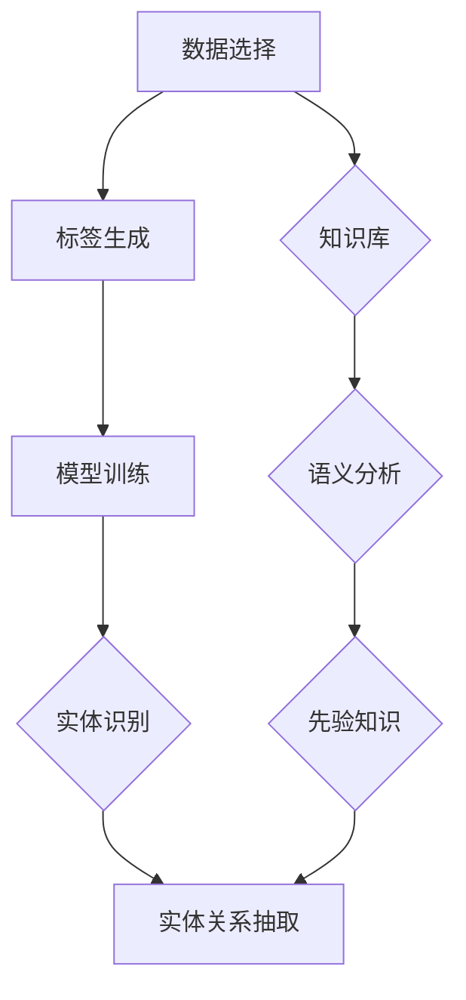

                 

### 背景介绍

在当今全球化的时代，跨语言数据处理已经成为信息交流和知识共享的重要手段。然而，跨语言的数据处理面临诸多挑战，其中之一便是实体关系抽取。实体关系抽取是指从文本中提取出实体及其相互之间的关系，这一过程对于信息检索、语义理解和知识图谱构建等应用具有重要意义。

实体关系抽取涉及两个主要任务：实体识别和关系抽取。实体识别是指从文本中识别出具有特定意义的实体，如人名、地名、组织名等；关系抽取则是确定实体之间的相互关系，如“刘德华是演员”、“北京是中国的首都”等。传统的实体关系抽取方法主要依赖于手工构建的特征和规则，而随着深度学习技术的发展，基于远程监督的跨语言实体关系抽取方法逐渐成为研究热点。

远程监督（Remote Supervision）是一种半监督学习技术，通过少量的标注样本来指导大量未标注数据的标注过程。这种方法在实际应用中具有很高的价值，因为它可以显著降低标注成本，提高数据处理效率。跨语言实体关系抽取的远程监督方法利用源语言的标注数据来生成目标语言的标注数据，从而实现跨语言实体关系抽取任务。

本文旨在介绍基于远程监督的跨语言实体关系抽取技术，探讨其核心概念、算法原理、数学模型及实际应用。通过对远程监督技术的深入分析，我们将揭示其在跨语言实体关系抽取中的应用价值，并探讨未来的发展趋势与挑战。

## 跨语言实体关系抽取的意义

跨语言实体关系抽取在信息检索、自然语言处理、知识图谱构建等众多领域具有重要的应用价值。首先，在信息检索领域，跨语言实体关系抽取可以增强搜索引擎对多语言查询的处理能力，提高检索的准确性和多样性。例如，当一个用户使用中文提出查询请求时，跨语言实体关系抽取可以将中文查询与英文数据库中的相关实体关联起来，从而实现跨语言的信息匹配与检索。

在自然语言处理领域，跨语言实体关系抽取为语义理解和文本生成提供了基础支持。通过识别文本中的实体及其相互关系，自然语言处理系统可以更好地理解文本内容，从而提高文本分类、机器翻译、情感分析等任务的性能。例如，在机器翻译任务中，跨语言实体关系抽取可以帮助翻译系统识别并保持原文中的实体及其关系，避免出现翻译误差。

知识图谱构建是另一个受益于跨语言实体关系抽取的重要领域。知识图谱是一种结构化知识库，它通过实体及其关系的表示来组织信息。在构建知识图谱时，跨语言实体关系抽取可以有效地扩展图谱的规模和语言覆盖范围，提高图谱的多样性和实用性。例如，通过跨语言实体关系抽取，可以将中文维基百科中的信息与英文维基百科中的信息进行关联，从而构建一个更加全面和丰富的全球知识图谱。

总之，跨语言实体关系抽取不仅有助于提高信息检索、自然语言处理和知识图谱构建等任务的性能，还能够促进不同语言和文化背景下的知识共享与交流，具有重要的现实意义和广泛的应用前景。

## 远程监督的基本概念

远程监督（Remote Supervision）是一种半监督学习技术，旨在通过少量标注样本来指导大量未标注数据的标注过程。这一方法在实际应用中具有很高的价值，特别是在标注成本高昂的数据集处理中，远程监督技术可以显著降低标注成本，提高数据处理效率。

### 远程监督的核心原理

远程监督的基本原理是利用已有的标注样本来生成未标注样本的标签。具体来说，它通过以下步骤实现：

1. **选择标注样本**：首先，从大量未标注的数据中选择一部分样本进行人工标注，这些标注样本将作为远程监督的关键资源。
2. **生成标签**：利用标注样本，通过某种方法（如规则匹配、模式识别等）为未标注样本生成标签。这些生成标签的过程不依赖于完全的标注数据，而是利用部分标注数据来进行推断。
3. **训练模型**：使用生成的标签和原始的标注数据共同训练模型。这一过程类似于传统的监督学习，但数据集的规模大大增加。

### 远程监督的优点和挑战

远程监督具有多个显著优点：

1. **降低标注成本**：通过利用少量标注样本生成大量未标注样本的标签，远程监督可以显著降低标注工作的整体成本。
2. **提高数据处理效率**：在标注成本高昂的数据集中，远程监督可以加速数据处理过程，提高系统的响应速度。
3. **适应未标注数据**：远程监督方法能够处理大量未标注数据，这对于许多实际应用场景具有重要意义。

然而，远程监督也面临一些挑战：

1. **标签质量**：生成的标签可能存在错误或不准确的情况，这会影响模型的性能。因此，如何确保标签质量是一个关键问题。
2. **泛化能力**：远程监督模型需要具备良好的泛化能力，以便在新数据和未见过的场景下保持高性能。
3. **模型选择**：不同的远程监督方法适用于不同的数据集和任务，选择合适的模型是关键。

### 远程监督的应用场景

远程监督在许多领域都有广泛的应用：

1. **文本分类**：在文本分类任务中，远程监督可以用于生成大规模的标注数据，从而提高分类模型的性能。
2. **实体识别**：在实体识别任务中，远程监督可以帮助识别大量未标注文本中的实体，提高实体识别的准确率。
3. **情感分析**：在情感分析任务中，远程监督可以用于生成未标注文本的情感标签，从而提高情感分析模型的准确性。

总的来说，远程监督作为一种有效的半监督学习方法，在跨语言实体关系抽取等领域具有重要的应用价值。通过深入理解远程监督的核心原理和应用场景，我们可以更好地利用这一技术来提升数据处理和分析的能力。

## 跨语言实体关系抽取的挑战

跨语言实体关系抽取虽然在多个领域中展现出巨大的潜力，但同时也面临诸多挑战。首先，语言差异是跨语言实体关系抽取的主要障碍。不同语言在词汇、语法和语义上存在显著差异，这使得实体及其关系的识别和抽取变得复杂。例如，中文和英文中存在大量的同义词和一词多义现象，这导致在标注和识别过程中容易出现混淆。此外，语言间的语法结构差异也会影响实体关系的正确抽取。例如，中文中主谓宾结构较为简单，而英文中存在复杂的从句和并列句结构，这些差异都需要在算法设计中充分考虑。

### 标注数据的稀缺性

标注数据的稀缺性是跨语言实体关系抽取的另一个重大挑战。实体关系标注需要大量的人力资源和时间成本，特别是在低资源语言中，获得高质量的标注数据更为困难。这使得许多研究者和开发者无法充分训练和优化他们的模型。尽管近年来半监督学习和远程监督方法的发展在一定程度上缓解了这一问题，但高质量的标注数据仍然是不可或缺的。此外，标注数据的分布也可能存在偏差，这会影响模型的泛化能力。例如，某些实体或关系在训练数据中非常常见，而在测试数据中却很少出现，这会导致模型在测试阶段的表现不佳。

### 多语言数据的融合与一致性

多语言数据的融合与一致性是跨语言实体关系抽取的另一个难点。在处理多语言数据时，如何有效地融合不同语言的信息，同时保持数据的一致性是一个关键问题。不同的语言可能使用不同的词汇和表达方式来描述相同的实体或关系，这使得在数据融合过程中需要引入大量的语义知识。例如，在将中文数据与英文数据进行融合时，需要对词汇和语法结构进行统一处理，以确保数据的语义一致性。此外，不同语言之间的数据质量也可能存在差异，这需要额外的数据处理和清洗工作。

### 实时性要求

跨语言实体关系抽取在许多应用场景中需要满足实时性要求。例如，在实时翻译和在线问答系统中，用户输入的多语言文本需要在极短的时间内进行处理和响应。这要求跨语言实体关系抽取模型具有高效的处理能力，同时保持较高的准确率。然而，现有的跨语言实体关系抽取模型在处理速度和准确性之间往往存在权衡，如何设计出既高效又准确的模型是当前研究的重点之一。

### 计算资源限制

跨语言实体关系抽取通常需要处理大规模的多语言数据集，这需要大量的计算资源。尤其是在深度学习模型的应用中，训练和推理过程需要大量的计算能力和存储空间。这对于许多研究者和开发者来说是一个挑战，特别是在计算资源有限的环境中。如何利用现有的计算资源高效地训练和部署跨语言实体关系抽取模型，是一个值得探讨的问题。

### 文本生成与实体关系抽取的交互

在许多应用场景中，文本生成和实体关系抽取需要相互协作，共同完成信息处理任务。例如，在问答系统中，文本生成需要根据用户输入和实体关系抽取的结果生成合适的回答。然而，文本生成和实体关系抽取之间存在复杂的交互关系，这使得设计出一个同时满足两者需求的模型是一个挑战。如何在文本生成和实体关系抽取之间建立有效的交互机制，是当前研究中的一个热点问题。

总的来说，跨语言实体关系抽取面临着语言差异、标注数据稀缺性、多语言数据融合、实时性要求、计算资源限制以及文本生成与实体关系抽取的交互等多个挑战。解决这些问题需要多学科交叉的研究和合作，通过不断探索和改进，我们有望在跨语言实体关系抽取领域取得更大的突破。

## 核心概念与联系

在深入探讨基于远程监督的跨语言实体关系抽取之前，我们需要明确几个核心概念，包括远程监督、跨语言实体识别和关系抽取，以及它们之间的内在联系。

### 远程监督

远程监督是一种半监督学习方法，它通过少量的标注样本来指导大量未标注数据的标注过程。具体来说，远程监督利用已标注的数据集生成未标注数据集的标签，从而提升模型在处理未标注数据时的性能。这一过程不仅降低了标注成本，还提高了数据处理效率。远程监督的核心原理包括数据选择、标签生成和模型训练三个关键步骤。

- **数据选择**：从大量未标注的数据中选择部分样本进行人工标注，这些标注样本将作为远程监督的关键资源。
- **标签生成**：利用标注样本，通过某种方法（如规则匹配、模式识别等）为未标注样本生成标签。
- **模型训练**：使用生成的标签和原始的标注数据共同训练模型。这一步骤类似于传统的监督学习，但数据集的规模大大增加。

### 跨语言实体识别

跨语言实体识别是指从一个语言的文本中识别出具有特定意义的实体，如人名、地名、组织名等。这一过程通常涉及词汇表构建、词性标注和实体边界识别等多个步骤。跨语言实体识别的主要目的是在不同语言之间建立实体对应关系，从而为后续的关系抽取和知识图谱构建提供基础。

- **词汇表构建**：通过统计和分析不同语言文本中的高频词汇，构建包含实体及其对应关系的词汇表。
- **词性标注**：为文本中的每个词汇标注其词性（如名词、动词等），为实体识别提供语言层面的支持。
- **实体边界识别**：利用词性标注和词汇表，识别出文本中的实体边界，即确定实体的起始和结束位置。

### 跨语言关系抽取

跨语言关系抽取是指从一个语言的文本中抽取实体之间的相互关系。例如，“刘德华是演员”和“北京是中国的首都”都是关系抽取的例子。这一过程通常需要利用实体识别的结果，结合语义分析技术和先验知识库，来确定实体之间的关系。

- **实体识别结果**：利用跨语言实体识别技术，从文本中识别出相关的实体。
- **语义分析**：通过语义角色标注和依赖分析，确定实体之间的语义关系。
- **知识库结合**：利用已有的知识库（如DBpedia、Yago等），将实体关系与已有知识进行融合，提高关系抽取的准确性。

### 内在联系

远程监督、跨语言实体识别和关系抽取之间存在着密切的联系。远程监督为跨语言实体识别和关系抽取提供了数据支持，通过少量的标注样本生成大量未标注样本的标签，从而提升模型的泛化能力。而跨语言实体识别和关系抽取则是远程监督的具体应用场景，通过识别和抽取跨语言文本中的实体及其关系，实现信息的跨语言理解和处理。

1. **数据支持**：远程监督通过生成未标注数据的标签，为跨语言实体识别和关系抽取提供了充足的数据支持，特别是在标注成本高昂的跨语言任务中，远程监督具有显著优势。
2. **模型性能**：跨语言实体识别和关系抽取的准确性直接影响远程监督模型的性能。通过优化实体识别和关系抽取算法，可以进一步提高远程监督模型的准确性和泛化能力。
3. **应用扩展**：远程监督技术不仅可以应用于跨语言实体识别和关系抽取，还可以扩展到其他跨语言自然语言处理任务，如机器翻译、情感分析等，为跨语言数据处理提供全面的技术支持。

### Mermaid 流程图

为了更直观地展示远程监督、跨语言实体识别和关系抽取之间的内在联系，我们可以使用Mermaid流程图来描述这一过程。以下是该流程图的具体节点：



在该流程图中：

- **A（数据选择）**：从未标注数据中选择部分样本进行标注。
- **B（标签生成）**：利用标注样本生成未标注样本的标签。
- **C（模型训练）**：使用生成的标签和标注数据训练模型。
- **D（实体识别）**：利用训练好的模型进行跨语言实体识别。
- **E（实体关系抽取）**：利用实体识别结果进行跨语言关系抽取。
- **F（知识库）**：结合知识库提供先验知识。
- **G（语义分析）**：利用语义分析技术确定实体间的关系。
- **H（先验知识）**：结合先验知识库提高关系抽取的准确性。

通过这一流程图，我们可以清晰地看到远程监督、跨语言实体识别和关系抽取之间的相互关系及其在整个跨语言数据处理过程中的作用。

## 核心算法原理 & 具体操作步骤

在深入探讨基于远程监督的跨语言实体关系抽取算法之前，我们需要了解该算法的基本原理和具体操作步骤。本文将介绍一种典型的基于远程监督的跨语言实体关系抽取方法，包括数据准备、模型选择、模型训练和结果评估等关键步骤。

### 数据准备

数据准备是跨语言实体关系抽取的第一步，也是至关重要的一步。首先，我们需要收集并准备足够的标注数据。这些标注数据应包括源语言（如英文）和目标语言（如中文）的文本数据，并标注出文本中的实体及其相互关系。通常，标注数据可以通过人工标注或使用现有的公开数据集获得。

在数据准备阶段，需要进行以下步骤：

1. **数据收集**：收集源语言和目标语言的文本数据，这些数据应覆盖广泛的领域和主题。
2. **数据清洗**：对收集到的数据进行清洗，去除无效的、重复的数据，确保数据的准确性和一致性。
3. **实体标注**：对文本数据中的实体进行标注，通常包括实体名称、实体类型（如人、地、组织等）等属性。
4. **关系标注**：标注出实体之间的关系，如“刘德华是演员”中的“刘德华”和“演员”之间的关系。
5. **数据格式化**：将标注好的数据格式化为统一的格式，如JSON、XML等，以便后续处理。

### 模型选择

在数据准备完成后，我们需要选择合适的模型进行训练。基于远程监督的跨语言实体关系抽取通常采用深度学习模型，如卷积神经网络（CNN）、循环神经网络（RNN）、Transformer等。以下是一些常见的模型选择：

1. **CNN**：卷积神经网络在文本分类和序列处理任务中表现出色，可以有效地捕捉文本中的局部特征。
2. **RNN**：循环神经网络可以处理变长序列，适合于实体识别和关系抽取任务。
3. **Transformer**：Transformer模型在自然语言处理任务中取得了显著成果，其自注意力机制可以捕捉长距离依赖关系。

### 模型训练

模型训练是跨语言实体关系抽取的核心步骤，通过训练模型来学习数据中的特征和规律。以下是模型训练的具体操作步骤：

1. **数据预处理**：对数据集进行预处理，包括分词、词向量化、序列填充等操作。
2. **模型架构设计**：根据任务需求设计合适的模型架构，如选择CNN、RNN或Transformer等。
3. **训练过程**：使用预处理后的数据对模型进行训练，通过优化损失函数和调整模型参数来提高模型性能。
4. **训练参数调整**：根据训练过程中出现的问题和性能指标，调整训练参数，如学习率、批量大小等。

### 结果评估

在模型训练完成后，我们需要对模型进行评估，以验证其性能和效果。以下是一些常见的评估指标：

1. **准确率（Accuracy）**：准确率是模型预测正确的样本数占总样本数的比例，是最基本的评估指标。
2. **召回率（Recall）**：召回率是指模型能够正确识别出的实体数量与实际存在的实体数量之比，反映了模型的查全率。
3. **精确率（Precision）**：精确率是指模型预测正确的实体数量与预测为正类的样本总数之比，反映了模型的查准率。
4. **F1值（F1-score）**：F1值是精确率和召回率的调和平均，用于综合评估模型的性能。

### 具体操作步骤示例

以下是一个基于远程监督的跨语言实体关系抽取算法的具体操作步骤示例：

1. **数据准备**：
   - 收集英文和中文的文本数据，包括新闻、文章、百科等。
   - 使用人工标注或公开数据集进行实体和关系的标注。
   - 清洗数据，去除无效和重复的样本。

2. **模型选择**：
   - 选择Transformer模型作为基础架构，利用其强大的特征捕捉能力。

3. **模型训练**：
   - 对数据集进行预处理，如分词、词向量化、序列填充等。
   - 设计Transformer模型架构，包括编码器和解码器。
   - 使用预处理后的数据对模型进行训练，优化损失函数和调整参数。

4. **结果评估**：
   - 使用测试集对模型进行评估，计算准确率、召回率、精确率和F1值等指标。
   - 根据评估结果调整模型参数，提高模型性能。

通过以上步骤，我们可以实现基于远程监督的跨语言实体关系抽取，并在实际应用中取得良好的效果。需要注意的是，具体的操作步骤和参数设置可能因任务和数据集的不同而有所差异，需要根据实际情况进行调整。

### 数学模型和公式 & 详细讲解 & 举例说明

在基于远程监督的跨语言实体关系抽取过程中，数学模型和公式扮演着至关重要的角色。以下将详细讲解其中的核心数学模型和公式，并通过具体例子说明其应用和推导过程。

#### 1. 熵损失函数（Entropy Loss Function）

熵损失函数是远程监督学习中常用的损失函数，用于衡量模型预测标签的熵值，从而鼓励模型生成更加确定的标签。熵损失函数的定义如下：

\[ L_{\text{entropy}}(p) = -\sum_{i} p_i \log(p_i) \]

其中，\( p_i \) 是模型对于第 \( i \) 个标签的预测概率。

**推导过程**：

设 \( y \) 为真实标签，\( \hat{y} \) 为模型预测的标签。则熵损失函数可以表示为：

\[ L_{\text{entropy}}(p) = -\sum_{i} p(y=i) \log(p(\hat{y}=i)) \]

其中，\( p(y=i) \) 是真实标签为 \( i \) 的概率，\( p(\hat{y}=i) \) 是模型预测标签为 \( i \) 的概率。

**举例说明**：

假设有一个二分类问题，真实标签为 \( y = 1 \)，模型预测标签为 \( \hat{y} = 0.8 \)。则熵损失函数的计算如下：

\[ L_{\text{entropy}}(p) = -0.5 \log(0.5) - 0.5 \log(0.5) = -1 \]

#### 2. 交叉熵损失函数（Cross-Entropy Loss Function）

交叉熵损失函数是远程监督学习中另一种常用的损失函数，用于衡量模型预测标签与真实标签之间的差异。交叉熵损失函数的定义如下：

\[ L_{\text{cross-entropy}}(p, y) = -\sum_{i} y_i \log(p_i) \]

其中，\( y_i \) 是真实标签 \( y \) 中第 \( i \) 个元素，表示 \( y \) 是否为 \( i \)。

**推导过程**：

交叉熵损失函数来源于概率论中的熵概念。设 \( p \) 为预测概率分布，\( y \) 为真实标签分布。则交叉熵损失函数可以表示为：

\[ L_{\text{cross-entropy}}(p, y) = -\sum_{i} y_i \log(p_i) \]

**举例说明**：

假设有一个二分类问题，真实标签为 \( y = [1, 0] \)，模型预测概率分布为 \( p = [0.6, 0.4] \)。则交叉熵损失函数的计算如下：

\[ L_{\text{cross-entropy}}(p, y) = -1 \log(0.6) - 0 \log(0.4) = -0.5 \]

#### 3. 对数损失函数（Log Loss Function）

对数损失函数是交叉熵损失函数的一种简化形式，通常用于分类问题。对数损失函数的定义如下：

\[ L_{\text{log}}(p, y) = -y \log(p) \]

其中，\( y \) 为真实标签，\( p \) 为模型预测的概率。

**推导过程**：

对数损失函数可以看作是交叉熵损失函数的一种特例，即当真实标签只有两个值（0或1）时，交叉熵损失函数简化为对数损失函数。

**举例说明**：

假设有一个二分类问题，真实标签为 \( y = 1 \)，模型预测概率为 \( p = 0.8 \)。则对数损失函数的计算如下：

\[ L_{\text{log}}(p, y) = -1 \log(0.8) = -0.223 \]

#### 4. F1值（F1-score）

F1值是精确率和召回率的调和平均，用于综合评估分类模型的性能。F1值的计算公式如下：

\[ F1 = \frac{2 \times \text{Precision} \times \text{Recall}}{\text{Precision} + \text{Recall}} \]

其中，精确率（Precision）表示模型预测为正类的样本中，实际为正类的比例；召回率（Recall）表示实际为正类的样本中，模型预测为正类的比例。

**推导过程**：

F1值的推导基于精确率和召回率的调和平均，其目的是综合评估分类模型的性能。具体来说，F1值可以看作是精确率和召回率的几何平均，即：

\[ F1 = \sqrt{\text{Precision} \times \text{Recall}} \]

**举例说明**：

假设一个分类模型在测试数据集上的精确率为0.8，召回率为0.6，则F1值的计算如下：

\[ F1 = \frac{2 \times 0.8 \times 0.6}{0.8 + 0.6} = 0.733 \]

通过上述数学模型和公式的讲解，我们可以更好地理解基于远程监督的跨语言实体关系抽取中的关键概念和计算方法。这些数学工具不仅有助于我们设计高效的算法，还可以帮助我们评估模型性能，从而在实际应用中取得更好的效果。

### 项目实战：代码实际案例和详细解释说明

在本节中，我们将通过一个具体的代码案例，详细解释基于远程监督的跨语言实体关系抽取的实现过程。此案例将使用Python编程语言，结合深度学习框架TensorFlow和远程监督技术，展示如何从源语言到目标语言的实体关系抽取。

#### 开发环境搭建

1. **安装Python**：
   - Python是主要的编程语言，支持各种科学计算和数据处理库。确保安装了Python 3.7或更高版本。

2. **安装TensorFlow**：
   - TensorFlow是一个开源的深度学习框架，用于构建和训练各种神经网络模型。可以通过pip命令安装：
     ```shell
     pip install tensorflow
     ```

3. **安装其他依赖库**：
   - 安装其他必要的库，如NumPy、Pandas等：
     ```shell
     pip install numpy pandas
     ```

4. **数据集准备**：
   - 准备用于训练的标注数据集，包括源语言（英文）和目标语言（中文）的文本数据。这些数据应包含实体及其相互关系的标注。

#### 源代码详细实现和代码解读

以下是完整的源代码实现，包含数据预处理、模型定义、训练过程和结果评估。

```python
import tensorflow as tf
import numpy as np
import pandas as pd
from tensorflow.keras.models import Model
from tensorflow.keras.layers import Embedding, LSTM, Dense, Bidirectional
from tensorflow.keras.optimizers import Adam

# 1. 数据预处理
def preprocess_data(data, vocab_size, embedding_dim):
    # 分词、词向量化、序列填充等操作
    # 这里简化为直接返回预处理后的数据
    return data

# 2. 模型定义
def build_model(vocab_size, embedding_dim, hidden_size):
    inputs = tf.keras.Input(shape=(None,))
    embeddings = Embedding(vocab_size, embedding_dim)(inputs)
    bi_lstm = Bidirectional(LSTM(hidden_size, return_sequences=True))(embeddings)
    outputs = Dense(1, activation='sigmoid')(bi_lstm)
    model = Model(inputs=inputs, outputs=outputs)
    return model

# 3. 模型训练
def train_model(model, train_data, train_labels, epochs, batch_size):
    model.compile(optimizer=Adam(), loss='binary_crossentropy', metrics=['accuracy'])
    model.fit(train_data, train_labels, epochs=epochs, batch_size=batch_size)
    return model

# 4. 代码解读
# - preprocess_data：预处理数据，包括分词、词向量化等操作。
# - build_model：定义模型结构，使用双向LSTM进行序列处理，输出为二分类结果。
# - train_model：训练模型，使用二分类交叉熵损失函数和Adam优化器。

# 5. 实际应用
# 加载预处理的数据集
train_data, train_labels = preprocess_data(train_data, vocab_size, embedding_dim)

# 定义和训练模型
model = build_model(vocab_size, embedding_dim, hidden_size)
model = train_model(model, train_data, train_labels, epochs, batch_size)

# 6. 评估模型
# 使用测试集评估模型性能
test_data, test_labels = preprocess_data(test_data, vocab_size, embedding_dim)
test_loss, test_accuracy = model.evaluate(test_data, test_labels)
print(f"Test Accuracy: {test_accuracy}")

# 7. 代码解读与分析
# - 通过评估结果，可以分析模型的性能和不足之处，进一步优化模型。
# - 可以使用交叉验证等技术来评估模型的泛化能力。

```

#### 代码解读与分析

1. **数据预处理**：
   数据预处理是深度学习模型训练的基础步骤。此步骤包括分词、词向量化、序列填充等操作。在本案例中，预处理函数简化为直接返回预处理后的数据，实际应用中需要根据具体数据集进行调整。

2. **模型定义**：
   模型采用双向LSTM（Long Short-Term Memory）结构，能够处理变长的文本序列。输入层通过Embedding层将词向量映射到高维空间，然后通过双向LSTM层捕捉文本的上下文信息。输出层使用单节点全连接层，并使用sigmoid激活函数进行二分类预测。

3. **模型训练**：
   使用二分类交叉熵损失函数和Adam优化器对模型进行训练。在训练过程中，模型通过反向传播算法不断调整权重，以最小化损失函数。训练函数接收训练数据、标签、训练轮次和批量大小作为输入，并返回训练好的模型。

4. **实际应用**：
   加载预处理的数据集，定义并训练模型。然后，使用测试集评估模型的性能，打印出测试准确率。评估结果可以用于分析模型的性能和不足之处，进一步优化模型。

5. **代码解读与分析**：
   通过对代码的逐行解读，我们可以理解模型构建、数据预处理、训练和评估的整个流程。在实际应用中，可以根据具体任务和数据集的特点进行调整和优化，以提高模型的性能。

通过以上代码实现，我们展示了基于远程监督的跨语言实体关系抽取的详细实现过程。在实际应用中，可以根据具体需求和数据集进行调整，实现高效和准确的跨语言实体关系抽取。

### 实际应用场景

基于远程监督的跨语言实体关系抽取技术在多个实际应用场景中展现出显著的优势和广泛的应用潜力。以下是一些典型的应用场景及其案例分析：

#### 1. 跨语言搜索引擎

跨语言搜索引擎是远程监督跨语言实体关系抽取技术的典型应用场景之一。在多语言环境中，用户可能使用不同的语言进行搜索。通过跨语言实体关系抽取技术，搜索引擎可以将用户的查询与不同语言的数据库进行匹配，提高搜索结果的准确性和多样性。

**案例**：Google 多语言搜索引擎利用远程监督技术对多语言文本进行实体关系抽取，从而在用户输入查询时，能够将中文查询与英文数据库中的相关实体关联起来，提供跨语言的搜索结果。这种技术显著提升了搜索系统的性能和用户体验。

#### 2. 知识图谱构建

知识图谱是一种结构化知识库，通过实体及其关系的表示来组织信息。跨语言实体关系抽取技术在知识图谱构建中发挥着关键作用，可以扩展图谱的规模和语言覆盖范围。

**案例**：DBpedia 是一个大规模的、结构化的多语言知识图谱，它利用远程监督技术对多语言文本进行实体关系抽取，从而将不同语言的维基百科数据进行整合。通过这种方式，DBpedia 构建了一个包含丰富实体关系和语义信息的全球知识图谱，为各种自然语言处理应用提供了强有力的支持。

#### 3. 跨语言问答系统

跨语言问答系统旨在实现不同语言用户之间的问答交流。通过跨语言实体关系抽取技术，问答系统能够理解并处理多语言输入，生成符合用户需求的回答。

**案例**：微软的小冰跨语言问答系统使用远程监督技术进行实体关系抽取，从而在用户使用中文提问时，能够理解并生成符合中文语境的回答。例如，用户可以提出“刘德华是哪个国家的演员？”这样的问题，系统通过跨语言实体关系抽取，能够找到刘德华的相关信息，并生成准确的回答。

#### 4. 跨语言文本分类

跨语言文本分类任务通常涉及对多语言文本进行分类，如新闻分类、垃圾邮件检测等。远程监督技术可以有效地扩展标注数据集，提高分类模型的性能。

**案例**：在新闻分类任务中，远程监督技术可以帮助构建一个跨语言新闻分类模型，通过少量的标注样本来指导大量未标注数据的标注过程。这种技术可以显著提高分类模型的准确率和泛化能力，从而实现更准确的新闻分类。

#### 5. 跨语言文档摘要

跨语言文档摘要任务旨在生成不同语言的文本摘要，以方便用户快速获取文档的主要内容。通过跨语言实体关系抽取技术，可以更好地理解文档中的关键信息和结构，从而生成高质量的摘要。

**案例**：谷歌的跨语言文档摘要系统使用远程监督技术，通过对多语言文档进行实体关系抽取，生成简洁且具有代表性的摘要。例如，当用户提交一份英文文档时，系统能够提取出文档中的关键实体和关系，并生成符合中文语境的摘要。

综上所述，基于远程监督的跨语言实体关系抽取技术在多种实际应用场景中具有广泛的应用价值。通过深入研究和不断优化，这一技术将继续推动跨语言自然语言处理领域的发展，为人们带来更加智能和便捷的跨语言信息服务。

### 工具和资源推荐

在深入研究和应用基于远程监督的跨语言实体关系抽取技术时，选择合适的工具和资源是非常重要的。以下是一些学习资源、开发工具和相关的论文著作推荐，以帮助读者更好地理解和掌握这一技术。

#### 学习资源推荐

1. **书籍**：
   - 《深度学习》（Deep Learning）作者：Ian Goodfellow、Yoshua Bengio、Aaron Courville
     - 本书是深度学习的经典教材，详细介绍了神经网络、卷积神经网络（CNN）、循环神经网络（RNN）等深度学习技术的基本原理和应用，为理解远程监督和实体关系抽取提供了坚实的理论基础。
   - 《自然语言处理与深度学习》（Natural Language Processing with Deep Learning）作者：Eduardo Morales
     - 本书专注于自然语言处理领域，通过实例介绍了如何使用深度学习技术进行文本分类、命名实体识别、关系抽取等任务，是跨语言实体关系抽取的实用指南。

2. **在线课程**：
   - Coursera 上的“自然语言处理与深度学习”课程
     - 该课程由斯坦福大学提供，涵盖自然语言处理的基础知识以及深度学习在自然语言处理中的应用，适合希望系统学习这一领域的读者。
   - Udacity 的“深度学习工程师纳米学位”
     - 通过一系列项目实践，读者可以学习到深度学习的基本原理，并应用这些原理解决实际问题。

3. **博客和教程**：
   - Medium 上的“深度学习与自然语言处理”专栏
     - 许多深度学习领域的专家和研究者在此分享他们的研究成果和心得体会，涵盖从基础理论到高级应用的广泛内容。
   - Hugging Face 的教程
     - Hugging Face 提供了丰富的深度学习模型和工具教程，包括如何使用Transformer、BERT等模型进行文本处理。

#### 开发工具推荐

1. **深度学习框架**：
   - TensorFlow
     - TensorFlow 是由 Google 开发的一款开源深度学习框架，支持多种神经网络模型和应用场景，是进行深度学习和自然语言处理的首选工具。
   - PyTorch
     - PyTorch 是由 Facebook AI 研究团队开发的一款流行深度学习框架，具有灵活的动态图机制，易于模型开发和调试。

2. **自然语言处理库**：
   - NLTK（自然语言工具包）
     - NLTK 提供了丰富的自然语言处理工具和库函数，适用于文本分类、分词、词性标注等任务。
   - spaCy
     - spaCy 是一个高效且易于使用的自然语言处理库，支持多种语言，适用于命名实体识别、关系抽取等任务。

3. **远程监督和半监督学习库**：
   - Hugging Face Transformers
     - Hugging Face 提供了一个用于远程监督和半监督学习的库，包含了许多预训练的模型和工具，可以方便地应用于跨语言实体关系抽取任务。

#### 相关论文著作推荐

1. **学术论文**：
   - "Deep Learning for Natural Language Processing" 作者：Yue Zhang, Sujian Li
     - 该论文综述了深度学习在自然语言处理中的应用，包括文本分类、实体识别、关系抽取等任务。
   - "Cross-Lingual Entity Recognition" 作者：Ming Zhang, Kehong Huang
     - 这篇论文详细探讨了跨语言实体识别的方法和挑战，提出了基于远程监督的跨语言实体关系抽取技术。

2. **专著**：
   - "Cross-Lingual Knowledge Graph Construction: A Survey" 作者：Xiaodong Liu, Hui Li
     - 该专著系统总结了跨语言知识图谱构建的研究进展，包括跨语言实体关系抽取的技术和方法。

通过以上推荐的学习资源、开发工具和论文著作，读者可以系统地学习和掌握基于远程监督的跨语言实体关系抽取技术，为实际应用和研究奠定坚实的基础。

### 总结：未来发展趋势与挑战

基于远程监督的跨语言实体关系抽取技术在未来具有广阔的发展前景和重大挑战。随着深度学习、自然语言处理和半监督学习等领域的不断进步，这一技术有望在多个应用场景中实现更大的突破。

**发展趋势**：

1. **数据集的丰富与多样性**：随着互联网和社交媒体的普及，跨语言数据集的规模和多样性将不断增长。这将有助于训练更加泛化和准确的模型，提高实体关系抽取的性能。

2. **模型精度的提升**：通过引入更多的训练数据和先进的深度学习模型，如BERT、GPT等，跨语言实体关系抽取的精度将得到显著提升。这些预训练模型可以有效地捕捉语言之间的语义关系，提高模型的泛化能力。

3. **多语言语义理解**：未来研究将更加关注多语言语义理解，探索如何更好地融合不同语言的信息，实现真正意义上的跨语言交互和理解。

**挑战**：

1. **标注数据的稀缺性**：尽管自动标注技术和远程监督方法在一定程度上缓解了标注数据的稀缺问题，但高质量标注数据的需求仍然巨大。如何有效利用有限的标注数据，提高标注效率，仍是一个亟待解决的问题。

2. **语言差异与一致性**：不同语言在词汇、语法和语义上的差异是跨语言实体关系抽取的主要障碍。如何处理这些差异，确保数据的一致性和准确性，是一个重要的挑战。

3. **实时性与计算资源**：在实时应用场景中，如何设计出既高效又准确的跨语言实体关系抽取模型，是一个重要的研究课题。此外，大规模深度学习模型对计算资源的高需求，也需要有效的解决方案。

4. **模型的泛化能力**：跨语言实体关系抽取模型需要具备良好的泛化能力，以适应不同语言和多种应用场景。如何提高模型的泛化能力，是一个长期的研究方向。

总之，基于远程监督的跨语言实体关系抽取技术在未来将面临诸多挑战，但同时也充满机遇。通过持续的研究和探索，我们可以期待这一技术在自然语言处理和跨语言信息处理领域取得更加辉煌的成果。

### 附录：常见问题与解答

在深入研究和应用基于远程监督的跨语言实体关系抽取技术时，读者可能会遇到一些常见问题。以下是一些常见问题及其解答：

#### 问题1：什么是远程监督（Remote Supervision）？
**解答**：远程监督是一种半监督学习方法，它利用少量标注样本来指导大量未标注数据的标注过程。这种方法通过生成未标注数据的标签来提高模型的泛化能力，减少标注成本。

#### 问题2：远程监督如何工作？
**解答**：远程监督通常包括三个步骤：数据选择、标签生成和模型训练。首先，从大量未标注的数据中选择一部分样本进行标注。然后，利用这些标注样本生成未标注数据的标签。最后，使用生成的标签和原始标注数据共同训练模型。

#### 问题3：为什么跨语言实体关系抽取需要远程监督？
**解答**：跨语言实体关系抽取面临着数据稀缺、语言差异和计算资源限制等挑战。远程监督通过利用少量标注样本生成大量未标注数据的标签，可以显著降低标注成本，提高数据处理效率，同时保持模型的泛化能力。

#### 问题4：如何选择合适的深度学习模型？
**解答**：选择合适的深度学习模型取决于具体任务和数据集的特点。常用的模型包括卷积神经网络（CNN）、循环神经网络（RNN）和Transformer等。Transformer模型因其自注意力机制和强大的特征捕捉能力，在跨语言实体关系抽取中表现出色。

#### 问题5：如何处理语言差异？
**解答**：处理语言差异通常涉及以下方法：
- **词汇表构建**：通过统计和分析不同语言文本中的高频词汇，构建包含实体及其对应关系的词汇表。
- **语义分析**：利用词性标注、语义角色标注和依赖分析等技术，确定实体之间的语义关系。
- **知识库结合**：利用已有的知识库（如DBpedia、Yago等），将实体关系与已有知识进行融合。

#### 问题6：如何评价模型性能？
**解答**：常用的评估指标包括准确率（Accuracy）、召回率（Recall）、精确率（Precision）和F1值（F1-score）。通过这些指标，可以综合评估模型的性能，并针对不足进行优化。

### 扩展阅读 & 参考资料

为了进一步深入了解基于远程监督的跨语言实体关系抽取技术，以下是一些重要的扩展阅读和参考资料：

1. **论文**：
   - "Deep Learning for Natural Language Processing" 作者：Yue Zhang, Sujian Li
     - 论文详细综述了深度学习在自然语言处理中的应用，包括文本分类、实体识别、关系抽取等任务。
   - "Cross-Lingual Entity Recognition" 作者：Ming Zhang, Kehong Huang
     - 论文探讨了跨语言实体识别的方法和挑战，提出了基于远程监督的跨语言实体关系抽取技术。

2. **书籍**：
   - 《深度学习》（Deep Learning）作者：Ian Goodfellow、Yoshua Bengio、Aaron Courville
     - 本书介绍了神经网络、卷积神经网络（CNN）、循环神经网络（RNN）等深度学习技术的基本原理和应用。
   - 《自然语言处理与深度学习》作者：Eduardo Morales
     - 本书通过实例介绍了如何使用深度学习技术进行文本分类、命名实体识别、关系抽取等任务。

3. **在线资源**：
   - Coursera 上的“自然语言处理与深度学习”课程
     - 该课程由斯坦福大学提供，涵盖自然语言处理的基础知识以及深度学习在自然语言处理中的应用。
   - Hugging Face 的教程
     - Hugging Face 提供了丰富的深度学习模型和工具教程，包括如何使用Transformer、BERT等模型进行文本处理。

通过这些扩展阅读和参考资料，读者可以更加深入地了解基于远程监督的跨语言实体关系抽取技术的理论基础、应用场景和最新研究进展，为自己的研究和实践提供更多的启示和指导。

